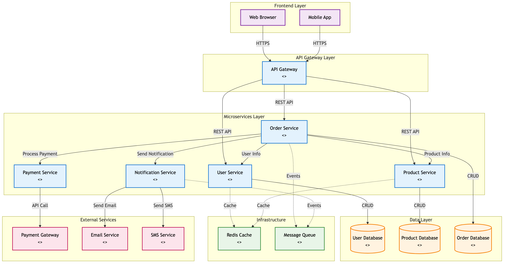

# Component Diagrams Guide

## 📋 **What is a Component Diagram?**

A **Component Diagram** shows the **high-level architecture** of your system - how different components (modules, services, libraries) are organized and how they interact with each other.

Think of it as a **blueprint** showing the major building blocks of your application and their dependencies.

---

## 🎯 **Key Concepts**

### **Component**
- A **modular unit** of the system
- Has a **well-defined interface**
- Can be **independently developed** and **deployed**
- Examples: Services, Libraries, Modules, JAR files

### **Interface**
- **Contract** that defines what a component provides or requires
- **Provided Interface**: Services the component offers (lollipop symbol ⚬)
- **Required Interface**: Services the component needs (socket symbol ⚬)

### **Dependency**
- **Uses** relationship between components
- Shows which components depend on others

---

## 🏗️ **Component Diagram Elements**

### **Visual Notation**

```
┌─────────────────┐
│   <<component>> │  ← Stereotype
│   UserService   │  ← Component Name
├─────────────────┤
│ + registerUser()│  ← Provided Operations
│ + validateUser()│
└─────────────────┘
        │
        │ ← Dependency Arrow
        ▼
┌─────────────────┐
│   <<component>> │
│ UserRepository  │
└─────────────────┘
```

### **Interface Symbols**
- **Provided Interface**: `⚬─` (lollipop) - "I provide this service"
- **Required Interface**: `─⚬` (socket) - "I need this service"
- **Assembly Connector**: `⚬─────⚬` - Interface connection

---

## ☕ **Java Examples**

### **1. Microservices Architecture**

```java
// User Service Component
@RestController
@Component
public class UserService {
    @Autowired
    private UserRepository userRepository;  // Required interface
    
    @PostMapping("/users")
    public User createUser(@RequestBody User user) {  // Provided interface
        return userRepository.save(user);
    }
}

// User Repository Component  
@Repository
@Component
public class UserRepository {
    public User save(User user) { ... }  // Provided interface
    public User findById(Long id) { ... }
}
```

**Component Diagram:**
```
┌─────────────────┐    ┌─────────────────┐
│   <<service>>   │    │  <<repository>> │
│   UserService   │───→│ UserRepository  │
│                 │    │                 │
│ ⚬─ REST API     │    │ ⚬─ Data Access  │
└─────────────────┘    └─────────────────┘
```

### **2. Layered Architecture**

```java
// Presentation Layer
@Controller
public class UserController {
    @Autowired
    private UserService userService;  // Requires Service Layer
}

// Business Layer
@Service
public class UserService {
    @Autowired
    private UserRepository userRepository;  // Requires Data Layer
}

// Data Layer
@Repository
public class UserRepository {
    // No dependencies on upper layers
}
```

**Component Diagram:**
```
┌─────────────────┐
│  <<controller>> │
│ UserController  │
└─────────┬───────┘
          │ depends on
          ▼
┌─────────────────┐
│   <<service>>   │
│   UserService   │
└─────────┬───────┘
          │ depends on
          ▼
┌─────────────────┐
│  <<repository>> │
│ UserRepository  │
└─────────────────┘
```

### **3. Plugin Architecture**

```java
// Core Component
public interface PaymentProcessor {
    void processPayment(Payment payment);
}

// Plugin Components
@Component("creditCard")
public class CreditCardProcessor implements PaymentProcessor { ... }

@Component("paypal") 
public class PayPalProcessor implements PaymentProcessor { ... }

// Main Application
@Service
public class OrderService {
    @Autowired
    private Map<String, PaymentProcessor> processors;  // Plugin injection
}
```

**Component Diagram:**
```
┌─────────────────┐
│   <<service>>   │
│   OrderService  │
└─────────┬───────┘
          │ uses
          ▼
┌─────────────────┐
│  <<interface>>  │
│PaymentProcessor │
└─────────┬───────┘
          │ implemented by
    ┌─────┼─────┐
    ▼     ▼     ▼
┌─────────┐ ┌─────────┐
│CreditCard│ │ PayPal  │
│Processor │ │Processor│
└─────────┘ └─────────┘
```

---

## 🎯 **When to Use Component Diagrams**

### **Perfect For:**
- ✅ **System Architecture** overview
- ✅ **Microservices** design
- ✅ **Module dependencies** planning
- ✅ **Deployment** planning
- ✅ **Team boundaries** definition
- ✅ **Integration** points identification

### **Not Ideal For:**
- ❌ **Detailed class relationships** (use Class Diagrams)
- ❌ **Sequence of operations** (use Sequence Diagrams)
- ❌ **State transitions** (use State Diagrams)
- ❌ **Low-level implementation** details

---

## 🏢 **Real-World Examples**

### **Complete E-commerce Component Architecture**



**This diagram shows:**
- **Frontend Layer**: Web and Mobile clients
- **API Gateway**: Single entry point for all requests
- **Microservices**: Independent, focused services
- **Data Layer**: Service-specific databases
- **External Services**: Third-party integrations
- **Infrastructure**: Caching and messaging systems

**Key Design Principles Demonstrated:**
- **Separation of Concerns**: Each service has a single responsibility
- **Loose Coupling**: Services communicate through well-defined APIs
- **Independence**: Each service can be developed and deployed separately
- **Scalability**: Components can be scaled independently based on load

### **E-commerce System Architecture**

```
┌─────────────────┐    ┌─────────────────┐    ┌─────────────────┐
│   <<service>>   │    │   <<service>>   │    │   <<service>>   │
│   Web Gateway   │───→│ Product Service │    │ Order Service   │
│                 │    │                 │    │                 │
│ ⚬─ HTTP API     │    │ ⚬─ Product API  │    │ ⚬─ Order API    │
└─────────────────┘    └─────────────────┘    └─────┬───────────┘
          │                       │                   │
          │ depends on            │ depends on        │ depends on
          ▼                       ▼                   ▼
┌─────────────────┐    ┌─────────────────┐    ┌─────────────────┐
│  <<service>>    │    │  <<service>>    │    │  <<service>>    │
│ User Service    │    │Inventory Service│    │Payment Service  │
│                 │    │                 │    │                 │
│ ⚬─ User API     │    │ ⚬─ Stock API    │    │ ⚬─ Payment API  │
└─────────────────┘    └─────────────────┘    └─────────────────┘
          │                       │                   │
          │                       │                   │
          ▼                       ▼                   ▼
┌─────────────────┐    ┌─────────────────┐    ┌─────────────────┐
│  <<database>>   │    │  <<database>>   │    │  <<external>>   │
│   User DB       │    │ Inventory DB    │    │ Payment Gateway │
└─────────────────┘    └─────────────────┘    └─────────────────┘
```

### **Spring Boot Application Structure**

```
┌─────────────────┐
│  <<external>>   │
│   Web Browser   │
└─────────┬───────┘
          │ HTTP requests
          ▼
┌─────────────────┐
│  <<component>>  │
│ Spring Boot Web │
│    Container    │
└─────────┬───────┘
          │ delegates to
          ▼
┌─────────────────┐    ┌─────────────────┐    ┌─────────────────┐
│ <<controller>>  │    │   <<service>>   │    │ <<repository>>  │
│UserController   │───→│  UserService    │───→│UserRepository   │
│                 │    │                 │    │                 │
│ ⚬─ REST API     │    │ ⚬─ Business API │    │ ⚬─ Data API     │
└─────────────────┘    └─────────────────┘    └─────────┬───────┘
                                                        │ persists to
                                                        ▼
                                              ┌─────────────────┐
                                              │  <<database>>   │
                                              │   PostgreSQL    │
                                              └─────────────────┘
```

---

## 🎨 **Creating Component Diagrams**

### **Step-by-Step Process:**

**1. Identify Major Components**
```
- What are the main modules/services?
- What are the external systems?
- What are the shared libraries?
```

**2. Define Interfaces**
```
- What does each component provide?
- What does each component require?
- How do they communicate?
```

**3. Show Dependencies**
```
- Which components depend on others?
- Are there circular dependencies?
- Can components be deployed independently?
```

**4. Add Deployment Information**
```
- Which components run together?
- What are the network boundaries?
- Where are the databases/external services?
```

---

## ⚠️ **Common Mistakes**

### **❌ Don't:**
- Show **classes** instead of **components**
- Include **implementation details**
- Create **circular dependencies**
- Mix **different abstraction levels**
- Show **every single dependency**

### **✅ Do:**
- Focus on **architectural components**
- Show **key interfaces**
- Keep it **high-level**
- Use **consistent stereotypes**
- Group **related components**

---

## 🆚 **Component vs Other Diagrams**

| Aspect | Component Diagram | Class Diagram | Deployment Diagram |
|--------|-------------------|---------------|-------------------|
| **Focus** | Architecture & Dependencies | Object Structure | Physical Infrastructure |
| **Level** | High-level modules | Low-level classes | Infrastructure |
| **Shows** | Services, APIs, Interfaces | Attributes, Methods | Servers, Networks |
| **When** | System design | Detailed design | Infrastructure planning |

---

## 🎯 **Interview Tips**

### **When Asked About Component Diagrams:**

**Good Answer Structure:**
1. **"Component diagrams show system architecture..."**
2. **"They help visualize dependencies between..."**
3. **"I use them when designing microservices..."**
4. **"They're different from class diagrams because..."**
5. **"Here's an example from my recent project..."**

### **Sample Question:**
*"How would you design the component architecture for a social media platform?"*

**Good Response:**
```
1. Identify core components: User Service, Post Service, Feed Service, etc.
2. Define interfaces: REST APIs, message queues, databases
3. Show dependencies: Feed Service depends on User & Post Services
4. Consider deployment: Each service can be independently deployed
5. Add external components: CDN, notification service, analytics
```

---

## 🚀 **Key Takeaways**

- **Component Diagrams** show **system architecture** and **dependencies**
- Focus on **high-level modules**, not individual classes
- Use **interfaces** to show how components communicate
- Essential for **microservices**, **modular systems**, and **team planning**
- Different from **Class Diagrams** (architecture vs object design)
- Critical for **system design interviews** and **architectural discussions**

Component diagrams are your **blueprint for building scalable, maintainable systems**! 🏗️✨
