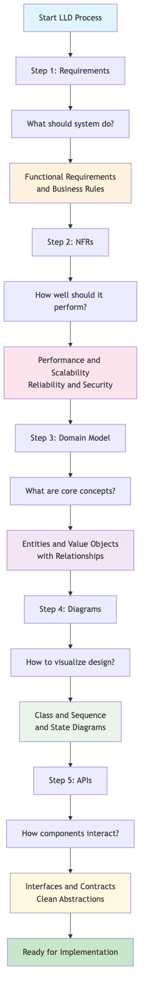

# Day 1: The LLD Process - Requirements → NFRs → Domain → Diagrams → APIs

## 🎯 **Learning Objectives**
By the end of Day 1, you should understand:
- The systematic approach to Low-Level Design
- What each step in the process accomplishes
- Why this order matters for successful system design
- The terminology and concepts used in LLD interviews

---

## 📋 **Step 1: Requirements**

### **What are Requirements?**
Requirements define **WHAT** the system should do, not **HOW** it should do it.

### **Types of Requirements:**

#### **Functional Requirements**
- **Definition**: What the system must DO
- **Focus**: Features, behaviors, operations
- **Examples**:
  - "Users can log in with email and password"
  - "System sends email notifications for orders"
  - "Admin can view sales reports"

##### Features vs Behaviors vs Operations
- **Feature (what/value)**: User-visible capability or outcome.
- **Behavior (when/how it reacts)**: Rules, flows, and state changes in response to events.
- **Operation (how it’s invoked)**: Concrete actions/APIs/methods that implement behaviors.

**How they relate**
- Features are realized by one or more behaviors.
- Behaviors are enacted through one or more operations (APIs/methods).

**Library quick mapping**
- **Feature**: Borrow books
- **Behaviors**: Prevent borrowing when book is unavailable; enforce max 5 active loans; set due dates; compute overdue fines.
- **Operations**: `borrowBook(userId, bookId) -> Loan | BookNotAvailable`, `returnBook(loanId)`, `getUserLoans(userId)`

#### **Business Rules**
- **Definition**: Constraints and policies that govern system behavior
- **Focus**: Logic, validations, workflows
- **Examples**:
  - "Orders over $100 get free shipping"
  - "Users can only cancel orders within 30 minutes"
  - "Premium users get priority customer support"

### **How to Gather Requirements:**
1. **Ask "What" questions**: What should users be able to do?
2. **Identify actors**: Who will use the system?
3. **Define use cases**: What are the main workflows?
4. **Clarify edge cases**: What happens when things go wrong?

### **Professional Use Case Template:**
```
Title: [Short, action-oriented name]
Actor(s): [Who initiates/participates - user/system/external service]
Preconditions: [What must be true before starting]
Trigger: [Event that starts the flow - button click, timer, message]
Main flow: [Happy path steps from trigger to goal]
  1. [Step 1]
  2. [Step 2]
  ...
Alternate/Error flows: [Branches for choices, edge cases, failures]
  - If [condition] → [outcome/error]
  - If [condition] → [outcome/error]
Postconditions: [What must be true after completion]
Operation(s): [API signature with inputs, outputs, errors]
  methodName(params) -> ReturnType | ErrorType1 | ErrorType2
Acceptance criteria: [Testable scenarios - Given/When/Then format]
  - Given [context], when [action], then [outcome]
  - Given [context], when [action], then [outcome]
```

### **Requirements Example - Simple Library System:**

#### **High-Level Functional Requirements:**
```
- Users can search for books by title, author, or ISBN
- Users can borrow available books
- Users can return borrowed books
- Librarians can add new books to the catalog
- System tracks due dates and overdue books
```

#### **Business Rules:**
```
- Users can borrow maximum 5 books at a time
- Loan period is 14 days
- Overdue books incur $0.50/day fine
- Books must be available to be borrowed
```

#### **Professional Use Case Specification:**

**Use Case: Borrow Book**
- **Title**: Borrow book
- **Actor(s)**: Member, System
- **Preconditions**: Member active; book exists and available
- **Trigger**: Member clicks "Borrow" or scans book barcode
- **Main flow**: 
  1. Validate member status
  2. Check book availability
  3. Verify member hasn't exceeded loan limit
  4. Create loan record
  5. Set due date (14 days from today)
  6. Update book status to "borrowed"
  7. Send confirmation to member
- **Alternate/Error flows**: 
  - If book unavailable → return "BookNotAvailable"
  - If member at limit → return "LoanLimitExceeded"
  - If member suspended → return "MemberSuspended"
- **Postconditions**: Loan created, book marked borrowed, due date set
- **Operation(s)**: `borrowBook(userId, bookId) -> Loan | BookNotAvailable | LoanLimitExceeded | MemberSuspended`
- **Acceptance criteria**:
  - Given available book, when active member borrows, then loan created with due date 14 days ahead
  - Given member with 5 active loans, when borrowing, then receive "LoanLimitExceeded" and no loan created
  - Given suspended member, when attempting borrow, then receive "MemberSuspended" error

**Use Case: Return Book**
- **Title**: Return book
- **Actor(s)**: Member, Librarian, System
- **Preconditions**: Book is currently borrowed by member
- **Trigger**: Member returns book or librarian processes return
- **Main flow**:
  1. Scan book barcode
  2. Locate active loan record
  3. Calculate any overdue fines
  4. Update loan as returned
  5. Update book status to "available"
  6. Process fine payment if applicable
  7. Send return confirmation
- **Alternate/Error flows**:
  - If book damaged → create damage report, apply damage fee
  - If book not found in system → return "BookNotFound"
  - If no active loan → return "NoActiveLoan"
- **Postconditions**: Loan closed, book available, fines processed
- **Operation(s)**: `returnBook(bookId, condition) -> ReturnReceipt | BookNotFound | NoActiveLoan`
- **Acceptance criteria**:
  - Given borrowed book returned on time, when processed, then loan closed and book available
  - Given overdue book, when returned, then fine calculated at $0.50/day and loan closed
  - Given damaged book, when returned, then damage fee added to member account

---

## ⚡ **Step 2: Non-Functional Requirements (NFRs)**

### **What are NFRs?**
NFRs define **HOW WELL** the system should perform, not what it should do.

### **Key NFR Categories:**

#### **Performance**
- **Response Time**: How fast should operations complete?
- **Throughput**: How many operations per second?
- **Examples**: "Search results in < 200ms", "Handle 1000 concurrent users"

#### **Scalability**
- **Horizontal**: Adding more servers
- **Vertical**: Adding more power to existing servers
- **Examples**: "Support 1M users", "Handle 10x traffic during peak"

#### **Reliability**
- **Availability**: System uptime percentage
- **Fault Tolerance**: Graceful handling of failures
- **Examples**: "99.9% uptime", "No data loss during failures"

#### **Security**
- **Authentication**: Who can access?
- **Authorization**: What can they access?
- **Examples**: "Encrypted data transmission", "Role-based access control"

#### **Maintainability**
- **Modularity**: Easy to modify components
- **Testability**: Easy to verify correctness
- **Examples**: "Deploy new features without downtime", "Comprehensive test coverage"

### **Professional NFRs Example - Library System:**

#### **Performance Requirements:**
```
Response Time:
- Book search: < 200ms (95th percentile)
- Book checkout: < 1.5s end-to-end
- User login: < 500ms

Throughput:
- 1,000 concurrent active users
- 10,000 searches per minute
- 500 checkouts per hour during peak

Load Capacity:
- 100,000 books in catalog
- 50,000 registered members
- 5,000 simultaneous sessions
```

#### **Scalability Requirements:**
```
Horizontal Scaling:
- Support 10x user growth (500K members)
- Multi-library deployment (50+ branches)
- Geographic distribution across regions

Vertical Scaling:
- 1M+ books in catalog
- 100TB+ digital content storage
- 99.99% uptime during scale events
```

#### **Reliability & Availability:**
```
Uptime: 99.9% (8.76 hours downtime/year)
Recovery: RTO < 4 hours, RPO < 1 hour
Backup: Real-time replication + daily snapshots
Monitoring: 24/7 alerting with <5 min detection
Disaster Recovery: Hot standby in secondary region
```

#### **Security Requirements:**
```
Authentication: Multi-factor for admin, SSO integration
Authorization: Role-based access (Member/Librarian/Admin)
Data Protection: AES-256 encryption at rest, TLS 1.3 in transit
Audit: Complete transaction logging with 7-year retention
Compliance: GDPR, SOX compliance for financial transactions
Penetration Testing: Quarterly security assessments
```

---

## 🏗️ **Step 3: Domain Modeling**

### **What is Domain Modeling?**
Domain modeling identifies the **core concepts** and **relationships** in your problem space.

### **Key Concepts:**

#### **Entities**
- **Definition**: Objects with unique identity that persist over time
- **Characteristics**: Have identity, mutable, lifecycle management
- **Examples**: User, Order, Product, Account

#### **Value Objects**
- **Definition**: Objects defined by their attributes, not identity
- **Characteristics**: Immutable, replaceable, no identity
- **Examples**: Money, Address, Email, PhoneNumber

#### **Relationships**
- **One-to-One**: User ↔ Profile
- **One-to-Many**: Customer → Orders
- **Many-to-Many**: Students ↔ Courses

### **Domain Modeling Process:**
1. **Identify Nouns**: What are the "things" in your system?
2. **Find Verbs**: What actions can be performed?
3. **Determine Relationships**: How do things connect?
4. **Define Attributes**: What properties do things have?

### **Domain Model Example - Library System:**
```
Entities:
- User (id, name, email, membershipDate)
- Book (id, isbn, title, author, publishedDate)
- Loan (id, borrowDate, dueDate, returnDate)

Value Objects:
- ISBN (value, validation)
- Money (amount, currency)
- Address (street, city, zipCode)

Relationships:
- User can have many Loans (1:N)
- Book can have many Loans (1:N)
- Loan belongs to one User and one Book (N:1)
```

---

## 📊 **Step 4: Diagrams**

### **What are UML Diagrams?**
Visual representations that help communicate system design.

### **Types of Diagrams:**

#### **Class Diagrams**
- **Purpose**: Show static structure - classes, attributes, methods, relationships
- **When to use**: Define domain model, show system architecture
- **Elements**: Classes, interfaces, inheritance, associations

#### **Sequence Diagrams**
- **Purpose**: Show interactions over time between objects
- **When to use**: Illustrate use cases, API flows, complex workflows
- **Elements**: Actors, objects, messages, lifelines

#### **State Diagrams**
- **Purpose**: Show how objects change state in response to events
- **When to use**: Model entity lifecycles, workflow states
- **Elements**: States, transitions, events, guards

### **When to Use Each Diagram:**
```
Class Diagram:
✓ Designing domain model
✓ Showing system architecture
✓ Documenting APIs and interfaces

Sequence Diagram:
✓ Explaining use case flows
✓ API interaction patterns
✓ Complex business processes

State Diagram:
✓ Order status transitions
✓ User account states
✓ Payment processing flows
```

---

## 🔌 **Step 5: APIs**

### **What are APIs in LLD?**
APIs define the **contracts** between different parts of your system.

### **API Design Principles:**

#### **Single Responsibility**
- Each interface should have one clear purpose
- Avoid "God" interfaces that do everything

#### **Interface Segregation**
- Create specific interfaces for different clients
- Don't force clients to depend on methods they don't use

#### **Dependency Inversion**
- Depend on abstractions, not concrete implementations
- Use interfaces to decouple components

### **API Design Process:**
1. **Identify Services**: What major capabilities does your system need?
2. **Define Interfaces**: What operations should each service expose?
3. **Specify Contracts**: What are the inputs, outputs, and exceptions?
4. **Consider Clients**: Who will use these APIs and how?

### **API Example - Library System:**
```java
// Service Interface
public interface LibraryService {
    List<Book> searchBooks(String query);
    Loan borrowBook(UserId userId, BookId bookId) throws BookNotAvailableException;
    void returnBook(LoanId loanId) throws InvalidLoanException;
    List<Loan> getUserLoans(UserId userId);
}

// Strategy Interface
public interface FineCalculator {
    Money calculateFine(Loan loan, LocalDate returnDate);
}

// Repository Interface
public interface BookRepository {
    Optional<Book> findById(BookId id);
    List<Book> findByTitleContaining(String title);
    void save(Book book);
}
```

---

## 🔄 **Why This Order Matters**

### **Requirements First**
- Understand the problem before designing solutions
- Prevents over-engineering and scope creep

### **NFRs Early**
- Influences architectural decisions
- Helps choose appropriate technologies and patterns

### **Domain Modeling**
- Creates shared vocabulary
- Identifies core business concepts

### **Diagrams for Communication**
- Visualizes complex relationships
- Facilitates team discussions

### **APIs Last**
- Based on solid understanding of domain
- Reflects actual system needs, not assumptions

---

## 🎓 **Day 1 Summary**

You now understand:
- ✅ **Requirements**: Functional requirements and business rules
- ✅ **NFRs**: Performance, scalability, reliability, security
- ✅ **Domain Modeling**: Entities, value objects, relationships
- ✅ **Diagrams**: Class, sequence, and state diagrams
- ✅ **APIs**: Clean interface design principles

### **Next Steps**
- **Day 2**: Apply SOLID principles to improve designs
- **Day 3**: Practice creating UML diagrams
- **Day 4**: Deep dive into entities vs value objects
- **Day 5**: Master error handling and validation
- **Weekend**: Apply everything to build a complete parking lot system

This systematic approach will serve you well in LLD interviews and real system design!

---

## 📊 **Visual Process Flow**



*The systematic 5-step LLD process from requirements to APIs*
