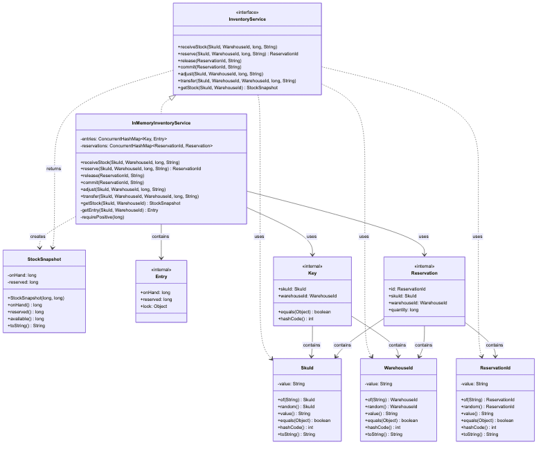
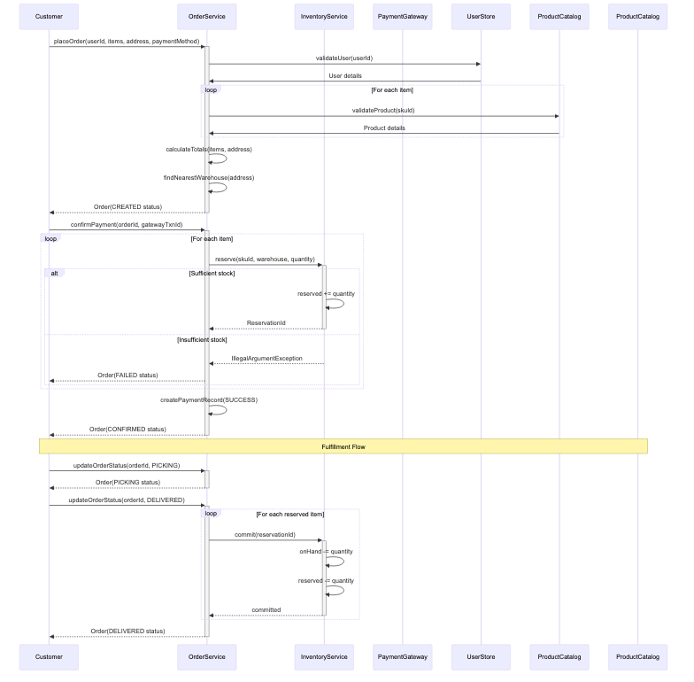
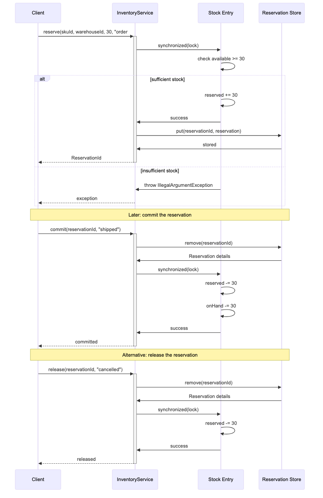
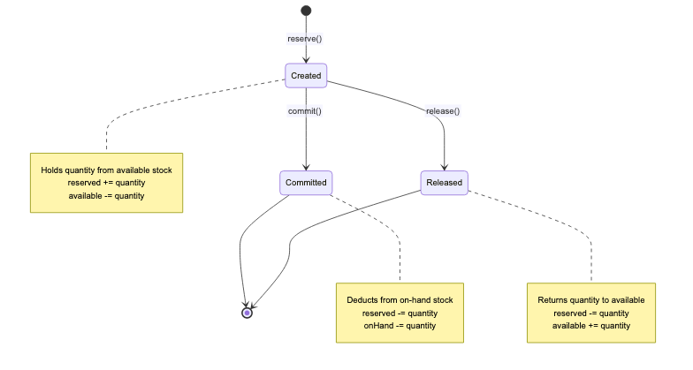
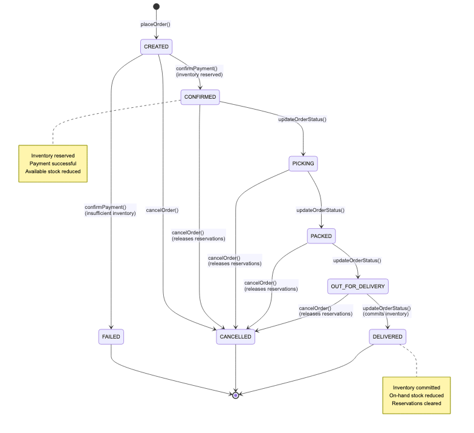

# E-Commerce Inventory Management System (Zepto/Amazon-style)

Complete end-to-end inventory and order management system with realistic e-commerce flows: product catalog, user management, order placement, payment processing, inventory reservations, and fulfillment tracking.

## System Components

### Core Inventory Management
- On-hand, reserved, available tracking per `(SKU, Warehouse)`.
- Reservations are idempotent holds that reduce availability but not on-hand until commit.
- Commit reduces on-hand; release returns to availability.
- Adjust supports positive/negative deltas without violating `reserved <= onHand`.
- Transfer moves available stock atomically between warehouses.
- Concurrency-safe operations for unit-level contention.

### Product Catalog
- Product master data with SKU, pricing, categorization, brand, and perishability.
- Product status management (ACTIVE, DISCONTINUED, OUT_OF_STOCK, SEASONAL).
- Category-based organization for easy browsing and filtering.

### User Management
- User profiles with multiple delivery addresses and geolocation.
- User status tracking (ACTIVE, SUSPENDED, INACTIVE).
- Address-based warehouse routing for optimal fulfillment.

### Order Management
- Complete order lifecycle from placement to delivery.
- Line item management with product details and pricing.
- Order status transitions with proper inventory coordination.
- Payment integration with multiple methods (UPI, Cards, COD, etc.).

### Payment Processing
- Multi-method payment support with gateway integration.
- Payment status tracking and transaction reconciliation.
- Automatic refund handling for cancelled orders.

## Order Flow States
1. **CREATED** - Order placed, payment pending
2. **CONFIRMED** - Payment successful, inventory reserved
3. **PICKING** - Items being picked from warehouse
4. **PACKED** - Ready for dispatch
5. **OUT_FOR_DELIVERY** - With delivery partner
6. **DELIVERED** - Successfully delivered (inventory committed)
7. **CANCELLED** - Cancelled (inventory released)
8. **FAILED** - Failed due to payment/inventory issues

## APIs
- `InventoryService`: Core inventory operations (reserve, commit, transfer, etc.)
- `OrderService`: End-to-end order orchestration and lifecycle management

## Diagrams

### **Class Diagram**

- Source: `docs/inventory/diagrams/class.mmd`

### **Sequence Diagrams**

*Complete order placement and fulfillment flow*


*Inventory reservation and commitment process*


*Inter-warehouse inventory transfer*

### **State Machine Diagrams**

*Inventory reservation lifecycle*


*Order status transitions*

## Usage Example

```java
InventoryService inventory = new InMemoryInventoryService();
SkuId milk = SkuId.of("MILK-1L");
WarehouseId blrA = WarehouseId.of("BLR-A");

// Receive stock
inventory.receiveStock(milk, blrA, 100, "initial");

// Reserve for order
ReservationId reservation = inventory.reserve(milk, blrA, 30, "order#123");

// Commit when shipped
inventory.commit(reservation, "shipped");

// Check remaining stock
StockSnapshot stock = inventory.getStock(milk, blrA);
// stock.onHand() = 70, stock.available() = 70
```

## Testing
Run tests: `mvn test -Dtest=InventoryServiceTest`
