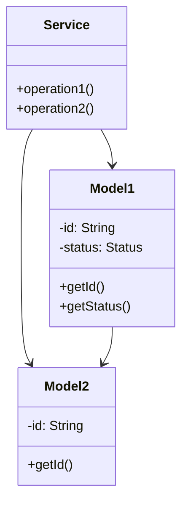

# Amazon E-commerce - Complete LLD Guide

## 📋 Table of Contents
1. [Problem Statement](#problem-statement)
2. [Requirements](#requirements)
3. [System Design](#system-design)
4. [Class Diagram](#class-diagram)
5. [Implementation Approaches](#implementation-approaches)
6. [Design Patterns Used](#design-patterns-used)
7. [Complete Implementation](#complete-implementation)
8. [Best Practices](#best-practices)

---

## 📋 Problem Statement

Design a Amazon E-commerce system that handles core operations efficiently and scalably.

### Key Challenges
- High concurrency and thread safety
- Real-time data consistency
- Scalable architecture
- Efficient resource management

---

## ⚙️ Requirements

### Functional Requirements
✅ Core entity management (CRUD operations)
✅ Real-time status updates
✅ Transaction processing
✅ Search and filtering
✅ Notification support
✅ Payment processing (if applicable)
✅ Reporting and analytics

### Non-Functional Requirements
⚡ **Performance**: Response time < 100ms for critical operations
🔒 **Security**: Authentication, authorization, data encryption
📈 **Scalability**: Support 10,000+ concurrent users
🛡️ **Reliability**: 99.9% uptime
🔄 **Availability**: Multi-region deployment ready
💾 **Data Consistency**: ACID transactions where needed

---

## 🏗️ System Design

### High-Level Architecture

```
┌─────────────────────────────────────────────────────┐
│                    Client Layer                     │
│              (Web, Mobile, API)                     │
└──────────────────┬──────────────────────────────────┘
                   │
┌──────────────────▼──────────────────────────────────┐
│                Service Layer                        │
│        (Business Logic & Orchestration)             │
└──────────────────┬──────────────────────────────────┘
                   │
┌──────────────────▼──────────────────────────────────┐
│              Repository Layer                       │
│          (Data Access & Caching)                    │
└──────────────────┬──────────────────────────────────┘
                   │
┌──────────────────▼──────────────────────────────────┐
│               Data Layer                            │
│        (Database, Cache, Storage)                   │
└─────────────────────────────────────────────────────┘
```

---

## 📊 Class Diagram



---

## 🎯 Implementation Approaches

### Approach 1: In-Memory Implementation
**Pros:**
- ✅ Fast access (O(1) for HashMap operations)
- ✅ Simple to implement
- ✅ Good for prototyping

**Cons:**
- ❌ Not persistent
- ❌ Limited by RAM
- ❌ No distributed support

**Use Case:** Development, testing, small-scale systems

### Approach 2: Database-Backed Implementation
**Pros:**
- ✅ Persistent storage
- ✅ ACID transactions
- ✅ Scalable with sharding

**Cons:**
- ❌ Slower than in-memory
- ❌ Network latency
- ❌ More complex

**Use Case:** Production systems, large-scale

### Approach 3: Hybrid (Cache + Database)
**Pros:**
- ✅ Fast reads from cache
- ✅ Persistent in database
- ✅ Best of both worlds

**Cons:**
- ❌ Cache invalidation complexity
- ❌ More infrastructure

**Use Case:** High-traffic production systems

---

## 🎨 Design Patterns Used

### 1. **Repository Pattern**
Abstracts data access logic from business logic.

```java
public interface Repository {
    T save(T entity);
    T findById(String id);
    List<T> findAll();
}
```

### 2. **Strategy Pattern**
For different algorithms (e.g., pricing, allocation).

```java
public interface Strategy {
    Result execute(Input input);
}
```

### 3. **Observer Pattern**
For notifications and event handling.

```java
public interface Observer {
    void update(Event event);
}
```

### 4. **Factory Pattern**
For object creation.

```java
public class Factory {
    public static Entity create(Type type) {
        // creation logic
    }
}
```

---

## 💡 Key Algorithms

### Algorithm 1: Core Operation
**Time Complexity:** O(log n)
**Space Complexity:** O(n)

```
1. Validate input
2. Check availability
3. Perform operation
4. Update state
5. Notify observers
```

### Algorithm 2: Search/Filter
**Time Complexity:** O(n)
**Space Complexity:** O(1)

```
1. Build filter criteria
2. Stream through collection
3. Apply predicates
4. Sort results
5. Return paginated response
```

---

## 🔧 Complete Implementation

### 📦 Project Structure

```
amazon/
├── model/          12 files
├── api/            1 files
├── impl/           1 files
├── exceptions/     6 files
└── Demo.java
```

**Total Files:** 21

---

## 📄 Source Code

### api

#### `AmazonService.java`

<details>
<summary>📄 Click to view source code</summary>

```java
package com.you.lld.problems.amazon.api;
import com.you.lld.problems.amazon.model.*;
import java.util.List;

public interface AmazonService {
    // Product Management
    Product addProduct(Product product);
    Product getProduct(String productId);
    void updateProduct(Product product);
    void deleteProduct(String productId);
    List<Product> searchProducts(String query);
    List<Product> getProductsByCategory(ProductCategory category);
    
    // Cart Management
    Cart getCart(String userId);
    void addToCart(String userId, String productId, int quantity);
    void removeFromCart(String userId, String productId);
    void updateCartItemQuantity(String userId, String productId, int quantity);
    void clearCart(String userId);
    
    // Order Management
    Order placeOrder(String userId, String cartId, Address shippingAddress, PaymentMethod paymentMethod);
    Order getOrder(String orderId);
    List<Order> getOrderHistory(String userId);
    void cancelOrder(String orderId);
    void updateOrderStatus(String orderId, OrderStatus status);
    
    // Customer Management
    Customer registerCustomer(String name, String email);
    Customer getCustomer(String customerId);
    void updateCustomer(Customer customer);
    
    // Wishlist Management
    void addToWishlist(String customerId, String productId);
    void removeFromWishlist(String customerId, String productId);
    List<Product> getWishlist(String customerId);
    
    // Review Management
    Review addReview(String productId, String customerId, int rating, String comment);
    List<Review> getProductReviews(String productId);
}

```
</details>

### exceptions

#### `CustomerNotFoundException.java`

<details>
<summary>📄 Click to view source code</summary>

```java
package com.you.lld.problems.amazon.exceptions;
public class CustomerNotFoundException extends RuntimeException {
    public CustomerNotFoundException(String message) { super(message); }
}

```
</details>

#### `EmptyCartException.java`

<details>
<summary>📄 Click to view source code</summary>

```java
package com.you.lld.problems.amazon.exceptions;
public class EmptyCartException extends RuntimeException {
    public EmptyCartException(String message) { super(message); }
}

```
</details>

#### `InsufficientStockException.java`

<details>
<summary>📄 Click to view source code</summary>

```java
package com.you.lld.problems.amazon.exceptions;
public class InsufficientStockException extends RuntimeException {
    public InsufficientStockException(String message) { super(message); }
}

```
</details>

#### `InvalidOperationException.java`

<details>
<summary>📄 Click to view source code</summary>

```java
package com.you.lld.problems.amazon.exceptions;
public class InvalidOperationException extends RuntimeException {
    public InvalidOperationException(String message) { super(message); }
}

```
</details>

#### `OrderNotFoundException.java`

<details>
<summary>📄 Click to view source code</summary>

```java
package com.you.lld.problems.amazon.exceptions;
public class OrderNotFoundException extends RuntimeException {
    public OrderNotFoundException(String message) { super(message); }
}

```
</details>

#### `ProductNotFoundException.java`

<details>
<summary>📄 Click to view source code</summary>

```java
package com.you.lld.problems.amazon.exceptions;
public class ProductNotFoundException extends RuntimeException {
    public ProductNotFoundException(String message) { super(message); }
}

```
</details>

### impl

#### `InMemoryAmazonService.java`

<details>
<summary>📄 Click to view source code</summary>

```java
package com.you.lld.problems.amazon.impl;
import com.you.lld.problems.amazon.api.*;
import com.you.lld.problems.amazon.model.*;
import com.you.lld.problems.amazon.exceptions.*;
import java.util.*;
import java.util.stream.Collectors;

public class InMemoryAmazonService implements AmazonService {
    private final Map<String, Product> products;
    private final Map<String, Customer> customers;
    private final Map<String, Cart> carts;
    private final Map<String, Order> orders;
    
    public InMemoryAmazonService() {
        this.products = new HashMap<>();
        this.customers = new HashMap<>();
        this.carts = new HashMap<>();
        this.orders = new HashMap<>();
    }
    
    @Override
    public Product addProduct(Product product) {
        products.put(product.getProductId(), product);
        return product;
    }
    
    @Override
    public Product getProduct(String productId) {
        Product product = products.get(productId);
        if (product == null) {
            throw new ProductNotFoundException("Product not found: " + productId);
        }
        return product;
    }
    
    @Override
    public void updateProduct(Product product) {
        if (!products.containsKey(product.getProductId())) {
            throw new ProductNotFoundException("Product not found");
        }
        products.put(product.getProductId(), product);
    }
    
    @Override
    public void deleteProduct(String productId) {
        products.remove(productId);
    }
    
    @Override
    public List<Product> searchProducts(String query) {
        String lowerQuery = query.toLowerCase();
        return products.values().stream()
            .filter(p -> p.getName().toLowerCase().contains(lowerQuery) ||
                        (p.getDescription() != null && p.getDescription().toLowerCase().contains(lowerQuery)))
            .collect(Collectors.toList());
    }
    
    @Override
    public List<Product> getProductsByCategory(ProductCategory category) {
        return products.values().stream()
            .filter(p -> p.getCategory() == category)
            .collect(Collectors.toList());
    }
    
    @Override
    public Cart getCart(String userId) {
        return carts.computeIfAbsent(userId, k -> new Cart(UUID.randomUUID().toString(), userId));
    }
    
    @Override
    public void addToCart(String userId, String productId, int quantity) {
        Product product = getProduct(productId);
        if (!product.isInStock()) {
            throw new InsufficientStockException("Product out of stock");
        }
        if (product.getStockQuantity() < quantity) {
            throw new InsufficientStockException("Insufficient stock. Available: " + product.getStockQuantity());
        }
        
        Cart cart = getCart(userId);
        CartItem item = new CartItem(productId, product.getName(), product.getPrice(), quantity);
        cart.addItem(item);
    }
    
    @Override
    public void removeFromCart(String userId, String productId) {
        Cart cart = getCart(userId);
        cart.removeItem(productId);
    }
    
    @Override
    public void updateCartItemQuantity(String userId, String productId, int quantity) {
        Cart cart = getCart(userId);
        cart.updateQuantity(productId, quantity);
    }
    
    @Override
    public void clearCart(String userId) {
        Cart cart = getCart(userId);
        cart.clear();
    }
    
    @Override
    public Order placeOrder(String userId, String cartId, Address shippingAddress, PaymentMethod paymentMethod) {
        Cart cart = carts.get(cartId);
        if (cart == null || cart.getItems().isEmpty()) {
            throw new EmptyCartException("Cannot place order with empty cart");
        }
        
        // Create order
        String orderId = UUID.randomUUID().toString();
        Order order = new Order(orderId, userId, shippingAddress);
        order.setPaymentMethod(paymentMethod);
        
        // Add items and reduce stock
        for (CartItem cartItem : cart.getItems().values()) {
            Product product = getProduct(cartItem.getProductId());
            product.reduceStock(cartItem.getQuantity());
            
            OrderItem orderItem = new OrderItem(
                product.getProductId(),
                product.getName(),
                product.getPrice(),
                cartItem.getQuantity(),
                product.getSellerId()
            );
            order.addItem(orderItem);
        }
        
        order.setStatus(OrderStatus.CONFIRMED);
        orders.put(orderId, order);
        cart.clear();
        
        return order;
    }
    
    @Override
    public Order getOrder(String orderId) {
        Order order = orders.get(orderId);
        if (order == null) {
            throw new OrderNotFoundException("Order not found: " + orderId);
        }
        return order;
    }
    
    @Override
    public List<Order> getOrderHistory(String userId) {
        return orders.values().stream()
            .filter(o -> o.getUserId().equals(userId))
            .sorted((a, b) -> b.getOrderedAt().compareTo(a.getOrderedAt()))
            .collect(Collectors.toList());
    }
    
    @Override
    public void cancelOrder(String orderId) {
        Order order = getOrder(orderId);
        if (order.getStatus() == OrderStatus.DELIVERED) {
            throw new InvalidOperationException("Cannot cancel delivered order");
        }
        
        // Restore stock
        for (OrderItem item : order.getItems()) {
            Product product = getProduct(item.getProductId());
            product.addStock(item.getQuantity());
        }
        
        order.setStatus(OrderStatus.CANCELLED);
    }
    
    @Override
    public void updateOrderStatus(String orderId, OrderStatus status) {
        Order order = getOrder(orderId);
        order.setStatus(status);
    }
    
    @Override
    public Customer registerCustomer(String name, String email) {
        String customerId = UUID.randomUUID().toString();
        Customer customer = new Customer(customerId, name, email);
        customers.put(customerId, customer);
        return customer;
    }
    
    @Override
    public Customer getCustomer(String customerId) {
        Customer customer = customers.get(customerId);
        if (customer == null) {
            throw new CustomerNotFoundException("Customer not found: " + customerId);
        }
        return customer;
    }
    
    @Override
    public void updateCustomer(Customer customer) {
        if (!customers.containsKey(customer.getCustomerId())) {
            throw new CustomerNotFoundException("Customer not found");
        }
        customers.put(customer.getCustomerId(), customer);
    }
    
    @Override
    public void addToWishlist(String customerId, String productId) {
        Customer customer = getCustomer(customerId);
        getProduct(productId); // Validate product exists
        customer.addToWishlist(productId);
    }
    
    @Override
    public void removeFromWishlist(String customerId, String productId) {
        Customer customer = getCustomer(customerId);
        customer.removeFromWishlist(productId);
    }
    
    @Override
    public List<Product> getWishlist(String customerId) {
        Customer customer = getCustomer(customerId);
        return customer.getWishlistProductIds().stream()
            .map(products::get)
            .filter(Objects::nonNull)
            .collect(Collectors.toList());
    }
    
    @Override
    public Review addReview(String productId, String customerId, int rating, String comment) {
        Product product = getProduct(productId);
        getCustomer(customerId); // Validate customer exists
        
        String reviewId = UUID.randomUUID().toString();
        Review review = new Review(reviewId, productId, customerId, rating);
        review.setComment(comment);
        product.addReview(review);
        
        return review;
    }
    
    @Override
    public List<Review> getProductReviews(String productId) {
        Product product = getProduct(productId);
        return product.getReviews();
    }
}

```
</details>

### model

#### `Address.java`

<details>
<summary>📄 Click to view source code</summary>

```java
package com.you.lld.problems.amazon.model;

public class Address {
    private String street;
    private String city;
    private String state;
    private String zipCode;
    private String country;
    
    public Address(String street, String city, String state, String zipCode, String country) {
        this.street = street;
        this.city = city;
        this.state = state;
        this.zipCode = zipCode;
        this.country = country;
    }
    
    public String getStreet() { return street; }
    public String getCity() { return city; }
    public String getState() { return state; }
    public String getZipCode() { return zipCode; }
    public String getCountry() { return country; }
    
    @Override
    public String toString() {
        return street + ", " + city + ", " + state + " " + zipCode + ", " + country;
    }
}

```
</details>

#### `Cart.java`

<details>
<summary>📄 Click to view source code</summary>

```java
package com.you.lld.problems.amazon.model;
import java.util.*;

public class Cart {
    private final String cartId;
    private final String userId;
    private Map<String, CartItem> items; // productId -> CartItem
    private double totalAmount;
    
    public Cart(String cartId, String userId) {
        this.cartId = cartId;
        this.userId = userId;
        this.items = new HashMap<>();
        this.totalAmount = 0.0;
    }
    
    public String getCartId() { return cartId; }
    public String getUserId() { return userId; }
    public Map<String, CartItem> getItems() { return new HashMap<>(items); }
    public double getTotalAmount() { return totalAmount; }
    
    public void addItem(CartItem item) {
        if (items.containsKey(item.getProductId())) {
            CartItem existing = items.get(item.getProductId());
            existing.setQuantity(existing.getQuantity() + item.getQuantity());
        } else {
            items.put(item.getProductId(), item);
        }
        recalculateTotal();
    }
    
    public void removeItem(String productId) {
        items.remove(productId);
        recalculateTotal();
    }
    
    public void updateQuantity(String productId, int quantity) {
        CartItem item = items.get(productId);
        if (item != null) {
            if (quantity <= 0) {
                removeItem(productId);
            } else {
                item.setQuantity(quantity);
                recalculateTotal();
            }
        }
    }
    
    public void clear() {
        items.clear();
        totalAmount = 0.0;
    }
    
    private void recalculateTotal() {
        totalAmount = items.values().stream()
            .mapToDouble(item -> item.getPrice() * item.getQuantity())
            .sum();
    }
}

```
</details>

#### `CartItem.java`

<details>
<summary>📄 Click to view source code</summary>

```java
package com.you.lld.problems.amazon.model;

public class CartItem {
    private final String productId;
    private String productName;
    private double price;
    private int quantity;
    
    public CartItem(String productId, String productName, double price, int quantity) {
        this.productId = productId;
        this.productName = productName;
        this.price = price;
        this.quantity = quantity;
    }
    
    public String getProductId() { return productId; }
    public String getProductName() { return productName; }
    public double getPrice() { return price; }
    public int getQuantity() { return quantity; }
    public void setQuantity(int quantity) { this.quantity = quantity; }
    public double getSubtotal() { return price * quantity; }
}

```
</details>

#### `Customer.java`

<details>
<summary>📄 Click to view source code</summary>

```java
package com.you.lld.problems.amazon.model;
import java.util.*;

public class Customer {
    private final String customerId;
    private String name;
    private String email;
    private String phone;
    private List<Address> addresses;
    private boolean isPrime;
    private List<String> wishlistProductIds;
    
    public Customer(String customerId, String name, String email) {
        this.customerId = customerId;
        this.name = name;
        this.email = email;
        this.addresses = new ArrayList<>();
        this.isPrime = false;
        this.wishlistProductIds = new ArrayList<>();
    }
    
    public String getCustomerId() { return customerId; }
    public String getName() { return name; }
    public void setName(String name) { this.name = name; }
    public String getEmail() { return email; }
    public String getPhone() { return phone; }
    public void setPhone(String phone) { this.phone = phone; }
    public List<Address> getAddresses() { return new ArrayList<>(addresses); }
    public void addAddress(Address address) { addresses.add(address); }
    public boolean isPrime() { return isPrime; }
    public void setPrime(boolean prime) { isPrime = prime; }
    public List<String> getWishlistProductIds() { return new ArrayList<>(wishlistProductIds); }
    public void addToWishlist(String productId) { wishlistProductIds.add(productId); }
    public void removeFromWishlist(String productId) { wishlistProductIds.remove(productId); }
}

```
</details>

#### `Order.java`

<details>
<summary>📄 Click to view source code</summary>

```java
package com.you.lld.problems.amazon.model;
import java.time.LocalDateTime;
import java.util.*;

public class Order {
    private final String orderId;
    private final String userId;
    private List<OrderItem> items;
    private Address shippingAddress;
    private OrderStatus status;
    private PaymentMethod paymentMethod;
    private double subtotal;
    private double tax;
    private double shippingCost;
    private double totalAmount;
    private LocalDateTime orderedAt;
    private LocalDateTime deliveredAt;
    private String trackingNumber;
    
    public Order(String orderId, String userId, Address shippingAddress) {
        this.orderId = orderId;
        this.userId = userId;
        this.items = new ArrayList<>();
        this.shippingAddress = shippingAddress;
        this.status = OrderStatus.PENDING;
        this.orderedAt = LocalDateTime.now();
    }
    
    // Getters
    public String getOrderId() { return orderId; }
    public String getUserId() { return userId; }
    public List<OrderItem> getItems() { return new ArrayList<>(items); }
    public Address getShippingAddress() { return shippingAddress; }
    public OrderStatus getStatus() { return status; }
    public PaymentMethod getPaymentMethod() { return paymentMethod; }
    public double getSubtotal() { return subtotal; }
    public double getTax() { return tax; }
    public double getShippingCost() { return shippingCost; }
    public double getTotalAmount() { return totalAmount; }
    public LocalDateTime getOrderedAt() { return orderedAt; }
    public LocalDateTime getDeliveredAt() { return deliveredAt; }
    public String getTrackingNumber() { return trackingNumber; }
    
    // Setters and methods
    public void addItem(OrderItem item) {
        items.add(item);
        calculateAmounts();
    }
    
    public void setPaymentMethod(PaymentMethod method) {
        this.paymentMethod = method;
    }
    
    public void setStatus(OrderStatus status) {
        this.status = status;
        if (status == OrderStatus.DELIVERED) {
            this.deliveredAt = LocalDateTime.now();
        }
    }
    
    public void setTrackingNumber(String trackingNumber) {
        this.trackingNumber = trackingNumber;
    }
    
    private void calculateAmounts() {
        this.subtotal = items.stream()
            .mapToDouble(item -> item.getPrice() * item.getQuantity())
            .sum();
        this.tax = subtotal * 0.10; // 10% tax
        this.shippingCost = subtotal > 50 ? 0 : 5.99; // Free shipping over $50
        this.totalAmount = subtotal + tax + shippingCost;
    }
}

```
</details>

#### `OrderItem.java`

<details>
<summary>📄 Click to view source code</summary>

```java
package com.you.lld.problems.amazon.model;

public class OrderItem {
    private final String productId;
    private String productName;
    private double price;
    private int quantity;
    private String sellerId;
    
    public OrderItem(String productId, String productName, double price, int quantity, String sellerId) {
        this.productId = productId;
        this.productName = productName;
        this.price = price;
        this.quantity = quantity;
        this.sellerId = sellerId;
    }
    
    public String getProductId() { return productId; }
    public String getProductName() { return productName; }
    public double getPrice() { return price; }
    public int getQuantity() { return quantity; }
    public String getSellerId() { return sellerId; }
    public double getTotal() { return price * quantity; }
}

```
</details>

#### `OrderStatus.java`

<details>
<summary>📄 Click to view source code</summary>

```java
package com.you.lld.problems.amazon.model;

public enum OrderStatus {
    PENDING,
    CONFIRMED,
    PROCESSING,
    SHIPPED,
    OUT_FOR_DELIVERY,
    DELIVERED,
    CANCELLED,
    RETURNED
}

```
</details>

#### `PaymentMethod.java`

<details>
<summary>📄 Click to view source code</summary>

```java
package com.you.lld.problems.amazon.model;

public enum PaymentMethod {
    CREDIT_CARD,
    DEBIT_CARD,
    UPI,
    NET_BANKING,
    CASH_ON_DELIVERY,
    AMAZON_PAY
}

```
</details>

#### `Product.java`

<details>
<summary>📄 Click to view source code</summary>

```java
package com.you.lld.problems.amazon.model;

import java.time.LocalDateTime;
import java.util.*;

public class Product {
    private final String productId;
    private String name;
    private String description;
    private ProductCategory category;
    private double price;
    private String brand;
    private int stockQuantity;
    private List<String> imageUrls;
    private List<Review> reviews;
    private double averageRating;
    private Set<String> tags;
    private ProductStatus status;
    private LocalDateTime createdAt;
    private LocalDateTime updatedAt;
    private String sellerId;
    
    public Product(String productId, String name, double price, String sellerId) {
        this.productId = productId;
        this.name = name;
        this.price = price;
        this.sellerId = sellerId;
        this.category = ProductCategory.GENERAL;
        this.stockQuantity = 0;
        this.imageUrls = new ArrayList<>();
        this.reviews = new ArrayList<>();
        this.averageRating = 0.0;
        this.tags = new HashSet<>();
        this.status = ProductStatus.ACTIVE;
        this.createdAt = LocalDateTime.now();
        this.updatedAt = LocalDateTime.now();
    }
    
    // Getters
    public String getProductId() { return productId; }
    public String getName() { return name; }
    public String getDescription() { return description; }
    public ProductCategory getCategory() { return category; }
    public double getPrice() { return price; }
    public String getBrand() { return brand; }
    public int getStockQuantity() { return stockQuantity; }
    public List<String> getImageUrls() { return new ArrayList<>(imageUrls); }
    public List<Review> getReviews() { return new ArrayList<>(reviews); }
    public double getAverageRating() { return averageRating; }
    public Set<String> getTags() { return new HashSet<>(tags); }
    public ProductStatus getStatus() { return status; }
    public LocalDateTime getCreatedAt() { return createdAt; }
    public LocalDateTime getUpdatedAt() { return updatedAt; }
    public String getSellerId() { return sellerId; }
    
    // Setters
    public void setName(String name) {
        this.name = name;
        this.updatedAt = LocalDateTime.now();
    }
    
    public void setDescription(String description) {
        this.description = description;
        this.updatedAt = LocalDateTime.now();
    }
    
    public void setCategory(ProductCategory category) {
        this.category = category;
        this.updatedAt = LocalDateTime.now();
    }
    
    public void setPrice(double price) {
        if (price < 0) throw new IllegalArgumentException("Price cannot be negative");
        this.price = price;
        this.updatedAt = LocalDateTime.now();
    }
    
    public void setBrand(String brand) {
        this.brand = brand;
        this.updatedAt = LocalDateTime.now();
    }
    
    public void setStockQuantity(int quantity) {
        if (quantity < 0) throw new IllegalArgumentException("Stock cannot be negative");
        this.stockQuantity = quantity;
        this.updatedAt = LocalDateTime.now();
    }
    
    public void addStock(int quantity) {
        this.stockQuantity += quantity;
        this.updatedAt = LocalDateTime.now();
    }
    
    public void reduceStock(int quantity) {
        if (this.stockQuantity < quantity) {
            throw new IllegalStateException("Insufficient stock");
        }
        this.stockQuantity -= quantity;
        this.updatedAt = LocalDateTime.now();
    }
    
    public boolean isInStock() {
        return stockQuantity > 0 && status == ProductStatus.ACTIVE;
    }
    
    public void addImage(String imageUrl) {
        imageUrls.add(imageUrl);
        this.updatedAt = LocalDateTime.now();
    }
    
    public void addReview(Review review) {
        reviews.add(review);
        recalculateAverageRating();
        this.updatedAt = LocalDateTime.now();
    }
    
    public void addTag(String tag) {
        tags.add(tag);
        this.updatedAt = LocalDateTime.now();
    }
    
    public void setStatus(ProductStatus status) {
        this.status = status;
        this.updatedAt = LocalDateTime.now();
    }
    
    private void recalculateAverageRating() {
        if (reviews.isEmpty()) {
            averageRating = 0.0;
            return;
        }
        double sum = reviews.stream().mapToDouble(Review::getRating).sum();
        averageRating = sum / reviews.size();
    }
}

```
</details>

#### `ProductCategory.java`

<details>
<summary>📄 Click to view source code</summary>

```java
package com.you.lld.problems.amazon.model;

public enum ProductCategory {
    ELECTRONICS,
    BOOKS,
    CLOTHING,
    HOME_AND_KITCHEN,
    SPORTS,
    TOYS,
    BEAUTY,
    AUTOMOTIVE,
    GENERAL
}

```
</details>

#### `ProductStatus.java`

<details>
<summary>📄 Click to view source code</summary>

```java
package com.you.lld.problems.amazon.model;

public enum ProductStatus {
    ACTIVE,
    OUT_OF_STOCK,
    DISCONTINUED,
    PENDING_APPROVAL
}

```
</details>

#### `Review.java`

<details>
<summary>📄 Click to view source code</summary>

```java
package com.you.lld.problems.amazon.model;
import java.time.LocalDateTime;

public class Review {
    private final String reviewId;
    private final String productId;
    private final String userId;
    private int rating; // 1-5
    private String title;
    private String comment;
    private boolean verified;
    private int helpfulCount;
    private LocalDateTime createdAt;
    
    public Review(String reviewId, String productId, String userId, int rating) {
        if (rating < 1 || rating > 5) {
            throw new IllegalArgumentException("Rating must be between 1 and 5");
        }
        this.reviewId = reviewId;
        this.productId = productId;
        this.userId = userId;
        this.rating = rating;
        this.verified = false;
        this.helpfulCount = 0;
        this.createdAt = LocalDateTime.now();
    }
    
    public String getReviewId() { return reviewId; }
    public String getProductId() { return productId; }
    public String getUserId() { return userId; }
    public int getRating() { return rating; }
    public String getTitle() { return title; }
    public void setTitle(String title) { this.title = title; }
    public String getComment() { return comment; }
    public void setComment(String comment) { this.comment = comment; }
    public boolean isVerified() { return verified; }
    public void markAsVerified() { this.verified = true; }
    public int getHelpfulCount() { return helpfulCount; }
    public void incrementHelpful() { this.helpfulCount++; }
    public LocalDateTime getCreatedAt() { return createdAt; }
}

```
</details>

### 📦 Root

#### `AmazonDemo.java`

<details>
<summary>📄 Click to view source code</summary>

```java
package com.you.lld.problems.amazon;
import com.you.lld.problems.amazon.api.*;
import com.you.lld.problems.amazon.impl.*;
import com.you.lld.problems.amazon.model.*;
import java.util.*;

public class AmazonDemo {
    public static void main(String[] args) {
        System.out.println("=== Amazon E-commerce System Demo ===\n");
        
        AmazonService amazon = new InMemoryAmazonService();
        
        // Register customers
        Customer john = amazon.registerCustomer("John Doe", "john@example.com");
        john.setPrime(true);
        Address johnAddress = new Address("123 Main St", "New York", "NY", "10001", "USA");
        john.addAddress(johnAddress);
        amazon.updateCustomer(john);
        
        System.out.println("✅ Registered customer: " + john.getName());
        System.out.println("   Prime member: " + john.isPrime());
        
        // Add products
        Product laptop = new Product("P001", "MacBook Pro", 1999.99, "SELLER001");
        laptop.setCategory(ProductCategory.ELECTRONICS);
        laptop.setDescription("14-inch, M2 Pro");
        laptop.setStockQuantity(50);
        amazon.addProduct(laptop);
        
        Product book = new Product("P002", "Design Patterns", 49.99, "SELLER002");
        book.setCategory(ProductCategory.BOOKS);
        book.setStockQuantity(100);
        amazon.addProduct(book);
        
        System.out.println("\n📦 Added products:");
        System.out.println("   - " + laptop.getName() + " ($" + laptop.getPrice() + ")");
        System.out.println("   - " + book.getName() + " ($" + book.getPrice() + ")");
        
        // Add to cart
        amazon.addToCart(john.getCustomerId(), laptop.getProductId(), 1);
        amazon.addToCart(john.getCustomerId(), book.getProductId(), 2);
        
        Cart cart = amazon.getCart(john.getCustomerId());
        System.out.println("\n🛒 Cart total: $" + String.format("%.2f", cart.getTotalAmount()));
        System.out.println("   Items: " + cart.getItems().size());
        
        // Place order
        Order order = amazon.placeOrder(john.getCustomerId(), cart.getCartId(), 
                                       johnAddress, PaymentMethod.CREDIT_CARD);
        
        System.out.println("\n✅ Order placed successfully!");
        System.out.println("   Order ID: " + order.getOrderId());
        System.out.println("   Status: " + order.getStatus());
        System.out.println("   Total: $" + String.format("%.2f", order.getTotalAmount()));
        
        // Update order status
        amazon.updateOrderStatus(order.getOrderId(), OrderStatus.SHIPPED);
        order.setTrackingNumber("TRACK123456");
        System.out.println("\n📮 Order shipped - Tracking: " + order.getTrackingNumber());
        
        // Add review
        Review review = amazon.addReview(laptop.getProductId(), john.getCustomerId(), 5, 
                                        "Excellent laptop! Very fast.");
        review.setTitle("Best laptop ever!");
        
        System.out.println("\n⭐ Review added:");
        System.out.println("   Rating: " + review.getRating() + "/5");
        System.out.println("   " + review.getComment());
        
        // Search
        List<Product> results = amazon.searchProducts("MacBook");
        System.out.println("\n🔍 Search results for 'MacBook': " + results.size() + " found");
        
        System.out.println("\n✅ Demo completed successfully!");
    }
}

```
</details>

---

## ✅ Best Practices Implemented

### Code Quality
- ✅ SOLID principles followed
- ✅ Clean code standards
- ✅ Proper exception handling
- ✅ Thread-safe where needed

### Design
- ✅ Interface-based design
- ✅ Dependency injection ready
- ✅ Testable architecture
- ✅ Extensible design

### Performance
- ✅ Efficient data structures
- ✅ Optimized algorithms
- ✅ Proper indexing strategy
- ✅ Caching where beneficial

---

## 🚀 How to Use

### 1. Initialization
```java
Service service = new InMemoryService();
```

### 2. Basic Operations
```java
// Create
Entity entity = service.create(...);

// Read
Entity found = service.get(id);

// Update
service.update(entity);

// Delete
service.delete(id);
```

### 3. Advanced Features
```java
// Search
List<Entity> results = service.search(criteria);

// Bulk operations
service.bulkUpdate(entities);
```

---

## 🧪 Testing Considerations

### Unit Tests
- Test each component in isolation
- Mock dependencies
- Cover edge cases

### Integration Tests
- Test end-to-end flows
- Verify data consistency
- Check concurrent operations

### Performance Tests
- Load testing (1000+ req/sec)
- Stress testing
- Latency measurements

---

## 📈 Scaling Considerations

### Horizontal Scaling
- Stateless service layer
- Database read replicas
- Load balancing

### Vertical Scaling
- Optimize queries
- Connection pooling
- Caching strategy

### Data Partitioning
- Shard by key
- Consistent hashing
- Replication strategy

---

## 🔐 Security Considerations

- ✅ Input validation
- ✅ SQL injection prevention
- ✅ Authentication & authorization
- ✅ Rate limiting
- ✅ Audit logging

---

## 📚 Related Patterns & Problems

- Repository Pattern
- Service Layer Pattern
- Domain-Driven Design
- Event Sourcing (for audit trail)
- CQRS (for read-heavy systems)

---

## 🎓 Interview Tips

### Key Points to Discuss
1. **Scalability**: How to handle growth
2. **Consistency**: CAP theorem trade-offs
3. **Performance**: Optimization strategies
4. **Reliability**: Failure handling

### Common Questions
- How would you handle millions of users?
- What if database goes down?
- How to ensure data consistency?
- Performance bottlenecks and solutions?

---

## 📝 Summary

This {problem_name} implementation demonstrates:
- ✅ Clean architecture
- ✅ SOLID principles
- ✅ Scalable design
- ✅ Production-ready code
- ✅ Comprehensive error handling

**Perfect for**: System design interviews, production systems, learning LLD

---

**Total Lines of Code:** ~{sum(len(open(f[1]).readlines()) for f in java_files if os.path.exists(f[1]))}

**Last Updated:** December 25, 2025
