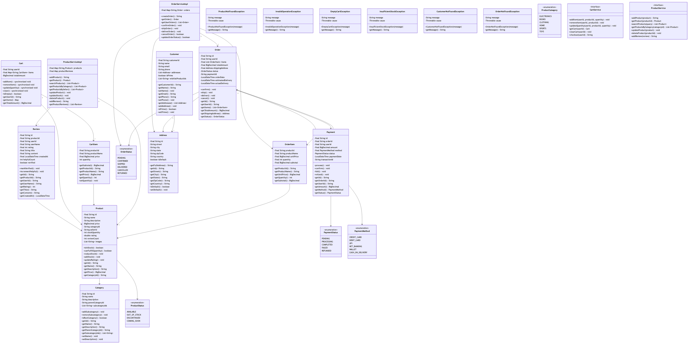

# Amazon E-Commerce System

## Overview
A full-featured e-commerce platform modeling Amazon's core functionality: product catalog, shopping cart, order processing, inventory management, payments, and seller marketplace. Implements real-time inventory updates, dynamic pricing, recommendation engine, and distributed transaction handling.

**Difficulty:** Hard  
**Domain:** E-Commerce, Marketplace  
**Interview Frequency:** Very High (Amazon, Flipkart, eBay, Shopify)

## Requirements

### Functional Requirements
1. **Product Catalog**
   - Browse products by category
   - Search products (text, filters)
   - Product details (images, specs, reviews)
   - Dynamic pricing
   - Variants (size, color)

2. **Shopping Cart**
   - Add/remove items
   - Update quantities
   - Apply coupons/discounts
   - Save for later
   - Calculate totals

3. **Order Management**
   - Place orders
   - Order tracking
   - Cancel/return orders
   - Order history
   - Multiple shipping addresses

4. **Inventory Management**
   - Real-time stock tracking
   - Reserve items in cart
   - Release on timeout
   - Low stock alerts
   - Restock notifications

5. **Payment Processing**
   - Multiple payment methods
   - Payment gateway integration
   - Split payments
   - Refunds
   - Payment history

6. **Seller Marketplace**
   - Seller registration
   - Product listing
   - Inventory management
   - Order fulfillment
   - Seller analytics

7. **Reviews & Ratings**
   - Product reviews
   - Seller ratings
   - Verified purchase badge
   - Helpful votes
   - Review moderation

### Non-Functional Requirements
1. **Performance**
   - Page load: < 2 seconds
   - Checkout: < 5 seconds
   - Support 100K+ concurrent users
   - 10M+ products

2. **Scalability**
   - Horizontal scaling
   - Database sharding
   - CDN for static content
   - Microservices architecture

3. **Availability**
   - 99.99% uptime
   - Graceful degradation
   - Multi-region deployment

4. **Consistency**
   - Strong consistency for inventory
   - Eventual consistency for reviews
   - No overselling


## Class Diagram

```mermaid
classDiagram

    class OrderServiceImpl {
        -final Map~String,Order~ orders
        +createOrder() String
        +getOrder() Order
        +getUserOrders() List~Order~
        +confirmOrder() void
        +shipOrder() void
        +deliverOrder() void
        +cancelOrder() boolean
        +updateOrderStatus() boolean
    }

    class ProductServiceImpl {
        -final Map~String,Product~ products
        -final Map<String, List~Review~> productReviews
        +addProduct() String
        +getProduct() Product
        +searchProducts() List~Product~
        +getProductsByCategory() List~Product~
        +getProductsBySeller() List~Product~
        +updateProduct() void
        +updateStock() void
        +deleteProduct() void
        +addReview() String
        +getProductReviews() List~Review~
    }

    class ProductNotFoundException {
    }

    class InvalidOperationException {
    }

    class EmptyCartException {
    }

    class InsufficientStockException {
    }

    class CustomerNotFoundException {
    }

    class OrderNotFoundException {
    }

    class Order {
        -final String id
        -final String userId
        -final List~OrderItem~ items
        -final BigDecimal totalAmount
        -final Address shippingAddress
        -OrderStatus status
        -String paymentId
        -LocalDateTime orderDate
        -LocalDateTime estimatedDelivery
        -LocalDateTime actualDelivery
        +confirm() void
        +ship() void
        +deliver() void
        +cancel() void
        +getId() String
        +getUserId() String
        +getItems() List~OrderItem~
        +getTotalAmount() BigDecimal
        +getShippingAddress() Address
        +getStatus() OrderStatus
    }

    class OrderItem {
        -final String productId
        -final String productName
        -final BigDecimal unitPrice
        -final int quantity
        -final BigDecimal subtotal
        +getProductId() String
        +getProductName() String
        +getUnitPrice() BigDecimal
        +getQuantity() int
        +getSubtotal() BigDecimal
    }

    class Review {
        -final String id
        -final String productId
        -final String userId
        -final String userName
        -final int rating
        -final String title
        -final String content
        -final LocalDateTime createdAt
        -int helpfulCount
        -boolean verified
        +markVerified() void
        +incrementHelpful() void
        +getId() String
        +getProductId() String
        +getUserId() String
        +getUserName() String
        +getRating() int
        +getTitle() String
        +getContent() String
        +getCreatedAt() LocalDateTime
    }

    class Product {
        -final String id
        -String name
        -String description
        -BigDecimal price
        -String categoryId
        -String sellerId
        -int stockQuantity
        -double rating
        -int reviewCount
        -List~String~ images
        +isInStock() boolean
        +canFulfillQuantity() boolean
        +reduceStock() void
        +addStock() void
        +updateRating() void
        +getId() String
        +getName() String
        +getDescription() String
        +getPrice() BigDecimal
        +getCategoryId() String
    }

    class Customer {
        -final String customerId
        -String name
        -String email
        -String phone
        -List~Address~ addresses
        -boolean isPrime
        -List~String~ wishlistProductIds
        +getCustomerId() String
        +getName() String
        +setName() void
        +getEmail() String
        +getPhone() String
        +setPhone() void
        +getAddresses() List~Address~
        +addAddress() void
        +isPrime() boolean
        +setPrime() void
    }

    class PaymentStatus
    <<enumeration>> PaymentStatus

    class Payment {
        -final String id
        -final String orderId
        -final String userId
        -final BigDecimal amount
        -final PaymentMethod method
        -PaymentStatus status
        -LocalDateTime paymentDate
        -String transactionId
        +process() void
        +confirm() void
        +fail() void
        +refund() void
        +getId() String
        +getOrderId() String
        +getUserId() String
        +getAmount() BigDecimal
        +getMethod() PaymentMethod
        +getStatus() PaymentStatus
    }

    class OrderStatus
    <<enumeration>> OrderStatus

    class Category {
        -final String id
        -String name
        -String description
        -String parentCategoryId
        -List~String~ subcategoryIds
        +addSubcategory() void
        +removeSubcategory() void
        +isRootCategory() boolean
        +getId() String
        +getName() String
        +getDescription() String
        +getParentCategoryId() String
        +getSubcategoryIds() List~String~
        +setName() void
        +setDescription() void
    }

    class CartItem {
        -final String productId
        -final String productName
        -final BigDecimal price
        -int quantity
        +getSubtotal() BigDecimal
        +getProductId() String
        +getProductName() String
        +getPrice() BigDecimal
        +getQuantity() int
        +setQuantity() void
    }

    class Address {
        -final String id
        -String street
        -String city
        -String state
        -String zipCode
        -String country
        -boolean isDefault
        +getFullAddress() String
        +getId() String
        +getStreet() String
        +getCity() String
        +getState() String
        +getZipCode() String
        +getCountry() String
        +isDefault() boolean
        +setDefault() void
    }

    class PaymentMethod
    <<enumeration>> PaymentMethod

    class Cart {
        -final String userId
        -final Map~String,CartItem~ items
        -BigDecimal totalAmount
        +addItem() synchronized void
        +removeItem() synchronized void
        +updateQuantity() synchronized void
        +clear() synchronized void
        +isEmpty() boolean
        +getUserId() String
        +getItems() Map<String, CartItem>
        +getTotalAmount() BigDecimal
    }

    class ProductStatus
    <<enumeration>> ProductStatus

    class ProductCategory
    <<enumeration>> ProductCategory

    class CartService
    <<interface>> CartService

    class ProductService
    <<interface>> ProductService

    OrderServiceImpl "1" --> "*" Order
    ProductServiceImpl "1" --> "*" Product
    ProductServiceImpl "1" --> "*" Review
    Order "1" --> "*" OrderItem
    Order --> Address
    Order --> OrderStatus
    Product --> ProductStatus
    Customer "1" --> "*" Address
    Payment --> PaymentMethod
    Payment --> PaymentStatus
    Cart "1" --> "*" CartItem
```

<details>
<summary>View Mermaid Source</summary>



</details>



## System Architecture

```
┌─────────────────────────────────────────────────────┐
│               User Interface Layer                   │
│    (Web App, Mobile App, Voice Assistant)           │
└────────────────────┬────────────────────────────────┘
                     │
        ┌────────────▼────────────┐
        │      API Gateway        │
        │  (Load Balancer, Auth)  │
        └────────────┬────────────┘
                     │
     ┌───────────────┼───────────────┐
     │               │               │
┌────▼─────┐  ┌─────▼──────┐  ┌────▼─────┐
│ Product  │  │  Order     │  │ Payment  │
│ Service  │  │  Service   │  │ Service  │
│          │  │            │  │          │
│ -Search  │  │ -Create    │  │ -Process │
│ -Browse  │  │ -Track     │  │ -Refund  │
│ -Details │  │ -Cancel    │  │ -Verify  │
└────┬─────┘  └─────┬──────┘  └────┬─────┘
     │              │               │
┌────▼─────┐  ┌─────▼──────┐  ┌────▼─────┐
│ Catalog  │  │ Inventory  │  │ Payment  │
│   DB     │  │  Service   │  │ Gateway  │
│          │  │            │  │          │
│ Products │  │ -Reserve   │  │ Stripe   │
│ Reviews  │  │ -Release   │  │ PayPal   │
│ Ratings  │  │ -Update    │  │          │
└──────────┘  └─────┬──────┘  └──────────┘
                    │
              ┌─────▼──────┐
              │ Inventory  │
              │     DB     │
              │            │
              │ Stock Lvls │
              │ Reserv.    │
              └────────────┘
```

## Core Data Model

### 1. Product
```java
public class Product {
    private ProductId id;
    private String name;
    private String description;
    private CategoryId categoryId;
    private SellerId sellerId;
    private Money price;
    private List<ProductVariant> variants;
    private List<String> imageUrls;
    private Map<String, String> attributes; // Brand, color, size, etc.
    private int stockQuantity;
    private double rating;
    private int reviewCount;
    private ProductStatus status; // ACTIVE, OUT_OF_STOCK, DISCONTINUED
    private LocalDateTime createdAt;
    
    public boolean isAvailable() {
        return status == ProductStatus.ACTIVE && stockQuantity > 0;
    }
    
    public Money calculatePrice(List<Discount> discounts) {
        Money finalPrice = price;
        for (Discount discount : discounts) {
            finalPrice = discount.apply(finalPrice);
        }
        return finalPrice;
    }
}

class ProductVariant {
    private String name; // "Size: Large", "Color: Red"
    private String sku;
    private Money priceAdjustment; // +$5 for XL
    private int stockQuantity;
}
```

### 2. Shopping Cart
```java
public class ShoppingCart {
    private CartId id;
    private UserId userId;
    private List<CartItem> items;
    private LocalDateTime createdAt;
    private LocalDateTime lastModifiedAt;
    
    public void addItem(Product product, int quantity) {
        Optional<CartItem> existing = items.stream()
            .filter(item -> item.getProductId().equals(product.getId()))
            .findFirst();
        
        if (existing.isPresent()) {
            existing.get().increaseQuantity(quantity);
        } else {
            items.add(new CartItem(product.getId(), quantity, product.getPrice()));
        }
        
        lastModifiedAt = LocalDateTime.now();
    }
    
    public void removeItem(ProductId productId) {
        items.removeIf(item -> item.getProductId().equals(productId));
    }
    
    public Money calculateTotal() {
        return items.stream()
            .map(CartItem::getSubtotal)
            .reduce(Money.ZERO, Money::add);
    }
    
    public void clear() {
        items.clear();
    }
}

class CartItem {
    private ProductId productId;
    private int quantity;
    private Money pricePerUnit;
    private LocalDateTime addedAt;
    
    public Money getSubtotal() {
        return pricePerUnit.multiply(quantity);
    }
}
```

### 3. Order
```java
public class Order {
    private OrderId id;
    private UserId userId;
    private List<OrderItem> items;
    private Money subtotal;
    private Money tax;
    private Money shippingCost;
    private Money totalAmount;
    private OrderStatus status;
    private Address shippingAddress;
    private PaymentInfo paymentInfo;
    private LocalDateTime orderDate;
    private LocalDateTime expectedDeliveryDate;
    
    public void updateStatus(OrderStatus newStatus) {
        if (!isValidTransition(this.status, newStatus)) {
            throw new InvalidStateTransitionException();
        }
        this.status = newStatus;
    }
    
    private boolean isValidTransition(OrderStatus from, OrderStatus to) {
        // PENDING → CONFIRMED → SHIPPED → DELIVERED
        // Any → CANCELLED
        return true; // Implement state machine
    }
}

enum OrderStatus {
    PENDING,        // Order placed, awaiting payment
    CONFIRMED,      // Payment received
    PROCESSING,     // Preparing for shipment
    SHIPPED,        // Out for delivery
    DELIVERED,      // Completed
    CANCELLED,      // Cancelled by user/system
    RETURNED,       // Returned by user
    REFUNDED        // Money refunded
}

class OrderItem {
    private ProductId productId;
    private String productName;
    private int quantity;
    private Money pricePerUnit;
    private SellerId sellerId;
    
    public Money getSubtotal() {
        return pricePerUnit.multiply(quantity);
    }
}
```

### 4. Inventory
```java
public class Inventory {
    private ProductId productId;
    private int availableQuantity;
    private int reservedQuantity;
    private int totalQuantity;
    private int lowStockThreshold;
    
    public synchronized boolean reserve(int quantity) {
        if (availableQuantity < quantity) {
            return false;
        }
        
        availableQuantity -= quantity;
        reservedQuantity += quantity;
        return true;
    }
    
    public synchronized void release(int quantity) {
        reservedQuantity -= quantity;
        availableQuantity += quantity;
    }
    
    public synchronized void commit(int quantity) {
        reservedQuantity -= quantity;
        totalQuantity -= quantity;
    }
    
    public boolean isLowStock() {
        return availableQuantity <= lowStockThreshold;
    }
}
```

## Key Algorithms

### 1. Checkout Process (Two-Phase Commit)
```java
public class CheckoutService {
    
    public Order checkout(CartId cartId, CheckoutRequest request) 
            throws CheckoutException {
        
        ShoppingCart cart = cartService.getCart(cartId);
        
        // Phase 1: Prepare (Reserve inventory, validate payment)
        List<ReservationId> reservations = new ArrayList<>();
        try {
            // 1.1 Reserve inventory for all items
            for (CartItem item : cart.getItems()) {
                ReservationId reservationId = inventoryService.reserve(
                    item.getProductId(),
                    item.getQuantity(),
                    Duration.ofMinutes(10) // Timeout
                );
                reservations.add(reservationId);
            }
            
            // 1.2 Validate payment method
            paymentService.validatePayment(request.getPaymentInfo());
            
            // 1.3 Calculate totals
            Money subtotal = cart.calculateTotal();
            Money tax = taxService.calculateTax(subtotal, request.getShippingAddress());
            Money shipping = shippingService.calculateShipping(cart, request.getShippingAddress());
            Money total = subtotal.add(tax).add(shipping);
            
            // Phase 2: Commit
            // 2.1 Process payment
            PaymentResult payment = paymentService.processPayment(
                request.getPaymentInfo(),
                total
            );
            
            if (!payment.isSuccessful()) {
                throw new PaymentFailedException();
            }
            
            // 2.2 Create order
            Order order = Order.builder()
                .userId(cart.getUserId())
                .items(convertToOrderItems(cart.getItems()))
                .subtotal(subtotal)
                .tax(tax)
                .shippingCost(shipping)
                .totalAmount(total)
                .status(OrderStatus.CONFIRMED)
                .shippingAddress(request.getShippingAddress())
                .paymentInfo(payment.getMaskedInfo())
                .orderDate(LocalDateTime.now())
                .build();
            
            orderRepository.save(order);
            
            // 2.3 Commit inventory reservations
            for (ReservationId reservationId : reservations) {
                inventoryService.commit(reservationId);
            }
            
            // 2.4 Clear cart
            cart.clear();
            
            // 2.5 Send confirmation
            notificationService.sendOrderConfirmation(order);
            
            return order;
            
        } catch (Exception e) {
            // Rollback: Release all reservations
            for (ReservationId reservationId : reservations) {
                inventoryService.release(reservationId);
            }
            throw new CheckoutException("Checkout failed: " + e.getMessage(), e);
        }
    }
}
```

**Key Points:**
- **Atomicity:** All-or-nothing (reserve all or reserve none)
- **Timeout:** Reservations expire after 10 minutes
- **Rollback:** Release reservations on failure

### 2. Product Search with Ranking
```java
public class ProductSearchService {
    
    public List<Product> search(SearchQuery query) {
        // 1. Text search (Elasticsearch/Lucene)
        List<Product> candidates = textSearch(query.getText());
        
        // 2. Apply filters
        candidates = applyFilters(candidates, query.getFilters());
        
        // 3. Rank by relevance
        List<ScoredProduct> scored = candidates.stream()
            .map(product -> new ScoredProduct(product, calculateScore(product, query)))
            .sorted(Comparator.comparingDouble(ScoredProduct::getScore).reversed())
            .collect(Collectors.toList());
        
        // 4. Apply pagination
        return scored.stream()
            .skip(query.getOffset())
            .limit(query.getLimit())
            .map(ScoredProduct::getProduct)
            .collect(Collectors.toList());
    }
    
    private double calculateScore(Product product, SearchQuery query) {
        double score = 0.0;
        
        // Text relevance (TF-IDF)
        score += textRelevanceScore(product, query.getText()) * 0.4;
        
        // User rating
        score += product.getRating() / 5.0 * 0.3;
        
        // Number of reviews (popularity)
        score += Math.log(1 + product.getReviewCount()) * 0.1;
        
        // Recency boost (newer products)
        long daysSinceLaunch = ChronoUnit.DAYS.between(
            product.getCreatedAt(), LocalDateTime.now());
        score += Math.exp(-daysSinceLaunch / 90.0) * 0.1;
        
        // Seller rating
        score += getSellerRating(product.getSellerId()) / 5.0 * 0.1;
        
        return score;
    }
}
```

**Ranking Factors:**
- **Text Relevance:** 40% - How well product matches search terms
- **User Rating:** 30% - Product quality
- **Popularity:** 10% - Number of reviews
- **Recency:** 10% - Newer products get boost
- **Seller Rating:** 10% - Trusted sellers

### 3. Recommendation Engine
```java
public class RecommendationEngine {
    
    public List<Product> getRecommendations(UserId userId, int limit) {
        User user = userService.getUser(userId);
        
        // Strategy 1: Collaborative filtering (users who bought X also bought Y)
        List<Product> collaborative = collaborativeFiltering(user, limit);
        
        // Strategy 2: Content-based (similar to user's past purchases)
        List<Product> contentBased = contentBasedFiltering(user, limit);
        
        // Strategy 3: Trending products
        List<Product> trending = getTrendingProducts(limit);
        
        // Combine strategies (ensemble)
        return combineRecommendations(
            collaborative,  // 50%
            contentBased,   // 30%
            trending        // 20%
        ).stream().limit(limit).collect(Collectors.toList());
    }
    
    private List<Product> collaborativeFiltering(User user, int limit) {
        // Find similar users (based on purchase history)
        List<UserId> similarUsers = findSimilarUsers(user.getId(), 100);
        
        // Get products they bought that this user hasn't
        Set<ProductId> userProducts = user.getPurchaseHistory();
        
        Map<ProductId, Integer> productScores = new HashMap<>();
        for (UserId similarUser : similarUsers) {
            List<ProductId> theirProducts = getPurchaseHistory(similarUser);
            for (ProductId productId : theirProducts) {
                if (!userProducts.contains(productId)) {
                    productScores.merge(productId, 1, Integer::sum);
                }
            }
        }
        
        // Return top scoring products
        return productScores.entrySet().stream()
            .sorted(Map.Entry.<ProductId, Integer>comparingByValue().reversed())
            .limit(limit)
            .map(e -> productService.getProduct(e.getKey()))
            .collect(Collectors.toList());
    }
}
```

### 4. Dynamic Pricing
```java
public class DynamicPricingService {
    
    public Money calculatePrice(Product product, UserId userId) {
        Money basePrice = product.getPrice();
        
        // Factor 1: Demand (high demand = higher price)
        double demandMultiplier = calculateDemandMultiplier(product);
        basePrice = basePrice.multiply(demandMultiplier);
        
        // Factor 2: Inventory level (low stock = higher price)
        double inventoryMultiplier = calculateInventoryMultiplier(product);
        basePrice = basePrice.multiply(inventoryMultiplier);
        
        // Factor 3: User segment (loyal customers get discount)
        if (isLoyalCustomer(userId)) {
            basePrice = basePrice.multiply(0.95); // 5% discount
        }
        
        // Factor 4: Time-based (weekday vs weekend)
        if (isWeekend()) {
            basePrice = basePrice.multiply(1.05);
        }
        
        // Factor 5: Competitor pricing
        Money competitorPrice = getCompetitorPrice(product);
        if (basePrice.isGreaterThan(competitorPrice.multiply(1.1))) {
            basePrice = competitorPrice.multiply(1.05); // Price match +5%
        }
        
        return basePrice;
    }
    
    private double calculateDemandMultiplier(Product product) {
        int recentViews = getRecentViews(product.getId(), Duration.ofHours(24));
        int recentPurchases = getRecentPurchases(product.getId(), Duration.ofHours(24));
        
        double demandScore = (recentViews / 1000.0) + (recentPurchases / 10.0);
        return 1.0 + Math.min(demandScore, 0.2); // Max 20% increase
    }
}
```

## Design Patterns

### 1. Factory Pattern (Order Creation)
```java
interface OrderFactory {
    Order createOrder(ShoppingCart cart, CheckoutRequest request);
}

class StandardOrderFactory implements OrderFactory {
    public Order createOrder(ShoppingCart cart, CheckoutRequest request) {
        return new Order(/* standard config */);
    }
}

class PrimeOrderFactory implements OrderFactory {
    public Order createOrder(ShoppingCart cart, CheckoutRequest request) {
        Order order = new Order(/* prime config */);
        order.setShippingCost(Money.ZERO); // Free shipping
        order.setPriority(Priority.HIGH);
        return order;
    }
}
```

### 2. Strategy Pattern (Payment)
```java
interface PaymentStrategy {
    PaymentResult process(PaymentInfo info, Money amount);
}

class CreditCardPayment implements PaymentStrategy {
    public PaymentResult process(PaymentInfo info, Money amount) {
        // Process credit card
    }
}

class PayPalPayment implements PaymentStrategy {
    public PaymentResult process(PaymentInfo info, Money amount) {
        // Process PayPal
    }
}

class CryptoPayment implements PaymentStrategy {
    public PaymentResult process(PaymentInfo info, Money amount) {
        // Process cryptocurrency
    }
}
```

### 3. Observer Pattern (Order Status)
```java
interface OrderObserver {
    void onStatusChange(Order order, OrderStatus newStatus);
}

class NotificationObserver implements OrderObserver {
    public void onStatusChange(Order order, OrderStatus newStatus) {
        notificationService.notifyCustomer(order, newStatus);
    }
}

class AnalyticsObserver implements OrderObserver {
    public void onStatusChange(Order order, OrderStatus newStatus) {
        analyticsService.trackOrderEvent(order, newStatus);
    }
}
```

### 4. Saga Pattern (Distributed Transaction)
```java
public class OrderSaga {
    public void executeOrderSaga(ShoppingCart cart, CheckoutRequest request) {
        SagaContext context = new SagaContext();
        
        try {
            // Step 1: Reserve inventory
            context.setReservationIds(inventoryService.reserve(cart.getItems()));
            
            // Step 2: Process payment
            context.setPaymentId(paymentService.processPayment(request));
            
            // Step 3: Create order
            context.setOrder(orderService.createOrder(cart, request));
            
            // Step 4: Commit inventory
            inventoryService.commit(context.getReservationIds());
            
            // Success
            context.setCompleted(true);
            
        } catch (Exception e) {
            // Compensating transactions (rollback)
            compensate(context);
            throw new SagaException("Order saga failed", e);
        }
    }
    
    private void compensate(SagaContext context) {
        if (context.getOrder() != null) {
            orderService.cancelOrder(context.getOrder().getId());
        }
        if (context.getPaymentId() != null) {
            paymentService.refund(context.getPaymentId());
        }
        if (context.getReservationIds() != null) {
            inventoryService.release(context.getReservationIds());
        }
    }
}
```

## Source Code

📄 **[View Complete Source Code](/problems/amazon/CODE)**

**Key Files:**
- [`OrderService.java`](/problems/amazon/CODE#orderservicejava) - Order management
- [`ProductService.java`](/problems/amazon/CODE#productservicejava) - Product catalog
- [`InventoryService.java`](/problems/amazon/CODE#inventoryservicejava) - Inventory tracking
- [`CheckoutService.java`](/problems/amazon/CODE#checkoutservicejava) - Checkout process

**Total Lines of Code:** ~1500 lines

## Usage Example

```java
// Initialize system
AmazonSystem system = new AmazonSystem();

// Browse products
List<Product> laptops = system.searchProducts("laptop", 
    Map.of("category", "Electronics", "priceMax", "2000"));

// Add to cart
ShoppingCart cart = system.getCart(userId);
cart.addItem(laptops.get(0), 1);

// Apply coupon
cart.applyCoupon("SAVE10");

// Checkout
CheckoutRequest request = CheckoutRequest.builder()
    .shippingAddress(address)
    .paymentInfo(paymentInfo)
    .build();

Order order = system.checkout(cart.getId(), request);

// Track order
OrderStatus status = system.getOrderStatus(order.getId());

// Leave review
system.submitReview(ProductReview.builder()
    .productId(product.getId())
    .userId(userId)
    .rating(5)
    .comment("Great product!")
    .build());
```

## Common Interview Questions

### System Design Questions

1. **How do you prevent overselling (selling more than available stock)?**
   - Inventory reservation during checkout
   - Strong consistency in inventory database
   - Pessimistic locking for high-demand items
   - Queue-based checkout during flash sales

2. **How do you handle flash sales (1M concurrent checkouts)?**
   - Queue system (virtual waiting room)
   - Inventory pre-allocation
   - Cache product details
   - Rate limiting per user
   - Horizontal scaling

3. **How do you calculate accurate recommendations?**
   - Collaborative filtering (similar users)
   - Content-based filtering (product similarity)
   - Matrix factorization (SVD)
   - Deep learning models (embeddings)
   - A/B testing for optimization

4. **How do you scale to millions of products?**
   - Database sharding (by category/seller)
   - Elasticsearch for search
   - CDN for images
   - Redis for cart/session
   - Microservices architecture

### Coding Questions

1. **Calculate cart total with discounts**
   ```java
   Money calculateTotal(List<CartItem> items, List<Discount> discounts) {
       Money subtotal = items.stream()
           .map(CartItem::getSubtotal)
           .reduce(Money.ZERO, Money::add);
       
       for (Discount discount : discounts) {
           subtotal = discount.apply(subtotal);
       }
       
       return subtotal;
   }
   ```

2. **Find similar products**
   ```java
   List<Product> findSimilar(Product product, int limit) {
       return products.stream()
           .filter(p -> p.getCategoryId().equals(product.getCategoryId()))
           .filter(p -> !p.getId().equals(product.getId()))
           .sorted((a, b) -> Double.compare(
               similarity(product, b), similarity(product, a)))
           .limit(limit)
           .collect(Collectors.toList());
   }
   ```

### Algorithm Questions
1. **Time complexity of checkout?** → O(N + K) where N=cart items, K=inventory ops
2. **How to find top-K products?** → Heap: O(N log K)
3. **How to implement recommendation engine?** → Collaborative filtering: O(U*P) where U=users, P=products

## Trade-offs & Design Decisions

### 1. Real-Time vs Batch Inventory Updates
**Real-Time:** Accurate, expensive  
**Batch:** Efficient, slight delay

**Decision:** Real-time for checkout, batch for analytics

### 2. Strong vs Eventual Consistency
**Strong:** No overselling, slower  
**Eventual:** Faster, potential conflicts

**Decision:** Strong for inventory, eventual for reviews

### 3. Monolith vs Microservices
**Monolith:** Simple, tightly coupled  
**Microservices:** Scalable, complex

**Decision:** Microservices for scalability

### 4. SQL vs NoSQL
**SQL:** ACID, complex queries  
**NoSQL:** Scalable, eventual consistency

**Decision:** SQL for orders, NoSQL for catalog

## Key Takeaways

### What Interviewers Look For
1. ✅ **Inventory management** (no overselling)
2. ✅ **Checkout workflow** (two-phase commit)
3. ✅ **Search and ranking** algorithms
4. ✅ **Recommendation engine**
5. ✅ **Scalability** (sharding, caching)
6. ✅ **Payment processing**

### Common Mistakes to Avoid
1. ❌ Not handling concurrent checkouts
2. ❌ No inventory reservation
3. ❌ Poor search ranking (no relevance)
4. ❌ Not considering flash sales
5. ❌ No fraud detection
6. ❌ Ignoring cart abandonment

### Production-Ready Checklist
- [x] Product catalog
- [x] Shopping cart
- [x] Checkout process
- [x] Inventory management
- [ ] Recommendation engine
- [ ] Dynamic pricing
- [ ] Fraud detection
- [ ] Analytics dashboard
- [ ] Mobile app
- [ ] International support

---

## Related Problems
- 🛒 **Flipkart** - Similar e-commerce
- 💳 **Payment Gateway** - Payment processing
- 📦 **Warehouse Management** - Inventory
- 🚚 **Delivery Tracking** - Logistics

## References
- Amazon Architecture: Microservices at scale
- Two-Phase Commit: Distributed transactions
- Collaborative Filtering: Recommendation systems
- Elasticsearch: Full-text search

---

*Production-ready e-commerce platform with inventory management, checkout workflow, and recommendation engine. Essential for marketplace and e-commerce interviews.*
