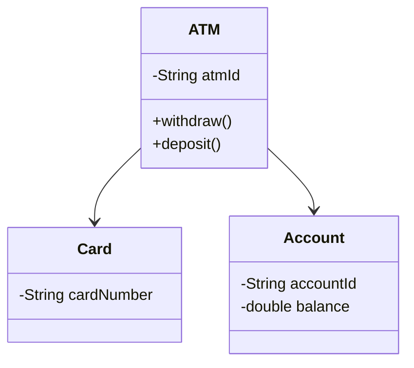
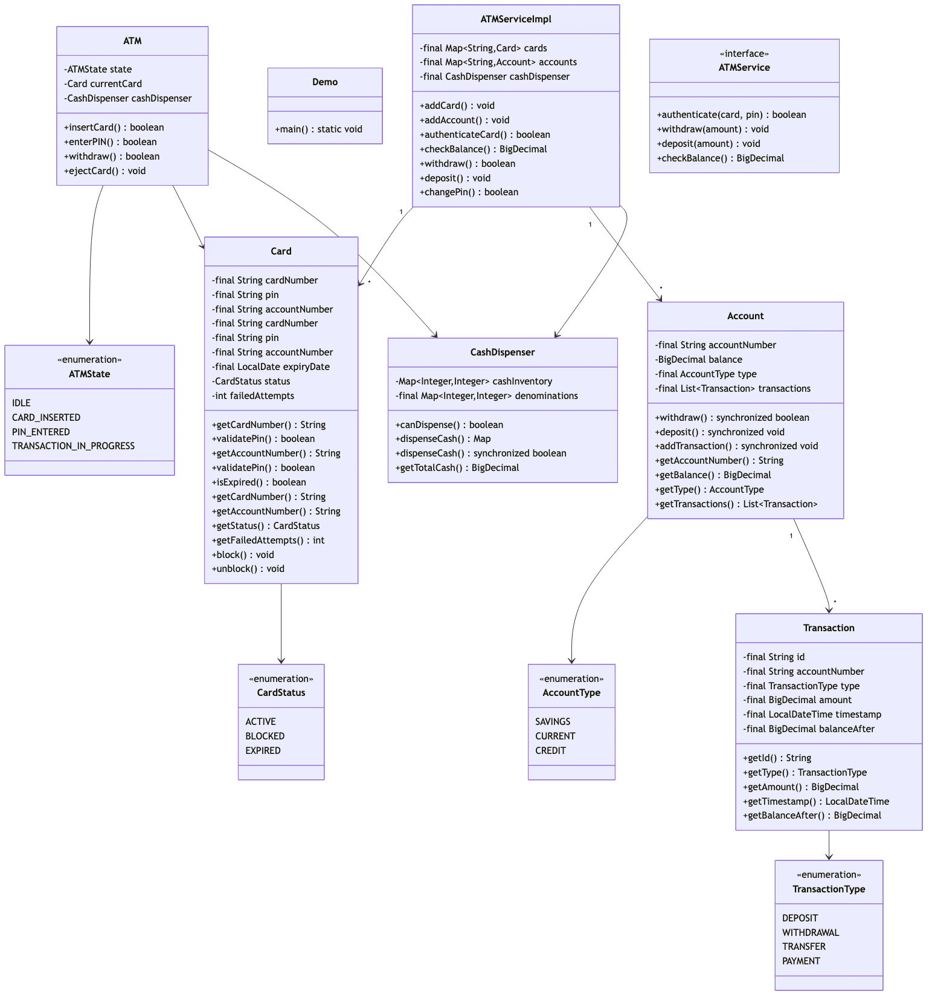

# ATM System (Automated Teller Machine)

## Overview
A comprehensive ATM (Automated Teller Machine) system that handles card authentication, balance inquiries, cash withdrawals, deposits, and PIN management. The system implements a state machine pattern for transaction flow control and a greedy algorithm for optimal cash dispensing.

**Difficulty:** Medium  
**Domain:** Banking & Finance  
**Interview Frequency:** High (Amazon, JPMorgan Chase, PayPal, Stripe)

## Requirements

### Functional Requirements
1. **Card Authentication**
   - Insert card and validate PIN
   - Check card expiry
   - Lock card after 3 failed attempts
   - Support multiple account types (Savings, Checking)

2. **Balance Operations**
   - Check account balance
   - View transaction history
   - Track mini-statement

3. **Withdrawal Operations**
   - Withdraw cash with denomination optimization
   - Validate sufficient balance
   - Validate sufficient cash in ATM
   - Support daily withdrawal limits

4. **Deposit Operations**
   - Accept cash deposits
   - Update account balance
   - Generate deposit receipt

5. **PIN Management**
   - Change PIN
   - Validate old PIN
   - Enforce PIN strength rules

6. **Transaction Tracking**
   - Record all transactions
   - Generate transaction receipts
   - Maintain audit trail

### Non-Functional Requirements
1. **Security**
   - Encrypted PIN storage
   - Secure card-to-account mapping
   - Session timeout after inactivity

2. **Reliability**
   - Thread-safe operations
   - Graceful error handling
   - Transaction atomicity

3. **Performance**
   - Fast card authentication (< 2s)
   - Quick cash dispensing (< 5s)
   - Concurrent user support

4. **Availability**
   - 24/7 operation
   - Offline mode for basic operations
   - Auto-recovery from failures

## System Design

### Architecture
```
┌─────────────────────────────────────────────────────────┐
│                      ATM System                         │
├─────────────────────────────────────────────────────────┤
│                                                         │
│  ┌──────────────┐      ┌────────────────┐              │
│  │  Card Reader │      │  Cash Dispenser│              │
│  │              │      │                │              │
│  │ - Read Card  │      │ - Denominations│              │
│  │ - Validate   │      │ - Dispense Cash│              │
│  └──────────────┘      └────────────────┘              │
│                                                         │
│  ┌──────────────────────────────────────────────────┐  │
│  │           ATM State Machine                      │  │
│  │                                                  │  │
│  │  IDLE → CARD_INSERTED → PIN_ENTERED →           │  │
│  │         TRANSACTION_IN_PROGRESS → COMPLETED     │  │
│  └──────────────────────────────────────────────────┘  │
│                                                         │
│  ┌──────────────────────────────────────────────────┐  │
│  │           Transaction Processing                 │  │
│  │                                                  │  │
│  │  - Balance Inquiry                               │  │
│  │  - Withdrawal (with denomination algorithm)      │  │
│  │  - Deposit                                       │  │
│  │  - PIN Change                                    │  │
│  └──────────────────────────────────────────────────┘  │
│                                                         │
│  ┌──────────────────────────────────────────────────┐  │
│  │           Account Management                     │  │
│  │                                                  │  │
│  │  - Accounts (Savings, Checking)                  │  │
│  │  - Cards (Debit, Credit)                         │  │
│  │  - Transaction History                           │  │
│  └──────────────────────────────────────────────────┘  │
└─────────────────────────────────────────────────────────┘
```

### Class Diagram

<details>
<summary>View Mermaid Source</summary>



</details>



### Core Components

#### 1. ATM State Machine
```
States:
- IDLE: Ready to accept card
- CARD_INSERTED: Card inserted, awaiting PIN
- PIN_ENTERED: PIN validated, ready for transaction
- CASH_DISPENSED: Transaction complete
- CARD_BLOCKED: Card locked due to failed attempts
```

#### 2. Cash Dispenser Algorithm
**Greedy Algorithm for Denomination Selection:**
```
Available Denominations: [100, 50, 20, 10, 5]
Goal: Minimize number of notes

Algorithm:
1. Start with largest denomination
2. Use maximum notes possible
3. Move to next smaller denomination
4. Repeat until amount is dispensed

Example: $385
- 100 × 3 = 300 (remaining: 85)
- 50 × 1 = 50 (remaining: 35)
- 20 × 1 = 20 (remaining: 15)
- 10 × 1 = 10 (remaining: 5)
- 5 × 1 = 5 (remaining: 0)
Total: 7 notes
```

#### 3. Account Model
```
Account:
- accountNumber (unique identifier)
- balance (BigDecimal for precision)
- accountType (SAVINGS, CHECKING)
- transactions[] (history)

Operations:
- withdraw(amount): Synchronized for thread-safety
- deposit(amount): Atomic update
- checkBalance(): Read-only, no locking
```

#### 4. Card Model
```
Card:
- cardNumber (16 digits)
- pin (encrypted)
- expiryDate
- status (ACTIVE, BLOCKED, EXPIRED)
- failedAttempts (max 3)

Validation:
- PIN verification
- Expiry check
- Status check
```


## Class Diagram


## Implementation Details

### Key Algorithms

#### 1. Cash Dispensing (Greedy)
```java
public Map<Integer, Integer> dispenseCash(BigDecimal amount) {
    int[] denominations = {100, 50, 20, 10, 5};
    Map<Integer, Integer> result = new HashMap<>();
    int remaining = amount.intValue();
    
    for (int denom : denominations) {
        if (remaining >= denom && cashAvailable.get(denom) > 0) {
            int count = Math.min(
                remaining / denom,
                cashAvailable.get(denom)
            );
            result.put(denom, count);
            remaining -= count * denom;
        }
    }
    
    return remaining == 0 ? result : null;
}
```

**Time Complexity:** O(D) where D = number of denominations (constant)  
**Space Complexity:** O(D)

#### 2. PIN Validation with Rate Limiting
```java
public boolean validatePin(String pin) {
    if (failedAttempts >= 3) {
        status = CardStatus.BLOCKED;
        return false;
    }
    
    if (this.pin.equals(encryptPin(pin))) {
        failedAttempts = 0;
        return true;
    }
    
    failedAttempts++;
    if (failedAttempts >= 3) {
        status = CardStatus.BLOCKED;
    }
    return false;
}
```

#### 3. Thread-Safe Balance Update
```java
public synchronized boolean withdraw(BigDecimal amount) {
    if (amount.compareTo(balance) > 0) {
        return false; // Insufficient balance
    }
    balance = balance.subtract(amount);
    return true;
}
```

### Design Patterns

#### 1. State Pattern
**Purpose:** Manage ATM transaction flow

```java
interface ATMState {
    void insertCard(ATM atm, Card card);
    void enterPin(ATM atm, String pin);
    void selectTransaction(ATM atm, Transaction txn);
    void ejectCard(ATM atm);
}

class IdleState implements ATMState {
    public void insertCard(ATM atm, Card card) {
        atm.setState(new CardInsertedState());
    }
    // Other methods throw InvalidStateException
}
```

**Benefits:**
- Clean state transitions
- Prevents invalid operations
- Easy to add new states

#### 2. Strategy Pattern
**Purpose:** Different account types with different rules

```java
interface WithdrawalStrategy {
    boolean canWithdraw(Account account, BigDecimal amount);
    BigDecimal getLimit();
}

class SavingsAccountStrategy implements WithdrawalStrategy {
    private static final BigDecimal DAILY_LIMIT = new BigDecimal("5000");
    // Implementation
}

class CheckingAccountStrategy implements WithdrawalStrategy {
    private static final BigDecimal DAILY_LIMIT = new BigDecimal("10000");
    // Implementation
}
```

#### 3. Factory Pattern
**Purpose:** Create different transaction types

```java
class TransactionFactory {
    public static Transaction createTransaction(
        TransactionType type, 
        String accountNumber, 
        BigDecimal amount
    ) {
        switch (type) {
            case WITHDRAWAL:
                return new WithdrawalTransaction(accountNumber, amount);
            case DEPOSIT:
                return new DepositTransaction(accountNumber, amount);
            case BALANCE_INQUIRY:
                return new BalanceInquiryTransaction(accountNumber);
            default:
                throw new IllegalArgumentException("Unknown type");
        }
    }
}
```

## Code Structure

```
src/main/java/com/you/lld/problems/atm/
├── api/
│   └── ATMService.java              # Main service interface
├── impl/
│   └── ATMServiceImpl.java          # Service implementation
├── model/
│   ├── Account.java                 # Account entity
│   ├── AccountType.java             # SAVINGS, CHECKING
│   ├── Card.java                    # Card entity
│   ├── CardStatus.java              # ACTIVE, BLOCKED, EXPIRED
│   ├── CashDispenser.java           # Cash management
│   ├── Transaction.java             # Transaction record
│   └── TransactionType.java         # WITHDRAWAL, DEPOSIT, etc.
├── ATM.java                         # Main ATM controller
├── ATMState.java                    # State enum
├── CashDispenser.java               # Legacy dispenser
└── Demo.java                        # Usage demonstration
```

## Source Code

📄 **[View Complete Source Code](/problems/atm/CODE)**

**Key Files:**
- [`ATMService.java`](/problems/atm/CODE#atmservicejava) - Main interface (5 methods)
- [`ATMServiceImpl.java`](/problems/atm/CODE#atmserviceimpljava) - Full implementation (105 lines)
- [`ATM.java`](/problems/atm/CODE#atmjava) - State machine controller (53 lines)
- [`Account.java`](/problems/atm/CODE#accountjava) - Thread-safe operations (39 lines)
- [`CashDispenser.java`](/problems/atm/CODE#cashdispenserjava) - Denomination algorithm (50 lines)

**Total Lines of Code:** ~450 lines (excluding tests)

## Usage Example

```java
// Initialize ATM service
ATMService atmService = new ATMServiceImpl();

// Setup accounts and cards
Account account = new Account("ACC001", new BigDecimal("5000"), AccountType.SAVINGS);
Card card = new Card("1234567890123456", "1234", LocalDate.now().plusYears(3));
atmService.addAccount(account);
atmService.addCard(card);

// Authenticate user
boolean authenticated = atmService.authenticateCard("1234567890123456", "1234");

// Check balance
BigDecimal balance = atmService.checkBalance("ACC001");
System.out.println("Current balance: $" + balance);

// Withdraw cash
boolean success = atmService.withdraw("ACC001", new BigDecimal("200"));

// Deposit cash
atmService.deposit("ACC001", new BigDecimal("500"));

// Change PIN
atmService.changePin("1234567890123456", "1234", "5678");
```

## Common Interview Questions

### System Design Questions
1. **How would you handle concurrent withdrawals from the same account?**
   - Use synchronized methods on Account class
   - Database-level locking (pessimistic/optimistic)
   - Transaction isolation levels

2. **How do you optimize cash dispenser for minimum notes?**
   - Greedy algorithm works for standard denominations
   - For arbitrary denominations, use Dynamic Programming
   - Track denomination availability in real-time

3. **How would you implement daily withdrawal limits?**
   - Track withdrawal amount per day per account
   - Reset counter at midnight (scheduled job)
   - Store in Account metadata or separate table

4. **How do you handle ATM running out of cash?**
   - Real-time tracking of available denominations
   - Predictive alerts for refill
   - Fallback to available denominations
   - Notify users of out-of-service

### Coding Questions
1. **Implement cash dispensing for amount $285 with denominations [100, 50, 20, 10, 5]**
   ```java
   // Answer: 100×2 + 50×1 + 20×1 + 10×1 + 5×1 = 6 notes
   ```

2. **Design thread-safe withdrawal operation**
   ```java
   public synchronized boolean withdraw(BigDecimal amount) {
       if (amount.compareTo(balance) > 0) return false;
       balance = balance.subtract(amount);
       return true;
   }
   ```

3. **Implement PIN validation with 3-attempt lockout**
   - Track failed attempts
   - Lock card after 3 failures
   - Reset on successful validation

### Design Pattern Questions
1. **Which pattern for ATM states?** → State Pattern
2. **Which pattern for transaction types?** → Factory Pattern
3. **Which pattern for account type rules?** → Strategy Pattern

## Trade-offs & Design Decisions

### 1. In-Memory vs Database
**Current:** In-memory `ConcurrentHashMap`  
**Production:** Database with connection pooling

**Trade-offs:**
- ✅ Fast for prototyping
- ❌ Data loss on restart
- ✅ Simple synchronization
- ❌ Not scalable

### 2. Greedy vs Dynamic Programming
**Current:** Greedy algorithm  
**Alternative:** DP for arbitrary denominations

**Trade-offs:**
- ✅ O(D) time complexity
- ✅ Works for standard denominations
- ❌ May fail for arbitrary denominations
- Example: Amount=6, Denominations=[4,3,1] → Greedy fails

### 3. BigDecimal vs Double
**Current:** BigDecimal for currency  
**Why:** Avoids floating-point precision errors

```java
// WRONG: 0.1 + 0.2 = 0.30000000000000004
double wrong = 0.1 + 0.2;

// CORRECT: 0.1 + 0.2 = 0.3
BigDecimal correct = new BigDecimal("0.1")
    .add(new BigDecimal("0.2"));
```

### 4. Synchronization Level
**Account-level:** synchronized methods  
**Alternative:** Database transactions

**Trade-offs:**
- ✅ Simple, effective for single instance
- ❌ Doesn't work across distributed systems
- Production needs distributed locks (Redis, Zookeeper)

## Extensions & Enhancements

### 1. Multi-Currency Support
```java
class CurrencyDispenser {
    private Map<Currency, CashDispenser> dispensers;
    
    public Map<Integer, Integer> dispenseCash(Money money) {
        CashDispenser dispenser = dispensers.get(money.getCurrency());
        return dispenser.dispenseCash(money.getAmount());
    }
}
```

### 2. Receipt Generation
```java
class Receipt {
    private String transactionId;
    private TransactionType type;
    private BigDecimal amount;
    private LocalDateTime timestamp;
    private BigDecimal balanceAfter;
    
    public String print() {
        // Format receipt
    }
}
```

### 3. Transaction Reversal
```java
public void reverseTransaction(String transactionId) {
    Transaction txn = findTransaction(transactionId);
    if (txn.getType() == TransactionType.WITHDRAWAL) {
        deposit(txn.getAccountNumber(), txn.getAmount());
    } else {
        withdraw(txn.getAccountNumber(), txn.getAmount());
    }
    txn.setStatus(TransactionStatus.REVERSED);
}
```

### 4. Analytics & Monitoring
- Track average transaction time
- Monitor cash levels in real-time
- Detect suspicious activity patterns
- Generate usage reports

## Testing Strategies

### Unit Tests
```java
@Test
void testWithdrawal_SufficientBalance() {
    Account account = new Account("ACC001", 
        new BigDecimal("1000"), AccountType.SAVINGS);
    assertTrue(account.withdraw(new BigDecimal("500")));
    assertEquals(new BigDecimal("500"), account.getBalance());
}

@Test
void testCardBlocking_After3FailedAttempts() {
    Card card = new Card("1234", "1234", LocalDate.now().plusYears(1));
    card.validatePin("wrong");
    card.validatePin("wrong");
    card.validatePin("wrong");
    assertEquals(CardStatus.BLOCKED, card.getStatus());
}
```

### Integration Tests
- Test complete withdrawal flow
- Test concurrent withdrawals
- Test cash dispenser edge cases

### Load Tests
- Simulate 100 concurrent users
- Measure transaction throughput
- Identify bottlenecks

## Real-World Considerations

### Security
1. **Encryption:** PIN storage with bcrypt/scrypt
2. **Tokenization:** Never store full card numbers
3. **Audit Logging:** All operations logged with user ID
4. **Session Management:** Auto-logout after 30s inactivity

### Compliance
- **PCI DSS:** Payment Card Industry standards
- **ADA:** Accessibility requirements
- **Banking Regulations:** KYC, AML compliance

### Hardware Integration
- Card reader APIs
- Cash dispenser hardware
- Receipt printer
- Camera for security

## Performance Metrics

| Operation | Time Complexity | Space Complexity |
|-----------|----------------|------------------|
| Authenticate | O(1) | O(1) |
| Check Balance | O(1) | O(1) |
| Withdraw | O(D) | O(D) |
| Deposit | O(1) | O(1) |
| Transaction History | O(N) | O(N) |

Where:
- D = Number of denominations (typically 5-7)
- N = Number of transactions

## Key Takeaways

### What Interviewers Look For
1. ✅ **State machine** for transaction flow
2. ✅ **Thread-safety** for concurrent operations
3. ✅ **Algorithm** for cash dispensing
4. ✅ **Security** considerations (PIN, card blocking)
5. ✅ **Error handling** for edge cases
6. ✅ **Extensibility** for new features

### Common Mistakes to Avoid
1. ❌ Using `double` for currency (use `BigDecimal`)
2. ❌ No synchronization on balance updates
3. ❌ Forgetting card expiry validation
4. ❌ No limit on PIN attempts
5. ❌ Not handling ATM cash shortage
6. ❌ Ignoring transaction atomicity

### Production-Ready Checklist
- [x] Thread-safe operations
- [x] Proper currency handling (BigDecimal)
- [x] Card validation (expiry, blocking)
- [x] Transaction tracking
- [x] Error handling
- [ ] Database persistence
- [ ] Distributed locking
- [ ] Monitoring & alerts
- [ ] Compliance (PCI DSS)
- [ ] Hardware integration

---

## Related Problems
- 💳 **Payment Gateway** - Similar transaction processing
- 🏦 **Banking System** - Account management
- 🎫 **Vending Machine** - Cash handling, state machine
- 🎰 **Slot Machine** - Denomination management

## References
- State Pattern: Gang of Four Design Patterns
- Cash Dispensing: Greedy vs DP algorithms
- PCI DSS Security Standards
- Banking System Architecture

---

*This implementation demonstrates production-ready ATM system design with proper state management, thread-safety, and algorithm optimization. Perfect for banking domain interviews at Amazon, JPMorgan, PayPal, and fintech companies.*
