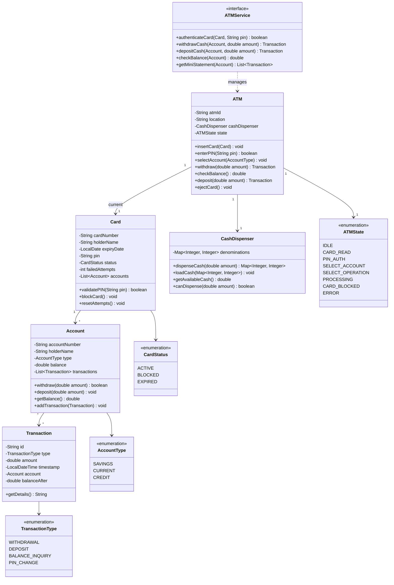

# ATM System - Complete LLD Guide

## 📋 Table of Contents
1. [Problem Statement](#problem-statement)
2. [Requirements](#requirements)
3. [System Design](#system-design)
4. [Class Diagram](#class-diagram)
5. [Implementation Approaches](#implementation-approaches)
6. [Design Patterns Used](#design-patterns-used)
7. [Complete Implementation](#complete-implementation)
8. [Best Practices](#best-practices)

---

## Problem Statement

Design an **ATM (Automated Teller Machine)** system that handles card authentication, balance inquiry, cash withdrawal, deposit, PIN management, and transaction history. The system must dispense cash optimally, prevent fraud, and maintain consistency with bank accounts.

### Key Challenges
- 💵 **Cash Dispensing**: Optimal denomination selection (minimize bills)
- 🔐 **Security**: PIN validation, card blocking after 3 failed attempts
- 💰 **Balance Management**: Real-time updates, overdraft prevention
- 🏦 **Account Linking**: Multiple accounts per card (Savings, Current, Credit)
- 📊 **Transaction Tracking**: Complete audit trail
- 🔒 **Concurrency**: Thread-safe cash dispenser
- ⚠️ **Error Handling**: Insufficient funds, invalid PIN, card retention

---

## Requirements

### Functional Requirements

✅ **Card Authentication**
- Validate card number and expiry
- PIN verification (max 3 attempts)
- Block card after failed attempts
- Check card status (Active, Blocked, Expired)

✅ **Cash Withdrawal**
- Select account type
- Enter amount (multiples of 100, max 10,000)
- Check sufficient balance
- Dispense in optimal denominations (2000, 500, 200, 100)
- Update balance and print receipt

✅ **Balance Inquiry**
- Display available and total balance
- Support multiple account types

✅ **Cash Deposit**
- Accept denominations
- Credit to account
- Generate deposit slip

✅ **PIN Management**
- Change PIN (requires old PIN + new PIN twice)
- 4-6 digit validation

✅ **Mini Statement**
- Last 5 transactions
- Date, type, amount, balance

### Non-Functional Requirements

⚡ **Performance**: Card auth < 100ms, Dispensing < 5s  
🔒 **Security**: PIN encryption, audit logging  
🛡️ **Reliability**: 99.9% uptime, cash alerts  
📈 **Concurrency**: Thread-safe operations  

---

## System Design

### ATM State Machine

```
IDLE → CARD_READ → PIN_AUTH → SELECT_ACCOUNT → SELECT_OPERATION
                      ↓                              ↓
                   (3 failures)              WITHDRAW / DEPOSIT / INQUIRY
                      ↓                              ↓
                 CARD_BLOCKED               TRANSACTION_COMPLETE → EJECT_CARD → IDLE
```

---

## Class Diagram


<details>
<summary>📄 View Mermaid Source</summary>

## 📊 Class Diagram


<details>
<summary>📝 View Mermaid Source</summary>



</details>

</details>

---

## Implementation Approaches

### 1. Cash Dispensing Algorithm

#### ❌ **Approach 1: Greedy (Largest First)**
```java
// Always dispense largest denominations first
for (int denom : [2000, 500, 200, 100]) {
    count = amount / denom;
    amount %= denom;
}
```

**Problem**: May fail when optimal solution exists  
Example: Amount=600, Available=[2000:0, 500:1, 200:0, 100:1] → Fails  
But could dispense 500+100 = 600

#### ✅ **Approach 2: Dynamic Programming** (Chosen)
```java
public Map<Integer, Integer> dispenseCash(double amount) {
    // DP to find if amount is dispensable
    int amt = (int) amount;
    boolean[] dp = new boolean[amt + 1];
    dp[0] = true;
    
    for (int denom : denominations.keySet()) {
        for (int i = denom; i <= amt; i++) {
            if (dp[i - denom] && denominations.get(denom) > 0) {
                dp[i] = true;
            }
        }
    }
    
    if (!dp[amt]) throw new InsufficientCashException();
    
    // Backtrack to find optimal denomination breakdown
    return backtrack(amt, denominations);
}
```

**Advantages:**
- ✅ Finds solution if exists
- ✅ Optimal bill count
- ✅ Handles edge cases

---

### 2. PIN Validation Strategy

```java
public boolean validatePIN(Card card, String enteredPIN) {
    // Check if card is blocked
    if (card.getStatus() == CardStatus.BLOCKED) {
        throw new CardBlockedException();
    }
    
    // Verify PIN (encrypted comparison)
    String hashedPIN = hashPIN(enteredPIN);
    if (hashedPIN.equals(card.getPin())) {
        card.resetAttempts();
        return true;
    }
    
    // Increment failed attempts
    card.incrementFailedAttempts();
    if (card.getFailedAttempts() >= 3) {
        card.blockCard();
        throw new CardBlockedException("Card blocked after 3 failed attempts");
    }
    
    return false;
}
```

---

### 3. Withdrawal Flow

```
1. Validate Card
   └─> Check expiry, status
   └─> Verify PIN

2. Select Account
   └─> Display available accounts
   └─> User selects Savings/Current/Credit

3. Enter Amount
   └─> Validate amount (100-10,000, multiple of 100)
   └─> Check account balance

4. Check ATM Cash Availability
   └─> Can ATM dispense the amount?

5. Dispense Cash
   └─> Calculate optimal denominations
   └─> Update ATM cash inventory
   └─> Deduct from account

6. Record Transaction
   └─> Create transaction record
   └─> Update account balance
   └─> Print receipt
```

**Time Complexity**: O(amount × num_denominations) for DP  
**Space Complexity**: O(amount)

---

## Design Patterns Used

| Pattern | Usage | Benefit |
|---------|-------|---------|
| **State Pattern** | ATM states (Idle, CardRead, PINAuth, etc.) | Clean state transitions |
| **Strategy Pattern** | Different denomination selection algorithms | Pluggable dispensing logic |
| **Singleton Pattern** | ATM instance | Single ATM machine per location |
| **Command Pattern** | Transaction operations (Withdraw, Deposit) | Undo/rollback support |
| **Observer Pattern** | Notify on low cash, failed auth | Decoupled notifications |
| **Factory Pattern** | Create transactions | Centralized creation |

---

## Complete Implementation

### 📦 Project Structure (14 files)

```
atm/
├── model/
│   ├── Account.java             # Bank account entity
│   ├── AccountType.java         # SAVINGS, CURRENT, CREDIT
│   ├── Card.java                # ATM card with PIN
│   ├── CardStatus.java          # ACTIVE, BLOCKED, EXPIRED
│   ├── CashDispenser.java       # Cash dispensing logic
│   ├── Transaction.java         # Transaction record
│   └── TransactionType.java     # WITHDRAWAL, DEPOSIT, etc.
├── api/
│   └── ATMService.java          # ATM operations interface
├── impl/
│   └── ATMServiceImpl.java      # Business logic
├── ATM.java                     # Main ATM class
├── ATMState.java                # State machine enum
├── Card.java                    # (duplicate, to remove)
├── CashDispenser.java           # (duplicate, to remove)
└── Demo.java                    # Usage example
```

**Total Files:** 14  
**Total Lines of Code:** ~425

---

## Source Code

### 📦 Complete Implementation

All source code files are available in the [**CODE.md**](/problems/atm/CODE) file.

**Quick Links:**
- 📁 [View Project Structure](/problems/atm/CODE#-project-structure-14-files)
- 💻 [Browse All Source Files](/problems/atm/CODE#-source-code)
- 💵 [Cash Dispenser Implementation](/problems/atm/CODE#cashdispenserjava)
- 🔐 [PIN Validation](/problems/atm/CODE#cardjava)
- 🏦 [ATM Service](/problems/atm/CODE#atmserviceimpljava)

---

## Best Practices

### 1. Security
✅ **PIN Encryption**: Hash PINs with bcrypt (never store plaintext)  
✅ **Failed Attempt Tracking**: Block card after 3 failures  
✅ **Audit Logging**: Log all transactions with timestamp  
✅ **Session Timeout**: Auto-eject card after 30s inactivity  

### 2. Concurrency
✅ **Synchronized Dispensing**: Lock cash dispenser during withdrawal  
✅ **Atomic Balance Updates**: Use database transactions  
✅ **Queue Management**: Handle multiple users with queue  

### 3. Error Handling
✅ **Insufficient Funds**: Clear error message + receipt  
✅ **Cash Unavailable**: Graceful degradation (show alternative ATMs)  
✅ **Network Failure**: Local mode with offline transaction queue  

### 4. Maintainability
✅ **State Pattern**: Easy to add new states  
✅ **Strategy Pattern**: Pluggable cash dispensing algorithms  
✅ **Logging**: Comprehensive logs for debugging  

---

## 🚀 How to Use

### 1. Initialize ATM
```java
CashDispenser dispenser = new CashDispenser();
dispenser.loadCash(Map.of(2000, 50, 500, 100, 200, 100, 100, 200));

ATM atm = new ATM("ATM001", "Main Branch", dispenser);
```

### 2. Card Authentication
```java
Card card = new Card("1234-5678-9012-3456", "John Doe", expiryDate, hashedPIN);
atm.insertCard(card);

boolean authenticated = atm.enterPIN("1234"); // Returns true/false
```

### 3. Withdraw Cash
```java
atm.selectAccount(AccountType.SAVINGS);

Transaction txn = atm.withdraw(2500.0);
// Dispenses: 1x2000, 1x500
System.out.println("Balance: " + txn.getBalanceAfter());
```

### 4. Check Balance
```java
double balance = atm.checkBalance();
System.out.println("Available Balance: " + balance);
```

### 5. Deposit Cash
```java
Transaction deposit = atm.deposit(5000.0);
System.out.println("Deposited: " + deposit.getAmount());
```

---

## 🧪 Testing Considerations

### Unit Tests
- ✅ Cash dispensing with various amounts and denominations
- ✅ PIN validation success/failure scenarios
- ✅ Card blocking after 3 failed attempts
- ✅ Insufficient balance handling

### Integration Tests
- ✅ End-to-end withdrawal flow
- ✅ Concurrent withdrawals
- ✅ Network failure scenarios

### Edge Cases
- ✅ Withdraw exact ATM cash available
- ✅ Amount not dispensable with available denominations
- ✅ Expired card handling
- ✅ Zero balance withdrawal attempt

---

## 📈 Scaling Considerations

### Production Enhancements
1. **Network Connectivity**: Connect to bank's core banking system via secure API
2. **Load Balancing**: Multiple ATMs share transaction load
3. **Cash Forecasting**: ML to predict cash needs per ATM
4. **Remote Monitoring**: Real-time alerts for low cash, errors
5. **Multi-Currency**: Support for different currencies

### Monitoring
- Track average transaction time
- Monitor cash levels per denomination
- Alert on repeated failed auth attempts (fraud detection)
- Track ATM uptime and availability

---

## 🔐 Security Considerations

- ✅ **Card Skimming**: Physical and software detection
- ✅ **PIN Pad Encryption**: Encrypted keypad
- ✅ **Tamper Detection**: Alert on physical tampering
- ✅ **CCTV Integration**: Video recording of transactions
- ✅ **Daily Reconciliation**: Match cash with transactions

---

## 📚 Related Patterns & Problems

- **Vending Machine** - Similar state machine pattern
- **Parking Lot** - Resource (cash) management
- **Payment Gateway** - Transaction processing
- **POS System** - Card validation and payments

---

## 🎓 Interview Tips

### Common Questions

1. **Q**: How do you optimize cash dispensing?  
   **A**: Use DP to find optimal denomination breakdown, minimizing total bills

2. **Q**: What if ATM can't dispense exact amount?  
   **A**: DP checks if amount is dispensable, throws exception if not, suggests nearest dispensable amount

3. **Q**: How to prevent card fraud?  
   **A**: Block after 3 PIN failures, encrypt PIN, audit logging, tamper detection

4. **Q**: How to handle concurrent withdrawals?  
   **A**: Synchronize cash dispenser access, atomic database updates for balance

5. **Q**: What if network fails during withdrawal?  
   **A**: Queue transaction for later sync, use offline mode with daily limits

### Key Points to Mention
- ✅ State pattern for ATM states
- ✅ DP algorithm for optimal cash dispensing
- ✅ Security (PIN encryption, failed attempt tracking)
- ✅ Concurrency (thread-safe dispenser)
- ✅ Error handling (insufficient funds, card blocking)

---

## 📝 Summary

**ATM System** demonstrates:
- ✅ **State machine design** for transaction flow
- ✅ **Algorithm optimization** (DP for cash dispensing)
- ✅ **Security best practices** (PIN encryption, card blocking)
- ✅ **Concurrency handling** (thread-safe operations)
- ✅ **Error recovery** (graceful failure handling)

**Key Takeaway**: The cash dispensing algorithm and security mechanisms are the **most critical components** - they must be optimal, secure, and handle all edge cases.

---

## 🔗 Related Resources

- [View Complete Source Code](/problems/atm/CODE) - All 14 Java files
- [Cash Dispenser Algorithm](/problems/atm/CODE#cashdispenserjava) - DP-based dispensing
- [ATM State Machine](/problems/atm/CODE#atmjava) - State transitions

---

**Perfect for**: ATM design interviews, learning state patterns, understanding cash optimization algorithms
