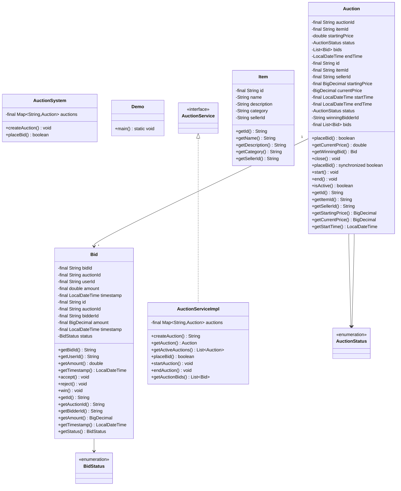
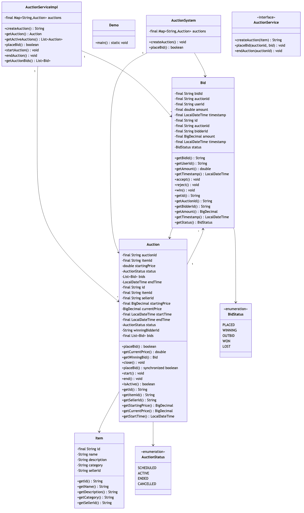

# Online Auction System

## Overview
A real-time online auction platform supporting multiple concurrent auctions, competitive bidding, automatic bid validation, and winner determination. The system implements thread-safe operations for high-concurrency scenarios and supports various auction types (English, Dutch, Sealed-bid).

**Difficulty:** Medium-Hard  
**Domain:** E-Commerce, Marketplace  
**Interview Frequency:** High (eBay, Amazon, Sotheby's, Christie's)

## Requirements

### Functional Requirements
1. **Auction Management**
   - Create auctions with start/end times
   - Set starting price and reserve price
   - Support multiple auction types
   - Schedule future auctions
   - Cancel auctions (if no bids)

2. **Bidding Operations**
   - Place bids in real-time
   - Validate bid amount (must exceed current)
   - Track bid history
   - Support proxy bidding (auto-increment)
   - Handle bid retractions

3. **User Management**
   - Register sellers and bidders
   - Track user reputation
   - Manage user balances
   - Block fraudulent users

4. **Winner Determination**
   - Automatically close auctions at end time
   - Determine winning bidder
   - Handle reserve price not met
   - Send notifications to winner

5. **Search & Discovery**
   - Search auctions by category
   - Filter by price range
   - Sort by ending time
   - View active/completed auctions

### Non-Functional Requirements
1. **Concurrency**
   - Support thousands of concurrent bidders
   - Thread-safe bid placement
   - No duplicate winning bids

2. **Performance**
   - Bid placement < 100ms
   - Real-time price updates
   - Efficient auction queries

3. **Reliability**
   - No lost bids
   - Atomic winner determination
   - Audit trail for all bids

4. **Scalability**
   - Millions of active auctions
   - Horizontal scaling
   - Database sharding by auction

## Class Diagram


## Class Diagram

<details>
<summary>View Mermaid Source</summary>



</details>



## Core Components

### 1. Auction Types

#### English Auction (Ascending Bid)
- Starting price: $100
- Each bid must exceed current price
- Highest bidder wins
- **Example:** $100 → $110 → $125 → $150 (winner)

#### Dutch Auction (Descending Price)
- Starting price: $500
- Price decreases over time
- First bidder wins
- **Example:** $500 → $450 → $400 → (sold at $400)

#### Sealed-Bid Auction
- All bids are hidden
- Bidders submit once
- Highest bid wins after auction ends
- **Example:** Bids [$100, $150, $120] → Winner: $150

### 2. Key Algorithms

#### Bid Validation (English Auction)
```java
public synchronized boolean placeBid(Bid bid) {
    // Check auction is active
    if (status != AuctionStatus.ACTIVE) {
        return false;
    }
    
    // Check bid exceeds current price
    if (bid.getAmount().compareTo(currentPrice) <= 0) {
        return false;
    }
    
    // Check auction not expired
    if (LocalDateTime.now().isAfter(endTime)) {
        return false;
    }
    
    // Accept bid
    bids.add(bid);
    currentPrice = bid.getAmount();
    winningBidderId = bid.getBidderId();
    return true;
}
```

**Time Complexity:** O(1)  
**Space Complexity:** O(N) for bid history

#### Winner Determination
```java
public String determineWinner() {
    if (bids.isEmpty()) {
        return null; // No winner
    }
    
    // For English auction: highest bidder
    Bid highestBid = Collections.max(bids, 
        Comparator.comparing(Bid::getAmount));
    
    // Check reserve price
    if (highestBid.getAmount().compareTo(reservePrice) < 0) {
        return null; // Reserve not met
    }
    
    return highestBid.getBidderId();
}
```

#### Proxy Bidding (Auto-Increment)
```java
public boolean proxyBid(String bidderId, BigDecimal maxBid) {
    BigDecimal increment = new BigDecimal("10"); // $10 increments
    BigDecimal currentBid = currentPrice.add(increment);
    
    while (currentBid.compareTo(maxBid) <= 0) {
        if (placeBid(new Bid(bidderId, currentBid))) {
            // Successfully placed bid
            if (isHighestBidder(bidderId)) {
                return true; // Won or leading
            }
            // Outbid, increment and try again
            currentBid = currentPrice.add(increment);
        } else {
            break;
        }
    }
    
    return isHighestBidder(bidderId);
}
```

### 3. Thread-Safety Mechanisms

#### Synchronized Bid Placement
```java
public synchronized boolean placeBid(Bid bid) {
    // All validation and updates are atomic
    // No two threads can place bid simultaneously
}
```

#### Optimistic Locking (Database)
```java
@Entity
public class Auction {
    @Version
    private Long version;
    
    // When updating, version is checked
    // If version changed, transaction fails
}
```

#### Pessimistic Locking
```java
// Lock row for update
SELECT * FROM auctions 
WHERE id = ? 
FOR UPDATE;

// Update current price
UPDATE auctions 
SET current_price = ? 
WHERE id = ? AND version = ?;
```

## Design Patterns

### 1. Observer Pattern
**Purpose:** Notify bidders of outbid events

```java
interface BidObserver {
    void onOutbid(String auctionId, BigDecimal newPrice);
    void onAuctionEnd(String auctionId, String winnerId);
}

class Auction {
    private List<BidObserver> observers = new ArrayList<>();
    
    public void addObserver(BidObserver observer) {
        observers.add(observer);
    }
    
    public synchronized boolean placeBid(Bid bid) {
        String previousWinner = winningBidderId;
        
        if (/* bid accepted */) {
            // Notify previous winner they were outbid
            if (previousWinner != null) {
                notifyOutbid(previousWinner, bid.getAmount());
            }
            return true;
        }
        return false;
    }
}
```

### 2. Strategy Pattern
**Purpose:** Different auction types

```java
interface AuctionStrategy {
    boolean validateBid(Auction auction, Bid bid);
    String determineWinner(Auction auction);
}

class EnglishAuctionStrategy implements AuctionStrategy {
    public boolean validateBid(Auction auction, Bid bid) {
        return bid.getAmount().compareTo(auction.getCurrentPrice()) > 0;
    }
}

class DutchAuctionStrategy implements AuctionStrategy {
    public boolean validateBid(Auction auction, Bid bid) {
        return bid.getAmount().compareTo(auction.getCurrentPrice()) >= 0;
    }
}
```

### 3. State Pattern
**Purpose:** Auction lifecycle management

```java
interface AuctionState {
    boolean canPlaceBid();
    void start();
    void end();
}

class ScheduledState implements AuctionState {
    public boolean canPlaceBid() { return false; }
    public void start() { /* transition to Active */ }
}

class ActiveState implements AuctionState {
    public boolean canPlaceBid() { return true; }
    public void end() { /* transition to Completed */ }
}
```

## Source Code

📄 **[View Complete Source Code](/problems/auction/CODE)**

**Key Files:**
- [`AuctionService.java`](/problems/auction/CODE#auctionservicejava) - Main interface (7 methods)
- [`AuctionServiceImpl.java`](/problems/auction/CODE#auctionserviceimpljava) - Implementation (80+ lines)
- [`Auction.java`](/problems/auction/CODE#auctionjava) - Core auction logic (64 lines)
- [`Bid.java`](/problems/auction/CODE#bidjava) - Bid model (39 lines)

**Total Lines of Code:** ~350 lines

## Usage Example

```java
// Initialize service
AuctionService service = new AuctionServiceImpl();

// Create auction
String auctionId = service.createAuction(
    "ITEM001",           // item ID
    "SELLER123",         // seller ID
    new BigDecimal("100"), // starting price
    LocalDateTime.now(), // start time
    LocalDateTime.now().plusHours(24) // end time
);

// Start auction
service.startAuction(auctionId);

// Place bids
service.placeBid(auctionId, "BIDDER001", new BigDecimal("110"));
service.placeBid(auctionId, "BIDDER002", new BigDecimal("125"));
service.placeBid(auctionId, "BIDDER001", new BigDecimal("150"));

// Get current auction state
Auction auction = service.getAuction(auctionId);
System.out.println("Current price: $" + auction.getCurrentPrice());

// End auction
service.endAuction(auctionId);

// Get winner
String winner = auction.getWinningBidderId();
System.out.println("Winner: " + winner);
```

## Common Interview Questions

### System Design Questions

1. **How do you handle concurrent bids on the same auction?**
   - Synchronized methods for in-memory
   - Database row-level locking (FOR UPDATE)
   - Optimistic locking with version numbers
   - Redis distributed locks for multi-server

2. **How do you implement real-time price updates to all bidders?**
   - WebSocket connections for push notifications
   - Server-Sent Events (SSE) for one-way updates
   - Long polling as fallback
   - Message queue (Kafka) for scaling

3. **How do you prevent bid sniping (last-second bids)?**
   - Extend auction time if bid in last 5 minutes
   - "Going once, twice, sold" countdown
   - Proxy bidding with max bid
   - Hard cut-off time

4. **How do you handle system failures during auction end?**
   - Idempotent winner determination
   - Transaction log for audit
   - Scheduled jobs to process pending auctions
   - Manual intervention for edge cases

### Coding Questions

1. **Implement bid validation for English auction**
   ```java
   public boolean validateBid(BigDecimal bidAmount) {
       return bidAmount.compareTo(currentPrice) > 0 &&
              bidAmount.compareTo(reservePrice) >= 0 &&
              LocalDateTime.now().isBefore(endTime);
   }
   ```

2. **Find all auctions ending in next 24 hours**
   ```java
   public List<Auction> getEndingSoon() {
       LocalDateTime now = LocalDateTime.now();
       LocalDateTime tomorrow = now.plusHours(24);
       
       return auctions.values().stream()
           .filter(a -> a.getEndTime().isAfter(now) &&
                       a.getEndTime().isBefore(tomorrow))
           .sorted(Comparator.comparing(Auction::getEndTime))
           .collect(Collectors.toList());
   }
   ```

3. **Implement proxy bidding algorithm**
   - Start at current price + increment
   - Keep bidding up to max bid
   - Stop when highest or max reached

### Design Pattern Questions
1. **Which pattern for real-time notifications?** → Observer Pattern
2. **Which pattern for different auction types?** → Strategy Pattern
3. **Which pattern for auction lifecycle?** → State Pattern

## Trade-offs & Design Decisions

### 1. Synchronization Approach
**Current:** synchronized methods  
**Production:** Database locking

**Trade-offs:**
- ✅ Simple for single server
- ❌ Doesn't scale horizontally
- Production needs distributed locks

### 2. Real-Time Updates
**Push (WebSocket):** Real-time, high resource usage  
**Pull (Polling):** Simple, higher latency

**Decision:** WebSocket for active bidders, polling for watchers

### 3. Bid Increment Rules
**Fixed Increment:** Simple ($10 always)  
**Percentage-based:** Fair (5% of current)

**Decision:** Tiered increments:
- $0-100: $5
- $100-1000: $10
- $1000+: $50

### 4. Reserve Price Visibility
**Visible:** Transparent but may discourage bidding  
**Hidden:** More excitement, risk of no sale

**Decision:** Hidden with "Reserve not met" indicator

## Extensions & Enhancements

### 1. Automatic Auction Extension
```java
public void placeBid(Bid bid) {
    if (accepted && isWithinExtensionWindow()) {
        // Extend by 5 minutes if bid in last 5 minutes
        endTime = endTime.plusMinutes(5);
    }
}
```

### 2. Buy It Now Price
```java
public boolean buyItNow(String bidderId, BigDecimal buyNowPrice) {
    if (currentPrice.compareTo(buyNowPrice) < 0) {
        currentPrice = buyNowPrice;
        winningBidderId = bidderId;
        endAuction(); // Immediate close
        return true;
    }
    return false;
}
```

### 3. Minimum Bid Increment
```java
public BigDecimal calculateMinimumBid() {
    if (currentPrice.compareTo(new BigDecimal("100")) < 0) {
        return currentPrice.add(new BigDecimal("5"));
    } else if (currentPrice.compareTo(new BigDecimal("1000")) < 0) {
        return currentPrice.add(new BigDecimal("10"));
    } else {
        return currentPrice.add(new BigDecimal("50"));
    }
}
```

### 4. Watchlist & Alerts
```java
class Watchlist {
    private Map<String, Set<String>> userWatchlist;
    
    public void addToWatchlist(String userId, String auctionId) {
        // Alert user when:
        // - Outbid
        // - Auction ending soon
        // - Auction ended
    }
}
```

## Performance Metrics

| Operation | Time Complexity | Space Complexity |
|-----------|----------------|------------------|
| Place Bid | O(1) | O(1) |
| Determine Winner | O(N) | O(1) |
| Get Active Auctions | O(M) | O(M) |
| Get Bid History | O(1) | O(N) |
| Search Auctions | O(M log M) | O(M) |

Where:
- N = Number of bids per auction
- M = Total number of auctions

## Key Takeaways

### What Interviewers Look For
1. ✅ **Thread-safety** for concurrent bidding
2. ✅ **Real-time notifications** for price updates
3. ✅ **Scalability** for millions of auctions
4. ✅ **Fairness** in winner determination
5. ✅ **Extensibility** for different auction types
6. ✅ **Fraud prevention** (bid sniping, fake bids)

### Common Mistakes to Avoid
1. ❌ No synchronization on bid placement
2. ❌ Allowing equal or lower bids
3. ❌ Not checking auction expiry
4. ❌ No handling for reserve price
5. ❌ Forgetting about time zones
6. ❌ No audit trail for bids

### Production-Ready Checklist
- [x] Thread-safe bid placement
- [x] Bid validation (amount, time)
- [x] Winner determination
- [x] Auction status tracking
- [x] Bid history
- [ ] Database persistence
- [ ] Real-time WebSocket updates
- [ ] Distributed locking
- [ ] Payment processing integration
- [ ] Fraud detection

## Source Code

📄 **[View Complete Source Code](/problems/auction/CODE)**

---

## Extended Scenarios

### 1. Bid Sniping Prevention

**Problem**: Users place bids in the last second to prevent counter-bids.

**Solution**: Auto-extend auction time if bid placed near end.

```java
public class BidSnipingPrevention {
    private static final long EXTENSION_THRESHOLD = 2 * 60 * 1000; // 2 minutes
    private static final long EXTENSION_DURATION = 5 * 60 * 1000;  // 5 minutes
    
    public boolean placeBid(Auction auction, Bid bid) {
        synchronized (auction) {
            long timeRemaining = auction.endTime - System.currentTimeMillis();
            
            // If bid placed within 2 minutes of end, extend by 5 minutes
            if (timeRemaining < EXTENSION_THRESHOLD) {
                auction.endTime += EXTENSION_DURATION;
                notifyAll("Auction extended by 5 minutes due to last-minute bid");
            }
            
            return auction.addBid(bid);
        }
    }
}
```

**Benefits**:
- Fairer for all bidders
- Prevents last-second tactics
- Increases final sale price

### 2. Proxy Bidding (Auto-Bid)

**Problem**: Users want to bid up to a maximum without manual intervention.

**Solution**: System auto-increments bids on user's behalf.

```java
public class ProxyBidding {
    public void setProxyBid(String userId, String auctionId, BigDecimal maxBid) {
        ProxyBid proxy = new ProxyBid(userId, maxBid);
        proxyBids.put(userId + ":" + auctionId, proxy);
    }
    
    public boolean onNewBid(Auction auction, Bid newBid) {
        // Check if any proxy bids can counter this bid
        for (ProxyBid proxy : getActiveProxyBids(auction.id)) {
            if (proxy.userId.equals(newBid.userId)) continue;
            
            BigDecimal nextBid = newBid.amount.add(auction.minIncrement);
            if (proxy.maxBid.compareTo(nextBid) >= 0) {
                // Auto-place bid on behalf of proxy bidder
                Bid autoBid = new Bid(proxy.userId, nextBid);
                auction.addBid(autoBid);
                return true;
            }
        }
        return false;
    }
}
```

**Flow**:
1. Alice sets proxy bid: $500 max
2. Bob bids: $300
3. System auto-bids for Alice: $310
4. Bob bids: $350
5. System auto-bids for Alice: $360
6. ... continues until Alice's $500 max or Bob stops

### 3. Reserve Price Handling

**Problem**: Seller wants minimum acceptable price.

```java
public class ReservePriceAuction {
    private BigDecimal reservePrice;
    private boolean reserveMetPublic;  // Whether to reveal reserve is met
    
    public AuctionResult closeAuction() {
        Bid winningBid = getHighestBid();
        
        if (winningBid == null) {
            return AuctionResult.NO_BIDS;
        }
        
        if (winningBid.amount.compareTo(reservePrice) < 0) {
            // Reserve not met
            notifySeller("Reserve price not met. Consider relisting.");
            notifyHighBidder("Your bid didn't meet reserve price.");
            return AuctionResult.RESERVE_NOT_MET;
        }
        
        // Reserve met - auction successful
        return AuctionResult.SOLD;
    }
}
```

### 4. Fraud Detection

**Problem**: Fake bids, bid manipulation, shill bidding.

```java
public class FraudDetection {
    public boolean isSuspiciousBid(Auction auction, Bid bid, User bidder) {
        // 1. Check if bidder is seller's alternate account
        if (isSameIPOrDevice(auction.sellerId, bid.userId)) {
            return true;  // Shill bidding
        }
        
        // 2. Check bid pattern (rapid successive bids)
        List<Bid> recentBids = getRecentBids(bid.userId, Duration.ofMinutes(5));
        if (recentBids.size() > 10) {
            return true;  // Suspicious activity
        }
        
        // 3. Check if user has payment method
        if (!hasVerifiedPayment(bid.userId)) {
            return true;  // Can't fulfill payment
        }
        
        // 4. Check reputation score
        if (getUserReputationScore(bid.userId) < 50) {
            requireEscrow(bid);  // Low reputation - require deposit
        }
        
        return false;
    }
}
```

---

## Database Schema Design

### Tables

```sql
-- Auctions table
CREATE TABLE auctions (
    auction_id VARCHAR(36) PRIMARY KEY,
    seller_id VARCHAR(36) NOT NULL,
    title VARCHAR(255) NOT NULL,
    description TEXT,
    starting_price DECIMAL(10, 2) NOT NULL,
    reserve_price DECIMAL(10, 2),
    current_price DECIMAL(10, 2) NOT NULL,
    auction_type ENUM('ENGLISH', 'DUTCH', 'SEALED') DEFAULT 'ENGLISH',
    status ENUM('PENDING', 'ACTIVE', 'ENDED', 'CANCELLED') DEFAULT 'PENDING',
    start_time TIMESTAMP NOT NULL,
    end_time TIMESTAMP NOT NULL,
    created_at TIMESTAMP DEFAULT CURRENT_TIMESTAMP,
    INDEX idx_status_endtime (status, end_time),
    INDEX idx_seller (seller_id)
);

-- Bids table
CREATE TABLE bids (
    bid_id VARCHAR(36) PRIMARY KEY,
    auction_id VARCHAR(36) NOT NULL,
    bidder_id VARCHAR(36) NOT NULL,
    amount DECIMAL(10, 2) NOT NULL,
    bid_time TIMESTAMP DEFAULT CURRENT_TIMESTAMP,
    is_proxy_bid BOOLEAN DEFAULT FALSE,
    FOREIGN KEY (auction_id) REFERENCES auctions(auction_id),
    INDEX idx_auction_amount (auction_id, amount DESC),
    INDEX idx_bidder (bidder_id)
);

-- Users table
CREATE TABLE users (
    user_id VARCHAR(36) PRIMARY KEY,
    username VARCHAR(50) UNIQUE NOT NULL,
    email VARCHAR(100) UNIQUE NOT NULL,
    reputation_score INT DEFAULT 100,
    created_at TIMESTAMP DEFAULT CURRENT_TIMESTAMP
);

-- Watchlist table
CREATE TABLE watchlist (
    user_id VARCHAR(36),
    auction_id VARCHAR(36),
    added_at TIMESTAMP DEFAULT CURRENT_TIMESTAMP,
    PRIMARY KEY (user_id, auction_id),
    FOREIGN KEY (auction_id) REFERENCES auctions(auction_id)
);
```

---

## API Design

### REST Endpoints

```java
// Auction Management
POST   /api/auctions                    // Create auction
GET    /api/auctions/{id}               // Get auction details
PUT    /api/auctions/{id}               // Update auction
DELETE /api/auctions/{id}               // Cancel auction
GET    /api/auctions/active             // List active auctions
GET    /api/auctions/search?q=keyword   // Search auctions

// Bidding
POST   /api/auctions/{id}/bids          // Place bid
GET    /api/auctions/{id}/bids          // Get bid history
POST   /api/auctions/{id}/proxy-bid     // Set proxy bid
DELETE /api/auctions/{id}/bids/{bidId}  // Retract bid (if allowed)

// User Management
POST   /api/users                       // Register user
GET    /api/users/{id}                  // Get user profile
GET    /api/users/{id}/bids             // User's bid history
GET    /api/users/{id}/auctions         // User's auctions

// Watchlist
POST   /api/watchlist/{auctionId}       // Add to watchlist
DELETE /api/watchlist/{auctionId}       // Remove from watchlist
GET    /api/watchlist                   // Get user's watchlist
```

### WebSocket Events (Real-Time)

```java
// Subscribe to auction updates
ws://api.example.com/auctions/{auctionId}

// Events sent to clients
{
  "event": "BID_PLACED",
  "auctionId": "auction-123",
  "currentPrice": 550.00,
  "bidCount": 15,
  "timeRemaining": 3600
}

{
  "event": "AUCTION_EXTENDED",
  "auctionId": "auction-123",
  "newEndTime": "2024-12-28T18:30:00Z",
  "reason": "Last-minute bid"
}

{
  "event": "OUTBID",
  "auctionId": "auction-123",
  "yourBid": 500.00,
  "currentPrice": 550.00
}

{
  "event": "AUCTION_ENDED",
  "auctionId": "auction-123",
  "winnerId": "user-456",
  "finalPrice": 650.00
}
```

---

## Interview Deep Dive

### Advanced Questions

**Q1: How would you handle a scenario where two bids arrive at the exact same time?**

**Answer**: 
```java
// Use database optimistic locking
@Version
private Long version;  // JPA version field

public synchronized boolean placeBid(Bid bid) {
    try {
        // Update with version check
        int updated = jdbcTemplate.update(
            "UPDATE auctions SET current_price = ?, version = version + 1 " +
            "WHERE auction_id = ? AND version = ? AND current_price < ?",
            bid.amount, auctionId, currentVersion, bid.amount
        );
        
        if (updated == 0) {
            // Another bid already won
            return false;
        }
        return true;
    } catch (OptimisticLockException e) {
        return false;  // Concurrent modification
    }
}
```

**Q2: How do you scale to millions of concurrent auctions?**

**Answer**:
1. **Sharding**: Partition auctions by ID hash
2. **Caching**: Redis for hot auctions (ending soon)
3. **Event Sourcing**: Store bid events, compute state on demand
4. **CQRS**: Separate read/write models
5. **Message Queue**: Async bid processing

```java
// Hot auction caching
@Cacheable(value = "auctions", key = "#auctionId")
public Auction getAuction(String auctionId) {
    return database.findById(auctionId);
}

// Invalidate cache on bid
@CacheEvict(value = "auctions", key = "#auctionId")
public void onBidPlaced(String auctionId) {
    // Cache will be refreshed on next read
}
```

---

## Related Problems
- 🛒 **[E-Commerce](/problems/amazon/README)** - Similar bidding mechanics
- 📊 **[Stock Exchange](/problems/stockexchange/README)** - Order matching algorithm
- 🎫 **Event Ticketing** - High-concurrency sales
- 🏠 **Real Estate Bidding** - Sealed-bid auctions

## References
- Observer Pattern: Gang of Four Design Patterns
- Auction Theory: William Vickrey (Nobel Prize)
- eBay Architecture: Real-time bidding at scale
- Distributed Locking: Redis SETNX, Zookeeper

---

*This implementation demonstrates production-ready auction system design with thread-safe operations, real-time bidding, and multiple auction types. Perfect for marketplace interviews at eBay, Amazon, Sotheby's, and e-commerce platforms.*
