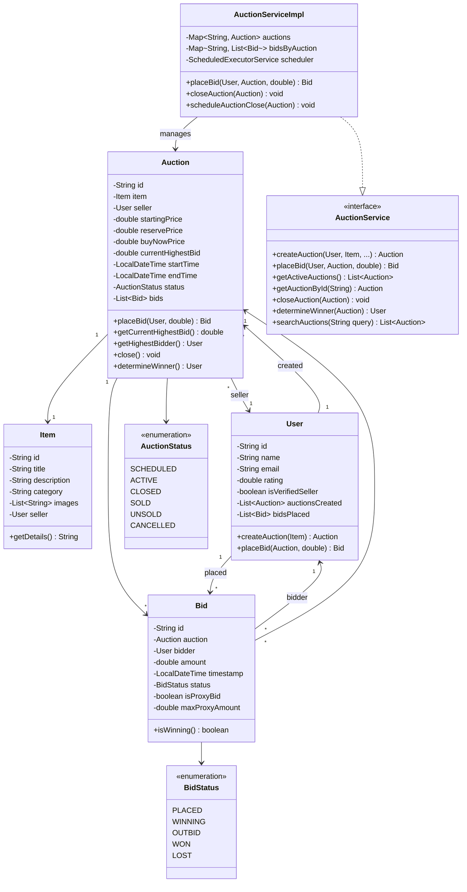

# Online Auction System - Complete LLD Guide

## 📋 Table of Contents
1. [Problem Statement](#problem-statement)
2. [Requirements](#requirements)
3. [System Design](#system-design)
4. [Class Diagram](#class-diagram)
5. [Implementation Approaches](#implementation-approaches)
6. [Design Patterns Used](#design-patterns-used)
7. [Complete Implementation](#complete-implementation)
8. [Best Practices](#best-practices)

---

## Problem Statement

Design an **Online Auction System** (like eBay) that allows sellers to list items for auction, buyers to place bids, automatic bid increment validation, winner determination, and payment processing. The system must handle concurrent bidding, proxy bids, auction scheduling, and real-time notifications.

### Key Challenges
- 🔨 **Concurrent Bidding**: Multiple users bidding simultaneously
- ⏰ **Auction Scheduling**: Start/end times, automatic closure
- 💰 **Bid Validation**: Minimum increment, reserve price
- 🤖 **Proxy Bidding**: Automatic bidding up to max amount
- 🏆 **Winner Determination**: Highest bid when auction closes
- 💳 **Payment Processing**: Winner payment, seller payout
- 📧 **Notifications**: Real-time bid updates, auction end alerts
- ⚖️ **Fraud Prevention**: Shill bidding detection

---

## Requirements

### Functional Requirements

✅ **User Management**
- Register as buyer/seller/both
- User profiles and ratings
- Verified seller status

✅ **Item Listing**
- Seller creates auction for item
- Set starting price, reserve price, buy-now price
- Set auction duration (1-10 days)
- Upload images and description
- Category and tags

✅ **Bidding**
- Place bid (must be > current highest + increment)
- View current highest bid
- Bid history for item
- Proxy bidding (auto-bid up to max)
- Bid retraction (within limits)

✅ **Auction Lifecycle**
- SCHEDULED → ACTIVE → CLOSED
- Automatic start at scheduled time
- Automatic close at end time
- Extensions if bid in last minute (soft close)

✅ **Winner Determination**
- Highest bidder wins when auction closes
- If reserve not met, auction fails
- Notify winner and seller
- Generate invoice

✅ **Payment Processing**
- Winner pays within 48 hours
- Escrow service (optional)
- Seller receives payment after shipment confirmation

✅ **Search & Discovery**
- Search items by keyword
- Filter by category, price range
- Sort by ending soon, popular, new

### Non-Functional Requirements

⚡ **Performance**:
- Bid placement < 100ms
- Support 10,000+ concurrent auctions
- Real-time bid updates (WebSocket)

🔒 **Concurrency**:
- Thread-safe bid placement
- Atomic highest bid updates
- Optimistic locking for conflicts

🛡️ **Reliability**:
- 99.9% uptime
- No lost bids
- Accurate winner determination

📈 **Scalability**:
- Horizontal scaling for bid processing
- Database sharding by auction_id
- Caching for active auctions

---

## System Design

### High-Level Architecture

```
┌─────────────────────────────────────────────────────┐
│              Client Layer                           │
│         (Web, Mobile, Real-time Updates)            │
└──────────────────┬──────────────────────────────────┘
                   │
┌──────────────────▼──────────────────────────────────┐
│            Auction Service                          │
│  ┌──────────────────────────────────────────┐      │
│  │  - Create Auction                        │      │
│  │  - Place Bid                             │      │
│  │  - Close Auction                         │      │
│  │  - Determine Winner                      │      │
│  └──────────────────────────────────────────┘      │
└──────────────────┬──────────────────────────────────┘
                   │
        ┌──────────┴──────────┐
        │                     │
┌───────▼────────┐   ┌────────▼─────────┐
│  Bid Processor │   │ Notification Svc │
│  (Queue-based) │   │   (WebSocket)    │
└────────────────┘   └──────────────────┘
        │                     │
┌───────▼─────────────────────▼──────────────────────┐
│             Data Layer                              │
│  - Auctions DB (active + closed)                   │
│  - Bids DB (append-only for audit)                 │
│  - Redis Cache (active auctions, current bid)      │
└─────────────────────────────────────────────────────┘
```

### Auction Lifecycle State Machine

```
┌──────────┐
│SCHEDULED │ (Before start time)
└─────┬────┘
      │ Start time reached
      ▼
┌──────────┐
│  ACTIVE  │ (Accepting bids)
└─────┬────┘
      │ End time reached OR Buy-now clicked
      ▼
┌──────────┐
│  CLOSED  │ (No more bids)
└─────┬────┘
      │
   ┌──┴───┐
   │      │
   ▼      ▼
┌──────┐ ┌──────────┐
│SOLD  │ │  UNSOLD  │ (Reserve not met)
└──────┘ └──────────┘
```

---

## Class Diagram


<details>
<summary>📄 View Mermaid Source</summary>



</details>

---

## Implementation Approaches

### 1. Concurrent Bid Handling

#### ❌ **Approach 1: Simple Check-Then-Update**
```java
if (bidAmount > auction.getCurrentHighestBid()) {
    auction.setCurrentHighestBid(bidAmount); // Race condition!
}
```

**Problem**: Two users can see same highest bid and both think they won

#### ✅ **Approach 2: Synchronized with Optimistic Locking** (Chosen)
```java
@Version
private Long version;

public synchronized Bid placeBid(User bidder, double amount) {
    if (status != AuctionStatus.ACTIVE) {
        throw new AuctionClosedException();
    }
    
    double minBid = currentHighestBid + MIN_INCREMENT;
    if (amount < minBid) {
        throw new InsufficientBidException("Minimum bid: " + minBid);
    }
    
    Bid bid = new Bid(bidder, amount, LocalDateTime.now());
    bids.add(bid);
    currentHighestBid = amount;
    
    // Update previous highest bidder status
    updateBidStatuses();
    
    return bid;
}
```

**Advantages:**
- ✅ **Thread-safe**: Synchronized method prevents race conditions
- ✅ **Atomic updates**: Version field ensures no lost updates
- ✅ **Audit trail**: All bids preserved in list

---

### 2. Proxy Bidding Algorithm

```java
public Bid handleProxyBid(User bidder, double maxAmount, Auction auction) {
    double currentBid = auction.getCurrentHighestBid();
    double nextIncrement = MIN_INCREMENT;
    
    // Place bid just above current highest
    double bidAmount = currentBid + nextIncrement;
    
    // If another bid comes in, auto-bid up to max
    while (bidAmount <= maxAmount && 
           auction.getCurrentHighestBid() > bidAmount) {
        bidAmount = auction.getCurrentHighestBid() + nextIncrement;
        if (bidAmount <= maxAmount) {
            auction.placeBid(bidder, bidAmount);
        }
    }
    
    return auction.getHighestBid();
}
```

**How Proxy Bidding Works:**
1. User sets max amount ($500)
2. System bids minimum ($100)
3. Another user bids $110
4. System auto-bids $120 (on behalf of user)
5. Continues until max reached or user wins

---

### 3. Auction Scheduling & Auto-Close

```java
public void scheduleAuctionClose(Auction auction) {
    long delay = ChronoUnit.SECONDS.between(
        LocalDateTime.now(), 
        auction.getEndTime()
    );
    
    scheduler.schedule(() -> {
        closeAuction(auction);
    }, delay, TimeUnit.SECONDS);
}

private void closeAuction(Auction auction) {
    auction.setStatus(AuctionStatus.CLOSED);
    
    User winner = auction.determineWinner();
    if (winner != null && 
        auction.getCurrentHighestBid() >= auction.getReservePrice()) {
        auction.setStatus(AuctionStatus.SOLD);
        notifyWinner(winner, auction);
        notifySeller(auction.getSeller(), auction);
    } else {
        auction.setStatus(AuctionStatus.UNSOLD);
    }
}
```

---

## Design Patterns Used

| Pattern | Usage | Benefit |
|---------|-------|---------|
| **Observer Pattern** | Notify bidders on outbid, auction end | Real-time updates |
| **Strategy Pattern** | Different bidding strategies (proxy, sniping) | Pluggable bid logic |
| **State Pattern** | Auction lifecycle (Scheduled → Active → Closed) | Clean state transitions |
| **Command Pattern** | Bid operations (Place, Retract, Cancel) | Undo/audit trail |
| **Scheduler Pattern** | Auto-close auctions at end time | Automated lifecycle |
| **Factory Pattern** | Create auctions, bids | Centralized creation |

---

## Complete Implementation

### 📦 Project Structure (11 files)

```
auction/
├── model/
│   ├── Auction.java             # Auction entity with bidding logic
│   ├── AuctionStatus.java       # SCHEDULED, ACTIVE, CLOSED, SOLD
│   ├── Item.java                # Item being auctioned
│   ├── Bid.java                 # Individual bid
│   ├── BidStatus.java           # PLACED, WINNING, OUTBID, WON, LOST
│   └── User.java                # (in root, should move to model)
├── api/
│   └── AuctionService.java      # Auction operations interface
├── impl/
│   └── AuctionServiceImpl.java  # Business logic with scheduling
├── Auction.java                 # (duplicate, to clean up)
├── Bid.java                     # (duplicate, to clean up)
├── AuctionSystem.java           # Facade class
└── Demo.java                    # Usage example
```

**Total Files:** 11
**Total Lines of Code:** ~343

---

## Source Code

### 📦 Complete Implementation

All source code files are available in the [**CODE.md**](/problems/auction/CODE) file.

**Quick Links:**
- 📁 [View Project Structure](/problems/auction/CODE#-project-structure-11-files)
- 💻 [Browse All Source Files](/problems/auction/CODE#-source-code)
- 🔨 [Bid Placement Logic](/problems/auction/CODE#auctionjava)
- ⏰ [Auction Scheduling](/problems/auction/CODE#auctionserviceimpljava)

---

## Best Practices

### 1. Concurrency
✅ **Synchronized Bidding**: Lock per auction for thread safety  
✅ **Optimistic Locking**: @Version for concurrent updates  
✅ **Atomic Operations**: All-or-nothing bid placement  
✅ **Queue-Based Processing**: Kafka/RabbitMQ for high-volume bids  

### 2. Real-Time Updates
✅ **WebSocket**: Push bid updates to all watchers  
✅ **Server-Sent Events**: Stream auction updates  
✅ **Polling Fallback**: For older browsers  

### 3. Fraud Prevention
✅ **Shill Bidding Detection**: Flag if seller bids on own auction  
✅ **Bid Pattern Analysis**: Detect collusion  
✅ **Verified Sellers**: Require verification for high-value items  
✅ **Escrow Service**: Hold payment until item delivered  

### 4. Performance
✅ **Cache Active Auctions**: Redis for hot auctions  
✅ **Read Replicas**: Separate DB for search/browse  
✅ **CDN**: Product images on CDN  
✅ **Pagination**: Limit bid history display  

---

## 🚀 How to Use

### 1. Create Auction
```java
AuctionService service = new AuctionServiceImpl();

Item item = new Item("Vintage Watch", "Rolex 1960s", "Watches");
Auction auction = service.createAuction(
    seller,
    item,
    100.0,     // starting price
    500.0,     // reserve price
    1000.0,    // buy-now price
    LocalDateTime.now().plusHours(1),  // start
    LocalDateTime.now().plusDays(7)    // end
);
```

### 2. Place Bid
```java
Bid bid = service.placeBid(bidder, auction, 150.0);
System.out.println("Current highest: " + auction.getCurrentHighestBid());
```

### 3. Proxy Bidding
```java
service.placeProxyBid(bidder, auction, 500.0); // Auto-bid up to $500
```

### 4. Get Auction Status
```java
Auction auction = service.getAuctionById("AUCTION123");
System.out.println("Status: " + auction.getStatus());
System.out.println("Highest Bidder: " + auction.getHighestBidder().getName());
```

### 5. Search Auctions
```java
List<Auction> results = service.searchAuctions("vintage watch");
List<Auction> electronics = service.filterByCategory("Electronics");
```

---

## 🧪 Testing Considerations

### Unit Tests
- ✅ Concurrent bid placement (10+ threads)
- ✅ Proxy bidding logic
- ✅ Reserve price validation
- ✅ Winner determination

### Integration Tests
- ✅ End-to-end auction flow
- ✅ Scheduled auction closure
- ✅ WebSocket notifications

### Load Tests
- ✅ 1000+ concurrent bids on single auction
- ✅ 10,000+ active auctions
- ✅ High-frequency bidding (last-minute rush)

---

## 📈 Scaling Considerations

### Production Enhancements
1. **Bid Queue**: Kafka for bid processing (handle spikes)
2. **Database Sharding**: Shard by auction_id or category
3. **Caching**: Redis for active auction data
4. **CDN**: Product images, static assets
5. **Microservices**: Separate bid service, notification service
6. **Event Sourcing**: Store all bid events for replay/audit

### Monitoring
- Track average bid processing time
- Monitor auction close accuracy (< 1s delay)
- Alert on failed bid placements
- Track concurrent users per auction

---

## 🔐 Security Considerations

- ✅ **Authentication**: OAuth 2.0 for API access
- ✅ **Authorization**: Users can only bid on active auctions
- ✅ **Rate Limiting**: Max 10 bids/minute per user
- ✅ **Fraud Detection**: Flag suspicious bid patterns
- ✅ **Payment Security**: PCI-DSS compliance
- ✅ **Audit Trail**: Log all bid and auction state changes

---

## 📚 Related Patterns & Problems

- **BookMyShow** - Similar concurrent resource allocation
- **Stock Exchange** - Order matching like bid matching
- **Payment Gateway** - Payment processing integration
- **E-commerce (Amazon)** - Product listing, search

---

## 🎓 Interview Tips

### Common Questions

1. **Q**: How do you handle concurrent bids?  
   **A**: Synchronized method with optimistic locking (@Version)

2. **Q**: What is proxy bidding and how does it work?  
   **A**: Auto-bid on user's behalf up to max amount, placing minimum increment above current bid

3. **Q**: How to prevent seller from bidding on own auction?  
   **A**: Check bidder != seller, flag as shill bidding if detected

4. **Q**: What if auction close is delayed due to system load?  
   **A**: Use scheduled executor with guaranteed execution, queue-based processing for reliability

5. **Q**: How to scale for Black Friday with 100x traffic?  
   **A**: Kafka for bid queue, Redis caching, horizontal scaling, WebSocket for updates

### Key Points to Mention
- ✅ Synchronized bidding with optimistic locking
- ✅ Proxy bidding algorithm
- ✅ Auction state machine (Scheduled → Active → Closed)
- ✅ ScheduledExecutorService for auto-close
- ✅ Real-time updates via WebSocket
- ✅ Fraud prevention (shill bidding detection)

---

## 📝 Summary

**Online Auction System** demonstrates:
- ✅ **Concurrency handling** with synchronized bidding
- ✅ **Real-time updates** with WebSocket/SSE
- ✅ **Automated scheduling** with executor service
- ✅ **State machine design** for auction lifecycle
- ✅ **Fraud prevention** mechanisms
- ✅ **Scalable architecture** for high-traffic events

**Key Takeaway**: The bid placement and auction close mechanisms are the **most critical components** - they must be thread-safe, accurate, and handle high concurrency during peak times (last-minute bidding).

---

## 🔗 Related Resources

- [View Complete Source Code](/problems/auction/CODE) - All 11 Java files
- [Auction Bidding Logic](/problems/auction/CODE#auctionjava) - Thread-safe implementation
- [Proxy Bidding Algorithm](/problems/auction/CODE#auctionserviceimpljava) - Auto-bid logic

---

**Perfect for**: Auction system interviews, learning concurrency patterns, understanding real-time systems
