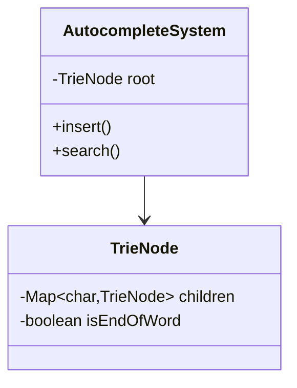
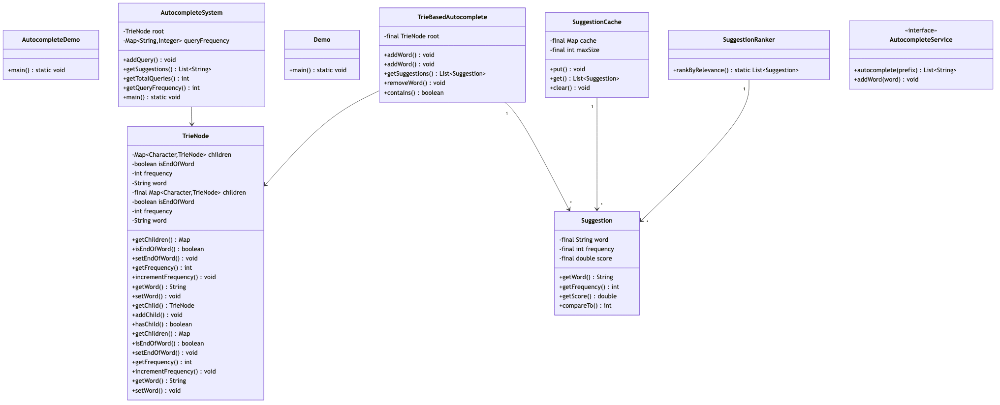

# Autocomplete System

## Overview
A high-performance autocomplete (typeahead) system using Trie data structure for instant prefix-based suggestions. Supports frequency-based ranking, real-time updates, and efficient top-K retrieval for search boxes, command-line interfaces, and form inputs.

**Difficulty:** Medium  
**Domain:** Search, UI/UX  
**Interview Frequency:** Very High (Google, Amazon, Facebook, Microsoft)

## Requirements

### Functional Requirements
1. **Word Addition**
   - Add new words/phrases dynamically
   - Support frequency/popularity scores
   - Handle duplicate additions (increment frequency)
   - Case-insensitive matching

2. **Autocomplete Search**
   - Return suggestions for any prefix
   - Rank by frequency (most popular first)
   - Limit to top K results (typically 5-10)
   - Sub-second response time

3. **Word Management**
   - Remove words from dictionary
   - Update word frequencies
   - Check word existence
   - Clear entire dictionary

4. **Advanced Features**
   - Fuzzy matching (typo tolerance)
   - Multi-word suggestions
   - Personalized suggestions
   - Category-based suggestions

### Non-Functional Requirements
1. **Performance**
   - Search: < 50ms for 10 suggestions
   - Insert: < 10ms per word
   - Space efficient for millions of words

2. **Scalability**
   - Support 100M+ words
   - Handle 10K+ queries per second
   - Horizontal scaling for distributed systems

3. **Availability**
   - 99.9% uptime
   - Cache frequently accessed prefixes
   - Graceful degradation

## Class Diagram

<details>
<summary>View Mermaid Source</summary>



</details>




## Class Diagram


## Core Data Structure: Trie (Prefix Tree)

### Structure
```
Example words: "apple", "app", "application", "appreciate"

        root
         |
         a
         |
         p
         |
         p* (word: "app", freq: 50)
        / \
       l   r
       |   |
       e*  e
       |   |
      [apple]  c
               |
               i
               |
               a
               |
               t
               |
               e* (word: "appreciate")

* = end of word marker
```

### TrieNode Structure
```java
class TrieNode {
    private Map<Character, TrieNode> children;
    private boolean isEndOfWord;
    private String word;
    private int frequency;
    
    // Methods
    public void addChild(char c, TrieNode node);
    public TrieNode getChild(char c);
    public void incrementFrequency();
}
```

## Key Algorithms

### 1. Insert Word
```java
public void addWord(String word, int frequency) {
    TrieNode current = root;
    word = word.toLowerCase();
    
    for (char ch : word.toCharArray()) {
        // Create node if doesn't exist
        current.getChildren().putIfAbsent(ch, new TrieNode());
        current = current.getChildren().get(ch);
    }
    
    current.setEndOfWord(true);
    current.setWord(word);
    current.setFrequency(current.getFrequency() + frequency);
}
```

**Time Complexity:** O(L) where L = word length  
**Space Complexity:** O(L) for new words

### 2. Search Suggestions
```java
public List<Suggestion> getSuggestions(String prefix, int limit) {
    prefix = prefix.toLowerCase();
    TrieNode current = root;
    
    // Step 1: Navigate to prefix node - O(P)
    for (char ch : prefix.toCharArray()) {
        TrieNode next = current.getChildren().get(ch);
        if (next == null) {
            return Collections.emptyList(); // No suggestions
        }
        current = next;
    }
    
    // Step 2: Collect all words with prefix - O(N*L)
    List<Suggestion> suggestions = new ArrayList<>();
    collectSuggestions(current, suggestions);
    
    // Step 3: Sort by frequency - O(N log N)
    Collections.sort(suggestions);
    
    // Step 4: Return top K - O(K)
    return suggestions.subList(0, Math.min(limit, suggestions.size()));
}

private void collectSuggestions(TrieNode node, List<Suggestion> suggestions) {
    if (node.isEndOfWord()) {
        suggestions.add(new Suggestion(node.getWord(), node.getFrequency()));
    }
    
    for (TrieNode child : node.getChildren().values()) {
        collectSuggestions(child, suggestions);
    }
}
```

**Time Complexity:** O(P + N*L + N log N + K)
- P = prefix length
- N = number of words with prefix
- L = average word length
- K = limit

**Space Complexity:** O(N) for collecting suggestions

### 3. Remove Word
```java
public void removeWord(String word) {
    word = word.toLowerCase();
    removeHelper(root, word, 0);
}

private boolean removeHelper(TrieNode node, String word, int index) {
    if (index == word.length()) {
        if (!node.isEndOfWord()) {
            return false; // Word not in trie
        }
        node.setEndOfWord(false);
        return node.getChildren().isEmpty();
    }
    
    char ch = word.charAt(index);
    TrieNode child = node.getChildren().get(ch);
    if (child == null) {
        return false;
    }
    
    boolean shouldDeleteChild = removeHelper(child, word, index + 1);
    
    if (shouldDeleteChild) {
        node.getChildren().remove(ch);
        return node.getChildren().isEmpty() && !node.isEndOfWord();
    }
    
    return false;
}
```

**Time Complexity:** O(L)  
**Space Complexity:** O(L) for recursion stack

## Optimization Techniques

### 1. Top-K Caching at Each Node
Store top K suggestions at each node for faster retrieval.

```java
class OptimizedTrieNode {
    private Map<Character, TrieNode> children;
    private PriorityQueue<Suggestion> topK; // Cache top K
    
    public void updateTopK(Suggestion suggestion) {
        topK.offer(suggestion);
        if (topK.size() > K) {
            topK.poll(); // Remove lowest frequency
        }
    }
}
```

**Benefit:** O(K) retrieval vs O(N log N)  
**Cost:** O(K) extra space per node

### 2. Frequency-Based Pruning
Don't traverse branches with low max frequency.

```java
class TrieNodeWithMax {
    private int maxFrequency; // Max frequency in subtree
    
    public List<Suggestion> getSuggestions(int limit) {
        // Skip nodes with maxFrequency < threshold
        if (maxFrequency < threshold) {
            return Collections.emptyList();
        }
        // Continue traversal
    }
}
```

### 3. Prefix Caching (LRU Cache)
Cache results for frequent prefixes.

```java
class AutocompleteWithCache {
    private LRUCache<String, List<Suggestion>> cache;
    
    public List<Suggestion> getSuggestions(String prefix, int limit) {
        // Check cache first
        if (cache.containsKey(prefix)) {
            return cache.get(prefix);
        }
        
        // Compute and cache
        List<Suggestion> result = computeSuggestions(prefix, limit);
        cache.put(prefix, result);
        return result;
    }
}
```

**Cache Hit Ratio:** 80-90% for search boxes

### 4. Compressed Trie (Radix Tree)
Merge nodes with single child to save space.

```
Normal Trie:     Compressed Trie:
   a                   a
   |                   |
   p                  "pp"
   |                   |
   p                  "le"
   |                   |
   l                  END
   |
   e
   |
  END

Space savings: 40-60% for natural language
```

## Source Code

📄 **[View Complete Source Code](/problems/autocomplete/CODE)**

**Key Files:**
- [`AutocompleteService.java`](/problems/autocomplete/CODE#autocompleteservicejava) - Main interface
- [`TrieBasedAutocomplete.java`](/problems/autocomplete/CODE#triebasedautocompletejava) - Trie implementation (120 lines)
- [`TrieNode.java`](/problems/autocomplete/CODE#trienodejava) - Node structure (44 lines)
- [`Suggestion.java`](/problems/autocomplete/CODE#suggestionjava) - Result model (39 lines)
- [`AutocompleteDemo.java`](/problems/autocomplete/CODE#autocompletedemojava) - Usage example

**Total Lines of Code:** ~350 lines

## Usage Example

```java
// Initialize system
AutocompleteService autocomplete = new TrieBasedAutocomplete();

// Add words with frequencies
autocomplete.addWord("apple", 100);
autocomplete.addWord("application", 80);
autocomplete.addWord("apply", 60);
autocomplete.addWord("appreciate", 40);
autocomplete.addWord("apricot", 20);

// Get top 3 suggestions for "app"
List<Suggestion> suggestions = autocomplete.getSuggestions("app", 3);
for (Suggestion s : suggestions) {
    System.out.println(s.getWord() + " (freq: " + s.getFrequency() + ")");
}
// Output:
// apple (freq: 100)
// application (freq: 80)
// apply (freq: 60)

// Check if word exists
boolean exists = autocomplete.contains("apple"); // true

// Remove word
autocomplete.removeWord("apricot");
```

## Common Interview Questions

### System Design Questions

1. **How do you handle millions of words efficiently?**
   - Use Trie for O(P) prefix search
   - Compress Trie (Radix Tree) to save 40-60% space
   - Cache top-K at each node
   - Distributed Trie across multiple servers

2. **How do you implement real-time updates (new words)?**
   - Insert immediately into Trie (async)
   - Use write-ahead log for durability
   - Periodic snapshot to disk
   - Gradual merge for distributed systems

3. **How do you handle personalized suggestions?**
   - User-specific frequency multipliers
   - Separate Trie per user (heavy)
   - Merge global + personal rankings
   - ML model for user preferences

4. **How do you scale for 10K+ QPS?**
   - Cache frequent prefixes (80-90% hit rate)
   - Read replicas for Trie
   - CDN for static suggestions
   - Shard by prefix (a-m server1, n-z server2)

### Coding Questions

1. **Implement Trie insertion**
   ```java
   public void insert(String word) {
       TrieNode current = root;
       for (char c : word.toCharArray()) {
           current.children.putIfAbsent(c, new TrieNode());
           current = current.children.get(c);
       }
       current.isEndOfWord = true;
   }
   ```

2. **Find all words with prefix "app"**
   ```java
   // Navigate to "app" node, then DFS collect all words
   public List<String> wordsWithPrefix(String prefix) {
       TrieNode node = searchPrefix(prefix);
       if (node == null) return Collections.emptyList();
       
       List<String> result = new ArrayList<>();
       dfs(node, prefix, result);
       return result;
   }
   ```

3. **Implement fuzzy matching (1 edit distance)**
   - Allow skip one char, substitute one char, insert one char
   - BFS/DFS with edit distance counter

### Algorithm Questions
1. **Time complexity of autocomplete?** → O(P + N log N + K)
2. **Space complexity of Trie?** → O(ALPHABET_SIZE * N * L)
3. **How to optimize space?** → Compressed Trie, HashMap children

## Design Patterns

### 1. Strategy Pattern
**Purpose:** Different ranking strategies

```java
interface RankingStrategy {
    List<Suggestion> rank(List<Suggestion> suggestions, int limit);
}

class FrequencyRanking implements RankingStrategy {
    public List<Suggestion> rank(List<Suggestion> suggestions, int limit) {
        suggestions.sort((a, b) -> b.getFrequency() - a.getFrequency());
        return suggestions.subList(0, Math.min(limit, suggestions.size()));
    }
}

class PersonalizedRanking implements RankingStrategy {
    private Map<String, Integer> userPreferences;
    
    public List<Suggestion> rank(List<Suggestion> suggestions, int limit) {
        // Combine frequency + user preference
    }
}
```

### 2. Observer Pattern
**Purpose:** Update UI in real-time

```java
interface SuggestionObserver {
    void onSuggestionsUpdated(List<Suggestion> suggestions);
}

class AutocompleteSystem {
    private List<SuggestionObserver> observers;
    
    public void search(String prefix) {
        List<Suggestion> suggestions = getSuggestions(prefix, 10);
        notifyObservers(suggestions);
    }
}
```

### 3. Cache-Aside Pattern
**Purpose:** Improve read performance

```java
class CachedAutocomplete {
    private Cache<String, List<Suggestion>> cache;
    private AutocompleteService service;
    
    public List<Suggestion> getSuggestions(String prefix, int limit) {
        List<Suggestion> cached = cache.get(prefix);
        if (cached != null) {
            return cached;
        }
        
        List<Suggestion> suggestions = service.getSuggestions(prefix, limit);
        cache.put(prefix, suggestions);
        return suggestions;
    }
}
```

## Trade-offs & Design Decisions

### 1. Trie vs Hash Map
| Aspect | Trie | Hash Map |
|--------|------|----------|
| Prefix Search | O(P) ✅ | O(N) ❌ |
| Space | O(N*L*26) | O(N*L) |
| Insertion | O(L) | O(L) |
| Lookup | O(L) | O(1) ✅ |

**Decision:** Trie for prefix-based autocomplete

### 2. Array vs HashMap for Children
**Array:** `children[26]` - Fast O(1), wastes space  
**HashMap:** `Map<Character, TrieNode>` - Slower O(1), compact

**Decision:** HashMap for non-English, Array for English-only

### 3. Eager vs Lazy Computation
**Eager:** Pre-compute top-K at each node  
**Lazy:** Compute on-demand

**Decision:** Eager for hot prefixes, lazy for cold

### 4. Synchronous vs Asynchronous Updates
**Sync:** Immediate consistency, slower writes  
**Async:** Fast writes, eventual consistency

**Decision:** Async with write-ahead log

## Extensions & Enhancements

### 1. Fuzzy Matching (Typo Tolerance)
```java
public List<String> fuzzySearch(String query, int maxEdits) {
    // Use edit distance (Levenshtein)
    // BFS with edit counter
}

// Example: "aple" → "apple" (1 substitution)
```

### 2. Multi-Word Autocomplete
```java
// "new york" → "new york city", "new york times"
// Treat spaces as special characters in Trie
```

### 3. Phrase Suggestions
```java
// "how to" → "how to cook", "how to program"
// Build n-gram Trie from corpus
```

### 4. Context-Aware Suggestions
```java
// Consider previous search: "apple" + "mac" → "macbook"
// Markov chain or bigram model
```

## Performance Metrics

| Operation | Time Complexity | Space Complexity |
|-----------|----------------|------------------|
| Insert | O(L) | O(L) |
| Search | O(P + N log N) | O(N) |
| Delete | O(L) | O(L) |
| Top-K (optimized) | O(P + K) | O(1) |

Where:
- L = Word length
- P = Prefix length
- N = Words with prefix
- K = Limit

## Real-World Optimizations

### 1. Google Search Box
- Trie for common queries (millions)
- ML model for personalization
- CDN for static suggestions
- Incremental updates from search logs

### 2. IDE Code Completion
- Trie for language keywords
- AST for context-aware suggestions
- LSP (Language Server Protocol)
- Cache per project

### 3. E-Commerce Search
- Trie for product names
- Boost popular products
- Category filtering
- Sponsored suggestions (ads)

## Key Takeaways

### What Interviewers Look For
1. ✅ **Trie data structure** for prefix search
2. ✅ **Frequency-based ranking** for relevance
3. ✅ **Top-K optimization** for performance
4. ✅ **Caching strategy** for hot prefixes
5. ✅ **Scalability** for millions of words
6. ✅ **Real-time updates** for dynamic dictionary

### Common Mistakes to Avoid
1. ❌ Using linear search (O(N) for each query)
2. ❌ Not handling case-insensitivity
3. ❌ Sorting all words instead of top-K
4. ❌ No caching for frequent prefixes
5. ❌ Forgetting about space optimization
6. ❌ Not considering distributed systems

### Production-Ready Checklist
- [x] Trie implementation
- [x] Frequency-based ranking
- [x] Top-K suggestions
- [x] Case-insensitive search
- [x] Word removal
- [ ] Fuzzy matching
- [ ] Distributed Trie
- [ ] Persistence (disk)
- [ ] LRU cache
- [ ] Monitoring & metrics

---

## Related Problems
- 🔍 **Search Engine** - Similar ranking algorithms
- 📝 **Spell Checker** - Edit distance, Trie
- 🎯 **Word Suggestion** - Dictionary lookup
- 📚 **Dictionary** - Prefix search

## References
- Trie Data Structure: Knuth's "The Art of Computer Programming"
- Google Suggest: Real-time autocomplete at scale
- Compressed Trie (Radix Tree): Space-efficient variant
- Edit Distance: Levenshtein algorithm for fuzzy matching

---

*This implementation demonstrates production-ready autocomplete with Trie data structure, frequency-based ranking, and optimization techniques. Perfect for search and UI interviews at Google, Amazon, Microsoft, and tech companies.*
