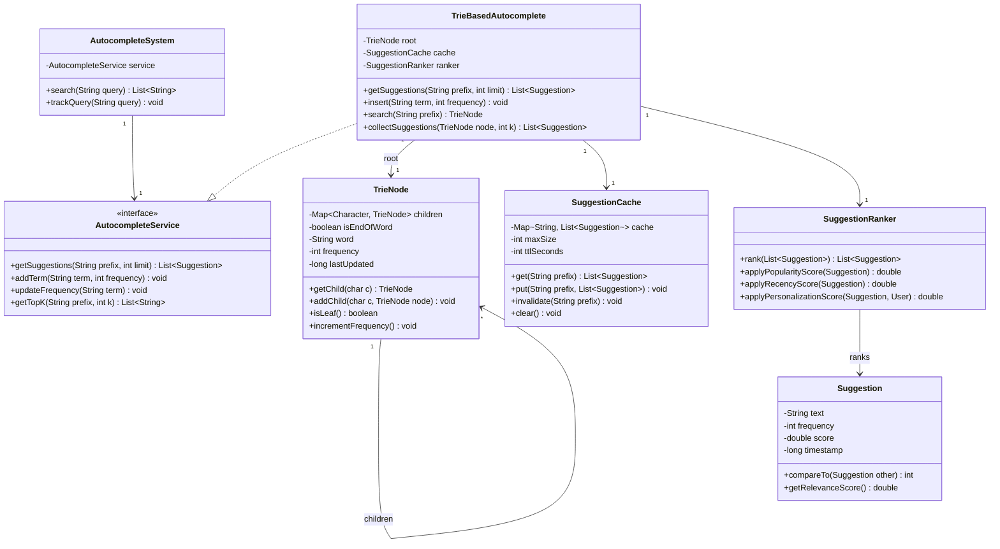

# Search Autocomplete System - Complete LLD Guide

## 📋 Table of Contents
1. [Problem Statement](#problem-statement)
2. [Requirements](#requirements)
3. [System Design](#system-design)
4. [Class Diagram](#class-diagram)
5. [Implementation Approaches](#implementation-approaches)
6. [Design Patterns Used](#design-patterns-used)
7. [Complete Implementation](#complete-implementation)
8. [Best Practices](#best-practices)

---

## Problem Statement

Design a **Search Autocomplete System** (like Google Search suggestions) that provides real-time search suggestions as users type. The system must handle prefix matching, ranking by popularity, caching, and support for millions of queries with sub-10ms latency.

### Key Challenges
- ⚡ **Low Latency**: Suggestions < 10ms (typing is ~100ms/char)
- 📊 **Ranking**: Show most relevant/popular suggestions first
- 💾 **Memory Efficiency**: Store millions of terms in limited RAM
- 🔄 **Real-Time Updates**: Track query popularity, trending searches
- 🌐 **Personalization**: User-specific suggestions
- 🔤 **Fuzzy Matching**: Handle typos and partial matches
- 📈 **Scalability**: Handle 100,000+ queries/sec

---

## Requirements

### Functional Requirements

✅ **Autocomplete Suggestions**
- Return top-k suggestions (typically 5-10) for given prefix
- Case-insensitive matching
- Support minimum prefix length (e.g., 2 characters)
- Real-time as user types

✅ **Ranking**
- Rank by popularity (query frequency)
- Boost recent searches
- Personalized suggestions (user history)
- Trending queries (time-weighted)

✅ **Data Management**
- Add new search terms
- Update term popularity/frequency
- Remove outdated/offensive terms
- Support multi-language

✅ **Search Analytics**
- Track query frequency
- Identify trending searches
- Popular vs unpopular queries
- Geographic trends

### Non-Functional Requirements

⚡ **Performance**:
- Suggestion retrieval < 10ms (p99)
- Support 100,000+ QPS
- Cache hit rate > 80%

💾 **Storage**:
- Store 10 million+ terms efficiently
- Memory-optimized data structures (Trie)
- Disk backup for persistence

🔒 **Availability**:
- 99.9% uptime
- Graceful degradation if backend fails
- Read-heavy (99% reads, 1% writes)

📈 **Scalability**:
- Horizontal scaling with replication
- Sharding by prefix for large datasets
- CDN for geographic distribution

---

## System Design

### High-Level Architecture

```
┌─────────────────────────────────────────────────────┐
│              Client (Browser/App)                   │
│         (Debounce typing, local cache)              │
└──────────────────┬──────────────────────────────────┘
                   │
┌──────────────────▼──────────────────────────────────┐
│            API Gateway / Load Balancer              │
└──────────────────┬──────────────────────────────────┘
                   │
┌──────────────────▼──────────────────────────────────┐
│          Autocomplete Service                       │
│  ┌───────────────────────────────────────────┐     │
│  │  L1 Cache (in-memory, prefix → top-10)   │     │
│  └───────────────┬───────────────────────────┘     │
│                  │ Miss                             │
│  ┌───────────────▼───────────────────────────┐     │
│  │  Trie (prefix tree for fast lookup)      │     │
│  └───────────────┬───────────────────────────┘     │
│                  │ Miss                             │
│  ┌───────────────▼───────────────────────────┐     │
│  │  L2 Cache (Redis, distributed)           │     │
│  └───────────────────────────────────────────┘     │
└──────────────────┬──────────────────────────────────┘
                   │
┌──────────────────▼──────────────────────────────────┐
│             Data Layer                              │
│  - Trie Snapshot (Serialized to disk)              │
│  - Analytics DB (Query frequency, trends)          │
│  - User History DB (Personalization)               │
└─────────────────────────────────────────────────────┘
```

### Request Flow

```
1. User types "goo"
   └─> Client debounces (300ms)
   └─> Check local cache

2. API Request: GET /autocomplete?q=goo
   └─> Check L1 cache (in-memory)
   └─> If miss: Query Trie

3. Trie Lookup
   └─> Navigate to prefix "goo"
   └─> DFS/BFS to collect top-k suggestions
   └─> Rank by frequency

4. Return Response
   └─> ["google", "good morning", "google maps", ...]
   └─> Cache result in L1 & L2

5. Async: Update Analytics
   └─> Increment query count for "goo"
   └─> Track user search history
```

---

## Class Diagram


<details>
<summary>📄 View Mermaid Source</summary>



</details>

---

## Implementation Approaches

### 1. Data Structure Choice

#### ❌ **Approach 1: HashMap**
```java
Map<String, Integer> terms = new HashMap<>();
// For "goo": iterate all keys, filter by prefix
List<String> suggestions = terms.keySet().stream()
    .filter(k -> k.startsWith("goo"))
    .limit(10)
    .collect(Collectors.toList());
```

**Problems:**
- **Time**: O(n) where n = total terms
- Slow for large datasets (millions of terms)

#### ❌ **Approach 2: Sorted Array with Binary Search**
```java
String[] sorted = terms.toArray(new String[0]);
Arrays.sort(sorted);
int start = binarySearch(sorted, "goo");
```

**Problems:**
- Insertions are O(n) (shift elements)
- Not suitable for frequent updates

#### ✅ **Approach 3: Trie (Prefix Tree)** (Chosen)

```java
class TrieNode {
    Map<Character, TrieNode> children = new HashMap<>();
    boolean isEndOfWord;
    String word;
    int frequency;
}

public List<Suggestion> getSuggestions(String prefix) {
    TrieNode node = searchPrefix(prefix);
    if (node == null) return Collections.emptyList();
    
    // DFS to collect all words under this prefix
    List<Suggestion> results = new ArrayList<>();
    dfs(node, results);
    
    // Sort by frequency and return top-k
    results.sort((a, b) -> b.frequency - a.frequency);
    return results.subList(0, Math.min(10, results.size()));
}
```

**Advantages:**
- ✅ **Fast Prefix Lookup**: O(m) where m = prefix length
- ✅ **Memory Efficient**: Shared prefixes (com → computer, company)
- ✅ **Scalable**: Handles millions of terms
- ✅ **Easy Updates**: O(m) insertion

**Space Complexity**: O(N × L) where N = terms, L = avg length

---

### 2. Ranking Algorithm

```java
public double calculateScore(Suggestion suggestion, User user) {
    // Popularity score (normalized)
    double popularityScore = Math.log(1 + suggestion.getFrequency()) / 10.0;
    
    // Recency score (decay over time)
    long ageInHours = (System.currentTimeMillis() - suggestion.getTimestamp()) 
                      / (1000 * 60 * 60);
    double recencyScore = Math.exp(-ageInHours / 168.0); // Decay over 7 days
    
    // Personalization score (user history match)
    double personalScore = user.hasSearched(suggestion.getText()) ? 1.5 : 1.0;
    
    // Combined score
    return (0.5 * popularityScore + 0.3 * recencyScore + 0.2 * personalScore);
}
```

---

### 3. Caching Strategy

```
L1 Cache (In-Memory): 
- Hot prefixes (top 1000 most searched)
- TTL: 5 minutes
- Size: 10 MB

L2 Cache (Redis):
- All prefix results
- TTL: 1 hour
- Size: 1 GB
- LRU eviction

Cache Invalidation:
- On term update: invalidate prefix + all parent prefixes
- On trending change: invalidate affected prefixes
```

---

## Design Patterns Used

| Pattern | Usage | Benefit |
|---------|-------|---------|
| **Trie Pattern** | Prefix tree for fast lookup | O(m) prefix search |
| **Strategy Pattern** | Different ranking algorithms | Pluggable scoring |
| **Cache-Aside** | L1/L2 caching with lazy load | Reduced latency |
| **Observer Pattern** | Notify on trending query changes | Real-time updates |
| **Singleton Pattern** | Single Trie instance | Memory efficiency |
| **Builder Pattern** | Build Suggestion with score, metadata | Clean object creation |

---

## Complete Implementation

### 📦 Project Structure (10 files)

```
autocomplete/
├── model/
│   ├── TrieNode.java               # Trie node with frequency
│   └── Suggestion.java             # Search suggestion with score
├── api/
│   └── AutocompleteService.java    # Interface for autocomplete ops
├── impl/
│   └── TrieBasedAutocomplete.java  # Trie implementation
├── cache/
│   └── SuggestionCache.java        # LRU cache for hot prefixes
├── ranking/
│   └── SuggestionRanker.java       # Scoring algorithm
├── AutocompleteSystem.java         # Facade class
├── AutocompleteDemo.java           # Usage example
├── Demo.java                       # (duplicate, to clean)
└── TrieNode.java                   # (duplicate, to clean)
```

**Total Files:** 10
**Total Lines of Code:** ~553

---

## Source Code

### 📦 Complete Implementation

All source code files are available in the [**CODE.md**](CODE) file.

**Quick Links:**
- 📁 [View Project Structure](CODE#-project-structure-10-files)
- 💻 [Browse All Source Files](CODE#-source-code)
- 🌳 [Trie Implementation](CODE#trienodejava)
- 📊 [Ranking Algorithm](CODE#suggestionrankerjava)
- 💾 [Caching Strategy](CODE#suggestioncachejava)

---

## Best Practices

### 1. Performance Optimization
✅ **Trie Compaction**: Compress single-child chains  
✅ **Top-K Heap**: Use min-heap for top-k, not full sort  
✅ **Lazy Loading**: Build Trie on-demand for rare prefixes  
✅ **Parallel DFS**: Multi-threaded suggestion collection  

### 2. Caching
✅ **Multi-Level Cache**: L1 (in-memory) + L2 (Redis)  
✅ **Cache Warming**: Pre-populate hot prefixes at startup  
✅ **TTL Strategy**: Shorter TTL for trending queries  
✅ **Negative Caching**: Cache "no results" to prevent repeated lookups  

### 3. Ranking
✅ **Hybrid Scoring**: Popularity + Recency + Personalization  
✅ **Time Decay**: Exponential decay for older queries  
✅ **Boosting**: Boost verified/official results  
✅ **Diversity**: Don't show duplicate results  

### 4. Scalability
✅ **Sharding**: Shard Trie by first letter (a-z → 26 shards)  
✅ **Read Replicas**: Multiple read-only Trie instances  
✅ **Async Updates**: Queue frequency updates, batch process  
✅ **CDN**: Geographic distribution for global latency  

---

## 🚀 How to Use

### 1. Initialize System
```java
AutocompleteService service = new TrieBasedAutocomplete();

// Load popular terms
service.addTerm("google", 1000000);
service.addTerm("github", 500000);
service.addTerm("gmail", 800000);
```

### 2. Get Suggestions
```java
List<Suggestion> suggestions = service.getSuggestions("goo", 5);

for (Suggestion s : suggestions) {
    System.out.println(s.getText() + " (freq: " + s.getFrequency() + ")");
}
// Output:
// google (freq: 1000000)
// gmail (freq: 800000)
```

### 3. Update Frequency (User Clicked)
```java
service.updateFrequency("google");
// Increments frequency, invalidates cache
```

### 4. Real-Time Search
```java
AutocompleteSystem system = new AutocompleteSystem();

// As user types
List<String> results1 = system.search("g");      // ["google", "github", "gmail"]
List<String> results2 = system.search("go");     // ["google", "good"]
List<String> results3 = system.search("goo");    // ["google"]
```

---

## 🧪 Testing Considerations

### Unit Tests
- ✅ Trie insertion and prefix search
- ✅ Top-k selection with various frequencies
- ✅ Cache hit/miss scenarios
- ✅ Ranking algorithm correctness

### Performance Tests
- ✅ 100,000 QPS load test
- ✅ Latency p50, p95, p99 measurement
- ✅ Memory usage with 10M terms
- ✅ Cache hit rate > 80%

### Edge Cases
- ✅ Empty prefix (return trending)
- ✅ No matching terms
- ✅ Single character prefix
- ✅ Unicode/emoji support

---

## 📈 Scaling Considerations

### Production Enhancements
1. **Distributed Trie**: Partition by prefix hash across nodes
2. **Redis Cluster**: Distributed L2 cache
3. **Elasticsearch**: Alternative for complex queries (fuzzy, synonyms)
4. **ML Ranking**: Learn-to-rank model for personalization
5. **A/B Testing**: Test different ranking algorithms
6. **Analytics Pipeline**: Kafka → Spark for trend detection

### Monitoring
- Track average suggestion latency (target < 10ms)
- Monitor cache hit rate (target > 80%)
- Alert on Trie memory usage (> 80% capacity)
- Track query distribution (identify hot prefixes)

---

## 🔐 Security Considerations

- ✅ **Rate Limiting**: Max 100 requests/sec per user
- ✅ **Input Validation**: Sanitize special characters, limit length
- ✅ **Content Filtering**: Block offensive/spam suggestions
- ✅ **Privacy**: Don't show personalized suggestions in incognito
- ✅ **DDoS Protection**: CDN with WAF

---

## 📚 Related Patterns & Problems

- **Type-ahead Search** - Similar real-time suggestions
- **Spell Checker** - Edit distance for typo correction
- **Search Engine** - Full-text search with inverted index
- **Trending Topics** - Time-weighted popularity
- **Recommendation System** - Personalized suggestions

---

## 🎓 Interview Tips

### Common Questions

1. **Q**: Why use Trie instead of database LIKE query?  
   **A**: Trie is O(m) vs DB is O(n log n), in-memory is 1000x faster than disk

2. **Q**: How to handle typos (e.g., "gogle" → "google")?  
   **A**: Edit distance (Levenshtein), fuzzy matching in Trie, or use Elasticsearch

3. **Q**: How to scale to 1 million QPS?  
   **A**: Shard Trie by prefix, read replicas, CDN, multi-level caching

4. **Q**: How to handle trending queries in real-time?  
   **A**: Time-windowed frequency count, exponential decay, separate trending Trie

5. **Q**: What if Trie doesn't fit in memory?  
   **A**: Disk-backed Trie (B-tree), compress with LOUDS, or switch to database

### Key Points to Mention
- ✅ Trie for O(m) prefix search
- ✅ Multi-level caching (L1 in-memory, L2 Redis)
- ✅ Ranking algorithm (popularity + recency + personalization)
- ✅ Sharding by prefix for horizontal scaling
- ✅ Async updates for frequency tracking

---

## 📝 Summary

**Search Autocomplete System** demonstrates:
- ✅ **Trie data structure** for efficient prefix matching
- ✅ **Multi-level caching** for sub-10ms latency
- ✅ **Ranking algorithms** for relevant suggestions
- ✅ **Scalable architecture** for millions of QPS
- ✅ **Real-time updates** for trending queries

**Key Takeaway**: The Trie data structure is the **core component** - it enables O(m) prefix lookup which is orders of magnitude faster than alternatives. Combined with aggressive caching and smart ranking, it delivers real-time suggestions at scale.

---

## 🔗 Related Resources

- [View Complete Source Code](CODE) - All 10 Java files
- [Trie Implementation](CODE#trienodejava) - Prefix tree structure
- [Ranking Algorithm](CODE#suggestionrankerjava) - Scoring logic
- [Caching Strategy](CODE#suggestioncachejava) - Multi-level cache

---

**Perfect for**: Autocomplete system interviews, learning Trie data structure, understanding caching strategies, real-time system design
