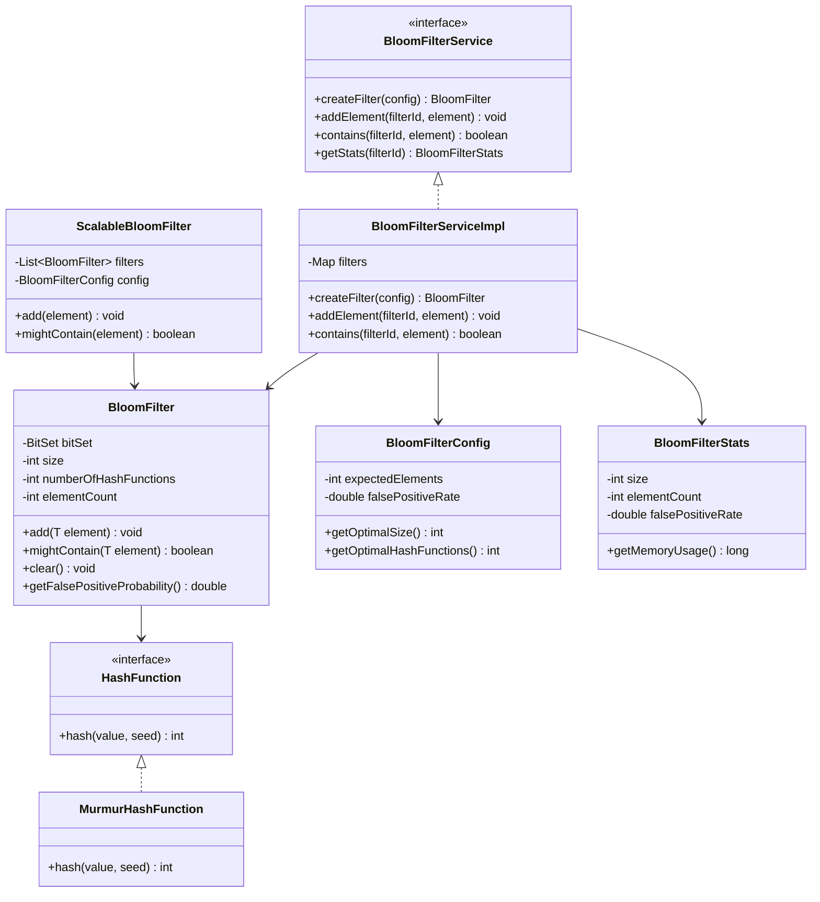

# Bloom Filter - Complete LLD Guide

## 📋 Table of Contents
1. [Problem Statement](#problem-statement)
2. [Requirements](#requirements)
3. [Class Diagram](#class-diagram)
4. [Implementation Guide](#implementation-guide)
5. [Complete Source Code](#complete-source-code)

---

## Problem Statement

Design a **Bloom Filter** - a space-efficient probabilistic data structure used to test whether an element is a member of a set.

### Key Characteristics
- ✅ **No false negatives**: If it says "not present", element is definitely not in the set
- ⚠️ **Possible false positives**: If it says "present", element might not actually be in the set
- 💾 **Space efficient**: Uses much less memory than HashSet
- ⚡ **Fast operations**: O(k) time complexity where k = number of hash functions

### Use Cases
1. **Web Crawlers** - Avoid re-crawling already visited URLs
2. **Database Query Optimization** - Quick membership check before expensive DB query
3. **Spam Filtering** - Fast spam email detection
4. **Cache Filtering** - Check if item exists before cache lookup
5. **Distributed Systems** - Reduce network calls for non-existent data

---

## Requirements

### Functional Requirements
✅ Add elements to the filter  
✅ Check if element might be present  
✅ Configure false positive rate  
✅ Configure expected number of elements  
✅ Support for scalable bloom filter (auto-resizing)  
✅ Get filter statistics (size, element count, false positive probability)

### Non-Functional Requirements
⚡ **Performance**: O(k) add and contains operations  
💾 **Memory**: Configurable based on false positive rate  
🔒 **Thread Safety**: Support concurrent access  
📈 **Scalability**: Handle millions of elements  

---

## Class Diagram


<details>
<summary>📝 View Mermaid Source</summary>



</details>

---

## Implementation Guide

### 1. **Optimal Size Calculation**

```java
// Optimal bit array size
size = -(n * ln(p)) / (ln(2)^2)

// Where:
// n = expected number of elements
// p = desired false positive rate
```

### 2. **Optimal Hash Functions**

```java
// Optimal number of hash functions
k = (size / n) * ln(2)

// Where:
// size = bit array size
// n = expected number of elements
```

### 3. **Hash Function Strategy**

- Use **MurmurHash** for fast, uniform distribution
- Generate k hash values using double hashing:
  ```java
  hash_i = (hash1 + i * hash2) % size
  ```

### 4. **False Positive Probability**

```java
// Actual false positive probability after m insertions
p = (1 - e^(-k*m/size))^k

// Where:
// k = number of hash functions
// m = actual number of insertions
// size = bit array size
```

---

## Complete Source Code

### Project Structure (10 files)

```
bloomfilter/
├── BloomFilter.java                  # Core bloom filter implementation
├── BloomFilterDemo.java              # Usage examples
├── api/
│   └── BloomFilterService.java       # Service interface
├── config/
│   └── BloomFilterConfig.java        # Configuration with optimal sizing
├── hash/
│   ├── HashFunction.java             # Hash function interface
│   └── MurmurHashFunction.java       # MurmurHash implementation
├── impl/
│   └── BloomFilterServiceImpl.java   # Service implementation
├── model/
│   ├── BloomFilter.java              # Model version
│   └── ScalableBloomFilter.java      # Auto-resizing bloom filter
└── util/
    └── BloomFilterStats.java         # Statistics and monitoring
```

**Total Files:** 10

### 📄 View Source Code

All source code is available in the [CODE.md](CODE) file, organized by package:

1. **Core Implementation**
   - [BloomFilter.java](CODE#bloomfilterjava) - Main bloom filter with BitSet
   - [BloomFilterDemo.java](CODE#bloomfilterdemo.java) - Usage examples

2. **Service Layer**
   - [BloomFilterService.java](CODE#bloomfilterservicejava) - Service interface
   - [BloomFilterServiceImpl.java](CODE#bloomfilterserviceimpljava) - Service implementation

3. **Configuration**
   - [BloomFilterConfig.java](CODE#bloomfilterconfigjava) - Optimal sizing calculations

4. **Hash Functions**
   - [HashFunction.java](CODE#hashfunctionjava) - Hash function interface
   - [MurmurHashFunction.java](CODE#murmurhashfunctionjava) - Fast hash implementation

5. **Models**
   - [model/BloomFilter.java](CODE#modelbloomfilterjava) - Model representation
   - [ScalableBloomFilter.java](CODE#scalablebloomfilterjava) - Auto-resizing filter

6. **Utilities**
   - [BloomFilterStats.java](CODE#bloomfilterstatsjava) - Statistics tracking

---

## Design Patterns Used

| Pattern | Purpose | Implementation |
|---------|---------|----------------|
| **Strategy Pattern** | Different hash functions | `HashFunction` interface with `MurmurHashFunction` |
| **Builder Pattern** | Filter configuration | `BloomFilterConfig` with fluent API |
| **Facade Pattern** | Simple service interface | `BloomFilterService` hides complexity |
| **Composite Pattern** | Scalable bloom filter | `ScalableBloomFilter` uses multiple filters |

---

## Best Practices

### 1. **Configuration**
```java
// Choose based on your requirements
int expectedElements = 1_000_000;
double falsePositiveRate = 0.01; // 1% false positive rate

BloomFilterConfig config = new BloomFilterConfig(expectedElements, falsePositiveRate);
```

### 2. **Thread Safety**
- Use `AtomicLong` for element count
- Consider `BitSet` synchronization for concurrent access
- Or use separate filters per thread

### 3. **Monitoring**
```java
BloomFilterStats stats = service.getStats(filterId);
System.out.println("Size: " + stats.getSize());
System.out.println("Elements: " + stats.getElementCount());
System.out.println("False Positive Rate: " + stats.getFalsePositiveRate());
```

### 4. **When to Use**
✅ **Use Bloom Filter when:**
- Memory is constrained
- False positives are acceptable
- Need fast membership check
- Working with large datasets

❌ **Don't use when:**
- Need 100% accuracy
- Need to remove elements (use Counting Bloom Filter)
- Need to retrieve stored elements

---

## References

- [Original Paper](https://en.wikipedia.org/wiki/Bloom_filter)
- [MurmurHash](https://en.wikipedia.org/wiki/MurmurHash)
- [Scalable Bloom Filters](http://gsd.di.uminho.pt/members/cbm/ps/dbloom.pdf)

---

## Related Resources

- [Complete Implementation](CODE) - View all 10 source files
- [LLD Playbook Home](../../) - Back to main guide

