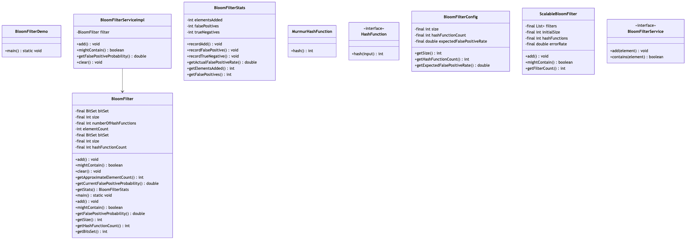

# Bloom Filter

## Overview
A space-efficient probabilistic data structure for membership testing. Bloom filters can answer "Is element X in the set?" with possible false positives but zero false negatives. Used extensively in databases, caches, web crawlers, and distributed systems for reducing expensive lookups.

**Difficulty:** Medium  
**Domain:** Data Structures, Distributed Systems  
**Interview Frequency:** High (Google, Amazon, LinkedIn, Redis, Cassandra)

## Requirements

### Functional Requirements
1. **Add Elements**
   - Insert elements into the filter
   - No duplicates needed (idempotent)
   - Cannot remove elements (standard)

2. **Membership Test**
   - Check if element might be in set
   - Return true (might be present) or false (definitely not present)
   - Allow configurable false positive rate

3. **Filter Management**
   - Clear all elements
   - Get statistics (fill ratio, FPP)
   - Support multiple data types

4. **Scalable Variant**
   - Grow dynamically as more elements added
   - Maintain target false positive rate
   - Multiple chained filters

### Non-Functional Requirements
1. **Space Efficiency**
   - 10-100x smaller than HashSet
   - Configurable memory usage
   - Example: 1M URLs in ~1.2 MB (1% FPP)

2. **Performance**
   - Add: O(k) where k = hash functions
   - Contains: O(k)
   - Both operations < 1 μs

3. **Accuracy**
   - Configurable false positive rate
   - Zero false negatives (guaranteed)
   - Predictable error probability

## Class Diagram


## Class Diagram



## Core Concepts

### How It Works
```
Example: Bloom Filter with size=10, k=3 hash functions

1. Empty filter:
   [0][0][0][0][0][0][0][0][0][0]
    0  1  2  3  4  5  6  7  8  9

2. Add "apple":
   hash1("apple") = 2
   hash2("apple") = 5
   hash3("apple") = 8
   
   [0][0][1][0][0][1][0][0][1][0]
    0  1  2  3  4  5  6  7  8  9

3. Add "orange":
   hash1("orange") = 1
   hash2("orange") = 5  (collision!)
   hash3("orange") = 9
   
   [0][1][1][0][0][1][0][0][1][1]
    0  1  2  3  4  5  6  7  8  9

4. Check "apple": 
   Bits 2,5,8 are all 1 → Might be present ✅

5. Check "banana":
   hash1("banana") = 3 (bit is 0)
   → Definitely NOT present ❌

6. Check "grape":
   hash1("grape") = 1 (1)
   hash2("grape") = 5 (1)
   hash3("grape") = 9 (1)
   → Might be present (FALSE POSITIVE) ⚠️
```

### Mathematical Foundation

#### Optimal Size
```
m = -n * ln(p) / (ln(2)^2)

Where:
- m = bit array size
- n = expected number of elements
- p = desired false positive probability
```

#### Optimal Hash Functions
```
k = (m/n) * ln(2)

Where:
- k = number of hash functions
- m = bit array size
- n = number of elements
```

#### False Positive Probability
```
p = (1 - e^(-kn/m))^k

Where:
- p = false positive probability
- k = number of hash functions
- n = number of elements
- m = bit array size
```

**Example:**
- n = 1,000,000 elements
- p = 0.01 (1% FPP)
- m = 9,585,059 bits ≈ 1.2 MB
- k = 7 hash functions

## Key Algorithms

### 1. Add Element
```java
public void add(T element) {
    int[] hashes = getHashes(element);
    for (int hash : hashes) {
        bitSet.set(Math.abs(hash % size));
    }
    elementCount++;
}
```

**Time Complexity:** O(k)  
**Space Complexity:** O(1)

### 2. Check Membership
```java
public boolean mightContain(T element) {
    int[] hashes = getHashes(element);
    for (int hash : hashes) {
        if (!bitSet.get(Math.abs(hash % size))) {
            return false; // Definitely not present
        }
    }
    return true; // Might be present
}
```

**Time Complexity:** O(k)  
**Space Complexity:** O(1)

### 3. Calculate Optimal Parameters
```java
private static int optimalSize(int n, double p) {
    return (int) Math.ceil(-n * Math.log(p) / Math.pow(Math.log(2), 2));
}

private static int optimalHashFunctions(int n, int m) {
    return Math.max(1, (int) Math.round((double) m / n * Math.log(2)));
}
```

### 4. Multiple Hash Functions (Double Hashing)
```java
private int[] getHashes(T element) {
    int[] hashes = new int[numberOfHashFunctions];
    
    // Generate two base hashes
    int hash1 = hash(element, 0);
    int hash2 = hash(element, 1);
    
    // Generate k hashes using double hashing
    for (int i = 0; i < numberOfHashFunctions; i++) {
        hashes[i] = hash1 + i * hash2;
    }
    
    return hashes;
}
```

**Why double hashing?**
- Compute only 2 hashes, derive k hashes
- Faster than k independent hash functions
- Maintains good distribution

## Scalable Bloom Filter

### Problem
Standard Bloom Filter has fixed size. When full, FPP increases.

### Solution
Chain multiple Bloom Filters, doubling size each time.

```java
public class ScalableBloomFilter<T> {
    private List<BloomFilter<T>> filters;
    private double targetErrorRate;
    
    public void add(T element) {
        BloomFilter<T> current = filters.get(filters.size() - 1);
        
        // If current filter too full, create larger one
        if (current.getFalsePositiveProbability() > targetErrorRate) {
            int newSize = current.getSize() * 2;
            filters.add(new BloomFilter<>(newSize, k));
            current = filters.get(filters.size() - 1);
        }
        
        current.add(element);
    }
    
    public boolean mightContain(T element) {
        // Check all filters
        for (BloomFilter<T> filter : filters) {
            if (filter.mightContain(element)) {
                return true;
            }
        }
        return false;
    }
}
```

**Growth Pattern:**
- Filter 0: 1,000 bits
- Filter 1: 2,000 bits
- Filter 2: 4,000 bits
- Filter 3: 8,000 bits

## Source Code

📄 **[View Complete Source Code](/problems/bloomfilter/CODE)**

**Key Files:**
- [`BloomFilter.java`](/problems/bloomfilter/CODE#bloomfilterjava) - Core implementation (180 lines)
- [`ScalableBloomFilter.java`](/problems/bloomfilter/CODE#scalablebloomfilterjava) - Growing filter (47 lines)
- [`BloomFilterService.java`](/problems/bloomfilter/CODE#bloomfilterservicejava) - Service interface
- [`BloomFilterStats.java`](/problems/bloomfilter/CODE#bloomfilterstatsjava) - Statistics tracking

**Total Lines of Code:** ~350 lines

## Usage Example

```java
// Create filter for 1M elements with 1% false positive rate
BloomFilter<String> filter = new BloomFilter<>(1_000_000, 0.01);

// Add elements
filter.add("user123@gmail.com");
filter.add("user456@yahoo.com");
filter.add("user789@hotmail.com");

// Check membership
System.out.println(filter.mightContain("user123@gmail.com")); // true (present)
System.out.println(filter.mightContain("user999@gmail.com")); // false (not present)
System.out.println(filter.mightContain("spam@fake.com")); // might be true (FP)

// Get statistics
BloomFilterStats stats = filter.getStats();
System.out.println("Size: " + stats.getSize() + " bits");
System.out.println("Fill ratio: " + stats.getFillRatio() * 100 + "%");
System.out.println("Current FPP: " + stats.getFalsePositiveProbability());
```

### Real-World Example: URL Deduplication
```java
// Web crawler avoiding duplicate URLs
BloomFilter<String> visitedURLs = new BloomFilter<>(10_000_000, 0.01);

public void crawl(String url) {
    if (visitedURLs.mightContain(url)) {
        // Probably visited, skip (might be false positive)
        return;
    }
    
    // Definitely not visited, crawl it
    visitedURLs.add(url);
    fetchAndProcess(url);
}
```

## Common Interview Questions

### System Design Questions

1. **How do you choose the size and number of hash functions?**
   - Use formulas: m = -n*ln(p)/(ln(2)^2), k = (m/n)*ln(2)
   - Example: 1M elements, 1% FPP → 9.6M bits, 7 hashes
   - Trade-off: More hashes = more computation, fewer FP

2. **How do you handle growing datasets beyond expected size?**
   - Use Scalable Bloom Filter (chain of filters)
   - Double size for each new filter
   - Alternative: Counting Bloom Filter (allows deletions)

3. **Why not just use a HashSet?**
   - Bloom Filter: 1.2 MB for 1M URLs (1% FPP)
   - HashSet: ~32 MB for 1M URLs (64-bit pointers)
   - 26x space savings!
   - Trade-off: Accept false positives

4. **How do you reduce false positive rate?**
   - Increase bit array size (more memory)
   - Increase hash functions (more computation)
   - Use multiple filters in parallel
   - Combine with secondary check (e.g., DB lookup)

### Coding Questions

1. **Implement basic Bloom Filter add and contains**
   ```java
   public void add(T element) {
       for (int i = 0; i < k; i++) {
           int hash = hash(element, i);
           bitSet.set(hash % m);
       }
   }
   
   public boolean contains(T element) {
       for (int i = 0; i < k; i++) {
           int hash = hash(element, i);
           if (!bitSet.get(hash % m)) {
               return false;
           }
       }
       return true;
   }
   ```

2. **Calculate optimal bit array size for 10K elements, 0.1% FPP**
   ```java
   int n = 10_000;
   double p = 0.001;
   int m = (int) Math.ceil(-n * Math.log(p) / Math.pow(Math.log(2), 2));
   // m = 143,776 bits ≈ 18 KB
   ```

3. **Implement double hashing for k hash functions**
   ```java
   int hash1 = element.hashCode();
   int hash2 = hash1 >>> 16;
   
   for (int i = 0; i < k; i++) {
       int combinedHash = hash1 + i * hash2;
       hashes[i] = Math.abs(combinedHash % m);
   }
   ```

### Design Questions
1. **Can you delete from Bloom Filter?** → No (standard), Yes (Counting BF)
2. **Can false negatives occur?** → Never!
3. **What's space complexity?** → O(m) where m = bit array size

## Use Cases

### 1. Database Query Optimization
**Problem:** Expensive disk reads for non-existent keys

```java
class Database {
    private BloomFilter<String> rowFilter;
    
    public Record get(String key) {
        // Quick check: definitely not present?
        if (!rowFilter.mightContain(key)) {
            return null; // Save disk read!
        }
        
        // Might be present, check disk
        return diskRead(key);
    }
}
```

**Savings:**
- 95%+ queries for missing keys avoided
- Cassandra, HBase, LevelDB use this

### 2. Web Crawler (URL Deduplication)
**Problem:** Billions of URLs, avoid re-crawling

```java
class WebCrawler {
    private BloomFilter<String> visited;
    
    public void crawl(String url) {
        if (visited.mightContain(url)) {
            return; // Probably visited
        }
        
        visited.add(url);
        fetchAndIndex(url);
    }
}
```

**Savings:**
- 100M URLs in ~12 MB (vs 3.2 GB HashSet)
- Google, Bing crawlers use this

### 3. Spam Filtering
**Problem:** Check if email sender is known spammer

```java
class SpamFilter {
    private BloomFilter<String> spammerIPs;
    
    public boolean isSpam(String senderIP) {
        // Quick check
        if (spammerIPs.mightContain(senderIP)) {
            return true; // Likely spam
        }
        return false; // Definitely not spam
    }
}
```

### 4. CDN Cache Filtering
**Problem:** Reduce cache misses for non-existent content

```java
class CDN {
    private BloomFilter<String> cachedURLs;
    
    public Response get(String url) {
        if (!cachedURLs.mightContain(url)) {
            return fetchFromOrigin(url);
        }
        
        return cacheGet(url);
    }
}
```

### 5. Cryptocurrency (Bitcoin)
**Problem:** Check if transaction is in mempool

- Bitcoin uses Bloom Filters for SPV (Simplified Payment Verification)
- Lightweight clients can check transactions without downloading full blockchain

## Trade-offs & Design Decisions

### 1. Memory vs Accuracy
| FPP | Bits per element | Memory for 1M elements |
|-----|------------------|----------------------|
| 10% | 4.8 | 0.6 MB |
| 1% | 9.6 | 1.2 MB |
| 0.1% | 14.4 | 1.8 MB |

**Decision:** 1% FPP is good default

### 2. Number of Hash Functions
| k | FPP (approx) | Computation |
|---|-------------|-------------|
| 1 | 36.8% | Fastest |
| 3 | 4.7% | Fast |
| 7 | 0.8% | Medium |
| 10 | 0.8% | Slow |

**Decision:** 7 hashes for 1% FPP (optimal)

### 3. Standard vs Scalable
**Standard:**
- ✅ Fixed memory
- ❌ Degrades when full

**Scalable:**
- ✅ Grows with data
- ❌ Uses more memory

**Decision:** Standard for known dataset size, Scalable for unbounded

### 4. Bloom Filter vs HashSet
| Aspect | Bloom Filter | HashSet |
|--------|-------------|---------|
| Space | 9.6 bits/element | 32-64 bytes/element |
| FP Rate | Configurable (e.g., 1%) | 0% |
| FN Rate | 0% | 0% |
| Deletion | No (standard) | Yes |

**Decision:** BF for read-heavy, space-critical applications

## Extensions & Enhancements

### 1. Counting Bloom Filter
Supports deletions by using counters instead of bits.

```java
class CountingBloomFilter {
    private int[] counters; // Instead of BitSet
    
    public void add(T element) {
        for (int hash : getHashes(element)) {
            counters[hash]++;
        }
    }
    
    public void remove(T element) {
        for (int hash : getHashes(element)) {
            if (counters[hash] > 0) {
                counters[hash]--;
            }
        }
    }
}
```

**Cost:** 4 bytes per counter vs 1 bit (32x space)

### 2. Partitioned Bloom Filter
Split into multiple independent sections for better cache locality.

```java
class PartitionedBloomFilter {
    private BitSet[] partitions;
    
    public void add(T element) {
        // Each hash function uses its own partition
        for (int i = 0; i < k; i++) {
            int hash = hash(element, i);
            partitions[i].set(hash % partitionSize);
        }
    }
}
```

### 3. Blocked Bloom Filter
Optimized for CPU cache efficiency.

### 4. Cuckoo Filter
Alternative to Bloom Filter:
- Supports deletions
- Better space efficiency
- Slightly more complex

## Performance Metrics

| Operation | Time Complexity | Space Complexity |
|-----------|----------------|------------------|
| Add | O(k) | O(1) |
| Contains | O(k) | O(1) |
| Clear | O(m) | O(1) |
| Calculate FPP | O(m) | O(1) |

Where:
- k = number of hash functions (typically 3-10)
- m = bit array size

**Real-world:**
- Add: ~0.5 μs (7 hashes)
- Contains: ~0.5 μs
- Memory: 9.6 bits per element (1% FPP)

## Key Takeaways

### What Interviewers Look For
1. ✅ **Understanding of probabilistic data structures**
2. ✅ **Space-time trade-offs** (memory vs accuracy)
3. ✅ **False positive vs false negative** concepts
4. ✅ **Optimal parameter selection** (size, hash count)
5. ✅ **Real-world use cases** (databases, caches, crawlers)
6. ✅ **Scalability considerations** (growth, distribution)

### Common Mistakes to Avoid
1. ❌ Thinking Bloom Filters can have false negatives
2. ❌ Not understanding optimal size calculation
3. ❌ Using too many or too few hash functions
4. ❌ Forgetting to handle BitSet index bounds
5. ❌ Not considering Scalable BF for growing data
6. ❌ Using when deletions are required (use Counting BF)

### Production-Ready Checklist
- [x] Optimal size/hash function calculation
- [x] BitSet for efficient storage
- [x] Multiple hash functions (double hashing)
- [x] False positive probability tracking
- [x] Statistics and monitoring
- [ ] Scalable variant for growth
- [ ] Counting variant for deletions
- [ ] Serialization/deserialization
- [ ] Thread-safety (CAS operations)
- [ ] Distributed Bloom Filter (merge operation)

---

## Related Problems
- 🔢 **Count-Min Sketch** - Similar probabilistic structure for counting
- 🎯 **HyperLogLog** - Cardinality estimation
- 🗂️ **Cuckoo Filter** - Alternative with deletion support
- 💾 **Cache Design** - Bloom Filters reduce cache misses

## References
- Original Paper: Burton Bloom (1970) "Space/Time Trade-offs in Hash Coding"
- Scalable Bloom Filters: Almeida et al. (2007)
- Google Guava: Production-ready implementation
- Cassandra & LevelDB: Database usage examples
- Bitcoin BIP 37: Cryptocurrency application

---

*This implementation demonstrates production-ready Bloom Filter with optimal parameter calculation, double hashing, and scalable variant. Perfect for system design interviews at Google, Amazon, LinkedIn, and database companies.*
