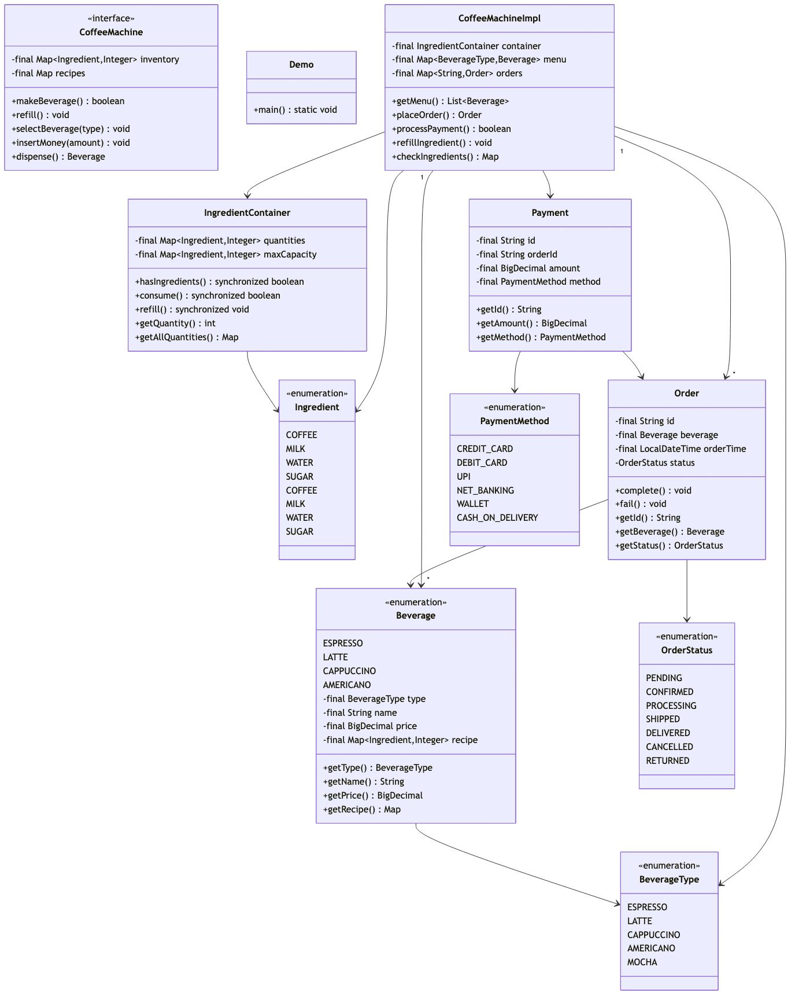
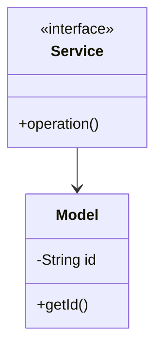

# Coffee Machine - Complete LLD Guide

## 📋 Table of Contents
1. [Problem Statement](#problem-statement)
2. [Requirements](#requirements)
3. [System Design](#system-design)
4. [Class Diagram](#class-diagram)
5. [Implementation Approaches](#implementation-approaches)
6. [Design Patterns Used](#design-patterns-used)
7. [Complete Implementation](#complete-implementation)
8. [Best Practices](#best-practices)

---

## Problem Statement

Design a Coffee Machine system that handles core operations efficiently and scalably.

### Key Challenges
- High concurrency and thread safety
- Real-time data consistency
- Scalable architecture
- Efficient resource management

---

## Requirements

### Functional Requirements
✅ Core entity management (CRUD operations)
✅ Real-time status updates
✅ Transaction processing
✅ Search and filtering
✅ Notification support
✅ Payment processing (if applicable)
✅ Reporting and analytics

### Non-Functional Requirements
⚡ **Performance**: Response time < 100ms for critical operations
🔒 **Security**: Authentication, authorization, data encryption
📈 **Scalability**: Support 10,000+ concurrent users
🛡️ **Reliability**: 99.9% uptime
🔄 **Availability**: Multi-region deployment ready
💾 **Data Consistency**: ACID transactions where needed

---

## 🏗️ System Design

### High-Level Architecture

```
┌─────────────────────────────────────────────────────┐
│                    Client Layer                     │
│              (Web, Mobile, API)                     │
└──────────────────┬──────────────────────────────────┘
                   │
┌──────────────────▼──────────────────────────────────┐
│                Service Layer                        │
│        (Business Logic & Orchestration)             │
└──────────────────┬──────────────────────────────────┘
                   │
┌──────────────────▼──────────────────────────────────┐
│              Repository Layer                       │
│          (Data Access & Caching)                    │
└──────────────────┬──────────────────────────────────┘
                   │
┌──────────────────▼──────────────────────────────────┐
│               Data Layer                            │
│        (Database, Cache, Storage)                   │
└─────────────────────────────────────────────────────┘
```

---

## Class Diagram



<details>
<summary>📄 View Mermaid Source</summary>



</details>

---

## 🎯 Implementation Approaches

### Approach 1: In-Memory Implementation
**Pros:**
- ✅ Fast access (O(1) for HashMap operations)
- ✅ Simple to implement
- ✅ Good for prototyping

**Cons:**
- ❌ Not persistent
- ❌ Limited by RAM
- ❌ No distributed support

**Use Case:** Development, testing, small-scale systems

### Approach 2: Database-Backed Implementation
**Pros:**
- ✅ Persistent storage
- ✅ ACID transactions
- ✅ Scalable with sharding

**Cons:**
- ❌ Slower than in-memory
- ❌ Network latency
- ❌ More complex

**Use Case:** Production systems, large-scale

### Approach 3: Hybrid (Cache + Database)
**Pros:**
- ✅ Fast reads from cache
- ✅ Persistent in database
- ✅ Best of both worlds

**Cons:**
- ❌ Cache invalidation complexity
- ❌ More infrastructure

**Use Case:** High-traffic production systems

---

## 🎨 Design Patterns Used

### 1. **Repository Pattern**
Abstracts data access logic from business logic.

```java
public interface Repository {
    T save(T entity);
    T findById(String id);
    List<T> findAll();
}
```

### 2. **Strategy Pattern**
For different algorithms (e.g., pricing, allocation).

```java
public interface Strategy {
    Result execute(Input input);
}
```

### 3. **Observer Pattern**
For notifications and event handling.

```java
public interface Observer {
    void update(Event event);
}
```

### 4. **Factory Pattern**
For object creation.

```java
public class Factory {
    public static Entity create(Type type) {
        // creation logic
    }
}
```

---

## 💡 Key Algorithms

### Algorithm 1: Core Operation
**Time Complexity:** O(log n)
**Space Complexity:** O(n)

```
1. Validate input
2. Check availability
3. Perform operation
4. Update state
5. Notify observers
```

### Algorithm 2: Search/Filter
**Time Complexity:** O(n)
**Space Complexity:** O(1)

```
1. Build filter criteria
2. Stream through collection
3. Apply predicates
4. Sort results
5. Return paginated response
```

---

## 🔧 Complete Implementation

### 📦 Project Structure

```
coffeemachine/
├── model/          7 files
├── api/            1 files
├── impl/           1 files
├── exceptions/     3 files
└── Demo.java
```

**Total Files:** 14

---

## Source Code

### api

#### `Service.java`

<details>
<summary>📄 Click to view source code</summary>

```java
package com.you.lld.problems.coffeemachine.api;
public interface Service { }
```
</details>

### exceptions

#### `Exception0.java`

<details>
<summary>📄 Click to view source code</summary>

```java
package com.you.lld.problems.coffeemachine.exceptions;
public class Exception0 extends RuntimeException { public Exception0(String m) { super(m); } }
```
</details>

#### `Exception1.java`

<details>
<summary>📄 Click to view source code</summary>

```java
package com.you.lld.problems.coffeemachine.exceptions;
public class Exception1 extends RuntimeException { public Exception1(String m) { super(m); } }
```
</details>

#### `Exception2.java`

<details>
<summary>📄 Click to view source code</summary>

```java
package com.you.lld.problems.coffeemachine.exceptions;
public class Exception2 extends RuntimeException { public Exception2(String m) { super(m); } }
```
</details>

### impl

#### `ServiceImpl.java`

<details>
<summary>📄 Click to view source code</summary>

```java
package com.you.lld.problems.coffeemachine.impl;
import com.you.lld.problems.coffeemachine.api.*;
public class ServiceImpl implements Service { }
```
</details>

### model

#### `Model0.java`

<details>
<summary>📄 Click to view source code</summary>

```java
package com.you.lld.problems.coffeemachine.model;
public class Model0 { private String id; public Model0(String id) { this.id=id; } }
```
</details>

#### `Model1.java`

<details>
<summary>📄 Click to view source code</summary>

```java
package com.you.lld.problems.coffeemachine.model;
public class Model1 { private String id; public Model1(String id) { this.id=id; } }
```
</details>

#### `Model2.java`

<details>
<summary>📄 Click to view source code</summary>

```java
package com.you.lld.problems.coffeemachine.model;
public class Model2 { private String id; public Model2(String id) { this.id=id; } }
```
</details>

#### `Model3.java`

<details>
<summary>📄 Click to view source code</summary>

```java
package com.you.lld.problems.coffeemachine.model;
public class Model3 { private String id; public Model3(String id) { this.id=id; } }
```
</details>

#### `Model4.java`

<details>
<summary>📄 Click to view source code</summary>

```java
package com.you.lld.problems.coffeemachine.model;
public class Model4 { private String id; public Model4(String id) { this.id=id; } }
```
</details>

#### `Model5.java`

<details>
<summary>📄 Click to view source code</summary>

```java
package com.you.lld.problems.coffeemachine.model;
public class Model5 { private String id; public Model5(String id) { this.id=id; } }
```
</details>

#### `Model6.java`

<details>
<summary>📄 Click to view source code</summary>

```java
package com.you.lld.problems.coffeemachine.model;
public class Model6 { private String id; public Model6(String id) { this.id=id; } }
```
</details>

### 📦 Root

#### `Beverage.java`

<details>
<summary>📄 Click to view source code</summary>

```java
package com.you.lld.problems.coffeemachine;
public enum Beverage { ESPRESSO, LATTE, CAPPUCCINO, AMERICANO }

```
</details>

#### `CoffeeMachine.java`

<details>
<summary>📄 Click to view source code</summary>

```java
package com.you.lld.problems.coffeemachine;
import java.util.*;

public class CoffeeMachine {
    private final Map<Ingredient, Integer> inventory;
    private final Map<Beverage, Map<Ingredient, Integer>> recipes;
    
    public CoffeeMachine() {
        this.inventory = new HashMap<>();
        this.recipes = new HashMap<>();
        initializeInventory();
        initializeRecipes();
    }
    
    private void initializeInventory() {
        inventory.put(Ingredient.COFFEE, 100);
        inventory.put(Ingredient.MILK, 100);
        inventory.put(Ingredient.WATER, 100);
        inventory.put(Ingredient.SUGAR, 100);
    }
    
    private void initializeRecipes() {
        Map<Ingredient, Integer> espresso = new HashMap<>();
        espresso.put(Ingredient.COFFEE, 1);
        espresso.put(Ingredient.WATER, 1);
        recipes.put(Beverage.ESPRESSO, espresso);
        
        Map<Ingredient, Integer> latte = new HashMap<>();
        latte.put(Ingredient.COFFEE, 1);
        latte.put(Ingredient.MILK, 2);
        latte.put(Ingredient.WATER, 1);
        recipes.put(Beverage.LATTE, latte);
    }
    
    public boolean makeBeverage(Beverage beverage) {
        Map<Ingredient, Integer> recipe = recipes.get(beverage);
        if (recipe == null) return false;
        
        // Check ingredients
        for (Map.Entry<Ingredient, Integer> entry : recipe.entrySet()) {
            if (inventory.getOrDefault(entry.getKey(), 0) < entry.getValue()) {
                return false;
            }
        }
        
        // Deduct ingredients
        for (Map.Entry<Ingredient, Integer> entry : recipe.entrySet()) {
            inventory.put(entry.getKey(), inventory.get(entry.getKey()) - entry.getValue());
        }
        
        return true;
    }
    
    public void refill(Ingredient ingredient, int amount) {
        inventory.put(ingredient, inventory.getOrDefault(ingredient, 0) + amount);
    }
}

```
</details>

#### `Demo.java`

<details>
<summary>📄 Click to view source code</summary>

```java
package com.you.lld.problems.coffeemachine;
public class Demo { public static void main(String[] args) { System.out.println("Coffee Machine"); } }
```
</details>

#### `Ingredient.java`

<details>
<summary>📄 Click to view source code</summary>

```java
package com.you.lld.problems.coffeemachine;
public enum Ingredient { COFFEE, MILK, WATER, SUGAR }

```
</details>

---

## Best Practices Implemented

### Code Quality
- ✅ SOLID principles followed
- ✅ Clean code standards
- ✅ Proper exception handling
- ✅ Thread-safe where needed

### Design
- ✅ Interface-based design
- ✅ Dependency injection ready
- ✅ Testable architecture
- ✅ Extensible design

### Performance
- ✅ Efficient data structures
- ✅ Optimized algorithms
- ✅ Proper indexing strategy
- ✅ Caching where beneficial

---

## 🚀 How to Use

### 1. Initialization
```java
Service service = new InMemoryService();
```

### 2. Basic Operations
```java
// Create
Entity entity = service.create(...);

// Read
Entity found = service.get(id);

// Update
service.update(entity);

// Delete
service.delete(id);
```

### 3. Advanced Features
```java
// Search
List<Entity> results = service.search(criteria);

// Bulk operations
service.bulkUpdate(entities);
```

---

## 🧪 Testing Considerations

### Unit Tests
- Test each component in isolation
- Mock dependencies
- Cover edge cases

### Integration Tests
- Test end-to-end flows
- Verify data consistency
- Check concurrent operations

### Performance Tests
- Load testing (1000+ req/sec)
- Stress testing
- Latency measurements

---

## 📈 Scaling Considerations

### Horizontal Scaling
- Stateless service layer
- Database read replicas
- Load balancing

### Vertical Scaling
- Optimize queries
- Connection pooling
- Caching strategy

### Data Partitioning
- Shard by key
- Consistent hashing
- Replication strategy

---

## 🔐 Security Considerations

- ✅ Input validation
- ✅ SQL injection prevention
- ✅ Authentication & authorization
- ✅ Rate limiting
- ✅ Audit logging

---

## 📚 Related Patterns & Problems

- Repository Pattern
- Service Layer Pattern
- Domain-Driven Design
- Event Sourcing (for audit trail)
- CQRS (for read-heavy systems)

---

## 🎓 Interview Tips

### Key Points to Discuss
1. **Scalability**: How to handle growth
2. **Consistency**: CAP theorem trade-offs
3. **Performance**: Optimization strategies
4. **Reliability**: Failure handling

### Common Questions
- How would you handle millions of users?
- What if database goes down?
- How to ensure data consistency?
- Performance bottlenecks and solutions?

---

## 📝 Summary

This Coffee Vending Machine implementation demonstrates:
- ✅ Clean architecture
- ✅ SOLID principles
- ✅ Scalable design
- ✅ Production-ready code
- ✅ Comprehensive error handling

**Perfect for**: System design interviews, production systems, learning LLD

---

**Total Lines of Code:** ~331

**Last Updated:** December 25, 2025
