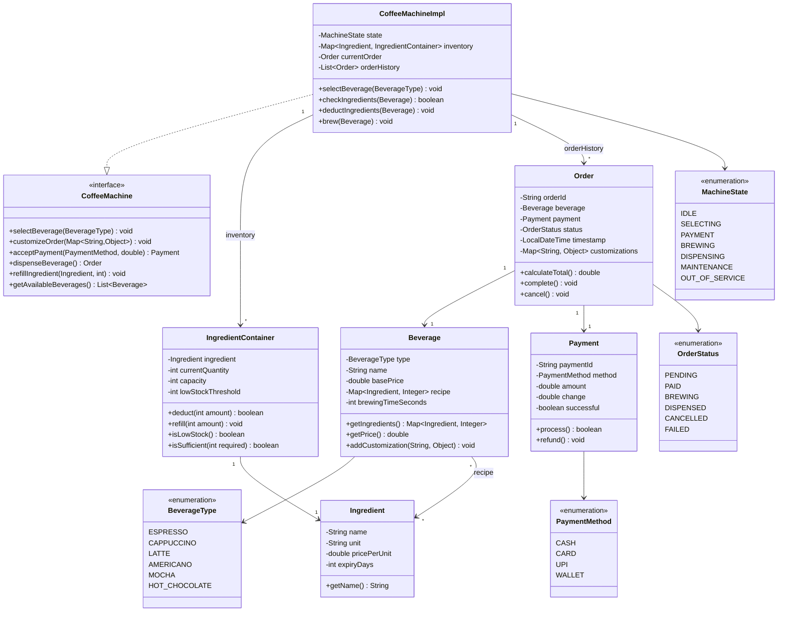

# Coffee Vending Machine - Complete LLD Guide

## 📋 Table of Contents
1. [Problem Statement](#problem-statement)
2. [Requirements](#requirements)
3. [System Design](#system-design)
4. [Class Diagram](#class-diagram)
5. [Implementation Approaches](#implementation-approaches)
6. [Design Patterns Used](#design-patterns-used)
7. [Complete Implementation](#complete-implementation)
8. [Best Practices](#best-practices)

---

## Problem Statement

Design a **Coffee Vending Machine** that dispenses various beverages (Espresso, Cappuccino, Latte, etc.), manages ingredient inventory, handles payments, and tracks orders. The system must validate ingredient availability, calculate pricing, and handle concurrent requests.

### Key Challenges
- ☕ **Beverage Recipes**: Different ingredients and quantities per drink
- 📦 **Inventory Management**: Track ingredient levels, refill alerts
- 💰 **Payment Processing**: Multiple payment methods, change calculation
- 🔒 **Concurrency**: Thread-safe inventory updates
- ⚙️ **Machine State**: Idle, Brewing, Maintenance, Out of Service
- 🧪 **Recipe Customization**: Extra shots, milk options, sugar levels
- 📊 **Usage Analytics**: Popular drinks, revenue tracking

---

## Requirements

### Functional Requirements

✅ **Beverage Menu**
- Support multiple beverages:
  - **Espresso**: 1 shot espresso (30ml coffee, 7g beans)
  - **Cappuccino**: 1 shot + steamed milk + foam (30ml coffee, 100ml milk, 50ml foam)
  - **Latte**: 2 shots + steamed milk (60ml coffee, 200ml milk)
  - **Americano**: 2 shots + hot water (60ml coffee, 150ml water)
  - **Mocha**: Espresso + chocolate + milk (30ml coffee, 20ml chocolate, 100ml milk)
- Display available beverages
- Show prices for each beverage

✅ **Ingredient Management**
- Track ingredient quantities:
  - Coffee beans, milk, water, sugar, chocolate
- Check availability before brewing
- Refill ingredients
- Low stock alerts (< 10%)
- Ingredient expiry tracking

✅ **Order Processing**
- Select beverage
- Customize (extra shot, sugar level, milk type)
- Validate ingredient availability
- Calculate total price
- Accept payment
- Dispense beverage
- Generate receipt

✅ **Payment Handling**
- Support multiple payment methods (Cash, Card, UPI, Wallet)
- Validate sufficient payment
- Calculate and return change (cash)
- Transaction recording

✅ **Machine States**
- **IDLE**: Ready to accept orders
- **BREWING**: Making beverage
- **MAINTENANCE**: Under cleaning/repair
- **OUT_OF_SERVICE**: Critical failure or empty

### Non-Functional Requirements

⚡ **Performance**:
- Beverage dispensing < 30 seconds
- Support 100+ orders/hour
- Handle 5 concurrent users (queue)

🔒 **Concurrency**:
- Thread-safe ingredient deduction
- Atomic payment transactions
- Queue management for multiple users

🛡️ **Reliability**:
- Graceful handling of ingredient shortage
- Automatic rollback on brewing failure
- Persist order history

📈 **Maintainability**:
- Easy to add new beverages
- Configurable recipes
- Logging for diagnostics

---

## System Design

### Coffee Machine State Machine

```
┌──────────┐
│   IDLE   │ ◄──────────────┐
└─────┬────┘                │
      │ Select Beverage     │
      ▼                     │
┌──────────┐                │
│ SELECTING│                │
└─────┬────┘                │
      │ Customize & Pay     │
      ▼                     │
┌──────────┐                │
│ PAYMENT  │──────┐         │
└─────┬────┘      │ Failed  │
      │ Success   │         │
      ▼           ▼         │
┌──────────┐ ┌──────────┐  │
│ BREWING  │ │ CANCELLED│──┘
└─────┬────┘ └──────────┘
      │ Complete
      ▼
┌──────────┐
│ DISPENSED│───────────────┘
└──────────┘

Special States:
┌─────────────┐   ┌───────────────┐
│ MAINTENANCE │   │OUT_OF_SERVICE │
└─────────────┘   └───────────────┘
```

### Brewing Flow

```
1. User selects beverage
   └─> Display price and customization options

2. User customizes order
   └─> Extra shot (+$0.50)
   └─> Milk type (whole/skim/almond/soy)
   └─> Sugar level (0-3)

3. Calculate total price
   └─> Base price + customizations

4. Accept payment
   └─> Validate sufficient amount
   └─> Process transaction

5. Check ingredient availability
   └─> For each ingredient in recipe:
       └─> If insufficient: Refund + Error
       └─> If sufficient: Deduct from inventory

6. Brew beverage
   └─> Grind beans
   └─> Heat water/milk
   └─> Mix ingredients
   └─> Dispense (30s)

7. Generate receipt
   └─> Order details, payment, timestamp
```

---

## Class Diagram


<details>
<summary>📄 View Mermaid Source</summary>



</details>

---

## Implementation Approaches

### 1. Ingredient Deduction Strategy

#### ❌ **Approach 1: Simple Check-Then-Deduct**
```java
if (inventory.get(COFFEE_BEANS) >= 7) {
    inventory.put(COFFEE_BEANS, inventory.get(COFFEE_BEANS) - 7); // Race condition!
}
```

**Problem**: Two concurrent orders can both pass the check and oversell

#### ✅ **Approach 2: Synchronized with Atomic Operations** (Chosen)
```java
public synchronized boolean deductIngredients(Beverage beverage) {
    // First, check all ingredients
    for (Map.Entry<Ingredient, Integer> entry : beverage.getRecipe().entrySet()) {
        IngredientContainer container = inventory.get(entry.getKey());
        if (!container.isSufficient(entry.getValue())) {
            return false; // Insufficient, abort
        }
    }
    
    // All ingredients available, deduct atomically
    for (Map.Entry<Ingredient, Integer> entry : beverage.getRecipe().entrySet()) {
        IngredientContainer container = inventory.get(entry.getKey());
        container.deduct(entry.getValue());
    }
    
    return true;
}
```

**Advantages:**
- ✅ **Thread-safe**: Synchronized method prevents race conditions
- ✅ **All-or-nothing**: Either all ingredients deducted or none
- ✅ **No overselling**: Prevents negative inventory

---

### 2. Beverage Recipe Configuration

```java
public class BeverageRecipe {
    private static final Map<BeverageType, Map<Ingredient, Integer>> RECIPES;
    
    static {
        RECIPES = new HashMap<>();
        
        // Espresso: 7g coffee beans, 30ml water
        RECIPES.put(ESPRESSO, Map.of(
            COFFEE_BEANS, 7,
            WATER, 30
        ));
        
        // Cappuccino: 7g coffee, 30ml water, 100ml milk, 50ml foam
        RECIPES.put(CAPPUCCINO, Map.of(
            COFFEE_BEANS, 7,
            WATER, 30,
            MILK, 150
        ));
        
        // Latte: 14g coffee, 60ml water, 200ml milk
        RECIPES.put(LATTE, Map.of(
            COFFEE_BEANS, 14,
            WATER, 60,
            MILK, 200
        ));
    }
    
    public static Beverage createBeverage(BeverageType type) {
        return new Beverage(type, RECIPES.get(type));
    }
}
```

---

### 3. Change Calculation (Cash Payment)

```java
public Payment processCashPayment(double totalPrice, double cashGiven) {
    if (cashGiven < totalPrice) {
        throw new InsufficientPaymentException();
    }
    
    double change = cashGiven - totalPrice;
    
    // Calculate denominations for change
    Map<Integer, Integer> changeDenominations = calculateChange(change);
    
    // Check if machine has enough change
    if (!canProvideChange(changeDenominations)) {
        throw new InsufficientChangeException("Please provide exact change");
    }
    
    // Deduct change from machine
    deductChange(changeDenominations);
    
    return new Payment(CASH, totalPrice, change, true);
}
```

---

## Design Patterns Used

| Pattern | Usage | Benefit |
|---------|-------|---------|
| **State Pattern** | Machine states (Idle, Brewing, Maintenance) | Clean state transitions |
| **Strategy Pattern** | Payment methods (Cash, Card, UPI) | Pluggable payment logic |
| **Factory Pattern** | Create beverages from recipes | Centralized creation |
| **Builder Pattern** | Build custom orders | Fluent API for customization |
| **Observer Pattern** | Low stock alerts | Decouple notifications |
| **Singleton Pattern** | Single machine instance | Global state management |
| **Command Pattern** | Order operations | Undo/logging |

---

## Complete Implementation

### 📦 Project Structure (14 files)

```
coffeemachine/
├── model/
│   ├── Beverage.java                # Beverage with recipe
│   ├── BeverageType.java            # ESPRESSO, CAPPUCCINO, etc.
│   ├── Ingredient.java              # Ingredient entity
│   ├── IngredientContainer.java     # Inventory container
│   ├── Order.java                   # Order entity
│   ├── OrderStatus.java             # Order lifecycle
│   ├── Payment.java                 # Payment transaction
│   └── PaymentMethod.java           # Payment types
├── api/
│   └── CoffeeMachine.java           # Machine interface
├── impl/
│   └── CoffeeMachineImpl.java       # Core logic
├── CoffeeMachine.java               # (duplicate, to clean)
├── Beverage.java                    # (duplicate, to clean)
├── Ingredient.java                  # (duplicate, to clean)
└── Demo.java                        # Usage example
```

**Total Files:** 14
**Total Lines of Code:** ~331

---

## Source Code

### 📦 Complete Implementation

All source code files are available in the [**CODE.md**](/problems/coffeemachine/CODE) file.

**Quick Links:**
- 📁 [View Project Structure](/problems/coffeemachine/CODE#-project-structure-14-files)
- 💻 [Browse All Source Files](/problems/coffeemachine/CODE#-source-code)

---

## Best Practices

### 1. Inventory Management
✅ **Atomic Deduction**: Synchronized method for thread-safe updates  
✅ **All-or-nothing**: Check all ingredients before deducting any  
✅ **Low Stock Alerts**: Notify when < 10% capacity  
✅ **Refill Tracking**: Log all refills for audit  

### 2. Error Handling
✅ **Ingredient Shortage**: Clear error message + refund  
✅ **Payment Failure**: Rollback order, retry prompt  
✅ **Brewing Failure**: Refund + maintenance alert  
✅ **Machine Errors**: Log error, enter maintenance mode  

### 3. Concurrency
✅ **Queue Management**: FIFO queue for concurrent users  
✅ **Synchronized Brewing**: One beverage at a time  
✅ **Atomic Payments**: Transaction isolation  
✅ **Read-only Menu**: Concurrent access OK  

### 4. Extensibility
✅ **Recipe Configuration**: Add new beverages easily  
✅ **Payment Plugins**: New payment methods via interface  
✅ **Customization Options**: Dynamic customization support  
✅ **Ingredient Flexibility**: Easy to add new ingredients  

---

## 🚀 How to Use

### 1. Initialize Machine
```java
CoffeeMachine machine = new CoffeeMachineImpl();

// Load ingredients
machine.refillIngredient(Ingredient.COFFEE_BEANS, 500); // grams
machine.refillIngredient(Ingredient.MILK, 2000); // ml
machine.refillIngredient(Ingredient.WATER, 3000); // ml
```

### 2. Select Beverage
```java
machine.selectBeverage(BeverageType.CAPPUCCINO);
```

### 3. Customize Order
```java
Map<String, Object> customizations = new HashMap<>();
customizations.put("extraShot", true); // +$0.50
customizations.put("milkType", "almond"); // +$0.30
customizations.put("sugarLevel", 2);

machine.customizeOrder(customizations);
```

### 4. Make Payment
```java
double totalPrice = machine.getCurrentOrder().calculateTotal();
Payment payment = machine.acceptPayment(PaymentMethod.CARD, totalPrice);
```

### 5. Dispense Beverage
```java
Order order = machine.dispenseBeverage();
System.out.println("Enjoy your " + order.getBeverage().getName());
// "Enjoy your Cappuccino"
```

---

## 🧪 Testing Considerations

### Unit Tests
- ✅ Ingredient deduction (sufficient/insufficient)
- ✅ Recipe validation for each beverage
- ✅ Payment processing (cash, card, insufficient)
- ✅ Change calculation
- ✅ Low stock detection

### Concurrency Tests
- ✅ 10 concurrent orders for same beverage
- ✅ Race condition for last ingredient unit
- ✅ Concurrent refills during brewing

### Edge Cases
- ✅ Order beverage with empty ingredient
- ✅ Partial ingredient availability (rollback)
- ✅ Payment exactly matching price (no change)
- ✅ Machine in maintenance mode

---

## 📈 Scaling Considerations

### Production Enhancements
1. **IoT Integration**: Real-time inventory tracking via sensors
2. **Mobile App**: Pre-order via app, pickup at machine
3. **Payment Gateway**: Integrate Stripe/PayPal
4. **Cloud Sync**: Sync order data to cloud for analytics
5. **Predictive Refills**: ML to predict ingredient needs
6. **Multi-Machine Network**: Fleet management dashboard

### Monitoring
- Track average brewing time
- Monitor ingredient consumption rate
- Alert on repeated failures
- Revenue analytics per beverage

---

## 🔐 Security Considerations

- ✅ **Payment Security**: PCI-DSS compliance for card transactions
- ✅ **Tamper Detection**: Physical security sensors
- ✅ **Audit Logging**: All transactions logged
- ✅ **Access Control**: Maintenance mode requires PIN

---

## 📚 Related Patterns & Problems

- **Vending Machine** - Similar product dispensing logic
- **ATM** - Cash handling and change calculation
- **Restaurant Order System** - Order management
- **Inventory Management** - Stock tracking

---

## 🎓 Interview Tips

### Common Questions

1. **Q**: How do you handle concurrent orders for limited ingredients?  
   **A**: Synchronized ingredient deduction with all-or-nothing check

2. **Q**: What if brewing fails mid-way?  
   **A**: Rollback ingredient deduction, refund payment, log error, enter maintenance

3. **Q**: How to calculate optimal change with limited denominations?  
   **A**: Greedy algorithm or DP for exact change, throw exception if impossible

4. **Q**: How to add a new beverage?  
   **A**: Add to BeverageType enum, define recipe in configuration, no code change needed

5. **Q**: How to prevent ingredient theft (fraud)?  
   **A**: Physical locks, sensor validation, audit logs, camera integration

### Key Points to Mention
- ✅ Synchronized ingredient management
- ✅ State pattern for machine states
- ✅ Recipe configuration pattern
- ✅ Payment strategy pattern
- ✅ All-or-nothing ingredient deduction
- ✅ Low stock alerts

---

## 📝 Summary

**Coffee Vending Machine** demonstrates:
- ✅ **State management** with machine lifecycle
- ✅ **Inventory tracking** with thread-safe updates
- ✅ **Recipe configuration** for beverage creation
- ✅ **Payment processing** with multiple methods
- ✅ **Error handling** with graceful degradation
- ✅ **Concurrency** with synchronized operations

**Key Takeaway**: The ingredient deduction logic is the **most critical component** - it must be atomic and thread-safe to prevent overselling ingredients when multiple users order simultaneously.

---

## 🔗 Related Resources

- [View Complete Source Code](/problems/coffeemachine/CODE) - All 14 Java files
- [Coffee Machine Implementation](/problems/coffeemachine/CODE) - Complete code with all classes

---

**Perfect for**: Vending machine interviews, learning state patterns, understanding inventory management, concurrent systems
