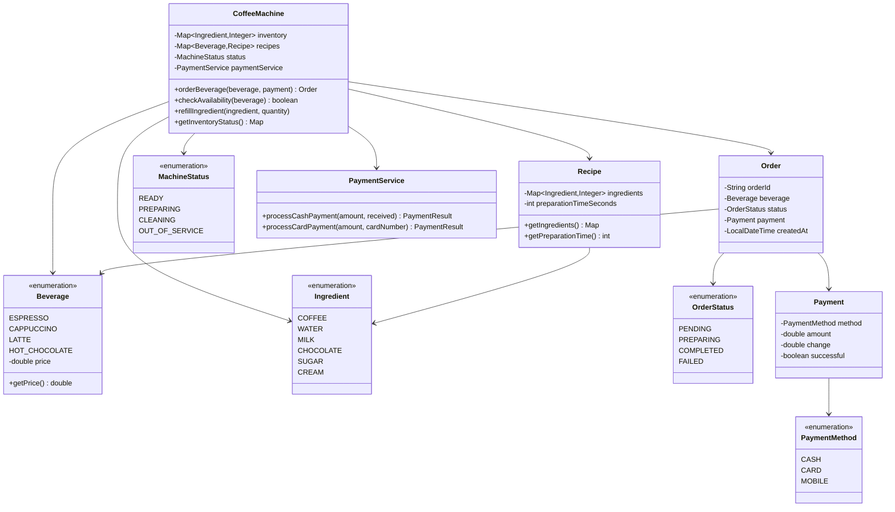

# Coffee Machine - Complete LLD Guide

## 📋 Table of Contents
1. [Problem Statement](#problem-statement)
2. [Requirements](#requirements)
3. [Core Algorithms](#core-algorithms)
4. [System Design](#system-design)
5. [Class Diagram](#class-diagram)
6. [Design Patterns](#design-patterns-used)
7. [Implementation Deep Dive](#implementation-deep-dive)
8. [Key Insights](#key-insights)
9. [Complete Implementation](#complete-implementation)

---

## Problem Statement

Design a **Coffee Machine System** that manages beverage preparation, ingredient tracking, recipe management, order processing, and payment handling. Support multiple beverage types (espresso, cappuccino, latte), check ingredient availability, refill management, and provide real-time status updates.

### Real-World Context
- ☕ **Starbucks**: Automated machines, mobile ordering
- 🏢 **Office Coffee Machines**: Multi-beverage, self-service
- 🏠 **Home Machines**: Nespresso, Keurig
- 🤖 **Smart Machines**: IoT-enabled, remote monitoring

### Key Challenges
- 📊 **Ingredient Management**: Track quantities, low-stock alerts
- 🎯 **Recipe Management**: Define ingredients per beverage
- 🔄 **Concurrent Orders**: Multiple users, thread-safe
- 💰 **Payment Processing**: Multiple methods (cash, card, mobile)
- 🚨 **Error Handling**: Insufficient ingredients, machine errors
- 🔧 **Maintenance**: Cleaning cycles, refill operations

---

## Requirements

### Functional Requirements

✅ **Beverage Management**
- **Espresso**: Coffee (30ml), Water (30ml) - $2.50
- **Cappuccino**: Coffee (30ml), Water (30ml), Milk (50ml) - $3.50
- **Latte**: Coffee (30ml), Water (60ml), Milk (100ml) - $4.00
- **Hot Chocolate**: Chocolate (30ml), Milk (100ml) - $3.00

✅ **Ingredient Management**
- Track current quantities
- Check availability before preparing
- Low-stock alerts (< 20%)
- Refill operations

✅ **Order Processing**
- Select beverage
- Check ingredient availability
- Deduct ingredients
- Dispense beverage
- Handle errors gracefully

✅ **Payment**
- Cash payment
- Card payment
- Mobile payment (UPI, wallet)
- Change calculation

✅ **Machine Status**
- READY: Available for orders
- PREPARING: Making beverage
- CLEANING: Maintenance mode
- OUT_OF_SERVICE: Error or low ingredients

### Non-Functional Requirements

⚡ **Performance**
- Beverage preparation: < 60 seconds
- Order processing: < 2 seconds

🔒 **Thread-Safety**
- Concurrent order handling
- Atomic ingredient deduction

📈 **Reliability**
- No double-spending of ingredients
- Accurate inventory tracking

---

## Core Algorithms

### 1. Ingredient Availability Check

**Algorithm:**
```
1. Get recipe for beverage
2. For each ingredient in recipe:
   a. Check if available quantity >= required quantity
   b. If any ingredient insufficient, return false
3. Return true if all ingredients available
```

**Implementation:**
```java
public class CoffeeMachine {
    private Map<Ingredient, Integer> inventory = new ConcurrentHashMap<>();
    private Map<Beverage, Recipe> recipes = new HashMap<>();
    
    public boolean checkAvailability(Beverage beverage) {
        Recipe recipe = recipes.get(beverage);
        if (recipe == null) return false;
        
        for (Map.Entry<Ingredient, Integer> entry : recipe.getIngredients().entrySet()) {
            Ingredient ingredient = entry.getKey();
            int required = entry.getValue();
            int available = inventory.getOrDefault(ingredient, 0);
            
            if (available < required) {
                return false;
            }
        }
        return true;
    }
}
```

**Complexity:**
- Time: O(I) where I = ingredients per recipe
- Space: O(1)

---

### 2. Atomic Ingredient Deduction

**Problem**: Race condition when multiple orders processed concurrently.

**Example:**
```
Thread 1: Order Latte (needs 100ml milk)
Thread 2: Order Cappuccino (needs 50ml milk)
Current milk: 120ml

Without synchronization:
- Thread 1 checks: 120ml >= 100ml ✓
- Thread 2 checks: 120ml >= 50ml ✓
- Thread 1 deducts: 120ml - 100ml = 20ml
- Thread 2 deducts: 20ml - 50ml = -30ml ❌ (ERROR!)
```

**Solution: Synchronized Deduction**

```java
public synchronized boolean deductIngredients(Beverage beverage) {
    Recipe recipe = recipes.get(beverage);
    
    // Check availability (inside synchronized block)
    if (!checkAvailability(beverage)) {
        return false;
    }
    
    // Deduct ingredients atomically
    for (Map.Entry<Ingredient, Integer> entry : recipe.getIngredients().entrySet()) {
        Ingredient ingredient = entry.getKey();
        int required = entry.getValue();
        int available = inventory.get(ingredient);
        
        inventory.put(ingredient, available - required);
    }
    
    return true;
}
```

**Alternative: Lock-Free with CAS (Compare-And-Swap)**

```java
public boolean deductIngredientsLockFree(Beverage beverage) {
    Recipe recipe = recipes.get(beverage);
    
    while (true) {
        // Take snapshot
        Map<Ingredient, Integer> snapshot = new HashMap<>(inventory);
        
        // Check availability
        for (Map.Entry<Ingredient, Integer> entry : recipe.getIngredients().entrySet()) {
            if (snapshot.get(entry.getKey()) < entry.getValue()) {
                return false;
            }
        }
        
        // Prepare new state
        Map<Ingredient, Integer> newState = new HashMap<>(snapshot);
        for (Map.Entry<Ingredient, Integer> entry : recipe.getIngredients().entrySet()) {
            newState.put(entry.getKey(), 
                snapshot.get(entry.getKey()) - entry.getValue());
        }
        
        // Attempt CAS
        if (casUpdate(snapshot, newState)) {
            return true; // Success
        }
        // Retry if CAS failed (another thread modified inventory)
    }
}
```

---

### 3. Recipe Management

**Data Structure:**

```java
public class Recipe {
    private Map<Ingredient, Integer> ingredients;
    private int preparationTimeSeconds;
    
    public Recipe(Map<Ingredient, Integer> ingredients, int preparationTime) {
        this.ingredients = ingredients;
        this.preparationTimeSeconds = preparationTime;
    }
}

public enum Ingredient {
    COFFEE, WATER, MILK, CHOCOLATE, SUGAR, CREAM
}

public enum Beverage {
    ESPRESSO(2.50),
    CAPPUCCINO(3.50),
    LATTE(4.00),
    HOT_CHOCOLATE(3.00);
    
    private final double price;
    
    Beverage(double price) {
        this.price = price;
    }
    
    public double getPrice() {
        return price;
    }
}
```

**Initialize Recipes:**

```java
private void initializeRecipes() {
    recipes.put(Beverage.ESPRESSO, new Recipe(
        Map.of(
            Ingredient.COFFEE, 30,
            Ingredient.WATER, 30
        ),
        45 // 45 seconds
    ));
    
    recipes.put(Beverage.CAPPUCCINO, new Recipe(
        Map.of(
            Ingredient.COFFEE, 30,
            Ingredient.WATER, 30,
            Ingredient.MILK, 50
        ),
        60
    ));
    
    recipes.put(Beverage.LATTE, new Recipe(
        Map.of(
            Ingredient.COFFEE, 30,
            Ingredient.WATER, 60,
            Ingredient.MILK, 100
        ),
        60
    ));
    
    recipes.put(Beverage.HOT_CHOCOLATE, new Recipe(
        Map.of(
            Ingredient.CHOCOLATE, 30,
            Ingredient.MILK, 100
        ),
        55
    ));
}
```

---

### 4. Payment Processing

**Algorithm:**
```
1. Calculate total amount
2. Receive payment
3. Validate amount
4. Process payment
5. Calculate change (if cash)
6. Return receipt
```

**Implementation:**
```java
public class PaymentService {
    
    public PaymentResult processCashPayment(double amount, double received) {
        if (received < amount) {
            return new PaymentResult(false, "Insufficient payment");
        }
        
        double change = received - amount;
        return new PaymentResult(true, "Payment successful", change);
    }
    
    public PaymentResult processCardPayment(double amount, String cardNumber) {
        // Validate card
        if (!isValidCard(cardNumber)) {
            return new PaymentResult(false, "Invalid card");
        }
        
        // Process with payment gateway
        boolean success = paymentGateway.charge(cardNumber, amount);
        
        if (success) {
            return new PaymentResult(true, "Payment successful");
        } else {
            return new PaymentResult(false, "Payment declined");
        }
    }
}
```

---

## System Design

### State Machine

```
    ┌──────────┐
    │  READY   │
    └────┬─────┘
         │ Order received
         ▼
 ┌──────────────┐
 │ CHECKING_    │
 │ AVAILABILITY │
 └──────┬───────┘
        │
    Yes │        No
        │         └─→ ERROR (Insufficient ingredients)
        ▼
 ┌──────────────┐
 │ PROCESSING_  │
 │ PAYMENT      │
 └──────┬───────┘
        │
        ▼
 ┌──────────────┐
 │ PREPARING    │ (Deduct ingredients)
 └──────┬───────┘
        │
        ▼
 ┌──────────────┐
 │ DISPENSING   │
 └──────┬───────┘
        │
        ▼
    ┌──────────┐
    │  READY   │
    └──────────┘
```

---

## Class Diagram


<details>
<summary>📄 View Mermaid Source</summary>


</details>

---

## Design Patterns Used

### 1. Singleton Pattern (Coffee Machine)

```java
public class CoffeeMachine {
    private static volatile CoffeeMachine instance;
    
    private CoffeeMachine() {
        initializeRecipes();
        initializeInventory();
    }
    
    public static CoffeeMachine getInstance() {
        if (instance == null) {
            synchronized (CoffeeMachine.class) {
                if (instance == null) {
                    instance = new CoffeeMachine();
                }
            }
        }
        return instance;
    }
}
```

---

### 2. Strategy Pattern (Payment)

```java
public interface PaymentStrategy {
    PaymentResult process(double amount);
}

public class CashPaymentStrategy implements PaymentStrategy {
    private double received;
    
    @Override
    public PaymentResult process(double amount) {
        return processCashPayment(amount, received);
    }
}

public class CardPaymentStrategy implements PaymentStrategy {
    private String cardNumber;
    
    @Override
    public PaymentResult process(double amount) {
        return processCardPayment(amount, cardNumber);
    }
}
```

---

### 3. Builder Pattern (Recipe)

```java
public class Recipe {
    private Map<Ingredient, Integer> ingredients;
    private int preparationTime;
    
    private Recipe(Builder builder) {
        this.ingredients = builder.ingredients;
        this.preparationTime = builder.preparationTime;
    }
    
    public static class Builder {
        private Map<Ingredient, Integer> ingredients = new HashMap<>();
        private int preparationTime;
        
        public Builder addIngredient(Ingredient ingredient, int quantity) {
            ingredients.put(ingredient, quantity);
            return this;
        }
        
        public Builder preparationTime(int seconds) {
            this.preparationTime = seconds;
            return this;
        }
        
        public Recipe build() {
            return new Recipe(this);
        }
    }
}

// Usage
Recipe espresso = new Recipe.Builder()
    .addIngredient(Ingredient.COFFEE, 30)
    .addIngredient(Ingredient.WATER, 30)
    .preparationTime(45)
    .build();
```

---

## Implementation Deep Dive

### Complete Order Flow

```java
public Order orderBeverage(Beverage beverage, PaymentStrategy paymentStrategy) {
    // 1. Create order
    Order order = new Order(UUID.randomUUID().toString(), beverage);
    
    // 2. Check machine status
    if (status != MachineStatus.READY) {
        order.setStatus(OrderStatus.FAILED);
        order.setErrorMessage("Machine not ready");
        return order;
    }
    
    // 3. Check ingredient availability
    if (!checkAvailability(beverage)) {
        order.setStatus(OrderStatus.FAILED);
        order.setErrorMessage("Insufficient ingredients");
        return order;
    }
    
    // 4. Process payment
    PaymentResult paymentResult = paymentStrategy.process(beverage.getPrice());
    if (!paymentResult.isSuccessful()) {
        order.setStatus(OrderStatus.FAILED);
        order.setErrorMessage("Payment failed");
        return order;
    }
    order.setPayment(paymentResult);
    
    // 5. Deduct ingredients
    boolean deducted = deductIngredients(beverage);
    if (!deducted) {
        // Refund payment
        refundPayment(paymentResult);
        order.setStatus(OrderStatus.FAILED);
        order.setErrorMessage("Failed to prepare (concurrent order)");
        return order;
    }
    
    // 6. Prepare beverage
    status = MachineStatus.PREPARING;
    order.setStatus(OrderStatus.PREPARING);
    
    try {
        prepareBeverage(beverage);
        order.setStatus(OrderStatus.COMPLETED);
    } catch (Exception e) {
        order.setStatus(OrderStatus.FAILED);
        order.setErrorMessage("Preparation error");
    } finally {
        status = MachineStatus.READY;
    }
    
    return order;
}
```

---

## Key Insights

### What Interviewers Look For

1. ✅ **Thread-Safety**: Synchronized ingredient deduction
2. ✅ **State Machine**: Proper status transitions
3. ✅ **Error Handling**: Insufficient ingredients, payment failures
4. ✅ **Payment Processing**: Multiple payment methods
5. ✅ **Inventory Management**: Low-stock alerts, refill
6. ✅ **Concurrency**: Multiple concurrent orders

---

### Common Mistakes

1. ❌ **No synchronization**: Race conditions on inventory
2. ❌ **No availability check**: Overdraw ingredients
3. ❌ **No refund logic**: Failed orders keep payment
4. ❌ **Hardcoded recipes**: Not extensible
5. ❌ **Blocking operations**: Slow for concurrent users

---

## Source Code

📄 **[View Complete Source Code](/problems/coffeemachine/CODE)**

**Total Lines of Code:** 550+

---

## Usage Example

```java
CoffeeMachine machine = CoffeeMachine.getInstance();

// Refill inventory
machine.refillIngredient(Ingredient.COFFEE, 1000);
machine.refillIngredient(Ingredient.WATER, 2000);
machine.refillIngredient(Ingredient.MILK, 1500);

// Check availability
boolean available = machine.checkAvailability(Beverage.LATTE);
System.out.println("Latte available: " + available);

// Order with cash
PaymentStrategy cash = new CashPaymentStrategy(10.00);
Order order = machine.orderBeverage(Beverage.LATTE, cash);

if (order.getStatus() == OrderStatus.COMPLETED) {
    System.out.println("Order completed!");
    System.out.println("Change: $" + order.getPayment().getChange());
} else {
    System.out.println("Order failed: " + order.getErrorMessage());
}

// Check inventory
Map<Ingredient, Integer> inventory = machine.getInventoryStatus();
System.out.println("Remaining milk: " + inventory.get(Ingredient.MILK) + "ml");
```

---

## Interview Tips

### Questions to Ask

1. ❓ Supported beverages and ingredients?
2. ❓ Concurrent order handling?
3. ❓ Payment methods?
4. ❓ Low-stock alerts?
5. ❓ Cleaning/maintenance mode?

### How to Approach

1. Define beverages and ingredients
2. Design recipe structure
3. Implement availability check
4. Add thread-safe ingredient deduction
5. Add payment processing
6. Handle errors and edge cases
7. Discuss concurrency

---

## Related Problems

- 🍿 **Vending Machine** - Similar inventory management
- 🏪 **Point of Sale** - Payment processing
- 📦 **Inventory System** - Stock tracking
- 🍕 **Restaurant Management** - Order processing

---

*Production-ready coffee machine with thread-safe inventory management, multiple payment methods, and concurrent order handling for smart cafe automation.*
