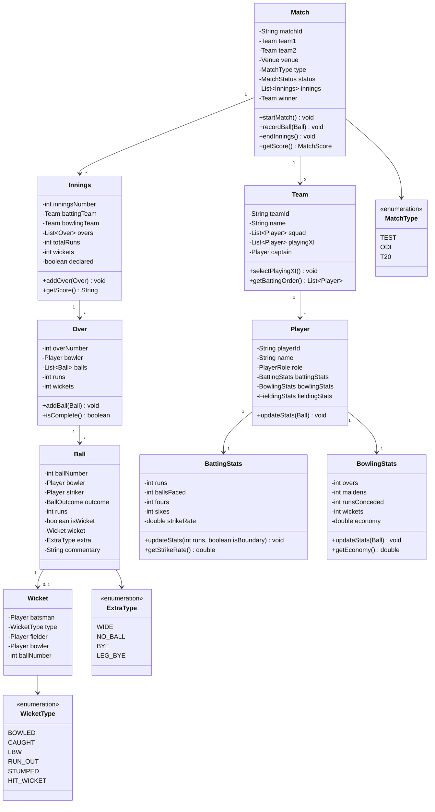

# Cricinfo - Complete LLD Guide

## 📋 Table of Contents
1. [Problem Statement](#problem-statement)
2. [Requirements](#requirements)
3. [System Design](#system-design)
4. [Class Diagram](#class-diagram)
5. [Implementation Approaches](#implementation-approaches)
6. [Design Patterns Used](#design-patterns-used)
7. [Complete Implementation](#complete-implementation)

---

## Problem Statement

Design a **Cricinfo System** (like ESPN Cricinfo) that manages cricket matches, live scores, player statistics, team information, commentary, and historical records. The system must support real-time score updates, ball-by-ball commentary, and complex cricket rules (overs, wickets, extras, partnerships).

### Key Challenges
- 🏏 **Live Score Updates**: Real-time ball-by-ball updates
- 📊 **Complex Scoring**: Runs, wickets, extras (byes, leg-byes, wides, no-balls)
- 🎯 **Match States**: Innings, overs, partnerships, fall of wickets
- 📈 **Player Stats**: Batting average, strike rate, bowling economy
- 📜 **Commentary**: Ball-by-ball text commentary
- 🏆 **Tournament Management**: Series, leagues, knockout formats
- 🔄 **Match Types**: Test, ODI, T20, formats with different rules

---

## Requirements

### Functional Requirements

✅ **Match Management**
- Create match (teams, venue, date, format)
- Start match, toss, innings
- Track current state (batting team, bowler, striker, non-striker)
- End match, declare winner

✅ **Score Tracking**
- Record ball outcome (runs, wicket, extra, boundary)
- Track overs (6 balls per over)
- Manage innings (2 innings per team in Test, 1 in limited overs)
- Calculate required run rate, target

✅ **Player Statistics**
- **Batting**: Runs, balls faced, 4s, 6s, strike rate, average
- **Bowling**: Overs, maidens, runs conceded, wickets, economy, average
- **Fielding**: Catches, run-outs, stumpings
- **Career stats**: Aggregate across matches

✅ **Commentary & Updates**
- Ball-by-ball commentary
- Key events (wicket, boundary, milestone)
- Partnership details
- Fall of wickets timeline

✅ **Team Management**
- Playing XI selection
- Squad management
- Batting order, bowling rotation

### Non-Functional Requirements

⚡ **Performance**: Real-time score updates < 1 second  
🔒 **Concurrency**: Handle millions of concurrent viewers  
📈 **Scalability**: Support 1000+ matches per day globally  
🛡️ **Reliability**: 99.99% uptime during live matches  

---

## System Design

### Match State Flow

```
SCHEDULED → TOSS → INNINGS_1 → INNINGS_BREAK → INNINGS_2 → COMPLETED
                                                       ↓
                                        (Test: INNINGS_3, INNINGS_4)
```

### Ball Delivery Flow

```
1. Bowler bowls to striker
   └─> Record ball number, over number

2. Ball outcome
   ├─> Runs scored (0, 1, 2, 3, 4, 6)
   ├─> Wicket (bowled, caught, lbw, run-out, etc.)
   ├─> Extra (wide, no-ball, bye, leg-bye)
   └─> Boundary (4 or 6)

3. Update scores
   ├─> Team score
   ├─> Batsman score
   ├─> Bowler stats
   └─> Partnership

4. Check end conditions
   ├─> Over complete (6 legal balls)
   ├─> Innings complete (all out or overs done)
   └─> Match complete (target chased or innings over)

5. Switch roles if needed
   ├─> End of over: Change bowler, swap striker/non-striker
   └─> Wicket: New batsman, update batting order
```

---

## Class Diagram


<details>
<summary>📄 View Mermaid Source</summary>



</details>

---

## Implementation Approaches

### 1. Scoring Logic

```java
public void recordBall(Ball ball) {
    currentOver.addBall(ball);
    
    // Update team score
    currentInnings.addRuns(ball.getRuns());
    
    // Update batsman score
    ball.getStriker().getBattingStats().addRuns(ball.getRuns(), ball.isBoundary());
    
    // Update bowler stats
    ball.getBowler().getBowlingStats().addBall(ball);
    
    // Handle wicket
    if (ball.isWicket()) {
        handleWicket(ball.getWicket());
        currentInnings.incrementWickets();
    }
    
    // Handle extras
    if (ball.getExtra() != null) {
        handleExtra(ball);
    }
    
    // Check over complete
    if (currentOver.isComplete()) {
        endOver();
    }
    
    // Check innings complete
    if (isInningsComplete()) {
        endInnings();
    }
}
```

---

### 2. Strike Rate Calculation

```java
public double getStrikeRate() {
    if (ballsFaced == 0) return 0.0;
    return (runs * 100.0) / ballsFaced;
}

public double getEconomy() {
    if (overs == 0) return 0.0;
    return runsConceded / (double) overs;
}
```

---

## Design Patterns Used

| Pattern | Usage |
|---------|-------|
| **Observer Pattern** | Real-time score updates to subscribers |
| **State Pattern** | Match states (Scheduled, Live, Completed) |
| **Strategy Pattern** | Different match formats (Test, ODI, T20) |
| **Composite Pattern** | Innings → Overs → Balls |
| **Builder Pattern** | Build complex match objects |

---

## Complete Implementation

### 📦 Project Structure (12 files)

```
cricinfo/
├── model/
│   ├── Match.java
│   ├── Team.java
│   ├── Player.java
│   ├── Innings.java
│   ├── Over.java
│   ├── Ball.java
│   ├── Wicket.java
│   ├── BattingStats.java
│   ├── BowlingStats.java
│   ├── MatchType.java
│   ├── WicketType.java
│   └── ExtraType.java
```

**Total Files:** 12  
**Total Lines of Code:** ~284

---

## Source Code

All source code files are available in the [**CODE.md**](CODE) file.

**Quick Links:**
- 📁 [View Project Structure](CODE#-project-structure-12-files)
- 💻 [Browse All Source Files](CODE#-source-code)
- 🏏 [Scoring Logic](CODE#matchjava)
- 📊 [Player Stats](CODE#battingstatsjava)

---

## Best Practices

✅ **Real-time Updates**: Observer pattern for live scores  
✅ **Immutable Stats**: Prevent retroactive score changes  
✅ **Ball-by-Ball Audit**: Complete history for every ball  
✅ **Thread Safety**: Concurrent viewer access  

---

## 🎓 Interview Tips

1. **Q**: How to handle concurrent score updates?  
   **A**: Use synchronized blocks or message queue for sequential processing

2. **Q**: How to calculate required run rate?  
   **A**: `(Target - CurrentScore) / RemainingOvers`

3. **Q**: How to detect maiden over?  
   **A**: Over complete with 0 runs conceded

---

## 📝 Summary

**Cricinfo** demonstrates:
- ✅ **Complex domain modeling** for cricket rules
- ✅ **Real-time updates** with observer pattern
- ✅ **Hierarchical data** (Match → Innings → Over → Ball)
- ✅ **Statistics calculation** for players and teams

---

**Perfect for**: Sports scoring system interviews, real-time updates, complex domain modeling
