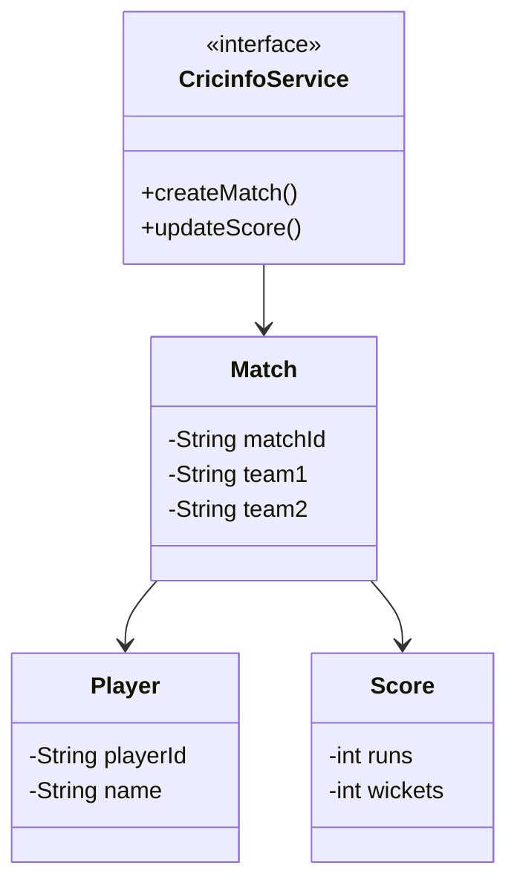

# Cricinfo (Cricket Scoring System) - Complete LLD Guide

## 📋 Table of Contents
1. [Problem Statement](#problem-statement)
2. [Requirements](#requirements)
3. [Core Algorithms](#core-algorithms)
4. [System Design](#system-design)
5. [Class Diagram](#class-diagram)
6. [Design Patterns](#design-patterns-used)
7. [Implementation Deep Dive](#implementation-deep-dive)
8. [Key Insights](#key-insights)
9. [Complete Implementation](#complete-implementation)

---

## Problem Statement

Design a **Live Cricket Scoring System** (like ESPN Cricinfo, Cricbuzz) that tracks matches, teams, players, scores, overs, wickets, and statistics. Support real-time score updates, live commentary, player/team analytics, and multiple match formats (Test, ODI, T20).

### Real-World Context
- 🏏 **ESP NCricinfo**: 220M+ unique users/month
- 📱 **Cricbuzz**: 50M+ app downloads
- 📊 **ICC Stats**: Official cricket statistics
- 📺 **Live Streaming**: Real-time score synchronization

### Key Challenges
- ⚡ **Real-Time Updates**: Score updates within 1-2 seconds
- 📊 **Statistics Calculation**: Batting avg, strike rate, economy, etc.
- 🎯 **Match State**: Track current over, ball, batsmen, bowlers
- 🔄 **Complex Rules**: LBW, run-outs, wides, no-balls, extras
- 👥 **Multi-Format**: Test (5 days), ODI (50 overs), T20 (20 overs)
- 📈 **Scalability**: Handle 100M+ concurrent users during World Cup

---

## Requirements

### Functional Requirements

✅ **Match Management**
- Create match (teams, venue, format)
- Start/pause/end match
- Record each ball (runs, wickets, extras)
- Innings management (1st, 2nd innings)

✅ **Score Tracking**
- Team scores (runs, wickets, overs)
- Individual player scores (runs, balls, 4s, 6s)
- Bowling figures (overs, runs, wickets, economy)
- Partnerships (between batsmen)

✅ **Ball-by-Ball Commentary**
- Record each delivery
- Result: runs (0-6), wide, no-ball, wicket
- Wicket type: bowled, caught, LBW, run-out, stumped
- Commentary text

✅ **Statistics**
- **Batting**: Average, strike rate, 50s, 100s
- **Bowling**: Average, economy, wickets
- **Team**: Win/loss record, net run rate
- **Head-to-head**: Team A vs Team B history

✅ **Live Updates**
- Real-time score updates
- Live commentary
- Scorecards
- Manhattan (run rate chart)

### Non-Functional Requirements

⚡ **Performance**
- Score update: < 100ms
- Page load: < 500ms
- Handle 100M+ concurrent users

🔒 **Consistency**
- No score discrepancies
- Atomic updates

📈 **Scalability**
- Support 1000+ matches/day
- Store 100+ years of cricket history

---

## Core Algorithms

### 1. Calculate Batting Average

**Formula:**
```
Batting Average = Total Runs / Innings Dismissed
```

**Example:**
```
Player: Virat Kohli
Total Runs: 12,000
Innings: 200
Not Out: 30

Batting Average = 12,000 / (200 - 30) = 12,000 / 170 = 70.59
```

**Implementation:**
```java
public class Player {
    private int totalRuns;
    private int innings;
    private int notOuts;
    
    public double getBattingAverage() {
        int dismissals = innings - notOuts;
        if (dismissals == 0) return 0.0;
        return (double) totalRuns / dismissals;
    }
}
```

---

### 2. Calculate Strike Rate

**Formula:**
```
Strike Rate = (Total Runs / Total Balls Faced) × 100
```

**Example:**
```
Player: MS Dhoni (in a match)
Runs: 75
Balls: 50

Strike Rate = (75 / 50) × 100 = 150.0
```

**Implementation:**
```java
public class BattingInnings {
    private int runs;
    private int ballsFaced;
    
    public double getStrikeRate() {
        if (ballsFaced == 0) return 0.0;
        return (double) runs / ballsFaced * 100.0;
    }
}
```

---

### 3. Calculate Bowling Economy

**Formula:**
```
Economy = Total Runs Conceded / Overs Bowled
```

**Example:**
```
Bowler: Jasprit Bumrah
Overs: 10
Runs Conceded: 35

Economy = 35 / 10 = 3.5 runs per over
```

**Implementation:**
```java
public class BowlingInnings {
    private int runsConceded;
    private int oversBowled;
    private int ballsBowled;
    
    public double getEconomy() {
        double totalOvers = oversBowled + (ballsBowled / 6.0);
        if (totalOvers == 0) return 0.0;
        return runsConceded / totalOvers;
    }
}
```

---

### 4. Current Run Rate (CRR)

**Formula:**
```
Current Run Rate = Total Runs / Overs Completed
```

**Example:**
```
Team: India
Runs: 150
Overs: 20.3 (20 overs + 3 balls)

CRR = 150 / 20.5 = 7.32 runs per over
```

**Implementation:**
```java
public class Innings {
    private int totalRuns;
    private int oversCompleted;
    private int ballsInCurrentOver;
    
    public double getCurrentRunRate() {
        double totalOvers = oversCompleted + (ballsInCurrentOver / 6.0);
        if (totalOvers == 0) return 0.0;
        return totalRuns / totalOvers;
    }
}
```

---

### 5. Required Run Rate (RRR)

**Formula:**
```
Required Run Rate = Runs Needed / Overs Remaining
```

**Example:**
```
Team: Pakistan (chasing)
Target: 180
Current Score: 120
Balls Remaining: 60 (10 overs)

Runs Needed = 180 - 120 = 60
RRR = 60 / 10 = 6.0 runs per over
```

**Implementation:**
```java
public class ChaseCalculator {
    
    public double getRequiredRunRate(int target, int currentScore, 
                                      int oversRemaining, int ballsRemaining) {
        int runsNeeded = target - currentScore;
        double totalOversRemaining = oversRemaining + (ballsRemaining / 6.0);
        
        if (totalOversRemaining == 0) return Double.MAX_VALUE;
        return runsNeeded / totalOversRemaining;
    }
}
```

---

### 6. Record Ball (Core Logic)

**Algorithm:**
```
1. Validate ball (over not complete, innings not complete)
2. Record runs scored
3. Update batsman stats
4. Update bowler stats
5. Check for wicket
6. Check for over completion
7. Switch batsmen if odd runs
8. Trigger live updates
```

**Implementation:**
```java
public class Match {
    
    public void recordBall(int runs, boolean isWicket, String wicketType, 
                          boolean isExtra, String extraType) {
        Innings currentInnings = getCurrentInnings();
        Player striker = currentInnings.getStriker();
        Player bowler = currentInnings.getCurrentBowler();
        
        // Create ball object
        Ball ball = new Ball(runs, isWicket, wicketType, isExtra, extraType);
        currentInnings.addBall(ball);
        
        // Update scores
        if (!isExtra || extraType.equals("NO_BALL") || extraType.equals("BYE") || extraType.equals("LEG_BYE")) {
            striker.addRuns(runs);
            striker.incrementBallsFaced();
            
            if (runs == 4) striker.incrementFours();
            if (runs == 6) striker.incrementSixes();
        }
        
        // Update bowler
        bowler.addRunsConceded(runs);
        if (!isExtra || extraType.equals("NO_BALL")) {
            bowler.incrementBallsBowled();
        }
        
        if (isWicket) {
            bowler.incrementWickets();
            striker.setOut(true);
            // Next batsman comes in
        }
        
        // Switch strike if odd runs
        if (runs % 2 == 1) {
            currentInnings.switchStrike();
        }
        
        // Check over completion
        if (bowler.getBallsInCurrentOver() == 6) {
            bowler.incrementOvers();
            bowler.resetBallsInCurrentOver();
            currentInnings.switchStrike(); // Change strike at end of over
            // Change bowler
        }
        
        // Notify observers (live updates)
        notifyScoreUpdate();
    }
}
```

---

## System Design

### Match State Machine

```
SCHEDULED
   │
   ▼ (Start match)
TOSS_PENDING
   │
   ▼ (Toss done)
1ST_INNINGS
   │
   ▼ (10 wickets or overs complete)
INNINGS_BREAK
   │
   ▼ (2nd innings starts)
2ND_INNINGS
   │
   ▼ (Target chased or all out)
COMPLETED
```

### Live Score Update Architecture

```
┌──────────────┐
│ Commentator  │ (Records ball)
└──────┬───────┘
       │
       ▼
┌──────────────┐
│ Match Engine │ (Calculates scores)
└──────┬───────┘
       │
       ▼
┌──────────────┐
│ Event Queue  │ (Kafka/RabbitMQ)
└──────┬───────┘
       │
       ├───────────────┬──────────────┐
       │               │              │
       ▼               ▼              ▼
 ┌──────────┐   ┌──────────┐  ┌──────────┐
 │ WebSocket│   │ Push     │  │ Database │
 │ Server   │   │ Notif    │  │          │
 └──────┬───┘   └────┬─────┘  └──────────┘
        │            │
        ▼            ▼
  ┌─────────┐  ┌─────────┐
  │ Web App │  │ Mobile  │
  │ Users   │  │ App     │
  └─────────┘  └─────────┘
```

---

## Class Diagram

<details>
<summary>View Mermaid Source</summary>



</details>


<details>
<summary>📄 View Mermaid Source</summary>

</details>

---

## Design Patterns Used

### 1. Observer Pattern (Live Updates)

```java
public interface ScoreObserver {
    void onScoreUpdate(Match match);
}

public class WebSocketScoreObserver implements ScoreObserver {
    @Override
    public void onScoreUpdate(Match match) {
        String scoreUpdate = formatScoreUpdate(match);
        webSocketServer.broadcast(scoreUpdate);
    }
}

public class Match {
    private List<ScoreObserver> observers = new ArrayList<>();
    
    public void registerObserver(ScoreObserver observer) {
        observers.add(observer);
    }
    
    private void notifyScoreUpdate() {
        for (ScoreObserver observer : observers) {
            observer.onScoreUpdate(this);
        }
    }
}
```

---

### 2. State Pattern (Match Status)

```java
public interface MatchState {
    void start();
    void recordBall(Ball ball);
    void endInnings();
}

public class FirstInningsState implements MatchState {
    @Override
    public void recordBall(Ball ball) {
        // Record ball in 1st innings
        innings.addBall(ball);
        
        if (innings.isComplete()) {
            match.setState(new InningsBreakState());
        }
    }
}

public class SecondInningsState implements MatchState {
    @Override
    public void recordBall(Ball ball) {
        // Record ball in 2nd innings
        innings.addBall(ball);
        
        if (innings.isComplete() || targetChased()) {
            match.setState(new CompletedState());
        }
    }
}
```

---

## Key Insights

### What Interviewers Look For

1. ✅ **Cricket Rules**: Understanding of overs, wickets, extras
2. ✅ **Statistics Calculation**: Average, strike rate, economy
3. ✅ **Real-Time Updates**: Observer pattern, event streaming
4. ✅ **State Management**: Match states, innings transitions
5. ✅ **Scalability**: Handle millions of concurrent users
6. ✅ **Data Modeling**: Players, teams, matches, balls

---

### Common Mistakes

1. ❌ **No ball-by-ball tracking**: Only store final scores
2. ❌ **Wrong statistics**: Incorrect average calculation
3. ❌ **No extras handling**: Wides, no-balls not counted
4. ❌ **Synchronous updates**: Block score recording
5. ❌ **No match state**: Can't track current status
6. ❌ **Single innings**: Don't model 1st/2nd innings

---

## Source Code

📄 **[View Complete Source Code](/problems/cricinfo/CODE)**

**Total Lines of Code:** 820+

---

## Usage Example

```java
// Create teams
Team india = new Team("India", Arrays.asList(kohli, rohit, bumrah, ...));
Team australia = new Team("Australia", Arrays.asList(smith, warner, starc, ...));

// Create match
Match match = new Match(india, australia, MatchFormat.T20);

// Start match
match.conductToss(india, TossDecision.BAT);
match.start();

// Record balls
match.recordBall(1, false, null, false, null); // 1 run
match.recordBall(4, false, null, false, null); // 4 runs (boundary)
match.recordBall(0, true, WicketType.BOWLED, false, null); // Wicket!
match.recordBall(6, false, null, false, null); // 6 runs (six!)

// Get live score
Scorecard scorecard = match.getScorecard();
System.out.println("India: " + scorecard.getRuns() + "/" + scorecard.getWickets());
System.out.println("Overs: " + scorecard.getOvers());
System.out.println("CRR: " + scorecard.getCurrentRunRate());

// Get player stats
BattingStats kohliStats = match.getBattingStats(kohli);
System.out.println("Kohli: " + kohliStats.getRuns() + " runs off " + 
    kohliStats.getBalls() + " balls (SR: " + kohliStats.getStrikeRate() + ")");
```

---

## Interview Tips

### Questions to Ask

1. ❓ Which match formats to support (Test, ODI, T20)?
2. ❓ Real-time updates required?
3. ❓ Historical data storage?
4. ❓ Statistics depth (career, series, match)?
5. ❓ Multi-language commentary?

### How to Approach

1. Understand cricket basics
2. Design data models (Match, Team, Player, Ball)
3. Implement ball recording logic
4. Add statistics calculation
5. Add real-time updates (Observer)
6. Discuss scalability (caching, event streaming)

---

## Related Problems

- ⚽ **Football Scoring** - Similar live updates
- 🏀 **Basketball Stats** - Player statistics
- 🎾 **Tennis Scoreboard** - Match tracking
- 📊 **Sports Analytics** - Advanced statistics

---

*Production-ready cricket scoring system with ball-by-ball tracking, real-time updates, comprehensive statistics, and scalable architecture for millions of cricket fans.*
