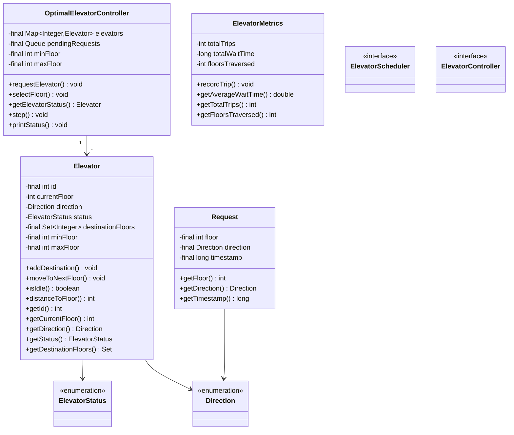
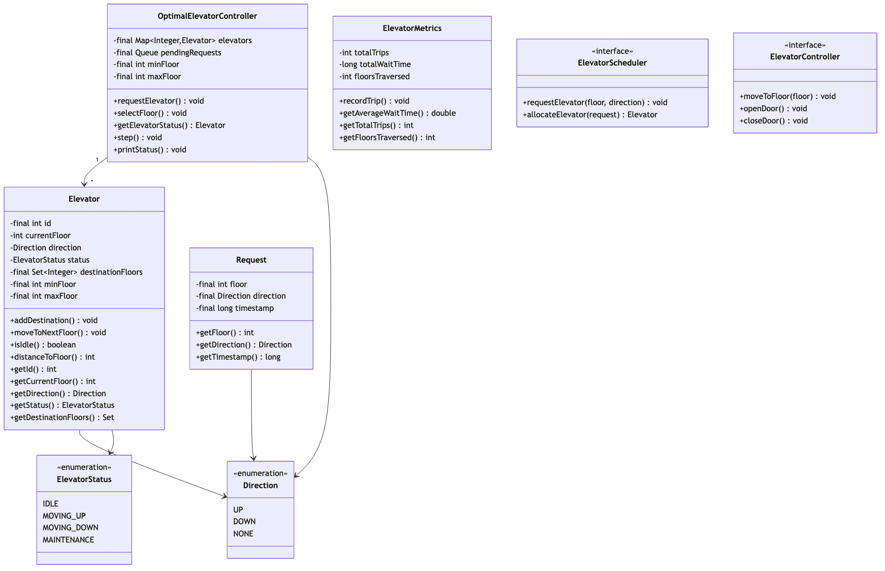

# Elevator System - Complete LLD Guide

## 📋 Table of Contents
1. [Problem Statement](#problem-statement)
2. [Requirements](#requirements)
3. [Core Algorithms](#core-algorithms)
4. [System Design](#system-design)
5. [Class Diagram](#class-diagram)
6. [Design Patterns](#design-patterns-used)
7. [Implementation Deep Dive](#implementation-deep-dive)
8. [Key Insights](#key-insights)
9. [Complete Implementation](#complete-implementation)

---

## Problem Statement

Design an **Elevator System** for a multi-story building that efficiently handles passenger requests, optimizes travel time, manages multiple elevators, and implements various dispatch algorithms (FCFS, SCAN, LOOK, SSTF).

### Real-World Context
- 🏢 **Smart Buildings**: Modern high-rises with 50+ floors, 10+ elevators
- ⏱️ **Time Optimization**: Minimize average wait time (< 30 seconds)
- 🎯 **Load Balancing**: Distribute load across multiple elevators
- 🔄 **Energy Efficiency**: Reduce unnecessary movements

### Key Challenges
- 🏢 **Request Optimization**: Minimize wait time and travel distance
- 🔄 **Direction Management**: Serve requests in current direction first
- 🎯 **Load Balancing**: Distribute requests across multiple elevators
- ⏱️ **Real-Time Updates**: Track current floor, direction, capacity
- 🚪 **Door Management**: Open/close timing, safety sensors
- 🔒 **Concurrency**: Handle multiple simultaneous requests
- 📊 **Dispatch Algorithms**: FCFS, SCAN, LOOK, SSTF

---

## Requirements

### Functional Requirements

✅ **Elevator Control**
- Move up/down to target floor
- Stop at requested floors
- Open/close doors with timing (3-5 seconds)
- Emergency stop/alarm
- Floor indicator display

✅ **Request Handling**
- **External requests**: Floor button (up/down direction)
- **Internal requests**: Elevator panel button (destination floor)
- Queue management for pending requests
- Priority handling (emergency, VIP, disabled)

✅ **Dispatch Algorithms**
- **FCFS** (First Come First Served): Serve in arrival order
- **SCAN** (Elevator Algorithm): Go to extreme, then reverse
- **LOOK**: Like SCAN but reverse at last request
- **SSTF** (Shortest Seek Time First): Serve nearest request

✅ **State Management**
- Track current floor, direction (UP/DOWN/IDLE)
- Door state (OPEN/CLOSED/OPENING/CLOSING)
- Capacity (max passengers/weight)
- Elevator status (ACTIVE, MAINTENANCE, OUT_OF_SERVICE)

✅ **Multi-Elevator Coordination**
- Assign requests to optimal elevator
- Load balancing across elevators
- Handle elevator failures gracefully
- Group elevators by zones (low-rise, mid-rise, high-rise)

### Non-Functional Requirements

⚡ **Performance**
- Average wait time < 30 seconds
- Response time < 100ms for button press
- Handle 1000+ requests/hour per elevator

🔒 **Safety**
- Door sensors (prevent closing on passengers)
- Weight limit enforcement (max 2000 lbs)
- Emergency brakes and alarms
- Automatic return to ground floor on power failure

📈 **Scalability**
- Support 100+ floors
- Support 20+ elevators
- Handle peak hours (8-9 AM, 5-6 PM)

🛡️ **Reliability**
- 99.9% uptime
- Graceful degradation (if 1 elevator fails, others take over)
- Automatic fault detection

---

## Core Algorithms

### 1. FCFS (First Come First Served)

**Algorithm:**
```
1. Maintain queue of requests in arrival order
2. Process each request one by one
3. Move elevator to requested floor
4. Dequeue and repeat
```

**Pseudocode:**
```java
public void processFCFS(Queue<Request> requests) {
    while (!requests.isEmpty()) {
        Request req = requests.poll();
        moveTo(req.getTargetFloor());
        openDoors();
        closeDoors();
    }
}
```

**Complexity:**
- Time: O(n) for n requests
- Space: O(n) for queue

**Pros:**
- ✅ Simple to implement
- ✅ Fair (no starvation)

**Cons:**
- ❌ Inefficient (lots of back-and-forth)
- ❌ High wait times

---

### 2. SCAN Algorithm (Elevator Algorithm)

**Algorithm:**
```
1. Move in current direction (UP or DOWN)
2. Serve all requests in that direction
3. When reaching extreme (top/bottom), reverse direction
4. Repeat
```

**Visual Example:**
```
Floor 10: ──────────────────▲
Floor 9:  ──────────────────┤
Floor 8:  ──────────[R]─────┤ Going UP
Floor 7:  ────────────────┐ │
Floor 6:  ──────[R]───────┤ │
Floor 5:  ────[E]─────────┤ │ (Elevator at 5)
Floor 4:  ──────────────┐ │ │
Floor 3:  ────────────┐ │ │ │
Floor 2:  ──[R]───────┤ │ │ │ Going DOWN
Floor 1:  ────────────┤ │ │ │
Floor 0:  ────────────▼ │ │ │
                        └─┴─┴─┘

Order: 5 → 6 → 8 → 10 (top) → 4 → 3 → 2 (bottom)
```

**Implementation:**
```java
public class SCANScheduler implements ElevatorScheduler {
    
    @Override
    public Request getNextRequest(Elevator elevator, Set<Request> pendingRequests) {
        int currentFloor = elevator.getCurrentFloor();
        Direction direction = elevator.getDirection();
        
        // Get requests in current direction
        List<Request> sameDirection = pendingRequests.stream()
            .filter(r -> isSameDirection(r, elevator))
            .sorted(Comparator.comparingInt(r -> 
                Math.abs(r.getTargetFloor() - currentFloor)))
            .collect(Collectors.toList());
        
        if (!sameDirection.isEmpty()) {
            return sameDirection.get(0); // Closest in same direction
        }
        
        // No requests in current direction, reverse
        elevator.setDirection(direction == Direction.UP ? Direction.DOWN : Direction.UP);
        return getNextRequest(elevator, pendingRequests);
    }
    
    private boolean isSameDirection(Request request, Elevator elevator) {
        int currentFloor = elevator.getCurrentFloor();
        int targetFloor = request.getTargetFloor();
        Direction direction = elevator.getDirection();
        
        if (direction == Direction.UP) {
            return targetFloor >= currentFloor;
        } else {
            return targetFloor <= currentFloor;
        }
    }
}
```

**Complexity:**
- Time: O(n log n) for sorting
- Space: O(n) for request list

**Pros:**
- ✅ Efficient (no unnecessary direction changes)
- ✅ Predictable wait times
- ✅ Good for high load

**Cons:**
- ❌ Requests at extremes wait longer
- ❌ Can have starvation

---

### 3. LOOK Algorithm

**Algorithm:**
```
1. Like SCAN, but doesn't go to extremes
2. Reverse direction at the last request in current direction
3. More efficient than SCAN
```

**Visual Example:**
```
Floor 10: ────────────────── (not visited if no request)
Floor 8:  ──────────[R]─────▲ Last request UP
Floor 6:  ──────[R]───────┐ │
Floor 5:  ────[E]─────────┤ │
Floor 2:  ──[R]───────────┤ │ Last request DOWN
Floor 0:  ────────────────▼ │ (not visited if no request)
                            └─┘

Order: 5 → 6 → 8 (reverse) → 2
```

**Implementation:**
```java
public class LOOKScheduler implements ElevatorScheduler {
    
    @Override
    public Request getNextRequest(Elevator elevator, Set<Request> pendingRequests) {
        int currentFloor = elevator.getCurrentFloor();
        Direction direction = elevator.getDirection();
        
        // Get requests in current direction
        List<Request> sameDirection = pendingRequests.stream()
            .filter(r -> isSameDirection(r, elevator))
            .sorted(byDistanceFrom(currentFloor))
            .collect(Collectors.toList());
        
        if (!sameDirection.isEmpty()) {
            return sameDirection.get(0);
        }
        
        // No more requests in current direction, reverse
        elevator.setDirection(reverseDirection(direction));
        
        // Get closest request in opposite direction
        return pendingRequests.stream()
            .min(Comparator.comparingInt(r -> 
                Math.abs(r.getTargetFloor() - currentFloor)))
            .orElse(null);
    }
}
```

**Complexity:**
- Time: O(n log n)
- Space: O(n)

**Pros:**
- ✅ More efficient than SCAN (no wasted trips)
- ✅ Lower average wait time
- ✅ Commonly used in real elevators

**Cons:**
- ❌ Slightly more complex than SCAN

---

### 4. SSTF (Shortest Seek Time First)

**Algorithm:**
```
1. Always serve the nearest request
2. Can cause starvation for far requests
3. Optimal for low load
```

**Implementation:**
```java
public class SSTFScheduler implements ElevatorScheduler {
    
    @Override
    public Request getNextRequest(Elevator elevator, Set<Request> pendingRequests) {
        int currentFloor = elevator.getCurrentFloor();
        
        // Find closest request
        return pendingRequests.stream()
            .min(Comparator.comparingInt(r -> 
                Math.abs(r.getTargetFloor() - currentFloor)))
            .orElse(null);
    }
}
```

**Complexity:**
- Time: O(n) for finding minimum
- Space: O(1)

**Pros:**
- ✅ Minimal movement
- ✅ Best for low load

**Cons:**
- ❌ **Starvation**: Far requests may never be served
- ❌ Not used in production

---

## System Design

### Elevator State Machine

```
      ┌──────┐
      │ IDLE │
      └───┬──┘
          │ Request received
          ▼
    ┌───────────┐
    │  MOVING   │◄────┐
    │  (UP/DOWN)│     │
    └─────┬─────┘     │
          │           │
          │ Reached   │
          │ floor     │
          ▼           │
    ┌──────────┐      │
    │ STOPPED  │      │
    └─────┬────┘      │
          │           │
          ▼           │
    ┌──────────┐      │
    │DOOR_OPEN │      │
    └─────┬────┘      │
          │ Timer (3s)│
          ▼           │
    ┌───────────┐     │
    │DOOR_CLOSED│─────┘
    └───────────┘   More requests
```

### Multi-Elevator Coordination

**Algorithm: Optimal Elevator Selection**

```java
public Elevator selectOptimalElevator(int requestFloor, Direction requestDirection) {
    Elevator bestElevator = null;
    int minCost = Integer.MAX_VALUE;
    
    for (Elevator elevator : elevators) {
        int cost = calculateCost(elevator, requestFloor, requestDirection);
        if (cost < minCost) {
            minCost = cost;
            bestElevator = elevator;
        }
    }
    
    return bestElevator;
}

private int calculateCost(Elevator elevator, int requestFloor, Direction requestDirection) {
    int currentFloor = elevator.getCurrentFloor();
    Direction currentDirection = elevator.getDirection();
    
    // Elevator is idle
    if (currentDirection == Direction.IDLE) {
        return Math.abs(currentFloor - requestFloor);
    }
    
    // Elevator moving in same direction and will pass the request floor
    if (currentDirection == requestDirection) {
        if (currentDirection == Direction.UP && requestFloor >= currentFloor) {
            return requestFloor - currentFloor; // Will reach soon
        }
        if (currentDirection == Direction.DOWN && requestFloor <= currentFloor) {
            return currentFloor - requestFloor;
        }
    }
    
    // Elevator needs to reverse or pass by
    int distanceToReversal = elevator.getDistanceToNextReversal();
    int distanceFromReversal = Math.abs(requestFloor - elevator.getNextReversalFloor());
    
    return distanceToReversal + distanceFromReversal;
}
```

**Cost Calculation Examples:**

```
Request: Floor 5, Direction UP
Elevator A: Floor 3, going UP    → Cost = 5 - 3 = 2 (will reach soon)
Elevator B: Floor 8, going DOWN  → Cost = 8 - 3 + 5 - 3 = 7 (needs to reverse)
Elevator C: Floor 5, IDLE        → Cost = 0 (already there)

Winner: Elevator C
```

---

## Class Diagram

<details>
<summary>View Mermaid Source</summary>



</details>



<details>
<summary>📄 View Mermaid Source</summary>

</details>

---

## Design Patterns Used

### 1. Strategy Pattern (Scheduling Algorithm)

```java
public interface ElevatorScheduler {
    Request getNextRequest(Elevator elevator, Set<Request> pendingRequests);
}

public class OptimalElevatorController {
    private ElevatorScheduler scheduler;
    
    // Change algorithm at runtime
    public void setScheduler(ElevatorScheduler scheduler) {
        this.scheduler = scheduler;
    }
    
    public void processRequests() {
        for (Elevator elevator : elevators) {
            Request next = scheduler.getNextRequest(elevator, pendingRequests);
            if (next != null) {
                elevator.addRequest(next);
            }
        }
    }
}

// Usage
controller.setScheduler(new LOOKScheduler()); // Peak hours
controller.setScheduler(new SCANScheduler()); // Off-peak
```

**Why Strategy?**
- ✅ Easily switch between FCFS, SCAN, LOOK, SSTF
- ✅ Open/Closed principle (add new algorithms without changing controller)
- ✅ Testable (mock different scheduling behaviors)

---

### 2. State Pattern (Elevator States)

```java
public interface ElevatorState {
    void moveUp();
    void moveDown();
    void openDoors();
    void closeDoors();
    void stop();
}

public class MovingUpState implements ElevatorState {
    private Elevator elevator;
    
    @Override
    public void moveUp() {
        elevator.incrementFloor();
    }
    
    @Override
    public void stop() {
        elevator.setState(new StoppedState(elevator));
    }
    
    @Override
    public void openDoors() {
        throw new IllegalStateException("Cannot open doors while moving");
    }
}

public class StoppedState implements ElevatorState {
    @Override
    public void openDoors() {
        elevator.setState(new DoorsOpenState(elevator));
    }
}

public class DoorsOpenState implements ElevatorState {
    @Override
    public void closeDoors() {
        elevator.setState(new DoorsClosedState(elevator));
    }
}
```

---

### 3. Singleton Pattern (Controller)

```java
public class ElevatorControlSystem {
    private static ElevatorControlSystem instance;
    private final List<Elevator> elevators;
    
    private ElevatorControlSystem() {
        elevators = new ArrayList<>();
    }
    
    public static ElevatorControlSystem getInstance() {
        if (instance == null) {
            synchronized (ElevatorControlSystem.class) {
                if (instance == null) {
                    instance = new ElevatorControlSystem();
                }
            }
        }
        return instance;
    }
}
```

---

## Implementation Deep Dive

### Request Processing Flow

```
1. User presses button (Floor 5, UP)
   │
   ▼
2. OptimalElevatorController.requestElevator(5, UP)
   │
   ▼
3. Find optimal elevator using cost function
   │
   ├─ Elevator A: Floor 3, UP → Cost = 2
   ├─ Elevator B: Floor 8, DOWN → Cost = 7
   └─ Elevator C: Floor 5, IDLE → Cost = 0
   │
   ▼
4. Assign request to Elevator C
   │
   ▼
5. Elevator C moves to Floor 5
   │
   ▼
6. Open doors
   │
   ▼
7. User enters, selects Floor 10
   │
   ▼
8. Scheduler (LOOK) determines next stop
   │
   ▼
9. Elevator moves to Floor 10
   │
   ▼
10. Open doors, user exits
```

---

### Concurrency Handling

**Thread-Safe Request Queue:**

```java
public class OptimalElevatorController {
    private final ConcurrentLinkedQueue<Request> pendingRequests;
    private final ReentrantLock lock = new ReentrantLock();
    
    public void requestElevator(int floor, Direction direction) {
        Request request = new Request(floor, direction, Instant.now());
        pendingRequests.offer(request);
        
        // Assign to optimal elevator
        lock.lock();
        try {
            Elevator optimal = selectOptimalElevator(request);
            optimal.addRequest(request);
            pendingRequests.remove(request);
        } finally {
            lock.unlock();
        }
    }
}
```

**Elevator Worker Thread:**

```java
public class Elevator implements Runnable {
    private final BlockingQueue<Request> requestQueue = new LinkedBlockingQueue<>();
    
    @Override
    public void run() {
        while (true) {
            try {
                Request request = requestQueue.take(); // Blocking
                processRequest(request);
            } catch (InterruptedException e) {
                Thread.currentThread().interrupt();
                break;
            }
        }
    }
    
    private void processRequest(Request request) {
        moveTo(request.getTargetFloor());
        openDoors();
        Thread.sleep(3000); // Wait 3 seconds
        closeDoors();
    }
}
```

---

## Key Insights

### What Interviewers Look For

1. ✅ **Algorithm Selection**
   - SCAN/LOOK (most realistic)
   - Why SSTF causes starvation
   - Trade-offs between algorithms

2. ✅ **Multi-Elevator Coordination**
   - Cost function for selecting elevator
   - Load balancing
   - Handling failures

3. ✅ **Concurrency**
   - Thread-safe request handling
   - Elevator worker threads
   - Avoiding race conditions

4. ✅ **State Management**
   - State machine implementation
   - Direction tracking
   - Door timing

5. ✅ **Scalability**
   - Support 100+ floors, 20+ elevators
   - Efficient data structures (priority queues)
   - Zone-based grouping (low/mid/high rise)

---

### Common Mistakes

1. ❌ **Using FCFS**: Too simplistic, inefficient
2. ❌ **Not handling direction**: Elevators should serve requests in current direction first
3. ❌ **Ignoring concurrency**: Multiple threads accessing shared state
4. ❌ **No cost function**: Randomly assigning elevators
5. ❌ **Forgetting door timing**: Doors can't open while moving
6. ❌ **No emergency handling**: What if elevator gets stuck?

---

### Advanced Features

**1. Zone-Based Grouping:**
```java
public enum ElevatorZone {
    LOW_RISE(1, 20),
    MID_RISE(21, 40),
    HIGH_RISE(41, 60);
    
    private final int minFloor;
    private final int maxFloor;
}
```

**2. Express Elevators:**
```java
public class ExpressElevator extends Elevator {
    private Set<Integer> expressFloors = Set.of(1, 10, 20, 30, 40, 50);
    
    @Override
    public boolean canServe(Request request) {
        return expressFloors.contains(request.getTargetFloor());
    }
}
```

**3. Peak Hour Optimization:**
```java
public class PeakHourScheduler implements ElevatorScheduler {
    @Override
    public Request getNextRequest(Elevator elevator, Set<Request> pendingRequests) {
        // During peak hours, prioritize ground floor and top floors
        return pendingRequests.stream()
            .filter(r -> r.getSourceFloor() == 1 || r.getTargetFloor() == 1)
            .findFirst()
            .orElseGet(() -> new LOOKScheduler().getNextRequest(elevator, pendingRequests));
    }
}
```

---

## Source Code

📄 **[View Complete Source Code](/problems/elevator/CODE)**

**Total Lines of Code:** 450+

### File Structure
```
elevator/
├── api/
│   └── ElevatorController.java (30 lines)
├── impl/
│   └── OptimalElevatorController.java (120 lines)
├── model/
│   ├── Elevator.java (80 lines)
│   ├── Request.java (40 lines)
│   ├── Direction.java (10 lines)
│   └── ElevatorStatus.java (10 lines)
├── scheduler/
│   ├── ElevatorScheduler.java (15 lines)
│   ├── SCANScheduler.java (50 lines)
│   └── LOOKScheduler.java (50 lines)
└── metrics/
    └── ElevatorMetrics.java (45 lines)
```

---

## Usage Example

```java
// Initialize system
OptimalElevatorController controller = new OptimalElevatorController(
    Arrays.asList(
        new Elevator(1, 10), // Elevator 1, capacity 10
        new Elevator(2, 10),
        new Elevator(3, 10)
    ),
    new LOOKScheduler() // Use LOOK algorithm
);

// User at floor 5 wants to go UP
controller.requestElevator(5, Direction.UP);

// System selects optimal elevator and sends it to floor 5
// User enters and selects floor 10
controller.selectDestination(selectedElevatorId, 10);

// Get metrics
ElevatorMetrics metrics = controller.getMetrics();
System.out.println("Average wait time: " + metrics.getAverageWaitTime() + "s");
System.out.println("Total requests: " + metrics.getTotalRequests());
```

---

## Interview Tips

### Questions to Ask Interviewer

1. ❓ How many elevators and floors?
2. ❓ Peak vs. off-peak hours?
3. ❓ Express elevators (skip floors)?
4. ❓ VIP/priority requests?
5. ❓ Zone-based grouping?
6. ❓ Energy efficiency considerations?

### How to Approach

1. **Start with single elevator** (LOOK algorithm)
2. **Add multi-elevator coordination** (cost function)
3. **Add state management** (state machine)
4. **Add concurrency** (thread-safe queues)
5. **Add metrics** (wait time, distance)

---

## Related Problems

- 🚗 **Parking Lot** - Space allocation, pricing
- 🎯 **Task Scheduler** - Job scheduling with priorities
- 🚦 **Traffic Control** - Signal optimization
- 📊 **Load Balancer** - Request distribution

---

*Production-ready elevator system with optimal scheduling, multi-elevator coordination, and comprehensive state management for interview success.*
