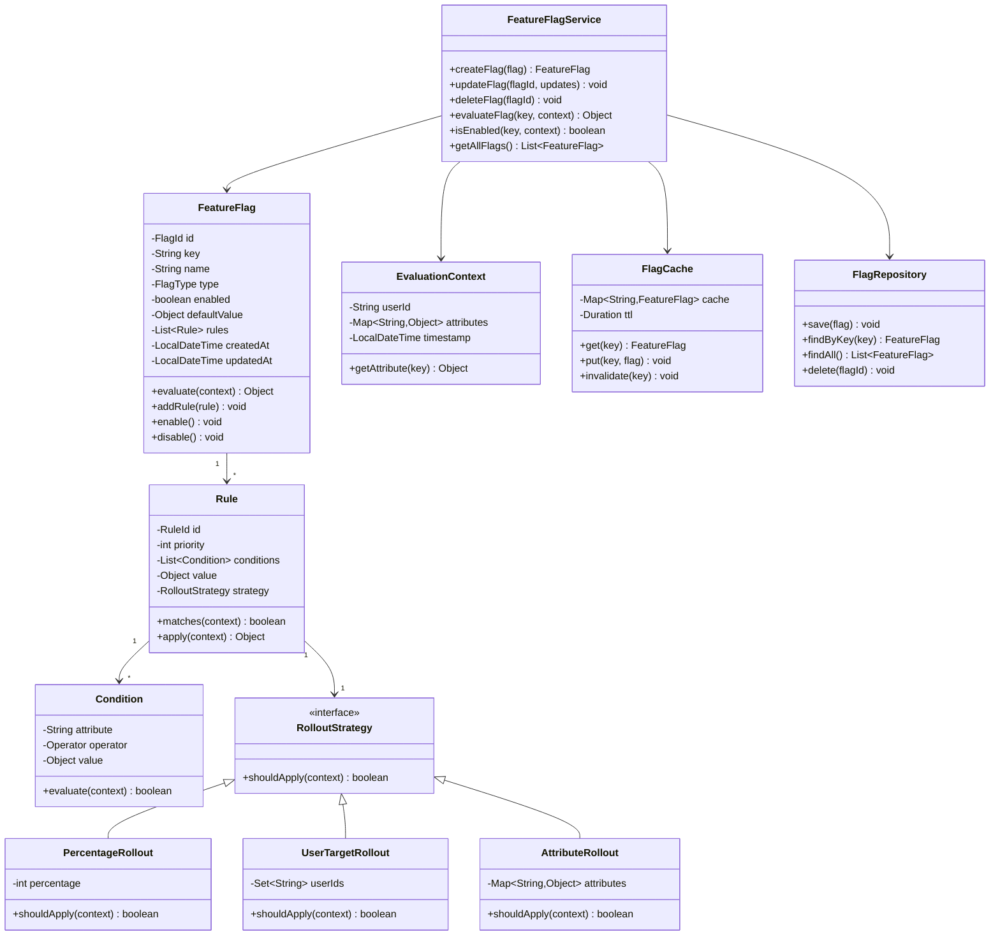

# Feature Flags System - Low Level Design

## Problem Statement

Design a Feature Flags (Feature Toggles) system that allows developers to enable/disable features in production without code deployment. The system should support different rollout strategies, user targeting, and real-time flag updates.

## Table of Contents
- [Requirements](#requirements)
- [Class Diagram](#class-diagram)
- [Key Design Decisions](#key-design-decisions)
- [Implementation Guide](#implementation-guide)
- [Source Code](#source-code)

## Requirements

### Functional Requirements
1. **Feature Flag Management**
   - Create, update, delete feature flags
   - Enable/disable flags globally
   - Set default values for flags

2. **Rollout Strategies**
   - Percentage-based rollout (e.g., 10% of users)
   - User-based targeting (specific user IDs)
   - Attribute-based targeting (e.g., premium users, region)
   - Ring-based deployment (staged rollout)

3. **Flag Types**
   - Boolean flags (on/off)
   - String flags (variant selection)
   - Number flags (configuration values)
   - JSON flags (complex configurations)

4. **Real-time Updates**
   - Changes propagate immediately
   - Cache invalidation
   - Event notifications

5. **Evaluation**
   - Fast flag evaluation (< 10ms)
   - Support complex targeting rules
   - Fallback to defaults on errors

### Non-Functional Requirements
- **Performance**: Flag evaluation < 10ms, support 100K+ QPS
- **Availability**: 99.99% uptime
- **Consistency**: Eventually consistent across regions
- **Scalability**: Handle millions of flags and billions of evaluations
- **Audit**: Track all flag changes and evaluations

## Class Diagram


<details>
<summary>View Mermaid Source</summary>



</details>

## Key Design Decisions

### 1. Rule-Based Evaluation Engine
**Decision**: Use a priority-based rule engine with conditions and rollout strategies.

**Rationale**:
- Flexible targeting without code changes
- Supports complex use cases (A/B testing, gradual rollouts)
- Easy to add new targeting strategies
- Clear evaluation order with priority

**Tradeoffs**:
- More complex than simple boolean flags
- Requires careful rule design to avoid conflicts

### 2. Layered Caching Strategy
**Decision**: Implement multi-level caching (in-memory + distributed).

**Rationale**:
- Achieves < 10ms evaluation latency
- Reduces database load
- Handles high QPS efficiently
- TTL-based invalidation for consistency

**Tradeoffs**:
- Cache invalidation complexity
- Potential stale reads during updates
- Memory overhead

### 3. Context-Based Evaluation
**Decision**: Pass evaluation context (user, attributes) to flag evaluation.

**Rationale**:
- Enables sophisticated targeting
- Supports multivariate testing
- Allows attribute-based rollouts
- Clean separation of concerns

**Tradeoffs**:
- Requires passing context throughout application
- More data to serialize/deserialize

### 4. Immutable Flag Values
**Decision**: Flag rules and values are immutable after creation.

**Rationale**:
- Thread-safe evaluations
- Easier to cache
- Simpler reasoning about behavior
- Better for audit trails

**Tradeoffs**:
- More objects created
- Need new version for updates

## Implementation Guide

### 1. Flag Evaluation Algorithm

```
Algorithm: EvaluateFlag(key, context)
Input: flag key (string), evaluation context
Output: flag value (any type)

1. flag = cache.get(key)
2. if flag == null:
      flag = repository.findByKey(key)
      cache.put(key, flag)

3. if !flag.enabled:
      return flag.defaultValue

4. rules = flag.rules sorted by priority DESC

5. for each rule in rules:
      if rule.matches(context):
         if rule.strategy.shouldApply(context):
            return rule.value

6. return flag.defaultValue
```

**Time Complexity**: O(R × C) where R is rules count, C is conditions per rule  
**Space Complexity**: O(1) for evaluation

### 2. Percentage Rollout (Consistent Hashing)

```
Algorithm: PercentageRollout(userId, percentage)
Input: user ID, target percentage (0-100)
Output: boolean (should apply)

1. hash = murmur3(flagKey + userId)
2. bucket = hash % 100
3. return bucket < percentage
```

**Properties**:
- Consistent: Same user always gets same result
- Uniform: Even distribution across buckets
- Deterministic: No randomness

### 3. Rule Matching

```
Algorithm: RuleMatches(rule, context)
Input: rule with conditions, evaluation context
Output: boolean (rule matches)

1. if rule.conditions is empty:
      return true

2. for each condition in rule.conditions:
      attribute = context.getAttribute(condition.attribute)
      if !condition.operator.evaluate(attribute, condition.value):
         return false

3. return true  // All conditions matched
```

**Supported Operators**:
- `EQUALS`, `NOT_EQUALS`
- `IN`, `NOT_IN`
- `GREATER_THAN`, `LESS_THAN`
- `CONTAINS`, `STARTS_WITH`, `ENDS_WITH`
- `MATCHES_REGEX`

### 4. Cache Invalidation Strategy

```
Algorithm: InvalidateCache(flagKey)
Input: flag key that was updated
Output: void

1. cache.invalidate(flagKey)
2. publishEvent(FlagUpdatedEvent(flagKey))
3. for each subscriber:
      subscriber.onFlagUpdate(flagKey)
```

**Invalidation Triggers**:
- Flag enabled/disabled
- Rules added/removed/updated
- Default value changed
- Flag deleted

## Source Code

**Total Files**: 10  
**Total Lines of Code**: ~587

### Quick Links
- [📁 View Complete Implementation](/problems/featureflags/CODE)

### Project Structure
```
featureflags/
├── model/
│   ├── FeatureFlag.java          // Core flag entity
│   ├── Rule.java                 // Targeting rule
│   ├── Condition.java            // Rule condition
│   ├── EvaluationContext.java    // User context
│   ├── FlagType.java             // Boolean, String, Number, JSON
│   └── Operator.java             // Comparison operators
├── strategy/
│   ├── RolloutStrategy.java      // Strategy interface
│   ├── PercentageRollout.java    // % based rollout
│   ├── UserTargetRollout.java    // User whitelist
│   └── AttributeRollout.java     // Attribute matching
├── api/
│   └── FeatureFlagService.java   // Service interface
├── impl/
│   ├── InMemoryFeatureFlagService.java  // Implementation
│   └── FlagEvaluator.java        // Evaluation engine
└── cache/
    └── FlagCache.java            // Caching layer
```

### Core Components

1. **FeatureFlag** (`model/FeatureFlag.java`)
   - Contains flag metadata and rules
   - Handles evaluation logic
   - Manages enabled/disabled state

2. **Rule Engine** (`model/Rule.java`, `model/Condition.java`)
   - Priority-based rule matching
   - Condition evaluation with operators
   - Flexible targeting

3. **Rollout Strategies** (`strategy/*`)
   - Percentage-based (consistent hashing)
   - User targeting (whitelist/blacklist)
   - Attribute-based (custom attributes)

4. **Service Layer** (`impl/InMemoryFeatureFlagService.java`)
   - CRUD operations for flags
   - Flag evaluation with caching
   - Event publishing for updates

5. **Caching** (`cache/FlagCache.java`)
   - In-memory LRU cache
   - TTL-based expiration
   - Invalidation on updates

### Design Patterns Used

| Pattern | Usage | Benefit |
|---------|-------|---------|
| **Strategy** | RolloutStrategy implementations | Easy to add new rollout types |
| **Builder** | FeatureFlag, Rule construction | Clean, fluent API |
| **Cache-Aside** | FlagCache implementation | Performance optimization |
| **Observer** | Flag update notifications | Real-time propagation |
| **Template Method** | Rule evaluation | Consistent evaluation flow |

### Usage Example

```java
// Create a feature flag
FeatureFlag flag = FeatureFlag.builder()
    .key("new_checkout_ui")
    .type(FlagType.BOOLEAN)
    .enabled(true)
    .defaultValue(false)
    .build();

// Add 10% rollout rule
Rule rolloutRule = Rule.builder()
    .priority(10)
    .value(true)
    .strategy(new PercentageRollout(10))
    .build();
flag.addRule(rolloutRule);

// Add premium user rule
Rule premiumRule = Rule.builder()
    .priority(20)
    .value(true)
    .addCondition(new Condition("userTier", Operator.EQUALS, "PREMIUM"))
    .build();
flag.addRule(premiumRule);

// Evaluate flag
EvaluationContext context = EvaluationContext.builder()
    .userId("user123")
    .attribute("userTier", "PREMIUM")
    .build();

boolean enabled = (Boolean) service.evaluateFlag("new_checkout_ui", context);
// Returns true for premium users, 10% for others
```

## Interview Discussion Points

### System Design Considerations

1. **How would you handle flag evaluation at scale?**
   - Multi-level caching (in-memory + Redis)
   - Pre-compute flag state for known users
   - Use bloom filters for negative lookups
   - Batch evaluations for bulk requests

2. **How to ensure consistency across services?**
   - Use event sourcing for flag updates
   - Implement eventual consistency model
   - Publish changes via message queue (Kafka)
   - Cache with TTL and background refresh

3. **How to prevent misuse (flag sprawl)?**
   - Enforce flag lifecycle (creation → rollout → cleanup)
   - Automated flag cleanup after N days
   - Flag usage analytics
   - Required documentation for each flag

4. **How to test feature flags?**
   - Override flags in test environments
   - Use evaluation context mocking
   - Test each rule path independently
   - Verify rollout percentages statistically

### Scalability

- **Reads**: 100K+ QPS per node with local cache
- **Writes**: Async updates via message queue
- **Storage**: Flags in database, cache in memory
- **Distribution**: CDN for flag configs

### Real-World Extensions

1. **A/B Testing Integration**
   - Variant assignment
   - Metrics tracking
   - Statistical significance testing

2. **Audit & Compliance**
   - Track every flag evaluation
   - Store evaluation reasons
   - Generate compliance reports

3. **Kill Switch**
   - Instant global disable
   - Emergency override mechanism
   - Automated rollback on errors

4. **Experimentation Platform**
   - Multi-variate testing
   - Holdout groups
   - Metric aggregation

---

This Feature Flags implementation provides a production-ready foundation for controlled feature rollouts, A/B testing, and operational safety in modern applications.
