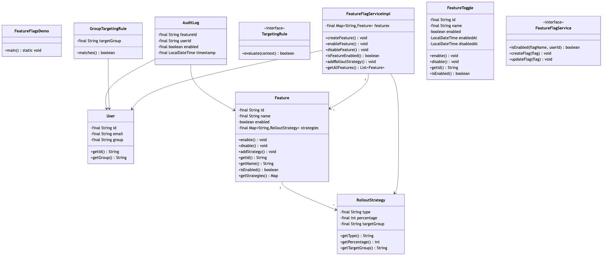

# Feature Flags System

## Overview
A comprehensive feature flag (feature toggle) management system supporting gradual rollouts, A/B testing, user targeting, and runtime configuration. Implements percentage-based rollouts, user segmentation, kill switches, and operational flags for safe feature deployment and experimentation.

**Difficulty:** Medium  
**Domain:** DevOps, Configuration Management  
**Interview Frequency:** High (LaunchDarkly, Split.io, Optimizely, major tech companies)

## Requirements

### Functional Requirements
1. **Flag Management**
   - Create/update/delete flags
   - Boolean, string, number, JSON flags
   - Flag versioning
   - Flag dependencies
   - Default values

2. **Targeting Rules**
   - User-based targeting (whitelist/blacklist)
   - Percentage-based rollouts
   - Attribute-based targeting (location, device, etc.)
   - Multiple rules with priority
   - Rule chaining (AND/OR logic)

3. **Flag Evaluation**
   - Evaluate flag for user/context
   - Fast evaluation (< 10ms)
   - Fallback values
   - Type safety
   - Consistent hashing for rollouts

4. **Rollout Strategies**
   - Gradual rollout (0% → 100%)
   - Canary deployment
   - Blue-green deployment
   - Ring-based rollout
   - Kill switch (instant disable)

5. **A/B Testing**
   - Define experiments
   - Variant assignment
   - Consistent user experience
   - Track metrics
   - Statistical significance

6. **Administration**
   - Web UI for flag management
   - Audit logs
   - Flag lifecycle (dev → staging → prod)
   - Permissions and access control
   - Flag health monitoring

### Non-Functional Requirements
1. **Performance**
   - Flag evaluation: < 10ms
   - Support 1M+ flags
   - 100K+ evaluations/second
   - Local caching

2. **Availability**
   - 99.99% uptime
   - Graceful degradation
   - SDK caching (offline mode)
   - No single point of failure

3. **Consistency**
   - Eventual consistency acceptable
   - Deterministic evaluation
   - No user flickering


## Class Diagram



## System Architecture

```
┌────────────────────────────────────────────────────┐
│              Application Services                   │
│   (Web App, Mobile App, Backend Services)          │
└────────────────┬───────────────────────────────────┘
                 │
     ┌───────────▼────────────┐
     │   Feature Flag SDK     │
     │                        │
     │  - Evaluate flags      │
     │  - Local cache         │
     │  - Fallback values     │
     └────────────┬───────────┘
                  │
     ┌────────────▼────────────┐
     │  Feature Flag Service   │
     │                         │
     │  - Flag evaluation      │
     │  - Rule engine          │
     │  - User targeting       │
     │  - Rollout control      │
     └────────────┬────────────┘
                  │
     ┌────────────┼────────────┐
     │            │            │
┌────▼────┐  ┌───▼────┐  ┌───▼────┐
│  Flag   │  │ User   │  │ Event  │
│  Store  │  │ Segment│  │  Log   │
│         │  │ Store  │  │        │
│ Flags   │  │ Rules  │  │ Evals  │
│ Rules   │  │ Groups │  │ Events │
└─────────┘  └────────┘  └────────┘
```

## Core Data Model

### 1. Feature Flag
```java
public class FeatureFlag {
    private FlagId id;
    private String key; // Unique identifier: "new-checkout-flow"
    private String name; // Display name
    private String description;
    private FlagType type; // BOOLEAN, STRING, NUMBER, JSON
    private Object defaultValue;
    private List<TargetingRule> rules;
    private FlagStatus status; // ACTIVE, ARCHIVED, DEPRECATED
    private Environment environment; // DEV, STAGING, PROD
    private LocalDateTime createdAt;
    private LocalDateTime updatedAt;
    private String createdBy;
    
    public Object evaluate(EvaluationContext context) {
        // Check rules in priority order
        for (TargetingRule rule : rules) {
            if (rule.matches(context)) {
                return rule.getValue();
            }
        }
        
        // Return default if no rules match
        return defaultValue;
    }
    
    public boolean isActive() {
        return status == FlagStatus.ACTIVE;
    }
}

enum FlagType {
    BOOLEAN,  // true/false
    STRING,   // "variant-a", "variant-b"
    NUMBER,   // 42, 3.14
    JSON      // Complex objects
}

enum FlagStatus {
    ACTIVE,       // Flag is live
    ARCHIVED,     // Flag removed but kept for history
    DEPRECATED,   // Flag scheduled for removal
    DISABLED      // Temporarily disabled
}
```

### 2. Targeting Rule
```java
public class TargetingRule {
    private RuleId id;
    private int priority; // Lower number = higher priority
    private List<Condition> conditions;
    private LogicOperator operator; // AND, OR
    private Object value; // Value to return if rule matches
    private RolloutConfig rollout;
    
    public boolean matches(EvaluationContext context) {
        if (conditions.isEmpty()) {
            return true;
        }
        
        if (operator == LogicOperator.AND) {
            return conditions.stream().allMatch(c -> c.evaluate(context));
        } else {
            return conditions.stream().anyMatch(c -> c.evaluate(context));
        }
    }
    
    public Object getValue(EvaluationContext context) {
        if (rollout != null) {
            return rollout.evaluate(context);
        }
        return value;
    }
}

enum LogicOperator {
    AND,  // All conditions must match
    OR    // At least one condition must match
}
```

### 3. Condition
```java
public abstract class Condition {
    protected String attribute; // "userId", "country", "plan"
    protected ConditionOperator operator;
    
    public abstract boolean evaluate(EvaluationContext context);
}

class StringCondition extends Condition {
    private List<String> values;
    
    public boolean evaluate(EvaluationContext context) {
        String contextValue = context.getString(attribute);
        
        switch (operator) {
            case EQUALS:
                return values.contains(contextValue);
            case NOT_EQUALS:
                return !values.contains(contextValue);
            case STARTS_WITH:
                return values.stream().anyMatch(contextValue::startsWith);
            case CONTAINS:
                return values.stream().anyMatch(contextValue::contains);
            default:
                return false;
        }
    }
}

class NumberCondition extends Condition {
    private double value;
    
    public boolean evaluate(EvaluationContext context) {
        double contextValue = context.getNumber(attribute);
        
        switch (operator) {
            case EQUALS:
                return contextValue == value;
            case GREATER_THAN:
                return contextValue > value;
            case LESS_THAN:
                return contextValue < value;
            case GREATER_THAN_OR_EQUAL:
                return contextValue >= value;
            case LESS_THAN_OR_EQUAL:
                return contextValue <= value;
            default:
                return false;
        }
    }
}

class DateCondition extends Condition {
    private LocalDateTime datetime;
    
    public boolean evaluate(EvaluationContext context) {
        LocalDateTime contextTime = context.getDateTime(attribute);
        
        switch (operator) {
            case BEFORE:
                return contextTime.isBefore(datetime);
            case AFTER:
                return contextTime.isAfter(datetime);
            default:
                return false;
        }
    }
}

enum ConditionOperator {
    EQUALS,
    NOT_EQUALS,
    GREATER_THAN,
    LESS_THAN,
    GREATER_THAN_OR_EQUAL,
    LESS_THAN_OR_EQUAL,
    STARTS_WITH,
    ENDS_WITH,
    CONTAINS,
    MATCHES_REGEX,
    IN_LIST,
    BEFORE,
    AFTER
}
```

### 4. Rollout Configuration
```java
public class RolloutConfig {
    private RolloutType type;
    private int percentage; // 0-100
    private Map<String, Integer> variantWeights; // For A/B testing
    
    public Object evaluate(EvaluationContext context) {
        String userId = context.getUserId();
        
        switch (type) {
            case PERCENTAGE:
                return evaluatePercentage(userId);
            
            case WEIGHTED_VARIANTS:
                return evaluateWeightedVariants(userId);
            
            default:
                return null;
        }
    }
    
    private boolean evaluatePercentage(String userId) {
        // Consistent hashing for deterministic assignment
        int hash = Math.abs(userId.hashCode()) % 100;
        return hash < percentage;
    }
    
    private String evaluateWeightedVariants(String userId) {
        int hash = Math.abs(userId.hashCode()) % 100;
        
        int cumulative = 0;
        for (Map.Entry<String, Integer> entry : variantWeights.entrySet()) {
            cumulative += entry.getValue();
            if (hash < cumulative) {
                return entry.getKey();
            }
        }
        
        return "control"; // Fallback
    }
}

enum RolloutType {
    PERCENTAGE,           // 50% of users get new feature
    WEIGHTED_VARIANTS,    // 30% A, 40% B, 30% C
    USER_LIST,           // Specific user IDs
    ATTRIBUTE_BASED      // Based on user attributes
}
```

### 5. Evaluation Context
```java
public class EvaluationContext {
    private String userId;
    private Map<String, Object> attributes;
    
    public EvaluationContext(String userId) {
        this.userId = userId;
        this.attributes = new HashMap<>();
    }
    
    public EvaluationContext withAttribute(String key, Object value) {
        attributes.put(key, value);
        return this;
    }
    
    public String getString(String key) {
        Object value = attributes.get(key);
        return value != null ? value.toString() : null;
    }
    
    public double getNumber(String key) {
        Object value = attributes.get(key);
        if (value instanceof Number) {
            return ((Number) value).doubleValue();
        }
        return 0.0;
    }
    
    public LocalDateTime getDateTime(String key) {
        Object value = attributes.get(key);
        if (value instanceof LocalDateTime) {
            return (LocalDateTime) value;
        }
        return null;
    }
}
```

## Key Algorithms

### 1. Flag Evaluation Engine
```java
public class FeatureFlagService {
    private final FlagStore flagStore;
    private final Cache<String, FeatureFlag> flagCache;
    
    public boolean isEnabled(String flagKey, EvaluationContext context) {
        FeatureFlag flag = getFlag(flagKey);
        
        if (flag == null || !flag.isActive()) {
            return false;
        }
        
        Object result = flag.evaluate(context);
        
        if (result instanceof Boolean) {
            return (Boolean) result;
        }
        
        return false;
    }
    
    public <T> T getVariant(String flagKey, EvaluationContext context, T defaultValue) {
        try {
            FeatureFlag flag = getFlag(flagKey);
            
            if (flag == null || !flag.isActive()) {
                return defaultValue;
            }
            
            Object result = flag.evaluate(context);
            
            return (T) result;
            
        } catch (Exception e) {
            // Log error and return default
            logger.error("Error evaluating flag: " + flagKey, e);
            return defaultValue;
        }
    }
    
    private FeatureFlag getFlag(String flagKey) {
        // Check cache first
        FeatureFlag cached = flagCache.get(flagKey);
        if (cached != null) {
            return cached;
        }
        
        // Load from store
        FeatureFlag flag = flagStore.get(flagKey);
        if (flag != null) {
            flagCache.put(flagKey, flag);
        }
        
        return flag;
    }
}
```

**Time Complexity:** O(R × C) where R=rules, C=conditions per rule  
**Space Complexity:** O(F) where F=cached flags

### 2. Consistent Hash-based Rollout
```java
public class ConsistentHashRollout {
    
    public boolean shouldRollout(String userId, String flagKey, int percentage) {
        // Combine userId and flagKey for deterministic hashing
        String hashInput = userId + ":" + flagKey;
        
        // Use MurmurHash or similar for good distribution
        long hash = murmurHash3(hashInput);
        
        // Map to 0-100 range
        int bucket = (int) (Math.abs(hash) % 100);
        
        return bucket < percentage;
    }
    
    public String assignVariant(String userId, String flagKey, Map<String, Integer> variants) {
        String hashInput = userId + ":" + flagKey;
        long hash = murmurHash3(hashInput);
        int bucket = (int) (Math.abs(hash) % 100);
        
        int cumulative = 0;
        for (Map.Entry<String, Integer> entry : variants.entrySet()) {
            cumulative += entry.getValue();
            if (bucket < cumulative) {
                return entry.getKey();
            }
        }
        
        return "control";
    }
    
    private long murmurHash3(String input) {
        byte[] data = input.getBytes();
        int length = data.length;
        long h1 = 0x9368e53c2f6af274L;
        long h2 = 0x586dcd208f7cd3fdL;
        
        // MurmurHash3 128-bit implementation
        // ... (simplified for brevity)
        
        return h1;
    }
}
```

**Why Consistent Hashing?**
- Same user always gets same variant
- No state storage needed
- Changes to percentage don't reassign all users
- Good distribution across users

### 3. Rule Engine with Priority
```java
public class RuleEngine {
    
    public Object evaluateRules(List<TargetingRule> rules, EvaluationContext context) {
        // Sort by priority (ascending)
        rules.sort(Comparator.comparingInt(TargetingRule::getPriority));
        
        // Evaluate in priority order
        for (TargetingRule rule : rules) {
            if (rule.matches(context)) {
                return rule.getValue(context);
            }
        }
        
        return null; // No matching rule
    }
    
    public boolean evaluateConditions(List<Condition> conditions, 
                                     LogicOperator operator, 
                                     EvaluationContext context) {
        
        if (conditions.isEmpty()) {
            return true;
        }
        
        switch (operator) {
            case AND:
                return conditions.stream()
                    .allMatch(c -> c.evaluate(context));
            
            case OR:
                return conditions.stream()
                    .anyMatch(c -> c.evaluate(context));
            
            default:
                return false;
        }
    }
}
```

### 4. Gradual Rollout Controller
```java
public class GradualRolloutController {
    private final FeatureFlagService flagService;
    private final ScheduledExecutorService scheduler;
    
    public void startGradualRollout(String flagKey, 
                                    int initialPercentage,
                                    int targetPercentage,
                                    int incrementPercentage,
                                    Duration incrementInterval) {
        
        int currentPercentage = initialPercentage;
        
        scheduler.scheduleAtFixedRate(() -> {
            if (currentPercentage < targetPercentage) {
                currentPercentage += incrementPercentage;
                
                if (currentPercentage > targetPercentage) {
                    currentPercentage = targetPercentage;
                }
                
                updateFlagPercentage(flagKey, currentPercentage);
                
                logger.info("Rolled out {} to {}%", flagKey, currentPercentage);
                
                // Check metrics
                if (hasErrors(flagKey)) {
                    logger.warn("Errors detected, pausing rollout");
                    scheduler.shutdown();
                }
            } else {
                logger.info("Rollout complete for {}", flagKey);
                scheduler.shutdown();
            }
        }, 0, incrementInterval.toMinutes(), TimeUnit.MINUTES);
    }
    
    public void killSwitch(String flagKey) {
        // Instantly disable flag (emergency)
        FeatureFlag flag = flagService.getFlag(flagKey);
        flag.setStatus(FlagStatus.DISABLED);
        flagService.updateFlag(flag);
        
        // Invalidate all caches
        flagService.invalidateCache(flagKey);
        
        logger.warn("KILL SWITCH activated for flag: {}", flagKey);
    }
}
```

**Gradual Rollout Example:**
```
Day 1: 0% → 5%   (500 users)
Day 2: 5% → 10%  (1,000 users)
Day 3: 10% → 25% (2,500 users)
Day 4: 25% → 50% (5,000 users)
Day 5: 50% → 100% (10,000 users)

If errors detected: KILL SWITCH → 0%
```

## Design Patterns

### 1. Strategy Pattern (Rollout Strategies)
```java
interface RolloutStrategy {
    boolean shouldEnable(String userId, String flagKey);
}

class PercentageRollout implements RolloutStrategy {
    private int percentage;
    
    public boolean shouldEnable(String userId, String flagKey) {
        return consistentHash(userId, flagKey) < percentage;
    }
}

class WhitelistRollout implements RolloutStrategy {
    private Set<String> whitelistedUsers;
    
    public boolean shouldEnable(String userId, String flagKey) {
        return whitelistedUsers.contains(userId);
    }
}
```

### 2. Builder Pattern (Flag Configuration)
```java
FeatureFlag flag = FeatureFlag.builder()
    .key("new-checkout")
    .type(FlagType.BOOLEAN)
    .defaultValue(false)
    .addRule(TargetingRule.builder()
        .priority(1)
        .addCondition(new StringCondition("plan", EQUALS, "premium"))
        .value(true)
        .build())
    .addRule(TargetingRule.builder()
        .priority(2)
        .rollout(new RolloutConfig(PERCENTAGE, 10))
        .value(true)
        .build())
    .build();
```

### 3. Cache-Aside Pattern (Flag Caching)
```java
public class CachingFlagService {
    private final Cache<String, FeatureFlag> cache;
    private final FlagRepository repository;
    
    public FeatureFlag getFlag(String key) {
        // Try cache first
        FeatureFlag cached = cache.get(key);
        if (cached != null) {
            return cached;
        }
        
        // Load from DB
        FeatureFlag flag = repository.findByKey(key);
        
        // Cache for 1 minute
        if (flag != null) {
            cache.put(key, flag, Duration.ofMinutes(1));
        }
        
        return flag;
    }
}
```

## Source Code

📄 **[View Complete Source Code](/problems/featureflags/CODE)**

**Key Files:**
- [`FeatureFlagService.java`](/problems/featureflags/CODE#featureflagservicejava) - Main service
- [`RuleEngine.java`](/problems/featureflags/CODE#ruleenginejava) - Rule evaluation
- [`RolloutController.java`](/problems/featureflags/CODE#rolloutcontrollerjava) - Gradual rollouts
- [`ConsistentHashRollout.java`](/problems/featureflags/CODE#consistenthashrolloutjava) - Hash-based distribution

**Total Lines of Code:** ~900 lines

## Usage Example

```java
// Initialize service
FeatureFlagService flagService = new FeatureFlagService();

// Create flag
FeatureFlag flag = FeatureFlag.builder()
    .key("new-ui")
    .type(FlagType.BOOLEAN)
    .defaultValue(false)
    .addRule(TargetingRule.builder()
        .priority(1)
        .addCondition(new StringCondition("userId", IN_LIST, 
            List.of("user1", "user2")))
        .value(true)
        .build())
    .addRule(TargetingRule.builder()
        .priority(2)
        .rollout(new RolloutConfig(PERCENTAGE, 10))
        .value(true)
        .build())
    .build();

flagService.createFlag(flag);

// Evaluate flag
EvaluationContext context = new EvaluationContext("user123")
    .withAttribute("country", "US")
    .withAttribute("plan", "premium");

boolean isEnabled = flagService.isEnabled("new-ui", context);

// Get variant (A/B testing)
String variant = flagService.getVariant("checkout-flow", context, "control");

// Gradual rollout
flagService.startGradualRollout(
    "new-feature",
    0,    // Start at 0%
    100,  // Target 100%
    10,   // Increment by 10%
    Duration.ofHours(24) // Every 24 hours
);

// Kill switch (emergency)
flagService.killSwitch("buggy-feature");
```

## Common Interview Questions

### System Design Questions

1. **How do you ensure consistent flag evaluation for same user?**
   - Consistent hashing (userId + flagKey)
   - Deterministic algorithm
   - No randomness
   - Stateless evaluation

2. **How do you handle flag evaluation latency?**
   - Local SDK caching
   - Async flag updates (polling)
   - In-memory evaluation (< 1ms)
   - Fallback to default values

3. **How do you implement gradual rollouts safely?**
   - Start with small percentage (1-5%)
   - Monitor metrics (errors, latency)
   - Automatic rollback on errors
   - Kill switch for emergencies

4. **How do you scale to millions of flags?**
   - Cache flags in SDK
   - CDN for flag distribution
   - Database sharding by environment
   - Lazy loading of flags

### Coding Questions

1. **Consistent hash function**
   ```java
   boolean shouldEnable(String userId, String flagKey, int percentage) {
       int hash = Math.abs((userId + flagKey).hashCode()) % 100;
       return hash < percentage;
   }
   ```

2. **Evaluate targeting rule**
   ```java
   boolean matchesRule(TargetingRule rule, Context context) {
       return rule.getConditions().stream()
           .allMatch(c -> c.evaluate(context));
   }
   ```

3. **Variant assignment with weights**
   ```java
   String assignVariant(Map<String, Integer> weights, String userId) {
       int hash = Math.abs(userId.hashCode()) % 100;
       int cumulative = 0;
       for (var entry : weights.entrySet()) {
           cumulative += entry.getValue();
           if (hash < cumulative) return entry.getKey();
       }
       return "control";
   }
   ```

### Algorithm Questions
1. **Time complexity of flag evaluation?** → O(R × C) where R=rules, C=conditions
2. **How to ensure deterministic assignment?** → Consistent hashing
3. **How to handle rule priorities?** → Sort by priority, evaluate first match

## Trade-offs & Design Decisions

### 1. Server-side vs Client-side Evaluation
**Server-side:** Secure, centralized, network latency  
**Client-side:** Fast, offline support, less secure

**Decision:** SDK with local cache (hybrid)

### 2. Polling vs Streaming Updates
**Polling:** Simple, delayed updates  
**Streaming (SSE/WebSocket):** Real-time, complex

**Decision:** Polling (every 60s) + kill switch event stream

### 3. Strong vs Eventual Consistency
**Strong:** No flickering, slower  
**Eventual:** Faster, temporary inconsistency

**Decision:** Eventual (cache TTL 1 minute)

### 4. Percentage vs Cohort-based Rollout
**Percentage:** Simple, even distribution  
**Cohort:** Controlled groups, reproducible

**Decision:** Percentage with consistent hashing

## Key Takeaways

### What Interviewers Look For
1. ✅ **Consistent hashing** for deterministic assignment
2. ✅ **Rule engine** with priority evaluation
3. ✅ **Gradual rollout** strategy
4. ✅ **Caching** for performance
5. ✅ **Kill switch** for emergencies
6. ✅ **A/B testing** support

### Common Mistakes to Avoid
1. ❌ Random assignment (non-deterministic)
2. ❌ No caching (high latency)
3. ❌ No fallback values
4. ❌ Ignoring rule priority
5. ❌ No kill switch
6. ❌ Not handling SDK offline mode

### Production-Ready Checklist
- [x] Flag evaluation
- [x] Targeting rules
- [x] Gradual rollouts
- [x] A/B testing
- [x] Kill switch
- [ ] Web UI
- [ ] Audit logs
- [ ] Analytics
- [ ] Multi-environment
- [ ] RBAC

---

## Related Problems
- ⚙️ **Configuration Management** - Similar concerns
- 🧪 **A/B Testing** - Experimentation
- 🚀 **Deployment Strategies** - Blue-green, canary
- 📊 **Analytics** - Metric tracking

## References
- LaunchDarkly: Feature flag platform
- Consistent Hashing: Deterministic distribution
- Kill Switch: Emergency flag disable
- Ring Deployment: Progressive rollout

---

*Production-ready feature flag system with gradual rollouts, targeting rules, and consistent hashing. Essential for DevOps and experimentation interviews.*
