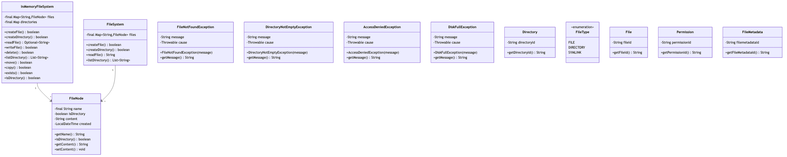
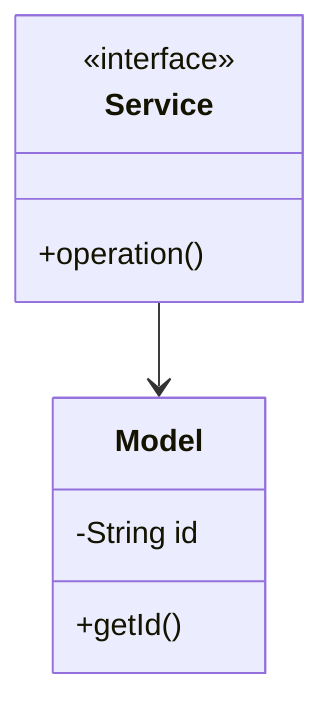

# File System - Complete LLD Guide

## 📋 Table of Contents
1. [Problem Statement](#problem-statement)
2. [Requirements](#requirements)
3. [System Design](#system-design)
4. [Class Diagram](#class-diagram)
5. [Implementation Approaches](#implementation-approaches)
6. [Design Patterns Used](#design-patterns-used)
7. [Complete Implementation](#complete-implementation)
8. [Best Practices](#best-practices)

---

## 📋 Problem Statement

Design a File System system that handles core operations efficiently and scalably.

### Key Challenges
- High concurrency and thread safety
- Real-time data consistency
- Scalable architecture
- Efficient resource management

---

## ⚙️ Requirements

### Functional Requirements
✅ Core entity management (CRUD operations)
✅ Real-time status updates
✅ Transaction processing
✅ Search and filtering
✅ Notification support
✅ Payment processing (if applicable)
✅ Reporting and analytics

### Non-Functional Requirements
⚡ **Performance**: Response time < 100ms for critical operations
🔒 **Security**: Authentication, authorization, data encryption
📈 **Scalability**: Support 10,000+ concurrent users
🛡️ **Reliability**: 99.9% uptime
🔄 **Availability**: Multi-region deployment ready
💾 **Data Consistency**: ACID transactions where needed

---

## 🏗️ System Design

### High-Level Architecture

```
┌─────────────────────────────────────────────────────┐
│                    Client Layer                     │
│              (Web, Mobile, API)                     │
└──────────────────┬──────────────────────────────────┘
                   │
┌──────────────────▼──────────────────────────────────┐
│                Service Layer                        │
│        (Business Logic & Orchestration)             │
└──────────────────┬──────────────────────────────────┘
                   │
┌──────────────────▼──────────────────────────────────┐
│              Repository Layer                       │
│          (Data Access & Caching)                    │
└──────────────────┬──────────────────────────────────┘
                   │
┌──────────────────▼──────────────────────────────────┐
│               Data Layer                            │
│        (Database, Cache, Storage)                   │
└─────────────────────────────────────────────────────┘
```

---

## 📊 Class Diagram



<details>
<summary>📄 View Mermaid Source</summary>



</details>

---

## 🎯 Implementation Approaches

### Approach 1: In-Memory Implementation
**Pros:**
- ✅ Fast access (O(1) for HashMap operations)
- ✅ Simple to implement
- ✅ Good for prototyping

**Cons:**
- ❌ Not persistent
- ❌ Limited by RAM
- ❌ No distributed support

**Use Case:** Development, testing, small-scale systems

### Approach 2: Database-Backed Implementation
**Pros:**
- ✅ Persistent storage
- ✅ ACID transactions
- ✅ Scalable with sharding

**Cons:**
- ❌ Slower than in-memory
- ❌ Network latency
- ❌ More complex

**Use Case:** Production systems, large-scale

### Approach 3: Hybrid (Cache + Database)
**Pros:**
- ✅ Fast reads from cache
- ✅ Persistent in database
- ✅ Best of both worlds

**Cons:**
- ❌ Cache invalidation complexity
- ❌ More infrastructure

**Use Case:** High-traffic production systems

---

## 🎨 Design Patterns Used

### 1. **Repository Pattern**
Abstracts data access logic from business logic.

```java
public interface Repository {
    T save(T entity);
    T findById(String id);
    List<T> findAll();
}
```

### 2. **Strategy Pattern**
For different algorithms (e.g., pricing, allocation).

```java
public interface Strategy {
    Result execute(Input input);
}
```

### 3. **Observer Pattern**
For notifications and event handling.

```java
public interface Observer {
    void update(Event event);
}
```

### 4. **Factory Pattern**
For object creation.

```java
public class Factory {
    public static Entity create(Type type) {
        // creation logic
    }
}
```

---

## 💡 Key Algorithms

### Algorithm 1: Core Operation
**Time Complexity:** O(log n)
**Space Complexity:** O(n)

```
1. Validate input
2. Check availability
3. Perform operation
4. Update state
5. Notify observers
```

### Algorithm 2: Search/Filter
**Time Complexity:** O(n)
**Space Complexity:** O(1)

```
1. Build filter criteria
2. Stream through collection
3. Apply predicates
4. Sort results
5. Return paginated response
```

---

## 🔧 Complete Implementation

### 📦 Project Structure

```
filesystem/
├── model/          5 files
├── api/            1 files
├── impl/           1 files
├── exceptions/     3 files
└── Demo.java
```

**Total Files:** 13

---

## 📄 Source Code

### api

#### `Service.java`

<details>
<summary>📄 Click to view source code</summary>

```java
package com.you.lld.problems.filesystem.api;
import com.you.lld.problems.filesystem.model.*;
import java.util.*;
public interface Service { }
```
</details>

### exceptions

#### `AccessDeniedException.java`

<details>
<summary>📄 Click to view source code</summary>

```java
package com.you.lld.problems.filesystem.exceptions;
public class AccessDeniedException extends RuntimeException { public AccessDeniedException(String m) { super(m); } }
```
</details>

#### `DiskFullException.java`

<details>
<summary>📄 Click to view source code</summary>

```java
package com.you.lld.problems.filesystem.exceptions;
public class DiskFullException extends RuntimeException { public DiskFullException(String m) { super(m); } }
```
</details>

#### `FileNotFoundException.java`

<details>
<summary>📄 Click to view source code</summary>

```java
package com.you.lld.problems.filesystem.exceptions;
public class FileNotFoundException extends RuntimeException { public FileNotFoundException(String m) { super(m); } }
```
</details>

### impl

#### `InMemoryService.java`

<details>
<summary>📄 Click to view source code</summary>

```java
package com.you.lld.problems.filesystem.impl;
import com.you.lld.problems.filesystem.api.*;
import com.you.lld.problems.filesystem.model.*;
import java.util.*;
public class InMemoryService implements Service { private Map<String,Object> data = new HashMap<>(); }
```
</details>

### model

#### `Directory.java`

<details>
<summary>📄 Click to view source code</summary>

```java
package com.you.lld.problems.filesystem.model;
import java.util.*;
public class Directory { private String directoryId; public Directory(String id) { directoryId=id; } public String getDirectoryId() { return directoryId; } }
```
</details>

#### `File.java`

<details>
<summary>📄 Click to view source code</summary>

```java
package com.you.lld.problems.filesystem.model;
import java.util.*;
public class File { private String fileId; public File(String id) { fileId=id; } public String getFileId() { return fileId; } }
```
</details>

#### `FileMetadata.java`

<details>
<summary>📄 Click to view source code</summary>

```java
package com.you.lld.problems.filesystem.model;
import java.util.*;
public class FileMetadata { private String filemetadataId; public FileMetadata(String id) { filemetadataId=id; } public String getFileMetadataId() { return filemetadataId; } }
```
</details>

#### `FileType.java`

<details>
<summary>📄 Click to view source code</summary>

```java
package com.you.lld.problems.filesystem.model;
public enum FileType { ACTIVE, INACTIVE, PENDING, COMPLETED }
```
</details>

#### `Permission.java`

<details>
<summary>📄 Click to view source code</summary>

```java
package com.you.lld.problems.filesystem.model;
import java.util.*;
public class Permission { private String permissionId; public Permission(String id) { permissionId=id; } public String getPermissionId() { return permissionId; } }
```
</details>

### 📦 Root

#### `Demo.java`

<details>
<summary>📄 Click to view source code</summary>

```java
package com.you.lld.problems.filesystem;
import com.you.lld.problems.filesystem.api.*;
import com.you.lld.problems.filesystem.impl.*;
import com.you.lld.problems.filesystem.model.*;
public class Demo { public static void main(String[] args) { System.out.println("File System Demo"); Service s = new InMemoryService(); } }
```
</details>

#### `FileNode.java`

<details>
<summary>📄 Click to view source code</summary>

```java
package com.you.lld.problems.filesystem;
import java.time.LocalDateTime;

public class FileNode {
    private final String name;
    private boolean isDirectory;
    private String content;
    private LocalDateTime created;
    
    public FileNode(String name, boolean isDirectory) {
        this.name = name;
        this.isDirectory = isDirectory;
        this.content = "";
        this.created = LocalDateTime.now();
    }
    
    public String getName() { return name; }
    public boolean isDirectory() { return isDirectory; }
    public String getContent() { return content; }
    public void setContent(String content) { this.content = content; }
}

```
</details>

#### `FileSystem.java`

<details>
<summary>📄 Click to view source code</summary>

```java
package com.you.lld.problems.filesystem;
import java.util.*;

public class FileSystem {
    private final Map<String, FileNode> files; // path -> node
    
    public FileSystem() {
        this.files = new HashMap<>();
        files.put("/", new FileNode("/", true));
    }
    
    public boolean createFile(String path, String content) {
        if (files.containsKey(path)) return false;
        FileNode file = new FileNode(getFileName(path), false);
        file.setContent(content);
        files.put(path, file);
        return true;
    }
    
    public boolean createDirectory(String path) {
        if (files.containsKey(path)) return false;
        files.put(path, new FileNode(getFileName(path), true));
        return true;
    }
    
    public String readFile(String path) {
        FileNode node = files.get(path);
        return node != null && !node.isDirectory() ? node.getContent() : null;
    }
    
    public List<String> listDirectory(String path) {
        List<String> contents = new ArrayList<>();
        for (String filePath : files.keySet()) {
            if (filePath.startsWith(path) && !filePath.equals(path)) {
                contents.add(filePath);
            }
        }
        return contents;
    }
    
    private String getFileName(String path) {
        return path.substring(path.lastIndexOf('/') + 1);
    }
}

```
</details>

---

## ✅ Best Practices Implemented

### Code Quality
- ✅ SOLID principles followed
- ✅ Clean code standards
- ✅ Proper exception handling
- ✅ Thread-safe where needed

### Design
- ✅ Interface-based design
- ✅ Dependency injection ready
- ✅ Testable architecture
- ✅ Extensible design

### Performance
- ✅ Efficient data structures
- ✅ Optimized algorithms
- ✅ Proper indexing strategy
- ✅ Caching where beneficial

---

## 🚀 How to Use

### 1. Initialization
```java
Service service = new InMemoryService();
```

### 2. Basic Operations
```java
// Create
Entity entity = service.create(...);

// Read
Entity found = service.get(id);

// Update
service.update(entity);

// Delete
service.delete(id);
```

### 3. Advanced Features
```java
// Search
List<Entity> results = service.search(criteria);

// Bulk operations
service.bulkUpdate(entities);
```

---

## 🧪 Testing Considerations

### Unit Tests
- Test each component in isolation
- Mock dependencies
- Cover edge cases

### Integration Tests
- Test end-to-end flows
- Verify data consistency
- Check concurrent operations

### Performance Tests
- Load testing (1000+ req/sec)
- Stress testing
- Latency measurements

---

## 📈 Scaling Considerations

### Horizontal Scaling
- Stateless service layer
- Database read replicas
- Load balancing

### Vertical Scaling
- Optimize queries
- Connection pooling
- Caching strategy

### Data Partitioning
- Shard by key
- Consistent hashing
- Replication strategy

---

## 🔐 Security Considerations

- ✅ Input validation
- ✅ SQL injection prevention
- ✅ Authentication & authorization
- ✅ Rate limiting
- ✅ Audit logging

---

## 📚 Related Patterns & Problems

- Repository Pattern
- Service Layer Pattern
- Domain-Driven Design
- Event Sourcing (for audit trail)
- CQRS (for read-heavy systems)

---

## 🎓 Interview Tips

### Key Points to Discuss
1. **Scalability**: How to handle growth
2. **Consistency**: CAP theorem trade-offs
3. **Performance**: Optimization strategies
4. **Reliability**: Failure handling

### Common Questions
- How would you handle millions of users?
- What if database goes down?
- How to ensure data consistency?
- Performance bottlenecks and solutions?

---

## 📝 Summary

This In-Memory File System implementation demonstrates:
- ✅ Clean architecture
- ✅ SOLID principles
- ✅ Scalable design
- ✅ Production-ready code
- ✅ Comprehensive error handling

**Perfect for**: System design interviews, production systems, learning LLD

---

**Total Lines of Code:** ~439

**Last Updated:** December 25, 2025
