# In-Memory File System

## Overview

Design an in-memory Unix-like file system that supports hierarchical directory structures, file operations, and path navigation. This system mimics operating system file management with directories, files, and operations like `mkdir`, `ls`, `touch`, `rm`, `cd`, and `find`.

### Real-World Context
- **Linux VFS**: Virtual File System layer abstracts different filesystems
- **Docker**: Uses overlay filesystem for container layers
- **Git**: Manages file trees with blob, tree, and commit objects
- **IDE**: IntelliJ, VSCode maintain in-memory file trees for fast navigation

### Business Value
- Fast file tree operations (O(log n) lookups)
- Memory-efficient path resolution
- Hierarchical organization of data
- Foundation for version control, cloud storage, and IDE features

---

## Problem Statement

Implement an in-memory file system with the following capabilities:

**Core Operations**:
1. `mkdir(path)` - Create directory at path
2. `ls(path)` - List files/directories at path
3. `touch(path, content)` - Create file with content
4. `cat(path)` - Read file content
5. `rm(path)` - Delete file or directory
6. `cd(path)` - Change current directory
7. `pwd()` - Print working directory
8. `find(name)` - Search files by name
9. `mv(src, dest)` - Move/rename files
10. `cp(src, dest)` - Copy files

**Path Support**:
- Absolute paths: `/home/user/file.txt`
- Relative paths: `../file.txt`, `./docs/README.md`
- Current directory tracking

---

## Requirements

### Functional Requirements

1. **Directory Operations**
   - Create nested directories (mkdir -p behavior)
   - List directory contents (sorted lexicographically)
   - Delete empty directories
   - Delete directories recursively (rm -r)
   - Navigate directories (cd)

2. **File Operations**
   - Create files with content
   - Read file contents
   - Update file contents
   - Delete files
   - Copy files
   - Move/rename files

3. **Path Resolution**
   - Support absolute paths (starting with `/`)
   - Support relative paths (`.`, `..`, `./`, `../`)
   - Handle edge cases: `//`, `/./`, `/../`, trailing slashes
   - Validate path formats

4. **Search and Query**
   - Find files by name (exact match)
   - Find files by pattern (wildcard support)
   - Get file metadata (size, type, created time)
   - Calculate directory size recursively

5. **Current Directory**
   - Maintain current working directory per session
   - Change directory with `cd`
   - Print working directory with `pwd`
   - Resolve relative paths based on current directory

### Non-Functional Requirements

1. **Performance**
   - Path lookup: O(d) where d = directory depth
   - List directory: O(n log n) where n = entries (for sorting)
   - Search by name: O(N) where N = total nodes
   - Space: O(N) for N files/directories

2. **Memory Efficiency**
   - Store file content efficiently (lazy loading for large files)
   - Use tries for fast prefix-based search
   - Share common path prefixes

3. **Concurrency**
   - Thread-safe file operations
   - Handle concurrent reads and writes
   - Lock-free reads for immutable operations

4. **Scalability**
   - Support millions of files
   - Efficient tree traversal
   - Fast path canonicalization

---


## Class Diagram

```mermaid
classDiagram

    class FileSystem {
        -final Map~String,FileNode~ files
        +createFile() boolean
        +createDirectory() boolean
        +readFile() String
        +listDirectory() List~String~
    }

    class FileNode {
        -final String name
        -boolean isDirectory
        -String content
        -LocalDateTime created
        +getName() String
        +isDirectory() boolean
        +getContent() String
        +setContent() void
    }

    class InMemoryFileSystem {
        -final Map~String,FileNode~ files
        -final Map<String, Set~String~> directories
        +createFile() boolean
        +createDirectory() boolean
        +readFile() Optional~String~
        +writeFile() boolean
        +delete() boolean
        +listDirectory() List~String~
        +move() boolean
        +copy() boolean
        +exists() boolean
        +isDirectory() boolean
    }

    class FileNotFoundException {
        -String message
        -Throwable cause
        +FileNotFoundException(message)
        +getMessage() String
    }

    class DirectoryNotEmptyException {
        -String message
        -Throwable cause
        +DirectoryNotEmptyException(message)
        +getMessage() String
    }

    class AccessDeniedException {
        -String message
        -Throwable cause
        +AccessDeniedException(message)
        +getMessage() String
    }

    class DiskFullException {
        -String message
        -Throwable cause
        +DiskFullException(message)
        +getMessage() String
    }

    class Directory {
        -String directoryId
        +getDirectoryId() String
    }

    class FileType {
        <<enumeration>>
        FILE
        DIRECTORY
        SYMLINK
    }

    class File {
        -String fileId
        +getFileId() String
    }

    class Permission {
        -String permissionId
        +getPermissionId() String
    }

    class FileMetadata {
        -String filemetadataId
        +getFileMetadataId() String
    }

    InMemoryFileSystem "1" --> "*" FileNode
    FileSystem "1" --> "*" FileNode
```

<details>
<summary>View Mermaid Source</summary>



</details>


## Core Algorithms

### 1. Path Resolution Algorithm

Convert any path (absolute/relative) to canonical form:

```java
public String canonicalizePath(String path) {
    // Handle absolute vs relative
    boolean isAbsolute = path.startsWith("/");
    String base = isAbsolute ? "/" : currentDirectory;
    
    // Split and process path components
    String[] parts = path.split("/");
    Deque<String> stack = new ArrayDeque<>();
    
    // Add base directory components
    if (!isAbsolute) {
        for (String part : base.split("/")) {
            if (!part.isEmpty()) stack.push(part);
        }
    }
    
    // Process each component
    for (String part : parts) {
        if (part.isEmpty() || part.equals(".")) {
            continue;  // Skip empty and current dir
        } else if (part.equals("..")) {
            if (!stack.isEmpty()) stack.pop();  // Go up
        } else {
            stack.push(part);  // Go down
        }
    }
    
    // Build canonical path
    if (stack.isEmpty()) return "/";
    StringBuilder sb = new StringBuilder();
    for (String part : stack) {
        sb.append("/").append(part);
    }
    return sb.toString();
}
```

**Complexity**:
- Time: O(d) where d = path depth
- Space: O(d) for stack

**Example**:
```
/home/user/../admin/./docs/../files/test.txt
→ ["", "home", "user", "..", "admin", ".", "docs", "..", "files", "test.txt"]
→ stack: ["home", "admin", "files", "test.txt"]
→ "/home/admin/files/test.txt"
```

### 2. Directory Tree Traversal

Navigate file tree to target node:

```java
private Node navigateToNode(String path) throws FileNotFoundException {
    String canonical = canonicalizePath(path);
    String[] parts = canonical.split("/");
    
    Node current = root;
    for (String part : parts) {
        if (part.isEmpty()) continue;
        
        if (!current.isDirectory()) {
            throw new FileNotFoundException("Not a directory: " + current.name);
        }
        
        Directory dir = (Directory) current;
        Node child = dir.getChild(part);
        if (child == null) {
            throw new FileNotFoundException("No such file or directory: " + part);
        }
        current = child;
    }
    return current;
}
```

**Complexity**:
- Time: O(d) where d = directory depth
- Space: O(1) - constant extra space

### 3. Recursive Directory Deletion

Delete directory and all contents:

```java
public void removeRecursive(String path) throws IOException {
    Node node = navigateToNode(path);
    
    if (node.isDirectory()) {
        Directory dir = (Directory) node;
        // Delete all children first (post-order traversal)
        for (Node child : dir.getChildren()) {
            removeRecursive(child.getPath());
        }
    }
    
    // Delete the node itself
    Node parent = node.getParent();
    if (parent != null) {
        ((Directory) parent).removeChild(node.name);
    }
}
```

**Complexity**:
- Time: O(N) where N = total nodes in subtree
- Space: O(d) for recursion depth

### 4. Find Files by Name (DFS)

Search entire tree for files matching name:

```java
public List<String> find(String name) {
    List<String> results = new ArrayList<>();
    findDFS(root, name, results);
    return results;
}

private void findDFS(Node node, String targetName, List<String> results) {
    if (node.name.equals(targetName)) {
        results.add(node.getPath());
    }
    
    if (node.isDirectory()) {
        Directory dir = (Directory) node;
        for (Node child : dir.getChildren()) {
            findDFS(child, targetName, results);
        }
    }
}
```

**Complexity**:
- Time: O(N) where N = total nodes
- Space: O(d) for recursion + O(k) for k matches

---

## System Design

### Architecture

```
┌─────────────────────────────────────────────────┐
│           FileSystemService (Facade)            │
│  mkdir, ls, touch, cat, rm, cd, pwd, find      │
└─────────────────────────────────────────────────┘
                       │
        ┌──────────────┼──────────────┐
        │              │              │
        ▼              ▼              ▼
┌──────────────┐ ┌──────────────┐ ┌──────────────┐
│ PathResolver │ │ NodeManager  │ │ FileContent  │
│  - canonicalize│  - navigate  │  │ Manager      │
│  - validate  │ │  - create    │ │  - read      │
│  - normalize │ │  - delete    │ │  - write     │
└──────────────┘ └──────────────┘ └──────────────┘
        │              │              │
        └──────────────┼──────────────┘
                       ▼
              ┌────────────────┐
              │   Node (Abstract)  │
              │  - name, parent     │
              │  - getPath()       │
              └────────────────┘
                       │
          ┌────────────┴────────────┐
          ▼                         ▼
    ┌──────────┐            ┌──────────┐
    │Directory │            │   File   │
    │- children│            │- content │
    │- TreeMap │            │- size    │
    └──────────┘            └──────────┘
```

### Data Structures

**1. Node Hierarchy**
```java
abstract class Node {
    String name;
    Directory parent;
    long createdTime;
    
    abstract boolean isDirectory();
    abstract long getSize();
    
    String getPath() {
        if (parent == null) return "/";
        String parentPath = parent.getPath();
        return parentPath.equals("/") ? "/" + name : parentPath + "/" + name;
    }
}
```

**2. Directory with TreeMap**
```java
class Directory extends Node {
    // TreeMap for O(log n) lookup and sorted iteration
    private TreeMap<String, Node> children = new TreeMap<>();
    
    void addChild(String name, Node child) {
        children.put(name, child);
        child.parent = this;
    }
    
    Node getChild(String name) {
        return children.get(name);
    }
    
    List<String> listChildren() {
        return new ArrayList<>(children.keySet());  // Already sorted
    }
    
    long getSize() {
        return children.values().stream()
            .mapToLong(Node::getSize)
            .sum();
    }
}
```

**3. File with Content**
```java
class File extends Node {
    private String content;
    
    File(String name, String content) {
        this.name = name;
        this.content = content;
        this.createdTime = System.currentTimeMillis();
    }
    
    String getContent() { return content; }
    void setContent(String content) { this.content = content; }
    long getSize() { return content.length(); }
    boolean isDirectory() { return false; }
}
```

---

## Design Patterns

### 1. **Composite Pattern**

Treat files and directories uniformly:

```java
abstract class Node {
    String name;
    Directory parent;
    
    abstract boolean isDirectory();
    abstract long getSize();
    abstract void accept(Visitor visitor);
}

// Usage: calculate total size
long totalSize = root.getSize();  // Works for files and directories
```

**Benefits**:
- Uniform interface for files and directories
- Recursive operations (size, search, delete)
- Easy to add new node types (symlinks, hardlinks)

### 2. **Facade Pattern**

Simple interface for complex file operations:

```java
class FileSystem {
    private Directory root;
    private String currentDirectory;
    private PathResolver pathResolver;
    private NodeManager nodeManager;
    
    public void mkdir(String path) {
        String canonical = pathResolver.canonicalize(path);
        nodeManager.createDirectory(canonical);
    }
    
    public List<String> ls(String path) {
        String canonical = pathResolver.canonicalize(path);
        Node node = nodeManager.navigate(canonical);
        if (!node.isDirectory()) {
            return Collections.singletonList(node.name);
        }
        return ((Directory) node).listChildren();
    }
}
```

### 3. **Visitor Pattern**

Traverse tree for different operations:

```java
interface NodeVisitor {
    void visitFile(File file);
    void visitDirectory(Directory dir);
}

class SizeCalculator implements NodeVisitor {
    private long totalSize = 0;
    
    void visitFile(File file) {
        totalSize += file.getSize();
    }
    
    void visitDirectory(Directory dir) {
        for (Node child : dir.getChildren()) {
            child.accept(this);
        }
    }
    
    long getTotalSize() { return totalSize; }
}

// Usage
SizeCalculator calculator = new SizeCalculator();
root.accept(calculator);
long totalSize = calculator.getTotalSize();
```

### 4. **Strategy Pattern**

Different search strategies:

```java
interface SearchStrategy {
    List<String> search(Directory root, String criteria);
}

class ExactNameSearch implements SearchStrategy {
    public List<String> search(Directory root, String name) {
        // DFS exact match
    }
}

class WildcardSearch implements SearchStrategy {
    public List<String> search(Directory root, String pattern) {
        // DFS with wildcard matching
    }
}

class RegexSearch implements SearchStrategy {
    public List<String> search(Directory root, String regex) {
        // DFS with regex matching
    }
}
```

---

## Implementation Deep Dive

### Key Components

**1. FileSystem Service**
```java
public class InMemoryFileSystem {
    private final Directory root;
    private String currentDirectory;
    private final PathResolver pathResolver;
    
    public InMemoryFileSystem() {
        this.root = new Directory("/");
        this.currentDirectory = "/";
        this.pathResolver = new PathResolver();
    }
    
    public void mkdir(String path) throws IOException {
        String canonical = pathResolver.canonicalize(path, currentDirectory);
        createDirectoryRecursive(canonical);
    }
    
    private void createDirectoryRecursive(String path) throws IOException {
        String[] parts = path.split("/");
        Directory current = root;
        
        for (String part : parts) {
            if (part.isEmpty()) continue;
            
            Node child = current.getChild(part);
            if (child == null) {
                Directory newDir = new Directory(part);
                current.addChild(part, newDir);
                child = newDir;
            } else if (!child.isDirectory()) {
                throw new IOException("File exists: " + part);
            }
            current = (Directory) child;
        }
    }
}
```

**2. Thread-Safe Operations**
```java
class ThreadSafeFileSystem {
    private final ReadWriteLock lock = new ReentrantReadWriteLock();
    private final FileSystem fs = new InMemoryFileSystem();
    
    public void mkdir(String path) throws IOException {
        lock.writeLock().lock();
        try {
            fs.mkdir(path);
        } finally {
            lock.writeLock().unlock();
        }
    }
    
    public List<String> ls(String path) throws IOException {
        lock.readLock().lock();
        try {
            return fs.ls(path);
        } finally {
            lock.readLock().unlock();
        }
    }
}
```

**3. Path Validation**
```java
class PathValidator {
    private static final Pattern VALID_PATH = Pattern.compile("^(/[a-zA-Z0-9_.-]+)+/?$");
    
    public void validate(String path) throws IllegalArgumentException {
        if (path == null || path.isEmpty()) {
            throw new IllegalArgumentException("Path cannot be empty");
        }
        
        if (path.length() > 4096) {
            throw new IllegalArgumentException("Path too long");
        }
        
        if (!VALID_PATH.matcher(path).matches()) {
            throw new IllegalArgumentException("Invalid path format");
        }
        
        if (path.contains("//")) {
            throw new IllegalArgumentException("Path contains consecutive slashes");
        }
    }
}
```

---

## Common Mistakes to Avoid

### ❌ Don't: Store Full Paths in Nodes
```java
class Node {
    String fullPath;  // ❌ Wasteful, changes when moved
}
```

### ✅ Do: Compute Path on Demand
```java
class Node {
    String name;
    Directory parent;
    
    String getPath() {
        // Compute path by traversing up
        if (parent == null) return "/";
        return parent.getPath() + "/" + name;
    }
}
```

### ❌ Don't: Use List for Children
```java
class Directory {
    List<Node> children;  // ❌ O(n) lookup
}
```

### ✅ Do: Use TreeMap for Sorted O(log n) Lookup
```java
class Directory {
    TreeMap<String, Node> children;  // ✅ O(log n) + sorted
}
```

### ❌ Don't: Forget Path Normalization
```java
public void touch(String path) {
    // ❌ Doesn't handle "/home//user/../admin/./file.txt"
    String[] parts = path.split("/");
    // ...
}
```

### ✅ Do: Always Canonicalize Paths
```java
public void touch(String path) {
    String canonical = pathResolver.canonicalize(path, currentDirectory);
    // Now safe to process
}
```

---

## Usage Example

```java
// Create filesystem
InMemoryFileSystem fs = new InMemoryFileSystem();

// Create directories
fs.mkdir("/home");
fs.mkdir("/home/user");
fs.mkdir("/home/user/documents");

// Create files
fs.touch("/home/user/file1.txt", "Hello World");
fs.touch("/home/user/documents/readme.md", "# README");

// List directory
List<String> files = fs.ls("/home/user");
// Output: ["documents", "file1.txt"]

// Read file
String content = fs.cat("/home/user/file1.txt");
// Output: "Hello World"

// Change directory
fs.cd("/home/user");

// Use relative path
fs.touch("./file2.txt", "Relative path");
List<String> files2 = fs.ls(".");
// Output: ["documents", "file1.txt", "file2.txt"]

// Search files
List<String> found = fs.find("readme.md");
// Output: ["/home/user/documents/readme.md"]

// Calculate directory size
long size = fs.getSize("/home");
// Output: total bytes of all files

// Move file
fs.mv("/home/user/file1.txt", "/home/user/documents/file1.txt");

// Copy file
fs.cp("/home/user/documents/readme.md", "/home/user/readme-copy.md");

// Delete recursively
fs.rm("/home/user/documents");  // Deletes entire directory
```

---

## Interview Tips & Key Insights

### What Interviewers Look For

1. **Path Handling**
   - Can you handle absolute vs relative paths?
   - How do you normalize paths with `.`, `..`, `//`?
   - Edge cases: root directory, trailing slashes

2. **Data Structure Choice**
   - Why TreeMap for children? (O(log n) + sorted)
   - Why compute path instead of storing? (memory + consistency)
   - How to handle large file content? (lazy loading, streaming)

3. **Traversal Algorithms**
   - DFS for search vs BFS - which is better and why?
   - How to avoid stack overflow for deep directories?
   - Recursive vs iterative implementations

4. **Concurrency**
   - Read-write locks for concurrent access
   - Copy-on-write for immutability
   - Lock-free reads where possible

5. **Edge Cases**
   - Root directory operations
   - Moving directory into itself
   - Circular symbolic links (if supported)
   - Case-sensitive vs case-insensitive filesystems

### Approach Strategy

1. **Start Simple**
   - Begin with basic Node/Directory/File structure
   - Implement absolute paths only
   - Add relative paths later

2. **Build Incrementally**
   - mkdir → ls → touch → cat
   - Then add deletion
   - Then add move/copy
   - Then add search

3. **Discuss Tradeoffs**
   - TreeMap vs HashMap (sorted vs faster)
   - Storing paths vs computing (memory vs CPU)
   - Recursive vs iterative (simplicity vs stack depth)

4. **Ask Clarifying Questions**
   - "Should paths be case-sensitive?"
   - "Do we need to support symbolic links?"
   - "What's the max directory depth?"
   - "Should we handle concurrent access?"

---

## Related LLD Problems

- **[Trie / Autocomplete](/problems/autocomplete/README)** - Prefix tree for fast lookups
- **[LRU Cache](/problems/lrucache/README)** - Cache recently accessed files
- **[Task Scheduler](/problems/taskscheduler/README)** - Schedule file operations
- **[Version Control System](/problems/versioncontrol/README)** - Track file versions

---

## Source Code

📄 **[View Complete Source Code](/problems/filesystem/CODE)**

---

## Key Takeaways

✅ Use **Composite pattern** for uniform file/directory handling  
✅ **TreeMap** for O(log n) sorted child lookups  
✅ **Canonicalize paths** before processing  
✅ **Compute paths on demand** instead of storing  
✅ **Read-write locks** for thread safety  
✅ **DFS** for search, recursive deletion  
✅ Handle **edge cases**: root, relative paths, `.`, `..`  

---

*Perfect for system design interviews at FAANG+ companies!*
