# Food Delivery System (Uber Eats / DoorDash)

## Overview
A comprehensive food delivery platform connecting customers, restaurants, and delivery partners. Supports restaurant discovery, menu browsing, order placement, real-time tracking, payment processing, and delivery partner assignment with intelligent routing algorithms.

**Difficulty:** Hard  
**Domain:** E-Commerce, Logistics  
**Interview Frequency:** Very High (Uber, DoorDash, Zomato, Swiggy, Grubhub)

## Requirements

### Functional Requirements
1. **Restaurant Management**
   - Register restaurants with location, cuisine, hours
   - Manage menu items (add, update, remove)
   - Track restaurant ratings and reviews
   - Handle restaurant availability status

2. **Customer Management**
   - User registration and authentication
   - Manage delivery addresses
   - Order history and favorites
   - Payment methods

3. **Order Management**
   - Browse restaurants by location/cuisine
   - Add items to cart
   - Place orders with special instructions
   - Track order status in real-time
   - Cancel orders (within time window)

4. **Delivery Partner Management**
   - Register delivery partners
   - Track partner location in real-time
   - Assign orders to nearest available partner
   - Track earnings and ratings

5. **Search & Discovery**
   - Search restaurants by name, cuisine, dish
   - Filter by ratings, delivery time, price
   - Sort by distance, popularity, rating
   - Show estimated delivery time

6. **Payment Processing**
   - Multiple payment methods (Card, Wallet, COD)
   - Calculate order total (subtotal + tax + delivery fee)
   - Apply discounts and promo codes
   - Process refunds for cancellations

### Non-Functional Requirements
1. **Scalability**
   - Support millions of users
   - Handle 100K+ concurrent orders
   - Horizontal scaling for peak hours

2. **Performance**
   - Restaurant search < 500ms
   - Order placement < 1s
   - Real-time location updates < 2s

3. **Availability**
   - 99.9% uptime
   - Graceful degradation
   - Fault-tolerant delivery assignment

4. **Consistency**
   - Accurate inventory tracking
   - No double-assignment of orders
   - Atomic payment processing

## Class Diagram

```mermaid
classDiagram

    class FoodDeliveryDemo {
        +main() static void
    }

    class InMemoryFoodDeliveryService {
        -final Map~String,Restaurant~ restaurants
        -final Map~String,Customer~ customers
        -final Map~String,Order~ orders
        -final Map~String,DeliveryPartner~ deliveryPartners
        +registerRestaurant() Restaurant
        +getRestaurant() Restaurant
        +searchRestaurants() List~Restaurant~
        +updateRestaurantStatus() void
        +addMenuItem() void
        +removeMenuItem() void
        +updateMenuItemAvailability() void
        +registerCustomer() Customer
        +getCustomer() Customer
        +placeOrder() Order
    }

    class RestaurantClosedException {
        -String message
        -Throwable cause
        +RestaurantClosedException(message)
        +getMessage() String
    }

    class InvalidOperationException {
        -String message
        -Throwable cause
        +InvalidOperationException(message)
        +getMessage() String
    }

    class RestaurantNotFoundException {
        -String message
        -Throwable cause
        +RestaurantNotFoundException(message)
        +getMessage() String
    }

    class PartnerNotAvailableException {
        -String message
        -Throwable cause
        +PartnerNotAvailableException(message)
        +getMessage() String
    }

    class CustomerNotFoundException {
        -String message
        -Throwable cause
        +CustomerNotFoundException(message)
        +getMessage() String
    }

    class OrderNotFoundException {
        -String message
        -Throwable cause
        +OrderNotFoundException(message)
        +getMessage() String
    }

    class PartnerNotFoundException {
        -String message
        -Throwable cause
        +PartnerNotFoundException(message)
        +getMessage() String
    }

    class Order {
        -final String orderId
        -final String customerId
        -final String restaurantId
        -List~OrderItem~ items
        -OrderStatus status
        -String deliveryPartnerId
        -Address deliveryAddress
        -double subtotal
        -double deliveryFee
        -double tax
        +getOrderId() String
        +getCustomerId() String
        +getRestaurantId() String
        +getItems() List~OrderItem~
        +addItem() void
        +getStatus() OrderStatus
        +setStatus() void
        +getDeliveryPartnerId() String
        +setDeliveryPartnerId() void
        +getDeliveryAddress() Address
    }

    class OrderItem {
        -final String menuItemId
        -String itemName
        -double price
        -int quantity
        -String customization
        +getMenuItemId() String
        +getItemName() String
        +getPrice() double
        +getQuantity() int
        +setQuantity() void
        +getCustomization() String
        +setCustomization() void
        +getTotal() double
    }

    class Customer {
        -final String customerId
        -String name
        -String email
        -String phone
        -List~Address~ addresses
        -List~String~ orderHistory
        +getCustomerId() String
        +getName() String
        +setName() void
        +getEmail() String
        +getPhone() String
        +setPhone() void
        +getAddresses() List~Address~
        +addAddress() void
        +getOrderHistory() List~String~
        +addOrderToHistory() void
    }

    class OrderStatus
    <<enumeration>> OrderStatus

    class Address {
        -String street
        -String city
        -String state
        -String zipCode
        -double latitude
        -double longitude
        +getStreet() String
        +getCity() String
        +getState() String
        +getZipCode() String
        +getLatitude() double
        +setLatitude() void
        +getLongitude() double
        +setLongitude() void
        +distanceTo() double
    }

    class MenuItem {
        -final String itemId
        -String name
        -String description
        -double price
        -boolean available
        -String category
        -boolean vegetarian
        +getItemId() String
        +getName() String
        +setName() void
        +getDescription() String
        +setDescription() void
        +getPrice() double
        +setPrice() void
        +isAvailable() boolean
        +setAvailable() void
        +getCategory() String
    }

    class RestaurantStatus
    <<enumeration>> RestaurantStatus

    class Restaurant {
        -final String restaurantId
        -String name
        -Address address
        -List~MenuItem~ menu
        -RestaurantStatus status
        -double rating
        -List~String~ cuisineTypes
        -String phoneNumber
        -Map~String,Integer~ preparationTimes
        +getRestaurantId() String
        +getName() String
        +setName() void
        +getAddress() Address
        +getMenu() List~MenuItem~
        +addMenuItem() void
        +removeMenuItem() void
        +getStatus() RestaurantStatus
        +setStatus() void
        +getRating() double
    }

    class DeliveryPartner {
        -final String partnerId
        -String name
        -String phone
        -String vehicleNumber
        -PartnerStatus status
        -Address currentLocation
        -String currentOrderId
        +getPartnerId() String
        +getName() String
        +getPhone() String
        +getVehicleNumber() String
        +setVehicleNumber() void
        +getStatus() PartnerStatus
        +setStatus() void
        +getCurrentLocation() Address
        +setCurrentLocation() void
        +getCurrentOrderId() String
    }

    class PartnerStatus
    <<enumeration>> PartnerStatus

    class FoodDeliveryService
    <<interface>> FoodDeliveryService

    DeliveryPartner --> PartnerStatus
    DeliveryPartner --> Address
    Order --> Customer
    Order --> Restaurant
    Order "1" --> "*" OrderItem
    Order --> OrderStatus
    Order --> DeliveryPartner
    Order --> Address
    InMemoryFoodDeliveryService "1" --> "*" Restaurant
    InMemoryFoodDeliveryService "1" --> "*" Customer
    InMemoryFoodDeliveryService "1" --> "*" Order
    InMemoryFoodDeliveryService "1" --> "*" DeliveryPartner
    InMemoryFoodDeliveryService --> Address
    InMemoryFoodDeliveryService --> RestaurantStatus
    InMemoryFoodDeliveryService --> MenuItem
    InMemoryFoodDeliveryService --> OrderItem
    InMemoryFoodDeliveryService --> OrderStatus
    Restaurant --> Address
    Restaurant "1" --> "*" MenuItem
    Restaurant --> RestaurantStatus
    OrderItem --> MenuItem
    Customer "1" --> "*" Address
```

<details>
<summary>View Mermaid Source</summary>



</details>


## Core Components

### 1. Order Lifecycle
```
PLACED → CONFIRMED → PREPARING → READY → 
OUT_FOR_DELIVERY → DELIVERED

Alternative flows:
- PLACED → CANCELLED (by customer/restaurant)
- PREPARING → CANCELLED (within time window)
```

### 2. Key Algorithms

#### Restaurant Search (Geospatial)
```java
public List<Restaurant> searchRestaurants(String query, Address location, double radiusKm) {
    return restaurants.values().stream()
        .filter(r -> r.isOpen())
        .filter(r -> matchesQuery(r, query))
        .filter(r -> r.getAddress().distanceTo(location) <= radiusKm)
        .sorted((a, b) -> {
            // Sort by: 1) Rating, 2) Distance
            int ratingCmp = Double.compare(b.getRating(), a.getRating());
            if (ratingCmp != 0) return ratingCmp;
            return Double.compare(
                a.getAddress().distanceTo(location),
                b.getAddress().distanceTo(location)
            );
        })
        .collect(Collectors.toList());
}
```

**Time Complexity:** O(N log N) where N = restaurants  
**Space Complexity:** O(N)

**Optimization:** Use geospatial index (R-tree, Quadtree, or PostGIS)

#### Distance Calculation (Haversine Formula)
```java
public double distanceTo(Address other) {
    double R = 6371; // Earth radius in km
    
    double lat1Rad = Math.toRadians(this.latitude);
    double lat2Rad = Math.toRadians(other.latitude);
    double deltaLat = Math.toRadians(other.latitude - this.latitude);
    double deltaLon = Math.toRadians(other.longitude - this.longitude);
    
    double a = Math.sin(deltaLat / 2) * Math.sin(deltaLat / 2) +
               Math.cos(lat1Rad) * Math.cos(lat2Rad) *
               Math.sin(deltaLon / 2) * Math.sin(deltaLon / 2);
    
    double c = 2 * Math.atan2(Math.sqrt(a), Math.sqrt(1 - a));
    
    return R * c; // Distance in km
}
```

**Time Complexity:** O(1)

#### Delivery Partner Assignment (Nearest Available)
```java
public DeliveryPartner assignNearestPartner(Order order) {
    Address restaurantLocation = getRestaurant(order.getRestaurantId()).getAddress();
    
    return deliveryPartners.values().stream()
        .filter(p -> p.isAvailable())
        .min(Comparator.comparingDouble(p -> 
            p.getCurrentLocation().distanceTo(restaurantLocation)
        ))
        .orElseThrow(() -> new NoPartnerAvailableException());
}
```

**Time Complexity:** O(P) where P = delivery partners  
**Space Complexity:** O(1)

**Optimization:** Use geospatial index + Redis for real-time locations

#### Order Total Calculation
```java
public void calculateAmounts() {
    // Subtotal
    this.subtotal = items.stream()
        .mapToDouble(item -> item.getPrice() * item.getQuantity())
        .sum();
    
    // Delivery fee (distance-based)
    double distance = restaurant.getAddress().distanceTo(deliveryAddress);
    this.deliveryFee = calculateDeliveryFee(distance);
    
    // Tax (10%)
    this.tax = subtotal * 0.10;
    
    // Total
    this.totalAmount = subtotal + deliveryFee + tax;
}

private double calculateDeliveryFee(double distanceKm) {
    if (distanceKm < 2) return 2.0;
    if (distanceKm < 5) return 3.0;
    if (distanceKm < 10) return 5.0;
    return 5.0 + (distanceKm - 10) * 0.5;
}
```

### 3. Real-Time Tracking

#### Location Updates
```java
public void updatePartnerLocation(String partnerId, Address location) {
    DeliveryPartner partner = deliveryPartners.get(partnerId);
    partner.setCurrentLocation(location);
    
    // Notify customers tracking this partner's orders
    List<Order> activeOrders = getPartnerActiveOrders(partnerId);
    for (Order order : activeOrders) {
        notifyCustomer(order.getCustomerId(), 
            "Your order is " + estimateArrival(location, order.getDeliveryAddress()) + 
            " minutes away");
    }
}
```

## Design Patterns

### 1. Strategy Pattern
**Purpose:** Different delivery fee strategies

```java
interface DeliveryFeeStrategy {
    double calculate(double distance, Order order);
}

class DistanceBasedFee implements DeliveryFeeStrategy {
    public double calculate(double distance, Order order) {
        return 2.0 + distance * 0.5;
    }
}

class SurgeP ricingFee implements DeliveryFeeStrategy {
    public double calculate(double distance, Order order) {
        double baseFee = 2.0 + distance * 0.5;
        if (isPeakHour()) {
            return baseFee * 1.5; // 50% surge
        }
        return baseFee;
    }
}
```

### 2. Observer Pattern
**Purpose:** Real-time order status notifications

```java
interface OrderObserver {
    void onStatusChange(Order order, OrderStatus newStatus);
}

class CustomerNotifier implements OrderObserver {
    public void onStatusChange(Order order, OrderStatus newStatus) {
        String message = switch (newStatus) {
            case CONFIRMED -> "Your order has been confirmed!";
            case PREPARING -> "Restaurant is preparing your order";
            case OUT_FOR_DELIVERY -> "Your order is on the way!";
            case DELIVERED -> "Order delivered. Enjoy your meal!";
            default -> "Order status: " + newStatus;
        };
        sendNotification(order.getCustomerId(), message);
    }
}
```

### 3. State Pattern
**Purpose:** Order state transitions

```java
interface OrderState {
    void confirm();
    void cancel();
    void markReady();
    void assignPartner();
    void deliver();
}

class PlacedState implements OrderState {
    public void confirm() { /* transition to CONFIRMED */ }
    public void cancel() { /* transition to CANCELLED */ }
    public void markReady() { throw new IllegalStateException(); }
}

class ConfirmedState implements OrderState {
    public void markReady() { /* transition to READY */ }
    public void cancel() { /* transition to CANCELLED */ }
}
```

## Source Code

📄 **[View Complete Source Code](/problems/fooddelivery/CODE)**

**Key Files:**
- [`FoodDeliveryService.java`](/problems/fooddelivery/CODE#fooddeliveryservicejava) - Main interface (34 methods)
- [`InMemoryFoodDeliveryService.java`](/problems/fooddelivery/CODE#inmemoryfooddeliveryservicejava) - Implementation
- [`Order.java`](/problems/fooddelivery/CODE#orderjava) - Order model (49 lines)
- [`Restaurant.java`](/problems/fooddelivery/CODE#restaurantjava) - Restaurant model (46 lines)
- [`DeliveryPartner.java`](/problems/fooddelivery/CODE#deliverypartnerjava) - Partner model (30 lines)

**Total Lines of Code:** ~600 lines

## Usage Example

```java
FoodDeliveryService service = new InMemoryFoodDeliveryService();

// Register restaurant
Address restaurantAddr = new Address("123 Main St", "NYC", "NY", "10001");
restaurantAddr.setLatitude(40.7128);
restaurantAddr.setLongitude(-74.0060);
Restaurant restaurant = service.registerRestaurant("Pizza Palace", restaurantAddr);

// Add menu items
MenuItem pizza = new MenuItem("ITEM001", "Margherita Pizza", 12.99);
service.addMenuItem(restaurant.getRestaurantId(), pizza);

// Register customer
Customer customer = service.registerCustomer("John Doe", "john@example.com", "555-0100");
Address deliveryAddr = new Address("456 Park Ave", "NYC", "NY", "10002");

// Place order
List<OrderItem> items = Arrays.asList(
    new OrderItem("ITEM001", "Margherita Pizza", 12.99, 2)
);
Order order = service.placeOrder(
    customer.getCustomerId(),
    restaurant.getRestaurantId(),
    items,
    deliveryAddr
);

// Register and assign delivery partner
DeliveryPartner partner = service.registerDeliveryPartner("Mike Wilson", "555-0200");
service.assignDeliveryPartner(order.getOrderId(), partner.getPartnerId());

// Update order status
service.updateOrderStatus(order.getOrderId(), OrderStatus.PREPARING);
service.updateOrderStatus(order.getOrderId(), OrderStatus.OUT_FOR_DELIVERY);
service.updateOrderStatus(order.getOrderId(), OrderStatus.DELIVERED);
```

## Common Interview Questions

### System Design Questions

1. **How do you handle peak hour traffic (10x normal load)?**
   - Horizontal scaling with load balancers
   - Database read replicas
   - Redis caching for restaurant/menu data
   - Message queue (Kafka) for async processing
   - CDN for static assets

2. **How do you assign delivery partners efficiently?**
   - Geospatial indexing (R-tree, Quadtree)
   - Real-time location tracking (Redis Geospatial)
   - Predictive assignment (ML for ETA)
   - Batch assignment for multiple orders

3. **How do you ensure data consistency across services?**
   - Saga pattern for distributed transactions
   - Event sourcing for audit trail
   - Idempotency keys for payments
   - Two-phase commit for critical operations

4. **How do you handle restaurant going offline mid-order?**
   - Notify customer immediately
   - Offer alternatives or cancellation
   - Automatic refund processing
   - Partner compensation

### Coding Questions

1. **Find restaurants within 5km radius**
   ```java
   public List<Restaurant> findNearby(Address location, double radiusKm) {
       return restaurants.stream()
           .filter(r -> r.getAddress().distanceTo(location) <= radiusKm)
           .collect(Collectors.toList());
   }
   ```

2. **Calculate estimated delivery time**
   ```java
   public int estimateDeliveryTime(Restaurant r, Address delivery) {
       double distance = r.getAddress().distanceTo(delivery);
       int prepTime = r.getAveragePrepTime(); // minutes
       int travelTime = (int) (distance / 0.5); // 30 km/h avg speed
       return prepTime + travelTime;
   }
   ```

3. **Apply discount code**
   ```java
   public double applyDiscount(Order order, String code) {
       Discount discount = discounts.get(code);
       if (discount == null || discount.isExpired()) {
           return order.getTotalAmount();
       }
       return order.getTotalAmount() * (1 - discount.getPercentage() / 100.0);
   }
   ```

### Design Pattern Questions
1. **Which pattern for delivery fee calculation?** → Strategy Pattern
2. **Which pattern for order notifications?** → Observer Pattern
3. **Which pattern for order state management?** → State Pattern

## Trade-offs & Design Decisions

### 1. Real-Time Location Tracking
**WebSocket:** Bidirectional, high resource usage  
**Polling:** Simple, higher latency

**Decision:** WebSocket for active deliveries, polling for tracking page

### 2. Partner Assignment
**Nearest:** Fast, may not be optimal  
**Optimal (Hungarian Algorithm):** Better, computationally expensive

**Decision:** Nearest for real-time, batch optimization every 5 min

### 3. Database Choice
**SQL:** ACID, complex queries  
**NoSQL:** Scalable, eventual consistency

**Decision:** SQL for orders/payments, NoSQL for menus/tracking

## Key Takeaways

### What Interviewers Look For
1. ✅ **Geospatial algorithms** for restaurant search
2. ✅ **Real-time tracking** architecture
3. ✅ **Partner assignment** optimization
4. ✅ **Payment processing** with refunds
5. ✅ **State management** for orders
6. ✅ **Scalability** for peak loads

### Common Mistakes to Avoid
1. ❌ Linear search for nearby restaurants (use geospatial index)
2. ❌ No handling for partner unavailability
3. ❌ Forgetting order cancellation time windows
4. ❌ Not calculating delivery fees dynamically
5. ❌ No surge pricing for peak hours
6. ❌ Missing refund processing

### Production-Ready Checklist
- [x] Restaurant and menu management
- [x] Order placement and tracking
- [x] Delivery partner assignment
- [x] Payment calculation
- [x] Geospatial search
- [ ] Real-time WebSocket tracking
- [ ] Payment gateway integration
- [ ] Surge pricing
- [ ] ML-based ETA prediction
- [ ] Fraud detection

---

## Related Problems
- 🚗 **Ride Hailing (Uber)** - Similar partner assignment
- 📦 **Package Delivery** - Route optimization
- 🏪 **E-Commerce** - Cart and checkout
- 🗺️ **Maps/Navigation** - Geospatial algorithms

## References
- Haversine Formula: Great-circle distance calculation
- Geospatial Indexing: R-tree, Quadtree
- Uber Engineering Blog: Real-time dispatch
- DoorDash Engineering: Order assignment optimization

---

*This implementation demonstrates production-ready food delivery system with geospatial search, real-time tracking, and intelligent partner assignment. Perfect for marketplace interviews at Uber, DoorDash, Zomato, and logistics companies.*

## Source Code

📄 **[View Complete Source Code](/problems/fooddelivery/CODE)**

---

## Advanced Features

### 1. ML-Based ETA Prediction

Predict accurate delivery times using machine learning:

```java
public class ETAPredictor {
    private MLModel etaModel;
    
    public Duration predictETA(Order order, DeliveryPartner partner) {
        // Features for ML model
        Map<String, Double> features = Map.of(
            "distance_km", calculateDistance(order, partner),
            "traffic_level", getCurrentTrafficLevel(),
            "hour_of_day", (double) LocalTime.now().getHour(),
            "day_of_week", (double) LocalDate.now().getDayOfWeek().getValue(),
            "restaurant_prep_time", order.restaurant.getAvgPrepTime(),
            "partner_rating", partner.getRating(),
            "weather_condition", getWeatherScore()
        );
        
        // Predict ETA in minutes
        double etaMinutes = etaModel.predict(features);
        return Duration.ofMinutes((long) etaMinutes);
    }
    
    private double getCurrentTrafficLevel() {
        // Real-time traffic data from Google Maps API
        return trafficService.getTrafficDensity(location);
    }
}
```

**Training Data**:
- Historical delivery times
- Distance, traffic, time of day
- Restaurant prep times
- Partner performance

**Model**: XGBoost or Random Forest for regression

### 2. Surge Pricing Algorithm

Dynamic pricing based on demand/supply:

```java
public class SurgePricing {
    public BigDecimal calculateDeliveryFee(Order order) {
        BigDecimal baseFee = calculateBaseFee(order.distance);
        double surgeMultiplier = calculateSurgeMultiplier(order);
        
        return baseFee.multiply(BigDecimal.valueOf(surgeMultiplier));
    }
    
    private double calculateSurgeMultiplier(Order order) {
        int activeOrders = getActiveOrderCount(order.area);
        int availablePartners = getAvailablePartnerCount(order.area);
        
        double demandSupplyRatio = (double) activeOrders / availablePartners;
        
        if (demandSupplyRatio < 1.0) {
            return 1.0;  // Normal pricing
        } else if (demandSupplyRatio < 2.0) {
            return 1.25; // 25% surge
        } else if (demandSupplyRatio < 3.0) {
            return 1.5;  // 50% surge
        } else {
            return 2.0;  // 100% surge (max)
        }
    }
}
```

**Factors Affecting Surge**:
- Peak hours (lunch 12-2 PM, dinner 7-9 PM)
- Weather (rain, snow increases demand)
- Special events (sports, concerts)
- Partner availability
- Historical demand patterns

### 3. Smart Order Batching

Combine multiple orders for same partner:

```java
public class OrderBatching {
    public List<Order> findBatchableOrders(Order order1, DeliveryPartner partner) {
        List<Order> batch = new ArrayList<>();
        batch.add(order1);
        
        // Find nearby orders within 5 minutes pickup window
        List<Order> nearbyOrders = findNearbyOrders(
            order1.restaurant.location,
            5.0,  // 5 km radius
            Duration.ofMinutes(5)
        );
        
        for (Order order2 : nearbyOrders) {
            if (canBatch(order1, order2)) {
                batch.add(order2);
                if (batch.size() >= 3) break;  // Max 3 orders per batch
            }
        }
        
        return batch;
    }
    
    private boolean canBatch(Order o1, Order o2) {
        // Check if batching doesn't delay either order significantly
        double extraDistance = calculateExtraDistance(o1, o2);
        double extraTime = extraDistance / PARTNER_AVG_SPEED;
        
        return extraTime < 10.0;  // Max 10 minutes extra
    }
}
```

**Benefits**:
- Higher partner earnings
- Lower delivery fees for customers
- Better resource utilization

### 4. Fraud Detection System

Detect and prevent fraudulent activities:

```java
public class FraudDetection {
    public FraudScore analyzeFraud(Order order, Customer customer) {
        double score = 0.0;
        List<String> reasons = new ArrayList<>();
        
        // 1. Multiple failed payments
        if (customer.getFailedPaymentCount() > 3) {
            score += 30;
            reasons.add("Multiple failed payments");
        }
        
        // 2. Frequent order cancellations
        double cancellationRate = customer.getCancellationRate();
        if (cancellationRate > 0.3) {  // >30% cancellations
            score += 25;
            reasons.add("High cancellation rate");
        }
        
        // 3. Suspicious address changes
        if (customer.getRecentAddressChangeCount() > 5) {
            score += 20;
            reasons.add("Frequent address changes");
        }
        
        // 4. Promo code abuse
        if (customer.getPromoUsageCount() > 10) {
            score += 15;
            reasons.add("Potential promo abuse");
        }
        
        // 5. GPS spoofing detection
        if (isGPSSpoofing(order.deliveryAddress)) {
            score += 40;
            reasons.add("GPS spoofing detected");
        }
        
        return new FraudScore(score, reasons);
    }
    
    private boolean isGPSSpoofing(Address address) {
        // Check if GPS coordinates match address
        return !validateGPSCoordinates(address);
    }
}
```

**Actions Based on Score**:
- 0-30: Allow order
- 31-60: Require verification (OTP, phone call)
- 61-80: Require prepayment only
- 81-100: Block order

### 5. Restaurant Rating & Reviews

```java
public class RatingService {
    public void submitRating(String orderId, Rating rating) {
        Order order = orderService.getOrder(orderId);
        
        // Calculate new restaurant rating (weighted average)
        Restaurant restaurant = order.restaurant;
        double currentRating = restaurant.getRating();
        int currentCount = restaurant.getRatingCount();
        
        double newRating = ((currentRating * currentCount) + rating.stars) 
                          / (currentCount + 1);
        
        restaurant.setRating(newRating);
        restaurant.setRatingCount(currentCount + 1);
        
        // Check for review moderation
        if (containsProfanity(rating.review)) {
            flagForModeration(rating);
        }
        
        // Trigger alerts for low ratings
        if (rating.stars <= 2) {
            alertRestaurantOwner(restaurant, rating);
            offerCompensation(order.customer);
        }
    }
}
```

### 6. Loyalty & Rewards Program

```java
public class LoyaltyProgram {
    private static final int POINTS_PER_DOLLAR = 10;
    
    public void awardPoints(Order order) {
        int points = (int) (order.totalAmount * POINTS_PER_DOLLAR);
        
        // Bonus points for milestones
        int orderCount = customer.getOrderCount();
        if (orderCount % 10 == 0) {
            points *= 2;  // Double points on every 10th order
        }
        
        customer.addLoyaltyPoints(points);
        
        // Check tier upgrade
        checkTierUpgrade(customer);
    }
    
    private void checkTierUpgrade(Customer customer) {
        int totalPoints = customer.getTotalLifetimePoints();
        
        if (totalPoints >= 10000) {
            customer.setTier(CustomerTier.PLATINUM);
            // Benefits: Free delivery, priority support
        } else if (totalPoints >= 5000) {
            customer.setTier(CustomerTier.GOLD);
            // Benefits: 50% off delivery
        } else if (totalPoints >= 1000) {
            customer.setTier(CustomerTier.SILVER);
            // Benefits: 25% off delivery
        }
    }
}
```

---

## System Architecture Diagram

```
                    ┌─────────────────┐
                    │   API Gateway   │
                    └────────┬────────┘
                             │
         ┌───────────────────┼───────────────────┐
         │                   │                   │
         ▼                   ▼                   ▼
┌────────────────┐  ┌────────────────┐  ┌────────────────┐
│ Order Service  │  │Restaurant Svc  │  │ Partner Service│
│  - Create      │  │  - Menu mgmt   │  │  - Assignment  │
│  - Track       │  │  - Availability│  │  - Tracking    │
│  - Cancel      │  │  - Ratings     │  │  - Earnings    │
└────────┬───────┘  └────────┬───────┘  └────────┬───────┘
         │                   │                   │
         └───────────────────┼───────────────────┘
                             │
                    ┌────────▼────────┐
                    │  Message Queue  │
                    │  (Kafka/RabbitMQ)│
                    └────────┬────────┘
                             │
         ┌───────────────────┼───────────────────┐
         │                   │                   │
         ▼                   ▼                   ▼
┌────────────────┐  ┌────────────────┐  ┌────────────────┐
│Notification Svc│  │  Payment Svc   │  │  Analytics Svc │
│  - Push        │  │  - Charge      │  │  - Metrics     │
│  - SMS         │  │  - Refund      │  │  - Reporting   │
│  - Email       │  │  - Escrow      │  │  - ML Models   │
└────────────────┘  └────────────────┘  └────────────────┘
```

---

## Interview Deep Dive Questions

**Q1: How would you handle a scenario where a partner picks up order but doesn't deliver?**

**Answer**:
```java
public class OrderMonitoring {
    public void monitorDelivery(Order order) {
        // Start timer when partner picks up order
        ScheduledExecutorService scheduler = Executors.newScheduledThreadPool(1);
        
        scheduler.schedule(() -> {
            if (order.status == OrderStatus.PICKED_UP) {
                // Partner hasn't delivered in expected time
                alertSupport(order);
                
                // Automatic actions
                contactPartner(order.partnerId);
                notifyCustomer(order.customerId, "Delay in delivery");
                
                // Offer compensation
                offerRefund(order, RefundType.PARTIAL);
            }
        }, order.expectedDeliveryTime.plusMinutes(15).toEpochMilli(), 
           TimeUnit.MILLISECONDS);
    }
}
```

**Q2: How do you optimize restaurant search for 1M concurrent users?**

**Answer**:
1. **Geospatial caching**: Cache popular areas with Redis Geo
2. **Read replicas**: Multiple DB replicas for search queries
3. **CDN**: Cache static restaurant data
4. **Elasticsearch**: Fast full-text search with geospatial filters

```java
// Redis Geo for hot areas
jedis.geoadd("restaurants", longitude, latitude, restaurantId);
List<GeoRadiusResponse> nearby = jedis.georadius(
    "restaurants", userLon, userLat, 5, GeoUnit.KM
);
```

---

## Related Problems
- 🚗 **[Ride Hailing](/problems/ridehailing/README)** - Similar partner assignment
- 📦 **Package Delivery** - Route optimization
- 🏪 **[E-Commerce](/problems/amazon/README)** - Cart and checkout
- 🗺️ **Maps/Navigation** - Geospatial algorithms
- 💳 **[Payment Gateway](/problems/paymentgateway/README)** - Payment processing

---

*Master these concepts for food delivery interviews at Uber Eats, DoorDash, Zomato, Swiggy!*
