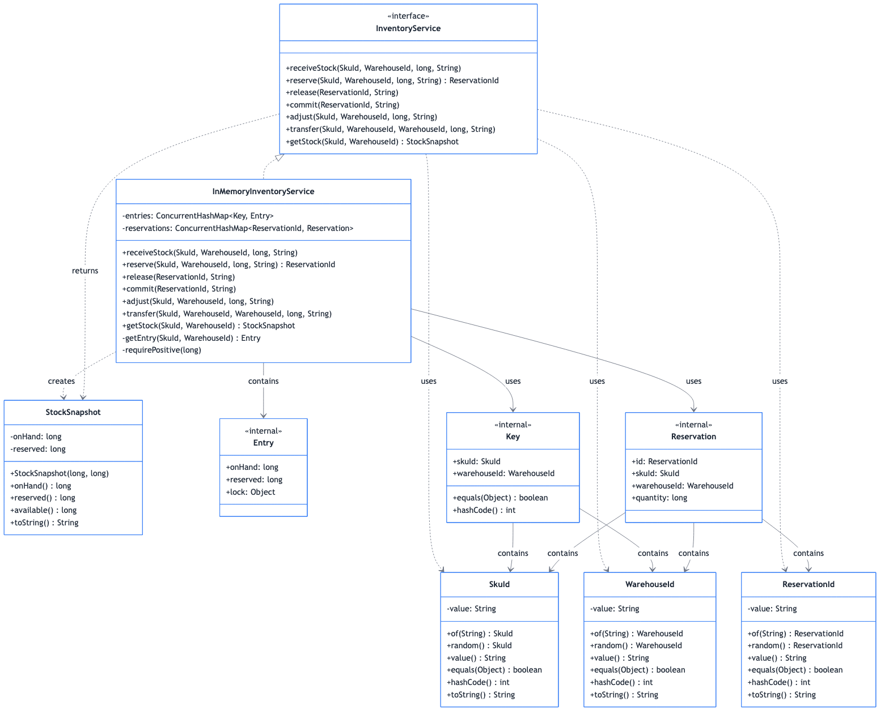

# Inventory Management System

## Overview
A comprehensive inventory management system for tracking product stock levels, warehouse locations, reservations, replenishments, and stock transfers. Implements real-time inventory tracking, low-stock alerts, FIFO/LIFO strategies, and multi-warehouse support for e-commerce and retail operations.

**Difficulty:** Medium-Hard  
**Domain:** Supply Chain, E-Commerce  
**Interview Frequency:** High (Amazon, Walmart, Shopify, logistics companies)

## Requirements

### Functional Requirements
1. **Product Management**
   - Add/update/delete products
   - Product variants (size, color)
   - SKU (Stock Keeping Unit) tracking
   - Product categories
   - Barcode/QR code support

2. **Stock Management**
   - Track available quantity
   - Reserve stock (cart/order)
   - Commit reservation (purchase)
   - Release reservation (cancel)
   - Adjust stock (damage, theft)

3. **Warehouse Management**
   - Multiple warehouse support
   - Stock per warehouse
   - Transfer between warehouses
   - Warehouse priority/routing

4. **Stock Operations**
   - Restock (receive inventory)
   - Stock adjustment
   - Stock audit/reconciliation
   - Batch tracking
   - Expiry date tracking (for perishables)

5. **Reporting & Alerts**
   - Current stock levels
   - Low stock alerts
   - Out of stock notifications
   - Stock movement history
   - Inventory valuation

6. **Reservation System**
   - Temporary holds (cart items)
   - Time-based expiration
   - Automatic release
   - Prevent overselling

### Non-Functional Requirements
1. **Performance**
   - Stock check: < 50ms
   - Reservation: < 100ms
   - Support 1M+ SKUs
   - 10K+ transactions/second

2. **Consistency**
   - No overselling (atomic operations)
   - Accurate stock counts
   - Transaction isolation

3. **Scalability**
   - Horizontal scaling
   - Database sharding by SKU
   - Caching for hot products

4. **Availability**
   - 99.9% uptime
   - Real-time stock updates
   - Eventual consistency acceptable for reporting

## System Architecture

```
┌────────────────────────────────────────────────┐
│         E-Commerce Platform / POS              │
│   (Add to Cart, Checkout, Returns)            │
└────────────────┬───────────────────────────────┘
                 │
     ┌───────────▼────────────┐
     │   Inventory API        │
     │  - Check stock         │
     │  - Reserve             │
     │  - Commit/Release      │
     └────────────┬───────────┘
                  │
     ┌────────────┼────────────┐
     │            │            │
┌────▼─────┐ ┌───▼──────┐ ┌──▼────────┐
│  Stock   │ │Warehouse │ │Reservation│
│ Service  │ │ Service  │ │  Service  │
│          │ │          │ │           │
│ -Check   │ │ -Locate  │ │ -Reserve  │
│ -Update  │ │ -Transfer│ │ -Expire   │
└────┬─────┘ └───┬──────┘ └──┬────────┘
     │           │            │
┌────▼───────────▼────────────▼─────┐
│          Database                  │
│  - Products                        │
│  - Stock Levels                    │
│  - Warehouses                      │
│  - Reservations                    │
│  - Transactions                    │
└────────────────────────────────────┘
```


## Class Diagram

```mermaid
classDiagram

    class InMemoryInventoryService {
        -final ConcurrentHashMap~Key,Entry~ entries
        -final ConcurrentHashMap~ReservationId,Reservation~ reservations
        +receiveStock() void
        +reserve() ReservationId
        +release() void
        +commit() void
        +adjust() void
        +transfer() void
        +getStock() StockSnapshot
    }

    class InMemoryOrderService {
        -final InventoryService inventoryService
        -final ConcurrentHashMap~OrderId,Order~ orders
        -final ConcurrentHashMap~PaymentId,Payment~ payments
        -final ConcurrentHashMap~UserId,User~ users
        -final ConcurrentHashMap~SkuId,Product~ products
        -final List~WarehouseId~ warehouses
        +addUser() void
        +addProduct() void
        +placeOrder() Order
        +confirmPayment() Order
        +cancelOrder() Order
        +updateOrderStatus() Order
        +getOrder() Order
        +getUserOrders() List~Order~
        +checkAvailability() boolean
        +getDeliveryEstimate() DeliveryEstimate
    }

    class Identifiers {
        -static final long serialVersionUID
        -final String value
        -static final long serialVersionUID
        -final String value
        -static final long serialVersionUID
        -final String value
        +of() static SkuId
        +random() static SkuId
        +value() String
        +of() static WarehouseId
        +random() static WarehouseId
        +value() String
    }

    class OrderLineItem {
        -static final long serialVersionUID
        -final SkuId skuId
        -final String productName
        -final long quantity
        -final Money unitPrice
        -final Money lineTotal
        -final ReservationId reservationId
        +skuId() SkuId
        +productName() String
        +quantity() long
        +unitPrice() Money
        +lineTotal() Money
        +reservationId() ReservationId
        +isReserved() boolean
        +withReservation() OrderLineItem
    }

    class Order {
        -static final long serialVersionUID
        -final OrderId orderId
        -final UserId userId
        -final List~OrderLineItem~ lineItems
        -final Address deliveryAddress
        -final OrderStatus status
        -final Money subtotal
        -final Money deliveryFee
        -final Money taxes
        -final Money total
        +orderId() OrderId
        +userId() UserId
        +lineItems() List~OrderLineItem~
        +deliveryAddress() Address
        +status() OrderStatus
        +subtotal() Money
        +deliveryFee() Money
        +taxes() Money
        +total() Money
        +createdAt() LocalDateTime
    }

    class OrderId {
        -static final long serialVersionUID
        -final String value
        +of() static OrderId
        +random() static OrderId
        +value() String
    }

    class Product {
        -static final long serialVersionUID
        -final SkuId skuId
        -final String name
        -final String description
        -final CategoryId categoryId
        -final Money unitPrice
        -final String brand
        -final ProductStatus status
        -final boolean perishable
        -final Integer shelfLifeDays
        +skuId() SkuId
        +name() String
        +description() String
        +categoryId() CategoryId
        +unitPrice() Money
        +brand() String
        +status() ProductStatus
        +isPerishable() boolean
        +shelfLifeDays() Integer
        +isActive() boolean
    }

    class PaymentStatus
    <<enumeration>> PaymentStatus

    class Payment {
        -static final long serialVersionUID
        -final PaymentId paymentId
        -final OrderId orderId
        -final UserId userId
        -final Money amount
        -final PaymentMethod method
        -final PaymentStatus status
        -final String gatewayTransactionId
        -final LocalDateTime createdAt
        -final LocalDateTime processedAt
        +paymentId() PaymentId
        +orderId() OrderId
        +userId() UserId
        +amount() Money
        +method() PaymentMethod
        +status() PaymentStatus
        +gatewayTransactionId() String
        +createdAt() LocalDateTime
        +processedAt() LocalDateTime
        +isSuccessful() boolean
    }

    class OrderStatus
    <<enumeration>> OrderStatus

    class User {
        -static final long serialVersionUID
        -final UserId userId
        -final String email
        -final String name
        -final String phone
        -final List~Address~ addresses
        -final UserStatus status
        -final LocalDateTime createdAt
        +userId() UserId
        +email() String
        +name() String
        +phone() String
        +addresses() List~Address~
        +status() UserStatus
        +createdAt() LocalDateTime
        +isActive() boolean
    }

    class WarehouseId {
        -static final long serialVersionUID
        -final String value
        +of() static WarehouseId
        +random() static WarehouseId
        +value() String
    }

    class UserId {
        -static final long serialVersionUID
        -final String value
        +of() static UserId
        +random() static UserId
        +value() String
    }

    class Address {
        -static final long serialVersionUID
        -final String line1
        -final String line2
        -final String city
        -final String state
        -final String pincode
        -final String country
        -final double latitude
        -final double longitude
        -final boolean isDefault
        +line1() String
        +line2() String
        +city() String
        +state() String
        +pincode() String
        +country() String
        +latitude() double
        +longitude() double
        +isDefault() boolean
    }

    class PaymentId {
        -static final long serialVersionUID
        -final String value
        +of() static PaymentId
        +random() static PaymentId
        +value() String
    }

    class PaymentMethod
    <<enumeration>> PaymentMethod

    class SkuId {
        -static final long serialVersionUID
        -final String value
        +of() static SkuId
        +random() static SkuId
        +value() String
    }

    class UserStatus
    <<enumeration>> UserStatus

    class CategoryId {
        -static final long serialVersionUID
        -final String value
        +of() static CategoryId
        +random() static CategoryId
        +value() String
    }

    class ReservationId {
        -static final long serialVersionUID
        -final String value
        +of() static ReservationId
        +random() static ReservationId
        +value() String
    }

    class ProductStatus
    <<enumeration>> ProductStatus

    class DeliveryEstimate {
        -static final long serialVersionUID
        -final WarehouseId nearestWarehouse
        -final LocalDateTime earliestDelivery
        -final LocalDateTime latestDelivery
        -final int distanceKm
        -final boolean expressAvailable
        +nearestWarehouse() WarehouseId
        +earliestDelivery() LocalDateTime
        +latestDelivery() LocalDateTime
        +distanceKm() int
        +isExpressAvailable() boolean
    }

    class StockSnapshot {
        -static final long serialVersionUID
        -final long onHand
        -final long reserved
        +onHand() long
        +reserved() long
        +available() long
    }

    class OrderService
    <<interface>> OrderService

    class InventoryService
    <<interface>> InventoryService

    DeliveryEstimate --> WarehouseId
    Order --> OrderId
    Order --> UserId
    Order "1" --> "*" OrderLineItem
    Order --> Address
    Order --> OrderStatus
    Order --> WarehouseId
    Identifiers --> SkuId
    Identifiers --> WarehouseId
    Identifiers --> ReservationId
    InMemoryInventoryService --> SkuId
    InMemoryInventoryService --> WarehouseId
    InMemoryInventoryService --> ReservationId
    InMemoryInventoryService --> StockSnapshot
    InMemoryOrderService --> InventoryService
    InMemoryOrderService "1" --> "*" WarehouseId
    InMemoryOrderService --> User
    InMemoryOrderService --> Product
    InMemoryOrderService --> Order
    InMemoryOrderService --> UserId
    InMemoryOrderService --> OrderLineItem
    InMemoryOrderService --> Address
    InMemoryOrderService --> PaymentMethod
    InMemoryOrderService --> OrderId
    InMemoryOrderService --> OrderStatus
    InMemoryOrderService --> SkuId
    InMemoryOrderService --> DeliveryEstimate
    OrderLineItem --> SkuId
    OrderLineItem --> ReservationId
    User --> UserId
    User "1" --> "*" Address
    User --> UserStatus
    Payment --> PaymentId
    Payment --> OrderId
    Payment --> UserId
    Payment --> PaymentMethod
    Payment --> PaymentStatus
    Product --> SkuId
    Product --> CategoryId
    Product --> ProductStatus
```

<details>
<summary>View Mermaid Source</summary>



</details>



---
## Core Data Model

### 1. Product
```java
public class Product {
    private ProductId id;
    private String sku;
    private String name;
    private String description;
    private CategoryId categoryId;
    private Money price;
    private String barcode;
    private ProductStatus status;
    private Map<String, String> attributes; // Size, color, etc.
    private LocalDateTime createdAt;
    
    public boolean isActive() {
        return status == ProductStatus.ACTIVE;
    }
}

enum ProductStatus {
    ACTIVE,
    DISCONTINUED,
    OUT_OF_STOCK,
    ARCHIVED
}
```

### 2. Stock
```java
public class Stock {
    private StockId id;
    private ProductId productId;
    private WarehouseId warehouseId;
    private int availableQuantity;
    private int reservedQuantity;
    private int totalQuantity; // available + reserved
    private int reorderPoint; // Low stock threshold
    private int reorderQuantity;
    private LocalDateTime lastRestocked;
    private LocalDateTime lastUpdated;
    
    public synchronized boolean reserve(int quantity) {
        if (availableQuantity < quantity) {
            return false;
        }
        
        availableQuantity -= quantity;
        reservedQuantity += quantity;
        totalQuantity = availableQuantity + reservedQuantity;
        lastUpdated = LocalDateTime.now();
        
        return true;
    }
    
    public synchronized void release(int quantity) {
        reservedQuantity -= quantity;
        availableQuantity += quantity;
        lastUpdated = LocalDateTime.now();
    }
    
    public synchronized void commit(int quantity) {
        reservedQuantity -= quantity;
        totalQuantity -= quantity;
        lastUpdated = LocalDateTime.now();
    }
    
    public boolean isLowStock() {
        return availableQuantity <= reorderPoint;
    }
    
    public boolean isOutOfStock() {
        return availableQuantity == 0;
    }
}
```

### 3. Reservation
```java
public class Reservation {
    private ReservationId id;
    private ProductId productId;
    private WarehouseId warehouseId;
    private UserId userId;
    private int quantity;
    private ReservationStatus status;
    private LocalDateTime createdAt;
    private LocalDateTime expiresAt;
    private String orderId; // Linked to order if committed
    
    public boolean isExpired() {
        return LocalDateTime.now().isAfter(expiresAt);
    }
    
    public boolean canCommit() {
        return status == ReservationStatus.ACTIVE && !isExpired();
    }
    
    public void expire() {
        if (status == ReservationStatus.ACTIVE) {
            status = ReservationStatus.EXPIRED;
        }
    }
}

enum ReservationStatus {
    ACTIVE,       // Reserved, waiting for commit
    COMMITTED,    // Converted to sale
    RELEASED,     // Manually released
    EXPIRED       // Automatically expired
}
```

### 4. Warehouse
```java
public class Warehouse {
    private WarehouseId id;
    private String name;
    private String code; // WH001, WH002
    private Address address;
    private WarehouseType type;
    private int priority; // For fulfillment routing
    private boolean isActive;
    private int capacity; // Max units
    private int currentOccupancy;
    
    public boolean canAccommodate(int quantity) {
        return currentOccupancy + quantity <= capacity;
    }
}

enum WarehouseType {
    MAIN,           // Primary warehouse
    REGIONAL,       // Regional distribution center
    FULFILLMENT,    // For online orders
    RETAIL          // Physical store
}
```

### 5. Stock Transaction
```java
public class StockTransaction {
    private TransactionId id;
    private ProductId productId;
    private WarehouseId warehouseId;
    private TransactionType type;
    private int quantity;
    private int balanceBefore;
    private int balanceAfter;
    private String reason;
    private UserId performedBy;
    private LocalDateTime timestamp;
    
    public StockTransaction(ProductId productId, WarehouseId warehouseId,
                           TransactionType type, int quantity, 
                           int balanceBefore, String reason) {
        this.id = generateId();
        this.productId = productId;
        this.warehouseId = warehouseId;
        this.type = type;
        this.quantity = quantity;
        this.balanceBefore = balanceBefore;
        this.balanceAfter = balanceBefore + (type.isIncrease() ? quantity : -quantity);
        this.reason = reason;
        this.timestamp = LocalDateTime.now();
    }
}

enum TransactionType {
    RESTOCK(true),       // Received from supplier
    SALE(false),         // Sold to customer
    ADJUSTMENT(true),    // Manual adjustment (can be +/-)
    DAMAGE(false),       // Damaged goods
    THEFT(false),        // Stolen
    RETURN(true),        // Customer return
    TRANSFER_IN(true),   // From another warehouse
    TRANSFER_OUT(false); // To another warehouse
    
    private boolean increase;
    
    TransactionType(boolean increase) {
        this.increase = increase;
    }
    
    public boolean isIncrease() {
        return increase;
    }
}
```

## Key Algorithms

### 1. Stock Reservation (Atomic)
```java
public class StockService {
    
    @Transactional(isolation = Isolation.SERIALIZABLE)
    public Reservation reserveStock(ProductId productId, int quantity, 
                                    UserId userId, Duration holdTime) {
        
        // 1. Find warehouse with available stock
        Warehouse warehouse = findWarehouseWithStock(productId, quantity);
        
        if (warehouse == null) {
            throw new InsufficientStockException("Not enough stock available");
        }
        
        // 2. Get current stock (with lock)
        Stock stock = stockRepository.findByProductAndWarehouse(
            productId, warehouse.getId(), LockMode.PESSIMISTIC_WRITE);
        
        // 3. Reserve stock
        boolean reserved = stock.reserve(quantity);
        
        if (!reserved) {
            throw new InsufficientStockException("Failed to reserve stock");
        }
        
        // 4. Create reservation
        Reservation reservation = new Reservation(
            generateId(),
            productId,
            warehouse.getId(),
            userId,
            quantity,
            ReservationStatus.ACTIVE,
            LocalDateTime.now(),
            LocalDateTime.now().plus(holdTime)
        );
        
        reservationRepository.save(reservation);
        stockRepository.save(stock);
        
        // 5. Schedule expiration check
        scheduleExpirationCheck(reservation);
        
        return reservation;
    }
    
    private Warehouse findWarehouseWithStock(ProductId productId, int quantity) {
        List<Stock> availableStock = stockRepository
            .findByProductIdAndAvailableQuantityGreaterThanEqual(productId, quantity);
        
        if (availableStock.isEmpty()) {
            return null;
        }
        
        // Find warehouse with highest priority
        return availableStock.stream()
            .map(stock -> warehouseRepository.findById(stock.getWarehouseId()))
            .filter(Warehouse::isActive)
            .max(Comparator.comparingInt(Warehouse::getPriority))
            .orElse(null);
    }
}
```

### 2. Commit Reservation (Sale Complete)
```java
public void commitReservation(ReservationId reservationId, String orderId) {
    Reservation reservation = reservationRepository.findById(reservationId);
    
    if (reservation == null || !reservation.canCommit()) {
        throw new InvalidReservationException("Cannot commit reservation");
    }
    
    // Get stock (with lock)
    Stock stock = stockRepository.findByProductAndWarehouse(
        reservation.getProductId(),
        reservation.getWarehouseId(),
        LockMode.PESSIMISTIC_WRITE
    );
    
    // Commit (reduce total quantity)
    stock.commit(reservation.getQuantity());
    
    // Update reservation
    reservation.setStatus(ReservationStatus.COMMITTED);
    reservation.setOrderId(orderId);
    
    // Record transaction
    StockTransaction transaction = new StockTransaction(
        reservation.getProductId(),
        reservation.getWarehouseId(),
        TransactionType.SALE,
        reservation.getQuantity(),
        stock.getTotalQuantity() + reservation.getQuantity(),
        "Order: " + orderId
    );
    
    transactionRepository.save(transaction);
    stockRepository.save(stock);
    reservationRepository.save(reservation);
}
```

### 3. Automatic Reservation Expiration
```java
public class ReservationExpirationService {
    private final ScheduledExecutorService scheduler;
    
    public void scheduleExpirationCheck(Reservation reservation) {
        Duration delay = Duration.between(LocalDateTime.now(), reservation.getExpiresAt());
        
        scheduler.schedule(() -> {
            expireReservation(reservation.getId());
        }, delay.toMillis(), TimeUnit.MILLISECONDS);
    }
    
    private void expireReservation(ReservationId reservationId) {
        Reservation reservation = reservationRepository.findById(reservationId);
        
        if (reservation == null || 
            reservation.getStatus() != ReservationStatus.ACTIVE) {
            return; // Already processed
        }
        
        // Get stock (with lock)
        Stock stock = stockRepository.findByProductAndWarehouse(
            reservation.getProductId(),
            reservation.getWarehouseId(),
            LockMode.PESSIMISTIC_WRITE
        );
        
        // Release stock
        stock.release(reservation.getQuantity());
        
        // Mark reservation as expired
        reservation.expire();
        
        stockRepository.save(stock);
        reservationRepository.save(reservation);
        
        logger.info("Reservation {} expired and stock released", reservationId);
    }
    
    // Batch expiration job (runs every minute)
    @Scheduled(fixedRate = 60000)
    public void expireOldReservations() {
        List<Reservation> expired = reservationRepository
            .findByStatusAndExpiresAtBefore(
                ReservationStatus.ACTIVE,
                LocalDateTime.now()
            );
        
        for (Reservation reservation : expired) {
            try {
                expireReservation(reservation.getId());
            } catch (Exception e) {
                logger.error("Failed to expire reservation: " + reservation.getId(), e);
            }
        }
    }
}
```

### 4. Stock Transfer Between Warehouses
```java
public class WarehouseTransferService {
    
    @Transactional
    public Transfer transferStock(ProductId productId, 
                                 WarehouseId fromWarehouse,
                                 WarehouseId toWarehouse,
                                 int quantity,
                                 String reason) {
        
        // 1. Check source warehouse stock
        Stock sourceStock = stockRepository.findByProductAndWarehouse(
            productId, fromWarehouse, LockMode.PESSIMISTIC_WRITE);
        
        if (sourceStock.getAvailableQuantity() < quantity) {
            throw new InsufficientStockException("Not enough stock in source warehouse");
        }
        
        // 2. Check destination warehouse capacity
        Warehouse destWarehouse = warehouseRepository.findById(toWarehouse);
        if (!destWarehouse.canAccommodate(quantity)) {
            throw new WarehouseCapacityException("Destination warehouse at capacity");
        }
        
        // 3. Deduct from source
        sourceStock.setAvailableQuantity(sourceStock.getAvailableQuantity() - quantity);
        sourceStock.setTotalQuantity(sourceStock.getTotalQuantity() - quantity);
        
        // 4. Add to destination
        Stock destStock = stockRepository.findByProductAndWarehouse(
            productId, toWarehouse, LockMode.PESSIMISTIC_WRITE);
        
        if (destStock == null) {
            destStock = new Stock(productId, toWarehouse, quantity);
        } else {
            destStock.setAvailableQuantity(destStock.getAvailableQuantity() + quantity);
            destStock.setTotalQuantity(destStock.getTotalQuantity() + quantity);
        }
        
        // 5. Create transfer record
        Transfer transfer = new Transfer(
            generateId(),
            productId,
            fromWarehouse,
            toWarehouse,
            quantity,
            TransferStatus.COMPLETED,
            reason,
            LocalDateTime.now()
        );
        
        // 6. Record transactions
        transactionRepository.save(new StockTransaction(
            productId, fromWarehouse, TransactionType.TRANSFER_OUT, quantity,
            sourceStock.getTotalQuantity() + quantity, reason
        ));
        
        transactionRepository.save(new StockTransaction(
            productId, toWarehouse, TransactionType.TRANSFER_IN, quantity,
            destStock.getTotalQuantity() - quantity, reason
        ));
        
        stockRepository.save(sourceStock);
        stockRepository.save(destStock);
        transferRepository.save(transfer);
        
        return transfer;
    }
}
```

### 5. Low Stock Detection & Auto-Reorder
```java
public class LowStockAlertService {
    
    @Scheduled(fixedRate = 300000) // Every 5 minutes
    public void checkLowStock() {
        List<Stock> lowStockItems = stockRepository.findLowStock();
        
        for (Stock stock : lowStockItems) {
            Product product = productRepository.findById(stock.getProductId());
            
            // Send alert
            alertService.sendLowStockAlert(
                product,
                stock.getWarehouseId(),
                stock.getAvailableQuantity(),
                stock.getReorderPoint()
            );
            
            // Auto-reorder if configured
            if (stock.getReorderQuantity() > 0) {
                createPurchaseOrder(stock);
            }
        }
    }
    
    private void createPurchaseOrder(Stock stock) {
        PurchaseOrder po = new PurchaseOrder(
            generateId(),
            stock.getProductId(),
            stock.getWarehouseId(),
            stock.getReorderQuantity(),
            PurchaseOrderStatus.PENDING,
            LocalDateTime.now()
        );
        
        purchaseOrderRepository.save(po);
        
        logger.info("Auto-created purchase order for product {} at warehouse {}",
            stock.getProductId(), stock.getWarehouseId());
    }
}
```

## Design Patterns

### 1. Strategy Pattern (Stock Allocation)
```java
interface StockAllocationStrategy {
    Warehouse selectWarehouse(ProductId productId, int quantity);
}

class ClosestWarehouseStrategy implements StockAllocationStrategy {
    public Warehouse selectWarehouse(ProductId productId, int quantity) {
        // Select warehouse closest to customer
    }
}

class HighestPriorityStrategy implements StockAllocationStrategy {
    public Warehouse selectWarehouse(ProductId productId, int quantity) {
        // Select warehouse with highest priority
    }
}
```

### 2. Observer Pattern (Stock Events)
```java
interface StockObserver {
    void onLowStock(Stock stock);
    void onOutOfStock(Stock stock);
    void onRestocked(Stock stock);
}

class EmailAlertObserver implements StockObserver {
    public void onLowStock(Stock stock) {
        emailService.sendLowStockAlert(stock);
    }
}
```

### 3. Command Pattern (Stock Operations)
```java
interface StockCommand {
    void execute();
    void undo();
}

class ReserveStockCommand implements StockCommand {
    private Stock stock;
    private int quantity;
    
    public void execute() {
        stock.reserve(quantity);
    }
    
    public void undo() {
        stock.release(quantity);
    }
}
```

## Source Code

📄 **[View Complete Source Code](/problems/inventory/CODE)**

**Key Files:**
- [`StockService.java`](/problems/inventory/CODE#stockservicejava) - Stock management
- [`ReservationService.java`](/problems/inventory/CODE#reservationservicejava) - Reservation handling
- [`WarehouseService.java`](/problems/inventory/CODE#warehouseservicejava) - Warehouse operations
- [`StockTransaction.java`](/problems/inventory/CODE#stocktransactionjava) - Transaction tracking

**Total Lines of Code:** ~1200 lines

## Usage Example

```java
// Initialize inventory system
InventorySystem inventory = new InventorySystem();

// Add product
Product product = new Product("SKU-001", "Laptop", 999.99);
inventory.addProduct(product);

// Add stock to warehouse
inventory.addStock(product.getId(), warehouse1.getId(), 100);

// Reserve stock (add to cart)
Reservation reservation = inventory.reserveStock(
    product.getId(),
    2,  // quantity
    userId,
    Duration.ofMinutes(15)  // Hold for 15 minutes
);

// Commit reservation (checkout)
inventory.commitReservation(reservation.getId(), orderId);

// Check current stock
int available = inventory.getAvailableStock(product.getId());

// Transfer stock between warehouses
inventory.transferStock(
    product.getId(),
    warehouse1.getId(),
    warehouse2.getId(),
    50,
    "Rebalancing inventory"
);
```

## Common Interview Questions

### System Design Questions

1. **How do you prevent overselling?**
   - Pessimistic locking during reservation
   - Database transactions (SERIALIZABLE)
   - Atomic decrement operations
   - Real-time stock checks

2. **How do you handle high concurrency?**
   - Optimistic locking with version numbers
   - Database connection pooling
   - Caching for read-heavy operations
   - Queue for write operations

3. **How do you scale to millions of SKUs?**
   - Database sharding by product ID
   - Separate hot products (high demand)
   - In-memory cache (Redis)
   - Read replicas for queries

4. **How do you ensure consistency across warehouses?**
   - Event sourcing for stock changes
   - Eventual consistency acceptable
   - Periodic reconciliation
   - Audit trails

### Coding Questions

1. **Reserve stock atomically**
   ```java
   @Transactional
   boolean reserveStock(Stock stock, int qty) {
       if (stock.getAvailable() < qty) return false;
       stock.setAvailable(stock.getAvailable() - qty);
       stock.setReserved(stock.getReserved() + qty);
       return true;
   }
   ```

2. **Find warehouse with stock**
   ```java
   Warehouse findWarehouse(ProductId pid, int qty) {
       return warehouses.stream()
           .filter(w -> getStock(pid, w.getId()) >= qty)
           .max(Comparator.comparingInt(Warehouse::getPriority))
           .orElse(null);
   }
   ```

3. **Check low stock**
   ```java
   boolean isLowStock(Stock stock) {
       return stock.getAvailable() <= stock.getReorderPoint();
   }
   ```

### Algorithm Questions
1. **Time complexity of reservation?** → O(1) with proper indexing + locking
2. **How to handle concurrent reservations?** → Pessimistic/optimistic locking
3. **Best warehouse selection?** → Greedy by priority or closest distance

## Trade-offs & Design Decisions

### 1. Pessimistic vs Optimistic Locking
**Pessimistic:** No conflicts, slower  
**Optimistic:** Fast, retry on conflict

**Decision:** Pessimistic for reservations (critical)

### 2. Real-time vs Eventual Consistency
**Real-time:** Always accurate, expensive  
**Eventual:** Fast, temporarily inconsistent

**Decision:** Real-time for stock, eventual for analytics

### 3. Centralized vs Distributed Inventory
**Centralized:** Simple, single source of truth  
**Distributed:** Scalable, complex sync

**Decision:** Centralized with regional replicas

### 4. FIFO vs LIFO Stock Movement
**FIFO:** Good for perishables  
**LIFO:** Good for non-perishables

**Decision:** FIFO (industry standard)

## Key Takeaways

### What Interviewers Look For
1. ✅ **Atomic operations** (no overselling)
2. ✅ **Locking strategies** (concurrency)
3. ✅ **Reservation system** design
4. ✅ **Multi-warehouse** support
5. ✅ **Stock tracking** accuracy
6. ✅ **Scalability** considerations

### Common Mistakes to Avoid
1. ❌ Race conditions in stock updates
2. ❌ Not handling reservation expiration
3. ❌ No transaction isolation
4. ❌ Missing audit trails
5. ❌ Not considering network partitions
6. ❌ Poor warehouse routing logic

### Production-Ready Checklist
- [x] Stock reservation
- [x] Atomic commits
- [x] Multi-warehouse
- [x] Low stock alerts
- [x] Stock transfers
- [ ] Batch/lot tracking
- [ ] Expiry date management
- [ ] Barcode scanning
- [ ] Inventory forecasting
- [ ] Supplier integration

---

## Related Problems
- 🛒 **E-Commerce Cart** - Stock reservation
- 🏪 **Warehouse Management** - Location tracking
- 📦 **Order Fulfillment** - Pick and pack
- 🚚 **Logistics** - Shipping integration

## References
- ACID Transactions: Database consistency
- Pessimistic Locking: Concurrency control
- Event Sourcing: Audit trails
- CAP Theorem: Distributed systems trade-offs

---

*Production-ready inventory management with atomic reservations, multi-warehouse support, and real-time stock tracking. Essential for e-commerce and supply chain interviews.*
