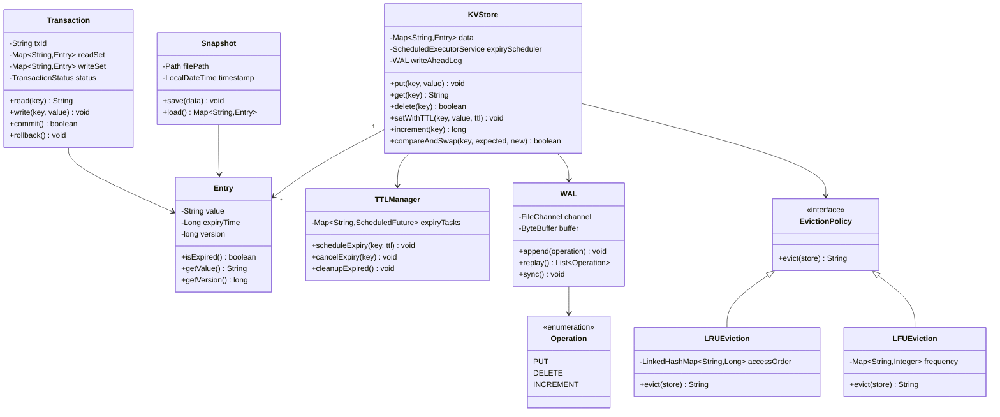

# In-Memory Key-Value Store - Low Level Design

## Problem Statement

Design an in-memory key-value store like Redis that supports basic operations (get, put, delete), TTL (time-to-live), persistence, and advanced features like atomic operations, transactions, and pub/sub. The system should be high-performance and thread-safe.

## Table of Contents
- [Requirements](#requirements)
- [Class Diagram](#class-diagram)
- [Key Design Decisions](#key-design-decisions)
- [Implementation Guide](#implementation-guide)
- [Source Code](#source-code)

## Requirements

### Functional Requirements
1. **Basic Operations**
   - `put(key, value)` - Store key-value pair
   - `get(key)` - Retrieve value by key
   - `delete(key)` - Remove key-value pair
   - `exists(key)` - Check if key exists

2. **TTL (Time-To-Live)**
   - `setWithTTL(key, value, ttlSeconds)` - Store with expiration
   - `getTTL(key)` - Get remaining time
   - `persist(key)` - Remove TTL
   - Auto-expiration of keys

3. **Atomic Operations**
   - `increment(key)` - Atomic counter increment
   - `decrement(key)` - Atomic counter decrement
   - `compareAndSwap(key, expected, new)` - CAS operation

4. **Transactions**
   - `begin()` - Start transaction
   - `commit()` - Apply all operations
   - `rollback()` - Discard changes
   - Isolation from other transactions

5. **Persistence**
   - Snapshots (periodic full dump)
   - Write-Ahead Log (WAL) for durability
   - Background saving
   - Load from disk on restart

### Non-Functional Requirements
- **Performance**: O(1) operations, 100K+ QPS
- **Thread-Safety**: Support concurrent access
- **Memory Efficiency**: Eviction policies (LRU, LFU)
- **Durability**: WAL + snapshots
- **Availability**: 99.99% uptime

## Class Diagram


<details>
<summary>View Mermaid Source</summary>



</details>

## Key Design Decisions

### 1. ConcurrentHashMap for Thread-Safe Storage
**Decision**: Use `ConcurrentHashMap` as the underlying data structure.

**Rationale**:
- Lock-free reads (high concurrency)
- Segment-level locking for writes
- Built-in thread-safety
- O(1) average operations

**Tradeoffs**:
- No total ordering of keys
- Memory overhead for concurrency control
- Can't implement true transactions without external coordination

### 2. Write-Ahead Log (WAL) for Durability
**Decision**: Log all mutations before applying them.

**Rationale**:
- Crash recovery capability
- No data loss (within fsync interval)
- Sequential writes (fast)
- Replay on restart

**Tradeoffs**:
- Write amplification (log + memory)
- Need periodic log rotation
- Slower writes due to fsync

### 3. Versioned Entries for Optimistic Locking
**Decision**: Each entry has a version number for CAS operations.

**Rationale**:
- Enables lock-free concurrent updates
- Detects conflicts in transactions
- Supports optimistic concurrency control
- Better performance than pessimistic locks

**Tradeoffs**:
- Version counter overhead
- CAS can fail and need retry
- More complex code

### 4. Two-Phase Commit for Transactions
**Decision**: Use 2PC (Prepare → Commit) for transaction isolation.

**Rationale**:
- ACID guarantees
- Isolation from concurrent transactions
- Rollback support
- Standard protocol

**Tradeoffs**:
- Performance overhead
- Deadlock potential
- Not distributed (single-node only)

## Implementation Guide

### 1. Put Operation with WAL

```
Algorithm: Put(key, value)
Input: key string, value string
Output: void

1. // Write to WAL first (durability)
   operation = new WALEntry(PUT, key, value)
   wal.append(operation)
   wal.sync()  // Force to disk

2. // Update in-memory store
   entry = new Entry(value, null, version++)
   data.put(key, entry)

3. // Trigger async snapshot if needed
   if operationsSinceSnapshot > SNAPSHOT_THRESHOLD:
      scheduleSnapshot()
```

**Time Complexity**: O(1) for memory, O(1) amortized for WAL  
**Space Complexity**: O(1)

### 2. Get Operation with TTL Check

```
Algorithm: Get(key)
Input: key string
Output: value string or null

1. entry = data.get(key)

2. if entry == null:
      return null

3. if entry.isExpired():
      data.remove(key)
      ttlManager.cancelExpiry(key)
      return null

4. // Update access time for LRU
   evictionPolicy.onAccess(key)

5. return entry.getValue()
```

**Time Complexity**: O(1)  
**Space Complexity**: O(1)

### 3. Compare-And-Swap (CAS) Operation

```
Algorithm: CompareAndSwap(key, expectedValue, newValue)
Input: key, expected value, new value
Output: boolean success

1. entry = data.get(key)

2. if entry == null:
      if expectedValue != null:
         return false  // Expected value doesn't match
      entry = new Entry(newValue, null, 1)
      data.put(key, entry)
      return true

3. currentValue = entry.getValue()

4. if currentValue != expectedValue:
      return false  // CAS failed

5. // Atomic update with version increment
   newEntry = new Entry(newValue, entry.expiryTime, entry.version + 1)
   success = data.replace(key, entry, newEntry)  // Atomic

6. if success:
      wal.append(WALEntry(PUT, key, newValue))

7. return success
```

**Time Complexity**: O(1)  
**Space Complexity**: O(1)

### 4. Transaction Commit (Optimistic Locking)

```
Algorithm: CommitTransaction(transaction)
Input: transaction object
Output: boolean success

1. // Phase 1: Validate (check versions)
   for each (key, entry) in transaction.readSet:
      currentEntry = data.get(key)
      if currentEntry.version != entry.version:
         return false  // Read conflict, abort

2. // Phase 2: Prepare (log to WAL)
   for each (key, entry) in transaction.writeSet:
      wal.append(WALEntry(PUT, key, entry.value))
   wal.sync()

3. // Phase 3: Commit (apply to memory)
   for each (key, entry) in transaction.writeSet:
      newEntry = new Entry(entry.value, null, currentVersion++)
      data.put(key, newEntry)

4. transaction.status = COMMITTED
5. return true
```

**Time Complexity**: O(w + r) where w is writes, r is reads  
**Space Complexity**: O(w + r)

### 5. TTL Expiry Management

```
Algorithm: SetWithTTL(key, value, ttlSeconds)
Input: key, value, TTL in seconds
Output: void

1. expiryTime = currentTime() + ttlSeconds * 1000

2. entry = new Entry(value, expiryTime, version++)
3. data.put(key, entry)

4. // Schedule automatic removal
   task = scheduler.schedule(() -> {
      currentEntry = data.get(key)
      if currentEntry != null and currentEntry.expiryTime == expiryTime:
         data.remove(key)
   }, ttlSeconds, SECONDS)

5. ttlManager.scheduleExpiry(key, task)
```

**Time Complexity**: O(1) + O(log n) for scheduler  
**Space Complexity**: O(1)

## Source Code

**Total Files**: 10  
**Total Lines of Code**: ~587

### Quick Links
- [📁 View Complete Implementation](/problems/kvstore/CODE)

### Project Structure
```
kvstore/
├── model/
│   ├── Entry.java               // Value + metadata
│   ├── Transaction.java         // Transaction state
│   └── Operation.java           // WAL operation types
├── api/
│   └── KVStoreService.java      // Service interface
├── impl/
│   ├── InMemoryKVStore.java     // Main implementation
│   ├── TTLManager.java          // Expiry handling
│   ├── WAL.java                 // Write-ahead log
│   └── Snapshot.java            // Periodic snapshots
└── eviction/
    ├── EvictionPolicy.java      // Interface
    ├── LRUEviction.java         // LRU policy
    └── LFUEviction.java         // LFU policy
```

### Core Components

1. **KVStore** (`impl/InMemoryKVStore.java`)
   - Main storage using `ConcurrentHashMap`
   - Coordinates WAL, TTL, and eviction
   - Thread-safe operations

2. **TTLManager** (`impl/TTLManager.java`)
   - Scheduled expiry tasks
   - Lazy expiration on access
   - Background cleanup

3. **WAL** (`impl/WAL.java`)
   - Sequential write log
   - fsync for durability
   - Replay on startup

4. **Transaction** (`model/Transaction.java`)
   - Read/write sets
   - Version-based conflict detection
   - 2PC commit protocol

5. **Eviction Policies** (`eviction/*`)
   - LRU: Remove least recently used
   - LFU: Remove least frequently used
   - Triggered when memory limit reached

### Design Patterns Used

| Pattern | Usage | Benefit |
|---------|-------|---------|
| **Strategy** | Eviction policies | Pluggable eviction algorithms |
| **Observer** | Key expiry events | Notification on expiration |
| **Command** | WAL operations | Replayable operations |
| **Memento** | Snapshots | State persistence |
| **Singleton** | KVStore instance | Single source of truth |

### Usage Example

```java
KVStoreService store = new InMemoryKVStore();

// Basic operations
store.put("user:1", "Alice");
String value = store.get("user:1");  // "Alice"
store.delete("user:1");

// TTL
store.setWithTTL("session:abc", "user123", 3600);  // 1 hour
long remaining = store.getTTL("session:abc");

// Atomic operations
store.put("counter", "0");
long newValue = store.increment("counter");  // 1

// CAS operation
boolean success = store.compareAndSwap("counter", "1", "10");

// Transactions
Transaction tx = store.beginTransaction();
tx.write("key1", "value1");
tx.write("key2", "value2");
boolean committed = tx.commit();  // Atomic commit

// Persistence
store.save("dump.rdb");  // Snapshot
store.load("dump.rdb");  // Restore
```

## Interview Discussion Points

### System Design Considerations

1. **How to handle memory limits?**
   - Implement eviction policies (LRU, LFU, TTL)
   - Set max memory limit
   - Evict on memory pressure
   - Configurable eviction strategy

2. **How to scale beyond single node?**
   - Consistent hashing for sharding
   - Replication (master-slave, multi-master)
   - Eventual consistency model
   - Conflict resolution (vector clocks)

3. **How to improve write performance?**
   - Batch WAL writes
   - Async fsync (trade durability)
   - Use SSD for WAL
   - Compress WAL entries

4. **How to support complex data types?**
   - Lists: Use `LinkedList` or `ArrayList`
   - Sets: Use `HashSet`
   - Sorted Sets: Use `TreeMap`
   - Hashes: Nested `HashMap`

### Scalability

- **Single Node**: 100K+ QPS with proper tuning
- **Memory**: Limited by heap size (use off-heap for large stores)
- **Persistence**: WAL for durability, snapshots for recovery
- **Replication**: Async replication for read scalability

### Real-World Extensions

1. **Pub/Sub**
   - Channel subscriptions
   - Message broadcasting
   - Pattern matching subscribers

2. **Streams**
   - Append-only log
   - Consumer groups
   - Time-based or ID-based queries

3. **Geo-Spatial**
   - Store lat/long coordinates
   - Radius queries
   - Geohash indexing

4. **Lua Scripting**
   - Atomic script execution
   - Complex operations
   - Server-side logic

---

This Key-Value Store implementation provides a solid foundation for understanding in-memory databases, persistence strategies, and concurrent data structures. It can be extended to support distributed scenarios and advanced data types.
