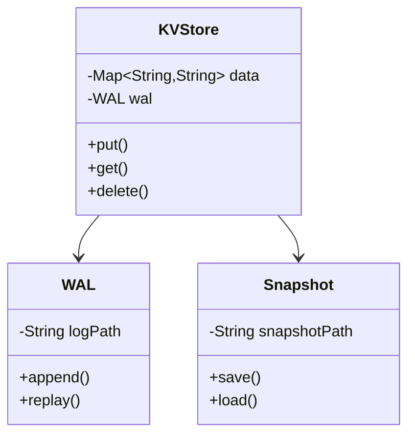
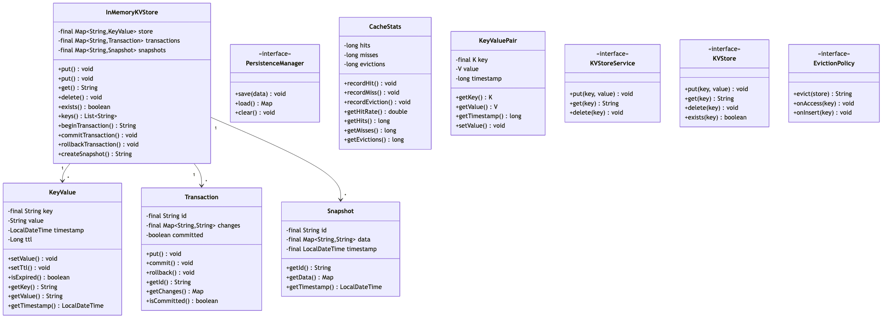

# Distributed Key-Value Store

## Overview
A high-performance distributed key-value (KV) store supporting CRUD operations, partitioning, replication, consistency models, and caching. Implements consistent hashing, vector clocks, quorum-based replication, and eventual consistency for scalable data storage like Redis, DynamoDB, or Cassandra.

**Difficulty:** Hard  
**Domain:** Distributed Systems, Databases  
**Interview Frequency:** Very High (Amazon DynamoDB, Redis Labs, Cassandra, major tech companies)

## Requirements

### Functional Requirements
1. **Basic Operations**
   - PUT(key, value) - Store key-value pair
   - GET(key) - Retrieve value
   - DELETE(key) - Remove key
   - EXISTS(key) - Check if key exists
   - TTL support (expire keys)

2. **Advanced Operations**
   - Batch operations (multi-get, multi-put)
   - Atomic compare-and-swap (CAS)
   - Increment/decrement counters
   - Range queries (optional)
   - Prefix scan

3. **Data Types**
   - String
   - Integer/Float
   - List
   - Set
   - Hash (nested key-value)

4. **Partitioning**
   - Consistent hashing
   - Virtual nodes
   - Automatic rebalancing
   - Shard management

5. **Replication**
   - Multi-replica per key
   - Quorum reads/writes
   - Anti-entropy (gossip protocol)
   - Hinted handoff

6. **Consistency**
   - Eventual consistency
   - Strong consistency (optional)
   - Tunable consistency (R + W > N)
   - Conflict resolution (vector clocks)

### Non-Functional Requirements
1. **Performance**
   - GET: < 1ms (in-memory)
   - PUT: < 5ms
   - Throughput: 100K+ ops/sec per node
   - Sub-millisecond p99 latency

2. **Scalability**
   - Horizontal scaling (add nodes)
   - Support 1TB+ data per node
   - Billions of keys
   - Linear performance scaling

3. **Availability**
   - 99.99% uptime
   - No single point of failure
   - Partition tolerance (CAP)
   - Automatic failover

4. **Durability**
   - Write-ahead log (WAL)
   - Periodic snapshots
   - Replication factor 3+
   - Backup and restore


## Class Diagram

<details>
<summary>View Mermaid Source</summary>



</details>



## System Architecture

```
┌────────────────────────────────────────────────────┐
│                Client Application                   │
└────────────────┬───────────────────────────────────┘
                 │
     ┌───────────▼────────────┐
     │    Client Library      │
     │  (Consistent Hashing)  │
     └────────────┬───────────┘
                  │
     ┌────────────┼────────────┐
     │            │            │
┌────▼────┐  ┌───▼────┐  ┌───▼────┐
│  Node1  │  │ Node2  │  │ Node3  │
│         │  │        │  │        │
│ Memory  │  │ Memory │  │ Memory │
│  Store  │  │  Store │  │  Store │
│         │  │        │  │        │
│  WAL    │  │  WAL   │  │  WAL   │
│  Disk   │  │  Disk  │  │  Disk  │
└────┬────┘  └───┬────┘  └───┬────┘
     │           │           │
     └───────────┼───────────┘
                 │
      (Gossip Protocol for
       membership & replication)

Consistent Hashing Ring:
     Node1 (0-85)
         ↓
     Node2 (86-170)
         ↓
     Node3 (171-255)
```

## Core Data Model

### 1. Key-Value Entry
```java
public class KVEntry {
    private String key;
    private byte[] value;
    private long timestamp;
    private VectorClock vectorClock;
    private long ttl; // Time to live (seconds), 0 = no expiry
    private LocalDateTime createdAt;
    private LocalDateTime expiresAt;
    
    public boolean isExpired() {
        if (ttl == 0) {
            return false;
        }
        return LocalDateTime.now().isAfter(expiresAt);
    }
    
    public void updateValue(byte[] newValue) {
        this.value = newValue;
        this.timestamp = System.currentTimeMillis();
        this.vectorClock.increment();
    }
}
```

### 2. Vector Clock (Conflict Resolution)
```java
public class VectorClock {
    private Map<String, Long> clock; // nodeId → version
    
    public VectorClock() {
        this.clock = new HashMap<>();
    }
    
    public void increment(String nodeId) {
        clock.merge(nodeId, 1L, Long::sum);
    }
    
    public ComparisonResult compare(VectorClock other) {
        boolean thisGreater = false;
        boolean otherGreater = false;
        
        Set<String> allNodes = new HashSet<>();
        allNodes.addAll(this.clock.keySet());
        allNodes.addAll(other.clock.keySet());
        
        for (String node : allNodes) {
            long thisVersion = this.clock.getOrDefault(node, 0L);
            long otherVersion = other.clock.getOrDefault(node, 0L);
            
            if (thisVersion > otherVersion) {
                thisGreater = true;
            } else if (otherVersion > thisVersion) {
                otherGreater = true;
            }
        }
        
        if (thisGreater && !otherGreater) {
            return ComparisonResult.AFTER;
        } else if (otherGreater && !thisGreater) {
            return ComparisonResult.BEFORE;
        } else if (!thisGreater && !otherGreater) {
            return ComparisonResult.EQUAL;
        } else {
            return ComparisonResult.CONCURRENT;
        }
    }
}

enum ComparisonResult {
    BEFORE,      // This happened before other
    AFTER,       // This happened after other
    EQUAL,       // Same version
    CONCURRENT   // Conflicting versions (need resolution)
}
```

### 3. Consistent Hash Ring
```java
public class ConsistentHashRing {
    private final int virtualNodesPerNode;
    private final TreeMap<Integer, Node> ring;
    private final List<Node> physicalNodes;
    
    public ConsistentHashRing(int virtualNodesPerNode) {
        this.virtualNodesPerNode = virtualNodesPerNode;
        this.ring = new TreeMap<>();
        this.physicalNodes = new ArrayList<>();
    }
    
    public void addNode(Node node) {
        physicalNodes.add(node);
        
        // Add virtual nodes
        for (int i = 0; i < virtualNodesPerNode; i++) {
            String virtualKey = node.getId() + "#" + i;
            int hash = hash(virtualKey);
            ring.put(hash, node);
        }
    }
    
    public void removeNode(Node node) {
        physicalNodes.remove(node);
        
        // Remove virtual nodes
        for (int i = 0; i < virtualNodesPerNode; i++) {
            String virtualKey = node.getId() + "#" + i;
            int hash = hash(virtualKey);
            ring.remove(hash);
        }
    }
    
    public Node getNode(String key) {
        if (ring.isEmpty()) {
            return null;
        }
        
        int hash = hash(key);
        
        // Find first node >= hash
        Map.Entry<Integer, Node> entry = ring.ceilingEntry(hash);
        
        if (entry == null) {
            // Wrap around to first node
            entry = ring.firstEntry();
        }
        
        return entry.getValue();
    }
    
    public List<Node> getPreferenceList(String key, int count) {
        List<Node> nodes = new ArrayList<>();
        Set<Node> seen = new HashSet<>();
        
        int hash = hash(key);
        
        // Get N unique physical nodes
        for (Map.Entry<Integer, Node> entry : ring.tailMap(hash).entrySet()) {
            Node node = entry.getValue();
            if (!seen.contains(node)) {
                nodes.add(node);
                seen.add(node);
                
                if (nodes.size() >= count) {
                    break;
                }
            }
        }
        
        // Wrap around if needed
        if (nodes.size() < count) {
            for (Map.Entry<Integer, Node> entry : ring.entrySet()) {
                Node node = entry.getValue();
                if (!seen.contains(node)) {
                    nodes.add(node);
                    seen.add(node);
                    
                    if (nodes.size() >= count) {
                        break;
                    }
                }
            }
        }
        
        return nodes;
    }
    
    private int hash(String key) {
        return Math.abs(key.hashCode());
    }
}
```

### 4. Storage Node
```java
public class StorageNode {
    private final String nodeId;
    private final Map<String, KVEntry> memoryStore;
    private final WriteAheadLog wal;
    private final ReplicationManager replicationManager;
    private final GossipProtocol gossip;
    
    public void put(String key, byte[] value, int ttl) {
        // 1. Write to WAL first (durability)
        wal.append(new LogEntry(LogOperation.PUT, key, value, ttl));
        
        // 2. Update in-memory store
        KVEntry entry = new KVEntry(key, value, ttl);
        entry.getVectorClock().increment(nodeId);
        memoryStore.put(key, entry);
        
        // 3. Replicate to other nodes (async)
        replicationManager.replicate(key, entry);
    }
    
    public byte[] get(String key) {
        KVEntry entry = memoryStore.get(key);
        
        if (entry == null) {
            return null;
        }
        
        if (entry.isExpired()) {
            delete(key);
            return null;
        }
        
        return entry.getValue();
    }
    
    public void delete(String key) {
        wal.append(new LogEntry(LogOperation.DELETE, key, null, 0));
        memoryStore.remove(key);
        replicationManager.replicate(key, null);
    }
}
```

## Key Algorithms

### 1. Quorum-based Read/Write
```java
public class QuorumKVStore {
    private final ConsistentHashRing ring;
    private final int replicationFactor;
    private final int readQuorum;   // R
    private final int writeQuorum;  // W
    // Typically: R + W > N for strong consistency
    
    public void put(String key, byte[] value) throws QuorumException {
        // Get N nodes for this key
        List<Node> nodes = ring.getPreferenceList(key, replicationFactor);
        
        List<CompletableFuture<Boolean>> futures = new ArrayList<>();
        
        for (Node node : nodes) {
            CompletableFuture<Boolean> future = CompletableFuture.supplyAsync(() -> {
                try {
                    node.put(key, value);
                    return true;
                } catch (Exception e) {
                    return false;
                }
            });
            futures.add(future);
        }
        
        // Wait for W successful writes
        int successCount = 0;
        for (CompletableFuture<Boolean> future : futures) {
            try {
                if (future.get(1, TimeUnit.SECONDS)) {
                    successCount++;
                    if (successCount >= writeQuorum) {
                        return; // Success!
                    }
                }
            } catch (Exception e) {
                // Timeout or failure
            }
        }
        
        throw new QuorumException("Failed to achieve write quorum");
    }
    
    public byte[] get(String key) throws QuorumException {
        List<Node> nodes = ring.getPreferenceList(key, replicationFactor);
        
        List<CompletableFuture<KVEntry>> futures = new ArrayList<>();
        
        for (Node node : nodes) {
            CompletableFuture<KVEntry> future = CompletableFuture.supplyAsync(() -> {
                try {
                    return node.get(key);
                } catch (Exception e) {
                    return null;
                }
            });
            futures.add(future);
        }
        
        // Wait for R successful reads
        List<KVEntry> responses = new ArrayList<>();
        for (CompletableFuture<KVEntry> future : futures) {
            try {
                KVEntry entry = future.get(1, TimeUnit.SECONDS);
                if (entry != null) {
                    responses.add(entry);
                    if (responses.size() >= readQuorum) {
                        break;
                    }
                }
            } catch (Exception e) {
                // Timeout or failure
            }
        }
        
        if (responses.size() < readQuorum) {
            throw new QuorumException("Failed to achieve read quorum");
        }
        
        // Resolve conflicts using vector clocks
        return resolveConflicts(responses);
    }
    
    private byte[] resolveConflicts(List<KVEntry> entries) {
        if (entries.size() == 1) {
            return entries.get(0).getValue();
        }
        
        // Find entry with latest vector clock
        KVEntry latest = entries.get(0);
        
        for (int i = 1; i < entries.size(); i++) {
            KVEntry current = entries.get(i);
            ComparisonResult result = latest.getVectorClock()
                .compare(current.getVectorClock());
            
            if (result == ComparisonResult.BEFORE) {
                latest = current;
            } else if (result == ComparisonResult.CONCURRENT) {
                // Conflict! Use last-write-wins based on timestamp
                if (current.getTimestamp() > latest.getTimestamp()) {
                    latest = current;
                }
            }
        }
        
        return latest.getValue();
    }
}
```

**Quorum Configuration Examples:**
```
Strong Consistency: R=2, W=2, N=3 (R+W > N)
- Every read sees latest write

Eventual Consistency: R=1, W=1, N=3 (R+W < N)
- Fast but may read stale data

Read-Optimized: R=1, W=3, N=3
- Fast reads, durable writes

Write-Optimized: R=3, W=1, N=3
- Fast writes, consistent reads
```

### 2. Hinted Handoff (Temporary Failures)
```java
public class HintedHandoffManager {
    private final Map<String, Queue<Hint>> hints;
    
    public void put(String key, byte[] value, List<Node> preferredNodes) {
        int successCount = 0;
        
        for (Node node : preferredNodes) {
            try {
                node.put(key, value);
                successCount++;
            } catch (NodeUnavailableException e) {
                // Node is down, store hint for later
                storeHint(node.getId(), new Hint(key, value, node));
            }
        }
    }
    
    private void storeHint(String nodeId, Hint hint) {
        hints.computeIfAbsent(nodeId, k -> new LinkedList<>()).offer(hint);
    }
    
    public void replayHints(String nodeId) {
        Queue<Hint> nodeHints = hints.get(nodeId);
        
        if (nodeHints == null) {
            return;
        }
        
        Node node = findNode(nodeId);
        
        while (!nodeHints.isEmpty()) {
            Hint hint = nodeHints.poll();
            try {
                node.put(hint.getKey(), hint.getValue());
            } catch (Exception e) {
                // Node still unavailable, keep hint
                nodeHints.offer(hint);
                break;
            }
        }
    }
}

class Hint {
    private String key;
    private byte[] value;
    private Node targetNode;
    private LocalDateTime createdAt;
}
```

### 3. Anti-Entropy (Merkle Trees)
```java
public class AntiEntropyService {
    
    public void synchronize(Node node1, Node node2) {
        // Build Merkle trees for both nodes
        MerkleTree tree1 = buildMerkleTree(node1);
        MerkleTree tree2 = buildMerkleTree(node2);
        
        // Compare roots
        if (tree1.getRoot().equals(tree2.getRoot())) {
            return; // Trees are identical, no sync needed
        }
        
        // Find differing keys
        Set<String> differingKeys = findDifferences(tree1, tree2);
        
        // Synchronize differing keys
        for (String key : differingKeys) {
            KVEntry entry1 = node1.get(key);
            KVEntry entry2 = node2.get(key);
            
            if (entry1 == null) {
                // Key only exists in node2
                node1.put(key, entry2.getValue());
            } else if (entry2 == null) {
                // Key only exists in node1
                node2.put(key, entry1.getValue());
            } else {
                // Both have key, resolve conflict
                resolveAndSync(key, entry1, entry2, node1, node2);
            }
        }
    }
    
    private MerkleTree buildMerkleTree(Node node) {
        List<String> keys = node.getAllKeys();
        Collections.sort(keys);
        
        MerkleTree tree = new MerkleTree();
        for (String key : keys) {
            byte[] value = node.get(key);
            tree.add(key, value);
        }
        
        return tree;
    }
}
```

### 4. Write-Ahead Log (Durability)
```java
public class WriteAheadLog {
    private final String logPath;
    private final FileChannel channel;
    private final ByteBuffer buffer;
    
    public void append(LogEntry entry) throws IOException {
        // Serialize entry
        byte[] data = serialize(entry);
        
        // Write to log file
        synchronized (channel) {
            buffer.clear();
            buffer.put(data);
            buffer.flip();
            
            while (buffer.hasRemaining()) {
                channel.write(buffer);
            }
            
            // Force to disk (fsync)
            channel.force(true);
        }
    }
    
    public void replay(Consumer<LogEntry> callback) throws IOException {
        FileInputStream fis = new FileInputStream(logPath);
        
        while (fis.available() > 0) {
            LogEntry entry = deserialize(fis);
            callback.accept(entry);
        }
    }
    
    public void checkpoint() throws IOException {
        // Create snapshot of current state
        // Truncate old log entries
    }
}
```

## Design Patterns

### 1. Strategy Pattern (Conflict Resolution)
```java
interface ConflictResolver {
    byte[] resolve(List<KVEntry> entries);
}

class LastWriteWins implements ConflictResolver {
    public byte[] resolve(List<KVEntry> entries) {
        return entries.stream()
            .max(Comparator.comparingLong(KVEntry::getTimestamp))
            .map(KVEntry::getValue)
            .orElse(null);
    }
}

class VectorClockResolver implements ConflictResolver {
    public byte[] resolve(List<KVEntry> entries) {
        // Use vector clock comparison
    }
}
```

### 2. Template Method (Storage Backend)
```java
abstract class StorageBackend {
    public final void put(String key, byte[] value) {
        validate(key, value);
        writeToDisk(key, value);
        updateIndex(key);
    }
    
    protected abstract void writeToDisk(String key, byte[] value);
    protected abstract void updateIndex(String key);
    
    private void validate(String key, byte[] value) {
        // Common validation logic
    }
}
```

### 3. Observer Pattern (Replication)
```java
interface ReplicationObserver {
    void onWrite(String key, byte[] value);
}

class SyncReplicationObserver implements ReplicationObserver {
    public void onWrite(String key, byte[] value) {
        // Synchronously replicate to replicas
    }
}
```

## Source Code

📄 **[View Complete Source Code](/problems/kvstore/CODE)**

**Key Files:**
- [`QuorumKVStore.java`](/problems/kvstore/CODE#quorumkvstorejava) - Quorum operations
- [`ConsistentHashRing.java`](/problems/kvstore/CODE#consistenthashringjava) - Partitioning
- [`VectorClock.java`](/problems/kvstore/CODE#vectorclockjava) - Conflict resolution
- [`WriteAheadLog.java`](/problems/kvstore/CODE#writeaheadlogjava) - Durability

**Total Lines of Code:** ~1300 lines

## Usage Example

```java
// Initialize cluster
KVStoreCluster cluster = new KVStoreCluster();
cluster.addNode(new StorageNode("node1"));
cluster.addNode(new StorageNode("node2"));
cluster.addNode(new StorageNode("node3"));

// Configure quorum
QuorumKVStore store = QuorumKVStore.builder()
    .replicationFactor(3)
    .readQuorum(2)
    .writeQuorum(2)
    .build();

// Put key-value
store.put("user:123", serialize(user));

// Get value
byte[] data = store.get("user:123");
User user = deserialize(data);

// Delete
store.delete("user:123");

// Batch operations
Map<String, byte[]> batch = Map.of(
    "key1", value1,
    "key2", value2
);
store.putBatch(batch);

// Compare-and-swap
boolean success = store.compareAndSwap("counter", oldValue, newValue);
```

## Common Interview Questions

### System Design Questions

1. **How do you partition data across nodes?**
   - Consistent hashing
   - Virtual nodes (100-200 per physical node)
   - Automatic rebalancing on add/remove
   - Even distribution of load

2. **How do you ensure data durability?**
   - Write-ahead log (WAL)
   - Replication (N=3 or more)
   - Periodic snapshots
   - Fsync to disk

3. **How do you handle network partitions?**
   - Eventual consistency
   - Hinted handoff for temporary failures
   - Anti-entropy (Merkle trees)
   - Vector clocks for conflict resolution

4. **How do you scale to billions of keys?**
   - Horizontal partitioning (sharding)
   - Add more nodes
   - In-memory storage with disk backup
   - Bloom filters for key existence

### Coding Questions

1. **Implement consistent hashing**
   ```java
   public Node getNode(String key) {
       int hash = hash(key);
       Map.Entry<Integer, Node> entry = ring.ceilingEntry(hash);
       return entry != null ? entry.getValue() : ring.firstEntry().getValue();
   }
   ```

2. **Vector clock comparison**
   ```java
   public ComparisonResult compare(VectorClock other) {
       boolean thisGreater = false, otherGreater = false;
       for (String node : allNodes) {
           long v1 = this.get(node), v2 = other.get(node);
           if (v1 > v2) thisGreater = true;
           if (v2 > v1) otherGreater = true;
       }
       if (thisGreater && !otherGreater) return AFTER;
       if (otherGreater && !thisGreater) return BEFORE;
       if (!thisGreater && !otherGreater) return EQUAL;
       return CONCURRENT;
   }
   ```

### Algorithm Questions
1. **Time complexity of GET?** → O(1) average for hash lookup
2. **How to resolve conflicts?** → Vector clocks + last-write-wins
3. **How to find differences between replicas?** → Merkle trees: O(log N)

## Trade-offs & Design Decisions

### 1. Strong vs Eventual Consistency
**Strong:** Always consistent, slower  
**Eventual:** Fast, temporarily inconsistent

**Decision:** Eventual with tunable quorums

### 2. Synchronous vs Asynchronous Replication
**Sync:** Durable, high latency  
**Async:** Fast, potential data loss

**Decision:** Async with WAL

### 3. Memory vs Disk Storage
**Memory:** Fast (< 1ms), limited capacity  
**Disk:** Durable, slower (10-100ms)

**Decision:** Hybrid (memory + disk backup)

### 4. Centralized vs Decentralized Coordination
**Centralized:** Simple, single point of failure  
**Decentralized:** Complex, no SPOF

**Decision:** Decentralized (gossip protocol)

## Key Takeaways

### What Interviewers Look For
1. ✅ **Consistent hashing** for partitioning
2. ✅ **Quorum-based** replication
3. ✅ **Vector clocks** for conflict resolution
4. ✅ **Write-ahead log** for durability
5. ✅ **CAP theorem** understanding
6. ✅ **Trade-off discussions**

### Common Mistakes to Avoid
1. ❌ Not using consistent hashing (uneven distribution)
2. ❌ No conflict resolution strategy
3. ❌ Ignoring durability (data loss)
4. ❌ No handling for network partitions
5. ❌ Single point of failure
6. ❌ Not considering CAP trade-offs

### Production-Ready Checklist
- [x] Consistent hashing
- [x] Replication
- [x] Quorum reads/writes
- [x] Vector clocks
- [x] Write-ahead log
- [ ] Compaction
- [ ] Backup/restore
- [ ] Monitoring
- [ ] Multi-datacenter
- [ ] Security (encryption)

---

## Related Problems
- 🗄️ **Distributed Cache** - Similar architecture
- 📊 **Database Sharding** - Partitioning strategies
- 🔄 **Event Sourcing** - WAL pattern
- 🌐 **CDN** - Distributed data

## References
- Amazon DynamoDB: Distributed KV store
- Apache Cassandra: Wide-column store
- Consistent Hashing: Karger et al.
- Vector Clocks: Lamport timestamps
- CAP Theorem: Brewer's conjecture

---

*Production-ready distributed key-value store with consistent hashing, quorum replication, and eventual consistency. Essential for distributed systems interviews.*
