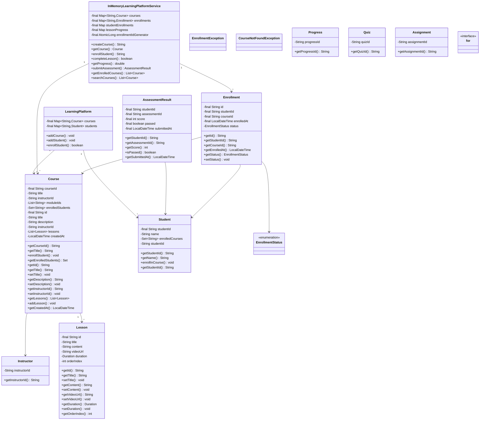
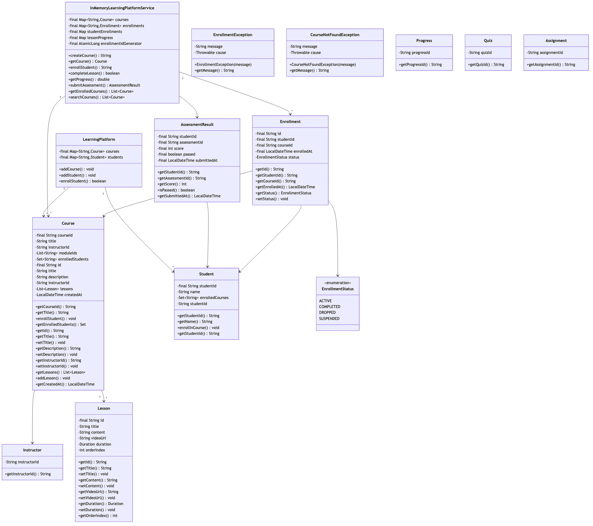

# Online Learning Platform

## Overview
A comprehensive e-learning management system (LMS) supporting course creation, enrollment, progress tracking, assessments, certifications, and instructor management. Implements adaptive learning paths, video streaming, interactive content, and gamification for engaging educational experiences.

**Difficulty:** Medium-Hard  
**Domain:** Education Technology, LMS  
**Interview Frequency:** High (Coursera, Udemy, Khan Academy, LinkedIn Learning)

## Requirements

### Functional Requirements
1. **Course Management**
   - Create/edit courses
   - Organize into modules/lessons
   - Support multiple content types (video, text, quiz, assignment)
   - Prerequisites and dependencies
   - Course versioning

2. **User Management**
   - Student registration
   - Instructor profiles
   - Admin roles
   - User authentication
   - Profile management

3. **Enrollment & Access**
   - Course enrollment (free/paid)
   - Payment processing
   - Access control
   - Enrollment limits
   - Waitlist management

4. **Learning Experience**
   - Video streaming
   - Interactive content
   - Progress tracking
   - Bookmarks and notes
   - Discussion forums

5. **Assessments**
   - Quizzes (MCQ, true/false, short answer)
   - Assignments (file upload)
   - Auto-grading
   - Manual grading by instructors
   - Certificates on completion

6. **Analytics & Reporting**
   - Student progress
   - Course completion rates
   - Quiz scores
   - Engagement metrics
   - Instructor analytics

### Non-Functional Requirements
1. **Performance**
   - Video load: < 2 seconds
   - Page load: < 1 second
   - Support 100K+ concurrent learners
   - 50K+ courses

2. **Scalability**
   - CDN for video content
   - Database sharding by course
   - Caching for popular courses
   - Horizontal scaling

3. **Availability**
   - 99.9% uptime
   - No data loss
   - Offline download support


## Class Diagram

<details>
<summary>View Mermaid Source</summary>



</details>



## System Architecture

```
┌─────────────────────────────────────────────────────┐
│              Student/Instructor Interface            │
│      (Web App, Mobile App, Browser Extension)        │
└────────────────────┬────────────────────────────────┘
                     │
        ┌────────────▼────────────┐
        │      API Gateway        │
        │  (Auth, Rate Limiting)  │
        └────────────┬────────────┘
                     │
     ┌───────────────┼───────────────┐
     │               │               │
┌────▼─────┐  ┌─────▼──────┐  ┌────▼─────┐
│ Course   │  │ Enrollment │  │ Progress │
│ Service  │  │  Service   │  │ Service  │
│          │  │            │  │          │
│ -Create  │  │ -Enroll    │  │ -Track   │
│ -Update  │  │ -Payment   │  │ -Resume  │
│ -Publish │  │ -Access    │  │ -Complete│
└────┬─────┘  └─────┬──────┘  └────┬─────┘
     │              │               │
┌────▼─────┐  ┌─────▼──────┐  ┌────▼─────┐
│ Course   │  │ Enrollment │  │ Progress │
│   DB     │  │     DB     │  │    DB    │
│          │  │            │  │          │
│ Courses  │  │ Students   │  │ Lessons  │
│ Lessons  │  │ Payments   │  │ Watched  │
│ Quizzes  │  │ Access     │  │ Scores   │
└──────────┘  └────────────┘  └──────────┘
     │
┌────▼─────┐
│  Video   │
│  CDN     │
│          │
│ HLS/DASH │
│ Adaptive │
└──────────┘
```

## Core Data Model

### 1. Course
```java
public class Course {
    private CourseId id;
    private String title;
    private String description;
    private InstructorId instructorId;
    private CategoryId categoryId;
    private CourseLevel level; // BEGINNER, INTERMEDIATE, ADVANCED
    private List<Module> modules;
    private Money price;
    private Language language;
    private CourseStatus status; // DRAFT, PUBLISHED, ARCHIVED
    private int enrollmentCount;
    private double rating;
    private Duration estimatedDuration;
    private List<String> prerequisites;
    private LocalDateTime createdAt;
    private LocalDateTime publishedAt;
    
    public boolean canEnroll(Student student) {
        // Check prerequisites
        for (String prereqCourseId : prerequisites) {
            if (!student.hasCompleted(prereqCourseId)) {
                return false;
            }
        }
        return status == CourseStatus.PUBLISHED;
    }
    
    public int getTotalLessons() {
        return modules.stream()
            .mapToInt(Module::getLessonCount)
            .sum();
    }
}

enum CourseLevel {
    BEGINNER,
    INTERMEDIATE,
    ADVANCED,
    ALL_LEVELS
}
```

### 2. Module & Lesson
```java
public class Module {
    private ModuleId id;
    private String title;
    private String description;
    private int orderIndex;
    private List<Lesson> lessons;
    private Duration estimatedDuration;
    
    public int getLessonCount() {
        return lessons.size();
    }
    
    public boolean isCompleted(StudentId studentId) {
        return lessons.stream()
            .allMatch(lesson -> lesson.isCompleted(studentId));
    }
}

public abstract class Lesson {
    protected LessonId id;
    protected String title;
    protected LessonType type;
    protected int orderIndex;
    protected Duration duration;
    protected boolean isMandatory;
    
    public abstract boolean isCompleted(StudentId studentId);
}

class VideoLesson extends Lesson {
    private String videoUrl;
    private String transcriptUrl;
    private List<VideoTimestamp> keyPoints;
    
    public boolean isCompleted(StudentId studentId) {
        return progressService.getWatchProgress(studentId, id) >= 0.9; // 90% watched
    }
}

class QuizLesson extends Lesson {
    private List<Question> questions;
    private int passingScore;
    private int maxAttempts;
    
    public boolean isCompleted(StudentId studentId) {
        QuizAttempt lastAttempt = quizService.getLastAttempt(studentId, id);
        return lastAttempt != null && lastAttempt.getScore() >= passingScore;
    }
}

class AssignmentLesson extends Lesson {
    private String description;
    private List<String> attachments;
    private LocalDateTime dueDate;
    private int maxPoints;
    
    public boolean isCompleted(StudentId studentId) {
        Submission submission = assignmentService.getSubmission(studentId, id);
        return submission != null && submission.isGraded();
    }
}
```

### 3. Enrollment
```java
public class Enrollment {
    private EnrollmentId id;
    private StudentId studentId;
    private CourseId courseId;
    private LocalDateTime enrolledAt;
    private EnrollmentStatus status;
    private Money amountPaid;
    private PaymentId paymentId;
    private LocalDateTime expiresAt; // For subscription-based
    private double completionPercentage;
    private LocalDateTime lastAccessedAt;
    
    public boolean isActive() {
        if (expiresAt != null && LocalDateTime.now().isAfter(expiresAt)) {
            return false;
        }
        return status == EnrollmentStatus.ACTIVE;
    }
    
    public void updateProgress(double percentage) {
        this.completionPercentage = percentage;
        this.lastAccessedAt = LocalDateTime.now();
    }
}

enum EnrollmentStatus {
    ACTIVE,
    COMPLETED,
    DROPPED,
    EXPIRED,
    REFUNDED
}
```

### 4. Progress Tracking
```java
public class StudentProgress {
    private StudentId studentId;
    private CourseId courseId;
    private Map<LessonId, LessonProgress> lessonProgress;
    private int completedLessons;
    private int totalLessons;
    private double completionPercentage;
    private LocalDateTime lastActivityAt;
    
    public void markLessonComplete(LessonId lessonId) {
        LessonProgress progress = lessonProgress.get(lessonId);
        if (progress != null && !progress.isCompleted()) {
            progress.setCompleted(true);
            progress.setCompletedAt(LocalDateTime.now());
            completedLessons++;
            updateCompletionPercentage();
        }
    }
    
    private void updateCompletionPercentage() {
        this.completionPercentage = (double) completedLessons / totalLessons * 100;
    }
    
    public Lesson getNextLesson() {
        return lessonProgress.values().stream()
            .filter(p -> !p.isCompleted())
            .min(Comparator.comparingInt(p -> p.getLesson().getOrderIndex()))
            .map(LessonProgress::getLesson)
            .orElse(null);
    }
}

class LessonProgress {
    private LessonId lessonId;
    private boolean completed;
    private double progressPercentage; // For videos: % watched
    private LocalDateTime startedAt;
    private LocalDateTime completedAt;
    private int attempts; // For quizzes
    
    // Bookmarks, notes, etc.
    private List<Bookmark> bookmarks;
    private List<Note> notes;
}
```

### 5. Quiz & Assessment
```java
public class Quiz {
    private QuizId id;
    private String title;
    private List<Question> questions;
    private int timeLimit; // In minutes
    private int passingScore;
    private int maxAttempts;
    private boolean shuffleQuestions;
    private boolean showResults;
    
    public QuizAttempt startAttempt(StudentId studentId) {
        List<Question> selectedQuestions = shuffleQuestions 
            ? shuffleQuestions(questions) 
            : questions;
        
        return new QuizAttempt(
            generateId(),
            this.id,
            studentId,
            selectedQuestions,
            LocalDateTime.now(),
            LocalDateTime.now().plusMinutes(timeLimit)
        );
    }
}

class Question {
    private QuestionId id;
    private QuestionType type; // MCQ, TRUE_FALSE, SHORT_ANSWER, ESSAY
    private String text;
    private List<String> options; // For MCQ
    private String correctAnswer;
    private int points;
    private String explanation;
}

class QuizAttempt {
    private QuizAttemptId id;
    private QuizId quizId;
    private StudentId studentId;
    private Map<QuestionId, String> answers;
    private LocalDateTime startedAt;
    private LocalDateTime submittedAt;
    private LocalDateTime expiresAt;
    private int score;
    private boolean graded;
    
    public void submitAnswer(QuestionId questionId, String answer) {
        if (LocalDateTime.now().isAfter(expiresAt)) {
            throw new QuizExpiredException();
        }
        answers.put(questionId, answer);
    }
    
    public void submit() {
        this.submittedAt = LocalDateTime.now();
        this.score = calculateScore();
        this.graded = true;
    }
    
    private int calculateScore() {
        return quiz.getQuestions().stream()
            .filter(q -> isCorrect(q))
            .mapToInt(Question::getPoints)
            .sum();
    }
}
```

## Key Algorithms

### 1. Progress Calculation
```java
public class ProgressService {
    
    public StudentProgress calculateProgress(StudentId studentId, CourseId courseId) {
        Course course = courseService.getCourse(courseId);
        StudentProgress progress = new StudentProgress(studentId, courseId);
        
        int totalLessons = 0;
        int completedLessons = 0;
        
        for (Module module : course.getModules()) {
            for (Lesson lesson : module.getLessons()) {
                totalLessons++;
                
                LessonProgress lessonProgress = getLessonProgress(studentId, lesson.getId());
                progress.addLessonProgress(lessonProgress);
                
                if (lessonProgress.isCompleted()) {
                    completedLessons++;
                }
            }
        }
        
        progress.setTotalLessons(totalLessons);
        progress.setCompletedLessons(completedLessons);
        progress.setCompletionPercentage((double) completedLessons / totalLessons * 100);
        
        return progress;
    }
    
    public boolean isCourseCompleted(StudentId studentId, CourseId courseId) {
        StudentProgress progress = calculateProgress(studentId, courseId);
        
        // All mandatory lessons must be completed
        Course course = courseService.getCourse(courseId);
        return course.getModules().stream()
            .flatMap(m -> m.getLessons().stream())
            .filter(Lesson::isMandatory)
            .allMatch(lesson -> progress.getLessonProgress(lesson.getId()).isCompleted());
    }
}
```

**Time Complexity:** O(N) where N = total lessons

### 2. Course Recommendation
```java
public class CourseRecommendationEngine {
    
    public List<Course> getRecommendations(StudentId studentId, int limit) {
        Student student = studentService.getStudent(studentId);
        
        // Get student's completed and in-progress courses
        List<CourseId> completedCourses = student.getCompletedCourses();
        List<CourseId> inProgressCourses = student.getInProgressCourses();
        
        // Strategy 1: Similar courses (content-based)
        List<Course> similarCourses = findSimilarCourses(
            completedCourses, inProgressCourses, limit);
        
        // Strategy 2: Popular in same category
        List<Course> popularInCategory = findPopularInCategories(
            student.getInterestedCategories(), limit);
        
        // Strategy 3: Personalized (collaborative filtering)
        List<Course> collaborative = collaborativeFiltering(studentId, limit);
        
        // Combine and rank
        return combineRecommendations(similarCourses, popularInCategory, collaborative)
            .stream()
            .limit(limit)
            .collect(Collectors.toList());
    }
    
    private List<Course> findSimilarCourses(
            List<CourseId> completed, 
            List<CourseId> inProgress, 
            int limit) {
        
        // Extract categories and skills from completed courses
        Set<CategoryId> categories = completed.stream()
            .map(courseService::getCourse)
            .map(Course::getCategoryId)
            .collect(Collectors.toSet());
        
        // Find courses in same categories that are slightly more advanced
        return courseService.searchCourses(SearchCriteria.builder()
            .categories(categories)
            .excludeCourses(completed)
            .excludeCourses(inProgress)
            .sortBy("rating")
            .build())
            .stream()
            .limit(limit)
            .collect(Collectors.toList());
    }
}
```

### 3. Adaptive Learning Path
```java
public class AdaptiveLearningService {
    
    public LearningPath generateAdaptivePath(StudentId studentId, LearningGoal goal) {
        Student student = studentService.getStudent(studentId);
        
        // Assess current skill level
        SkillLevel currentLevel = assessSkillLevel(student, goal.getSkill());
        
        // Generate path from current to target level
        List<Course> path = new ArrayList<>();
        SkillLevel current = currentLevel;
        
        while (current.compareTo(goal.getTargetLevel()) < 0) {
            // Find next best course to bridge the gap
            Course nextCourse = findBestNextCourse(student, current, goal);
            path.add(nextCourse);
            
            // Update expected skill level after completing course
            current = nextCourse.getSkillLevelOutcome();
        }
        
        return new LearningPath(goal, path, estimateDuration(path));
    }
    
    private Course findBestNextCourse(
            Student student, 
            SkillLevel currentLevel, 
            LearningGoal goal) {
        
        // Score each candidate course
        return courseService.searchCourses(
            goal.getSkill(), 
            currentLevel.getNext())
            .stream()
            .map(course -> new ScoredCourse(
                course, 
                scoreForStudent(course, student, goal)
            ))
            .max(Comparator.comparingDouble(ScoredCourse::getScore))
            .map(ScoredCourse::getCourse)
            .orElseThrow();
    }
    
    private double scoreForStudent(Course course, Student student, LearningGoal goal) {
        double score = 0.0;
        
        // Skill match
        score += skillMatch(course, goal.getSkill()) * 0.4;
        
        // Difficulty appropriate
        score += difficultyMatch(course, student) * 0.3;
        
        // Student preferences (pace, format)
        score += preferenceMatch(course, student) * 0.2;
        
        // Course quality (rating, completion rate)
        score += qualityScore(course) * 0.1;
        
        return score;
    }
}
```

### 4. Certificate Generation
```java
public class CertificateService {
    
    public Certificate generateCertificate(StudentId studentId, CourseId courseId) {
        // Verify completion
        StudentProgress progress = progressService.calculateProgress(studentId, courseId);
        if (progress.getCompletionPercentage() < 100) {
            throw new CourseNotCompletedException();
        }
        
        // Get student and course details
        Student student = studentService.getStudent(studentId);
        Course course = courseService.getCourse(courseId);
        
        // Generate certificate
        Certificate certificate = Certificate.builder()
            .id(generateCertificateId())
            .studentId(studentId)
            .studentName(student.getName())
            .courseId(courseId)
            .courseTitle(course.getTitle())
            .instructorName(course.getInstructor().getName())
            .completionDate(LocalDate.now())
            .certificateUrl(null)
            .verificationCode(generateVerificationCode())
            .build();
        
        // Generate PDF
        byte[] pdfBytes = pdfGenerator.generateCertificate(certificate);
        
        // Upload to storage
        String url = storageService.upload(pdfBytes, 
            "certificates/" + certificate.getId() + ".pdf");
        certificate.setCertificateUrl(url);
        
        // Save to database
        certificateRepository.save(certificate);
        
        // Send to student
        notificationService.sendCertificate(student, certificate);
        
        return certificate;
    }
    
    public boolean verifyCertificate(String verificationCode) {
        return certificateRepository.existsByVerificationCode(verificationCode);
    }
}
```

## Design Patterns

### 1. Factory Pattern (Lesson Creation)
```java
interface LessonFactory {
    Lesson createLesson(LessonRequest request);
}

class VideoLessonFactory implements LessonFactory {
    public Lesson createLesson(LessonRequest request) {
        return new VideoLesson(request.getTitle(), request.getVideoUrl());
    }
}

class QuizLessonFactory implements LessonFactory {
    public Lesson createLesson(LessonRequest request) {
        return new QuizLesson(request.getTitle(), request.getQuestions());
    }
}
```

### 2. Strategy Pattern (Grading)
```java
interface GradingStrategy {
    int grade(QuizAttempt attempt);
}

class AutoGrading implements GradingStrategy {
    public int grade(QuizAttempt attempt) {
        // Auto-grade MCQ, true/false
    }
}

class ManualGrading implements GradingStrategy {
    public int grade(QuizAttempt attempt) {
        // Manual grading for essays
    }
}
```

### 3. Observer Pattern (Progress Updates)
```java
interface ProgressObserver {
    void onLessonCompleted(StudentId studentId, LessonId lessonId);
    void onCourseCompleted(StudentId studentId, CourseId courseId);
}

class GamificationObserver implements ProgressObserver {
    public void onLessonCompleted(StudentId studentId, LessonId lessonId) {
        badgeService.awardPoints(studentId, 10);
        badgeService.checkAndAwardBadges(studentId);
    }
}

class AnalyticsObserver implements ProgressObserver {
    public void onCourseCompleted(StudentId studentId, CourseId courseId) {
        analyticsService.trackCompletion(studentId, courseId);
    }
}
```

## Source Code

📄 **[View Complete Source Code](/problems/learningplatform/CODE)**

**Key Files:**
- [`CourseService.java`](/problems/learningplatform/CODE#courseservicejava) - Course management
- [`EnrollmentService.java`](/problems/learningplatform/CODE#enrollmentservicejava) - Enrollment handling
- [`ProgressService.java`](/problems/learningplatform/CODE#progressservicejava) - Progress tracking
- [`QuizService.java`](/problems/learningplatform/CODE#quizservicejava) - Quiz management

**Total Lines of Code:** ~1200 lines

## Usage Example

```java
// Initialize platform
LearningPlatform platform = new LearningPlatform();

// Create course
Course course = Course.builder()
    .title("Complete Python Bootcamp")
    .instructorId(instructorId)
    .level(CourseLevel.BEGINNER)
    .price(Money.of(49.99, "USD"))
    .addModule(Module.builder()
        .title("Python Basics")
        .addLesson(new VideoLesson("Introduction", videoUrl))
        .addLesson(new QuizLesson("Python Quiz", questions))
        .build())
    .build();

platform.publishCourse(course);

// Student enrolls
Enrollment enrollment = platform.enrollStudent(studentId, courseId);

// Track progress
platform.markLessonComplete(studentId, lessonId);

// Take quiz
QuizAttempt attempt = platform.startQuiz(studentId, quizId);
attempt.submitAnswer(q1, "Option A");
attempt.submit();

// Check progress
StudentProgress progress = platform.getProgress(studentId, courseId);
System.out.println("Completion: " + progress.getCompletionPercentage() + "%");

// Generate certificate if complete
if (progress.getCompletionPercentage() == 100) {
    Certificate cert = platform.generateCertificate(studentId, courseId);
}
```

## Common Interview Questions

### System Design Questions

1. **How do you handle video streaming for millions of users?**
   - CDN for global distribution
   - Adaptive bitrate streaming (HLS/DASH)
   - Video transcoding (multiple resolutions)
   - Progressive download
   - Caching at edge locations

2. **How do you track progress accurately?**
   - Periodic heartbeats (every 30s for video)
   - Local storage for offline mode
   - Sync when back online
   - Idempotent progress updates
   - Last-write-wins for conflicts

3. **How do you prevent cheating in quizzes?**
   - Time limits
   - Randomize question order
   - Lockdown browser
   - Proctoring (webcam monitoring)
   - Plagiarism detection

4. **How do you scale for 10M+ students?**
   - Database sharding (by student ID)
   - Read replicas for course catalog
   - Redis for session/progress caching
   - Microservices architecture
   - Async processing for heavy operations

### Coding Questions

1. **Calculate completion percentage**
   ```java
   double calculateCompletion(StudentProgress progress) {
       return (double) progress.getCompletedLessons() / 
              progress.getTotalLessons() * 100;
   }
   ```

2. **Find next lesson to watch**
   ```java
   Lesson getNextLesson(Course course, StudentProgress progress) {
       return course.getModules().stream()
           .flatMap(m -> m.getLessons().stream())
           .filter(l -> !progress.isCompleted(l.getId()))
           .findFirst()
           .orElse(null);
   }
   ```

### Algorithm Questions
1. **Time complexity of progress calculation?** → O(N) where N = lessons
2. **How to implement recommendation?** → Collaborative filtering: O(U*C)
3. **How to generate adaptive path?** → BFS/DFS through skill graph

## Trade-offs & Design Decisions

### 1. Auto-grading vs Manual Grading
**Auto:** Fast, scalable, limited to MCQ  
**Manual:** Accurate for essays, time-consuming

**Decision:** Auto for MCQ, manual for essays

### 2. Synchronous vs Asynchronous Video
**Sync (Live):** Real-time interaction, limited scale  
**Async (Pre-recorded):** Scalable, no interaction

**Decision:** Async with live Q&A sessions

### 3. Free vs Paid Courses
**Free:** More students, no revenue  
**Paid:** Revenue, fewer students

**Decision:** Freemium model (free trial + paid)

### 4. Self-paced vs Cohort-based
**Self-paced:** Flexible, lower completion  
**Cohort:** Accountability, rigid schedule

**Decision:** Hybrid (self-paced with optional cohorts)

## Key Takeaways

### What Interviewers Look For
1. ✅ **Course structure** (modules, lessons)
2. ✅ **Progress tracking** algorithm
3. ✅ **Video streaming** architecture
4. ✅ **Assessment system** (quiz, grading)
5. ✅ **Scalability** considerations
6. ✅ **Recommendation engine**

### Common Mistakes to Avoid
1. ❌ Not handling video buffering
2. ❌ Inaccurate progress tracking
3. ❌ No offline support
4. ❌ Poor quiz security
5. ❌ Not considering adaptive learning
6. ❌ Ignoring instructor tools

### Production-Ready Checklist
- [x] Course management
- [x] Enrollment system
- [x] Progress tracking
- [x] Video streaming
- [x] Quiz system
- [ ] Live classes
- [ ] Discussion forums
- [ ] Mobile apps
- [ ] Offline mode
- [ ] Analytics dashboard

---

## Related Problems
- 📚 **Library Management** - Resource tracking
- 🎬 **Netflix** - Video streaming
- 🎮 **Gaming Platform** - Progress tracking
- 💬 **Discussion Forum** - Community features

## References
- Coursera Architecture: LMS at scale
- HLS/DASH: Adaptive bitrate streaming
- Bloom's Taxonomy: Learning objectives
- Spaced Repetition: Memory retention

---

*Production-ready online learning platform with course management, progress tracking, and adaptive learning. Essential for EdTech interviews.*
