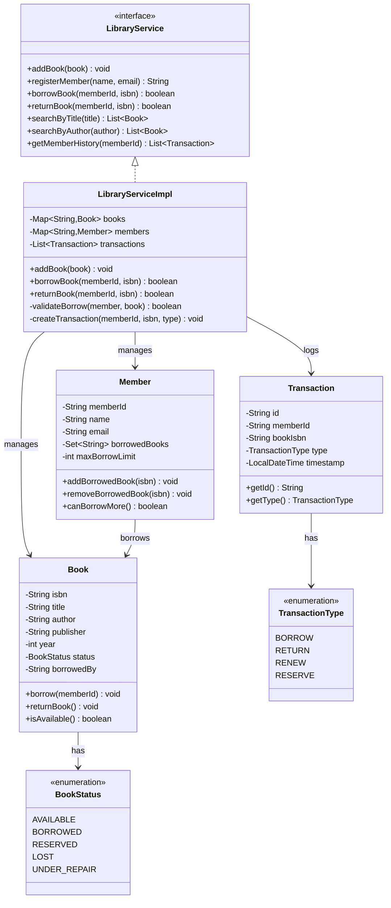

# Library Management System - Complete Implementation

A comprehensive library management system supporting book catalog management, member registration, borrowing/returning books, search functionality, and transaction history tracking.

## Quick Links
- [View Complete Source Code](/problems/library/CODE)
- [Project Structure](/problems/library/CODE#-directory-structure)

---

## Problem Statement

Design and implement a library management system that can:
- Manage a catalog of books with ISBN, title, author, and availability status
- Register library members with borrowing limits
- Handle book borrowing and returns with transaction tracking
- Search books by title or author
- Track member borrowing history
- Prevent concurrent borrowing conflicts
- Enforce borrowing limits per member

**Real-world applications**: Public libraries, university libraries, digital lending platforms (OverDrive), book rental services.

---

## Requirements

### Functional Requirements

1. **Book Catalog Management**
   - Add new books with ISBN (unique identifier)
   - Store book metadata: title, author, publisher, year
   - Track book status: AVAILABLE, BORROWED, RESERVED, LOST

2. **Member Management**
   - Register new members with auto-generated member ID
   - Store member details: name, email, contact
   - Track borrowing limits (e.g., max 5 books simultaneously)
   - Maintain list of currently borrowed books per member

3. **Borrowing Operations**
   - Borrow book (if available and member hasn't reached limit)
   - Return book and update availability
   - Record all transactions with timestamps
   - Validate member and book existence before operations

4. **Search Functionality**
   - Search books by title (case-insensitive, partial match)
   - Search books by author (case-insensitive, partial match)
   - Filter books by availability status
   - List all books borrowed by a member

5. **Transaction History**
   - Log all BORROW and RETURN transactions
   - Store member ID, book ISBN, transaction type, timestamp
   - Query transaction history by member
   - Generate borrowing reports

### Non-Functional Requirements

1. **Performance**
   - O(1) book lookup by ISBN
   - O(1) member lookup by ID
   - O(n) search operations (acceptable for < 100K books)
   - Sub-second response time for borrow/return

2. **Concurrency**
   - Thread-safe borrowing (prevent double-booking)
   - Synchronized access to book status updates
   - Concurrent searches without blocking writes
   - No race conditions in member borrow count

3. **Scalability**
   - Support 10,000+ books in catalog
   - Handle 1,000+ active members
   - Store 100,000+ transaction records
   - Efficient memory usage with Maps

4. **Data Integrity**
   - ISBN uniqueness enforced
   - Member cannot borrow same book twice
   - Book status always consistent with borrows
   - Transaction log immutable

---

## Class Diagram

<details>
<summary>View Mermaid Source</summary>



</details>


---
## Key Design Decisions

### 1. Synchronized Borrowing Operations
**Decision**: Use `synchronized` methods for `borrowBook()` and `returnBook()`.

**Rationale**:
- Prevents race condition: two members borrowing same book simultaneously
- Ensures atomic check-and-update of book status and member borrow list
- Simple to implement and reason about
- Acceptable performance for typical library scale (< 100 concurrent requests)

**Tradeoffs**:
- ✅ Correct concurrent behavior guaranteed
- ✅ No double-booking possible
- ❌ Serializes all borrow/return operations (bottleneck at scale)
- ❌ Read operations (search) not affected

**Alternative**: Use ReadWriteLock or fine-grained locks per book.

### 2. Immutable Transaction Log
**Decision**: Store transactions in append-only `ArrayList<Transaction>`.

**Rationale**:
- Audit trail for all library activities
- Transactions never modified after creation
- Simple to query by member or date range
- Can be persisted to DB or file for durability

**Tradeoffs**:
- ✅ Complete borrowing history
- ✅ Easy to generate reports
- ❌ Grows unbounded (needs archiving strategy)
- ❌ O(n) query performance (acceptable for < 100K transactions)

**Improvement**: Use database with indexed queries for production scale.

### 3. Member Borrowing Limit
**Decision**: Enforce max borrow limit (default 5) at borrowing time.

**Rationale**:
- Prevents hoarding of books
- Fair resource allocation among members
- Configurable per member type (student vs faculty)
- Easy to check: `borrowedBooks.size() < maxBorrowLimit`

**Tradeoffs**:
- ✅ Simple enforcement
- ✅ Can vary by member type
- ❌ Doesn't account for overdue books
- ❌ No priority/reservation system

### 4. Dual Book Storage
**Decision**: Maintain both `Map<ISBN, Book>` and include status in Book object.

**Rationale**:
- O(1) lookup by ISBN for borrow/return operations
- Status stored in Book for simplicity
- Can filter by status using streams
- Supports concurrent reads

**Tradeoffs**:
- ✅ Fast lookup
- ✅ Simple data model
- ❌ Search requires full scan
- ❌ No indexing by title/author

**Improvement**: Add inverted index for title/author search.

---

## Implementation Guide

### 1. Borrow Book Algorithm

```
Algorithm: BorrowBook(memberId, isbn)
Input: member ID, book ISBN
Output: boolean success

1. synchronized:
      member = members.get(memberId)
      book = books.get(isbn)

2. if member == null or book == null:
      return false

3. if !member.canBorrowMore():
      log("Member reached borrowing limit")
      return false

4. if book.status != AVAILABLE:
      log("Book not available")
      return false

5. // Update book status
   book.borrow(memberId)  // Sets status=BORROWED, borrowedBy=memberId

6. // Update member's borrowed list
   member.addBorrowedBook(isbn)

7. // Log transaction
   txn = new Transaction(UUID, memberId, isbn, BORROW)
   transactions.add(txn)

8. return true
```

**Time Complexity**: O(1)  
**Space Complexity**: O(1)

**Concurrency**: `synchronized` ensures atomicity of steps 3-7.

---

### 2. Return Book Algorithm

```
Algorithm: ReturnBook(memberId, isbn)
Input: member ID, book ISBN
Output: boolean success

1. synchronized:
      member = members.get(memberId)
      book = books.get(isbn)

2. if member == null or book == null:
      return false

3. if isbn not in member.borrowedBooks:
      log("Book not borrowed by this member")
      return false

4. // Update book status
   book.returnBook()  // Sets status=AVAILABLE, borrowedBy=null

5. // Update member's borrowed list
   member.removeBorrowedBook(isbn)

6. // Log transaction
   txn = new Transaction(UUID, memberId, isbn, RETURN)
   transactions.add(txn)

7. return true
```

**Time Complexity**: O(1)  
**Space Complexity**: O(1)

**Key Validation**: Check member actually borrowed the book (prevents fraud).

---

### 3. Search by Title Algorithm

```
Algorithm: SearchByTitle(query)
Input: title search query (case-insensitive)
Output: List of matching books

1. results = []

2. for each book in books.values():
      if book.title.toLowerCase().contains(query.toLowerCase()):
         results.add(book)

3. sort results by title (alphabetically)

4. return results
```

**Time Complexity**: O(n) where n = total books  
**Space Complexity**: O(k) where k = matching books

**Optimization**: Build inverted index: `Map<String, Set<ISBN>>` where key is word from title.

**With Index**:
```
1. words = tokenize(query)
2. candidateISBNs = Set intersection of index[word] for all words
3. return books for candidateISBNs
// Time: O(w + k) where w = words, k = results
```

---

### 4. Check Overdue Books Algorithm

**Extension**: Check for overdue books (not in base implementation).

```
Algorithm: GetOverdueBooks()
Input: none
Output: List of overdue books

1. currentDate = today()
   overdueBooks = []

2. for each transaction in transactions:
      if transaction.type == BORROW:
         borrowDate = transaction.timestamp
         dueDate = borrowDate + 14 days
         
         if currentDate > dueDate:
            // Check if not yet returned
            returned = hasReturnTransaction(transaction.memberId, transaction.isbn)
            
            if !returned:
               overdueBooks.add({
                  member: transaction.memberId,
                  book: transaction.isbn,
                  daysOverdue: currentDate - dueDate
               })

3. return overdueBooks
```

**Time Complexity**: O(t) where t = transactions  
**Space Complexity**: O(o) where o = overdue books

**Optimization**: Maintain separate `Map<ISBN, DueDate>` for active borrows.

---

### 5. Member Borrowing History Algorithm

```
Algorithm: GetMemberHistory(memberId)
Input: member ID
Output: List of transactions

1. history = []

2. for each transaction in transactions:
      if transaction.memberId == memberId:
         history.add(transaction)

3. sort history by timestamp (descending, most recent first)

4. return history
```

**Time Complexity**: O(t) where t = total transactions  
**Space Complexity**: O(h) where h = member's transactions

**Optimization**: Index transactions by member ID: `Map<MemberId, List<Transaction>>`.

---

## Source Code

All source code available in [CODE.md](/problems/library/CODE):

**Core** (4 files):
- [Book.java](/problems/library/CODE#bookjava)
- [Member.java](/problems/library/CODE#memberjava)
- [Library.java](/problems/library/CODE#libraryjava)
- [Demo.java](/problems/library/CODE#demojava)

**Service** (2 files):
- [api/LibraryService.java](/problems/library/CODE#apilibraryservicejava)
- [impl/LibraryServiceImpl.java](/problems/library/CODE#impllibraryserviceimpljava)

**Models** (5 files):
- [model/Book.java](/problems/library/CODE#modelbookjava)
- [model/Member.java](/problems/library/CODE#modelmemberjava)
- [model/Transaction.java](/problems/library/CODE#modeltransactionjava)
- [model/BookStatus.java](/problems/library/CODE#modelbookstatusjava)
- [model/TransactionType.java](/problems/library/CODE#modeltransactiontypejava)

**Total**: 11 files, ~550 lines of code

---
## Interview Discussion Points

### 1. Scalability to Large Libraries

**Q**: How to scale for 1 million books and 100K members?

**Approaches**:
- **Database Storage**: PostgreSQL with indexes on ISBN, title, author
  ```sql
  CREATE INDEX idx_title ON books USING GIN(to_tsvector('english', title));
  CREATE INDEX idx_author ON books(author);
  CREATE INDEX idx_status ON books(status) WHERE status = 'AVAILABLE';
  ```
  
- **Elasticsearch**: Full-text search with faceting
  ```json
  {
    "query": { "match": { "title": "Harry Potter" }},
    "filter": { "term": { "status": "AVAILABLE" }}
  }
  ```

- **Caching Layer**: Redis for frequently accessed books
  ```
  Key: book:{isbn}
  TTL: 1 hour
  Cache on read, invalidate on borrow/return
  ```

**Trade-offs**:
- DB: Network latency, need connection pooling
- Elasticsearch: Eventually consistent, more infrastructure
- Redis: Cache invalidation complexity

### 2. Fine Overdue Calculation

**Q**: How to calculate and enforce late fees?

**Implementation**:
```java
class LateFeeCalculator {
    private static final double FEE_PER_DAY = 0.50;
    private static final int GRACE_PERIOD_DAYS = 14;
    
    public double calculateFee(Transaction borrowTxn, LocalDate returnDate) {
        LocalDate dueDate = borrowTxn.getTimestamp()
                                      .plusDays(GRACE_PERIOD_DAYS)
                                      .toLocalDate();
        
        if (returnDate.isAfter(dueDate)) {
            long daysOverdue = ChronoUnit.DAYS.between(dueDate, returnDate);
            return daysOverdue * FEE_PER_DAY;
        }
        
        return 0.0;
    }
}

// In returnBook():
double fee = feeCalculator.calculateFee(borrowTxn, LocalDate.now());
if (fee > 0) {
    member.addFine(fee);
    System.out.println("Late fee: $" + fee);
}
```

**Extensions**: Progressive fees, max caps, waiver system.

### 3. Book Reservation System

**Q**: How to allow members to reserve books that are currently borrowed?

**Design**:
```java
class Book {
    private Queue<String> reservationQueue = new LinkedList<>();
    
    public boolean reserve(String memberId) {
        if (status == AVAILABLE) {
            return false; // Just borrow it
        }
        if (reservationQueue.size() >= MAX_RESERVATIONS) {
            return false; // Queue full
        }
        reservationQueue.offer(memberId);
        return true;
    }
}

// In returnBook():
if (!book.reservationQueue.isEmpty()) {
    String nextMember = book.reservationQueue.poll();
    book.setStatus(RESERVED);
    book.setReservedFor(nextMember);
    notifyMember(nextMember, "Your reserved book is available");
} else {
    book.setStatus(AVAILABLE);
}
```

**Challenges**: Reservation expiry (member doesn't pick up), notification system.

### 4. Multi-Copy Books

**Q**: How to handle multiple copies of the same book?

**Current**: One Book object per ISBN (single copy).

**Improvement**:
```java
class Book {
    private String isbn;
    private String title;
    private int totalCopies;
    private int availableCopies;
    private Map<String, String> copyIdToBorrower; // copyId -> memberId
}

// In borrowBook():
if (book.availableCopies > 0) {
    String copyId = book.getAvailableCopyId();
    book.copyIdToBorrower.put(copyId, memberId);
    book.availableCopies--;
    return true;
}
```

**Benefit**: Realistic library scenario, better availability.

### 5. Search Performance Optimization

**Q**: Current search is O(n). How to make it faster?

**Inverted Index**:
```java
class BookSearchIndex {
    // word -> set of ISBNs
    private Map<String, Set<String>> titleIndex = new HashMap<>();
    private Map<String, Set<String>> authorIndex = new HashMap<>();
    
    public void indexBook(Book book) {
        // Tokenize title
        for (String word : tokenize(book.getTitle())) {
            titleIndex.computeIfAbsent(word.toLowerCase(), k -> new HashSet<>())
                      .add(book.getIsbn());
        }
    }
    
    public List<Book> searchTitle(String query) {
        Set<String> isbns = new HashSet<>();
        for (String word : tokenize(query)) {
            Set<String> matches = titleIndex.get(word.toLowerCase());
            if (matches != null) {
                if (isbns.isEmpty()) {
                    isbns.addAll(matches);
                } else {
                    isbns.retainAll(matches); // AND operation
                }
            }
        }
        return isbns.stream().map(books::get).collect(toList());
    }
}
```

**Time Complexity**: O(w + k) where w = words, k = results (vs O(n) linear scan).

### 6. Concurrency Improvements

**Q**: Synchronized methods serialize all borrow/return. How to improve?

**Fine-Grained Locking**:
```java
class LibraryServiceImpl {
    private final Striped<Lock> bookLocks = Striped.lock(256); // Guava
    
    public boolean borrowBook(String memberId, String isbn) {
        Lock lock = bookLocks.get(isbn);
        lock.lock();
        try {
            // Only locks this specific book
            Book book = books.get(isbn);
            if (book.isAvailable()) {
                book.borrow(memberId);
                return true;
            }
            return false;
        } finally {
            lock.unlock();
        }
    }
}
```

**Benefit**: Different books can be borrowed concurrently.

**Alternative**: Optimistic locking with versioning.

---

## Extensions

1. **Digital Resources**: eBooks, audiobooks with download links
2. **Inter-Library Loan**: Request books from other libraries
3. **Reading Lists**: Curated lists by librarians
4. **Notifications**: Email/SMS for due dates, available reservations
5. **Analytics**: Popular books, usage patterns, collection gaps
6. **Fine Payments**: Integration with payment gateway

---

**See Also**: Library of Congress API, MARC records, Dewey Decimal Classification
