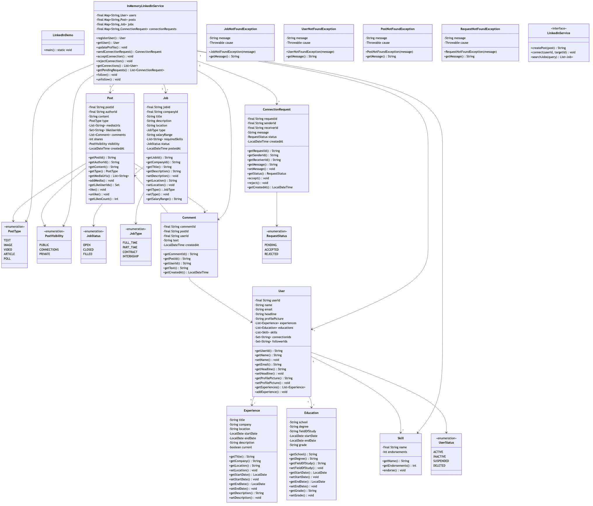

# LinkedIn Professional Networking System

## Overview
A comprehensive professional networking platform supporting user profiles, connections, feed, jobs, messaging, and content sharing. Implements graph-based connections, newsfeed ranking, job matching, and real-time messaging for career-focused social networking.

**Difficulty:** Hard  
**Domain:** Social Networking, Professional Network  
**Interview Frequency:** Very High (LinkedIn, Indeed, Glassdoor, AngelList)

## Requirements

### Functional Requirements
1. **User Profile Management**
   - Create/update professional profiles
   - Work experience, education, skills
   - Endorsements and recommendations
   - Profile visibility settings
   - Headline and summary

2. **Connection Management**
   - Send/accept/reject connection requests
   - 1st, 2nd, 3rd degree connections
   - Follow without connecting
   - Connection suggestions
   - Import contacts

3. **Newsfeed**
   - Post text, images, articles, videos
   - Like, comment, share posts
   - Feed ranking by relevance
   - Hashtags and mentions
   - Sponsored content

4. **Job Board**
   - Post job listings
   - Search and filter jobs
   - Apply with profile
   - Save jobs
   - Job recommendations

5. **Messaging**
   - 1-on-1 messaging
   - Group conversations
   - Read receipts
   - Typing indicators
   - File attachments

6. **Search**
   - People search
   - Company search
   - Job search
   - Advanced filters
   - Search suggestions

7. **Company Pages**
   - Company profiles
   - Follow companies
   - Company posts
   - Employee listings
   - Job postings

### Non-Functional Requirements
1. **Performance**
   - Feed load: < 2 seconds
   - Search: < 500ms
   - Messaging: < 100ms delivery
   - Support 1B+ users

2. **Scalability**
   - Graph database for connections
   - Distributed feed generation
   - Sharded user data
   - CDN for media

3. **Availability**
   - 99.99% uptime
   - Real-time updates
   - Multi-region deployment


## Class Diagram

```mermaid
classDiagram

    class LinkedInDemo {
        +main() static void
    }

    class InMemoryLinkedInService {
        -final Map~String,User~ users
        -final Map~String,Post~ posts
        -final Map~String,Job~ jobs
        -final Map~String,ConnectionRequest~ connectionRequests
        +registerUser() User
        +getUser() User
        +updateProfile() void
        +sendConnectionRequest() ConnectionRequest
        +acceptConnection() void
        +rejectConnection() void
        +getConnections() List~User~
        +getPendingRequests() List~ConnectionRequest~
        +follow() void
        +unfollow() void
    }

    class JobNotFoundException {
    }

    class UserNotFoundException {
    }

    class PostNotFoundException {
    }

    class RequestNotFoundException {
    }

    class Post {
        -final String postId
        -final String authorId
        -String content
        -PostType type
        -List~String~ mediaUrls
        -Set~String~ likeUserIds
        -List~Comment~ comments
        -int shares
        -PostVisibility visibility
        -LocalDateTime createdAt
        +getPostId() String
        +getAuthorId() String
        +getContent() String
        +getType() PostType
        +getMediaUrls() List~String~
        +addMedia() void
        +getLikeUserIds() Set<String>
        +like() void
        +unlike() void
        +getLikesCount() int
    }

    class Skill {
        -final String name
        -int endorsements
        +getName() String
        +getEndorsements() int
        +endorse() void
    }

    class PostType
    <<enumeration>> PostType

    class ConnectionRequest {
        -final String requestId
        -final String senderId
        -final String receiverId
        -String message
        -RequestStatus status
        -LocalDateTime createdAt
        +getRequestId() String
        +getSenderId() String
        +getReceiverId() String
        +getMessage() String
        +setMessage() void
        +getStatus() RequestStatus
        +accept() void
        +reject() void
        +getCreatedAt() LocalDateTime
    }

    class Job {
        -final String jobId
        -final String companyId
        -String title
        -String description
        -String location
        -JobType type
        -String salaryRange
        -List~String~ requiredSkills
        -JobStatus status
        -LocalDateTime postedAt
        +getJobId() String
        +getCompanyId() String
        +getTitle() String
        +getDescription() String
        +setDescription() void
        +getLocation() String
        +setLocation() void
        +getType() JobType
        +setType() void
        +getSalaryRange() String
    }

    class User {
        -final String userId
        -String name
        -String email
        -String headline
        -String profilePicture
        -List~Experience~ experiences
        -List~Education~ educations
        -List~Skill~ skills
        -Set~String~ connectionIds
        -Set~String~ followerIds
        +getUserId() String
        +getName() String
        +setName() void
        +getEmail() String
        +getHeadline() String
        +setHeadline() void
        +getProfilePicture() String
        +setProfilePicture() void
        +getExperiences() List~Experience~
        +addExperience() void
    }

    class PostVisibility
    <<enumeration>> PostVisibility

    class Experience {
        -String title
        -String company
        -String location
        -LocalDate startDate
        -LocalDate endDate
        -String description
        -boolean current
        +getTitle() String
        +getCompany() String
        +getLocation() String
        +setLocation() void
        +getStartDate() LocalDate
        +setStartDate() void
        +getEndDate() LocalDate
        +setEndDate() void
        +getDescription() String
        +setDescription() void
    }

    class JobStatus
    <<enumeration>> JobStatus

    class JobType
    <<enumeration>> JobType

    class Comment {
        -final String commentId
        -final String postId
        -final String userId
        -String text
        -LocalDateTime createdAt
        +getCommentId() String
        +getPostId() String
        +getUserId() String
        +getText() String
        +getCreatedAt() LocalDateTime
    }

    class UserStatus
    <<enumeration>> UserStatus

    class Education {
        -String school
        -String degree
        -String fieldOfStudy
        -LocalDate startDate
        -LocalDate endDate
        -String grade
        +getSchool() String
        +getDegree() String
        +getFieldOfStudy() String
        +setFieldOfStudy() void
        +getStartDate() LocalDate
        +setStartDate() void
        +getEndDate() LocalDate
        +setEndDate() void
        +getGrade() String
        +setGrade() void
    }

    class RequestStatus
    <<enumeration>> RequestStatus

    class LinkedInService
    <<interface>> LinkedInService

    InMemoryLinkedInService "1" --> "*" User
    InMemoryLinkedInService "1" --> "*" Post
    InMemoryLinkedInService "1" --> "*" Job
    InMemoryLinkedInService "1" --> "*" ConnectionRequest
    Post --> PostType
    Post "1" --> "*" Comment
    Post --> PostVisibility
    ConnectionRequest --> RequestStatus
    Job --> JobType
    Job --> JobStatus
    User "1" --> "*" Experience
    User "1" --> "*" Education
    User "1" --> "*" Skill
    User --> UserStatus
```

<details>
<summary>View Mermaid Source</summary>



</details>



## System Architecture

```
┌────────────────────────────────────────────────────┐
│            User Interface Layer                     │
│   (Web App, Mobile App, Browser Extension)         │
└────────────────┬───────────────────────────────────┘
                 │
     ┌───────────▼────────────┐
     │     API Gateway        │
     │  (Load Balancer, Auth) │
     └───────────┬────────────┘
                 │
   ┌─────────────┼─────────────┐
   │             │             │
┌──▼───┐  ┌──────▼──────┐  ┌──▼────┐
│Profile│  │ Connection  │  │ Feed  │
│Service│  │  Service    │  │Service│
│       │  │             │  │       │
│-Get   │  │ -Connect    │  │-Post  │
│-Update│  │ -Suggest    │  │-Rank  │
│-Skills│  │ -Degree     │  │-Filter│
└──┬───┘  └──────┬──────┘  └──┬────┘
   │             │             │
┌──▼───┐  ┌──────▼──────┐  ┌──▼────┐
│Profile│  │   Graph     │  │ Feed  │
│  DB   │  │     DB      │  │  DB   │
│       │  │  (Neo4j)    │  │       │
│Users  │  │             │  │Posts  │
│Skills │  │ Connections │  │Likes  │
└───────┘  └─────────────┘  └───────┘
```

## Core Data Model

### 1. User Profile
```java
public class UserProfile {
    private UserId id;
    private String firstName;
    private String lastName;
    private String email;
    private String headline; // "Software Engineer at Google"
    private String summary;
    private String profilePictureUrl;
    private String location;
    private List<WorkExperience> workExperience;
    private List<Education> education;
    private List<Skill> skills;
    private List<Certification> certifications;
    private ProfileVisibility visibility;
    private LocalDateTime createdAt;
    private int connectionCount;
    private int followerCount;
    
    public String getFullName() {
        return firstName + " " + lastName;
    }
    
    public boolean isPublic() {
        return visibility == ProfileVisibility.PUBLIC;
    }
}

class WorkExperience {
    private String title;
    private String company;
    private String location;
    private LocalDate startDate;
    private LocalDate endDate; // null if current
    private String description;
    private List<String> skills;
    
    public boolean isCurrent() {
        return endDate == null;
    }
    
    public Duration getDuration() {
        LocalDate end = endDate != null ? endDate : LocalDate.now();
        return Duration.between(startDate.atStartOfDay(), end.atStartOfDay());
    }
}

class Education {
    private String institution;
    private String degree;
    private String fieldOfStudy;
    private LocalDate startDate;
    private LocalDate endDate;
    private double gpa;
}

class Skill {
    private String name;
    private int endorsementCount;
    private List<UserId> endorsedBy;
}

enum ProfileVisibility {
    PUBLIC,           // Everyone
    CONNECTIONS_ONLY, // 1st connections
    PRIVATE           // Only me
}
```

### 2. Connection
```java
public class Connection {
    private ConnectionId id;
    private UserId userId1;
    private UserId userId2;
    private ConnectionStatus status;
    private LocalDateTime connectedAt;
    private String message; // Connection request message
    
    public boolean involves(UserId userId) {
        return userId1.equals(userId) || userId2.equals(userId);
    }
    
    public UserId getOtherUser(UserId userId) {
        return userId1.equals(userId) ? userId2 : userId1;
    }
}

enum ConnectionStatus {
    PENDING,   // Request sent, awaiting response
    ACCEPTED,  // Connected
    REJECTED,  // Request denied
    BLOCKED    // User blocked
}

class ConnectionRequest {
    private RequestId id;
    private UserId senderId;
    private UserId receiverId;
    private String message;
    private RequestStatus status;
    private LocalDateTime createdAt;
    private LocalDateTime respondedAt;
}

class ConnectionDegree {
    private UserId fromUser;
    private UserId toUser;
    private int degree; // 1, 2, 3, or more
    private List<UserId> path; // Path of connections
}
```

### 3. Post
```java
public class Post {
    private PostId id;
    private UserId authorId;
    private String content;
    private PostType type; // TEXT, IMAGE, VIDEO, ARTICLE
    private List<String> mediaUrls;
    private List<String> hashtags;
    private List<UserId> mentions;
    private PostVisibility visibility;
    private int likeCount;
    private int commentCount;
    private int shareCount;
    private LocalDateTime createdAt;
    private LocalDateTime editedAt;
    
    public void like(UserId userId) {
        likeCount++;
    }
    
    public void comment(Comment comment) {
        commentCount++;
    }
    
    public void share(UserId userId) {
        shareCount++;
    }
    
    public double getEngagementScore() {
        return likeCount * 1.0 + commentCount * 2.0 + shareCount * 3.0;
    }
}

enum PostType {
    TEXT,
    IMAGE,
    VIDEO,
    ARTICLE,
    POLL,
    JOB_POSTING
}

class Comment {
    private CommentId id;
    private PostId postId;
    private UserId authorId;
    private String content;
    private CommentId parentCommentId; // For nested comments
    private int likeCount;
    private LocalDateTime createdAt;
}
```

### 4. Job
```java
public class Job {
    private JobId id;
    private CompanyId companyId;
    private String title;
    private String description;
    private String location;
    private JobType type; // FULL_TIME, PART_TIME, CONTRACT, INTERNSHIP
    private WorkplaceType workplaceType; // ON_SITE, REMOTE, HYBRID
    private SalaryRange salaryRange;
    private ExperienceLevel experienceLevel;
    private List<String> requiredSkills;
    private List<String> preferredSkills;
    private JobStatus status;
    private LocalDateTime postedAt;
    private LocalDateTime expiresAt;
    private int applicationCount;
    private int viewCount;
    
    public boolean isActive() {
        return status == JobStatus.ACTIVE && 
               LocalDateTime.now().isBefore(expiresAt);
    }
    
    public boolean matchesSkills(List<String> candidateSkills) {
        Set<String> required = new HashSet<>(requiredSkills);
        Set<String> candidate = new HashSet<>(candidateSkills);
        required.retainAll(candidate);
        return required.size() >= (requiredSkills.size() * 0.7); // 70% match
    }
}

class JobApplication {
    private ApplicationId id;
    private JobId jobId;
    private UserId applicantId;
    private String coverLetter;
    private String resumeUrl;
    private ApplicationStatus status;
    private LocalDateTime appliedAt;
    private LocalDateTime reviewedAt;
}

enum ApplicationStatus {
    SUBMITTED,
    UNDER_REVIEW,
    SHORTLISTED,
    INTERVIEW_SCHEDULED,
    REJECTED,
    OFFER_EXTENDED,
    ACCEPTED,
    WITHDRAWN
}
```

### 5. Message
```java
public class Message {
    private MessageId id;
    private ConversationId conversationId;
    private UserId senderId;
    private String content;
    private MessageType type; // TEXT, IMAGE, FILE, LINK
    private String attachmentUrl;
    private LocalDateTime sentAt;
    private LocalDateTime readAt;
    private boolean isRead;
    
    public void markAsRead() {
        if (!isRead) {
            isRead = true;
            readAt = LocalDateTime.now();
        }
    }
}

class Conversation {
    private ConversationId id;
    private List<UserId> participants;
    private String name; // For group chats
    private Message lastMessage;
    private LocalDateTime lastMessageAt;
    private Map<UserId, LocalDateTime> lastReadAt;
    
    public int getUnreadCount(UserId userId) {
        LocalDateTime userLastRead = lastReadAt.get(userId);
        if (userLastRead == null) {
            return getAllMessages().size();
        }
        return (int) getAllMessages().stream()
            .filter(m -> m.getSentAt().isAfter(userLastRead))
            .count();
    }
}
```

## Key Algorithms

### 1. Connection Degree Calculation (BFS)
```java
public class ConnectionService {
    private final Graph<UserId> connectionGraph;
    
    public int getConnectionDegree(UserId from, UserId to) {
        if (from.equals(to)) {
            return 0;
        }
        
        if (connectionGraph.hasEdge(from, to)) {
            return 1; // Direct connection
        }
        
        // BFS to find shortest path
        Queue<UserId> queue = new LinkedList<>();
        Map<UserId, Integer> distances = new HashMap<>();
        
        queue.offer(from);
        distances.put(from, 0);
        
        while (!queue.isEmpty()) {
            UserId current = queue.poll();
            int currentDistance = distances.get(current);
            
            if (currentDistance >= 3) {
                break; // Only care about up to 3rd degree
            }
            
            for (UserId neighbor : connectionGraph.getNeighbors(current)) {
                if (!distances.containsKey(neighbor)) {
                    int newDistance = currentDistance + 1;
                    distances.put(neighbor, newDistance);
                    
                    if (neighbor.equals(to)) {
                        return newDistance;
                    }
                    
                    queue.offer(neighbor);
                }
            }
        }
        
        return distances.getOrDefault(to, Integer.MAX_VALUE);
    }
    
    public List<UserId> getConnectionPath(UserId from, UserId to) {
        Queue<UserId> queue = new LinkedList<>();
        Map<UserId, UserId> parent = new HashMap<>();
        
        queue.offer(from);
        parent.put(from, null);
        
        while (!queue.isEmpty()) {
            UserId current = queue.poll();
            
            if (current.equals(to)) {
                // Reconstruct path
                List<UserId> path = new ArrayList<>();
                UserId node = to;
                while (node != null) {
                    path.add(0, node);
                    node = parent.get(node);
                }
                return path;
            }
            
            for (UserId neighbor : connectionGraph.getNeighbors(current)) {
                if (!parent.containsKey(neighbor)) {
                    parent.put(neighbor, current);
                    queue.offer(neighbor);
                }
            }
        }
        
        return Collections.emptyList();
    }
}
```

**Time Complexity:** O(V + E) for BFS where V=users, E=connections  
**Space Complexity:** O(V) for visited set

### 2. Connection Suggestions (Mutual Connections)
```java
public class ConnectionSuggestionService {
    
    public List<UserProfile> getSuggestions(UserId userId, int limit) {
        // Strategy 1: Friends of friends (2nd degree connections)
        List<UserProfile> mutualConnections = getMutualConnections(userId, limit * 2);
        
        // Strategy 2: Same company/school
        List<UserProfile> sameOrganization = getSameOrganization(userId, limit);
        
        // Strategy 3: Similar skills
        List<UserProfile> similarSkills = getSimilarSkills(userId, limit);
        
        // Combine and rank
        Map<UserId, Double> scores = new HashMap<>();
        
        for (UserProfile user : mutualConnections) {
            scores.merge(user.getId(), 10.0, Double::sum);
        }
        
        for (UserProfile user : sameOrganization) {
            scores.merge(user.getId(), 5.0, Double::sum);
        }
        
        for (UserProfile user : similarSkills) {
            scores.merge(user.getId(), 3.0, Double::sum);
        }
        
        return scores.entrySet().stream()
            .sorted(Map.Entry.<UserId, Double>comparingByValue().reversed())
            .limit(limit)
            .map(e -> userService.getProfile(e.getKey()))
            .collect(Collectors.toList());
    }
    
    private List<UserProfile> getMutualConnections(UserId userId, int limit) {
        // Get user's 1st degree connections
        Set<UserId> firstDegree = connectionService.getConnections(userId);
        
        // Get their connections (2nd degree)
        Map<UserId, Integer> mutualCount = new HashMap<>();
        
        for (UserId connection : firstDegree) {
            Set<UserId> theirConnections = connectionService.getConnections(connection);
            
            for (UserId secondDegree : theirConnections) {
                if (!secondDegree.equals(userId) && !firstDegree.contains(secondDegree)) {
                    mutualCount.merge(secondDegree, 1, Integer::sum);
                }
            }
        }
        
        // Return users with most mutual connections
        return mutualCount.entrySet().stream()
            .sorted(Map.Entry.<UserId, Integer>comparingByValue().reversed())
            .limit(limit)
            .map(e -> userService.getProfile(e.getKey()))
            .collect(Collectors.toList());
    }
}
```

### 3. Newsfeed Ranking Algorithm
```java
public class NewsfeedService {
    
    public List<Post> generateFeed(UserId userId, int limit) {
        // Step 1: Get candidate posts
        List<Post> candidates = getCandidatePosts(userId);
        
        // Step 2: Score each post
        List<ScoredPost> scored = candidates.stream()
            .map(post -> new ScoredPost(post, calculateScore(post, userId)))
            .collect(Collectors.toList());
        
        // Step 3: Sort by score and apply diversity
        return applyDiversity(scored).stream()
            .limit(limit)
            .map(ScoredPost::getPost)
            .collect(Collectors.toList());
    }
    
    private List<Post> getCandidatePosts(UserId userId) {
        Set<UserId> connections = connectionService.getConnections(userId);
        Set<CompanyId> followedCompanies = followService.getFollowedCompanies(userId);
        
        // Get posts from connections
        List<Post> connectionPosts = postService.getPostsByAuthors(connections);
        
        // Get posts from followed companies
        List<Post> companyPosts = postService.getPostsByCompanies(followedCompanies);
        
        // Get viral posts from network
        List<Post> viralPosts = postService.getViralPosts(connections);
        
        // Combine
        List<Post> all = new ArrayList<>();
        all.addAll(connectionPosts);
        all.addAll(companyPosts);
        all.addAll(viralPosts);
        
        return all;
    }
    
    private double calculateScore(Post post, UserId userId) {
        double score = 0.0;
        
        // Recency (exponential decay)
        long hoursOld = ChronoUnit.HOURS.between(post.getCreatedAt(), LocalDateTime.now());
        double recencyScore = Math.exp(-hoursOld / 24.0); // Decay over 24 hours
        score += recencyScore * 0.3;
        
        // Engagement (likes, comments, shares)
        double engagementScore = Math.log(1 + post.getEngagementScore()) / 10.0;
        score += engagementScore * 0.3;
        
        // Author relevance (connection degree)
        int degree = connectionService.getConnectionDegree(userId, post.getAuthorId());
        double authorScore = degree == 1 ? 1.0 : (degree == 2 ? 0.5 : 0.1);
        score += authorScore * 0.2;
        
        // Content type (videos get boost)
        if (post.getType() == PostType.VIDEO) {
            score += 0.1;
        }
        
        // User interactions (has user engaged with author before?)
        if (hasRecentInteraction(userId, post.getAuthorId())) {
            score += 0.1;
        }
        
        return score;
    }
    
    private List<ScoredPost> applyDiversity(List<ScoredPost> posts) {
        // Avoid showing multiple posts from same author consecutively
        List<ScoredPost> result = new ArrayList<>();
        Set<UserId> recentAuthors = new HashSet<>();
        
        posts.sort(Comparator.comparingDouble(ScoredPost::getScore).reversed());
        
        for (ScoredPost scoredPost : posts) {
            UserId authorId = scoredPost.getPost().getAuthorId();
            
            if (!recentAuthors.contains(authorId)) {
                result.add(scoredPost);
                recentAuthors.add(authorId);
                
                if (recentAuthors.size() > 3) {
                    recentAuthors.clear();
                }
            }
        }
        
        return result;
    }
}
```

**Ranking Factors:**
- **Recency:** 30% - Newer posts ranked higher
- **Engagement:** 30% - Likes, comments, shares
- **Author Relevance:** 20% - Connection degree
- **Content Type:** 10% - Video > Image > Text
- **User Interaction:** 10% - Past engagement with author

### 4. Job Matching Algorithm
```java
public class JobMatchingService {
    
    public List<Job> getJobRecommendations(UserId userId, int limit) {
        UserProfile profile = profileService.getProfile(userId);
        
        // Get all active jobs
        List<Job> activeJobs = jobService.getActiveJobs();
        
        // Score each job for this user
        List<ScoredJob> scored = activeJobs.stream()
            .map(job -> new ScoredJob(job, calculateMatchScore(job, profile)))
            .filter(sj -> sj.getScore() > 0.3) // Minimum 30% match
            .sorted(Comparator.comparingDouble(ScoredJob::getScore).reversed())
            .collect(Collectors.toList());
        
        return scored.stream()
            .limit(limit)
            .map(ScoredJob::getJob)
            .collect(Collectors.toList());
    }
    
    private double calculateMatchScore(Job job, UserProfile profile) {
        double score = 0.0;
        
        // Skill match
        Set<String> jobSkills = new HashSet<>(job.getRequiredSkills());
        Set<String> userSkills = profile.getSkills().stream()
            .map(Skill::getName)
            .collect(Collectors.toSet());
        
        Set<String> intersection = new HashSet<>(jobSkills);
        intersection.retainAll(userSkills);
        
        double skillMatch = (double) intersection.size() / jobSkills.size();
        score += skillMatch * 0.5;
        
        // Experience level match
        int userExperience = calculateYearsOfExperience(profile);
        if (job.getExperienceLevel().matches(userExperience)) {
            score += 0.2;
        }
        
        // Location match
        if (job.getLocation().equals(profile.getLocation()) || 
            job.getWorkplaceType() == WorkplaceType.REMOTE) {
            score += 0.15;
        }
        
        // Job type preference
        if (profile.getPreferredJobType() == job.getType()) {
            score += 0.1;
        }
        
        // Recent applications in same field
        if (hasRecentApplicationsInField(profile.getId(), job.getCompanyId())) {
            score += 0.05;
        }
        
        return score;
    }
}
```

## Design Patterns

### 1. Strategy Pattern (Feed Ranking)
```java
interface FeedRankingStrategy {
    double score(Post post, UserId userId);
}

class RecencyBasedRanking implements FeedRankingStrategy {
    public double score(Post post, UserId userId) {
        // Score based on recency
    }
}

class EngagementBasedRanking implements FeedRankingStrategy {
    public double score(Post post, UserId userId) {
        // Score based on engagement
    }
}
```

### 2. Observer Pattern (Notifications)
```java
interface ActivityObserver {
    void onConnection(UserId user1, UserId user2);
    void onPostLike(Post post, UserId liker);
    void onComment(Post post, Comment comment);
}

class NotificationObserver implements ActivityObserver {
    public void onPostLike(Post post, UserId liker) {
        notificationService.notify(post.getAuthorId(), 
            liker.getName() + " liked your post");
    }
}
```

### 3. Factory Pattern (Post Creation)
```java
interface PostFactory {
    Post createPost(PostRequest request);
}

class TextPostFactory implements PostFactory {
    public Post createPost(PostRequest request) {
        return new TextPost(request.getContent());
    }
}

class VideoPostFactory implements PostFactory {
    public Post createPost(PostRequest request) {
        return new VideoPost(request.getContent(), request.getVideoUrl());
    }
}
```

## Source Code

📄 **[View Complete Source Code](/problems/linkedin/CODE)**

**Key Files:**
- [`ProfileService.java`](/problems/linkedin/CODE#profileservicejava) - Profile management
- [`ConnectionService.java`](/problems/linkedin/CODE#connectionservicejava) - Connection graph
- [`NewsfeedService.java`](/problems/linkedin/CODE#newsfeedservicejava) - Feed ranking
- [`JobMatchingService.java`](/problems/linkedin/CODE#jobmatchingservicejava) - Job recommendations

**Total Lines of Code:** ~1400 lines

## Usage Example

```java
// Initialize LinkedIn system
LinkedInSystem linkedin = new LinkedInSystem();

// Create profile
UserProfile profile = UserProfile.builder()
    .firstName("John")
    .lastName("Doe")
    .headline("Software Engineer at Google")
    .addWorkExperience(new WorkExperience("Engineer", "Google", ...))
    .addSkill(new Skill("Java"))
    .build();

linkedin.createProfile(profile);

// Send connection request
ConnectionRequest request = linkedin.sendConnectionRequest(
    userId, targetUserId, "Hi, let's connect!");

// Get connection degree
int degree = linkedin.getConnectionDegree(userId, otherUserId);
System.out.println("Connection degree: " + degree);

// Get connection suggestions
List<UserProfile> suggestions = linkedin.getConnectionSuggestions(userId, 10);

// Create post
Post post = linkedin.createPost(userId, "Excited to announce...", PostType.TEXT);

// Get newsfeed
List<Post> feed = linkedin.getNewsfeed(userId, 20);

// Search jobs
List<Job> jobs = linkedin.searchJobs("Software Engineer", "San Francisco");

// Apply to job
linkedin.applyToJob(userId, jobId, coverLetter, resumeUrl);
```

## Common Interview Questions

### System Design Questions

1. **How do you calculate connection degrees efficiently?**
   - Graph database (Neo4j)
   - BFS for shortest path
   - Cache common connections
   - Precompute for popular users

2. **How do you generate personalized newsfeeds?**
   - Fanout on write (push model)
   - Fanout on read (pull model)
   - Hybrid approach (celebrities use pull)
   - Score and rank posts

3. **How do you scale connection graph to 1B users?**
   - Shard graph by user ID
   - Replicate for read-heavy workload
   - Use adjacency lists
   - Cache connection counts

4. **How do you handle real-time messaging?**
   - WebSocket connections
   - Message queue (Kafka)
   - Delivery guarantees (at-least-once)
   - Read receipts with acknowledgments

### Coding Questions

1. **Find mutual connections**
   ```java
   Set<UserId> findMutual(UserId u1, UserId u2) {
       Set<UserId> c1 = getConnections(u1);
       Set<UserId> c2 = getConnections(u2);
       c1.retainAll(c2);
       return c1;
   }
   ```

2. **Calculate feed score**
   ```java
   double scorePost(Post post, UserId viewer) {
       double recency = Math.exp(-hoursOld / 24.0);
       double engagement = Math.log(1 + post.getLikes());
       return recency * 0.5 + engagement * 0.5;
   }
   ```

### Algorithm Questions
1. **Time complexity of BFS?** → O(V + E)
2. **How to find shortest path?** → BFS for unweighted graph
3. **How to rank posts?** → Scoring + sorting: O(N log N)

## Trade-offs & Design Decisions

### 1. Fanout on Write vs Fanout on Read
**Fanout on Write:** Fast read, slow write  
**Fanout on Read:** Slow read, fast write

**Decision:** Hybrid (celebrities use read, others write)

### 2. Graph DB vs Relational DB
**Graph DB:** Fast traversal, complex queries  
**Relational:** ACID, more mature

**Decision:** Graph DB (Neo4j) for connections

### 3. Real-time vs Batch Updates
**Real-time:** Immediate, expensive  
**Batch:** Delayed, efficient

**Decision:** Real-time for messaging, batch for feed

### 4. Public vs Private Profiles
**Public:** More reach, privacy concerns  
**Private:** Secure, limited networking

**Decision:** Configurable privacy settings

## Key Takeaways

### What Interviewers Look For
1. ✅ **Graph traversal** (BFS for connections)
2. ✅ **Feed ranking** algorithm
3. ✅ **Job matching** algorithm
4. ✅ **Real-time messaging** architecture
5. ✅ **Scalability** (sharding, caching)
6. ✅ **Privacy** considerations

### Common Mistakes to Avoid
1. ❌ Not using graph database
2. ❌ Linear feed generation (O(N²))
3. ❌ No connection degree limits
4. ❌ Ignoring privacy settings
5. ❌ Poor newsfeed ranking
6. ❌ Not handling celebrity users

### Production-Ready Checklist
- [x] User profiles
- [x] Connection management
- [x] Newsfeed with ranking
- [x] Job board
- [x] Messaging
- [ ] Company pages
- [ ] Groups
- [ ] Events
- [ ] Learning platform
- [ ] Analytics

---

## Related Problems
- 👥 **Social Network** - Similar graph structure
- 💼 **Job Board** - Job matching
- 💬 **Messaging** - Real-time chat
- 📊 **Newsfeed** - Content ranking

## References
- LinkedIn Architecture: Graph database at scale
- Neo4j: Graph database
- BFS Algorithm: Shortest path
- Feed Ranking: EdgeRank algorithm

---

*Production-ready professional networking platform with connection graph, newsfeed ranking, and job matching. Essential for social network interviews.*
