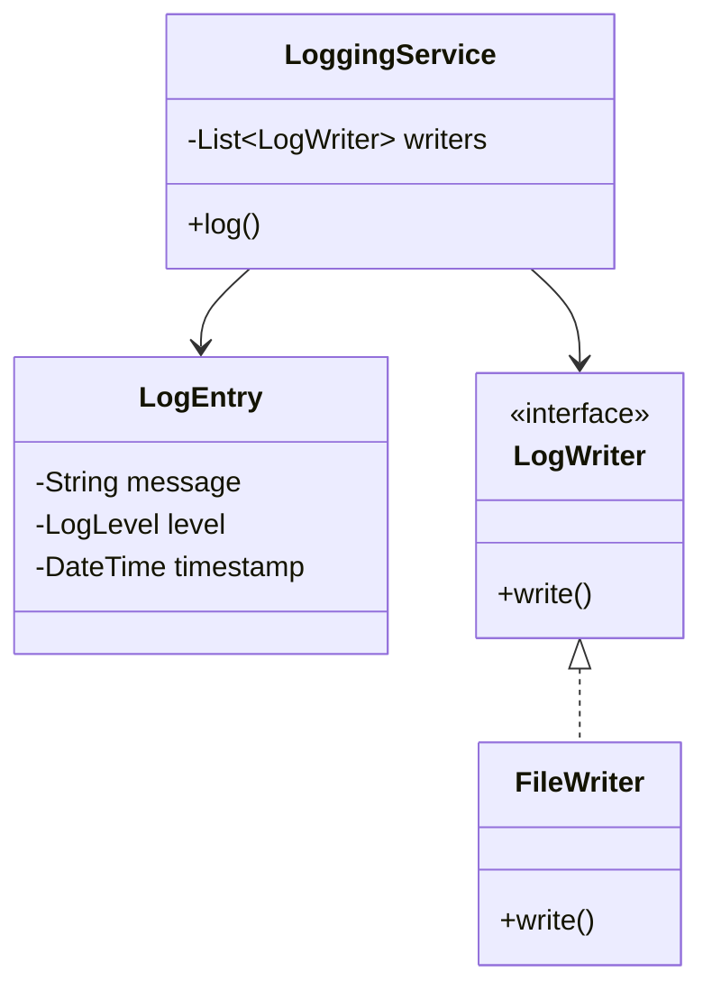

# Distributed Logging System

## Overview
A centralized logging aggregation and analysis platform that collects logs from multiple distributed sources, provides real-time search, visualization, alerting, and long-term storage. Essential for monitoring large-scale distributed systems and troubleshooting production issues.

**Difficulty:** Hard  
**Domain:** Infrastructure, Observability, Distributed Systems  
**Interview Frequency:** Very High (Splunk, Datadog, Elasticsearch, AWS CloudWatch)

## Requirements

### Functional Requirements
1. **Log Collection**
   - Collect logs from multiple sources (apps, servers, containers)
   - Support various log formats (JSON, syslog, plain text)
   - Handle high-volume ingestion (millions of logs/sec)
   - Batch and streaming collection

2. **Log Storage**
   - Time-series optimized storage
   - Compression for space efficiency
   - Retention policies (7 days, 30 days, 1 year)
   - Hot/warm/cold storage tiers

3. **Search & Query**
   - Full-text search across all logs
   - Time-range queries
   - Field-based filtering
   - Aggregations and statistics

4. **Visualization**
   - Real-time dashboards
   - Log tailing
   - Graphs and charts
   - Custom views

5. **Alerting**
   - Pattern-based alerts
   - Threshold alerts
   - Anomaly detection
   - Multi-channel notifications

6. **Analytics**
   - Log analysis and correlation
   - Error rate tracking
   - Performance metrics
   - Trend analysis

### Non-Functional Requirements
1. **Scalability**
   - Handle 1M+ logs/second
   - Horizontal scaling
   - Petabyte-scale storage

2. **Performance**
   - Ingestion latency < 1s
   - Search response < 2s
   - Real-time streaming

3. **Reliability**
   - 99.9% availability
   - No data loss
   - Automatic failover

4. **Durability**
   - Replication across zones
   - Backup and recovery
   - Point-in-time restore

## Class Diagram

<details>
<summary>View Mermaid Source</summary>



</details>


## System Architecture

```
┌─────────────────────────────────────────────────────────────┐
│                    Application Servers                       │
│  (Web, API, Microservices, Databases, Infrastructure)       │
└──────────────────────┬──────────────────────────────────────┘
                       │
           ┌───────────┴───────────┐
           │                       │
    ┌──────▼──────┐        ┌──────▼──────┐
    │ Log Agents  │        │  Sidecar    │
    │  (Filebeat) │        │  (Fluentd)  │
    └──────┬──────┘        └──────┬──────┘
           │                       │
           └───────────┬───────────┘
                       │
              ┌────────▼─────────┐
              │   Message Queue  │
              │     (Kafka)      │
              └────────┬─────────┘
                       │
          ┌────────────┼────────────┐
          │            │            │
    ┌─────▼─────┐ ┌───▼────┐ ┌────▼─────┐
    │  Parser   │ │ Filter │ │ Enricher │
    │ Service   │ │Service │ │ Service  │
    └─────┬─────┘ └───┬────┘ └────┬─────┘
          │            │            │
          └────────────┼────────────┘
                       │
              ┌────────▼─────────┐
              │  Indexing Engine │
              │ (Elasticsearch)  │
              └────────┬─────────┘
                       │
          ┌────────────┼────────────┐
          │            │            │
    ┌─────▼─────┐ ┌───▼────┐ ┌────▼─────┐
    │   Query   │ │ Alert  │ │Visualize │
    │  Service  │ │Service │ │ Service  │
    └─────┬─────┘ └───┬────┘ └────┬─────┘
          │            │            │
          └────────────┼────────────┘
                       │
              ┌────────▼─────────┐
              │    Dashboard     │
              │  (Kibana/Grafana)│
              └──────────────────┘
```

## Core Components

### 1. Log Collection Pipeline

#### Log Agent (Filebeat/Fluentd)
```java
public class LogAgent {
    private BlockingQueue<LogEntry> buffer;
    private KafkaProducer<String, LogEntry> producer;
    
    public void collectLog(String logLine) {
        // Parse log line
        LogEntry entry = parseLog(logLine);
        
        // Add metadata
        entry.setHostname(hostname);
        entry.setTimestamp(System.currentTimeMillis());
        entry.setSource(sourceName);
        
        // Buffer and send
        buffer.offer(entry);
        
        // Batch send to Kafka
        if (buffer.size() >= BATCH_SIZE || isTimeoutReached()) {
            sendBatch();
        }
    }
    
    private void sendBatch() {
        List<LogEntry> batch = new ArrayList<>();
        buffer.drainTo(batch, BATCH_SIZE);
        
        for (LogEntry entry : batch) {
            producer.send(new ProducerRecord<>("logs", entry));
        }
    }
}
```

**Time Complexity:** O(1) per log  
**Space Complexity:** O(B) where B = batch size

#### Log Parsing
```java
public class LogParser {
    private Map<String, Pattern> patterns;
    
    public ParsedLog parse(String logLine) {
        // Try each pattern
        for (Map.Entry<String, Pattern> entry : patterns.entrySet()) {
            Matcher matcher = entry.getValue().matcher(logLine);
            if (matcher.matches()) {
                return extractFields(matcher, entry.getKey());
            }
        }
        
        // Default: unstructured
        return new ParsedLog(logLine);
    }
    
    // Example patterns
    // Apache: 127.0.0.1 - - [10/Oct/2000:13:55:36] "GET /index.html" 200
    // JSON: {"level":"ERROR","message":"Connection failed","timestamp":"2024-01-01T10:00:00Z"}
    // Syslog: <34>Oct 11 22:14:15 mymachine su[1234]: user login failed
}
```

### 2. Indexing & Storage

#### Time-Series Index
```java
public class TimeSeriesIndex {
    private Map<String, Index> dailyIndices; // One index per day
    
    public void indexLog(LogEntry log) {
        String indexName = getIndexName(log.getTimestamp());
        Index index = dailyIndices.computeIfAbsent(
            indexName,
            k -> createNewIndex(k)
        );
        
        index.addDocument(log);
    }
    
    private String getIndexName(long timestamp) {
        return "logs-" + formatDate(timestamp); // e.g., logs-2024-01-15
    }
    
    // Automatic rollover
    public void rolloverIndices() {
        for (Map.Entry<String, Index> entry : dailyIndices.entrySet()) {
            if (isOlderThan(entry.getKey(), retentionDays)) {
                deleteIndex(entry.getKey());
            }
        }
    }
}
```

#### Inverted Index (Elasticsearch-style)
```java
public class InvertedIndex {
    // term -> list of document IDs containing the term
    private Map<String, List<Integer>> index;
    
    public void indexDocument(int docId, String content) {
        String[] terms = tokenize(content);
        
        for (String term : terms) {
            index.computeIfAbsent(term, k -> new ArrayList<>())
                 .add(docId);
        }
    }
    
    public List<Integer> search(String query) {
        String[] terms = tokenize(query);
        
        // Intersect document lists for AND query
        List<Integer> result = index.get(terms[0]);
        for (int i = 1; i < terms.length; i++) {
            result = intersect(result, index.get(terms[i]));
        }
        
        return result;
    }
}
```

**Time Complexity:** O(T) for indexing, O(Q*D) for search  
**Space Complexity:** O(N*M) where N=docs, M=unique terms

### 3. Query Processing

#### Log Search
```java
public class LogSearchService {
    private ElasticsearchClient client;
    
    public SearchResult search(SearchQuery query) {
        // Build Elasticsearch query
        QueryBuilder esQuery = QueryBuilders.boolQuery()
            .must(QueryBuilders.matchQuery("message", query.getText()))
            .filter(QueryBuilders.rangeQuery("timestamp")
                .gte(query.getStartTime())
                .lte(query.getEndTime()))
            .filter(QueryBuilders.termQuery("level", query.getLevel()));
        
        // Execute search
        SearchResponse response = client.search(
            s -> s.index("logs-*")
                  .query(esQuery)
                  .size(query.getLimit())
                  .sort(SortOptions.of(so -> so
                      .field(f -> f.field("timestamp").order(SortOrder.Desc))
                  ))
        );
        
        return parseResponse(response);
    }
}
```

#### Aggregation Queries
```java
public Map<String, Long> getErrorCounts(long startTime, long endTime) {
    // Count errors by service
    AggregationBuilder agg = AggregationBuilders
        .terms("by_service")
        .field("service.keyword")
        .subAggregation(
            AggregationBuilders.filter("errors")
                .filter(QueryBuilders.termQuery("level", "ERROR"))
        );
    
    SearchResponse response = search(query, agg);
    
    // Parse aggregation results
    return parseAggregation(response);
}
```

### 4. Alerting System

#### Pattern-Based Alerts
```java
public class AlertEngine {
    private List<AlertRule> rules;
    
    public void processLog(LogEntry log) {
        for (AlertRule rule : rules) {
            if (rule.matches(log)) {
                triggerAlert(rule, log);
            }
        }
    }
    
    private void triggerAlert(AlertRule rule, LogEntry log) {
        Alert alert = Alert.builder()
            .rule(rule.getName())
            .severity(rule.getSeverity())
            .message(String.format("Alert: %s - %s", 
                rule.getName(), log.getMessage()))
            .timestamp(log.getTimestamp())
            .build();
        
        // Send to notification service
        notificationService.send(alert, rule.getChannels());
    }
}
```

#### Anomaly Detection
```java
public class AnomalyDetector {
    private Map<String, Statistics> baseline;
    
    public boolean isAnomaly(String metric, double value) {
        Statistics stats = baseline.get(metric);
        if (stats == null) return false;
        
        // Z-score based detection
        double zScore = (value - stats.getMean()) / stats.getStdDev();
        
        return Math.abs(zScore) > 3.0; // 3 standard deviations
    }
    
    public void updateBaseline(String metric, double value) {
        baseline.computeIfAbsent(metric, k -> new Statistics())
                .addValue(value);
    }
}
```

## Design Patterns

### 1. Pipeline Pattern
**Purpose:** Process logs through multiple stages

```java
interface LogProcessor {
    LogEntry process(LogEntry log);
}

class ParseProcessor implements LogProcessor {
    public LogEntry process(LogEntry log) {
        return parser.parse(log);
    }
}

class EnrichProcessor implements LogProcessor {
    public LogEntry process(LogEntry log) {
        log.setGeoLocation(geoLocate(log.getIp()));
        log.setUserAgent(parseUserAgent(log.getUserAgent()));
        return log;
    }
}

class LogPipeline {
    private List<LogProcessor> processors;
    
    public LogEntry process(LogEntry log) {
        for (LogProcessor processor : processors) {
            log = processor.process(log);
        }
        return log;
    }
}
```

### 2. Observer Pattern (Alerts)
```java
interface AlertObserver {
    void onAlert(Alert alert);
}

class EmailAlerter implements AlertObserver {
    public void onAlert(Alert alert) {
        sendEmail(alert);
    }
}

class SlackAlerter implements AlertObserver {
    public void onAlert(Alert alert) {
        postToSlack(alert);
    }
}
```

### 3. Strategy Pattern (Storage)
```java
interface StorageStrategy {
    void store(LogEntry log);
}

class HotStorage implements StorageStrategy {
    // Fast SSD, expensive, recent logs
    public void store(LogEntry log) {
        elasticsearch.index(log);
    }
}

class ColdStorage implements StorageStrategy {
    // S3, cheap, old logs
    public void store(LogEntry log) {
        s3.upload(compress(log));
    }
}
```

## Source Code

📄 **[View Complete Source Code](/problems/logging/CODE)**

**Key Files:**
- [`LoggingService.java`](/problems/logging/CODE#loggingservicejava) - Main service
- [`LogCollector.java`](/problems/logging/CODE#logcollectorjava) - Collection agent
- [`LogParser.java`](/problems/logging/CODE#logparserjava) - Parsing logic
- [`SearchService.java`](/problems/logging/CODE#searchservicejava) - Query processing
- [`AlertEngine.java`](/problems/logging/CODE#alertenginejava) - Alerting system

**Total Lines of Code:** ~800 lines

## Usage Example

```java
// Initialize logging system
LoggingService loggingService = new LoggingServiceImpl();

// Collect log
LogEntry log = LogEntry.builder()
    .level(LogLevel.ERROR)
    .message("Database connection failed")
    .service("user-service")
    .host("app-server-1")
    .timestamp(System.currentTimeMillis())
    .attributes(Map.of(
        "error_code", "DB_CONN_TIMEOUT",
        "retry_count", "3"
    ))
    .build();

loggingService.ingest(log);

// Search logs
SearchQuery query = SearchQuery.builder()
    .text("database connection")
    .level(LogLevel.ERROR)
    .startTime(now.minusHours(24))
    .endTime(now)
    .limit(100)
    .build();

List<LogEntry> results = loggingService.search(query);

// Create alert rule
AlertRule rule = AlertRule.builder()
    .name("High Error Rate")
    .condition("level:ERROR AND service:user-service")
    .threshold(10) // 10 errors per minute
    .window(Duration.ofMinutes(1))
    .channels(List.of("email", "slack"))
    .build();

loggingService.addAlertRule(rule);

// Get aggregations
Map<String, Long> errorsByService = loggingService.aggregateBy(
    "service",
    query
);
```

## Common Interview Questions

### System Design Questions

1. **How do you handle millions of logs per second?**
   - Kafka for buffering and load distribution
   - Multiple indexing workers in parallel
   - Batch processing (1000 logs per batch)
   - Horizontal scaling of indexing nodes

2. **How do you make log search fast?**
   - Inverted index (Elasticsearch/Lucene)
   - Time-based sharding (one index per day)
   - Field-level indexing for common queries
   - Caching frequent queries

3. **How do you ensure no log loss?**
   - Kafka's durability guarantees
   - Replication factor 3
   - Acknowledgment from indexing service
   - Dead letter queue for failed logs

4. **How do you optimize storage costs?**
   - Compression (gzip, lz4)
   - Hot/warm/cold tiering
   - Retention policies
   - Sampling for low-priority logs

### Coding Questions

1. **Implement log parsing for common formats**
   ```java
   public LogEntry parseApacheLog(String line) {
       // 127.0.0.1 - - [10/Oct/2000:13:55:36] "GET /index.html" 200
       Pattern pattern = Pattern.compile(
           "(\\S+) - - \\[([^\\]]+)\\] \"(\\w+) ([^\"]+)\" (\\d+)"
       );
       Matcher matcher = pattern.matcher(line);
       if (matcher.matches()) {
           return LogEntry.builder()
               .ip(matcher.group(1))
               .timestamp(parseDate(matcher.group(2)))
               .method(matcher.group(3))
               .path(matcher.group(4))
               .status(Integer.parseInt(matcher.group(5)))
               .build();
       }
       return null;
   }
   ```

2. **Implement sliding window error rate counter**
   ```java
   public class ErrorRateCounter {
       private Queue<Long> timestamps;
       private long windowMs;
       
       public void addError(long timestamp) {
           timestamps.offer(timestamp);
           removeOldErrors(timestamp);
       }
       
       private void removeOldErrors(long currentTime) {
           while (!timestamps.isEmpty() && 
                  timestamps.peek() < currentTime - windowMs) {
               timestamps.poll();
           }
       }
       
       public int getErrorCount() {
           return timestamps.size();
       }
   }
   ```

3. **Implement log correlation by trace ID**
   ```java
   public List<LogEntry> getTraceLog(String traceId) {
       return logs.stream()
           .filter(log -> traceId.equals(log.getTraceId()))
           .sorted(Comparator.comparing(LogEntry::getTimestamp))
           .collect(Collectors.toList());
   }
   ```

### Design Pattern Questions
1. **Which pattern for log processing pipeline?** → Pipeline Pattern
2. **Which pattern for alert notifications?** → Observer Pattern
3. **Which pattern for storage tiers?** → Strategy Pattern

## Trade-offs & Design Decisions

### 1. Push vs Pull Log Collection
**Push (Agent sends):** Real-time, network overhead  
**Pull (Server fetches):** Batch-friendly, delay

**Decision:** Push for real-time, Pull for batch

### 2. Structured vs Unstructured Logs
**Structured (JSON):** Easy to parse, larger size  
**Unstructured (Text):** Flexible, requires parsing

**Decision:** Encourage JSON, support both

### 3. Synchronous vs Asynchronous Indexing
**Sync:** Immediate search, slower ingestion  
**Async:** Fast ingestion, search delay

**Decision:** Async with Kafka buffer

### 4. Single Index vs Time-Based Sharding
**Single:** Simple, poor performance at scale  
**Time-Based:** Complex, excellent performance

**Decision:** Daily indices for balance

## Performance Optimizations

### 1. Batch Processing
```java
// Instead of indexing one by one
for (LogEntry log : logs) {
    index.add(log); // Slow: 1000 requests
}

// Batch indexing
BulkRequest bulk = new BulkRequest();
for (LogEntry log : logs) {
    bulk.add(new IndexRequest().source(log));
}
client.bulk(bulk); // Fast: 1 request
```

### 2. Compression
```java
public byte[] compress(LogEntry log) {
    String json = toJson(log);
    return gzip(json); // 80% size reduction
}
```

### 3. Sampling
```java
public boolean shouldSample(LogEntry log) {
    if (log.getLevel() == LogLevel.ERROR) {
        return true; // Always keep errors
    }
    
    // Sample 10% of INFO logs
    if (log.getLevel() == LogLevel.INFO) {
        return ThreadLocalRandom.current().nextDouble() < 0.1;
    }
    
    return false;
}
```

## Key Takeaways

### What Interviewers Look For
1. ✅ **Scalable architecture** (Kafka, Elasticsearch)
2. ✅ **Efficient indexing** (inverted index, sharding)
3. ✅ **Search optimization** (caching, time-based)
4. ✅ **Storage strategy** (hot/warm/cold)
5. ✅ **Real-time alerting**
6. ✅ **Cost optimization** (compression, retention)

### Common Mistakes to Avoid
1. ❌ Synchronous log processing (blocks application)
2. ❌ Single large index (slow queries)
3. ❌ No compression (expensive storage)
4. ❌ No retention policy (infinite growth)
5. ❌ Ignoring structured logging
6. ❌ No sampling for high-volume logs

### Production-Ready Checklist
- [x] Kafka for buffering
- [x] Elasticsearch for indexing
- [x] Time-based sharding
- [x] Alerting system
- [x] Dashboard (Kibana/Grafana)
- [ ] Multi-region replication
- [ ] Encryption at rest
- [ ] RBAC for log access
- [ ] Cost monitoring
- [ ] SLA tracking

---

## Related Problems
- 📊 **Monitoring System** - Metrics collection
- 🔍 **Search Engine** - Similar indexing
- 🚨 **Alerting System** - Notification delivery
- 📈 **Analytics Platform** - Data aggregation

## References
- ELK Stack: Elasticsearch, Logstash, Kibana
- Splunk Architecture: Enterprise logging
- AWS CloudWatch: Cloud logging service
- Kafka: Distributed streaming platform

---

*Production-ready distributed logging system with Elasticsearch-style indexing, real-time search, and alerting. Essential for monitoring large-scale distributed systems.*
