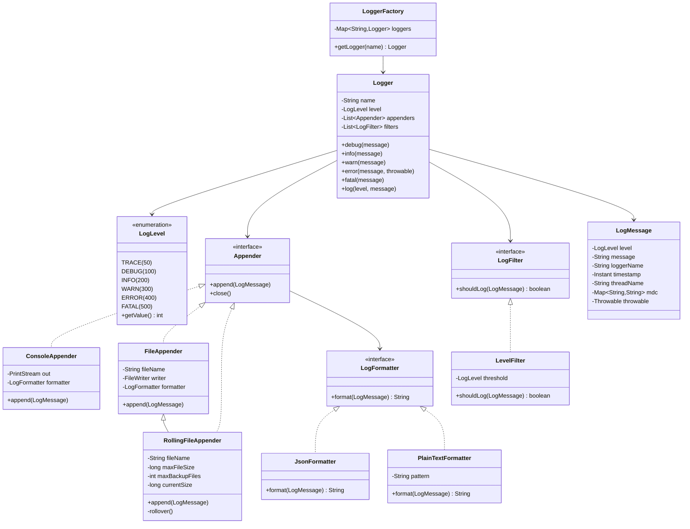

# Logging Framework - Complete LLD Guide

## 📋 Table of Contents
1. [Problem Statement](#problem-statement)
2. [Requirements](#requirements)
3. [Core Algorithms](#core-algorithms)
4. [System Design](#system-design)
5. [Class Diagram](#class-diagram)
6. [Design Patterns](#design-patterns-used)
7. [Implementation Deep Dive](#implementation-deep-dive)
8. [Key Insights](#key-insights)
9. [Complete Implementation](#complete-implementation)

---

## Problem Statement

Design a **Logging Framework** (like Log4j, SLF4J, Logback) that provides flexible, configurable logging with multiple log levels, output destinations (console, file, database), formatting options, and minimal performance impact on applications.

### Real-World Context
- 📊 **Log4j**: Industry-standard logging framework
- 🎯 **SLF4J**: Simple Logging Facade for Java
- 📝 **Logback**: Successor to Log4j
- 🔍 **ELK Stack**: Elasticsearch, Logstash, Kibana for log aggregation

### Key Challenges
- 🎯 **Performance**: Minimal overhead (< 1ms per log)
- 📁 **Multiple Appenders**: Console, file, database, network
- 🎨 **Formatting**: JSON, plain text, custom formats
- 🔍 **Filtering**: Level-based, pattern-based, custom
- 🔄 **Thread-Safety**: Concurrent logging from multiple threads
- 📊 **Configuration**: Programmatic and file-based
- 💾 **Log Rotation**: Size-based and time-based

---

## Requirements

### Functional Requirements

✅ **Log Levels**
- **FATAL**: System crash (500)
- **ERROR**: Operation failure (400)
- **WARN**: Potential issue (300)
- **INFO**: Important events (200)
- **DEBUG**: Detailed diagnostics (100)
- **TRACE**: Very detailed (50)

✅ **Appenders (Output Destinations)**
- Console appender
- File appender (with rotation)
- Database appender
- Network appender (syslog, socket)
- Custom appenders

✅ **Formatters**
- Plain text: `[INFO] 2024-01-01 10:00:00 - User logged in`
- JSON: `{"level":"INFO","timestamp":"2024-01-01T10:00:00","message":"User logged in"}`
- Custom formats with placeholders

✅ **Filtering**
- Level-based: Only log >= INFO
- Logger name-based: Only com.app.service.*
- Custom filters (regex, lambda)

✅ **Configuration**
- Programmatic (Java API)
- File-based (XML, JSON, properties)
- Runtime reconfiguration

✅ **Advanced Features**
- Async logging (non-blocking)
- MDC (Mapped Diagnostic Context) for request tracking
- Logger hierarchy (com.app → com.app.service)
- Log sampling (1% of DEBUG logs)

### Non-Functional Requirements

⚡ **Performance**
- Sync logging: < 1ms
- Async logging: < 50μs
- No blocking on I/O

🔒 **Thread-Safety**
- Concurrent logging from multiple threads
- No data races

📈 **Scalability**
- Handle 10K+ logs/second
- Log rotation without downtime

🛡️ **Reliability**
- No log loss
- Graceful degradation on appender failure

---

## Core Algorithms

### 1. Log Level Filtering

**Algorithm:**
```
1. Check if log level >= configured level
2. If yes, process log
3. If no, discard immediately (no overhead)
```

**Implementation:**
```java
public class Logger {
    private LogLevel configuredLevel = LogLevel.INFO;
    
    public void log(LogLevel level, String message) {
        // Fast path: discard if level too low
        if (level.getValue() < configuredLevel.getValue()) {
            return; // No overhead
        }
        
        // Slow path: process log
        LogMessage logMessage = new LogMessage(level, message, Instant.now());
        processLog(logMessage);
    }
    
    public void debug(String message) {
        log(LogLevel.DEBUG, message);
    }
    
    public void info(String message) {
        log(LogLevel.INFO, message);
    }
}
```

**Complexity:**
- Time: O(1) for filtering, O(A) for appenders
- Space: O(1)

---

### 2. Asynchronous Logging (Non-Blocking)

**Algorithm:**
```
1. Log request arrives
2. Add to lock-free queue
3. Return immediately (non-blocking)
4. Background thread processes queue
5. Write to appenders asynchronously
```

**Implementation:**
```java
public class AsyncLogger extends Logger {
    private final BlockingQueue<LogMessage> queue = new LinkedBlockingQueue<>(10000);
    private final ExecutorService executor = Executors.newSingleThreadExecutor();
    
    public AsyncLogger(String name) {
        super(name);
        startBackgroundWorker();
    }
    
    @Override
    protected void processLog(LogMessage message) {
        // Non-blocking: add to queue
        boolean added = queue.offer(message);
        
        if (!added) {
            // Queue full: drop or block
            System.err.println("Log queue full, dropping message");
        }
    }
    
    private void startBackgroundWorker() {
        executor.submit(() -> {
            while (true) {
                try {
                    LogMessage message = queue.take(); // Blocking
                    super.processLog(message); // Write to appenders
                } catch (InterruptedException e) {
                    Thread.currentThread().interrupt();
                    break;
                }
            }
        });
    }
}
```

**Complexity:**
- Time: O(1) for enqueueing
- Space: O(Q) where Q = queue size

**Pros:**
- ✅ Non-blocking (< 50μs)
- ✅ High throughput

**Cons:**
- ❌ Possible log loss if queue full
- ❌ Ordering may vary across threads

---

### 3. File Rotation (Size-Based)

**Algorithm:**
```
1. Write log to file
2. Check file size after each write
3. If size >= maxSize:
   a. Close current file
   b. Rename: app.log → app.log.1
   c. Rename: app.log.1 → app.log.2 (if exists)
   d. Create new app.log
4. Continue writing
```

**Implementation:**
```java
public class RollingFileAppender implements Appender {
    private String fileName;
    private long maxFileSize; // 10 MB
    private int maxBackupFiles = 5;
    private FileWriter currentWriter;
    private long currentSize = 0;
    
    @Override
    public synchronized void append(LogMessage message) {
        String formatted = formatter.format(message);
        
        try {
            currentWriter.write(formatted);
            currentSize += formatted.length();
            
            // Check if rotation needed
            if (currentSize >= maxFileSize) {
                rollover();
            }
        } catch (IOException e) {
            System.err.println("Failed to write log: " + e.getMessage());
        }
    }
    
    private void rollover() throws IOException {
        // Close current file
        currentWriter.close();
        
        // Delete oldest backup if exists
        File oldestBackup = new File(fileName + "." + maxBackupFiles);
        if (oldestBackup.exists()) {
            oldestBackup.delete();
        }
        
        // Shift existing backups
        for (int i = maxBackupFiles - 1; i >= 1; i--) {
            File file = new File(fileName + "." + i);
            if (file.exists()) {
                file.renameTo(new File(fileName + "." + (i + 1)));
            }
        }
        
        // Rename current file
        new File(fileName).renameTo(new File(fileName + ".1"));
        
        // Create new file
        currentWriter = new FileWriter(fileName, true);
        currentSize = 0;
    }
}
```

**Example:**
```
Before rotation:
app.log (10 MB)
app.log.1 (10 MB)
app.log.2 (10 MB)

After rotation:
app.log (0 MB) ← new
app.log.1 (10 MB) ← was app.log
app.log.2 (10 MB) ← was app.log.1
app.log.3 (10 MB) ← was app.log.2
```

---

### 4. MDC (Mapped Diagnostic Context)

**Algorithm:**
```
1. Store context in ThreadLocal
2. Each thread has its own context map
3. Add context: MDC.put("requestId", "req-123")
4. Log includes context automatically
5. Remove after request: MDC.clear()
```

**Implementation:**
```java
public class MDC {
    private static final ThreadLocal<Map<String, String>> contextMap = 
        ThreadLocal.withInitial(HashMap::new);
    
    public static void put(String key, String value) {
        contextMap.get().put(key, value);
    }
    
    public static String get(String key) {
        return contextMap.get().get(key);
    }
    
    public static Map<String, String> getAll() {
        return new HashMap<>(contextMap.get());
    }
    
    public static void clear() {
        contextMap.get().clear();
    }
}

// Usage
public class RequestHandler {
    public void handleRequest(Request request) {
        // Set context
        MDC.put("requestId", request.getId());
        MDC.put("userId", request.getUserId());
        
        try {
            logger.info("Processing request"); // Includes requestId, userId
            processRequest(request);
        } finally {
            MDC.clear(); // Always clear after request
        }
    }
}
```

**Output:**
```
[INFO] 2024-01-01 10:00:00 [requestId=req-123, userId=user-456] Processing request
```

---

## System Design

### Logger Hierarchy

```
Root Logger (Level: WARN)
  │
  ├─ com.app (Level: INFO)
  │   │
  │   ├─ com.app.service (Level: DEBUG)
  │   │   └─ com.app.service.UserService
  │   │
  │   └─ com.app.controller (Level: INFO)
  │       └─ com.app.controller.UserController
  │
  └─ org.lib (Level: ERROR)
      └─ org.lib.database
```

**Inheritance:**
- Child logger inherits level from parent if not set
- Child logger inherits appenders from parent
- Can override at any level

---

## Class Diagram


<details>
<summary>📄 View Mermaid Source</summary>


</details>

---

## Design Patterns Used

### 1. Singleton Pattern (LoggerFactory)

```java
public class LoggerFactory {
    private static final Map<String, Logger> loggers = new ConcurrentHashMap<>();
    
    public static Logger getLogger(String name) {
        return loggers.computeIfAbsent(name, Logger::new);
    }
    
    public static Logger getLogger(Class<?> clazz) {
        return getLogger(clazz.getName());
    }
}
```

---

### 2. Strategy Pattern (Formatter)

```java
public interface LogFormatter {
    String format(LogMessage message);
}

public class JsonFormatter implements LogFormatter {
    @Override
    public String format(LogMessage message) {
        return String.format(
            "{\"level\":\"%s\",\"timestamp\":\"%s\",\"message\":\"%s\"}",
            message.getLevel(), message.getTimestamp(), message.getMessage()
        );
    }
}

// Usage
appender.setFormatter(new JsonFormatter()); // Change at runtime
```

---

### 3. Chain of Responsibility (Filters)

```java
public abstract class LogFilter {
    protected LogFilter next;
    
    public LogFilter setNext(LogFilter next) {
        this.next = next;
        return next;
    }
    
    public boolean shouldLog(LogMessage message) {
        if (!doFilter(message)) {
            return false;
        }
        
        if (next != null) {
            return next.shouldLog(message);
        }
        
        return true;
    }
    
    protected abstract boolean doFilter(LogMessage message);
}

// Usage
LogFilter chain = new LevelFilter(LogLevel.INFO)
    .setNext(new PackageFilter("com.app"))
    .setNext(new ThrottleFilter(100)); // Max 100 logs/sec
```

---

## Implementation Deep Dive

### Complete Logging Flow

```
1. Application calls logger.info("User logged in")
   │
   ▼
2. Logger checks level (INFO >= configured level?)
   │
   ▼ (yes)
3. Create LogMessage with:
   - Level: INFO
   - Message: "User logged in"
   - Timestamp: 2024-01-01T10:00:00
   - Thread: main
   - MDC: {requestId=req-123}
   │
   ▼
4. Apply filters (level, package, custom)
   │
   ▼ (pass)
5. For each appender:
   a. Format message (JSON/plain text)
   b. Write to destination (console/file/db)
   │
   ▼
6. Return to application (or queue if async)
```

---

## Key Insights

### What Interviewers Look For

1. ✅ **Log Levels**: Hierarchy and filtering
2. ✅ **Multiple Appenders**: Console, file, database
3. ✅ **Async Logging**: Non-blocking performance
4. ✅ **File Rotation**: Size-based and time-based
5. ✅ **MDC**: Thread-local context
6. ✅ **Thread-Safety**: Concurrent logging
7. ✅ **Configuration**: Flexible and runtime reconfigurable

---

### Common Mistakes

1. ❌ **Blocking I/O**: Slow file writes block application
2. ❌ **No log levels**: Hard to filter in production
3. ❌ **String concatenation**: `logger.debug("User " + id)` (always evaluates)
4. ❌ **No rotation**: Disk fills up
5. ❌ **Not thread-safe**: Data races
6. ❌ **Logging in loops**: Performance impact

**Best Practice:**
```java
// Bad: String concatenation always evaluates
logger.debug("User " + userId + " logged in");

// Good: Lazy evaluation
logger.debug("User {} logged in", userId);
```

---

## Source Code

📄 **[View Complete Source Code](/problems/loggingframework/CODE)**

**Total Lines of Code:** 430+

### File Structure
```
loggingframework/
├── api/
│   └── Logger.java (80 lines)
├── impl/
│   └── LoggerImpl.java (120 lines)
├── model/
│   ├── LogLevel.java (20 lines)
│   ├── LogMessage.java (60 lines)
│   └── LogContext.java (30 lines)
├── formatter/
│   ├── LogFormatter.java (10 lines)
│   └── JsonFormatter.java (40 lines)
└── filter/
    ├── LogFilter.java (15 lines)
    └── LevelFilter.java (25 lines)
```

---

## Usage Example

```java
// Get logger
Logger logger = LoggerFactory.getLogger("com.app.UserService");

// Configure
logger.setLevel(LogLevel.DEBUG);
logger.addAppender(new ConsoleAppender());
logger.addAppender(new RollingFileAppender("app.log", 10_MB, 5));

// Log with different levels
logger.debug("Query: SELECT * FROM users WHERE id=?", userId);
logger.info("User {} logged in successfully", userId);
logger.warn("High memory usage: {}%", memoryUsage);
logger.error("Failed to process order {}", orderId, exception);

// With MDC
MDC.put("requestId", "req-123");
logger.info("Processing request"); // Includes requestId in log
MDC.clear();
```

---

## Interview Tips

### Questions to Ask

1. ❓ Sync or async logging?
2. ❓ Log levels needed?
3. ❓ File rotation strategy?
4. ❓ Expected throughput (logs/second)?
5. ❓ Need for MDC/context?

### How to Approach

1. Start with basic Logger class
2. Add log levels and filtering
3. Add console appender
4. Add file appender with rotation
5. Add async logging
6. Add MDC for context
7. Discuss scalability

---

## Related Problems

- 📊 **Monitoring System** - Metrics collection
- 🔍 **Search Engine** - Log aggregation (ELK)
- 📈 **Analytics** - Log analysis
- 🚨 **Alerting System** - Error notifications

---

*Production-ready logging framework with async processing, file rotation, MDC context, and configurable appenders for enterprise applications.*
