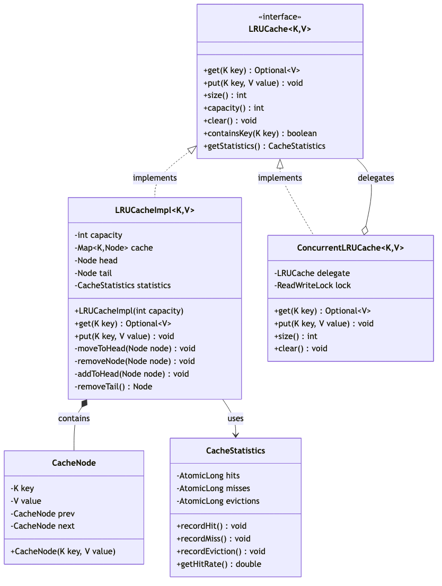
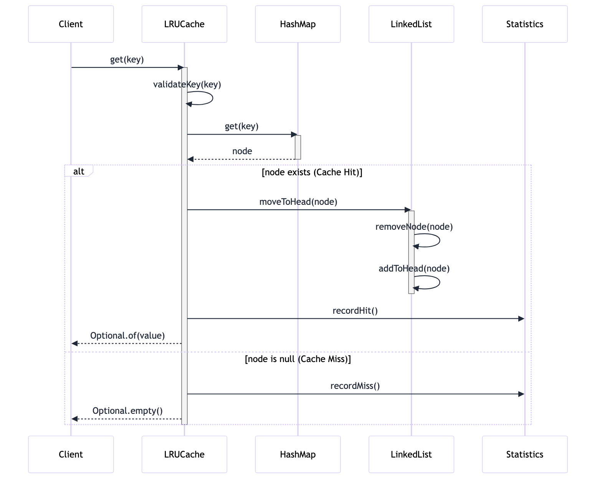
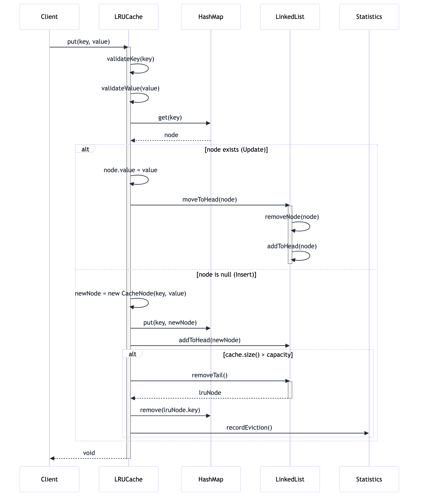
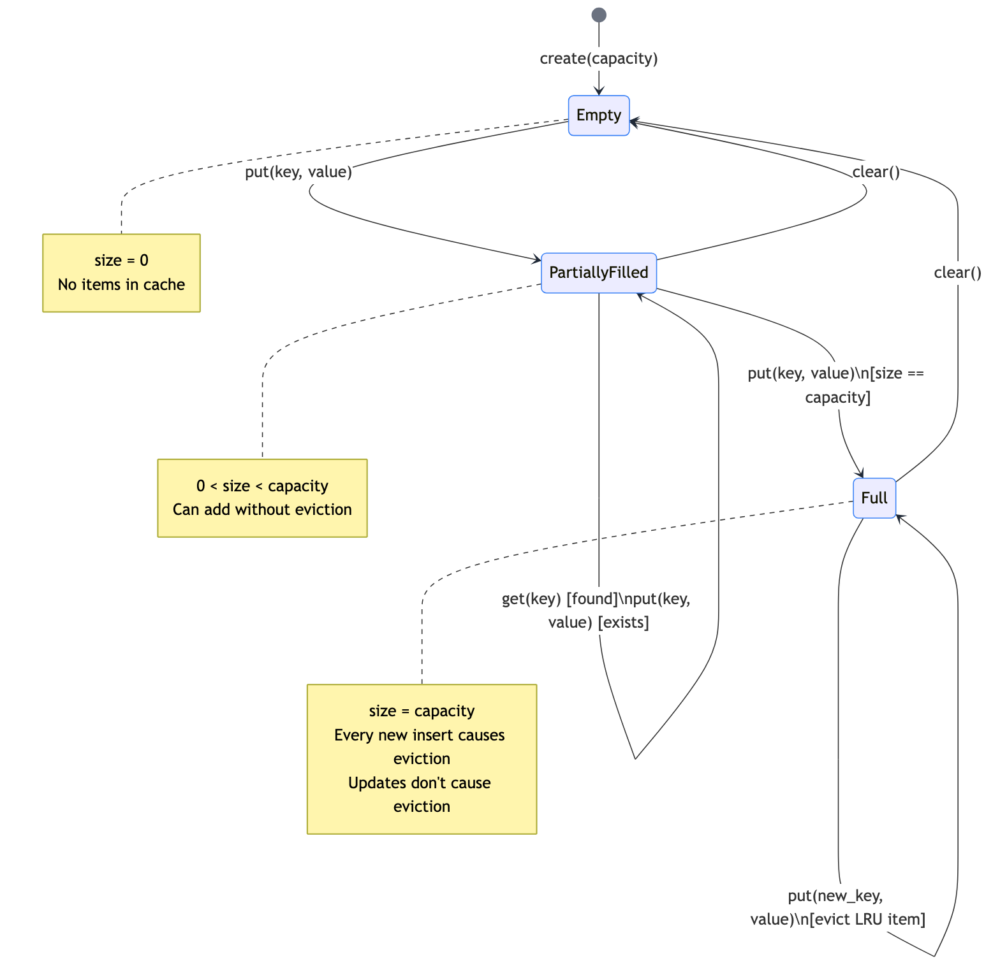

# Problem: LRU Cache

## Requirements

### Functional Requirements
1. **Put(key, value)**: Insert or update a key-value pair
2. **Get(key)**: Retrieve value by key, return null if not found
3. **Capacity Management**: When cache is full, evict the Least Recently Used (LRU) item
4. **Access Tracking**: Both get and put operations count as "using" an item
5. **Thread Safety**: Support concurrent access (optional extension)

### Non-Functional Requirements (NFRs)
- **Latency**: O(1) time complexity for both get and put operations
- **Memory**: O(capacity) space complexity
- **Scalability**: Should efficiently handle capacities from 1 to 10,000+ items
- **Extensibility**: Design should allow easy extension to other eviction policies (LFU, FIFO)
- **Reliability**: No data loss for items within capacity

### Out of Scope
- Distributed caching across multiple nodes
- Persistent storage (in-memory only)
- Time-based expiration (TTL)
- Cache warming strategies
- Hit/miss statistics (can be added as extension)

## Domain Model

### Core Entities

#### **LRUCache<K, V>** (Interface)
- **Purpose**: Defines the contract for cache operations
- **Invariants**:
  - Capacity must be positive (> 0)
  - Cache size never exceeds capacity
  - Most recently used items are preserved when at capacity

#### **CacheNode<K, V>** (Value Object)
- **Purpose**: Represents a single cache entry
- **Properties**:
  - `key`: K (immutable)
  - `value`: V (mutable)
  - `prev`: CacheNode reference
  - `next`: CacheNode reference
- **Invariants**: Key is immutable once set

#### **EvictionPolicy** (Strategy)
- **Purpose**: Encapsulates the eviction logic
- **Implementations**: LRU, LFU, FIFO, Random

### Key Design Decisions

1. **HashMap + Doubly Linked List**: 
   - HashMap provides O(1) key lookup
   - Doubly linked list maintains access order for O(1) eviction

2. **Head/Tail Sentinels**: 
   - Simplifies node insertion/removal logic
   - Eliminates null checks

3. **Generic Types**: 
   - Support any key-value types
   - Key must be hashable (proper equals/hashCode)

## Diagrams

### Class Diagram



### Sequence Diagrams

**Get Operation:**


**Put Operation:**


### State Diagram



---

## Key Design Decisions

### Data Structure: HashMap + Doubly Linked List

```
class LRUCacheImpl~K,V~ {
        -int capacity
        -Map~K,CacheNode~K,V~~ cache
        -CacheNode~K,V~ head
        -CacheNode~K,V~ tail
        +LRUCacheImpl(int capacity)
        +get(K key) Optional~V~
        +put(K key, V value) void
        -moveToHead(CacheNode~K,V~ node) void
        -removeNode(CacheNode~K,V~ node) void
        -addToHead(CacheNode~K,V~ node) void
        -removeTail() CacheNode~K,V~
    }

    class CacheNode~K,V~ {
        -K key
        -V value
        -CacheNode~K,V~ prev
        -CacheNode~K,V~ next
        +CacheNode(K key, V value)
        +getKey() K
        +getValue() V
        +setValue(V value) void
    }

    class ConcurrentLRUCache~K,V~ {
        -ReadWriteLock lock
        -LRUCache~K,V~ delegate
        +get(K key) Optional~V~
        +put(K key, V value) void
    }

    class CacheStatistics {
        -long hits
        -long misses
        -long evictions
        +recordHit() void
        +recordMiss() void
        +recordEviction() void
        +getHitRate() double
    }

    LRUCache <|.. LRUCacheImpl : implements
    LRUCache <|.. ConcurrentLRUCache : implements
    LRUCacheImpl *-- CacheNode : contains
    LRUCacheImpl --> CacheStatistics : uses
    ConcurrentLRUCache o-- LRUCache : delegates

---

## API Design

### Core Interface

```java
public interface LRUCache<K, V> {
    /**
     * Retrieves value for the given key.
     * Marks the key as recently used.
     * 
     * @param key the key to lookup
     * @return Optional containing value if found, empty otherwise
     * @throws IllegalArgumentException if key is null
     */
    Optional<V> get(K key);
    
    /**
     * Inserts or updates key-value pair.
     * Marks the key as recently used.
     * If cache is full, evicts LRU item.
     * 
     * @param key the key to insert/update
     * @param value the value to store
     * @throws IllegalArgumentException if key or value is null
     * @throws IllegalStateException if capacity is 0
     */
    void put(K key, V value);
    
    /**
     * @return current number of items in cache
     */
    int size();
    
    /**
     * @return maximum capacity of cache
     */
    int capacity();
    
    /**
     * Removes all entries from cache
     */
    void clear();
    
    /**
     * @param key the key to check
     * @return true if key exists in cache
     */
    boolean containsKey(K key);
}
```

### Error Taxonomy

1. **IllegalArgumentException**: 
   - Null key or value
   - Negative or zero capacity in constructor

2. **IllegalStateException**:
   - Attempting operations on a closed/invalid cache
   - Internal consistency violations

3. **ConcurrentModificationException** (for thread-safe version):
   - Detected concurrent modifications

## Testing Strategy

### Unit Tests

1. **Basic Operations**
   - Single get/put operations
   - Get non-existent key
   - Update existing key

2. **Capacity Management**
   - Fill to capacity
   - Eviction on overflow
   - Correct LRU item evicted

3. **Access Order**
   - Get updates recency
   - Put updates recency
   - Multiple operations maintain correct order

4. **Edge Cases**
   - Capacity = 1
   - Capacity = 0 (should throw exception)
   - Null keys/values
   - Clear operation

5. **Concurrency** (for thread-safe version)
   - Concurrent reads
   - Concurrent writes
   - Mixed read/write operations

### Property-Based Tests

1. **Invariants**
   - Size never exceeds capacity
   - All keys in HashMap are in LinkedList and vice versa
   - Head is most recently used
   - Tail is least recently used

2. **Properties**
   - Sequential put/get operations are idempotent
   - Get doesn't change cache contents (only order)
   - Put with same key updates value but maintains single entry

### Performance Tests

1. **Latency**: Verify O(1) operations with large datasets
2. **Memory**: Verify O(capacity) space usage
3. **Scalability**: Test with varying capacities (1, 100, 10000)

## Trade-offs (ADR)

### ADR 1: HashMap + Doubly Linked List vs. LinkedHashMap

**Decision**: Implement using HashMap + Doubly Linked List

**Alternatives Considered**:
1. **LinkedHashMap with accessOrder=true**
   - ✅ Java standard library, battle-tested
   - ✅ Less code to write
   - ❌ Less control over implementation details
   - ❌ Harder to extend with custom eviction policies
   - ❌ Less educational value

2. **Custom HashMap + Doubly Linked List**
   - ✅ Full control over data structure
   - ✅ Easy to extend with different eviction policies
   - ✅ Better understanding of underlying mechanics
   - ✅ Can optimize for specific use cases
   - ❌ More code to maintain

**Rationale**: For a learning/interview context, custom implementation demonstrates deep understanding and provides better extensibility.

### ADR 2: Thread Safety Approach

**Decision**: Provide both single-threaded (LRUCacheImpl) and thread-safe (ConcurrentLRUCache) implementations

**Alternatives Considered**:
1. **Always thread-safe**
   - ✅ No surprises for users
   - ❌ Performance overhead for single-threaded use cases
   - ❌ Violates YAGNI principle

2. **Never thread-safe**
   - ✅ Maximum performance
   - ✅ Simpler implementation
   - ❌ Limits use cases

3. **Two implementations** (chosen)
   - ✅ Users can choose based on needs
   - ✅ Demonstrates decorator pattern
   - ✅ Clear separation of concerns
   - ❌ More code to maintain

**Rationale**: Flexibility and demonstration of design patterns.

### ADR 3: Null Handling

**Decision**: Reject null keys and values with IllegalArgumentException

**Alternatives Considered**:
1. **Allow nulls**
   - ✅ More flexible
   - ❌ Complicates get() API (can't distinguish "not found" from "value is null")
   - ❌ Null pointer exceptions

2. **Reject nulls** (chosen)
   - ✅ Clearer semantics
   - ✅ Prevents common bugs
   - ✅ Consistent with Map.of() in Java 9+
   - ❌ Less flexible

**Rationale**: Clarity and safety over flexibility.

### ADR 4: Return Type for get()

**Decision**: Return Optional<V> instead of V

**Alternatives Considered**:
1. **Return V (nullable)**
   - ✅ Simple
   - ❌ Can't distinguish "not found" from "value is null"
   - ❌ Requires null checks

2. **Return Optional<V>** (chosen)
   - ✅ Explicit handling of absence
   - ✅ Type-safe
   - ✅ Modern Java idiom
   - ❌ Slightly more verbose

**Rationale**: Type safety and clear semantics.

## Implementation Notes

### Time Complexity
- `get(key)`: O(1) - HashMap lookup + LinkedList operations
- `put(key, value)`: O(1) - HashMap insert + LinkedList operations
- `size()`: O(1) - maintain counter
- `clear()`: O(1) - reset data structures

### Space Complexity
- O(capacity) - HashMap + LinkedList nodes

### Key Operations

1. **MoveToHead**: When item is accessed
   ```
   1. Remove node from current position
   2. Add node after head sentinel
   ```

2. **RemoveTail**: When cache is full
   ```
   1. Get node before tail sentinel
   2. Remove from HashMap
   3. Remove from LinkedList
   ```

3. **AddToHead**: When new item added
   ```
   1. Create new node
   2. Insert after head sentinel
   3. Update HashMap
   ```

## Extensions

1. **TTL Support**: Add time-based expiration
2. **Size-based Eviction**: Evict based on value size, not count
3. **Weak References**: Allow GC to collect entries under memory pressure
4. **Statistics**: Track hit rate, miss rate, eviction count
5. **Persistence**: Snapshot to disk
6. **Distributed**: Extend to multi-node cache

## Related Problems

- **LFU Cache**: Least Frequently Used eviction
- **Time-based Cache**: TTL eviction
- **Write-through/Write-back Cache**: Persistence strategies
- **Two-level Cache**: L1/L2 hierarchy

