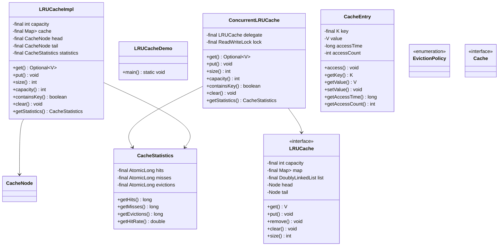
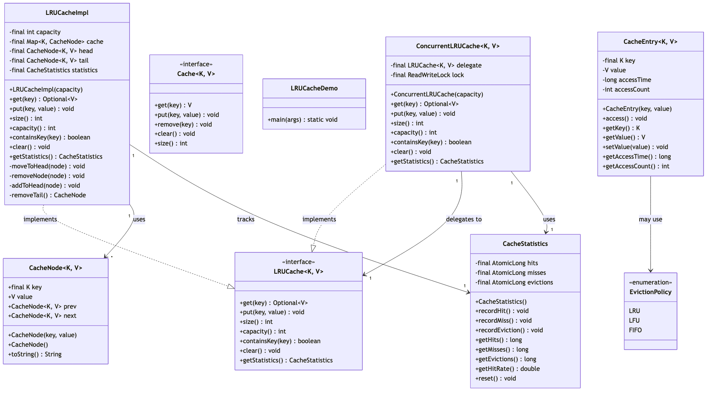

# LRU Cache - Complete Implementation

A comprehensive Least Recently Used (LRU) cache implementation using HashMap and Doubly Linked List, achieving O(1) time complexity for all operations.

## Quick Links
- [View Complete Source Code](/problems/lrucache/CODE)
- [Project Structure](/problems/lrucache/CODE#-directory-structure)

---

## Problem Statement

Design and implement an LRU (Least Recently Used) cache data structure that:
- Stores key-value pairs with a fixed capacity
- Evicts the least recently used item when capacity is reached
- Achieves O(1) time complexity for both `get()` and `put()` operations
- Updates access order on both read (get) and write (put)
- Provides cache statistics (hits, misses, evictions)
- Supports thread-safe variant for concurrent access

**Real-world applications**: CPU caches, database query caches, web browser caches, CDN edge caching, Redis (maxmemory-policy: allkeys-lru).

---

## Requirements

### Functional Requirements

1. **Get Operation**
   - Retrieve value by key in O(1) time
   - Move accessed item to "most recently used" position
   - Return `Optional<V>` or null if key not found
   - Does NOT evict on read

2. **Put Operation**
   - Insert or update key-value pair in O(1) time
   - Move inserted/updated item to "most recently used" position
   - Evict least recently used item if at capacity
   - Reject null keys and null values

3. **Capacity Management**
   - Fixed capacity set at construction time
   - Automatic eviction when size exceeds capacity
   - Track current size and capacity

4. **Statistics Tracking**
   - Count cache hits (successful get)
   - Count cache misses (key not found)
   - Count evictions (LRU item removed)
   - Calculate hit rate: hits / (hits + misses)

5. **Additional Operations**
   - `containsKey(key)`: Check existence without updating access order
   - `clear()`: Remove all entries
   - `size()`: Current number of entries

### Non-Functional Requirements

1. **Performance**
   - O(1) time complexity for get, put, evict
   - O(n) space complexity where n = capacity
   - No expensive operations (sorting, scanning)

2. **Correctness**
   - Always evict true LRU item (not approximate)
   - Consistent access order updates
   - No memory leaks on eviction

3. **Thread Safety**
   - Base implementation: not thread-safe (for simplicity)
   - Concurrent variant: thread-safe with fine-grained locking

4. **API Design**
   - Generic types `<K, V>` for keys and values
   - Fluent API with Optional for get
   - Clear error messages for invalid inputs

---

## Class Diagram

<details>
<summary>View Mermaid Source</summary>




</details>



---

## Key Design Decisions

### 1. HashMap + Doubly Linked List
**Decision**: Use `HashMap<K, Node>` for O(1) lookup + Doubly Linked List for O(1) eviction.

**Rationale**:
- HashMap provides O(1) key lookup
- Doubly Linked List maintains access order
- Can move nodes to head (most recent) in O(1)
- Can remove tail (least recent) in O(1)

**Data Structure**:
```
HashMap: key → Node
Doubly Linked List: Head (MRU) ← → ... ← → Tail (LRU)

Example (capacity=3):
Cache: {A:1, B:2, C:3}
List: Head ← → C ← → B ← → A ← → Tail
Access order: C (most recent) → B → A (least recent)
```

**Tradeoffs**:
- ✅ O(1) get, put, evict
- ✅ Exact LRU tracking
- ❌ More memory than single structure (HashMap + List pointers)
- ❌ Complex pointer manipulation

**Alternative**: `LinkedHashMap` (Java built-in with access order).

### 2. Sentinel Nodes (Head/Tail)
**Decision**: Use dummy sentinel nodes at head and tail of linked list.

**Rationale**:
- Eliminates null checks for edge cases
- Simplifies add/remove operations
- No special handling for first/last node
- Cleaner code, fewer bugs

**Without Sentinels**:
```java
// Complex: need to check if head/tail is null
if (head == null) {
    head = newNode;
    tail = newNode;
} else {
    newNode.next = head;
    head.prev = newNode;
    head = newNode;
}
```

**With Sentinels**:
```java
// Simple: always have head and tail
newNode.next = head.next;
newNode.prev = head;
head.next.prev = newNode;
head.next = newNode;
```

### 3. get() Updates Access Order
**Decision**: Both `get()` and `put()` move node to most recently used position.

**Rationale**:
- True LRU semantics: any access (read or write) updates order
- Prevents eviction of frequently read items
- Consistent with cache behavior

**Tradeoffs**:
- ✅ Accurate LRU tracking
- ❌ get() has side effects (not pure function)

**Alternative**: Separate `peek()` method that doesn't update order (provided as `containsKey()`).

### 4. Optional for get() Return Type
**Decision**: Return `Optional<V>` instead of null for cache misses.

**Rationale**:
- Null-safe API (forces caller to handle miss case)
- Distinguishes "key not found" from "value is null"
- Modern Java best practice

**Alternative**: Return null (simpler but error-prone).

---
## Implementation Guide

### 1. Get Operation Algorithm

```
Algorithm: Get(key)
Input: key K
Output: Optional<V>

1. node = cache.get(key)  // O(1) HashMap lookup

2. if node == null:
      statistics.recordMiss()
      return Optional.empty()

3. // Move to head (most recently used)
   removeNode(node)  // O(1): unlink from current position
   addToHead(node)   // O(1): insert after head sentinel

4. statistics.recordHit()
5. return Optional.of(node.value)
```

**Time Complexity**: O(1)  
**Space Complexity**: O(1)

**Key Operations**:
```java
// Remove node from linked list
void removeNode(Node node) {
    node.prev.next = node.next;  // Bypass node
    node.next.prev = node.prev;
}

// Add node right after head sentinel
void addToHead(Node node) {
    node.next = head.next;
    node.prev = head;
    head.next.prev = node;
    head.next = node;
}
```

**Example**:
```
Initial: Head ← → C ← → B ← → A ← → Tail
get(A):
1. Find A in HashMap: O(1)
2. Remove A from list: O(1)
3. Add A to head: O(1)
Result: Head ← → A ← → C ← → B ← → Tail
```

---

### 2. Put Operation Algorithm

```
Algorithm: Put(key, value)
Input: key K, value V
Output: void

1. node = cache.get(key)  // O(1)

2. if node != null:
      // Update existing node
      node.value = value
      removeNode(node)  // O(1)
      addToHead(node)   // O(1)
      return

3. // New key: check capacity
   if cache.size() == capacity:
      // Evict LRU
      lruNode = tail.prev  // O(1): node before tail sentinel
      cache.remove(lruNode.key)  // O(1) HashMap remove
      removeNode(lruNode)  // O(1)
      statistics.recordEviction()

4. // Add new node
   newNode = new CacheNode(key, value)
   cache.put(key, newNode)  // O(1)
   addToHead(newNode)  // O(1)
```

**Time Complexity**: O(1)  
**Space Complexity**: O(1)

**Example** (capacity=3):
```
Initial: {A:1, B:2, C:3}
List: Head ← → C ← → B ← → A ← → Tail

put(D, 4):
1. Cache full (size=3, capacity=3)
2. Evict LRU: A (tail.prev)
3. Remove A from HashMap and List
4. Add D to head

Result: {D:4, C:3, B:2}
List: Head ← → D ← → C ← → B ← → Tail
```

---

### 3. Move to Head Algorithm

```
Algorithm: MoveToHead(node)
Input: node reference
Output: void

1. removeNode(node)
   node.prev.next = node.next
   node.next.prev = node.prev

2. addToHead(node)
   node.next = head.next
   node.prev = head
   head.next.prev = node
   head.next = node
```

**Time Complexity**: O(1)  
**Space Complexity**: O(1)

**Invariants**:
- Head sentinel always points to MRU node
- Tail sentinel's prev always points to LRU node
- All nodes between head and tail are valid cache entries

---

### 4. Evict LRU Algorithm

```
Algorithm: EvictLRU()
Input: none
Output: evicted key

1. if size <= 0:
      return null  // Empty cache

2. lruNode = tail.prev  // O(1)

3. if lruNode == head:
      return null  // Only sentinels (shouldn't happen)

4. cache.remove(lruNode.key)  // O(1)
5. removeNode(lruNode)  // O(1)
6. statistics.recordEviction()

7. return lruNode.key
```

**Time Complexity**: O(1)  
**Space Complexity**: O(1)

**Why Tail.prev?**:
- Tail is sentinel (not a real entry)
- Tail.prev is the actual least recently used node
- This is why sentinels simplify logic!

---

### 5. Thread-Safe Variant Algorithm

```
class ConcurrentLRUCache<K, V> implements LRUCache<K, V> {
    private final ReadWriteLock lock = new ReentrantReadWriteLock();
    private final LRUCacheImpl<K, V> delegate;
    
    public Optional<V> get(K key) {
        lock.readLock().lock();
        try {
            return delegate.get(key);
        } finally {
            lock.readLock().unlock();
        }
    }
    
    public void put(K key, V value) {
        lock.writeLock().lock();
        try {
            delegate.put(key, value);
        } finally {
            lock.writeLock().unlock();
        }
    }
}
```

**Locking Strategy**:
- `get()`: Read lock (multiple readers allowed)
- `put()`: Write lock (exclusive access)
- Problem: `get()` updates access order (requires write lock!)

**Better Approach** (Segmented Locking):
```
class ConcurrentLRUCache {
    private final int segments = 16;
    private final LRUCacheImpl[] caches = new LRUCacheImpl[segments];
    
    private int getSegment(K key) {
        return Math.abs(key.hashCode() % segments);
    }
    
    public Optional<V> get(K key) {
        return caches[getSegment(key)].get(key);
    }
}
```

**Benefits**: Reduces contention by 16x.

---

## Source Code

All source code available in [CODE.md](/problems/lrucache/CODE):

**Core** (2 files):
- [LRUCache.java](/problems/lrucache/CODE#lrucachejava) - Interface
- [LRUCacheImpl.java](/problems/lrucache/CODE#lrucacheimpljava) - HashMap + DLL implementation

**Thread-Safe** (1 file):
- [ConcurrentLRUCache.java](/problems/lrucache/CODE#concurrentlrucachejava)

**Models** (2 files):
- [CacheNode.java](/problems/lrucache/CODE#cachenodejava)
- [CacheEntry.java](/problems/lrucache/CODE#modelcacheentryjava)

**Supporting** (4 files):
- [CacheStatistics.java](/problems/lrucache/CODE#cachestatisticsjava)
- [model/EvictionPolicy.java](/problems/lrucache/CODE#modelevictionpolicyjava)
- [LRUCacheDemo.java](/problems/lrucache/CODE#lrucachedemojava)
- [api/Cache.java](/problems/lrucache/CODE#apicachejava)

**Total**: 10 files, ~600 lines of code

---
## Interview Discussion Points

### 1. Why O(1)? Why Not Just HashMap?

**Q**: Can't we just use a HashMap and track timestamps?

**Timestamp Approach** (doesn't work):
```java
class NaiveLRU {
    Map<K, Pair<V, Long>> cache;  // value + timestamp
    
    void put(K key, V value) {
        if (cache.size() == capacity) {
            // Find min timestamp: O(n) ❌
            K lruKey = cache.entrySet().stream()
                .min(Comparator.comparing(e -> e.getValue().timestamp))
                .get().getKey();
            cache.remove(lruKey);
        }
        cache.put(key, new Pair(value, System.nanoTime()));
    }
}
```

**Problem**: Eviction is O(n) - must scan all entries to find min timestamp.

**Why Doubly Linked List?**:
- Maintains sorted order (MRU to LRU) without scanning
- O(1) removal from arbitrary position
- O(1) insertion at head

### 2. LinkedHashMap vs Custom Implementation

**Q**: Java has `LinkedHashMap` with access order. Why implement from scratch?

**Using LinkedHashMap**:
```java
class LRUCache<K, V> extends LinkedHashMap<K, V> {
    private final int capacity;
    
    public LRUCache(int capacity) {
        super(capacity, 0.75f, true);  // accessOrder=true
        this.capacity = capacity;
    }
    
    @Override
    protected boolean removeEldestEntry(Map.Entry<K, V> eldest) {
        return size() > capacity;
    }
}
```

**Comparison**:
| Feature | LinkedHashMap | Custom |
|---------|---------------|--------|
| Code Lines | ~10 lines | ~200 lines |
| Control | Limited | Full |
| Statistics | No | Yes |
| Interview Value | Low | High |

**When to use**:
- Production: LinkedHashMap (battle-tested)
- Interview: Custom (shows DS knowledge)

### 3. LRU vs Other Eviction Policies

**LFU (Least Frequently Used)**:
- Evicts item with lowest access count
- Better for items with varying popularity
- Harder to implement (need frequency tracking)

**FIFO (First In First Out)**:
- Evicts oldest item (by insertion time)
- Simpler (just insertion order)
- Worse hit rate than LRU

**LRU-K (LRU with K references)**:
- Tracks last K access times per item
- More accurate than LRU
- Higher memory overhead

**Comparison**:
```
Workload: [A, B, C, D, A, B, E]
Capacity: 3

LRU evicts: D (least recently used)
LFU evicts: C or D (lowest frequency)
FIFO evicts: A (oldest insertion)
```

**Hit Rates** (typical):
- LRU: 40-60%
- LFU: 45-65%
- FIFO: 30-50%

### 4. Distributed LRU Cache

**Q**: How to implement LRU across multiple servers?

**Problem**: Each server has its own cache - no global LRU order.

**Approaches**:

**A) Consistent Hashing + Local LRU**:
```
User Request → Consistent Hash(key) → Server N → Local LRU
```
- Each server maintains independent LRU
- Same key always routed to same server
- No cross-server eviction coordination

**B) Centralized Metadata**:
```
- Redis stores global access order
- Each server queries Redis before serving
- Redis evicts globally LRU items
```
- Accurate global LRU
- Higher latency (network call)
- Redis becomes bottleneck

**C) Approximate LRU (Redis Implementation)**:
```
- Sample 5 random keys
- Evict the one with oldest access time
- Not perfect LRU, but O(1) and good enough
```

**Trade-offs**:
| Approach | Accuracy | Latency | Complexity |
|----------|----------|---------|------------|
| Local LRU | Medium | Low | Low |
| Centralized | High | High | Medium |
| Approximate | Medium | Low | Low |

### 5. Time-Based Eviction (TTL)

**Q**: What if we also need items to expire after N seconds?

**Combined LRU + TTL**:
```java
class CacheNode<K, V> {
    K key;
    V value;
    long expiryTime;  // Unix timestamp
    CacheNode prev, next;
}

Optional<V> get(K key) {
    CacheNode node = cache.get(key);
    if (node == null) return Optional.empty();
    
    // Check TTL
    if (System.currentTimeMillis() > node.expiryTime) {
        removeNode(node);
        cache.remove(key);
        return Optional.empty();
    }
    
    moveToHead(node);
    return Optional.of(node.value);
}
```

**Proactive Expiry**:
```java
// Background thread
ScheduledExecutorService executor = Executors.newScheduledThreadPool(1);
executor.scheduleAtFixedRate(() -> {
    long now = System.currentTimeMillis();
    // Scan from tail (oldest access) until unexpired
    CacheNode node = tail.prev;
    while (node != head && node.expiryTime < now) {
        CacheNode toRemove = node;
        node = node.prev;
        removeNode(toRemove);
        cache.remove(toRemove.key);
    }
}, 1, 1, TimeUnit.SECONDS);
```

### 6. Write-Through vs Write-Back Cache

**Q**: When should cache write to underlying database?

**Write-Through** (immediate):
```java
void put(K key, V value) {
    database.write(key, value);  // Write to DB first
    cache.put(key, value);       // Then update cache
}
```
- ✅ Data consistency guaranteed
- ❌ Higher write latency

**Write-Back** (delayed):
```java
void put(K key, V value) {
    cache.put(key, value);       // Update cache immediately
    dirtyKeys.add(key);          // Mark as dirty
}

// Background flush
void flushDirtyKeys() {
    for (K key : dirtyKeys) {
        database.write(key, cache.get(key).get());
    }
    dirtyKeys.clear();
}
```
- ✅ Lower write latency
- ❌ Risk of data loss on crash

**When to use**:
- Write-Through: Financial data, critical systems
- Write-Back: Logs, analytics, high-write workloads

---

## Extensions

1. **LFU Cache**: Track access frequency, evict least frequent
2. **2Q Cache**: Two LRU queues (recent + frequent)
3. **ARC (Adaptive Replacement)**: Self-tuning between recency and frequency
4. **Multi-Level Cache**: L1 (memory) + L2 (Redis) + L3 (DB)
5. **Cache Warming**: Preload popular items on startup

---

**See Also**: Redis (LRU implementation), Guava Cache, Caffeine Cache (best Java cache library)
