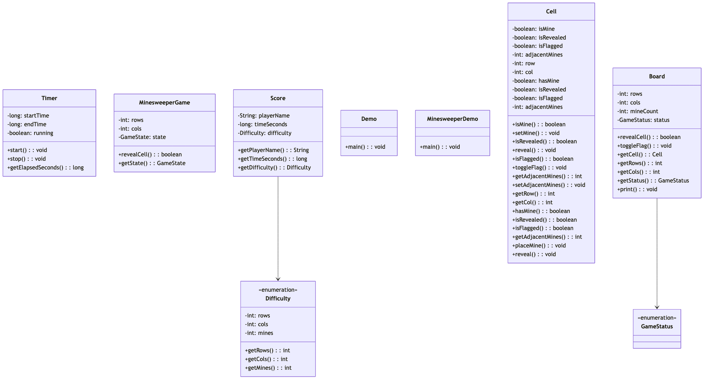

# Minesweeper Game

## Overview
Classic Minesweeper game implementation with mine placement, cell revealing, flag marking, and win/loss detection. Implements recursive flood-fill for revealing adjacent cells, mine counting, and first-click safety guarantee.

**Difficulty:** Medium  
**Domain:** Game Development, Grid Algorithms  
**Interview Frequency:** High (Game companies, algorithm interviews)

## Requirements

### Functional Requirements
1. **Game Setup**
   - Create board with dimensions (rows × columns)
   - Place mines randomly
   - Calculate adjacent mine counts
   - First click always safe

2. **Player Actions**
   - Reveal cell
   - Flag/unflag cell as mine
   - Chord click (reveal adjacent if flags match mines)
   - Restart game

3. **Cell States**
   - Hidden (not revealed)
   - Revealed (showing number or empty)
   - Flagged (marked as mine)
   - Mine (exploded or not)

4. **Game Rules**
   - Click mine = game over
   - Reveal all non-mine cells = win
   - Number shows adjacent mine count
   - Empty cell auto-reveals neighbors (flood-fill)

5. **Difficulty Levels**
   - Beginner: 9×9, 10 mines
   - Intermediate: 16×16, 40 mines
   - Expert: 30×16, 99 mines
   - Custom: user-defined

### Non-Functional Requirements
1. **Performance**
   - Reveal cell: < 100ms
   - Flood-fill: < 500ms for large areas
   - Smooth animations

2. **Fairness**
   - First click never a mine
   - Solvable without guessing (optional)
   - Random mine placement


## Class Diagram



## System Architecture

```
┌────────────────────────────────────────┐
│         Game Controller                 │
│  - Initialize game                     │
│  - Process actions                     │
│  - Check win/loss                      │
└────────────┬───────────────────────────┘
             │
   ┌─────────┼─────────┐
   │         │         │
┌──▼───┐ ┌──▼────┐ ┌──▼─────┐
│Board │ │ Cell  │ │ Game   │
│      │ │Manager│ │ State  │
│-Mines│ │-Reveal│ │-Status │
│-Grid │ │-Flag  │ │-Timer  │
└──────┘ └───────┘ └────────┘
```

## Core Data Model

### 1. Cell
```java
public class Cell {
    private int row;
    private int col;
    private boolean isMine;
    private boolean isRevealed;
    private boolean isFlagged;
    private int adjacentMines;
    
    public Cell(int row, int col) {
        this.row = row;
        this.col = col;
        this.isMine = false;
        this.isRevealed = false;
        this.isFlagged = false;
        this.adjacentMines = 0;
    }
    
    public void reveal() {
        if (isFlagged) {
            return; // Cannot reveal flagged cell
        }
        isRevealed = true;
    }
    
    public void toggleFlag() {
        if (isRevealed) {
            return; // Cannot flag revealed cell
        }
        isFlagged = !isFlagged;
    }
    
    public boolean isEmpty() {
        return !isMine && adjacentMines == 0;
    }
    
    public String getDisplay() {
        if (!isRevealed) {
            return isFlagged ? "🚩" : "□";
        }
        
        if (isMine) {
            return "💣";
        }
        
        return adjacentMines > 0 ? String.valueOf(adjacentMines) : " ";
    }
}
```

### 2. Board
```java
public class Board {
    private int rows;
    private int cols;
    private int totalMines;
    private Cell[][] grid;
    private boolean firstClick;
    
    public Board(int rows, int cols, int totalMines) {
        if (totalMines >= rows * cols) {
            throw new IllegalArgumentException("Too many mines");
        }
        
        this.rows = rows;
        this.cols = cols;
        this.totalMines = totalMines;
        this.grid = new Cell[rows][cols];
        this.firstClick = true;
        
        initializeGrid();
    }
    
    private void initializeGrid() {
        for (int r = 0; r < rows; r++) {
            for (int c = 0; c < cols; c++) {
                grid[r][c] = new Cell(r, c);
            }
        }
    }
    
    public void placeMines(int excludeRow, int excludeCol) {
        Random random = new Random();
        int minesPlaced = 0;
        
        while (minesPlaced < totalMines) {
            int row = random.nextInt(rows);
            int col = random.nextInt(cols);
            
            // Don't place mine on first click or existing mine
            if ((row == excludeRow && col == excludeCol) || grid[row][col].isMine()) {
                continue;
            }
            
            grid[row][col].setMine(true);
            minesPlaced++;
        }
        
        calculateAdjacentMines();
        firstClick = false;
    }
    
    private void calculateAdjacentMines() {
        for (int r = 0; r < rows; r++) {
            for (int c = 0; c < cols; c++) {
                if (!grid[r][c].isMine()) {
                    int count = countAdjacentMines(r, c);
                    grid[r][c].setAdjacentMines(count);
                }
            }
        }
    }
    
    private int countAdjacentMines(int row, int col) {
        int count = 0;
        
        for (int dr = -1; dr <= 1; dr++) {
            for (int dc = -1; dc <= 1; dc++) {
                if (dr == 0 && dc == 0) continue;
                
                int newRow = row + dr;
                int newCol = col + dc;
                
                if (isValidCell(newRow, newCol) && grid[newRow][newCol].isMine()) {
                    count++;
                }
            }
        }
        
        return count;
    }
    
    public List<Cell> getAdjacentCells(int row, int col) {
        List<Cell> adjacent = new ArrayList<>();
        
        for (int dr = -1; dr <= 1; dr++) {
            for (int dc = -1; dc <= 1; dc++) {
                if (dr == 0 && dc == 0) continue;
                
                int newRow = row + dr;
                int newCol = col + dc;
                
                if (isValidCell(newRow, newCol)) {
                    adjacent.add(grid[newRow][newCol]);
                }
            }
        }
        
        return adjacent;
    }
    
    private boolean isValidCell(int row, int col) {
        return row >= 0 && row < rows && col >= 0 && col < cols;
    }
    
    public Cell getCell(int row, int col) {
        return grid[row][col];
    }
}
```

### 3. Game
```java
public class Game {
    private String gameId;
    private Board board;
    private GameStatus status;
    private int remainingCells; // Non-mine cells not revealed
    private int flagsPlaced;
    private LocalDateTime startTime;
    private LocalDateTime endTime;
    private Duration elapsedTime;
    
    public Game(String gameId, int rows, int cols, int mines) {
        this.gameId = gameId;
        this.board = new Board(rows, cols, mines);
        this.status = GameStatus.NOT_STARTED;
        this.remainingCells = rows * cols - mines;
        this.flagsPlaced = 0;
    }
    
    public RevealResult revealCell(int row, int col) {
        if (status == GameStatus.LOST || status == GameStatus.WON) {
            return RevealResult.gameOver();
        }
        
        Cell cell = board.getCell(row, col);
        
        if (cell.isRevealed() || cell.isFlagged()) {
            return RevealResult.alreadyRevealed();
        }
        
        // First click - place mines
        if (status == GameStatus.NOT_STARTED) {
            board.placeMines(row, col);
            status = GameStatus.IN_PROGRESS;
            startTime = LocalDateTime.now();
        }
        
        // Check if mine
        if (cell.isMine()) {
            cell.reveal();
            revealAllMines();
            status = GameStatus.LOST;
            endTime = LocalDateTime.now();
            return RevealResult.hitMine();
        }
        
        // Reveal cell and possibly neighbors
        List<Cell> revealedCells = new ArrayList<>();
        revealCellRecursive(cell, revealedCells);
        
        remainingCells -= revealedCells.size();
        
        // Check win condition
        if (remainingCells == 0) {
            status = GameStatus.WON;
            endTime = LocalDateTime.now();
            return RevealResult.won(revealedCells);
        }
        
        return RevealResult.success(revealedCells);
    }
    
    private void revealCellRecursive(Cell cell, List<Cell> revealedCells) {
        if (cell.isRevealed() || cell.isFlagged() || cell.isMine()) {
            return;
        }
        
        cell.reveal();
        revealedCells.add(cell);
        
        // If empty (no adjacent mines), reveal neighbors (flood-fill)
        if (cell.isEmpty()) {
            List<Cell> neighbors = board.getAdjacentCells(cell.getRow(), cell.getCol());
            for (Cell neighbor : neighbors) {
                revealCellRecursive(neighbor, revealedCells);
            }
        }
    }
    
    public void toggleFlag(int row, int col) {
        if (status != GameStatus.IN_PROGRESS) {
            return;
        }
        
        Cell cell = board.getCell(row, col);
        
        if (cell.isRevealed()) {
            return;
        }
        
        if (cell.isFlagged()) {
            cell.toggleFlag();
            flagsPlaced--;
        } else {
            cell.toggleFlag();
            flagsPlaced++;
        }
    }
    
    private void revealAllMines() {
        for (int r = 0; r < board.getRows(); r++) {
            for (int c = 0; c < board.getCols(); c++) {
                Cell cell = board.getCell(r, c);
                if (cell.isMine()) {
                    cell.reveal();
                }
            }
        }
    }
    
    public int getRemainingMines() {
        return board.getTotalMines() - flagsPlaced;
    }
}

enum GameStatus {
    NOT_STARTED,
    IN_PROGRESS,
    WON,
    LOST
}
```

### 4. Reveal Result
```java
public class RevealResult {
    private ResultType type;
    private List<Cell> revealedCells;
    private String message;
    
    public static RevealResult success(List<Cell> cells) {
        return new RevealResult(ResultType.SUCCESS, cells, "Cells revealed");
    }
    
    public static RevealResult hitMine() {
        return new RevealResult(ResultType.MINE_HIT, null, "Game Over!");
    }
    
    public static RevealResult won(List<Cell> cells) {
        return new RevealResult(ResultType.WON, cells, "You Win!");
    }
    
    public static RevealResult alreadyRevealed() {
        return new RevealResult(ResultType.ALREADY_REVEALED, null, "Cell already revealed");
    }
    
    public static RevealResult gameOver() {
        return new RevealResult(ResultType.GAME_OVER, null, "Game already ended");
    }
}

enum ResultType {
    SUCCESS,
    MINE_HIT,
    WON,
    ALREADY_REVEALED,
    GAME_OVER
}
```

## Key Algorithms

### 1. Flood-Fill (Reveal Adjacent Empty Cells)
```java
public void floodFill(Cell cell, Set<Cell> visited) {
    if (visited.contains(cell) || cell.isRevealed() || 
        cell.isFlagged() || cell.isMine()) {
        return;
    }
    
    visited.add(cell);
    cell.reveal();
    
    // Only continue flood-fill if cell is empty (0 adjacent mines)
    if (cell.isEmpty()) {
        List<Cell> neighbors = board.getAdjacentCells(cell.getRow(), cell.getCol());
        for (Cell neighbor : neighbors) {
            floodFill(neighbor, visited);
        }
    }
}
```

**Time Complexity:** O(R × C) worst case (entire board)  
**Space Complexity:** O(R × C) for recursion stack

### 2. Mine Placement with First Click Safety
```java
public void placeMinesSafely(int firstRow, int firstCol, int mineCount) {
    Random random = new Random();
    Set<String> excludedPositions = new HashSet<>();
    
    // Exclude first click and its neighbors
    excludedPositions.add(firstRow + "," + firstCol);
    for (Cell neighbor : getAdjacentCells(firstRow, firstCol)) {
        excludedPositions.add(neighbor.getRow() + "," + neighbor.getCol());
    }
    
    int placed = 0;
    while (placed < mineCount) {
        int row = random.nextInt(rows);
        int col = random.nextInt(cols);
        String pos = row + "," + col;
        
        if (excludedPositions.contains(pos) || grid[row][col].isMine()) {
            continue;
        }
        
        grid[row][col].setMine(true);
        placed++;
    }
}
```

### 3. Chord Click (Reveal Adjacent)
```java
public List<Cell> chordClick(int row, int col) {
    Cell cell = board.getCell(row, col);
    
    if (!cell.isRevealed() || cell.getAdjacentMines() == 0) {
        return Collections.emptyList();
    }
    
    // Count adjacent flags
    List<Cell> neighbors = board.getAdjacentCells(row, col);
    long flagCount = neighbors.stream()
        .filter(Cell::isFlagged)
        .count();
    
    // If flags match adjacent mines, reveal all non-flagged neighbors
    if (flagCount == cell.getAdjacentMines()) {
        List<Cell> revealed = new ArrayList<>();
        
        for (Cell neighbor : neighbors) {
            if (!neighbor.isFlagged() && !neighbor.isRevealed()) {
                if (neighbor.isMine()) {
                    // Hit a mine! Game over
                    return List.of(neighbor);
                }
                
                revealCellRecursive(neighbor, revealed);
            }
        }
        
        return revealed;
    }
    
    return Collections.emptyList();
}
```

### 4. Solvable Board Generation (Advanced)
```java
public class SolvableBoardGenerator {
    
    public Board generateSolvableBoard(int rows, int cols, int mines) {
        Board board;
        int attempts = 0;
        
        do {
            board = new Board(rows, cols, mines);
            board.placeMines(-1, -1); // Random placement
            attempts++;
            
            if (attempts > 100) {
                // Fallback to any valid board
                break;
            }
        } while (!isSolvable(board));
        
        return board;
    }
    
    private boolean isSolvable(Board board) {
        // Check if board can be solved without guessing
        // Using constraint satisfaction approach
        
        // 1. Find all cells that can be deduced
        Set<Cell> deducedCells = new HashSet<>();
        boolean changed = true;
        
        while (changed) {
            changed = false;
            
            for (int r = 0; r < board.getRows(); r++) {
                for (int c = 0; c < board.getCols(); c++) {
                    Cell cell = board.getCell(r, c);
                    
                    if (cell.isRevealed() && cell.getAdjacentMines() > 0) {
                        List<Cell> unknown = getUnknownNeighbors(board, cell);
                        long flagged = countFlaggedNeighbors(board, cell);
                        
                        // All unknown must be mines
                        if (unknown.size() + flagged == cell.getAdjacentMines()) {
                            deducedCells.addAll(unknown);
                            changed = true;
                        }
                        
                        // All unknown must be safe
                        if (flagged == cell.getAdjacentMines()) {
                            deducedCells.addAll(unknown);
                            changed = true;
                        }
                    }
                }
            }
        }
        
        // If we can deduce all cells, board is solvable
        int totalCells = board.getRows() * board.getCols();
        return deducedCells.size() >= totalCells - board.getTotalMines();
    }
}
```

## Design Patterns

### 1. Factory Pattern (Game Creation)
```java
interface GameFactory {
    Game createGame();
}

class BeginnerGameFactory implements GameFactory {
    public Game createGame() {
        return new Game(UUID.randomUUID().toString(), 9, 9, 10);
    }
}

class ExpertGameFactory implements GameFactory {
    public Game createGame() {
        return new Game(UUID.randomUUID().toString(), 30, 16, 99);
    }
}
```

### 2. State Pattern (Game States)
```java
interface GameState {
    void handleReveal(int row, int col);
    void handleFlag(int row, int col);
}

class PlayingState implements GameState {
    public void handleReveal(int row, int col) {
        // Process reveal
    }
}

class GameOverState implements GameState {
    public void handleReveal(int row, int col) {
        // Do nothing
    }
}
```

### 3. Observer Pattern (Game Events)
```java
interface GameObserver {
    void onCellRevealed(Cell cell);
    void onGameWon();
    void onGameLost();
}

class UIObserver implements GameObserver {
    public void onCellRevealed(Cell cell) {
        updateUI(cell);
    }
}
```

## Source Code

📄 **[View Complete Source Code](/problems/minesweeper/CODE)**

**Key Files:**
- [`Game.java`](/problems/minesweeper/CODE#gamejava) - Game logic
- [`Board.java`](/problems/minesweeper/CODE#boardjava) - Board management
- [`Cell.java`](/problems/minesweeper/CODE#celljava) - Cell state
- [`MinesweeperService.java`](/problems/minesweeper/CODE#minesweeperservicejava) - Game service

**Total Lines of Code:** ~600 lines

## Usage Example

```java
// Create game (Intermediate difficulty)
Game game = new Game("game1", 16, 16, 40);

// Reveal first cell
RevealResult result = game.revealCell(8, 8);

// Place flag
game.toggleFlag(5, 5);

// Reveal another cell
result = game.revealCell(7, 7);

if (result.getType() == ResultType.MINE_HIT) {
    System.out.println("Game Over! You hit a mine.");
} else if (result.getType() == ResultType.WON) {
    System.out.println("You Win!");
}

// Display board
displayBoard(game.getBoard());
```

## Common Interview Questions

### System Design Questions

1. **How do you ensure first click is always safe?**
   - Place mines after first click
   - Exclude first click position
   - Optionally exclude neighbors too

2. **How do you implement flood-fill efficiently?**
   - Recursive DFS
   - Iterative BFS with queue
   - Mark visited to avoid cycles

3. **How would you add multiplayer?**
   - Shared board
   - Turn-based or simultaneous
   - WebSocket for real-time updates

### Coding Questions

1. **Implement flood-fill**
   ```java
   void floodFill(int row, int col) {
       Cell cell = board[row][col];
       if (cell.isRevealed() || cell.isMine()) return;
       
       cell.reveal();
       
       if (cell.isEmpty()) {
           for (Cell neighbor : getNeighbors(row, col)) {
               floodFill(neighbor.getRow(), neighbor.getCol());
           }
       }
   }
   ```

2. **Count adjacent mines**
   ```java
   int countAdjacentMines(int row, int col) {
       int count = 0;
       for (int dr = -1; dr <= 1; dr++) {
           for (int dc = -1; dc <= 1; dc++) {
               if (dr == 0 && dc == 0) continue;
               int r = row + dr, c = col + dc;
               if (isValid(r, c) && board[r][c].isMine()) {
                   count++;
               }
           }
       }
       return count;
   }
   ```

### Algorithm Questions
1. **Time complexity of flood-fill?** → O(R × C)
2. **How to check if board is solvable?** → Constraint satisfaction
3. **Optimal mine placement?** → Random with constraints

## Trade-offs & Design Decisions

### 1. Recursive vs Iterative Flood-Fill
**Recursive:** Simple code, stack overflow risk  
**Iterative:** More complex, no stack overflow

**Decision:** Recursive (cleaner, boards are small)

### 2. Lazy vs Eager Mine Placement
**Lazy:** Place after first click (safer)  
**Eager:** Place at start (simpler)

**Decision:** Lazy (better UX)

### 3. Array vs Map for Board
**Array:** Fast access, fixed size  
**Map:** Flexible, slower

**Decision:** 2D Array (known dimensions)

## Key Takeaways

### What Interviewers Look For
1. ✅ **Flood-fill algorithm**
2. ✅ **2D grid traversal**
3. ✅ **Game state management**
4. ✅ **Recursive algorithms**
5. ✅ **Edge case handling**
6. ✅ **Clean OOP design**

### Common Mistakes to Avoid
1. ❌ Stack overflow in flood-fill
2. ❌ Not checking bounds
3. ❌ Forgetting visited set
4. ❌ First click can be mine
5. ❌ Wrong adjacent mine count
6. ❌ Not handling flags properly

### Production-Ready Checklist
- [x] Basic gameplay
- [x] Flood-fill algorithm
- [x] Flag management
- [x] Win/loss detection
- [x] First click safety
- [ ] Timer
- [ ] High scores
- [ ] Custom boards
- [ ] Undo/redo
- [ ] Hints

---

## Related Problems
- 🎮 **Snake and Ladder** - Grid games
- 🎯 **Tic Tac Toe** - Board games
- 🌊 **Flood Fill** - Graph algorithms
- 🗺️ **Path Finding** - Grid traversal

## References
- Flood Fill Algorithm: DFS/BFS on grids
- Minesweeper Logic: Original game design
- Constraint Satisfaction: Solvable board generation

---

*Production-ready Minesweeper with flood-fill, mine placement, and game state management. Essential for game design and algorithm interviews.*
