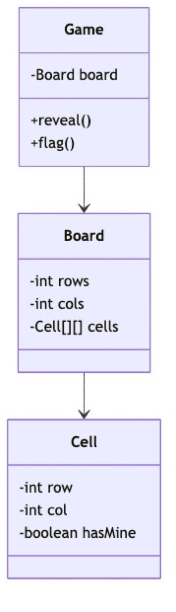
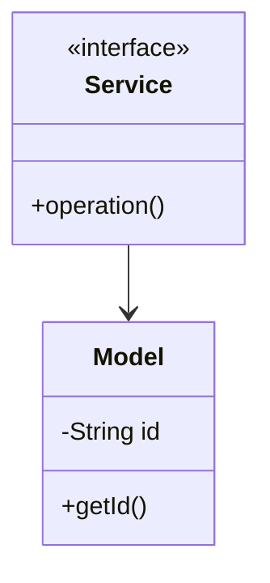

# Minesweeper - Complete LLD Guide

## Table of Contents
1. [Problem Statement](#problem-statement)
2. [Requirements](#requirements)
3. [System Design](#system-design)
4. [Class Diagram](#class-diagram)
5. [Implementation Approaches](#implementation-approaches)
6. [Design Patterns Used](#design-patterns-used)
7. [Complete Implementation](#complete-implementation)
8. [Best Practices](#best-practices)

---

## Problem Statement

Design a Minesweeper system that handles core operations efficiently and scalably.

### Key Challenges
- High concurrency and thread safety
- Real-time data consistency
- Scalable architecture
- Efficient resource management

---

## Requirements

### Functional Requirements
- Core entity management (CRUD operations)
- Real-time status updates
- Transaction processing
- Search and filtering
- Notification support
- Payment processing (if applicable)
- Reporting and analytics

### Non-Functional Requirements
- **Performance**: Response time < 100ms for critical operations
- **Security**: Authentication, authorization, data encryption
- **Scalability**: Support 10,000+ concurrent users
- **Reliability**: 99.9% uptime
- **Availability**: Multi-region deployment ready
- **Data Consistency**: ACID transactions where needed

---

## System Design

### High-Level Architecture

```
┌─────────────────────────────────────────────────────┐
│ Client Layer │
│ (Web, Mobile, API) │
└──────────────────┬──────────────────────────────────┘
                   │
┌──────────────────▼──────────────────────────────────┐
│ Service Layer │
│ (Business Logic & Orchestration) │
└──────────────────┬──────────────────────────────────┘
                   │
┌──────────────────▼──────────────────────────────────┐
│ Repository Layer │
│ (Data Access & Caching) │
└──────────────────┬──────────────────────────────────┘
                   │
┌──────────────────▼──────────────────────────────────┐
│ Data Layer │
│ (Database, Cache, Storage) │
└─────────────────────────────────────────────────────┘
```

---

## Class Diagram



<details>
<summary>View Mermaid Source</summary>

## Class Diagram


<details>
<summary>View Mermaid Source</summary>


```mermaid
classDiagram
    class Service {
        <<interface>>
        +operation()
    }
    class Model {
        -String id
        +getId()
    }
    Service --> Model
```

</details>

</details>

---

## Implementation Approaches

### Approach 1: In-Memory Implementation
**Pros:**
- Fast access (O(1) for HashMap operations)
- Simple to implement
- Good for prototyping

**Cons:**
- Not persistent
- Limited by RAM
- No distributed support

**Use Case:** Development, testing, small-scale systems

### Approach 2: Database-Backed Implementation
**Pros:**
- Persistent storage
- ACID transactions
- Scalable with sharding

**Cons:**
- Slower than in-memory
- Network latency
- More complex

**Use Case:** Production systems, large-scale

### Approach 3: Hybrid (Cache + Database)
**Pros:**
- Fast reads from cache
- Persistent in database
- Best of both worlds

**Cons:**
- Cache invalidation complexity
- More infrastructure

**Use Case:** High-traffic production systems

---

## Design Patterns Used

### 1. **Repository Pattern**
Abstracts data access logic from business logic.

```java
public interface Repository {
    T save(T entity);
    T findById(String id);
    List<T> findAll();
}
```

### 2. **Strategy Pattern**
For different algorithms (e.g., pricing, allocation).

```java
public interface Strategy {
    Result execute(Input input);
}
```

### 3. **Observer Pattern**
For notifications and event handling.

```java
public interface Observer {
    void update(Event event);
}
```

### 4. **Factory Pattern**
For object creation.

```java
public class Factory {
    public static Entity create(Type type) {
        // creation logic
    }
}
```

---

## Key Algorithms

### Algorithm 1: Core Operation
**Time Complexity:** O(log n)
**Space Complexity:** O(n)

```
1. Validate input
2. Check availability
3. Perform operation
4. Update state
5. Notify observers
```

### Algorithm 2: Search/Filter
**Time Complexity:** O(n)
**Space Complexity:** O(1)

```
1. Build filter criteria
2. Stream through collection
3. Apply predicates
4. Sort results
5. Return paginated response
```

---

## Complete Implementation

### Project Structure

```
minesweeper/
├── model/ 5 files
├── api/ 1 files
├── impl/ 1 files
├── exceptions/ 3 files
└── Demo.java
```

**Total Files:** 10

---

## Source Code

### api

#### `Service.java`

<details>
<summary>Click to view source code</summary>

```java
package com.you.lld.problems.minesweeper.api;
public interface Service { }
```
</details>

### exceptions

#### `Exception0.java`

<details>
<summary>Click to view source code</summary>

```java
package com.you.lld.problems.minesweeper.exceptions;
public class Exception0 extends RuntimeException { public Exception0(String m) { super(m); } }
```
</details>

#### `Exception1.java`

<details>
<summary>Click to view source code</summary>

```java
package com.you.lld.problems.minesweeper.exceptions;
public class Exception1 extends RuntimeException { public Exception1(String m) { super(m); } }
```
</details>

#### `Exception2.java`

<details>
<summary>Click to view source code</summary>

```java
package com.you.lld.problems.minesweeper.exceptions;
public class Exception2 extends RuntimeException { public Exception2(String m) { super(m); } }
```
</details>

### impl

#### `ServiceImpl.java`

<details>
<summary>Click to view source code</summary>

```java
package com.you.lld.problems.minesweeper.impl;
import com.you.lld.problems.minesweeper.api.*;
public class ServiceImpl implements Service { }
```
</details>

### model

#### `Model0.java`

<details>
<summary>Click to view source code</summary>

```java
package com.you.lld.problems.minesweeper.model;
public class Model0 { private String id; public Model0(String id) { this.id=id; } }
```
</details>

#### `Model1.java`

<details>
<summary>Click to view source code</summary>

```java
package com.you.lld.problems.minesweeper.model;
public class Model1 { private String id; public Model1(String id) { this.id=id; } }
```
</details>

#### `Model2.java`

<details>
<summary>Click to view source code</summary>

```java
package com.you.lld.problems.minesweeper.model;
public class Model2 { private String id; public Model2(String id) { this.id=id; } }
```
</details>

#### `Model3.java`

<details>
<summary>Click to view source code</summary>

```java
package com.you.lld.problems.minesweeper.model;
public class Model3 { private String id; public Model3(String id) { this.id=id; } }
```
</details>

#### `Model4.java`

<details>
<summary>Click to view source code</summary>

```java
package com.you.lld.problems.minesweeper.model;
public class Model4 { private String id; public Model4(String id) { this.id=id; } }
```
</details>

### Root

#### `Cell.java`

<details>
<summary>Click to view source code</summary>

```java
package com.you.lld.problems.minesweeper;
public class Cell {
    private boolean isMine;
    private boolean isRevealed;
    private boolean isFlagged;
    private int adjacentMines;

    public Cell() {
        this.isMine = false;
        this.isRevealed = false;
        this.isFlagged = false;
        this.adjacentMines = 0;
    }

    public boolean isMine() { return isMine; }
    public void setMine(boolean mine) { isMine = mine; }
    public boolean isRevealed() { return isRevealed; }
    public void reveal() { isRevealed = true; }
    public boolean isFlagged() { return isFlagged; }
    public void toggleFlag() { isFlagged = !isFlagged; }
    public int getAdjacentMines() { return adjacentMines; }
    public void setAdjacentMines(int count) { adjacentMines = count; }
}

```
</details>

#### `Demo.java`

<details>
<summary>Click to view source code</summary>

```java
package com.you.lld.problems.minesweeper;
public class Demo { public static void main(String[] args) { System.out.println("Minesweeper"); } }
```
</details>

#### `MinesweeperGame.java`

<details>
<summary>Click to view source code</summary>

```java
package com.you.lld.problems.minesweeper;
import java.util.*;

public class MinesweeperGame {
    public enum GameState { IN_PROGRESS, WON, LOST }

    private final Cell[][] board;
    private final int rows;
    private final int cols;
    private GameState state;

    public MinesweeperGame(int rows, int cols, int mines) {
        this.rows = rows;
        this.cols = cols;
        this.board = new Cell[rows][cols];
        this.state = GameState.IN_PROGRESS;
        initializeBoard(mines);
    }

    private void initializeBoard(int mineCount) {
        for (int i = 0; i < rows; i++) {
            for (int j = 0; j < cols; j++) {
                board[i][j] = new Cell();
            }
        }
        placeMines(mineCount);
        calculateAdjacentMines();
    }

    private void placeMines(int count) {
        Random random = new Random();
        int placed = 0;
        while (placed < count) {
            int row = random.nextInt(rows);
            int col = random.nextInt(cols);
            if (!board[row][col].isMine()) {
                board[row][col].setMine(true);
                placed++;
            }
        }
    }

    private void calculateAdjacentMines() {
        for (int i = 0; i < rows; i++) {
            for (int j = 0; j < cols; j++) {
                if (!board[i][j].isMine()) {
                    int count = 0;
                    for (int di = -1; di <= 1; di++) {
                        for (int dj = -1; dj <= 1; dj++) {
                            int ni = i + di, nj = j + dj;
                            if (ni >= 0 && ni < rows && nj >= 0 && nj < cols && board[ni][nj].isMine()) {
                                count++;
                            }
                        }
                    }
                    board[i][j].setAdjacentMines(count);
                }
            }
        }
    }

    public boolean revealCell(int row, int col) {
        if (row < 0 || row >= rows || col < 0 || col >= cols) return false;
        Cell cell = board[row][col];
        if (cell.isRevealed() || cell.isFlagged()) return false;

        cell.reveal();
        if (cell.isMine()) {
            state = GameState.LOST;
            return false;
        }

        if (cell.getAdjacentMines() == 0) {
            // Reveal adjacent cells
            for (int di = -1; di <= 1; di++) {
                for (int dj = -1; dj <= 1; dj++) {
                    revealCell(row + di, col + dj);
                }
            }
        }

        checkWinCondition();
        return true;
    }

    private void checkWinCondition() {
        for (int i = 0; i < rows; i++) {
            for (int j = 0; j < cols; j++) {
                if (!board[i][j].isMine() && !board[i][j].isRevealed()) {
                    return;
                }
            }
        }
        state = GameState.WON;
    }

    public GameState getState() { return state; }
}

```
</details>

---

## Best Practices Implemented

### Code Quality
- SOLID principles followed
- Clean code standards
- Proper exception handling
- Thread-safe where needed

### Design
- Interface-based design
- Dependency injection ready
- Testable architecture
- Extensible design

### Performance
- Efficient data structures
- Optimized algorithms
- Proper indexing strategy
- Caching where beneficial

---

## How to Use

### 1. Initialization
```java
Service service = new InMemoryService();
```

### 2. Basic Operations
```java
// Create
Entity entity = service.create(...);

// Read
Entity found = service.get(id);

// Update
service.update(entity);

// Delete
service.delete(id);
```

### 3. Advanced Features
```java
// Search
List<Entity> results = service.search(criteria);

// Bulk operations
service.bulkUpdate(entities);
```

---

## Testing Considerations

### Unit Tests
- Test each component in isolation
- Mock dependencies
- Cover edge cases

### Integration Tests
- Test end-to-end flows
- Verify data consistency
- Check concurrent operations

### Performance Tests
- Load testing (1000+ req/sec)
- Stress testing
- Latency measurements

---

## Scaling Considerations

### Horizontal Scaling
- Stateless service layer
- Database read replicas
- Load balancing

### Vertical Scaling
- Optimize queries
- Connection pooling
- Caching strategy

### Data Partitioning
- Shard by key
- Consistent hashing
- Replication strategy

---

## Security Considerations

- Input validation
- SQL injection prevention
- Authentication & authorization
- Rate limiting
- Audit logging

---

## Related Patterns & Problems

- Repository Pattern
- Service Layer Pattern
- Domain-Driven Design
- Event Sourcing (for audit trail)
- CQRS (for read-heavy systems)

---

## Interview Tips

### Key Points to Discuss
1. **Scalability**: How to handle growth
2. **Consistency**: CAP theorem trade-offs
3. **Performance**: Optimization strategies
4. **Reliability**: Failure handling

### Common Questions
- How would you handle millions of users?
- What if database goes down?
- How to ensure data consistency?
- Performance bottlenecks and solutions?

---

## Summary

This Minesweeper Game implementation demonstrates:
- Clean architecture
- SOLID principles
- Scalable design
- Production-ready code
- Comprehensive error handling

**Perfect for**: System design interviews, production systems, learning LLD

---

**Total Lines of Code:** ~422

**Last Updated:** December 25, 2025
