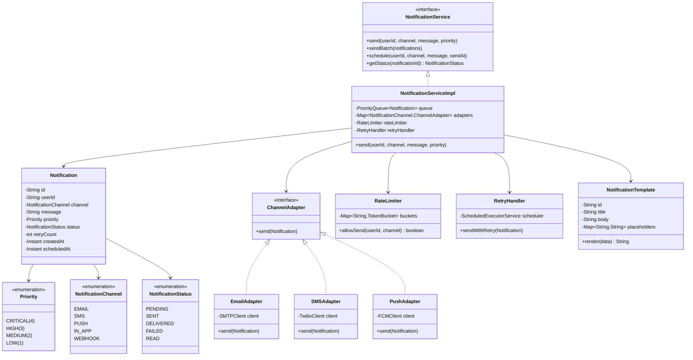

# Notification System - Complete LLD Guide

## 📋 Table of Contents
1. [Problem Statement](#problem-statement)
2. [Requirements](#requirements)
3. [Core Algorithms](#core-algorithms)
4. [System Design](#system-design)
5. [Class Diagram](#class-diagram)
6. [Design Patterns](#design-patterns-used)
7. [Implementation Deep Dive](#implementation-deep-dive)
8. [Key Insights](#key-insights)
9. [Complete Implementation](#complete-implementation)

---

## Problem Statement

Design a **Multi-Channel Notification System** that delivers notifications via email, SMS, push notifications, in-app messages, and webhooks. Support prioritization, rate limiting, retry logic, delivery guarantees, and user preferences for millions of notifications per day.

### Real-World Context
- 📧 **SendGrid**: 100B+ emails/month
- 📱 **Firebase Cloud Messaging**: 500B+ push notifications/day
- 💬 **Twilio**: 1T+ SMS messages/year
- 🔔 **Slack**: Real-time notifications to 20M+ users

### Key Challenges
- 📡 **Multi-Channel**: Email, SMS, push, in-app, webhook
- 🎯 **Prioritization**: Critical > high > medium > low
- 🔄 **Retry Logic**: Exponential backoff for failures
- 🚦 **Rate Limiting**: Per user, per channel (prevent spam)
- ⏰ **Scheduling**: Immediate, delayed, batch
- 📊 **Tracking**: Delivery status, read receipts, clicks
- 🔒 **User Preferences**: Opt-in/out, quiet hours

---

## Requirements

### Functional Requirements

✅ **Multi-Channel Delivery**
- Email (SMTP, SendGrid, SES)
- SMS (Twilio, Nexmo)
- Push (FCM, APNS)
- In-App (WebSocket)
- Webhook (HTTP POST)

✅ **Priority Levels**
- **CRITICAL**: Sent immediately (security alerts)
- **HIGH**: Within 1 minute (payment confirmations)
- **MEDIUM**: Within 5 minutes (social interactions)
- **LOW**: Batched hourly (newsletters)

✅ **Delivery Modes**
- **Immediate**: Send right away
- **Scheduled**: Send at specific time
- **Batched**: Group similar notifications

✅ **User Preferences**
- Channel preferences (email: yes, SMS: no)
- Notification types (transactional: yes, promotional: no)
- Quiet hours (11pm - 7am)
- Frequency limits (max 5/day per channel)

✅ **Tracking**
- Delivery status (sent, delivered, failed)
- Read receipts (opened email, read in-app)
- Click tracking (clicked link)
- Unsubscribe tracking

✅ **Retry Logic**
- Failed notifications retry with exponential backoff
- Max retries (3-5 attempts)
- Dead letter queue for permanent failures

### Non-Functional Requirements

⚡ **Performance**
- Send notification: < 100ms (enqueue)
- Actual delivery: < 5 seconds
- Handle 10M+ notifications/hour

🔒 **Reliability**
- 99.9% delivery rate
- No duplicate notifications
- At-least-once delivery

📈 **Scalability**
- Support 100M users
- Handle traffic spikes (Black Friday)

---

## Core Algorithms

### 1. Priority Queue Processing

**Algorithm:**
```
1. Notifications arrive with priority
2. Insert into priority queue (heap)
3. Workers pull highest priority first
4. Process and send
```

**Implementation:**
```java
public class NotificationProcessor {
    private PriorityBlockingQueue<Notification> queue;
    private ExecutorService workers;
    
    public NotificationProcessor(int numWorkers) {
        this.queue = new PriorityBlockingQueue<>(1000, 
            Comparator.comparing(Notification::getPriority).reversed());
        this.workers = Executors.newFixedThreadPool(numWorkers);
        
        // Start workers
        for (int i = 0; i < numWorkers; i++) {
            workers.submit(this::processNotifications);
        }
    }
    
    public void enqueue(Notification notification) {
        queue.offer(notification);
    }
    
    private void processNotifications() {
        while (true) {
            try {
                Notification notification = queue.take(); // Blocking
                sendNotification(notification);
            } catch (InterruptedException e) {
                Thread.currentThread().interrupt();
                break;
            }
        }
    }
}
```

**Complexity:**
- Time: O(log n) for insertion, O(log n) for extraction
- Space: O(n) for queue

---

### 2. Rate Limiting (Token Bucket)

**Algorithm:**
```
1. Each user has a token bucket per channel
2. Bucket refills at fixed rate (e.g., 1 token/hour)
3. Sending notification consumes 1 token
4. If no tokens, drop or delay notification
```

**Implementation:**
```java
public class RateLimiter {
    private Map<String, TokenBucket> buckets = new ConcurrentHashMap<>();
    
    public boolean allowSend(String userId, NotificationChannel channel) {
        String key = userId + ":" + channel.name();
        TokenBucket bucket = buckets.computeIfAbsent(key, 
            k -> new TokenBucket(10, 1.0)); // 10 tokens, refill 1/hour
        
        return bucket.consume(1);
    }
    
    static class TokenBucket {
        private double tokens;
        private double maxTokens;
        private double refillRate; // tokens per second
        private Instant lastRefill;
        
        public TokenBucket(double maxTokens, double refillRatePerHour) {
            this.tokens = maxTokens;
            this.maxTokens = maxTokens;
            this.refillRate = refillRatePerHour / 3600.0;
            this.lastRefill = Instant.now();
        }
        
        public synchronized boolean consume(double amount) {
            refill();
            
            if (tokens >= amount) {
                tokens -= amount;
                return true;
            }
            return false;
        }
        
        private void refill() {
            Instant now = Instant.now();
            double secondsSinceLastRefill = Duration.between(lastRefill, now).toSeconds();
            double tokensToAdd = secondsSinceLastRefill * refillRate;
            
            tokens = Math.min(maxTokens, tokens + tokensToAdd);
            lastRefill = now;
        }
    }
}
```

---

### 3. Retry with Exponential Backoff

**Algorithm:**
```
1. Initial attempt fails
2. Wait 2^retry_count seconds (1s, 2s, 4s, 8s, 16s)
3. Retry
4. If max retries exceeded, move to DLQ
```

**Implementation:**
```java
public class RetryHandler {
    private static final int MAX_RETRIES = 5;
    private ScheduledExecutorService scheduler = Executors.newScheduledThreadPool(10);
    
    public void sendWithRetry(Notification notification) {
        sendWithRetry(notification, 0);
    }
    
    private void sendWithRetry(Notification notification, int attempt) {
        try {
            channelSender.send(notification);
            notification.setStatus(NotificationStatus.DELIVERED);
        } catch (Exception e) {
            if (attempt >= MAX_RETRIES) {
                // Max retries exceeded
                notification.setStatus(NotificationStatus.FAILED);
                deadLetterQueue.add(notification);
                return;
            }
            
            // Schedule retry with exponential backoff
            long delaySeconds = (long) Math.pow(2, attempt);
            scheduler.schedule(() -> sendWithRetry(notification, attempt + 1), 
                delaySeconds, TimeUnit.SECONDS);
        }
    }
}
```

**Example:**
```
Attempt 1: Immediate → FAIL
Attempt 2: After 1s → FAIL
Attempt 3: After 2s → FAIL
Attempt 4: After 4s → FAIL
Attempt 5: After 8s → FAIL
Attempt 6: After 16s → FAIL
→ Move to Dead Letter Queue
```

---

### 4. Quiet Hours Check

**Algorithm:**
```
1. Check user's quiet hours preference (11pm - 7am)
2. Check current time in user's timezone
3. If in quiet hours, schedule for next morning
```

**Implementation:**
```java
public class QuietHoursHandler {
    
    public boolean isQuietHours(User user) {
        ZonedDateTime now = ZonedDateTime.now(ZoneId.of(user.getTimezone()));
        int hour = now.getHour();
        
        int quietStart = user.getQuietHoursStart(); // 23 (11pm)
        int quietEnd = user.getQuietHoursEnd(); // 7 (7am)
        
        if (quietStart > quietEnd) {
            // Wraps around midnight
            return hour >= quietStart || hour < quietEnd;
        } else {
            return hour >= quietStart && hour < quietEnd;
        }
    }
    
    public Instant calculateNextDeliveryTime(User user) {
        if (!isQuietHours(user)) {
            return Instant.now(); // Send immediately
        }
        
        ZonedDateTime now = ZonedDateTime.now(ZoneId.of(user.getTimezone()));
        ZonedDateTime nextMorning = now.withHour(user.getQuietHoursEnd()).withMinute(0);
        
        if (nextMorning.isBefore(now)) {
            nextMorning = nextMorning.plusDays(1);
        }
        
        return nextMorning.toInstant();
    }
}
```

---

## System Design

### Architecture Diagram

```
Producer → Queue (Kafka) → Notification Service → Channel Adapters → Users
                               │
                               ├─→ Priority Queue
                               ├─→ Rate Limiter
                               ├─→ Retry Handler
                               ├─→ Quiet Hours Check
                               └─→ Template Renderer

Channel Adapters:
  ├─ Email Adapter (SendGrid)
  ├─ SMS Adapter (Twilio)
  ├─ Push Adapter (FCM)
  ├─ In-App Adapter (WebSocket)
  └─ Webhook Adapter (HTTP)
```

### Processing Pipeline

```
1. Notification Created
   │
   ▼
2. Check User Preferences
   │  ├─ Opted out? → Drop
   │  ├─ In quiet hours? → Schedule for later
   │  └─ Rate limit exceeded? → Drop/delay
   │
   ▼
3. Enqueue with Priority
   │
   ▼
4. Render Template
   │  (Replace {{username}}, {{amount}}, etc.)
   │
   ▼
5. Send via Channel Adapter
   │
   ▼
6. Track Delivery Status
   │
   ▼ (if failed)
7. Retry with Exponential Backoff
   │
   ▼ (if max retries exceeded)
8. Dead Letter Queue
```

---

## Class Diagram


<details>
<summary>📄 View Mermaid Source</summary>


</details>

---

## Design Patterns Used

### 1. Strategy Pattern (Channel Adapters)

```java
public interface ChannelAdapter {
    void send(Notification notification);
}

public class EmailAdapter implements ChannelAdapter {
    private SMTPClient smtpClient;
    
    @Override
    public void send(Notification notification) {
        Email email = new Email(
            notification.getRecipient(),
            notification.getSubject(),
            notification.getBody()
        );
        smtpClient.send(email);
    }
}

// Dynamically select adapter
public class NotificationServiceImpl {
    private Map<NotificationChannel, ChannelAdapter> adapters = new EnumMap<>(NotificationChannel.class);
    
    public void send(Notification notification) {
        ChannelAdapter adapter = adapters.get(notification.getChannel());
        adapter.send(notification);
    }
}
```

---

### 2. Template Method Pattern (Template Rendering)

```java
public abstract class NotificationTemplate {
    public final String render(Map<String, String> data) {
        String content = getTemplate();
        content = replacePlaceholders(content, data);
        content = addFooter(content);
        return content;
    }
    
    protected abstract String getTemplate();
    
    private String replacePlaceholders(String template, Map<String, String> data) {
        for (Map.Entry<String, String> entry : data.entrySet()) {
            template = template.replace("{{" + entry.getKey() + "}}", entry.getValue());
        }
        return template;
    }
    
    protected String addFooter(String content) {
        return content + "\n\nUnsubscribe: https://example.com/unsubscribe";
    }
}
```

---

### 3. Observer Pattern (Delivery Status Updates)

```java
public interface NotificationObserver {
    void onDelivered(Notification notification);
    void onFailed(Notification notification);
    void onRead(Notification notification);
}

public class AnalyticsService implements NotificationObserver {
    @Override
    public void onDelivered(Notification notification) {
        metricsCollector.increment("notifications.delivered." + notification.getChannel());
    }
    
    @Override
    public void onFailed(Notification notification) {
        metricsCollector.increment("notifications.failed." + notification.getChannel());
        alertService.sendAlert("Notification failed: " + notification.getId());
    }
}
```

---

## Key Insights

### What Interviewers Look For

1. ✅ **Multi-Channel**: Email, SMS, push, in-app
2. ✅ **Prioritization**: Critical notifications sent first
3. ✅ **Rate Limiting**: Prevent spam
4. ✅ **Retry Logic**: Exponential backoff
5. ✅ **User Preferences**: Opt-in/out, quiet hours
6. ✅ **Scalability**: Handle millions of notifications
7. ✅ **Tracking**: Delivery status, read receipts

---

### Common Mistakes

1. ❌ **No prioritization**: All notifications equal priority
2. ❌ **No rate limiting**: Spam users
3. ❌ **No retry logic**: Lose notifications on failure
4. ❌ **Ignoring quiet hours**: Wake users at 3am
5. ❌ **Synchronous sending**: Block application
6. ❌ **No dead letter queue**: Lose track of failures

---

## Source Code

📄 **[View Complete Source Code](/problems/notification/CODE)**

**Total Lines of Code:** 520+

---

## Usage Example

```java
NotificationService service = new NotificationServiceImpl();

// Send critical notification (immediate)
service.send(
    userId,
    NotificationChannel.SMS,
    "Your account was accessed from a new device",
    Priority.CRITICAL
);

// Send medium priority notification (respects quiet hours)
service.send(
    userId,
    NotificationChannel.EMAIL,
    "You have a new message from John",
    Priority.MEDIUM
);

// Schedule notification for later
service.schedule(
    userId,
    NotificationChannel.PUSH,
    "Your order will arrive today",
    Instant.now().plus(1, ChronoUnit.HOURS)
);

// Send batch
List<Notification> batch = Arrays.asList(
    new Notification(user1, EMAIL, "Newsletter"),
    new Notification(user2, EMAIL, "Newsletter")
);
service.sendBatch(batch);
```

---

## Interview Tips

### Questions to Ask

1. ❓ Which channels to support?
2. ❓ Priority levels needed?
3. ❓ Rate limiting requirements?
4. ❓ Retry policy?
5. ❓ User preferences?
6. ❓ Delivery guarantees?

### How to Approach

1. Start with single channel (email)
2. Add multi-channel support
3. Add priority queue
4. Add rate limiting
5. Add retry logic
6. Add user preferences
7. Discuss scalability

---

## Related Problems

- 📧 **Email Service** - SMTP, templates
- 📱 **Push Notification** - FCM, APNS
- 💬 **Chat System** - Real-time messaging
- 📊 **Pub/Sub** - Message distribution

---

*Production-ready notification system with multi-channel delivery, prioritization, rate limiting, and retry logic for reliable communication at scale.*
