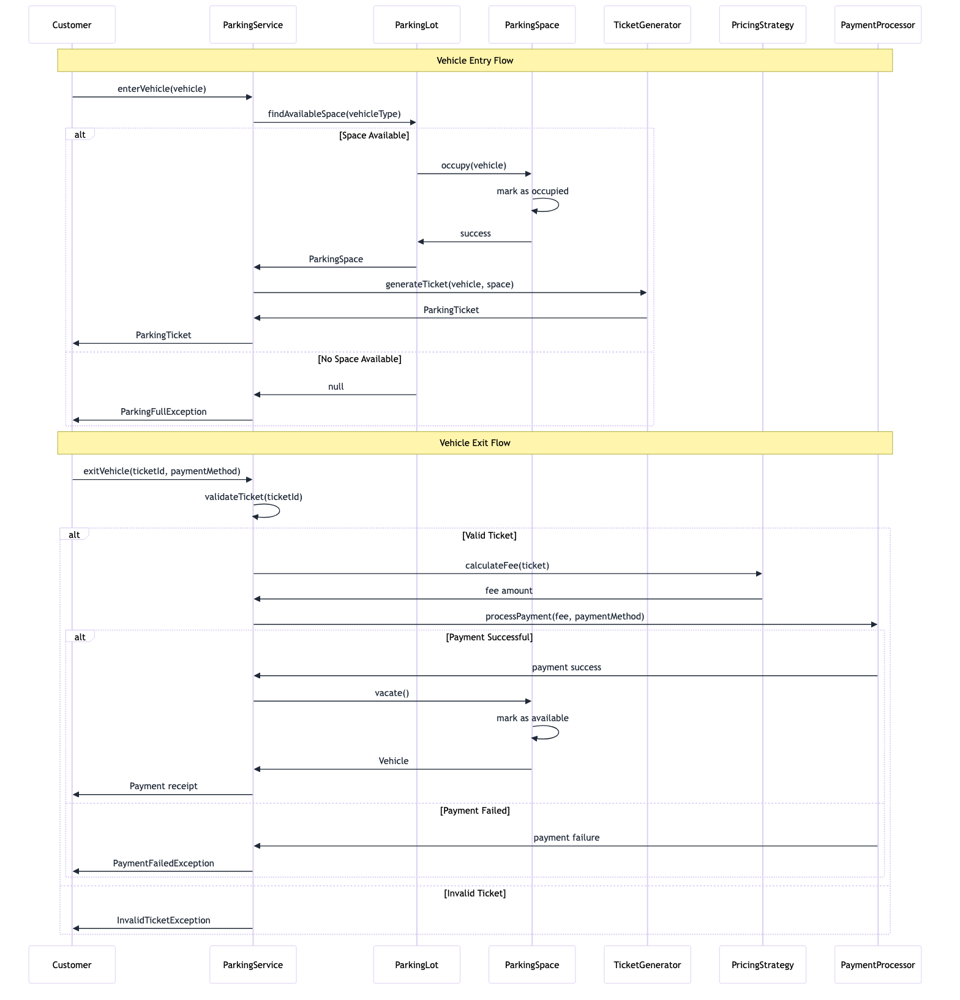

# Parking Lot System 🚗

A complete LLD implementation of a multi-floor parking lot system.

---

## 📋 **Overview**

| Feature | Description |
|---------|-------------|
| Multi-floor | Supports multiple parking floors |
| Vehicle Types | Motorcycle, Car, Truck, Electric |
| Pricing | Hourly, tiered, peak hours |
| Payment | Cash, Card, Mobile |

---

## 📊 **Diagrams**

### Class Diagram

### Sequence Diagram - Entry/Exit Flow

---

## 🏗️ **Architecture**

### Domain Models
- `Vehicle` - Base class for all vehicle types
- `ParkingSpace` - Individual parking slot
- `ParkingFloor` - Collection of spaces
- `ParkingTicket` - Entry/exit tracking
- `Payment` - Payment processing

### Services
- `ParkingService` - Core parking operations
- `PricingStrategy` - Fee calculation
- `PaymentProcessor` - Payment handling
- `SpaceAllocationStrategy` - Space finding

---

## 💻 **Implementation**

**Source Code**: [View Complete Implementation](/problems/parkinglot/CODE)

### Key Files
- `api/ParkingService.java` - Main service interface
- `api/PricingStrategy.java` - Pricing interface
- `model/Vehicle.java` - Vehicle hierarchy
- `model/ParkingSpace.java` - Space model
- `model/ParkingTicket.java` - Ticket model

---

## 📖 **Related Documentation**

- [Day Summary](problems/parkinglot/DAY1_SUMMARY.md)
- [Diagram Details](problems/parkinglot/DIAGRAMS.md)
- [Weekend Project Guide](week1/weekend/README.md)
