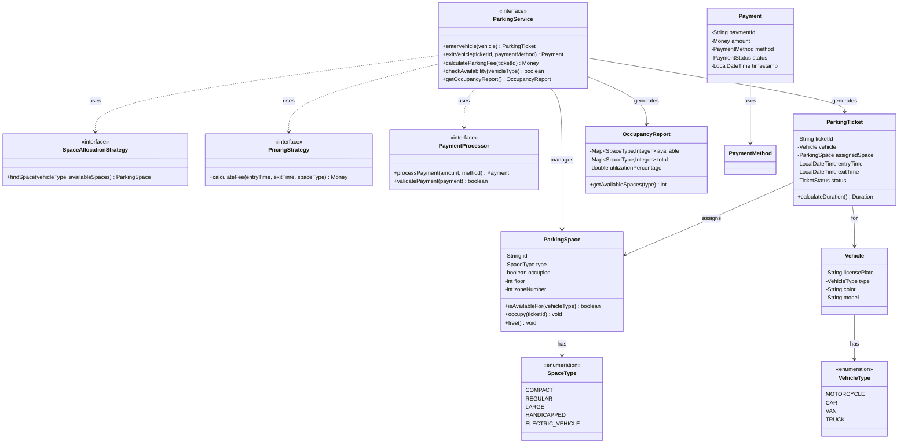
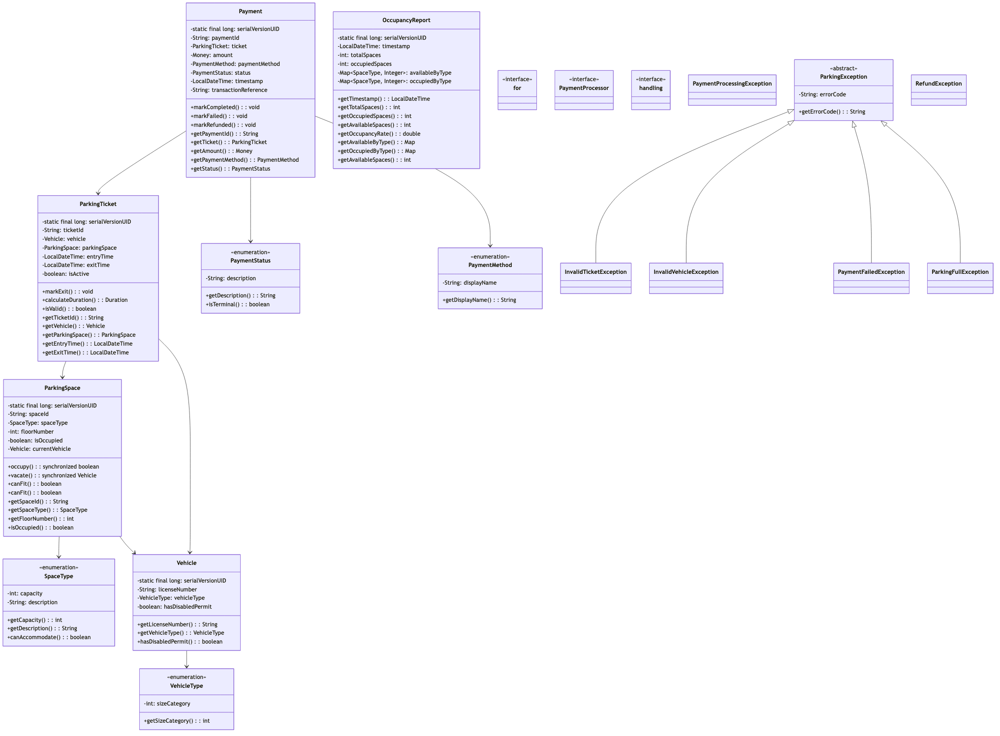

# Parking Lot System - Complete Implementation

A comprehensive parking lot management system supporting multiple vehicle types, flexible pricing strategies, payment processing, and real-time availability tracking.

## Quick Links
- [View Complete Source Code](/problems/parkinglot/CODE)
- [Project Structure](/problems/parkinglot/CODE#-directory-structure)

---

## Problem Statement

Design and implement a parking lot management system that can:
- Support multiple vehicle types (Motorcycle, Car, Van, Truck) with appropriate space allocation
- Handle vehicle entry with ticket generation and exit with payment processing
- Implement flexible pricing strategies (hourly, flat rate, peak/off-peak)
- Track real-time occupancy and availability per vehicle type
- Support different space allocation strategies (nearest, cheapest, compact)
- Process payments via multiple methods (cash, card, digital wallet)
- Generate occupancy reports and revenue analytics

**Real-world applications**: Airport parking, mall parking garages, street parking meters, valet services, ParkMobile app.

---

## Requirements

### Functional Requirements

1. **Vehicle Entry**
   - Validate vehicle type and find suitable available space
   - Generate unique parking ticket with entry time
   - Assign space based on allocation strategy
   - Update occupancy in real-time

2. **Vehicle Exit**
   - Calculate parking fee based on duration and pricing strategy
   - Process payment via chosen method
   - Free the parking space
   - Generate payment receipt

3. **Space Management**
   - Support multiple space types: COMPACT, REGULAR, LARGE, HANDICAPPED
   - Map vehicle types to compatible space types
     - Motorcycle → COMPACT
     - Car → COMPACT or REGULAR
     - Van → LARGE
     - Truck → LARGE
   - Track available/occupied spaces per type

4. **Pricing Strategies**
   - Hourly pricing with grace period
   - Flat daily rate
   - Peak/off-peak differential pricing
   - Weekend vs weekday rates
   - Early bird specials

5. **Payment Processing**
   - Support multiple payment methods
   - Validate payment before exit
   - Generate itemized receipt
   - Handle payment failures gracefully

6. **Reporting**
   - Real-time occupancy report (available vs total per type)
   - Revenue analytics (per day/week/month)
   - Average duration per vehicle type
   - Peak utilization times

### Non-Functional Requirements

1. **Performance**
   - O(1) check availability for a vehicle type
   - O(log n) or better find available space
   - < 500ms for entry/exit operations
   - Support 1000+ parking spaces

2. **Scalability**
   - Multi-floor support
   - Distributed parking lots (multiple locations)
   - Horizontal scaling of payment processing

3. **Reliability**
   - Atomic ticket generation (no duplicates)
   - Consistent occupancy tracking
   - Payment transaction safety (ACID)
   - Lost ticket handling

4. **Usability**
   - Clear error messages for full lot
   - Display estimated wait time if full
   - Show nearest available space on entry

---

## Class Diagram

<details>
<summary>View Mermaid Source</summary>



</details>



---
## Key Design Decisions

### 1. Strategy Pattern for Space Allocation
**Decision**: Use Strategy pattern for different space allocation algorithms.

**Strategies**:
- **NearestFirst**: Minimize walking distance (allocate closest to entrance)
- **CompactFirst**: Maximize utilization (fill smaller spaces first)
- **CheapestFirst**: Minimize customer cost (if spaces have different rates)
- **FloorBalanced**: Distribute load across floors evenly

**Rationale**:
- Different lots have different priorities (airport vs mall)
- Easy to A/B test allocation strategies
- Open/Closed Principle: add strategies without modifying core logic

**Tradeoffs**:
- ✅ Highly flexible and extensible
- ✅ Easy to switch strategies at runtime
- ❌ More classes/interfaces
- ❌ Slight indirection overhead

### 2. Strategy Pattern for Pricing
**Decision**: Pluggable pricing strategies via interface.

**Pricing Models**:
- **HourlyPricing**: $3/hour, 15-min grace period
- **FlatRate**: $20/day regardless of duration
- **PeakOffPeakPricing**: $5/hour peak, $2/hour off-peak
- **EarlyBirdSpecial**: $15 if enter before 9am and exit before 6pm

**Rationale**:
- Different locations need different pricing (downtown vs suburb)
- Promotions and special events require flexibility
- Easy to test revenue impact of pricing changes

**Example**:
```java
interface PricingStrategy {
    Money calculateFee(LocalDateTime entryTime, 
                      LocalDateTime exitTime,
                      SpaceType spaceType);
}

class HourlyPricing implements PricingStrategy {
    private final Money hourlyRate;
    private final Duration gracePeriod = Duration.ofMinutes(15);
    
    public Money calculateFee(...) {
        Duration duration = Duration.between(entryTime, exitTime);
        if (duration.compareTo(gracePeriod) <= 0) {
            return Money.zero();
        }
        long hours = duration.toHours() + 1; // Round up
        return hourlyRate.multiply(hours);
    }
}
```

### 3. Real-Time Occupancy Tracking
**Decision**: Maintain `Map<SpaceType, Set<ParkingSpace>>` for available spaces.

**Rationale**:
- O(1) check if any space available for vehicle type
- O(1) retrieval of available space set
- Real-time updates on entry/exit
- Easy generation of occupancy reports

**Data Structure**:
```java
class ParkingLot {
    private Map<SpaceType, Set<ParkingSpace>> availableSpaces;
    private Map<SpaceType, Set<ParkingSpace>> occupiedSpaces;
    
    public boolean hasAvailability(VehicleType vehicleType) {
        for (SpaceType compatible : getCompatibleTypes(vehicleType)) {
            if (!availableSpaces.get(compatible).isEmpty()) {
                return true;
            }
        }
        return false;
    }
}
```

**Tradeoffs**:
- ✅ Fast availability check
- ✅ Simple occupancy reporting
- ❌ Memory for two sets per space type
- ❌ Must keep sets synchronized

### 4. Ticket as State Machine
**Decision**: Track ticket status (ACTIVE, PAID, CANCELLED, LOST).

**State Transitions**:
```
ACTIVE → PAID (normal exit with payment)
ACTIVE → CANCELLED (cancelled before exit)
ACTIVE → LOST (reported lost, pay penalty)
```

**Rationale**:
- Prevents double-payment
- Handles lost ticket scenario
- Enables partial payments (pay at kiosk, exit later)

**Lost Ticket Handling**:
```java
public Money calculateFeeForLostTicket(VehicleType vehicleType) {
    // Charge for maximum duration (e.g., 24 hours)
    LocalDateTime now = LocalDateTime.now();
    LocalDateTime assumed = now.minusHours(24);
    return pricingStrategy.calculateFee(assumed, now, getSpaceType(vehicleType));
}
```

---

## Implementation Guide

### 1. Find Available Space Algorithm

```
Algorithm: FindAvailableSpace(vehicleType, allocationStrategy)
Input: vehicle type (MOTORCYCLE, CAR, VAN, TRUCK)
Output: ParkingSpace or null

1. compatibleTypes = getCompatibleSpaceTypes(vehicleType)
   // e.g., CAR → [COMPACT, REGULAR]

2. candidates = []
   for each spaceType in compatibleTypes:
      candidates.addAll(availableSpaces.get(spaceType))

3. if candidates is empty:
      return null  // Parking full for this vehicle type

4. optimalSpace = allocationStrategy.select(candidates)
   // Different strategies pick differently:
   //   - Nearest: min distance to entrance
   //   - Compact: smallest compatible space
   //   - Cheapest: lowest hourly rate

5. return optimalSpace
```

**Time Complexity**: O(k) where k = available spaces for vehicle type  
**Space Complexity**: O(1)

**Optimization**: Use priority queue/heap per space type:
```java
// For Nearest strategy
PriorityQueue<ParkingSpace> availableSpaces = 
    new PriorityQueue<>(Comparator.comparingInt(ParkingSpace::getDistanceToEntrance));
```

---

### 2. Vehicle Entry Algorithm

```
Algorithm: EnterVehicle(vehicle)
Input: Vehicle object
Output: ParkingTicket

1. if !isValidVehicle(vehicle):
      throw InvalidVehicleException

2. space = findAvailableSpace(vehicle.type, allocationStrategy)

3. if space == null:
      throw ParkingFullException("No space for " + vehicle.type)

4. // Atomically assign space
   synchronized(space):
      if space.isOccupied():
         goto step 2  // Race condition, try next space
      
      space.setOccupied(true)
      availableSpaces.get(space.type).remove(space)
      occupiedSpaces.get(space.type).add(space)

5. ticket = new ParkingTicket(
      id: generateUniqueId(),
      vehicle: vehicle,
      space: space,
      entryTime: LocalDateTime.now(),
      status: ACTIVE
   )

6. tickets.put(ticket.id, ticket)

7. return ticket
```

**Time Complexity**: O(log k) with priority queue, O(k) with set  
**Space Complexity**: O(1)

**Concurrency**: Synchronized block prevents double-booking same space.

---

### 3. Calculate Parking Fee Algorithm

```
Algorithm: CalculateParkingFee(ticketId)
Input: ticket ID string
Output: Money (fee amount)

1. ticket = tickets.get(ticketId)
   if ticket == null:
      throw InvalidTicketException

2. if ticket.status != ACTIVE:
      throw IllegalStateException("Ticket already processed")

3. entryTime = ticket.entryTime
   exitTime = LocalDateTime.now()
   
4. duration = Duration.between(entryTime, exitTime)

5. if duration <= gracePeriod:
      return Money.zero()  // Free parking for short stays

6. spaceType = ticket.assignedSpace.type

7. fee = pricingStrategy.calculateFee(entryTime, exitTime, spaceType)

8. // Apply discounts if any
   if hasDiscount(ticket):
      fee = fee.multiply(0.9)  // 10% off

9. return fee
```

**Time Complexity**: O(1)  
**Space Complexity**: O(1)

**Pricing Strategy Examples**:

**Hourly**:
```
Rate: $3/hour
Duration: 2h 45m
Hours: ceil(2.75) = 3 hours
Fee: 3 × $3 = $9
```

**Peak/Off-Peak**:
```
Entry: 16:00 (off-peak: $2/hour)
Exit: 19:00 (peak starts at 17:00: $5/hour)
Duration in off-peak: 1 hour → $2
Duration in peak: 2 hours → $10
Total: $12
```

---

### 4. Vehicle Exit Algorithm

```
Algorithm: ExitVehicle(ticketId, paymentMethod)
Input: ticket ID, payment method
Output: Payment receipt

1. ticket = tickets.get(ticketId)
   validateTicket(ticket)

2. fee = calculateParkingFee(ticketId)

3. payment = paymentProcessor.processPayment(fee, paymentMethod)

4. if payment.status == FAILED:
      throw PaymentFailedException

5. // Free the space
   space = ticket.assignedSpace
   synchronized(space):
      space.setOccupied(false)
      occupiedSpaces.get(space.type).remove(space)
      availableSpaces.get(space.type).add(space)

6. ticket.exitTime = LocalDateTime.now()
   ticket.status = PAID

7. return payment
```

**Time Complexity**: O(1) for hash operations + payment processing time  
**Space Complexity**: O(1)

**Transaction Safety**:
- Payment processed BEFORE freeing space
- If payment fails, space remains occupied
- Prevents "park and run" fraud

---

### 5. Occupancy Report Algorithm

```
Algorithm: GenerateOccupancyReport()
Input: none
Output: OccupancyReport

1. report = new OccupancyReport()

2. for each spaceType in [COMPACT, REGULAR, LARGE, HANDICAPPED]:
      total = totalSpaces.get(spaceType)
      available = availableSpaces.get(spaceType).size()
      occupied = occupiedSpaces.get(spaceType).size()
      
      report.setAvailable(spaceType, available)
      report.setTotal(spaceType, total)
      report.setUtilization(spaceType, (occupied / total) * 100)

3. overallUtilization = sum(occupied) / sum(total) * 100
   report.setOverallUtilization(overallUtilization)

4. return report
```

**Time Complexity**: O(1) - fixed number of space types  
**Space Complexity**: O(1)

**Output Example**:
```
COMPACT: 45/50 available (10% utilization)
REGULAR: 12/100 available (88% utilization)
LARGE: 5/20 available (75% utilization)
HANDICAPPED: 8/10 available (20% utilization)
Overall: 130/180 available (28% utilization)
```

---

## Source Code

All source code available in [CODE.md](/problems/parkinglot/CODE):

**API Interfaces** (4 files):
- [api/ParkingService.java](/problems/parkinglot/CODE#apiparkingservicejava)
- [api/SpaceAllocationStrategy.java](/problems/parkinglot/CODE#apispaceallocationstrategyjava)
- [api/PricingStrategy.java](/problems/parkinglot/CODE#apipricingstrategyjava)
- [api/PaymentProcessor.java](/problems/parkinglot/CODE#apipaymentprocessorjava)

**Models** (10 files):
- [model/ParkingSpace.java](/problems/parkinglot/CODE#modelparkingspacejava)
- [model/ParkingTicket.java](/problems/parkinglot/CODE#modelparkingticketjava)
- [model/Vehicle.java](/problems/parkinglot/CODE#modelvehiclejava)
- [model/VehicleType.java](/problems/parkinglot/CODE#modelvehicletypejava)
- [model/SpaceType.java](/problems/parkinglot/CODE#modelspacetypejava)
- [model/Payment.java](/problems/parkinglot/CODE#modelpaymentjava)
- [model/PaymentMethod.java](/problems/parkinglot/CODE#modelpaymentmethodjava)
- [model/PaymentStatus.java](/problems/parkinglot/CODE#modelpaymentstatusjava)
- [model/OccupancyReport.java](/problems/parkinglot/CODE#modeloccupancyreportjava)

**Exceptions** (6 files):
- [api/exceptions/*](/problems/parkinglot/CODE#-directory-structure)

**Total**: 20 files, ~1200 lines of code

---
## Interview Discussion Points

### 1. Multi-Floor Parking Lot

**Q**: How to extend to support multiple floors?

**Design**:
```java
class ParkingFloor {
    private int floorNumber;
    private Map<SpaceType, Set<ParkingSpace>> spaces;
    
    public Optional<ParkingSpace> findSpace(VehicleType type) {
        // Find space on this floor
    }
}

class ParkingLot {
    private List<ParkingFloor> floors;
    
    public ParkingSpace findSpace(VehicleType type) {
        // Try ground floor first, then upper floors
        for (ParkingFloor floor : floors) {
            Optional<ParkingSpace> space = floor.findSpace(type);
            if (space.isPresent()) return space.get();
        }
        throw new ParkingFullException();
    }
}
```

**Optimization**: Use elevator proximity for allocation.

### 2. Real-Time Display Boards

**Q**: How to show "Spaces Available" on entry boards?

**Approach 1: Push-Based (Event-Driven)**:
```java
class ParkingLot {
    private List<DisplayBoard> boards = new ArrayList<>();
    
    public void enterVehicle(Vehicle v) {
        // ... assign space ...
        
        // Notify all boards
        for (DisplayBoard board : boards) {
            board.update(getOccupancyReport());
        }
    }
}
```

**Approach 2: Pull-Based (Polling)**:
```java
class DisplayBoard {
    private ScheduledExecutorService scheduler = Executors.newScheduledThreadPool(1);
    
    public void start() {
        scheduler.scheduleAtFixedRate(() -> {
            OccupancyReport report = parkingLot.getOccupancyReport();
            updateDisplay(report);
        }, 0, 5, TimeUnit.SECONDS);
    }
}
```

**Approach 3: Message Queue (Scalable)**:
```
ParkingService → Kafka Topic → Display Board Consumers
```

### 3. Distributed Parking Lot (Multiple Locations)

**Q**: How to manage parking across multiple lots in a city?

**Centralized Registry**:
```java
class CityParkingRegistry {
    private Map<String, ParkingLot> lots;  // locationId → lot
    
    public List<ParkingLot> findLotsWithAvailability(
        Location userLocation,
        VehicleType vehicleType,
        double maxDistanceKm
    ) {
        return lots.values().stream()
            .filter(lot -> lot.hasAvailability(vehicleType))
            .filter(lot -> distance(userLocation, lot.getLocation()) <= maxDistanceKm)
            .sorted(Comparator.comparingDouble(lot -> distance(userLocation, lot.getLocation())))
            .collect(Collectors.toList());
    }
}
```

**Mobile App Integration**:
- Show available lots on map
- Reserve space in advance (holds for 15 minutes)
- Navigate to assigned space with GPS

### 4. Dynamic Pricing

**Q**: Implement surge pricing during peak hours.

**Dynamic Pricing Strategy**:
```java
class DynamicPricingStrategy implements PricingStrategy {
    public Money calculateFee(LocalDateTime entry, LocalDateTime exit, SpaceType type) {
        Money baseFee = calculateBaseFee(entry, exit);
        
        // Apply surge multiplier based on occupancy
        OccupancyReport report = parkingLot.getOccupancyReport();
        double utilizationRate = report.getOverallUtilization();
        
        double surgeMultiplier = 1.0;
        if (utilizationRate > 0.9) {
            surgeMultiplier = 2.0;  // 2x price when 90% full
        } else if (utilizationRate > 0.75) {
            surgeMultiplier = 1.5;  // 1.5x price when 75% full
        }
        
        return baseFee.multiply(surgeMultiplier);
    }
}
```

**Benefits**: Maximizes revenue, encourages off-peak usage.

### 5. Valet Parking Mode

**Q**: How to implement valet service where attendant parks the car?

**Design Changes**:
```java
class ValetTicket extends ParkingTicket {
    private String valetId;  // Who parked the car
    private String keyLocation;  // Where keys are stored
    private int retrievalTimeMinutes;  // Estimated time to retrieve
}

class ValetService {
    public ValetTicket acceptVehicle(Vehicle vehicle, Customer customer) {
        // Customer hands over keys
        ParkingSpace space = findOptimalSpace(vehicle);  // Valet can park anywhere
        
        ValetTicket ticket = new ValetTicket(...);
        ticket.setValetId(currentValet.getId());
        ticket.setKeyLocation(keyStorageBox.getId());
        
        return ticket;
    }
    
    public void retrieveVehicle(String ticketId) {
        ValetTicket ticket = tickets.get(ticketId);
        
        // Notify valet to retrieve car
        notifyValet(ticket.getValetId(), ticket.getAssignedSpace());
        
        // Estimate retrieval time based on space location
        int minutes = calculateRetrievalTime(ticket.getAssignedSpace());
        return minutes;
    }
}
```

### 6. Reservation System

**Q**: Allow customers to reserve parking in advance.

**Reservation Logic**:
```java
class Reservation {
    private String reservationId;
    private LocalDateTime reservationTime;
    private LocalDateTime expiryTime;  // Hold space for 15 min after reservation
    private ParkingSpace reservedSpace;
    private ReservationStatus status;  // ACTIVE, USED, EXPIRED, CANCELLED
}

class ReservationService {
    public Reservation reserveSpace(VehicleType type, LocalDateTime arrivalTime) {
        if (arrivalTime.isBefore(LocalDateTime.now().plusMinutes(30))) {
            throw new IllegalArgumentException("Must reserve at least 30 min in advance");
        }
        
        ParkingSpace space = findAvailableSpace(type);
        if (space == null) {
            throw new ParkingFullException();
        }
        
        space.setReserved(true);
        
        Reservation reservation = new Reservation(...);
        reservation.setExpiryTime(arrivalTime.plusMinutes(15));
        
        // Schedule auto-cancellation if not used
        scheduler.schedule(() -> {
            if (reservation.getStatus() == ACTIVE) {
                space.setReserved(false);
                reservation.setStatus(EXPIRED);
            }
        }, 45, TimeUnit.MINUTES);
        
        return reservation;
    }
}
```

**Payment**: Charge reservation fee ($5) non-refundable, deducted from parking fee.

---

## Extensions

1. **Electric Vehicle Charging**: Special EV spaces with charging stations, track charging time
2. **Monthly Passes**: Subscription model with reserved spaces
3. **Handicapped Access**: Ensure minimum handicapped spaces per regulations
4. **License Plate Recognition**: Auto-entry/exit with cameras (no tickets)
5. **Mobile Payment**: Pay via app before exiting

---

**See Also**: ParkMobile, SpotHero, LAZ Parking, airport parking systems
