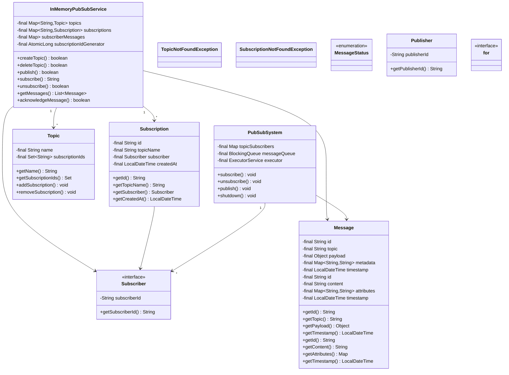
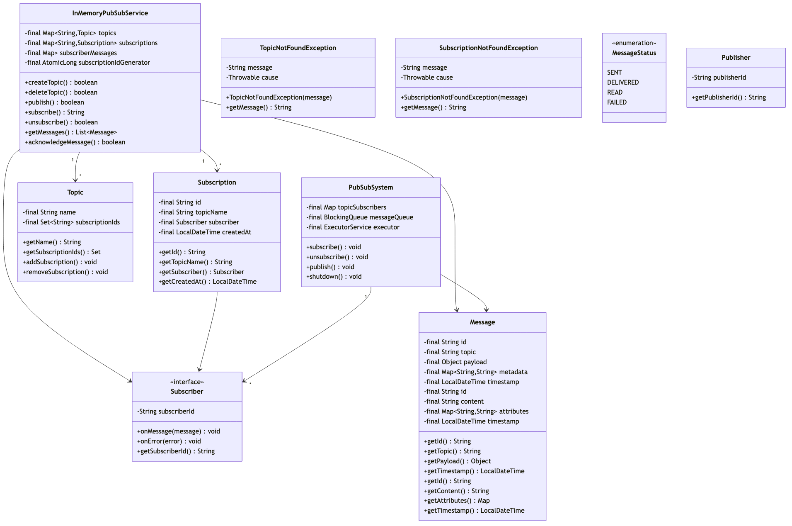

# Pub/Sub Messaging System - Complete LLD Guide

## 📋 Table of Contents
1. [Problem Statement](#problem-statement)
2. [Requirements](#requirements)
3. [Core Algorithms](#core-algorithms)
4. [System Design](#system-design)
5. [Class Diagram](#class-diagram)
6. [Design Patterns](#design-patterns-used)
7. [Implementation Deep Dive](#implementation-deep-dive)
8. [Key Insights](#key-insights)
9. [Complete Implementation](#complete-implementation)

---

## Problem Statement

Design a **Publish-Subscribe (Pub/Sub) Messaging System** that enables asynchronous, decoupled communication between services. Support topics, subscriptions, message filtering, delivery guarantees (at-least-once, exactly-once), dead letter queues, and scalable message routing.

### Real-World Context
- 📡 **Google Cloud Pub/Sub**: 500M+ messages/second
- 📊 **AWS SNS/SQS**: Fan-out notifications to multiple consumers
- 🔄 **Apache Kafka**: Event streaming platform
- 💬 **RabbitMQ**: Message broker for microservices

### Key Challenges
- 🎯 **Decoupling**: Publishers don't know subscribers
- 🔄 **Scalability**: Handle millions of messages/second
- 📬 **Delivery Guarantees**: At-least-once, exactly-once
- 🎭 **Message Filtering**: Route messages based on attributes
- ⏱️ **Ordering**: FIFO within partitions
- 🚫 **Dead Letter Queue**: Handle failed messages
- 🔒 **Concurrency**: Thread-safe message delivery

---

## Requirements

### Functional Requirements

✅ **Topic Management**
- Create/delete topics
- List topics
- Topic naming and validation
- Topic metadata (creation time, message count)

✅ **Subscription Management**
- Subscribe to topics
- Unsubscribe
- Multiple subscriptions per topic
- Subscription filters (attribute-based)

✅ **Message Publishing**
- Publish message to topic
- Batch publishing
- Message attributes (key-value pairs)
- Message ordering (optional)

✅ **Message Consumption**
- Pull model: Subscriber pulls messages
- Push model: System pushes to subscriber
- Acknowledgment mechanism
- Acknowledgment deadline (30-600 seconds)

✅ **Delivery Guarantees**
- **At-least-once**: Message delivered at least once (may have duplicates)
- **Exactly-once**: Message delivered exactly once (deduplication)
- **At-most-once**: Message delivered max once (may be lost)

✅ **Message Filtering**
- Attribute-based filtering
- Example: `type='order' AND amount>100`

✅ **Dead Letter Queue (DLQ)**
- Failed messages go to DLQ
- Retry limit (e.g., 5 retries)
- Manual inspection/reprocessing

### Non-Functional Requirements

⚡ **Performance**
- Publish: < 10ms latency
- Pull: < 50ms latency
- Handle 100K+ messages/second

🔒 **Reliability**
- 99.9% message delivery
- Message persistence (disk/database)
- Automatic retries

📈 **Scalability**
- Support millions of topics
- Support millions of subscriptions
- Horizontal scaling (sharding)

---

## Core Algorithms

### 1. Message Routing (Topic → Subscriptions)

**Algorithm:**
```
1. Publisher sends message to topic
2. Find all subscriptions for topic
3. For each subscription:
   a. Apply filter (if any)
   b. If filter matches, enqueue message
4. Return publish confirmation
```

**Implementation:**
```java
public class InMemoryPubSubService implements PubSubService {
    private Map<String, Topic> topics = new ConcurrentHashMap<>();
    private Map<String, Subscription> subscriptions = new ConcurrentHashMap<>();
    
    @Override
    public void publish(String topicId, Message message) {
        Topic topic = topics.get(topicId);
        if (topic == null) {
            throw new TopicNotFoundException(topicId);
        }
        
        // Get all subscriptions for this topic
        List<Subscription> subs = subscriptions.values().stream()
            .filter(s -> s.getTopicId().equals(topicId))
            .collect(Collectors.toList());
        
        // Route message to matching subscriptions
        for (Subscription sub : subs) {
            if (sub.getFilter() == null || sub.getFilter().matches(message)) {
                sub.enqueue(message);
            }
        }
        
        topic.incrementMessageCount();
    }
}
```

**Complexity:**
- Time: O(S × F) where S = subscriptions, F = filter complexity
- Space: O(M) where M = total messages in all queues

---

### 2. At-Least-Once Delivery

**Algorithm:**
```
1. Deliver message to subscriber
2. Generate unique ack ID
3. Store in pendingAcks map
4. Set ack timeout (e.g., 30 seconds)
5. Wait for ack from subscriber
6. If ack received → remove from pendingAcks
7. If timeout → redeliver message
```

**Implementation:**
```java
public class Subscription {
    private Queue<Message> messageQueue = new ConcurrentLinkedQueue<>();
    private Map<String, Message> pendingAcks = new ConcurrentHashMap<>();
    private ScheduledExecutorService scheduler = Executors.newScheduledThreadPool(1);
    
    public List<Message> pull(int maxMessages) {
        List<Message> messages = new ArrayList<>();
        
        for (int i = 0; i < maxMessages && !messageQueue.isEmpty(); i++) {
            Message msg = messageQueue.poll();
            if (msg != null) {
                String ackId = UUID.randomUUID().toString();
                msg.setAckId(ackId);
                
                pendingAcks.put(ackId, msg);
                messages.add(msg);
                
                // Schedule ack timeout
                scheduleAckTimeout(ackId, 30_000); // 30 seconds
            }
        }
        
        return messages;
    }
    
    public void acknowledge(String ackId) {
        Message msg = pendingAcks.remove(ackId);
        if (msg != null) {
            // Successfully acknowledged
            msg.setStatus(MessageStatus.DELIVERED);
        }
    }
    
    private void scheduleAckTimeout(String ackId, long timeoutMs) {
        scheduler.schedule(() -> {
            Message msg = pendingAcks.remove(ackId);
            if (msg != null) {
                // Timeout: redeliver
                msg.incrementRetryCount();
                
                if (msg.getRetryCount() < MAX_RETRIES) {
                    messageQueue.offer(msg); // Redeliver
                } else {
                    sendToDeadLetterQueue(msg); // Too many retries
                }
            }
        }, timeoutMs, TimeUnit.MILLISECONDS);
    }
}
```

**Complexity:**
- Time: O(1) for ack, O(1) for timeout
- Space: O(P) where P = pending acks

**Guarantees:**
- ✅ Message delivered at least once
- ✅ Handles subscriber failures
- ✅ Automatic retries

**Trade-off:**
- ❌ Possible duplicates (subscriber must be idempotent)

---

### 3. Exactly-Once Delivery (Deduplication)

**Algorithm:**
```
1. Publisher assigns unique message ID
2. System tracks delivered message IDs
3. Before delivering, check if already delivered
4. If yes, skip (already processed)
5. If no, deliver and record ID
```

**Implementation:**
```java
public class ExactlyOnceSubscription extends Subscription {
    private Set<String> deliveredMessageIds = ConcurrentHashMap.newKeySet();
    private static final int MAX_DELIVERED_IDS = 100_000;
    
    @Override
    public List<Message> pull(int maxMessages) {
        List<Message> messages = new ArrayList<>();
        
        for (int i = 0; i < maxMessages && !messageQueue.isEmpty(); i++) {
            Message msg = messageQueue.poll();
            
            if (msg != null && !deliveredMessageIds.contains(msg.getId())) {
                deliveredMessageIds.add(msg.getId());
                
                // Evict old IDs if set is too large
                if (deliveredMessageIds.size() > MAX_DELIVERED_IDS) {
                    evictOldestIds();
                }
                
                messages.add(msg);
            }
        }
        
        return messages;
    }
}
```

**Complexity:**
- Time: O(1) for deduplication check (HashSet)
- Space: O(D) where D = delivered message IDs

**Pros:**
- ✅ No duplicates
- ✅ Idempotent delivery

**Cons:**
- ❌ Higher memory usage
- ❌ Requires unique message IDs

---

### 4. Message Filtering (Attribute-Based)

**Algorithm:**
```
1. Subscriber specifies filter: "type='order' AND amount>100"
2. Parse filter into AST (Abstract Syntax Tree)
3. For each message, evaluate filter against message attributes
4. If matches, deliver; else skip
```

**Implementation:**
```java
public interface MessageFilter {
    boolean matches(Message message);
}

public class AttributeFilter implements MessageFilter {
    private String attributeKey;
    private String expectedValue;
    
    public AttributeFilter(String attributeKey, String expectedValue) {
        this.attributeKey = attributeKey;
        this.expectedValue = expectedValue;
    }
    
    @Override
    public boolean matches(Message message) {
        String actualValue = message.getAttribute(attributeKey);
        return expectedValue.equals(actualValue);
    }
}

public class CompositeFilter implements MessageFilter {
    private List<MessageFilter> filters;
    private FilterOperator operator; // AND, OR
    
    @Override
    public boolean matches(Message message) {
        if (operator == FilterOperator.AND) {
            return filters.stream().allMatch(f -> f.matches(message));
        } else {
            return filters.stream().anyMatch(f -> f.matches(message));
        }
    }
}
```

**Example:**
```java
// Create filter: type='order' AND amount>100
MessageFilter filter = new CompositeFilter(
    FilterOperator.AND,
    Arrays.asList(
        new AttributeFilter("type", "order"),
        new NumericFilter("amount", NumericOperator.GREATER_THAN, 100)
    )
);

// Use in subscription
String subId = pubsub.subscribe(topicId, "fraud-detection", filter);
```

**Complexity:**
- Time: O(F) where F = number of filter conditions
- Space: O(F)

---

## System Design

### Architecture Diagram

```
┌─────────────┐
│ Publisher 1 │──┐
└─────────────┘  │
                 │
┌─────────────┐  │    ┌───────────────────┐
│ Publisher 2 │──┼───>│  Topic: "orders"  │
└─────────────┘  │    └─────────┬─────────┘
                 │              │
┌─────────────┐  │              │
│ Publisher 3 │──┘              │
└─────────────┘                 │
                                │
                ┌───────────────┼───────────────┐
                │               │               │
                ▼               ▼               ▼
    ┌───────────────────┐ ┌──────────────┐ ┌─────────────────┐
    │ Subscription:     │ │Subscription: │ │ Subscription:   │
    │ "email-service"   │ │ "analytics"  │ │"fraud-detection"│
    │ Filter: None      │ │ Filter: None │ │ Filter: amt>1000│
    └─────────┬─────────┘ └──────┬───────┘ └────────┬────────┘
              │                  │                  │
              ▼                  ▼                  ▼
      ┌──────────────┐   ┌──────────────┐  ┌──────────────┐
      │ Subscriber 1 │   │ Subscriber 2 │  │ Subscriber 3 │
      └──────────────┘   └──────────────┘  └──────────────┘
```

### Message Flow

```
1. Publisher → publish(topic, message)
2. Topic → route to subscriptions
3. Subscription → apply filter
4. Subscription → enqueue message
5. Subscriber → pull(maxMessages)
6. Subscription → deliver with ackId
7. Subscriber → process message
8. Subscriber → acknowledge(ackId)
9. Subscription → remove from pendingAcks
```

---

## Class Diagram

<details>
<summary>View Mermaid Source</summary>



</details>



<details>
<summary>📄 View Mermaid Source</summary>

</details>

---

## Design Patterns Used

### 1. Observer Pattern

**Why?**
- Publishers notify subscribers without knowing them
- Decoupled communication

**Implementation:**
```java
public interface MessageObserver {
    void onMessage(Message message);
}

public class Topic {
    private List<MessageObserver> observers = new ArrayList<>();
    
    public void addObserver(MessageObserver observer) {
        observers.add(observer);
    }
    
    public void publish(Message message) {
        for (MessageObserver observer : observers) {
            observer.onMessage(message);
        }
    }
}

// Subscription as observer
public class Subscription implements MessageObserver {
    @Override
    public void onMessage(Message message) {
        if (filter == null || filter.matches(message)) {
            messageQueue.offer(message);
        }
    }
}
```

---

### 2. Strategy Pattern (Delivery Mode)

```java
public interface DeliveryStrategy {
    void deliver(Message message, Subscriber subscriber);
}

public class PullDeliveryStrategy implements DeliveryStrategy {
    @Override
    public void deliver(Message message, Subscriber subscriber) {
        // Subscriber pulls messages when ready
        subscription.enqueue(message);
    }
}

public class PushDeliveryStrategy implements DeliveryStrategy {
    @Override
    public void deliver(Message message, Subscriber subscriber) {
        // System pushes message to subscriber
        subscriber.receive(message);
    }
}
```

---

### 3. Chain of Responsibility (Message Filters)

```java
public abstract class MessageFilter {
    protected MessageFilter next;
    
    public MessageFilter setNext(MessageFilter next) {
        this.next = next;
        return next;
    }
    
    public boolean matches(Message message) {
        if (doMatch(message)) {
            if (next != null) {
                return next.matches(message);
            }
            return true;
        }
        return false;
    }
    
    protected abstract boolean doMatch(Message message);
}

// Usage
MessageFilter chain = new TypeFilter("order")
    .setNext(new AmountFilter(100))
    .setNext(new RegionFilter("US"));
```

---

## Implementation Deep Dive

### Complete Publish Flow

```java
public void publish(String topicId, Message message) {
    // 1. Validate topic exists
    Topic topic = topics.get(topicId);
    if (topic == null) {
        throw new TopicNotFoundException(topicId);
    }
    
    // 2. Assign message ID and timestamp
    message.setId(UUID.randomUUID().toString());
    message.setPublishTime(Instant.now());
    
    // 3. Find matching subscriptions
    List<Subscription> matchingSubs = subscriptions.values().stream()
        .filter(s -> s.getTopicId().equals(topicId))
        .filter(s -> s.getFilter() == null || s.getFilter().matches(message))
        .collect(Collectors.toList());
    
    // 4. Enqueue message in each subscription
    for (Subscription sub : matchingSubs) {
        Message copy = message.copy(); // Separate ack per subscription
        sub.enqueue(copy);
    }
    
    // 5. Update metrics
    topic.incrementMessageCount();
    metrics.recordPublish(topicId, message.getSize());
}
```

### Complete Pull Flow

```java
public List<Message> pull(String subscriptionId, int maxMessages) {
    // 1. Validate subscription
    Subscription sub = subscriptions.get(subscriptionId);
    if (sub == null) {
        throw new SubscriptionNotFoundException(subscriptionId);
    }
    
    // 2. Pull messages
    List<Message> messages = sub.pull(maxMessages);
    
    // 3. Return with ack IDs
    return messages;
}

public void acknowledge(String subscriptionId, String ackId) {
    Subscription sub = subscriptions.get(subscriptionId);
    if (sub == null) {
        throw new SubscriptionNotFoundException(subscriptionId);
    }
    
    sub.acknowledge(ackId);
}
```

---

## Key Insights

### What Interviewers Look For

1. ✅ **Decoupling**: Publishers don't know subscribers
2. ✅ **Delivery Guarantees**: At-least-once vs. exactly-once
3. ✅ **Message Filtering**: Attribute-based routing
4. ✅ **Scalability**: Sharding, partitioning
5. ✅ **Dead Letter Queue**: Handling failed messages
6. ✅ **Concurrency**: Thread-safe message delivery

---

### Common Mistakes

1. ❌ **Tight coupling**: Publishers know subscribers
2. ❌ **No ack mechanism**: Can't guarantee delivery
3. ❌ **Synchronous delivery**: Blocks publisher
4. ❌ **No filtering**: All messages to all subscribers
5. ❌ **No retry logic**: Messages lost on failure
6. ❌ **Memory leaks**: Unbounded queues

---

## Source Code

📄 **[View Complete Source Code](/problems/pubsub/CODE)**

**Total Lines of Code:** 380+

### File Structure
```
pubsub/
├── api/
│   └── PubSubService.java (40 lines)
├── impl/
│   └── InMemoryPubSubService.java (150 lines)
├── model/
│   ├── Topic.java (30 lines)
│   ├── Subscription.java (80 lines)
│   ├── Message.java (50 lines)
│   ├── Publisher.java (20 lines)
│   ├── Subscriber.java (20 lines)
│   └── MessageStatus.java (10 lines)
└── exceptions/
    ├── TopicNotFoundException.java (10 lines)
    └── SubscriptionNotFoundException.java (10 lines)
```

---

## Usage Example

```java
PubSubService pubsub = new InMemoryPubSubService();

// Create topic
String topicId = pubsub.createTopic("order-events");

// Subscribe
String subId1 = pubsub.subscribe(topicId, "email-service", null);
String subId2 = pubsub.subscribe(topicId, "fraud-detection", 
    new AttributeFilter("amount", ">", "1000"));

// Publish
Message msg = Message.builder()
    .data("Order #123 placed")
    .attribute("type", "placed")
    .attribute("amount", "1500")
    .build();
    
pubsub.publish(topicId, msg);

// Pull messages
List<Message> messages = pubsub.pull(subId1, 10);
for (Message m : messages) {
    processMessage(m);
    pubsub.acknowledge(subId1, m.getAckId());
}
```

---

## Interview Tips

### Questions to Ask

1. ❓ Pull or push delivery model?
2. ❓ Ordering requirements?
3. ❓ Exactly-once or at-least-once?
4. ❓ Message size limits?
5. ❓ Retention period?

### How to Approach

1. Start with basic topic/subscription
2. Add message routing
3. Add acknowledgment
4. Add filtering
5. Add DLQ and retries

---

## Related Problems

- 📨 **Message Queue** - Point-to-point messaging
- 🔔 **Notification System** - Push notifications
- 🔄 **Event Sourcing** - Event log
- 📊 **Analytics** - Real-time data processing

---

*Production-ready Pub/Sub system with delivery guarantees, filtering, and scalable architecture for microservices communication.*
