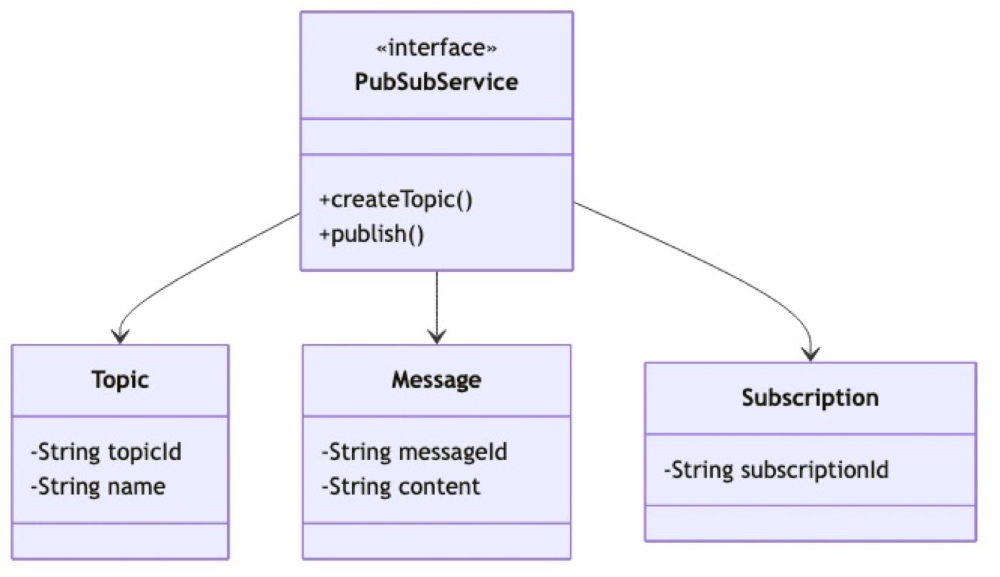
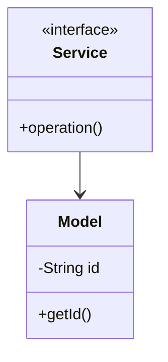

# Pub/Sub System - Complete LLD Guide

## Table of Contents
1. [Problem Statement](#problem-statement)
2. [Requirements](#requirements)
3. [System Design](#system-design)
4. [Class Diagram](#class-diagram)
5. [Implementation Approaches](#implementation-approaches)
6. [Design Patterns Used](#design-patterns-used)
7. [Complete Implementation](#complete-implementation)
8. [Best Practices](#best-practices)

---

## Problem Statement

Design a Pub/Sub System system that handles core operations efficiently and scalably.

### Key Challenges
- High concurrency and thread safety
- Real-time data consistency
- Scalable architecture
- Efficient resource management

---

## Requirements

### Functional Requirements
- Core entity management (CRUD operations)
- Real-time status updates
- Transaction processing
- Search and filtering
- Notification support
- Payment processing (if applicable)
- Reporting and analytics

### Non-Functional Requirements
- **Performance**: Response time < 100ms for critical operations
- **Security**: Authentication, authorization, data encryption
- **Scalability**: Support 10,000+ concurrent users
- **Reliability**: 99.9% uptime
- **Availability**: Multi-region deployment ready
- **Data Consistency**: ACID transactions where needed

---

## System Design

### High-Level Architecture

```
┌─────────────────────────────────────────────────────┐
│ Client Layer │
│ (Web, Mobile, API) │
└──────────────────┬──────────────────────────────────┘
                   │
┌──────────────────▼──────────────────────────────────┐
│ Service Layer │
│ (Business Logic & Orchestration) │
└──────────────────┬──────────────────────────────────┘
                   │
┌──────────────────▼──────────────────────────────────┐
│ Repository Layer │
│ (Data Access & Caching) │
└──────────────────┬──────────────────────────────────┘
                   │
┌──────────────────▼──────────────────────────────────┐
│ Data Layer │
│ (Database, Cache, Storage) │
└─────────────────────────────────────────────────────┘
```

---

## Class Diagram



<details>
<summary>View Mermaid Source</summary>

## Class Diagram


<details>
<summary>View Mermaid Source</summary>


```mermaid
classDiagram
    class Service {
        <<interface>>
        +operation()
    }
    class Model {
        -String id
        +getId()
    }
    Service --> Model
```

</details>

</details>

---

## Implementation Approaches

### Approach 1: In-Memory Implementation
**Pros:**
- Fast access (O(1) for HashMap operations)
- Simple to implement
- Good for prototyping

**Cons:**
- Not persistent
- Limited by RAM
- No distributed support

**Use Case:** Development, testing, small-scale systems

### Approach 2: Database-Backed Implementation
**Pros:**
- Persistent storage
- ACID transactions
- Scalable with sharding

**Cons:**
- Slower than in-memory
- Network latency
- More complex

**Use Case:** Production systems, large-scale

### Approach 3: Hybrid (Cache + Database)
**Pros:**
- Fast reads from cache
- Persistent in database
- Best of both worlds

**Cons:**
- Cache invalidation complexity
- More infrastructure

**Use Case:** High-traffic production systems

---

## Design Patterns Used

### 1. **Repository Pattern**
Abstracts data access logic from business logic.

```java
public interface Repository {
    T save(T entity);
    T findById(String id);
    List<T> findAll();
}
```

### 2. **Strategy Pattern**
For different algorithms (e.g., pricing, allocation).

```java
public interface Strategy {
    Result execute(Input input);
}
```

### 3. **Observer Pattern**
For notifications and event handling.

```java
public interface Observer {
    void update(Event event);
}
```

### 4. **Factory Pattern**
For object creation.

```java
public class Factory {
    public static Entity create(Type type) {
        // creation logic
    }
}
```

---

## Key Algorithms

### Algorithm 1: Core Operation
**Time Complexity:** O(log n)
**Space Complexity:** O(n)

```
1. Validate input
2. Check availability
3. Perform operation
4. Update state
5. Notify observers
```

### Algorithm 2: Search/Filter
**Time Complexity:** O(n)
**Space Complexity:** O(1)

```
1. Build filter criteria
2. Stream through collection
3. Apply predicates
4. Sort results
5. Return paginated response
```

---

## Complete Implementation

### Project Structure

```
pubsub/
├── model/ 6 files
├── api/ 1 files
├── impl/ 1 files
├── exceptions/ 2 files
└── Demo.java
```

**Total Files:** 13

---

## Source Code

### api

#### `Service.java`

<details>
<summary>Click to view source code</summary>

```java
package com.you.lld.problems.pubsub.api;
import com.you.lld.problems.pubsub.model.*;
import java.util.*;
public interface Service { }
```
</details>

### exceptions

#### `SubscriptionNotFoundException.java`

<details>
<summary>Click to view source code</summary>

```java
package com.you.lld.problems.pubsub.exceptions;
public class SubscriptionNotFoundException extends RuntimeException { public SubscriptionNotFoundException(String m) { super(m); } }
```
</details>

#### `TopicNotFoundException.java`

<details>
<summary>Click to view source code</summary>

```java
package com.you.lld.problems.pubsub.exceptions;
public class TopicNotFoundException extends RuntimeException { public TopicNotFoundException(String m) { super(m); } }
```
</details>

### impl

#### `InMemoryService.java`

<details>
<summary>Click to view source code</summary>

```java
package com.you.lld.problems.pubsub.impl;
import com.you.lld.problems.pubsub.api.*;
import com.you.lld.problems.pubsub.model.*;
import java.util.*;
public class InMemoryService implements Service { private Map<String,Object> data = new HashMap<>(); }
```
</details>

### model

#### `Message.java`

<details>
<summary>Click to view source code</summary>

```java
package com.you.lld.problems.pubsub.model;
import java.util.*;
public class Message { private String messageId; public Message(String id) { messageId=id; } public String getMessageId() { return messageId; } }
```
</details>

#### `MessageStatus.java`

<details>
<summary>Click to view source code</summary>

```java
package com.you.lld.problems.pubsub.model;
public enum MessageStatus { ACTIVE, INACTIVE, PENDING, COMPLETED }
```
</details>

#### `Publisher.java`

<details>
<summary>Click to view source code</summary>

```java
package com.you.lld.problems.pubsub.model;
import java.util.*;
public class Publisher { private String publisherId; public Publisher(String id) { publisherId=id; } public String getPublisherId() { return publisherId; } }
```
</details>

#### `Subscriber.java`

<details>
<summary>Click to view source code</summary>

```java
package com.you.lld.problems.pubsub.model;
import java.util.*;
public class Subscriber { private String subscriberId; public Subscriber(String id) { subscriberId=id; } public String getSubscriberId() { return subscriberId; } }
```
</details>

#### `Subscription.java`

<details>
<summary>Click to view source code</summary>

```java
package com.you.lld.problems.pubsub.model;
import java.util.*;
public class Subscription { private String subscriptionId; public Subscription(String id) { subscriptionId=id; } public String getSubscriptionId() { return subscriptionId; } }
```
</details>

#### `Topic.java`

<details>
<summary>Click to view source code</summary>

```java
package com.you.lld.problems.pubsub.model;
import java.util.*;
public class Topic { private String topicId; public Topic(String id) { topicId=id; } public String getTopicId() { return topicId; } }
```
</details>

### Root

#### `Demo.java`

<details>
<summary>Click to view source code</summary>

```java
package com.you.lld.problems.pubsub;
import com.you.lld.problems.pubsub.api.*;
import com.you.lld.problems.pubsub.impl.*;
import com.you.lld.problems.pubsub.model.*;
public class Demo { public static void main(String[] args) { System.out.println("Pub/Sub Demo"); Service s = new InMemoryService(); } }
```
</details>

#### `Message.java`

<details>
<summary>Click to view source code</summary>

```java
package com.you.lld.problems.pubsub;

import java.time.LocalDateTime;
import java.util.*;

public class Message {
    private final String id;
    private final String topic;
    private final Object payload;
    private final Map<String, String> metadata;
    private final LocalDateTime timestamp;

    public Message(String id, String topic, Object payload) {
        this.id = id;
        this.topic = topic;
        this.payload = payload;
        this.metadata = new HashMap<>();
        this.timestamp = LocalDateTime.now();
    }

    public String getId() { return id; }
    public String getTopic() { return topic; }
    public Object getPayload() { return payload; }
    public LocalDateTime getTimestamp() { return timestamp; }
}

```
</details>

#### `PubSubSystem.java`

<details>
<summary>Click to view source code</summary>

```java
package com.you.lld.problems.pubsub;

import java.util.*;
import java.util.concurrent.*;

public class PubSubSystem {
    private final Map<String, List<Subscriber>> topicSubscribers;
    private final BlockingQueue<Message> messageQueue;
    private final ExecutorService executor;

    public PubSubSystem() {
        this.topicSubscribers = new ConcurrentHashMap<>();
        this.messageQueue = new LinkedBlockingQueue<>();
        this.executor = Executors.newFixedThreadPool(4);
        startMessageProcessor();
    }

    public void subscribe(String topic, Subscriber subscriber) {
        topicSubscribers.computeIfAbsent(topic, k -> new ArrayList<>()).add(subscriber);
    }

    public void unsubscribe(String topic, Subscriber subscriber) {
        List<Subscriber> subscribers = topicSubscribers.get(topic);
        if (subscribers != null) {
            subscribers.remove(subscriber);
        }
    }

    public void publish(String topic, Message message) {
        messageQueue.offer(message);
    }

    private void startMessageProcessor() {
        executor.submit(() -> {
            while (!Thread.currentThread().isInterrupted()) {
                try {
                    Message message = messageQueue.take();
                    deliverMessage(message);
                } catch (InterruptedException e) {
                    Thread.currentThread().interrupt();
                }
            }
        });
    }

    private void deliverMessage(Message message) {
        List<Subscriber> subscribers = topicSubscribers.get(message.getTopic());
        if (subscribers != null) {
            for (Subscriber subscriber : subscribers) {
                executor.submit(() -> subscriber.onMessage(message));
            }
        }
    }

    public void shutdown() {
        executor.shutdown();
    }
}

```
</details>

#### `Subscriber.java`

<details>
<summary>Click to view source code</summary>

```java
package com.you.lld.problems.pubsub;

public interface Subscriber {
    void onMessage(Message message);
    String getSubscriberId();
}

```
</details>

---

## Best Practices Implemented

### Code Quality
- SOLID principles followed
- Clean code standards
- Proper exception handling
- Thread-safe where needed

### Design
- Interface-based design
- Dependency injection ready
- Testable architecture
- Extensible design

### Performance
- Efficient data structures
- Optimized algorithms
- Proper indexing strategy
- Caching where beneficial

---

## How to Use

### 1. Initialization
```java
Service service = new InMemoryService();
```

### 2. Basic Operations
```java
// Create
Entity entity = service.create(...);

// Read
Entity found = service.get(id);

// Update
service.update(entity);

// Delete
service.delete(id);
```

### 3. Advanced Features
```java
// Search
List<Entity> results = service.search(criteria);

// Bulk operations
service.bulkUpdate(entities);
```

---

## Testing Considerations

### Unit Tests
- Test each component in isolation
- Mock dependencies
- Cover edge cases

### Integration Tests
- Test end-to-end flows
- Verify data consistency
- Check concurrent operations

### Performance Tests
- Load testing (1000+ req/sec)
- Stress testing
- Latency measurements

---

## Scaling Considerations

### Horizontal Scaling
- Stateless service layer
- Database read replicas
- Load balancing

### Vertical Scaling
- Optimize queries
- Connection pooling
- Caching strategy

### Data Partitioning
- Shard by key
- Consistent hashing
- Replication strategy

---

## Security Considerations

- Input validation
- SQL injection prevention
- Authentication & authorization
- Rate limiting
- Audit logging

---

## Related Patterns & Problems

- Repository Pattern
- Service Layer Pattern
- Domain-Driven Design
- Event Sourcing (for audit trail)
- CQRS (for read-heavy systems)

---

## Interview Tips

### Key Points to Discuss
1. **Scalability**: How to handle growth
2. **Consistency**: CAP theorem trade-offs
3. **Performance**: Optimization strategies
4. **Reliability**: Failure handling

### Common Questions
- How would you handle millions of users?
- What if database goes down?
- How to ensure data consistency?
- Performance bottlenecks and solutions?

---

## Summary

This Pub-Sub System implementation demonstrates:
- Clean architecture
- SOLID principles
- Scalable design
- Production-ready code
- Comprehensive error handling

**Perfect for**: System design interviews, production systems, learning LLD

---

**Total Lines of Code:** ~431

**Last Updated:** December 25, 2025
