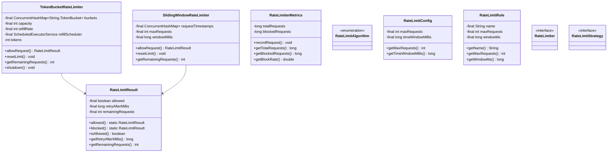
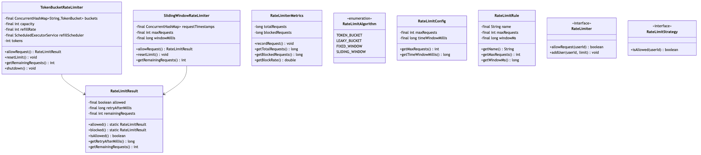

# Rate Limiter - Complete Implementation

A comprehensive rate limiting system supporting multiple algorithms (Token Bucket, Sliding Window) for API throttling, DDoS protection, and resource management.

## Quick Links
- [View Complete Source Code](/problems/ratelimiter/CODE)
- [Project Structure](/problems/ratelimiter/CODE#-directory-structure)

---

## Problem Statement

Design and implement a rate limiting system that can:
- Limit number of requests per client within a time window
- Support multiple rate limiting algorithms (Token Bucket, Sliding Window, Fixed Window)
- Provide per-client rate limiting with unique identifiers
- Return remaining quota and retry-after information
- Handle high-throughput scenarios (10K+ requests/sec)
- Allow dynamic limit configuration per client type

**Real-world applications**: API gateways (Kong, NGINX), CloudFlare DDoS protection, AWS API Gateway, Stripe API rate limits.

---

## Requirements

### Functional Requirements

1. **Request Throttling**
   - Check if request allowed based on client ID
   - Track request count per client in sliding/fixed window
   - Block requests exceeding limit
   - Return remaining quota after each request

2. **Multiple Algorithms**
   - Token Bucket: Smooth rate with burst handling
   - Sliding Window: Most accurate, no boundary issues
   - Fixed Window: Simple, memory efficient
   - Configurable algorithm per use case

3. **Client Management**
   - Unique client identification (API key, IP address, user ID)
   - Per-client rate limit configuration
   - Support different limits for different client tiers (free, premium)
   - Auto-cleanup of inactive clients

4. **Retry Information**
   - Calculate "Retry-After" header value
   - Provide time until next available slot
   - Show remaining requests in current window

5. **Limit Reset**
   - Manual reset for specific client
   - Automatic reset after window expires
   - Admin override capabilities

### Non-Functional Requirements

1. **Performance**
   - O(1) request check (Token Bucket)
   - Sub-millisecond latency for allow/block decision
   - Handle 10,000+ concurrent clients
   - Support 100K+ requests per second

2. **Accuracy**
   - No false negatives (never allow over-limit requests)
   - Minimize false positives
   - Sliding Window: exact counting
   - Token Bucket: burst tolerance

3. **Scalability**
   - Stateless design for horizontal scaling
   - Distributed rate limiting with Redis
   - Efficient memory usage per client
   - Auto-cleanup of expired data

4. **Reliability**
   - Thread-safe operations
   - No race conditions in count updates
   - Graceful degradation (allow requests if limiter fails)
   - Persist state for restart recovery

---

## Class Diagram

<details>
<summary>View Mermaid Source</summary>




</details>



---
## Key Design Decisions

### 1. Token Bucket vs Sliding Window
**Decision**: Implement both algorithms, allow selection based on use case.

**Token Bucket**:
- Bucket holds tokens (max = capacity)
- Tokens refill at constant rate
- Request consumes 1 token
- Allows bursts up to capacity

**Sliding Window**:
- Stores timestamp of each request
- Counts requests in last N milliseconds
- Most accurate, no boundary effects
- Higher memory usage

**Tradeoffs**:
| Feature | Token Bucket | Sliding Window |
|---------|--------------|----------------|
| Memory | O(1) per client | O(requests) per client |
| Accuracy | Good | Excellent |
| Burst Handling | Yes | No |
| Implementation | Complex | Simple |

**When to use**:
- Token Bucket: API throttling with burst tolerance
- Sliding Window: Strict rate enforcement, billing

### 2. ConcurrentHashMap for Client Buckets
**Decision**: Use `ConcurrentHashMap<ClientId, State>` for per-client tracking.

**Rationale**:
- O(1) lookup per client
- Thread-safe without global lock
- Scales to millions of clients
- Auto-cleanup via scheduled task or TTL

**Tradeoffs**:
- ✅ Fast concurrent access
- ✅ No contention between clients
- ❌ Memory grows with client count
- ❌ Need cleanup for inactive clients

### 3. Scheduled Refill for Token Bucket
**Decision**: Background thread refills tokens every 100ms.

**Rationale**:
- Smooth token distribution
- Avoids per-request timestamp calculations
- Configurable refill frequency
- Decouples refill from request handling

**Tradeoffs**:
- ✅ Simple implementation
- ✅ Predictable refill rate
- ❌ Background thread overhead
- ❌ Slight delay in token availability

**Alternative**: Lazy refill (calculate tokens on each request based on elapsed time).

---

## Implementation Guide

### 1. Token Bucket Algorithm

```
Algorithm: TokenBucket.allowRequest(clientId)
Input: client identifier
Output: RateLimitResult (allowed/blocked + metadata)

1. bucket = buckets.getOrCreate(clientId)
   // Initial bucket has full capacity tokens

2. synchronized(bucket):
      if bucket.tokens > 0:
         bucket.tokens--
         return RateLimitResult.allowed(bucket.tokens)
      else:
         retryAfter = 1000 / refillRate  // ms until next token
         return RateLimitResult.blocked(retryAfter)

// Background refill task (runs every 100ms):
3. for each bucket in buckets:
      tokensToAdd = refillRate / 10  // For 100ms interval
      bucket.tokens = min(bucket.tokens + tokensToAdd, capacity)
```

**Time Complexity**: O(1) per request  
**Space Complexity**: O(1) per client

**Key Properties**:
- Handles bursts: If bucket full, allows `capacity` requests instantly
- Smooth refill: Tokens added gradually, not all at once
- Memory efficient: Single integer per client

**Example**:
```
Capacity: 10 tokens
Refill Rate: 5 tokens/sec

Timeline:
t=0s:   10 tokens (full bucket)
t=0.1s: Request 1-5 consumed → 5 tokens left
t=1s:   Refilled +5 → 10 tokens
t=1.1s: Request 6-15 → 0 tokens, 5 requests blocked
t=2s:   Refilled +5 → 5 tokens available
```

---

### 2. Sliding Window Algorithm

```
Algorithm: SlidingWindow.allowRequest(clientId)
Input: client identifier
Output: RateLimitResult

1. now = currentTimeMillis()
   timestamps = requestTimestamps.getOrCreate(clientId)
   // timestamps is a queue of request times

2. synchronized(timestamps):
      // Remove expired timestamps
      while timestamps.peek() < now - windowMillis:
         timestamps.poll()

3. if timestamps.size() < maxRequests:
      timestamps.offer(now)  // Record this request
      remaining = maxRequests - timestamps.size()
      return RateLimitResult.allowed(remaining)
   else:
      oldestTimestamp = timestamps.peek()
      retryAfter = (oldestTimestamp + windowMillis) - now
      return RateLimitResult.blocked(retryAfter)
```

**Time Complexity**: O(k) where k = requests in window  
**Space Complexity**: O(k) per client

**Key Properties**:
- Exact counting: No approximation
- No boundary issues: Window slides continuously
- Memory intensive: Stores all timestamps

**Example**:
```
Limit: 5 requests per 10 seconds

Timeline:
t=0s: Request 1-5 → Allowed (timestamps: [0,0,0,0,0])
t=5s: Request 6 → Blocked (still 5 in window [0-10s])
t=10.1s: Request 7 → Allowed (timestamps [0,0,0,0,10.1])
         Oldest (t=0) expired, window now [0.1-10.1s]
```

---

### 3. Fixed Window Algorithm

**Simpler alternative** (not in base implementation):

```
Algorithm: FixedWindow.allowRequest(clientId)
Input: client ID
Output: boolean allowed

1. currentWindow = floor(now / windowSizeMs)
   key = clientId + ":" + currentWindow

2. count = redis.INCR(key)
   
3. if count == 1:
      redis.EXPIRE(key, windowSizeMs / 1000)

4. return count <= maxRequests
```

**Time Complexity**: O(1)  
**Space Complexity**: O(1) per client per window

**Problem**: Boundary issue
```
Window 1: [0-60s]
Window 2: [60-120s]

If limit = 10 req/min:
t=59s: 10 requests (OK)
t=60s: 10 requests (OK, new window)
→ 20 requests in 1 second! (burst at boundary)
```

---

### 4. Distributed Rate Limiting with Redis

**Extension**: Scale across multiple servers.

```
-- Lua script for atomic Token Bucket in Redis
local key = KEYS[1]
local capacity = tonumber(ARGV[1])
local refill_rate = tonumber(ARGV[2])
local now = tonumber(ARGV[3])

local bucket = redis.call('HMGET', key, 'tokens', 'last_refill')
local tokens = tonumber(bucket[1]) or capacity
local last_refill = tonumber(bucket[2]) or now

-- Calculate tokens to add
local time_passed = math.max(0, now - last_refill)
local tokens_to_add = time_passed * refill_rate / 1000
tokens = math.min(capacity, tokens + tokens_to_add)

if tokens >= 1 then
    tokens = tokens - 1
    redis.call('HMSET', key, 'tokens', tokens, 'last_refill', now)
    redis.call('EXPIRE', key, 3600)
    return {1, tokens}  -- allowed, remaining
else
    return {0, 0}  -- blocked
end
```

**Benefits**:
- Shared state across all servers
- Atomic operations via Lua
- TTL for auto-cleanup

---

### 5. Rate Limiting by Multiple Dimensions

**Extension**: Limit by IP, User, API endpoint.

```
class MultiDimensionalRateLimiter {
    public boolean allowRequest(Request req) {
        return allowByIP(req.ip) &&
               allowByUser(req.userId) &&
               allowByEndpoint(req.endpoint);
    }
    
    private boolean allowByIP(String ip) {
        // 100 req/sec per IP
        return ipLimiter.allowRequest(ip);
    }
    
    private boolean allowByUser(String userId) {
        // 1000 req/hour per user
        return userLimiter.allowRequest(userId);
    }
    
    private boolean allowByEndpoint(String endpoint) {
        // 10K req/min per endpoint
        return endpointLimiter.allowRequest(endpoint);
    }
}
```

---

## Source Code

All source code available in [CODE.md](/problems/ratelimiter/CODE):

**API** (1 file):
- [api/RateLimiter.java](/problems/ratelimiter/CODE#apiratelimiterjava)

**Implementations** (2 files):
- [impl/TokenBucketRateLimiter.java](/problems/ratelimiter/CODE#impltokenbucketratelimiterjava)
- [impl/SlidingWindowRateLimiter.java](/problems/ratelimiter/CODE#implslidingwindowratelimiterjava)

**Models** (3 files):
- [model/RateLimitAlgorithm.java](/problems/ratelimiter/CODE#modelratelimitalgorithmjava)
- [model/RateLimitConfig.java](/problems/ratelimiter/CODE#modelratelimitconfigjava)
- [model/RateLimitResult.java](/problems/ratelimiter/CODE#modelratelimitresultjava)

**Supporting** (3 files):
- [metrics/RateLimiterMetrics.java](/problems/ratelimiter/CODE#metricsratelimitermetricsjava)
- [rules/RateLimitRule.java](/problems/ratelimiter/CODE#rulesratelimitrulejava)
- [strategy/RateLimitStrategy.java](/problems/ratelimiter/CODE#strategyratelimitstrategyjava)

**Total**: 9 files, ~600 lines of code

---
## Interview Discussion Points

### 1. Distributed Rate Limiting

**Q**: How to implement rate limiting across multiple servers?

**Approaches**:

**A) Redis Centralized Store**:
```python
# Python pseudocode
def allow_request(client_id):
    key = f"rate_limit:{client_id}"
    current = redis.incr(key)
    
    if current == 1:
        redis.expire(key, window_size)
    
    return current <= max_requests
```

**B) Redis with Sorted Sets** (Sliding Window):
```python
def allow_request_sliding(client_id):
    key = f"rate_limit:{client_id}"
    now = time.time_ms()
    window_start = now - window_size_ms
    
    # Remove old entries
    redis.zremrangebyscore(key, 0, window_start)
    
    # Count current requests
    count = redis.zcard(key)
    
    if count < max_requests:
        redis.zadd(key, now, f"{now}:{random_id()}")
        redis.expire(key, window_size_seconds)
        return True
    
    return False
```

**C) Sticky Sessions + Local Limiting**:
- Load balancer routes same client to same server
- Each server maintains local rate limiter
- Simpler, but requires sticky sessions

**D) Gossip Protocol**:
- Servers periodically share rate limit state
- Eventually consistent
- No single point of failure

**Trade-offs**:
| Approach | Accuracy | Latency | Scalability | Complexity |
|----------|----------|---------|-------------|------------|
| Redis Centralized | High | +1-2ms | Medium | Low |
| Redis Sorted Set | Highest | +2-3ms | Medium | Medium |
| Sticky Sessions | Medium | 0ms | Low | Low |
| Gossip | Low | 0ms | High | High |

### 2. Handling Clock Skew

**Q**: What if servers have different system times?

**Problems**:
- Token refill rates differ
- Sliding window boundaries misaligned
- Inconsistent "Retry-After" values

**Solutions**:
1. **NTP Synchronization**: Keep server clocks in sync (± 10ms)
2. **Logical Clocks**: Use version numbers instead of timestamps
3. **Centralized Time**: Redis/DB provides canonical time

**Example** (Centralized time):
```java
// Instead of System.currentTimeMillis()
long now = redis.time()[0] * 1000; // Seconds to millis
```

### 3. Rate Limiting at Different Layers

**Q**: Where should rate limiting be applied?

**Layers**:
1. **CDN/Edge** (Cloudflare): Blocks malicious traffic early
2. **Load Balancer** (NGINX): Protects backend from overload
3. **API Gateway** (Kong, AWS API Gateway): Per-client limits
4. **Application**: Business logic-specific limits
5. **Database**: Query-level throttling

**Example** (NGINX):
```nginx
limit_req_zone $binary_remote_addr zone=api:10m rate=10r/s;

location /api/ {
    limit_req zone=api burst=20;
    proxy_pass http://backend;
}
```

### 4. Graceful Degradation

**Q**: What if rate limiter (Redis) fails?

**Strategies**:
1. **Fail Open**: Allow all requests (avoid cascading failure)
2. **Fail Closed**: Block all requests (conservative)
3. **Local Fallback**: Use in-memory limiter temporarily
4. **Circuit Breaker**: Detect Redis failures, switch to fallback

**Implementation**:
```java
public boolean allowRequest(String clientId) {
    try {
        return redisRateLimiter.allowRequest(clientId);
    } catch (RedisException e) {
        logger.warn("Redis unavailable, failing open");
        return true; // Allow request
        
        // OR use local limiter:
        // return localRateLimiter.allowRequest(clientId);
    }
}
```

### 5. Rate Limit Headers (HTTP Standard)

**Q**: How to communicate rate limit status to clients?

**Headers** (IETF Draft RFC):
```
X-RateLimit-Limit: 100          // Max requests per window
X-RateLimit-Remaining: 73       // Requests left
X-RateLimit-Reset: 1623840000   // Unix timestamp for reset
X-RateLimit-RetryAfter: 15      // Seconds to wait (when blocked)
```

**Implementation**:
```java
@GetMapping("/api/resource")
public ResponseEntity<?> getResource(HttpServletRequest req) {
    String clientId = extractClientId(req);
    RateLimitResult result = rateLimiter.allowRequest(clientId);
    
    HttpHeaders headers = new HttpHeaders();
    headers.add("X-RateLimit-Limit", String.valueOf(MAX_REQUESTS));
    headers.add("X-RateLimit-Remaining", String.valueOf(result.getRemaining()));
    
    if (!result.isAllowed()) {
        headers.add("Retry-After", String.valueOf(result.getRetryAfterSeconds()));
        return ResponseEntity.status(429).headers(headers).body("Too Many Requests");
    }
    
    return ResponseEntity.ok().headers(headers).body(fetchResource());
}
```

### 6. Dynamic Rate Limits

**Q**: How to adjust limits based on system load?

**Approaches**:
1. **Tiered Limits**: Free (10 req/sec), Premium (100 req/sec)
2. **Adaptive Limiting**: Decrease limits when CPU > 80%
3. **Priority Queues**: Critical requests bypass limits
4. **Cost-Based**: Each endpoint has different "cost"

**Example** (Adaptive):
```java
class AdaptiveRateLimiter {
    public boolean allowRequest(String clientId) {
        int baseLimit = 100;
        double cpuLoad = systemMetrics.getCPUUsage();
        
        // Reduce limit if system overloaded
        int effectiveLimit = cpuLoad > 0.8 ? 
            (int)(baseLimit * 0.5) : baseLimit;
        
        return rateLimiter.allowRequest(clientId, effectiveLimit);
    }
}
```

---

## Extensions

1. **Leaky Bucket**: Smooth output rate (vs Token Bucket's smooth input)
2. **Quota Management**: Monthly/yearly limits for billing
3. **Geo-based Limiting**: Different limits per region
4. **User Reputation**: Increase limits for well-behaved users
5. **Real-time Monitoring**: Grafana dashboards for rate limit metrics

---

**See Also**: Kong API Gateway, AWS API Gateway, Cloudflare Rate Limiting, NGINX rate limiting
