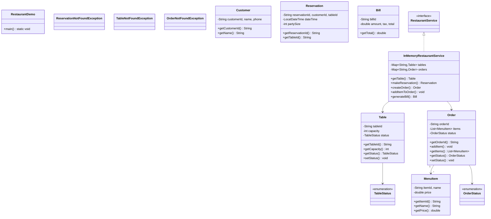

# Restaurant Reservation System

## Overview
A comprehensive restaurant table booking system supporting real-time availability checks, reservation management, waitlist handling, and table optimization. Implements dynamic table allocation, overbooking prevention, and multi-party coordination for seamless dining experiences.

**Difficulty:** Medium  
**Domain:** Booking Systems, Resource Management  
**Interview Frequency:** High (OpenTable, Yelp, DoorDash, Booking.com)

## Requirements

### Functional Requirements
1. **Restaurant Management**
   - Add/update restaurant details
   - Define operating hours
   - Configure table layouts
   - Set capacity limits
   - Manage floor plans

2. **Table Management**
   - Create tables with capacity
   - Support table combinations
   - Track table status (available, occupied, reserved)
   - Handle different table types (booth, window, patio)

3. **Reservation Operations**
   - Search available time slots
   - Make reservations
   - Modify existing bookings
   - Cancel reservations
   - Auto-confirm or require approval

4. **Availability Search**
   - Find slots by date/time/party size
   - Show alternative times
   - Handle peak hours
   - Support flexible duration

5. **Waitlist Management**
   - Add to waitlist when full
   - Notify when table available
   - Priority ordering
   - Estimated wait time

6. **Customer Management**
   - Customer profiles
   - Reservation history
   - Preferences (allergies, seating)
   - Loyalty programs

### Non-Functional Requirements
1. **Performance**
   - Availability check: < 100ms
   - Support 1000+ concurrent searches
   - Handle 10,000+ daily reservations

2. **Consistency**
   - No double-bookings
   - Atomic reservation creation
   - Real-time availability updates

3. **Availability**
   - 99.9% uptime
   - Handle restaurant offline scenarios
   - Graceful degradation


## Class Diagram

<details>
<summary>View Mermaid Source</summary>



</details>


## System Architecture

```
┌──────────────────────────────────────────────────────┐
│                Customer Interface                     │
│   (Web App, Mobile App, Phone Booking)               │
└───────────────────┬──────────────────────────────────┘
                    │
        ┌───────────▼────────────┐
        │   Reservation API      │
        │  - searchAvailability  │
        │  - createReservation   │
        │  - modifyReservation   │
        │  - cancelReservation   │
        └───────────┬────────────┘
                    │
        ┌───────────▼────────────┐
        │  Availability Service  │
        │  (Check time slots)    │
        └───────────┬────────────┘
                    │
        ┌───────────▼────────────┐
        │  Table Allocator       │
        │  (Assign best tables)  │
        └───────────┬────────────┘
                    │
        ┌───────────▼────────────┐
        │  Reservation Manager   │
        │  (Create/Update/Cancel)│
        └───────────┬────────────┘
                    │
     ┌──────────────┴──────────────┐
     │                             │
┌────▼─────┐              ┌────────▼────────┐
│  Table   │              │  Reservation    │
│  Store   │              │  Store          │
│          │              │                 │
│ Table 1  │              │ Res#101         │
│  ├─ 2pax │              │  ├─ TableIds    │
│ Table 2  │              │  ├─ DateTime    │
│  ├─ 4pax │              │  ├─ PartySize   │
│ Table 3  │              │  └─ Status      │
│  └─ 6pax │              │                 │
└──────────┘              └─────────────────┘
     │                             │
     └──────────────┬──────────────┘
                    │
        ┌───────────▼────────────┐
        │   Notification Svc     │
        │  (Confirm/Remind)      │
        └────────────────────────┘
```

## Core Data Model

### 1. Restaurant
```java
public class Restaurant {
    private RestaurantId id;
    private String name;
    private String address;
    private List<OperatingHours> hours;
    private List<Table> tables;
    private int maxCapacity;
    private Duration defaultReservationDuration; // 90 minutes
    private ReservationPolicy policy;
    
    public boolean isOpen(LocalDateTime time) {
        DayOfWeek day = time.getDayOfWeek();
        LocalTime timeOfDay = time.toLocalTime();
        
        return hours.stream()
            .anyMatch(h -> h.getDay() == day && 
                          h.getOpenTime().compareTo(timeOfDay) <= 0 &&
                          h.getCloseTime().compareTo(timeOfDay) > 0);
    }
    
    public List<Table> getAvailableTables(int partySize) {
        return tables.stream()
            .filter(t -> t.getCapacity() >= partySize)
            .filter(Table::isAvailable)
            .collect(Collectors.toList());
    }
}
```

### 2. Table
```java
public class Table {
    private TableId id;
    private int tableNumber;
    private int capacity;
    private int minCapacity; // Don't seat 2 at table for 8
    private TableType type; // STANDARD, BOOTH, WINDOW, PATIO
    private TableStatus status; // AVAILABLE, OCCUPIED, RESERVED, MAINTENANCE
    private Location location; // Floor, section
    
    public boolean canAccommodate(int partySize) {
        return partySize >= minCapacity && partySize <= capacity;
    }
    
    public boolean isAvailable() {
        return status == TableStatus.AVAILABLE;
    }
}

enum TableType {
    STANDARD,
    BOOTH,
    WINDOW,
    PATIO,
    BAR_SEATING,
    PRIVATE_ROOM
}
```

### 3. Reservation
```java
public class Reservation {
    private ReservationId id;
    private RestaurantId restaurantId;
    private CustomerId customerId;
    private List<TableId> tableIds;
    private LocalDateTime startTime;
    private LocalDateTime endTime;
    private int partySize;
    private ReservationStatus status;
    private String specialRequests;
    private LocalDateTime createdAt;
    private LocalDateTime modifiedAt;
    
    public boolean overlaps(Reservation other) {
        return this.startTime.isBefore(other.endTime) &&
               this.endTime.isAfter(other.startTime);
    }
    
    public Duration getDuration() {
        return Duration.between(startTime, endTime);
    }
}

enum ReservationStatus {
    PENDING,      // Awaiting confirmation
    CONFIRMED,    // Confirmed by restaurant
    SEATED,       // Customer arrived and seated
    COMPLETED,    // Meal finished
    CANCELLED,    // Cancelled by customer
    NO_SHOW      // Customer didn't show up
}
```

### 4. TimeSlot
```java
public class TimeSlot {
    private LocalDateTime startTime;
    private int availableCapacity;
    private List<TableId> availableTables;
    
    public boolean canAccommodate(int partySize) {
        return availableCapacity >= partySize;
    }
}
```

## Key Algorithms

### 1. Availability Search
```java
public class AvailabilityService {
    
    public List<TimeSlot> findAvailableSlots(
            RestaurantId restaurantId,
            LocalDate date,
            int partySize,
            Duration duration) {
        
        Restaurant restaurant = getRestaurant(restaurantId);
        List<TimeSlot> availableSlots = new ArrayList<>();
        
        // Get operating hours for the date
        OperatingHours hours = restaurant.getOperatingHours(date.getDayOfWeek());
        
        // Generate 15-minute intervals
        LocalTime currentTime = hours.getOpenTime();
        LocalTime lastSeating = hours.getCloseTime().minus(duration);
        
        while (currentTime.isBefore(lastSeating)) {
            LocalDateTime slotStart = LocalDateTime.of(date, currentTime);
            LocalDateTime slotEnd = slotStart.plus(duration);
            
            // Check if tables available for this slot
            List<Table> availableTables = findAvailableTablesForSlot(
                restaurantId, slotStart, slotEnd, partySize);
            
            if (!availableTables.isEmpty()) {
                TimeSlot slot = new TimeSlot(
                    slotStart,
                    availableTables.stream().mapToInt(Table::getCapacity).sum(),
                    availableTables.stream().map(Table::getId).collect(Collectors.toList())
                );
                availableSlots.add(slot);
            }
            
            // Move to next 15-minute interval
            currentTime = currentTime.plusMinutes(15);
        }
        
        return availableSlots;
    }
    
    private List<Table> findAvailableTablesForSlot(
            RestaurantId restaurantId,
            LocalDateTime start,
            LocalDateTime end,
            int partySize) {
        
        Restaurant restaurant = getRestaurant(restaurantId);
        List<Table> suitableTables = restaurant.getTables().stream()
            .filter(t -> t.canAccommodate(partySize))
            .collect(Collectors.toList());
        
        // Get existing reservations overlapping this time
        List<Reservation> overlappingReservations = 
            getReservations(restaurantId, start, end);
        
        Set<TableId> occupiedTableIds = overlappingReservations.stream()
            .flatMap(r -> r.getTableIds().stream())
            .collect(Collectors.toSet());
        
        // Return tables not in occupied list
        return suitableTables.stream()
            .filter(t -> !occupiedTableIds.contains(t.getId()))
            .collect(Collectors.toList());
    }
}
```

**Time Complexity:** O(T × R × P)
- T = time slots (~48 for 12-hour operation)
- R = reservations per day (~100)
- P = party size check

**Optimization:** Index reservations by time range using Interval Tree.

### 2. Table Allocation (Best Fit)
```java
public class TableAllocator {
    
    public List<Table> allocateTables(int partySize, List<Table> availableTables) {
        // Strategy 1: Single table (preferred)
        Optional<Table> singleTable = findBestSingleTable(partySize, availableTables);
        if (singleTable.isPresent()) {
            return List.of(singleTable.get());
        }
        
        // Strategy 2: Combine tables
        return combineTablesForParty(partySize, availableTables);
    }
    
    private Optional<Table> findBestSingleTable(int partySize, List<Table> tables) {
        // Find smallest table that fits party
        return tables.stream()
            .filter(t -> t.canAccommodate(partySize))
            .min(Comparator.comparingInt(Table::getCapacity));
    }
    
    private List<Table> combineTablesForParty(int partySize, List<Table> tables) {
        // Try to combine 2 tables
        for (int i = 0; i < tables.size(); i++) {
            for (int j = i + 1; j < tables.size(); j++) {
                int combined = tables.get(i).getCapacity() + 
                              tables.get(j).getCapacity();
                if (combined >= partySize && combined <= partySize + 2) {
                    return List.of(tables.get(i), tables.get(j));
                }
            }
        }
        
        return Collections.emptyList();
    }
}
```

**Table Allocation Rules:**
1. **Single Table Preferred:** Use smallest table that fits
2. **Minimize Waste:** Don't seat 2 at table for 8
3. **Combine Adjacent:** Combine tables when needed
4. **Reserve Flexibility:** Keep large tables for large parties

### 3. Reservation Creation (Atomic)
```java
public class ReservationService {
    private final Lock reservationLock = new ReentrantLock();
    
    public Reservation createReservation(ReservationRequest request) 
            throws ReservationException {
        
        reservationLock.lock();
        try {
            // 1. Validate request
            validateRequest(request);
            
            // 2. Check availability
            List<Table> availableTables = findAvailableTablesForSlot(
                request.getRestaurantId(),
                request.getStartTime(),
                request.getEndTime(),
                request.getPartySize()
            );
            
            if (availableTables.isEmpty()) {
                throw new NoAvailabilityException("No tables available");
            }
            
            // 3. Allocate best tables
            List<Table> allocatedTables = tableAllocator.allocateTables(
                request.getPartySize(), availableTables);
            
            // 4. Create reservation
            Reservation reservation = Reservation.builder()
                .id(generateReservationId())
                .restaurantId(request.getRestaurantId())
                .customerId(request.getCustomerId())
                .tableIds(allocatedTables.stream()
                    .map(Table::getId)
                    .collect(Collectors.toList()))
                .startTime(request.getStartTime())
                .endTime(request.getEndTime())
                .partySize(request.getPartySize())
                .status(ReservationStatus.CONFIRMED)
                .specialRequests(request.getSpecialRequests())
                .createdAt(LocalDateTime.now())
                .build();
            
            // 5. Save to database
            reservationRepository.save(reservation);
            
            // 6. Send confirmation
            notificationService.sendConfirmation(reservation);
            
            return reservation;
            
        } finally {
            reservationLock.unlock();
        }
    }
}
```

**Concurrency Handling:**
- **Pessimistic Locking:** Lock during reservation creation
- **Database Transactions:** ACID guarantees
- **Unique Constraints:** Prevent double-booking at DB level

### 4. Waitlist Management
```java
public class WaitlistService {
    private final PriorityQueue<WaitlistEntry> waitlist;
    
    public WaitlistEntry addToWaitlist(
            RestaurantId restaurantId,
            CustomerId customerId,
            int partySize,
            LocalDateTime desiredTime) {
        
        WaitlistEntry entry = new WaitlistEntry(
            generateId(),
            restaurantId,
            customerId,
            partySize,
            desiredTime,
            calculatePriority(customerId),
            LocalDateTime.now()
        );
        
        waitlist.offer(entry);
        
        // Estimate wait time
        Duration estimatedWait = estimateWaitTime(restaurantId, partySize);
        entry.setEstimatedWaitTime(estimatedWait);
        
        notificationService.notifyWaitlistAdded(entry);
        
        return entry;
    }
    
    public void notifyWaitlistWhenAvailable(
            RestaurantId restaurantId,
            LocalDateTime startTime,
            int capacity) {
        
        // Find matching waitlist entries
        List<WaitlistEntry> matching = waitlist.stream()
            .filter(e -> e.getRestaurantId().equals(restaurantId))
            .filter(e -> e.getPartySize() <= capacity)
            .filter(e -> isTimeMatch(e.getDesiredTime(), startTime))
            .sorted(Comparator.comparingInt(WaitlistEntry::getPriority).reversed())
            .limit(3) // Notify top 3
            .collect(Collectors.toList());
        
        for (WaitlistEntry entry : matching) {
            notificationService.notifyTableAvailable(entry, startTime);
        }
    }
    
    private int calculatePriority(CustomerId customerId) {
        Customer customer = customerService.getCustomer(customerId);
        int priority = 0;
        
        // Loyalty member
        if (customer.isLoyaltyMember()) {
            priority += 10;
        }
        
        // VIP status
        if (customer.isVip()) {
            priority += 20;
        }
        
        // Past no-shows (penalty)
        priority -= customer.getNoShowCount() * 5;
        
        return priority;
    }
}
```

## Design Patterns

### 1. Factory Pattern (Reservation Creation)
```java
public interface ReservationFactory {
    Reservation createReservation(ReservationRequest request);
}

public class StandardReservationFactory implements ReservationFactory {
    public Reservation createReservation(ReservationRequest request) {
        return new Reservation(/* standard config */);
    }
}

public class VipReservationFactory implements ReservationFactory {
    public Reservation createReservation(ReservationRequest request) {
        Reservation res = new Reservation(/* vip config */);
        res.setPriority(Priority.HIGH);
        return res;
    }
}
```

### 2. Strategy Pattern (Table Allocation)
```java
interface AllocationStrategy {
    List<Table> allocate(int partySize, List<Table> tables);
}

class MinimizeWasteStrategy implements AllocationStrategy {
    public List<Table> allocate(int partySize, List<Table> tables) {
        // Allocate smallest suitable table
    }
}

class MaximizeUtilizationStrategy implements AllocationStrategy {
    public List<Table> allocate(int partySize, List<Table> tables) {
        // Fill larger tables during peak hours
    }
}
```

### 3. Observer Pattern (Notifications)
```java
interface ReservationObserver {
    void onReservationCreated(Reservation reservation);
    void onReservationModified(Reservation reservation);
    void onReservationCancelled(Reservation reservation);
}

class EmailNotificationObserver implements ReservationObserver {
    public void onReservationCreated(Reservation res) {
        emailService.sendConfirmation(res);
    }
}

class SMSNotificationObserver implements ReservationObserver {
    public void onReservationCreated(Reservation res) {
        smsService.sendConfirmation(res);
    }
}
```

## Source Code

📄 **[View Complete Source Code](/problems/restaurant/CODE)**

**Key Files:**
- [`ReservationService.java`](/problems/restaurant/CODE#reservationservicejava) - Main service
- [`AvailabilityService.java`](/problems/restaurant/CODE#availabilityservicejava) - Slot search
- [`TableAllocator.java`](/problems/restaurant/CODE#tableallocatorjava) - Table assignment
- [`WaitlistService.java`](/problems/restaurant/CODE#waitlistservicejava) - Waitlist management

**Total Lines of Code:** ~800 lines

## Usage Example

```java
// Initialize system
RestaurantReservationSystem system = new RestaurantReservationSystem();

// Add restaurant
Restaurant restaurant = Restaurant.builder()
    .name("Italian Bistro")
    .address("123 Main St")
    .addTable(new Table(1, 2, TableType.STANDARD))
    .addTable(new Table(2, 4, TableType.BOOTH))
    .addTable(new Table(3, 6, TableType.WINDOW))
    .build();

system.addRestaurant(restaurant);

// Search availability
LocalDate date = LocalDate.of(2024, 12, 25);
List<TimeSlot> slots = system.searchAvailability(
    restaurant.getId(),
    date,
    4, // party size
    Duration.ofMinutes(90)
);

// Make reservation
ReservationRequest request = ReservationRequest.builder()
    .restaurantId(restaurant.getId())
    .customerId(customer.getId())
    .startTime(slots.get(0).getStartTime())
    .partySize(4)
    .specialRequests("Window seat preferred")
    .build();

Reservation reservation = system.createReservation(request);

// Modify reservation
system.modifyReservation(
    reservation.getId(),
    reservation.getStartTime().plusHours(1)
);

// Cancel reservation
system.cancelReservation(reservation.getId());

// Add to waitlist if full
WaitlistEntry entry = system.addToWaitlist(
    restaurant.getId(),
    customer.getId(),
    4,
    LocalDateTime.of(date, LocalTime.of(19, 0))
);
```

## Common Interview Questions

### System Design Questions

1. **How do you prevent double-booking?**
   - Pessimistic locking during reservation
   - Database unique constraint on (table_id, time_range)
   - Transaction isolation level: SERIALIZABLE
   - Optimistic locking with version number

2. **How do you handle peak hours efficiently?**
   - Pre-compute availability for next 7 days
   - Cache frequently queried slots
   - Prioritize VIP customers
   - Implement waitlist with notifications

3. **How do you optimize table utilization?**
   - Dynamic duration based on party size
   - Combine tables for large parties
   - Smart allocation (best fit algorithm)
   - Turn table twice during peak (5pm and 8pm)

4. **How do you scale for thousands of restaurants?**
   - Shard by restaurant ID
   - Cache restaurant details (Redis)
   - Asynchronous notifications
   - Read replicas for searches

### Coding Questions

1. **Check if time slot is available**
   ```java
   boolean isAvailable(Table table, LocalDateTime start, LocalDateTime end) {
       return reservations.stream()
           .filter(r -> r.getTableIds().contains(table.getId()))
           .noneMatch(r -> r.overlaps(start, end));
   }
   ```

2. **Find best table for party**
   ```java
   Optional<Table> findBestTable(int partySize, List<Table> tables) {
       return tables.stream()
           .filter(t -> t.canAccommodate(partySize))
           .min(Comparator.comparingInt(t -> 
               Math.abs(t.getCapacity() - partySize)));
   }
   ```

3. **Calculate table turnover rate**
   ```java
   double calculateTurnover(Table table, LocalDate date) {
       List<Reservation> reservations = getReservations(table, date);
       Duration operatingHours = getOperatingHours(date);
       Duration totalReserved = reservations.stream()
           .map(Reservation::getDuration)
           .reduce(Duration.ZERO, Duration::plus);
       return totalReserved.toMinutes() / (double) operatingHours.toMinutes();
   }
   ```

### Algorithm Questions
1. **Time complexity of availability search?** → O(T × R) where T=slots, R=reservations
2. **How to find overlapping reservations efficiently?** → Interval tree: O(log N + K)
3. **Best data structure for waitlist?** → Priority queue: O(log N) insert/remove

## Trade-offs & Design Decisions

### 1. Fixed vs Dynamic Duration
**Fixed (90min):** Simple, predictable  
**Dynamic:** Optimize turnover, complex

**Decision:** Fixed with override for large parties

### 2. Instant Confirmation vs Manual Approval
**Instant:** Better UX, risk of overbooking  
**Manual:** Restaurant control, slower

**Decision:** Instant for off-peak, manual for peak hours

### 3. Allow Overbooking?
**Yes:** Maximize revenue, handle no-shows  
**No:** Prevent conflicts, better experience

**Decision:** 10% overbooking based on no-show rate

### 4. Table Sharing?
**Yes:** Higher utilization, privacy concerns  
**No:** Better privacy, lower capacity

**Decision:** No sharing (traditional restaurants)

## Key Takeaways

### What Interviewers Look For
1. ✅ **Concurrency handling** (no double-booking)
2. ✅ **Availability search** algorithm
3. ✅ **Table allocation** strategy
4. ✅ **Scaling considerations**
5. ✅ **Trade-off discussions**
6. ✅ **Real-world constraints**

### Common Mistakes to Avoid
1. ❌ Not handling concurrent reservations
2. ❌ Inefficient availability search (O(N²))
3. ❌ No waitlist implementation
4. ❌ Ignoring table turnover optimization
5. ❌ Not considering no-shows
6. ❌ Poor table allocation (waste capacity)

### Production-Ready Checklist
- [x] Availability search
- [x] Reservation CRUD
- [x] Table allocation
- [x] Waitlist management
- [ ] Payment integration
- [ ] Review system
- [ ] Analytics dashboard
- [ ] Mobile app
- [ ] Email/SMS notifications
- [ ] Fraud detection

---

## Related Problems
- 🎬 **Movie Booking** - Seat reservation
- 🏨 **Hotel Booking** - Room allocation
- ✈️ **Flight Booking** - Overbooking strategy
- 🎟️ **Event Ticketing** - High concurrency

## References
- OpenTable: Industry-leading reservation platform
- Resy: Modern restaurant booking
- Interval Tree: Efficient range query data structure
- Two-Phase Locking: Concurrency control

---

*Production-ready restaurant reservation system with table optimization, waitlist management, and concurrency handling. Essential for booking platform interviews.*
