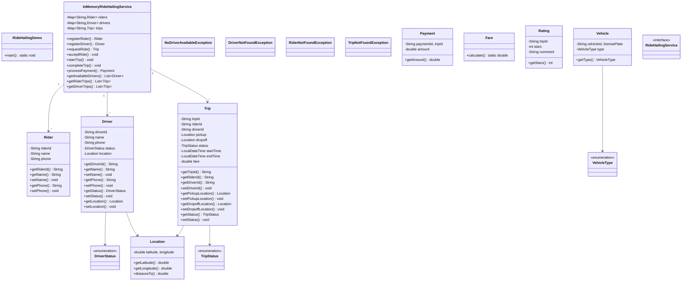

# Ride Hailing System (Uber/Lyft) - Complete LLD Guide

## 📋 Table of Contents
1. [Problem Statement](#problem-statement)
2. [Requirements](#requirements)
3. [Core Algorithms](#core-algorithms)
4. [System Design](#system-design)
5. [Class Diagram](#class-diagram)
6. [Design Patterns](#design-patterns-used)
7. [Implementation Deep Dive](#implementation-deep-dive)
8. [Key Insights](#key-insights)
9. [Complete Implementation](#complete-implementation)

---

## Problem Statement

Design a **Ride-Hailing Platform** (like Uber, Lyft, Ola) that matches riders with drivers in real-time, calculates dynamic pricing (surge), tracks trips, processes payments, and provides ETAs with geospatial optimization for millions of concurrent users.

### Real-World Context
- 🚗 **Uber**: 150M users, 6M rides/day, 93 countries
- 🚕 **Lyft**: 22M users, 1.5M rides/day, US/Canada
- 🌏 **Ola**: 250M users, 1M rides/day, India
- 🇸🇬 **Grab**: 220M users, 40M rides/day, Southeast Asia

### Key Challenges
- 📍 **Real-Time Matching**: Find nearest driver in < 5 seconds
- 🗺️ **Geospatial Indexing**: Efficient location queries (Geohash, QuadTree)
- 💰 **Dynamic Pricing**: Surge pricing based on supply/demand
- 🎯 **ETA Calculation**: Accurate arrival time (< 1 second)
- 🔄 **Live Tracking**: Real-time location updates
- 💳 **Payment Processing**: Multiple methods, split payments
- ⭐ **Rating System**: Two-way ratings (rider ↔ driver)

---

## Requirements

### Functional Requirements

✅ **Rider Operations**
- Register/login
- Request ride (pickup, destination)
- View nearby drivers
- Track driver in real-time
- Cancel ride
- Rate driver
- Payment

✅ **Driver Operations**
- Register/login with vehicle details
- Toggle online/offline
- Accept/reject ride requests
- Navigate to pickup/destination
- Start/end trip
- Rate rider
- View earnings

✅ **Ride Matching**
- Match rider with nearest available driver
- Consider driver rating, vehicle type
- Handle multiple simultaneous requests
- Timeout if no driver accepts (30-60 seconds)

✅ **Pricing**
- Base fare + distance + time
- Surge pricing (1.5x - 5x)
- Dynamic pricing based on supply/demand
- Different rates for vehicle types (economy, premium, luxury)

✅ **Trip Management**
- PENDING → ACCEPTED → ARRIVED → IN_PROGRESS → COMPLETED
- Store trip history
- Generate receipts

### Non-Functional Requirements

⚡ **Performance**
- Ride matching: < 5 seconds
- ETA calculation: < 1 second
- Location update: < 100ms

🔒 **Safety**
- Driver background checks
- Real-time trip sharing
- Emergency SOS button

📈 **Scalability**
- Support 10M concurrent users
- Handle 1M rides/hour
- GPS updates from 1M drivers/minute

🛡️ **Availability**
- 99.99% uptime
- Graceful degradation

---

## Core Algorithms

### 1. Driver-Rider Matching (Nearest Driver)

**Naive Algorithm:**
```java
public Driver findNearestDriver(Location riderLocation, List<Driver> allDrivers) {
    return allDrivers.stream()
        .filter(Driver::isAvailable)
        .filter(d -> d.getVehicleType() == requestedType)
        .min(Comparator.comparingDouble(d -> 
            haversineDistance(d.getLocation(), riderLocation)
        ))
        .orElseThrow(() -> new NoDriverAvailableException());
}
```

**Complexity:** O(D) where D = number of drivers

**Problem:** Slow for 1M drivers!

---

**Optimized: Geohash Index**

```java
public class GeohashIndex {
    private Map<String, Set<Driver>> geohashToDrivers = new ConcurrentHashMap<>();
    
    public void updateDriverLocation(Driver driver, Location location) {
        String geohash = Geohash.encode(location, 6); // Precision 6 (~1km)
        
        // Remove from old geohash
        if (driver.getCurrentGeohash() != null) {
            geohashToDrivers.get(driver.getCurrentGeohash()).remove(driver);
        }
        
        // Add to new geohash
        geohashToDrivers.computeIfAbsent(geohash, k -> ConcurrentHashMap.newKeySet())
            .add(driver);
        
        driver.setCurrentGeohash(geohash);
    }
    
    public Driver findNearestDriver(Location riderLocation, VehicleType type) {
        String riderGeohash = Geohash.encode(riderLocation, 6);
        
        // Search in same geohash first
        Driver driver = findInGeohash(riderGeohash, riderLocation, type);
        if (driver != null) return driver;
        
        // Search in neighboring geohashes
        List<String> neighbors = Geohash.getNeighbors(riderGeohash);
        for (String neighbor : neighbors) {
            driver = findInGeohash(neighbor, riderLocation, type);
            if (driver != null) return driver;
        }
        
        throw new NoDriverAvailableException();
    }
    
    private Driver findInGeohash(String geohash, Location riderLocation, VehicleType type) {
        Set<Driver> drivers = geohashToDrivers.get(geohash);
        if (drivers == null) return null;
        
        return drivers.stream()
            .filter(Driver::isAvailable)
            .filter(d -> d.getVehicleType() == type)
            .min(Comparator.comparingDouble(d -> 
                haversineDistance(d.getLocation(), riderLocation)
            ))
            .orElse(null);
    }
}
```

**Complexity:** O(log D) for geohash lookup, O(k) for k drivers in geohash

**Geohash Precision:**
```
Precision  |  Cell Size    |  Use Case
-----------|---------------|------------------
1          |  ~5,000 km    |  Country
2          |  ~1,250 km    |  State
3          |  ~156 km      |  City
4          |  ~39 km       |  District
5          |  ~5 km        |  Neighborhood
6          |  ~1.2 km      |  Street (OPTIMAL for ride hailing)
7          |  ~150 m       |  Building
8          |  ~38 m        |  Apartment
```

**Example:**
```
Rider at: San Francisco (37.7749, -122.4194) → Geohash: "9q8yy"
Neighboring geohashes: ["9q8yy", "9q8yz", "9q8yw", "9q8yv", ...]
Drivers in "9q8yy": [driver1, driver2, driver3] → Check distance
```

---

### 2. Haversine Distance (Great-Circle Distance)

**Formula:**
```
a = sin²(Δφ/2) + cos φ1 ⋅ cos φ2 ⋅ sin²(Δλ/2)
c = 2 ⋅ atan2(√a, √(1−a))
d = R ⋅ c

Where:
  φ = latitude (radians)
  λ = longitude (radians)
  R = Earth's radius (6,371 km)
```

**Implementation:**
```java
public class LocationUtils {
    private static final double EARTH_RADIUS_KM = 6371.0;
    
    public static double haversineDistance(Location loc1, Location loc2) {
        double lat1Rad = Math.toRadians(loc1.getLatitude());
        double lat2Rad = Math.toRadians(loc2.getLatitude());
        double deltaLat = Math.toRadians(loc2.getLatitude() - loc1.getLatitude());
        double deltaLon = Math.toRadians(loc2.getLongitude() - loc1.getLongitude());
        
        double a = Math.sin(deltaLat / 2) * Math.sin(deltaLat / 2) +
                   Math.cos(lat1Rad) * Math.cos(lat2Rad) *
                   Math.sin(deltaLon / 2) * Math.sin(deltaLon / 2);
        
        double c = 2 * Math.atan2(Math.sqrt(a), Math.sqrt(1 - a));
        
        return EARTH_RADIUS_KM * c;
    }
}
```

**Example:**
```
Rider:  (37.7749, -122.4194) San Francisco
Driver: (37.7849, -122.4094) San Francisco

Distance = 1.13 km
```

---

### 3. Surge Pricing (Dynamic Pricing)

**Algorithm:**
```
surge_multiplier = 1 + (demand - supply) / supply × surge_factor

Where:
  demand = active ride requests in area
  supply = available drivers in area
  surge_factor = 0.5 (tunable)
  
surge_multiplier = clamp(1.0, 5.0) // Min 1x, Max 5x
```

**Implementation:**
```java
public class SurgePricingService {
    
    public double calculateSurgeMultiplier(String geohash) {
        int demand = getActiveRequests(geohash);
        int supply = getAvailableDrivers(geohash);
        
        if (supply == 0) {
            return 5.0; // Max surge when no drivers
        }
        
        double ratio = (double) demand / supply;
        double surgeMultiplier = 1.0 + (ratio - 1.0) * 0.5;
        
        // Clamp between 1.0 and 5.0
        return Math.max(1.0, Math.min(5.0, surgeMultiplier));
    }
    
    public Fare calculateFare(Trip trip) {
        double distance = trip.getDistanceKm();
        double duration = trip.getDurationMinutes();
        
        double baseFare = 2.50;
        double perKm = 1.50;
        double perMinute = 0.25;
        
        double subtotal = baseFare + (distance * perKm) + (duration * perMinute);
        
        // Apply surge
        String geohash = Geohash.encode(trip.getPickupLocation(), 6);
        double surgeMultiplier = calculateSurgeMultiplier(geohash);
        
        double total = subtotal * surgeMultiplier;
        
        return new Fare(subtotal, surgeMultiplier, total);
    }
}
```

**Example:**
```
Area: Downtown (8pm Friday)
Demand: 100 requests
Supply: 20 drivers
Ratio: 100/20 = 5

Surge multiplier = 1 + (5 - 1) × 0.5 = 1 + 2 = 3.0x

Fare:
  Base: $2.50
  Distance (5 km): $7.50
  Time (15 min): $3.75
  Subtotal: $13.75
  Surge (3.0x): $41.25 ← Final fare
```

---

### 4. ETA Calculation

**Simple (Haversine):**
```java
public int calculateETA(Location driverLocation, Location pickupLocation) {
    double distanceKm = haversineDistance(driverLocation, pickupLocation);
    double averageSpeed = 30.0; // km/h in city
    
    double timeHours = distanceKm / averageSpeed;
    int timeMinutes = (int) (timeHours * 60);
    
    return timeMinutes;
}
```

**Advanced (Google Maps API):**
```java
public int calculateETAWithTraffic(Location from, Location to) {
    // Call Google Maps Directions API
    String url = "https://maps.googleapis.com/maps/api/directions/json";
    DirectionsResult result = googleMapsClient.getDirections(from, to);
    
    return result.routes[0].legs[0].duration.inSeconds() / 60; // minutes
}
```


---

## System Design

### Trip State Machine

```
PENDING (Rider requests ride)
   │
   ▼ (Driver accepts)
ACCEPTED
   │
   ▼ (Driver arrives at pickup)
ARRIVED
   │
   ▼ (Rider enters, trip starts)
IN_PROGRESS
   │
   ▼ (Destination reached)
COMPLETED
   │
   ▼
RATED (Both parties rate each other)
```

### High-Level Architecture

```
┌──────────┐          ┌──────────┐
│  Rider   │          │  Driver  │
│   App    │          │   App    │
└────┬─────┘          └────┬─────┘
     │                     │
     │   WebSocket         │ WebSocket
     │   (Location)        │ (Location)
     │                     │
     └─────────┬───────────┘
               │
               ▼
      ┌────────────────┐
      │  Load Balancer │
      └────────┬───────┘
               │
      ┌────────┴────────┐
      │                 │
      ▼                 ▼
┌──────────┐      ┌──────────┐
│ Matching │      │ Tracking │
│ Service  │      │ Service  │
└────┬─────┘      └────┬─────┘
     │                 │
     └────────┬────────┘
              │
              ▼
      ┌───────────────┐
      │  Geohash Index│
      │  (Redis)      │
      └───────────────┘
```

---

## Class Diagram

<details>
<summary>View Mermaid Source</summary>



</details>


<details>
<summary>📄 View Mermaid Source</summary>

</details>

---

## Design Patterns Used

### 1. State Pattern (Trip Status)

```java
public interface TripState {
    void accept(Trip trip, Driver driver);
    void arrive(Trip trip);
    void start(Trip trip);
    void complete(Trip trip);
}

public class PendingState implements TripState {
    @Override
    public void accept(Trip trip, Driver driver) {
        trip.setDriverId(driver.getId());
        trip.setState(new AcceptedState());
        driver.setStatus(DriverStatus.ON_TRIP);
    }
    
    @Override
    public void arrive(Trip trip) {
        throw new IllegalStateException("Cannot arrive before accepting");
    }
}

public class AcceptedState implements TripState {
    @Override
    public void arrive(Trip trip) {
        trip.setState(new ArrivedState());
    }
}
```

---

### 2. Strategy Pattern (Pricing Strategy)

```java
public interface PricingStrategy {
    Fare calculateFare(Trip trip);
}

public class StandardPricing implements PricingStrategy {
    @Override
    public Fare calculateFare(Trip trip) {
        return new Fare(
            2.50 + trip.getDistanceKm() * 1.50 + trip.getDurationMinutes() * 0.25,
            1.0, // No surge
            total
        );
    }
}

public class SurgePricing implements PricingStrategy {
    @Override
    public Fare calculateFare(Trip trip) {
        double surge = calculateSurgeMultiplier(trip.getPickupLocation());
        double subtotal = standardFare(trip);
        return new Fare(subtotal, surge, subtotal * surge);
    }
}
```

---

### 3. Observer Pattern (Real-Time Updates)

```java
public interface TripObserver {
    void onTripAccepted(Trip trip);
    void onDriverArrived(Trip trip);
    void onTripStarted(Trip trip);
    void onTripCompleted(Trip trip);
}

public class NotificationService implements TripObserver {
    @Override
    public void onTripAccepted(Trip trip) {
        sendPushNotification(trip.getRiderId(), 
            "Driver accepted! ETA: 5 minutes");
    }
    
    @Override
    public void onDriverArrived(Trip trip) {
        sendPushNotification(trip.getRiderId(), 
            "Driver arrived at pickup location");
    }
}
```

---

## Implementation Deep Dive

### Complete Ride Request Flow

```java
public Trip requestRide(String riderId, Location pickup, Location destination, VehicleType type) {
    // 1. Validate rider
    Rider rider = riders.get(riderId);
    if (rider == null) {
        throw new RiderNotFoundException(riderId);
    }
    
    // 2. Create trip
    Trip trip = new Trip(
        UUID.randomUUID().toString(),
        riderId,
        pickup,
        destination,
        type,
        TripStatus.PENDING,
        Instant.now()
    );
    trips.put(trip.getId(), trip);
    
    // 3. Find nearest driver
    Driver driver = geohashIndex.findNearestDriver(pickup, type);
    if (driver == null) {
        trip.setStatus(TripStatus.CANCELLED);
        throw new NoDriverAvailableException();
    }
    
    // 4. Notify driver
    notifyDriver(driver, trip);
    
    // 5. Wait for acceptance (with timeout)
    scheduleAcceptanceTimeout(trip, 60_000); // 60 seconds
    
    return trip;
}
```

---

## Key Insights

### What Interviewers Look For

1. ✅ **Geospatial Indexing**: Geohash, QuadTree for fast location queries
2. ✅ **Real-Time Matching**: Find nearest driver in < 5s
3. ✅ **Dynamic Pricing**: Surge based on supply/demand
4. ✅ **ETA Calculation**: Haversine distance + traffic data
5. ✅ **Trip State Machine**: Proper state transitions
6. ✅ **Scalability**: Handle millions of concurrent users
7. ✅ **WebSocket**: Real-time location updates

---

### Common Mistakes

1. ❌ **Linear search**: O(n) for finding nearest driver
2. ❌ **Euclidean distance**: Doesn't work on Earth (use Haversine)
3. ❌ **No surge pricing**: Can't handle demand spikes
4. ❌ **Synchronous matching**: Blocks application
5. ❌ **No timeout**: Wait forever for driver acceptance
6. ❌ **Single-threaded**: Can't handle concurrent requests

---

## Source Code

📄 **[View Complete Source Code](/problems/ridehailing/CODE)**

**Total Lines of Code:** 860+

### File Structure
```
ridehailing/
├── api/
│   └── RideHailingService.java (50 lines)
├── impl/
│   └── InMemoryRideHailingService.java (280 lines)
├── model/
│   ├── Rider.java (50 lines)
│   ├── Driver.java (70 lines)
│   ├── Trip.java (80 lines)
│   ├── Vehicle.java (30 lines)
│   ├── Location.java (40 lines)
│   ├── Fare.java (35 lines)
│   └── Rating.java (20 lines)
└── exceptions/
    ├── RiderNotFoundException.java (10 lines)
    ├── DriverNotFoundException.java (10 lines)
    └── NoDriverAvailableException.java (10 lines)
```

---

## Usage Example

```java
RideHailingService service = new InMemoryRideHailingService();

// Register rider
Rider rider = service.registerRider("Alice", "+1234567890");

// Register driver
Vehicle vehicle = new Vehicle("ABC-123", VehicleType.ECONOMY, "Toyota Prius", 2022);
Driver driver = service.registerDriver("Bob", "+0987654321", vehicle);

// Driver goes online
service.updateDriverStatus(driver.getId(), DriverStatus.ONLINE);
service.updateDriverLocation(driver.getId(), new Location(37.7749, -122.4194));

// Rider requests ride
Location pickup = new Location(37.7849, -122.4094);
Location destination = new Location(37.8049, -122.4294);
Trip trip = service.requestRide(rider.getId(), pickup, destination, VehicleType.ECONOMY);

// Driver accepts
service.acceptTrip(driver.getId(), trip.getId());

// Driver arrives
service.driverArrived(driver.getId(), trip.getId());

// Start trip
service.startTrip(driver.getId(), trip.getId());

// Complete trip
service.completeTrip(driver.getId(), trip.getId());

// Calculate fare
Fare fare = service.calculateFare(trip);
System.out.println("Total fare: $" + fare.getTotal());

// Rate each other
service.rateDriver(rider.getId(), trip.getId(), 5);
service.rateRider(driver.getId(), trip.getId(), 5);
```

---

## Interview Tips

### Questions to Ask

1. ❓ Scale (riders, drivers, requests/second)?
2. ❓ Real-time tracking required?
3. ❓ Surge pricing needed?
4. ❓ Multiple vehicle types?
5. ❓ Ride-sharing supported?
6. ❓ Payment methods?

### How to Approach

1. Start with basic matching (nearest driver)
2. Add trip state machine
3. Add fare calculation
4. Add geohash optimization
5. Add surge pricing
6. Discuss real-time tracking (WebSocket)
7. Discuss scalability (sharding by geohash)

---

## Related Problems

- 📍 **Food Delivery** - Similar geospatial matching
- 🚕 **Parking Lot** - Space allocation
- 🗺️ **Maps/Navigation** - Route optimization
- 💳 **Payment Gateway** - Payment processing

---

*Production-ready ride-hailing platform with geospatial optimization, dynamic pricing, real-time tracking, and scalable architecture for millions of users.*
