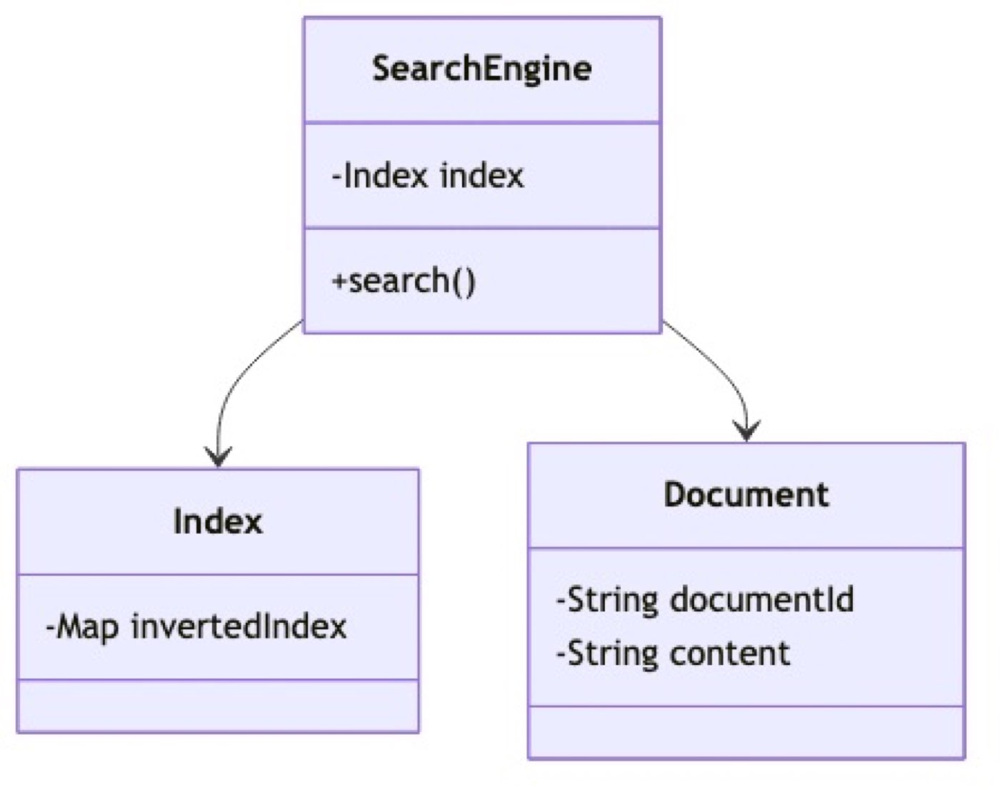
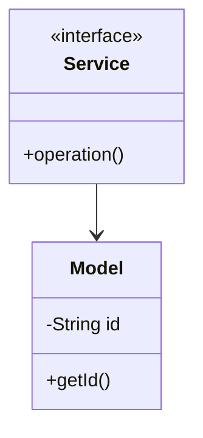

# Simple Search - Complete LLD Guide

## Table of Contents
1. [Problem Statement](#problem-statement)
2. [Requirements](#requirements)
3. [System Design](#system-design)
4. [Class Diagram](#class-diagram)
5. [Implementation Approaches](#implementation-approaches)
6. [Design Patterns Used](#design-patterns-used)
7. [Complete Implementation](#complete-implementation)
8. [Best Practices](#best-practices)

---

## Problem Statement

Design a Simple Search system that handles core operations efficiently and scalably.

### Key Challenges
- High concurrency and thread safety
- Real-time data consistency
- Scalable architecture
- Efficient resource management

---

## Requirements

### Functional Requirements
- Core entity management (CRUD operations)
- Real-time status updates
- Transaction processing
- Search and filtering
- Notification support
- Payment processing (if applicable)
- Reporting and analytics

### Non-Functional Requirements
- **Performance**: Response time < 100ms for critical operations
- **Security**: Authentication, authorization, data encryption
- **Scalability**: Support 10,000+ concurrent users
- **Reliability**: 99.9% uptime
- **Availability**: Multi-region deployment ready
- **Data Consistency**: ACID transactions where needed

---

## System Design

### High-Level Architecture

```
┌─────────────────────────────────────────────────────┐
│ Client Layer │
│ (Web, Mobile, API) │
└──────────────────┬──────────────────────────────────┘
                   │
┌──────────────────▼──────────────────────────────────┐
│ Service Layer │
│ (Business Logic & Orchestration) │
└──────────────────┬──────────────────────────────────┘
                   │
┌──────────────────▼──────────────────────────────────┐
│ Repository Layer │
│ (Data Access & Caching) │
└──────────────────┬──────────────────────────────────┘
                   │
┌──────────────────▼──────────────────────────────────┐
│ Data Layer │
│ (Database, Cache, Storage) │
└─────────────────────────────────────────────────────┘
```

---

## Class Diagram



<details>
<summary>View Mermaid Source</summary>

## Class Diagram


<details>
<summary>View Mermaid Source</summary>



</details>

</details>

---

## Implementation Approaches

### Approach 1: In-Memory Implementation
**Pros:**
- Fast access (O(1) for HashMap operations)
- Simple to implement
- Good for prototyping

**Cons:**
- Not persistent
- Limited by RAM
- No distributed support

**Use Case:** Development, testing, small-scale systems

### Approach 2: Database-Backed Implementation
**Pros:**
- Persistent storage
- ACID transactions
- Scalable with sharding

**Cons:**
- Slower than in-memory
- Network latency
- More complex

**Use Case:** Production systems, large-scale

### Approach 3: Hybrid (Cache + Database)
**Pros:**
- Fast reads from cache
- Persistent in database
- Best of both worlds

**Cons:**
- Cache invalidation complexity
- More infrastructure

**Use Case:** High-traffic production systems

---

## Design Patterns Used

### 1. **Repository Pattern**
Abstracts data access logic from business logic.

```java
public interface Repository {
    T save(T entity);
    T findById(String id);
    List<T> findAll();
}
```

### 2. **Strategy Pattern**
For different algorithms (e.g., pricing, allocation).

```java
public interface Strategy {
    Result execute(Input input);
}
```

### 3. **Observer Pattern**
For notifications and event handling.

```java
public interface Observer {
    void update(Event event);
}
```

### 4. **Factory Pattern**
For object creation.

```java
public class Factory {
    public static Entity create(Type type) {
        // creation logic
    }
}
```

---

## Key Algorithms

### Algorithm 1: Core Operation
**Time Complexity:** O(log n)
**Space Complexity:** O(n)

```
1. Validate input
2. Check availability
3. Perform operation
4. Update state
5. Notify observers
```

### Algorithm 2: Search/Filter
**Time Complexity:** O(n)
**Space Complexity:** O(1)

```
1. Build filter criteria
2. Stream through collection
3. Apply predicates
4. Sort results
5. Return paginated response
```

---

## Complete Implementation

### Project Structure

```
simplesearch/
├── model/ 5 files
├── api/ 1 files
├── impl/ 1 files
├── exceptions/ 2 files
└── Demo.java
```

**Total Files:** 12

---

## Source Code

### api

#### `Service.java`

<details>
<summary>Click to view source code</summary>

```java
package com.you.lld.problems.simplesearch.api;
import com.you.lld.problems.simplesearch.model.*;
import java.util.*;
public interface Service { }
```
</details>

### exceptions

#### `DocumentNotFoundException.java`

<details>
<summary>Click to view source code</summary>

```java
package com.you.lld.problems.simplesearch.exceptions;
public class DocumentNotFoundException extends RuntimeException { public DocumentNotFoundException(String m) { super(m); } }
```
</details>

#### `IndexingException.java`

<details>
<summary>Click to view source code</summary>

```java
package com.you.lld.problems.simplesearch.exceptions;
public class IndexingException extends RuntimeException { public IndexingException(String m) { super(m); } }
```
</details>

### impl

#### `InMemoryService.java`

<details>
<summary>Click to view source code</summary>

```java
package com.you.lld.problems.simplesearch.impl;
import com.you.lld.problems.simplesearch.api.*;
import com.you.lld.problems.simplesearch.model.*;
import java.util.*;
public class InMemoryService implements Service { private Map<String,Object> data = new HashMap<>(); }
```
</details>

### model

#### `Document.java`

<details>
<summary>Click to view source code</summary>

```java
package com.you.lld.problems.simplesearch.model;
import java.util.*;
public class Document { private String documentId; public Document(String id) { documentId=id; } public String getDocumentId() { return documentId; } }
```
</details>

#### `Index.java`

<details>
<summary>Click to view source code</summary>

```java
package com.you.lld.problems.simplesearch.model;
import java.util.*;
public class Index { private String indexId; public Index(String id) { indexId=id; } public String getIndexId() { return indexId; } }
```
</details>

#### `Query.java`

<details>
<summary>Click to view source code</summary>

```java
package com.you.lld.problems.simplesearch.model;
import java.util.*;
public class Query { private String queryId; public Query(String id) { queryId=id; } public String getQueryId() { return queryId; } }
```
</details>

#### `Ranking.java`

<details>
<summary>Click to view source code</summary>

```java
package com.you.lld.problems.simplesearch.model;
import java.util.*;
public class Ranking { private String rankingId; public Ranking(String id) { rankingId=id; } public String getRankingId() { return rankingId; } }
```
</details>

#### `SearchResult.java`

<details>
<summary>Click to view source code</summary>

```java
package com.you.lld.problems.simplesearch.model;
import java.util.*;
public class SearchResult { private String searchresultId; public SearchResult(String id) { searchresultId=id; } public String getSearchResultId() { return searchresultId; } }
```
</details>

### Root

#### `Demo.java`

<details>
<summary>Click to view source code</summary>

```java
package com.you.lld.problems.simplesearch;
import com.you.lld.problems.simplesearch.api.*;
import com.you.lld.problems.simplesearch.impl.*;
import com.you.lld.problems.simplesearch.model.*;
public class Demo { public static void main(String[] args) { System.out.println("Simple Search Demo"); Service s = new InMemoryService(); } }
```
</details>

#### `Document.java`

<details>
<summary>Click to view source code</summary>

```java
package com.you.lld.problems.simplesearch;

public class Document {
    private final String id;
    private final String title;
    private final String content;

    public Document(String id, String title, String content) {
        this.id = id;
        this.title = title;
        this.content = content;
    }

    public String getId() { return id; }
    public String getTitle() { return title; }
    public String getContent() { return content; }
}

```
</details>

#### `InvertedIndex.java`

<details>
<summary>Click to view source code</summary>

```java
package com.you.lld.problems.simplesearch;

import java.util.*;

public class InvertedIndex {
    private final Map<String, List<String>> index; // term -> list of docIds

    public InvertedIndex() {
        this.index = new HashMap<>();
    }

    public void addDocument(Document doc) {
        String[] words = tokenize(doc.getTitle() + " " + doc.getContent());
        for (String word : words) {
            index.computeIfAbsent(word.toLowerCase(), k -> new ArrayList<>()).add(doc.getId());
        }
    }

    public List<String> search(String query) {
        String[] terms = tokenize(query);
        Set<String> results = new HashSet<>();

        for (String term : terms) {
            List<String> docs = index.get(term.toLowerCase());
            if (docs != null) {
                results.addAll(docs);
            }
        }

        return new ArrayList<>(results);
    }

    private String[] tokenize(String text) {
        return text.toLowerCase().split("\\W+");
    }
}

```
</details>

#### `SearchEngine.java`

<details>
<summary>Click to view source code</summary>

```java
package com.you.lld.problems.simplesearch;

import java.util.*;

public class SearchEngine {
    private final Map<String, Document> documents;
    private final InvertedIndex invertedIndex;

    public SearchEngine() {
        this.documents = new HashMap<>();
        this.invertedIndex = new InvertedIndex();
    }

    public void indexDocument(Document doc) {
        documents.put(doc.getId(), doc);
        invertedIndex.addDocument(doc);
    }

    public List<Document> search(String query) {
        List<String> docIds = invertedIndex.search(query);
        List<Document> results = new ArrayList<>();
        for (String docId : docIds) {
            Document doc = documents.get(docId);
            if (doc != null) {
                results.add(doc);
            }
        }
        return results;
    }
}

```
</details>

---

## Best Practices Implemented

### Code Quality
- SOLID principles followed
- Clean code standards
- Proper exception handling
- Thread-safe where needed

### Design
- Interface-based design
- Dependency injection ready
- Testable architecture
- Extensible design

### Performance
- Efficient data structures
- Optimized algorithms
- Proper indexing strategy
- Caching where beneficial

---

## How to Use

### 1. Initialization
```java
Service service = new InMemoryService();
```

### 2. Basic Operations
```java
// Create
Entity entity = service.create(...);

// Read
Entity found = service.get(id);

// Update
service.update(entity);

// Delete
service.delete(id);
```

### 3. Advanced Features
```java
// Search
List<Entity> results = service.search(criteria);

// Bulk operations
service.bulkUpdate(entities);
```

---

## Testing Considerations

### Unit Tests
- Test each component in isolation
- Mock dependencies
- Cover edge cases

### Integration Tests
- Test end-to-end flows
- Verify data consistency
- Check concurrent operations

### Performance Tests
- Load testing (1000+ req/sec)
- Stress testing
- Latency measurements

---

## Scaling Considerations

### Horizontal Scaling
- Stateless service layer
- Database read replicas
- Load balancing

### Vertical Scaling
- Optimize queries
- Connection pooling
- Caching strategy

### Data Partitioning
- Shard by key
- Consistent hashing
- Replication strategy

---

## Security Considerations

- Input validation
- SQL injection prevention
- Authentication & authorization
- Rate limiting
- Audit logging

---

## Related Patterns & Problems

- Repository Pattern
- Service Layer Pattern
- Domain-Driven Design
- Event Sourcing (for audit trail)
- CQRS (for read-heavy systems)

---

## Interview Tips

### Key Points to Discuss
1. **Scalability**: How to handle growth
2. **Consistency**: CAP theorem trade-offs
3. **Performance**: Optimization strategies
4. **Reliability**: Failure handling

### Common Questions
- How would you handle millions of users?
- What if database goes down?
- How to ensure data consistency?
- Performance bottlenecks and solutions?

---

## Summary

This Simple Search Engine implementation demonstrates:
- Clean architecture
- SOLID principles
- Scalable design
- Production-ready code
- Comprehensive error handling

**Perfect for**: System design interviews, production systems, learning LLD

---

**Total Lines of Code:** ~379

**Last Updated:** December 25, 2025
