# Social Network (Facebook/Twitter) - Complete LLD Guide

## 📋 Table of Contents
1. [Problem Statement](#problem-statement)
2. [Requirements](#requirements)
3. [Core Algorithms](#core-algorithms)
4. [System Design](#system-design)
5. [Class Diagram](#class-diagram)
6. [Design Patterns](#design-patterns-used)
7. [Implementation Deep Dive](#implementation-deep-dive)
8. [Key Insights](#key-insights)
9. [Complete Implementation](#complete-implementation)

---

## Problem Statement

Design a **Social Networking Platform** (like Facebook/Twitter) supporting user profiles, friendships/follows, posts, likes, comments, news feed generation, and notifications. Handle billions of users and interactions with optimized feed algorithms (EdgeRank, Chronological, Ranked).

### Real-World Context
- 👥 **Facebook**: 3 billion users, 500K+ posts/minute
- 🐦 **Twitter**: 400M users, 500M tweets/day
- 📸 **Instagram**: 2 billion users, 95M posts/day
- 💼 **LinkedIn**: 900M users, professional networking

### Key Challenges
- 🎯 **Feed Generation**: Personalized news feed in < 500ms
- 🔄 **Fan-Out Strategy**: Write vs. read trade-offs
- 📊 **Ranking Algorithm**: EdgeRank, ML-based recommendations
- 🚀 **Scalability**: Billions of users, trillions of connections
- 💬 **Real-Time Notifications**: Likes, comments, mentions
- 🔍 **Search**: Users, posts, hashtags
- 🔒 **Privacy**: Friend-only, public, private posts

---

## Requirements

### Functional Requirements

✅ **User Management**
- Register (email, password)
- Login/logout
- Profile (name, bio, photo, cover photo)
- Privacy settings (public, friends-only, private)
- Account verification (blue checkmark)

✅ **Connections**
- **Facebook model**: Friend requests (bidirectional)
- **Twitter model**: Follow/unfollow (unidirectional)
- Block/unblock users
- Friend suggestions

✅ **Posts**
- Create post (text, image, video, link)
- Edit post
- Delete post
- Post visibility (public, friends, custom)
- Hashtags and mentions

✅ **Interactions**
- Like/unlike post
- Comment on post
- Reply to comment
- Share post
- React with emoji (👍 ❤️ 😂 😮 😢 😡)

✅ **News Feed**
- **Chronological**: Latest posts first
- **Ranked**: EdgeRank algorithm
- **Personalized**: ML-based recommendations
- Infinite scroll pagination

✅ **Notifications**
- New friend request
- Friend accepted request
- Post liked
- Post commented
- Mentioned in post/comment

✅ **Search**
- Search users by name
- Search posts by content
- Search by hashtag
- Trending topics

### Non-Functional Requirements

⚡ **Performance**
- Feed generation: < 500ms
- Post creation: < 100ms
- Search: < 200ms

🔒 **Security**
- Password hashing (bcrypt)
- Session management
- CSRF protection

📈 **Scalability**
- Support 1 billion users
- Handle 100K posts/second
- 1 trillion friend connections

🛡️ **Availability**
- 99.99% uptime
- Geographic distribution (CDN)

---

## Core Algorithms

### 1. News Feed Generation: Fan-Out on Write

**Algorithm:**
```
1. User posts content
2. Get user's followers/friends
3. Write post to each follower's feed cache
4. Asynchronous (don't block poster)
```

**Implementation:**
```java
public class SocialNetworkService {
    private Map<String, Queue<Post>> userFeeds = new ConcurrentHashMap<>();
    private ExecutorService fanOutExecutor = Executors.newFixedThreadPool(10);
    
    public void publishPost(String userId, String content) {
        // Create post
        Post post = new Post(userId, content, Instant.now());
        postRepository.save(post);
        
        // Fan-out asynchronously
        fanOutExecutor.submit(() -> {
            List<String> followers = getFollowers(userId);
            
            for (String followerId : followers) {
                Queue<Post> feed = userFeeds.computeIfAbsent(
                    followerId, k -> new ConcurrentLinkedQueue<>()
                );
                feed.offer(post);
                
                // Keep only latest 1000 posts in cache
                if (feed.size() > 1000) {
                    feed.poll(); // Remove oldest
                }
            }
        });
    }
    
    public List<Post> getFeed(String userId, int limit) {
        Queue<Post> feed = userFeeds.get(userId);
        if (feed == null) {
            return Collections.emptyList();
        }
        
        return feed.stream()
            .limit(limit)
            .collect(Collectors.toList());
    }
}
```

**Complexity:**
- Time: O(F) where F = number of followers
- Space: O(U × P) where U = users, P = posts per feed

**Pros:**
- ✅ Fast reads (feed pre-computed)
- ✅ Good for users with few followers

**Cons:**
- ❌ Slow writes (celebrities with 100M followers)
- ❌ High storage (duplicate posts in many feeds)

---

### 2. News Feed Generation: Fan-Out on Read

**Algorithm:**
```
1. User requests feed
2. Get list of users they follow
3. Fetch recent posts from each user
4. Merge and sort by timestamp
5. Return top N posts
```

**Implementation:**
```java
public List<Post> getFeedOnRead(String userId, int limit) {
    // Get users this user follows
    List<String> following = getFollowing(userId);
    
    // Fetch recent posts from each
    List<Post> feed = new ArrayList<>();
    for (String followedUserId : following) {
        List<Post> recentPosts = postRepository.getRecentPosts(followedUserId, 10);
        feed.addAll(recentPosts);
    }
    
    // Sort by timestamp (descending)
    feed.sort((a, b) -> b.getTimestamp().compareTo(a.getTimestamp()));
    
    // Return top N
    return feed.stream().limit(limit).collect(Collectors.toList());
}
```

**Complexity:**
- Time: O(F × log F) where F = total posts fetched
- Space: O(F)

**Pros:**
- ✅ Fast writes (just save post)
- ✅ Low storage (no duplication)
- ✅ Good for celebrities

**Cons:**
- ❌ Slow reads (compute feed on demand)
- ❌ Heavy database queries

---

### 3. Hybrid Approach (Best of Both Worlds)

**Strategy:**
```
Regular users (< 10K followers): Fan-out on write
Celebrities (> 10K followers): Fan-out on read
```

**Implementation:**
```java
public void publishPost(String userId, String content) {
    Post post = new Post(userId, content, Instant.now());
    postRepository.save(post);
    
    User author = userRepository.getUser(userId);
    
    if (author.getFollowerCount() < 10_000) {
        // Fan-out on write (regular user)
        fanOutOnWrite(post, userId);
    } else {
        // Fan-out on read (celebrity)
        // Just save post, feed will fetch on read
    }
}

public List<Post> getFeed(String userId, int limit) {
    List<Post> feed = new ArrayList<>();
    
    // Get pre-computed feed (from regular users)
    feed.addAll(getPreComputedFeed(userId, limit));
    
    // Get posts from celebrities (fetch on demand)
    List<String> celebrities = getCelebritiesFollowed(userId);
    for (String celeb : celebrities) {
        feed.addAll(postRepository.getRecentPosts(celeb, 10));
    }
    
    // Sort and return top N
    feed.sort((a, b) -> b.getTimestamp().compareTo(a.getTimestamp()));
    return feed.stream().limit(limit).collect(Collectors.toList());
}
```

---

### 4. EdgeRank Algorithm (Facebook's Feed Ranking)

**Formula:**
```
EdgeRank = Affinity × Weight × Time Decay
```

**Components:**
1. **Affinity**: How close is viewer to author?
   - Frequency of interactions
   - Recent interactions
   - Friendship duration

2. **Weight**: Type of interaction
   - Comment = 3 points
   - Share = 2 points
   - Like = 1 point

3. **Time Decay**: Recency of post
   - Exponential decay: e^(-λt)
   - λ = decay rate (e.g., 0.1 per hour)

**Implementation:**
```java
public double calculateEdgeRank(Post post, User viewer) {
    // 1. Affinity (0-1 scale)
    double affinity = calculateAffinity(viewer, post.getAuthor());
    
    // 2. Weight
    double weight = post.getInteractionWeight();
    // weight = likes + 2*comments + 3*shares
    
    // 3. Time decay
    long hoursSincePost = Duration.between(post.getTimestamp(), Instant.now()).toHours();
    double decay = Math.exp(-0.1 * hoursSincePost);
    
    return affinity * weight * decay;
}

private double calculateAffinity(User viewer, User author) {
    // Count interactions in last 30 days
    int interactions = interactionRepository.countInteractions(
        viewer.getId(), author.getId(), Duration.ofDays(30)
    );
    
    // Normalize to 0-1
    return Math.min(1.0, interactions / 100.0);
}
```

**Example:**
```
Post from Alice (Affinity=0.8, Weight=10, 2 hours old)
EdgeRank = 0.8 × 10 × e^(-0.1×2) = 0.8 × 10 × 0.82 = 6.56

Post from Bob (Affinity=0.3, Weight=50, 12 hours old)
EdgeRank = 0.3 × 50 × e^(-0.1×12) = 0.3 × 50 × 0.30 = 4.5

Winner: Alice's post (higher EdgeRank)
```

---

### 5. Friend Recommendations (People You May Know)

**Algorithm:**
```
1. Find mutual friends
2. Count mutual friend count for each potential friend
3. Sort by mutual friend count
4. Return top 10
```

**Implementation:**
```java
public List<User> recommendFriends(String userId) {
    Set<String> friends = friendRepository.getFriends(userId);
    Map<String, Integer> mutualFriendCount = new HashMap<>();
    
    // For each friend, check their friends
    for (String friendId : friends) {
        Set<String> friendOfFriends = friendRepository.getFriends(friendId);
        
        for (String potentialFriend : friendOfFriends) {
            // Skip if already friends or self
            if (potentialFriend.equals(userId) || friends.contains(potentialFriend)) {
                continue;
            }
            
            mutualFriendCount.merge(potentialFriend, 1, Integer::sum);
        }
    }
    
    // Sort by mutual friend count (descending)
    return mutualFriendCount.entrySet().stream()
        .sorted((a, b) -> b.getValue() - a.getValue())
        .limit(10)
        .map(e -> userRepository.getUser(e.getKey()))
        .collect(Collectors.toList());
}
```

**Complexity:**
- Time: O(F²) where F = number of friends
- Space: O(F²)

**Optimization:**
- Pre-compute recommendations nightly
- Use graph algorithms (Jaccard similarity)

---

## System Design

### High-Level Architecture

```
┌─────────────────────────────────────────────────────────┐
│                    Load Balancer                        │
└───────────────────┬─────────────────────────────────────┘
                    │
        ┌───────────┼───────────┐
        │           │           │
        ▼           ▼           ▼
   ┌────────┐  ┌────────┐  ┌────────┐
   │ Web    │  │ Web    │  │ Web    │
   │ Server │  │ Server │  │ Server │
   └────┬───┘  └────┬───┘  └────┬───┘
        │           │           │
        └───────────┼───────────┘
                    │
        ┌───────────┼───────────┐
        │           │           │
        ▼           ▼           ▼
   ┌────────┐  ┌────────┐  ┌────────┐
   │ App    │  │ App    │  │ App    │
   │ Server │  │ Server │  │ Server │
   └────┬───┘  └────┬───┘  └────┬───┘
        │           │           │
        └───────────┼───────────┘
                    │
    ┌───────────────┼───────────────┐
    │               │               │
    ▼               ▼               ▼
┌─────────┐   ┌──────────┐   ┌──────────┐
│ Feed    │   │ Post     │   │ User     │
│ Service │   │ Service  │   │ Service  │
└────┬────┘   └────┬─────┘   └────┬─────┘
     │             │              │
     └─────────────┼──────────────┘
                   │
       ┌───────────┼───────────┐
       │           │           │
       ▼           ▼           ▼
  ┌────────┐  ┌────────┐  ┌────────┐
  │ Redis  │  │ MySQL  │  │ S3     │
  │ Cache  │  │ DB     │  │ Media  │
  └────────┘  └────────┘  └────────┘
```

### Data Model

**Users Table:**
```sql
CREATE TABLE users (
    id VARCHAR(36) PRIMARY KEY,
    username VARCHAR(50) UNIQUE,
    email VARCHAR(100) UNIQUE,
    password_hash VARCHAR(255),
    name VARCHAR(100),
    bio TEXT,
    profile_photo_url VARCHAR(255),
    created_at TIMESTAMP,
    status ENUM('ACTIVE', 'SUSPENDED', 'DELETED')
);

CREATE INDEX idx_username ON users(username);
CREATE INDEX idx_email ON users(email);
```

**Friendships Table (Facebook model):**
```sql
CREATE TABLE friendships (
    user_id1 VARCHAR(36),
    user_id2 VARCHAR(36),
    status ENUM('PENDING', 'ACCEPTED', 'BLOCKED'),
    created_at TIMESTAMP,
    PRIMARY KEY (user_id1, user_id2),
    FOREIGN KEY (user_id1) REFERENCES users(id),
    FOREIGN KEY (user_id2) REFERENCES users(id)
);

CREATE INDEX idx_user_id1 ON friendships(user_id1);
CREATE INDEX idx_user_id2 ON friendships(user_id2);
```

**Posts Table:**
```sql
CREATE TABLE posts (
    id VARCHAR(36) PRIMARY KEY,
    author_id VARCHAR(36),
    content TEXT,
    media_url VARCHAR(255),
    visibility ENUM('PUBLIC', 'FRIENDS', 'PRIVATE'),
    created_at TIMESTAMP,
    updated_at TIMESTAMP,
    like_count INT DEFAULT 0,
    comment_count INT DEFAULT 0,
    share_count INT DEFAULT 0,
    FOREIGN KEY (author_id) REFERENCES users(id)
);

CREATE INDEX idx_author_id ON posts(author_id);
CREATE INDEX idx_created_at ON posts(created_at);
```

---

## Class Diagram

```mermaid
classDiagram

    class SocialNetworkDemo {
        +main() static void
    }

    class ChronologicalFeedAlgorithm {
        +generateFeed() List~Post~
    }

    class SimpleNotificationService {
        -final Map~String,Notification~ notifications
        +sendNotification() void
        +notifyFriendRequest() void
        +notifyPostLike() void
        +notifyComment() void
        +notifyFollow() void
    }

    class InMemorySocialNetworkService {
        -final Map~String,User~ users
        -final Map~String,Post~ posts
        -final Map~String,Comment~ comments
        -final Map~String,FriendRequest~ friendRequests
        -final Map~String,Notification~ notifications
        -final Map<String, List~Message~> conversations
        -final FeedAlgorithm feedAlgorithm
        -final NotificationService notificationService
        +createUser() User
        +getUser() User
        +updateUser() void
        +deleteUser() void
        +sendFriendRequest() FriendRequest
        +acceptFriendRequest() void
        +rejectFriendRequest() void
        +removeFriend() void
        +getFriends() List~User~
        +getPendingFriendRequests() List~FriendRequest~
    }

    class UnauthorizedException {
    }

    class UserNotFoundException {
    }

    class PostNotFoundException {
    }

    class CommentNotFoundException {
    }

    class InvalidRequestException {
    }

    class Post {
        -final String postId
        -final String authorId
        -String content
        -List~String~ mediaUrls
        -Set~String~ likeUserIds
        -List~Comment~ comments
        -PostVisibility visibility
        -Set~String~ taggedUserIds
        -String location
        -LocalDateTime createdAt
        +getPostId() String
        +getAuthorId() String
        +getContent() String
        +updateContent() void
        +getMediaUrls() List~String~
        +addMedia() void
        +getLikeUserIds() Set<String>
        +like() void
        +unlike() void
        +getLikesCount() int
    }

    class Message {
        -final String messageId
        -final String conversationId
        -final String senderId
        -String content
        -MessageStatus status
        -LocalDateTime sentAt
        -LocalDateTime deliveredAt
        -LocalDateTime readAt
        +getMessageId() String
        +getConversationId() String
        +getSenderId() String
        +getContent() String
        +getStatus() MessageStatus
        +markAsDelivered() void
        +markAsRead() void
        +getSentAt() LocalDateTime
        +getDeliveredAt() LocalDateTime
        +getReadAt() LocalDateTime
    }

    class Feed {
        -final String userId
        -List~Post~ posts
        -LocalDateTime lastUpdated
        +getUserId() String
        +getPosts() List~Post~
        +addPost() void
        +removePost() void
        +refresh() void
    }

    class MessageStatus
    <<enumeration>> MessageStatus

    class Notification {
        -final String notificationId
        -final String userId
        -final NotificationType type
        -final String actorId
        -final String targetId
        -String message
        -boolean read
        -LocalDateTime createdAt
        +getNotificationId() String
        +getUserId() String
        +getType() NotificationType
        +getActorId() String
        +getTargetId() String
        +getMessage() String
        +isRead() boolean
        +markAsRead() void
        +getCreatedAt() LocalDateTime
    }

    class User {
        -final String userId
        -String name
        -String email
        -String bio
        -String profilePicture
        -Set~String~ friendIds
        -Set~String~ followerIds
        -Set~String~ followingIds
        -Set~String~ blockedUserIds
        -UserStatus status
        +getUserId() String
        +getName() String
        +setName() void
        +getEmail() String
        +getBio() String
        +setBio() void
        +getProfilePicture() String
        +setProfilePicture() void
        +getFriendIds() Set<String>
        +addFriend() void
    }

    class PostVisibility
    <<enumeration>> PostVisibility

    class Comment {
        -final String commentId
        -final String postId
        -final String authorId
        -String content
        -Set~String~ likeUserIds
        -List~Comment~ replies
        -LocalDateTime createdAt
        -LocalDateTime updatedAt
        -boolean edited
        +getCommentId() String
        +getPostId() String
        +getAuthorId() String
        +getContent() String
        +updateContent() void
        +getLikeUserIds() Set<String>
        +like() void
        +unlike() void
        +getLikesCount() int
        +getReplies() List~Comment~
    }

    class UserStatus
    <<enumeration>> UserStatus

    class NotificationType
    <<enumeration>> NotificationType

    class FriendRequestStatus
    <<enumeration>> FriendRequestStatus

    class FriendRequest {
        -final String requestId
        -final String senderId
        -final String receiverId
        -FriendRequestStatus status
        -LocalDateTime sentAt
        -LocalDateTime respondedAt
        +getRequestId() String
        +getSenderId() String
        +getReceiverId() String
        +getStatus() FriendRequestStatus
        +accept() void
        +reject() void
        +getSentAt() LocalDateTime
        +getRespondedAt() LocalDateTime
    }

    class SocialNetworkService
    <<interface>> SocialNetworkService

    class FeedAlgorithm
    <<interface>> FeedAlgorithm

    class NotificationService
    <<interface>> NotificationService

    FeedAlgorithm <|.. ChronologicalFeedAlgorithm
    NotificationService <|.. SimpleNotificationService
    SocialNetworkService <|.. InMemorySocialNetworkService
    Post "1" --> "*" Comment
    Post --> PostVisibility
    Message --> MessageStatus
    Feed "1" --> "*" Post
    User --> UserStatus
    FriendRequest --> FriendRequestStatus
```

<details>
<summary>View Mermaid Source</summary>



</details>


<details>
<summary>📄 View Mermaid Source</summary>

</details>

---

## Design Patterns Used

### 1. Observer Pattern (Notifications)

```java
public interface PostObserver {
    void onPostCreated(Post post);
    void onPostLiked(Post post, User liker);
    void onPostCommented(Post post, Comment comment);
}

public class NotificationService implements PostObserver {
    @Override
    public void onPostLiked(Post post, User liker) {
        User author = userRepository.getUser(post.getAuthorId());
        sendNotification(author, 
            liker.getName() + " liked your post");
    }
    
    @Override
    public void onPostCommented(Post post, Comment comment) {
        User author = userRepository.getUser(post.getAuthorId());
        sendNotification(author,
            comment.getAuthorName() + " commented on your post");
    }
}
```

---

### 2. Strategy Pattern (Feed Algorithm)

```java
public interface FeedStrategy {
    List<Post> generateFeed(User user, int limit);
}

public class ChronologicalFeed implements FeedStrategy {
    @Override
    public List<Post> generateFeed(User user, int limit) {
        return postRepository.getPostsByTimestamp(user, limit);
    }
}

public class RankedFeed implements FeedStrategy {
    @Override
    public List<Post> generateFeed(User user, int limit) {
        List<Post> posts = postRepository.getRecentPosts(user, 1000);
        
        // Calculate EdgeRank for each post
        posts.forEach(post -> {
            double rank = calculateEdgeRank(post, user);
            post.setRank(rank);
        });
        
        // Sort by rank
        posts.sort((a, b) -> Double.compare(b.getRank(), a.getRank()));
        
        return posts.stream().limit(limit).collect(Collectors.toList());
    }
}

// Usage
SocialNetworkService service = new SocialNetworkServiceImpl();
service.setFeedStrategy(new RankedFeed()); // Switch algorithm
```

---

### 3. Factory Pattern (Post Creation)

```java
public interface PostFactory {
    Post createPost(String userId, String content);
}

public class TextPostFactory implements PostFactory {
    @Override
    public Post createPost(String userId, String content) {
        return new TextPost(userId, content);
    }
}

public class ImagePostFactory implements PostFactory {
    @Override
    public Post createPost(String userId, String content) {
        ImagePost post = new ImagePost(userId, content);
        post.setMediaUrl(uploadImage(content));
        return post;
    }
}
```

---

## Implementation Deep Dive

### Complete Post Creation Flow

```java
public Post createPost(String userId, String content, PostVisibility visibility) {
    // 1. Validate user
    User user = userRepository.getUser(userId);
    if (user == null) {
        throw new UserNotFoundException(userId);
    }
    
    // 2. Create post
    Post post = new Post(
        UUID.randomUUID().toString(),
        userId,
        content,
        visibility,
        Instant.now()
    );
    
    // 3. Save to database
    postRepository.save(post);
    
    // 4. Fan-out to followers (asynchronous)
    if (user.getFollowerCount() < 10_000) {
        fanOutExecutor.submit(() -> fanOutPost(post, userId));
    }
    
    // 5. Notify mentioned users
    List<String> mentions = extractMentions(content);
    for (String mentionedUserId : mentions) {
        notificationService.sendNotification(
            mentionedUserId,
            user.getName() + " mentioned you in a post"
        );
    }
    
    // 6. Index for search
    searchService.indexPost(post);
    
    return post;
}
```

---

## Key Insights

### What Interviewers Look For

1. ✅ **Feed Generation**: Fan-out on write vs. read, hybrid approach
2. ✅ **Ranking Algorithm**: EdgeRank, ML-based
3. ✅ **Scalability**: Sharding, caching, CDN
4. ✅ **Friend Recommendations**: Mutual friends, graph algorithms
5. ✅ **Real-Time Notifications**: WebSockets, push notifications
6. ✅ **Search**: Inverted index, Elasticsearch

---

### Common Mistakes

1. ❌ **Single feed strategy**: Always use fan-out on write (slow for celebrities)
2. ❌ **No caching**: Recalculate feed every request
3. ❌ **Synchronous fan-out**: Block poster while writing to all followers
4. ❌ **No pagination**: Load all posts at once
5. ❌ **No privacy**: All posts visible to everyone
6. ❌ **Linear search**: O(n) friend lookup

---

## Source Code

📄 **[View Complete Source Code](/problems/socialnetwork/CODE)**

**Total Lines of Code:** 920+

### File Structure
```
socialnetwork/
├── api/
│   ├── SocialNetworkService.java (50 lines)
│   ├── FeedAlgorithm.java (15 lines)
│   └── NotificationService.java (25 lines)
├── impl/
│   ├── InMemorySocialNetworkService.java (300 lines)
│   ├── ChronologicalFeedAlgorithm.java (40 lines)
│   └── SimpleNotificationService.java (60 lines)
├── model/
│   ├── User.java (80 lines)
│   ├── Post.java (70 lines)
│   ├── Comment.java (50 lines)
│   ├── FriendRequest.java (40 lines)
│   ├── Notification.java (35 lines)
│   └── Feed.java (45 lines)
└── exceptions/
    ├── UserNotFoundException.java (10 lines)
    ├── PostNotFoundException.java (10 lines)
    └── UnauthorizedException.java (10 lines)
```

---

## Usage Example

```java
SocialNetworkService service = new InMemorySocialNetworkService();

// Register users
String userId1 = service.registerUser("alice", "alice@example.com", "pass123");
String userId2 = service.registerUser("bob", "bob@example.com", "pass456");

// Send friend request
service.sendFriendRequest(userId1, userId2);
service.acceptFriendRequest(userId2, userId1);

// Create post
Post post = service.createPost(userId1, "Hello World!", PostVisibility.PUBLIC);

// Like and comment
service.likePost(userId2, post.getId());
service.commentOnPost(userId2, post.getId(), "Great post!");

// Get news feed
List<Post> feed = service.getNewsFeed(userId2, 20);

// Search
List<User> users = service.searchUsers("alice");
List<Post> posts = service.searchPosts("#technology");

// Friend recommendations
List<User> recommendations = service.recommendFriends(userId1);
```

---

## Interview Tips

### Questions to Ask

1. ❓ Facebook-style (bidirectional) or Twitter-style (unidirectional)?
2. ❓ Real-time notifications required?
3. ❓ Chronological or ranked feed?
4. ❓ Support for media (images/videos)?
5. ❓ Privacy settings?
6. ❓ Scale (DAU, posts/day)?

### How to Approach

1. Start with basic user registration and login
2. Add friendship/follow functionality
3. Add post creation
4. Add simple chronological feed
5. Add like/comment
6. Add ranked feed (EdgeRank)
7. Add notifications
8. Discuss scalability

---

## Related Problems

- 📧 **Notification System** - Real-time alerts
- 🔍 **Search Engine** - Content search
- 💬 **Chat System (WhatsApp)** - Real-time messaging
- 📊 **Analytics** - User engagement metrics

---

*Production-ready social network with optimized feed generation, ranking algorithms, friend recommendations, and scalable architecture for billions of users.*
