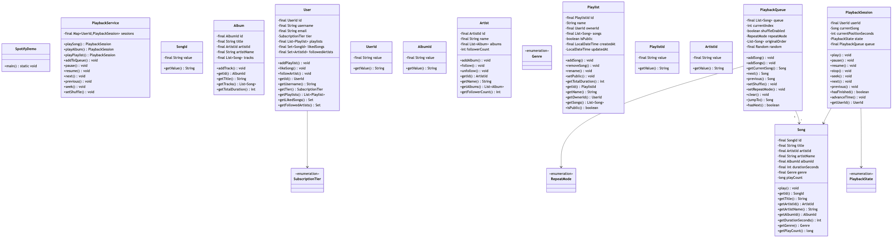

# Problem: Music Streaming Service (Spotify-like)

## Requirements

### Functional Requirements

#### Core Features (MVP)

1. **Music Catalog Management**
   - Browse songs, albums, and artists
   - Search by song title, artist, album
   - View song details (title, artist, album, duration, genre)
   - Get artist's albums and songs
   - Get album's tracks

2. **User Management**
   - Create user accounts
   - User profiles with preferences
   - Follow/unfollow artists
   - Subscription tiers (Free, Premium)

3. **Playlist Management**
   - Create personal playlists
   - Add/remove songs from playlists
   - Rename and delete playlists
   - Make playlists public/private
   - Share playlists with other users

4. **Playback Functionality**
   - Play a song
   - Pause/resume playback
   - Skip to next/previous song
   - Shuffle mode
   - Repeat modes (none, one, all)
   - Playback queue management

5. **Library Management**
   - Save songs to "Liked Songs"
   - Save albums
   - Save playlists
   - Recently played tracks
   - Listening history

6. **Search Functionality**
   - Search songs by title
   - Search by artist name
   - Search by album name
   - Filter by genre
   - Autocomplete suggestions

#### Advanced Features (Extensions)

7. **Recommendations** - Suggest songs based on listening history
8. **Social Features** - Follow friends, see what they're listening to
9. **Download for Offline** - Download songs for offline playback (Premium)
10. **Lyrics Display** - Show synchronized lyrics
11. **Radio/Stations** - Create radio based on song/artist
12. **Collaborative Playlists** - Multiple users edit same playlist
13. **Queue Sharing** - Share current queue with friends

### Non-Functional Requirements (NFRs)

1. **Performance**
   - Search results < 100ms
   - Playlist load < 200ms
   - Playback start < 500ms
   - Support 1 million concurrent users

2. **Scalability**
   - Handle millions of songs
   - Support millions of users
   - Billions of streams per month

3. **Availability**
   - 99.99% uptime
   - Graceful degradation
   - Offline mode support

4. **Data Consistency**
   - Playlist updates immediately visible
   - Play count accurately tracked
   - No duplicate songs in library

5. **Storage**
   - Efficient song metadata storage
   - Playlist storage optimization
   - History retention (90 days)

6. **User Experience**
   - Smooth playback transitions
   - Quick search results
   - Responsive UI updates

### Out of Scope

- Audio file storage/streaming (assume CDN)
- Payment processing
- Artist royalty calculations
- Music recommendation ML algorithms
- Social media integration
- Mobile app specifics
- Live radio streaming
- Podcast functionality

## Domain Model

### Core Entities

#### **Song** (Entity)
```java
class Song {
    - SongId id
    - String title
    - Artist artist
    - Album album
    - Duration duration
    - Genre genre
    - String audioUrl
    - LocalDate releaseDate
    - long playCount
}
```

**Invariants:**
- Title must not be empty
- Duration must be positive
- Artist and album required
- Audio URL must be valid

#### **Album** (Entity)
```java
class Album {
    - AlbumId id
    - String title
    - Artist artist
    - LocalDate releaseDate
    - List<Song> tracks
    - String coverArtUrl
    - Genre genre
}
```

**Invariants:**
- Must have at least one track
- All tracks must belong to same album
- Release date cannot be in future

#### **Artist** (Entity)
```java
class Artist {
    - ArtistId id
    - String name
    - String bio
    - List<Album> albums
    - int followerCount
    - String imageUrl
}
```

**Invariants:**
- Name must be unique
- Name must not be empty

#### **Playlist** (Aggregate Root)
```java
class Playlist {
    - PlaylistId id
    - String name
    - UserId ownerId
    - List<Song> songs
    - boolean isPublic
    - boolean isCollaborative
    - LocalDateTime createdAt
    - LocalDateTime updatedAt
}
```

**Invariants:**
- Name must be 1-100 characters
- Owner cannot be null
- Public playlists visible to all
- Collaborative playlists allow multiple editors

#### **User** (Aggregate Root)
```java
class User {
    - UserId id
    - String username
    - String email
    - SubscriptionTier tier
    - List<Playlist> playlists
    - Set<Song> likedSongs
    - Set<Album> savedAlbums
    - Set<Artist> followedArtists
    - ListeningHistory history
}
```

**Invariants:**
- Username and email must be unique
- Email must be valid format
- Free tier has ads and limited skips
- Premium tier has no ads and offline downloads

#### **PlaybackQueue** (Entity)
```java
class PlaybackQueue {
    - List<Song> queue
    - int currentIndex
    - ShuffleMode shuffleMode
    - RepeatMode repeatMode
    - List<Song> originalOrder
}
```

**Invariants:**
- Current index must be within queue bounds
- Original order preserved for shuffle toggle

#### **PlaybackSession** (Value Object)
```java
class PlaybackSession {
    - Song currentSong
    - int currentPosition  // in seconds
    - PlaybackState state  // PLAYING, PAUSED, STOPPED
    - PlaybackQueue queue
}
```

### Value Objects

- **SongId, AlbumId, ArtistId, PlaylistId, UserId** - Type-safe identifiers
- **Duration** - Song/album duration with validation
- **Genre** - Enum (POP, ROCK, JAZZ, CLASSICAL, etc.)
- **SubscriptionTier** - Enum (FREE, PREMIUM)
- **PlaybackState** - Enum (PLAYING, PAUSED, STOPPED)
- **ShuffleMode** - Enum (OFF, ON)
- **RepeatMode** - Enum (NONE, ONE, ALL)

### Key Relationships

```
User 1--* Playlist (owns)
User *--* Artist (follows)
User *--* Song (likes)
User *--* Album (saves)
User 1--1 PlaybackSession

Playlist *--* Song (contains)

Artist 1--* Album (creates)
Album 1--* Song (contains)
Song *--1 Artist (performed by)
Song *--1 Album (part of)
```

## Diagrams

### Class Diagram



### Sequence Diagrams

#### Play Song Flow

#### Create Playlist and Add Songs

#### Search and Play Album

### State Diagrams

#### Playback Session States

#### Playlist Lifecycle

## API Design

### Core Interfaces

#### MusicLibrary

```java
public interface MusicLibrary {
    /**
     * Search songs by title or artist.
     */
    List<Song> searchSongs(String query);
    
    /**
     * Search artists by name.
     */
    List<Artist> searchArtists(String query);
    
    /**
     * Search albums by title or artist.
     */
    List<Album> searchAlbums(String query);
    
    /**
     * Get song by ID.
     */
    Optional<Song> getSongById(SongId id);
    
    /**
     * Get artist by ID with all albums and songs.
     */
    Optional<Artist> getArtistById(ArtistId id);
    
    /**
     * Get album by ID with all tracks.
     */
    Optional<Album> getAlbumById(AlbumId id);
    
    /**
     * Browse songs by genre.
     */
    List<Song> getSongsByGenre(Genre genre);
    
    /**
     * Get popular songs (by play count).
     */
    List<Song> getPopularSongs(int limit);
}
```

#### PlaylistService

```java
public interface PlaylistService {
    /**
     * Create a new playlist for user.
     */
    Playlist createPlaylist(UserId userId, String name);
    
    /**
     * Add song to playlist.
     */
    void addSongToPlaylist(PlaylistId playlistId, SongId songId, UserId userId);
    
    /**
     * Remove song from playlist.
     */
    void removeSongFromPlaylist(PlaylistId playlistId, SongId songId, UserId userId);
    
    /**
     * Reorder songs in playlist.
     */
    void reorderPlaylist(PlaylistId playlistId, int fromIndex, int toIndex, UserId userId);
    
    /**
     * Make playlist public/private.
     */
    void setPlaylistVisibility(PlaylistId playlistId, boolean isPublic, UserId userId);
    
    /**
     * Delete playlist.
     */
    void deletePlaylist(PlaylistId playlistId, UserId userId);
    
    /**
     * Get user's playlists.
     */
    List<Playlist> getUserPlaylists(UserId userId);
}
```

#### PlaybackService

```java
public interface PlaybackService {
    /**
     * Start playing a song.
     */
    PlaybackSession playSong(UserId userId, SongId songId);
    
    /**
     * Play an entire album.
     */
    PlaybackSession playAlbum(UserId userId, AlbumId albumId);
    
    /**
     * Play a playlist.
     */
    PlaybackSession playPlaylist(UserId userId, PlaylistId playlistId);
    
    /**
     * Pause current playback.
     */
    void pause(UserId userId);
    
    /**
     * Resume playback.
     */
    void resume(UserId userId);
    
    /**
     * Skip to next song.
     */
    void next(UserId userId);
    
    /**
     * Go to previous song.
     */
    void previous(UserId userId);
    
    /**
     * Seek to position in current song.
     */
    void seek(UserId userId, int position);
    
    /**
     * Add song to queue.
     */
    void addToQueue(UserId userId, SongId songId);
    
    /**
     * Enable/disable shuffle.
     */
    void setShuffle(UserId userId, boolean enabled);
    
    /**
     * Set repeat mode.
     */
    void setRepeat(UserId userId, RepeatMode mode);
    
    /**
     * Get current playback session.
     */
    Optional<PlaybackSession> getCurrentSession(UserId userId);
}
```

### Error Taxonomy

```java
// Domain Exceptions
class SongNotFoundException extends RuntimeException
class AlbumNotFoundException extends RuntimeException
class ArtistNotFoundException extends RuntimeException
class PlaylistNotFoundException extends RuntimeException
class UnauthorizedException extends RuntimeException
class PlaylistFullException extends RuntimeException
class InvalidDurationException extends RuntimeException

// Business Rule Violations
- Playlist name too long (>100 chars)
- Cannot add duplicate songs to playlist
- Cannot modify others' private playlists
- Cannot play empty playlist
- Free tier: Skip limit exceeded
- Invalid audio URL format
```

## Implementation Notes

### Data Storage Strategy

**In-Memory Maps:**
```java
ConcurrentHashMap<SongId, Song> songs
ConcurrentHashMap<AlbumId, Album> albums
ConcurrentHashMap<ArtistId, Artist> artists
ConcurrentHashMap<PlaylistId, Playlist> playlists
ConcurrentHashMap<UserId, User> users
ConcurrentHashMap<UserId, PlaybackSession> activeSessions
```

**Indexes for Fast Search:**
```java
Map<String, Set<SongId>> songTitleIndex
Map<String, Set<ArtistId>> artistNameIndex
Map<String, Set<AlbumId>> albumTitleIndex
Map<Genre, Set<SongId>> genreIndex
```

### Playback Queue Algorithm

**Shuffle Implementation:**
```java
// Fisher-Yates shuffle
void shuffle() {
    saveOriginalOrder();
    for (int i = queue.size() - 1; i > 0; i--) {
        int j = random.nextInt(i + 1);
        swap(queue, i, j);
    }
}
```

**Repeat Mode Logic:**
```java
Song next() {
    if (currentIndex < queue.size() - 1) {
        return queue.get(++currentIndex);
    }
    
    switch (repeatMode) {
        case ONE:
            return queue.get(currentIndex); // Same song
        case ALL:
            currentIndex = 0;
            return queue.get(0);  // Loop to start
        case NONE:
            return null;  // End playback
    }
}
```

### Search Implementation

**Simple Text Search:**
```java
List<Song> searchSongs(String query) {
    String lowerQuery = query.toLowerCase();
    return songs.values().stream()
        .filter(song -> 
            song.getTitle().toLowerCase().contains(lowerQuery) ||
            song.getArtist().getName().toLowerCase().contains(lowerQuery))
        .collect(Collectors.toList());
}
```

**Optimized with Index:**
```java
List<Song> searchSongsIndexed(String query) {
    Set<SongId> results = songTitleIndex.getOrDefault(
        query.toLowerCase(), Collections.emptySet()
    );
    return results.stream()
        .map(songs::get)
        .collect(Collectors.toList());
}
```

## Testing Strategy

### Unit Tests

1. **Song/Album/Artist**
   - Create entities with validation
   - Test invariants
   - Test relationships

2. **Playlist Operations**
   - Add/remove songs
   - Reorder songs
   - Visibility changes
   - Authorization checks

3. **Playback Queue**
   - Next/previous navigation
   - Shuffle/unshuffle
   - Repeat modes
   - Queue manipulation

4. **Search**
   - Search by different criteria
   - Empty results
   - Partial matches

### Integration Tests

1. **End-to-End Playback**
   - Play song → next → previous → pause → resume
   - Play album (all tracks)
   - Play playlist with shuffle

2. **Playlist Workflow**
   - Create → add songs → play → share

3. **User Library**
   - Like songs → save albums → follow artists

## Trade-offs (ADRs)

### ADR 1: In-Memory vs Persistent Storage

**Decision**: Use in-memory storage for demo

**Rationale**: Simplifies implementation, fast performance, suitable for LLD demo scope.

### ADR 2: Playback Queue Management

**Decision**: Maintain separate queue per user session

**Rationale**: Allows independent playback for each user, simple state management.

### ADR 3: Search Strategy

**Decision**: Use simple text matching with optional indexing

**Rationale**: Good enough for demo, can be enhanced with Elasticsearch in production.

### ADR 4: Playlist Collaboration

**Decision**: Owner-based authorization, optional collaboration flag

**Rationale**: Simple permission model, easy to implement and understand.

## Performance Considerations

### Expected Performance

| Operation | Time Complexity | Expected Latency |
|-----------|----------------|------------------|
| Search songs | O(n) or O(1) with index | < 100ms |
| Play song | O(1) | < 500ms |
| Add to playlist | O(1) | < 50ms |
| Next/previous | O(1) | < 10ms |
| Create playlist | O(1) | < 50ms |

### Scalability

- **Users**: 1 million concurrent
- **Songs**: 50 million tracks
- **Playlists**: Billions
- **Streams**: Billions per month

## Extensions

1. **Recommendations** - ML-based song suggestions
2. **Social Features** - Follow friends, collaborative listening
3. **Offline Mode** - Download songs for offline playback
4. **Lyrics** - Synchronized lyrics display
5. **Radio** - Create stations based on seed song
6. **Crossfade** - Smooth transitions between songs
7. **Equalizer** - Audio customization
8. **Statistics** - Listening trends, top artists

## Related Problems

- **YouTube Music** - Similar with video content
- **Apple Music** - Similar streaming service
- **SoundCloud** - User-generated content focus
- **Pandora** - Radio-style recommendation focus


