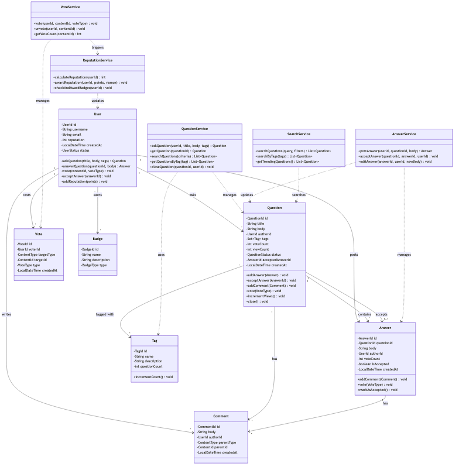

# Problem: Stack Overflow (Q&A Platform)

## Requirements

### Functional Requirements

#### Core Features (MVP)
1. **User Management**
   - Register/authenticate users
   - View user profiles with reputation and badges
   - Track user activity (questions, answers, comments)

2. **Question Management**
   - Ask questions with title, body, and tags
   - Edit/delete own questions
   - View questions with pagination
   - Close questions (by author or moderators)

3. **Answer Management**
   - Post answers to questions
   - Edit/delete own answers
   - Accept best answer (by question author only)
   - Multiple answers per question

4. **Voting System**
   - Upvote/downvote questions and answers
   - One vote per user per item
   - Change vote (upvote → downvote or vice versa)
   - Vote affects author's reputation

5. **Comment System**
   - Comment on questions and answers
   - Edit/delete own comments
   - View comments chronologically

6. **Tagging System**
   - Tag questions with relevant topics
   - Browse questions by tag
   - Popular tags tracking

7. **Reputation System**
   - Earn reputation through contributions
   - Reputation affects privileges
   - Reputation changes: +10 question upvote, +10 answer upvote, +15 accepted answer, -2 downvote

8. **Search Functionality**
   - Search questions by keywords
   - Filter by tags
   - Sort by votes, activity, creation date

#### Advanced Features (Extensions)
9. **Badge System** - Award achievements
10. **Bounty System** - Offer reputation for answers
11. **Moderation** - Flag inappropriate content
12. **Notifications** - Alert users of activity
13. **Follow System** - Follow questions/users

### Non-Functional Requirements (NFRs)

1. **Scalability**
   - Support millions of users
   - Handle thousands of questions per day
   - Efficient search with millions of questions

2. **Performance**
   - Question page load < 200ms
   - Search results < 500ms
   - Vote registration instant

3. **Consistency**
   - Reputation calculations must be accurate
   - Vote counts must be consistent
   - No duplicate votes

4. **Availability**
   - 99.9% uptime
   - Graceful degradation

5. **Extensibility**
   - Easy to add new content types
   - Pluggable reputation rules
   - Customizable badge system

6. **Data Integrity**
   - Audit trail for votes
   - No orphaned content
   - Referential integrity

### Out of Scope

- Real-time chat
- Video/image hosting (assume external CDN)
- Email notifications (assume external service)
- Payment processing for bounties
- Complex spam detection (assume external service)
- Mobile apps (focus on backend)

## Domain Model

### Core Entities

#### **User** (Aggregate Root)
```java
class User {
    - UserId id
    - String username
    - String email
    - String passwordHash
    - int reputation
    - LocalDateTime createdAt
    - UserStatus status
    - List<Badge> badges
}
```

**Invariants:**
- Username must be unique
- Email must be unique and valid
- Reputation cannot be negative
- Username 3-20 characters

#### **Question** (Aggregate Root)
```java
class Question {
    - QuestionId id
    - String title
    - String body
    - UserId authorId
    - Set<Tag> tags
    - int voteCount
    - int viewCount
    - QuestionStatus status
    - AnswerId acceptedAnswerId
    - LocalDateTime createdAt
    - LocalDateTime updatedAt
    - List<Answer> answers
    - List<Comment> comments
}
```

**Invariants:**
- Title must be 15-150 characters
- Body must be at least 30 characters
- Must have 1-5 tags
- Only author can accept answer
- Cannot delete if has accepted answer

#### **Answer** (Entity within Question aggregate)
```java
class Answer {
    - AnswerId id
    - QuestionId questionId
    - String body
    - UserId authorId
    - int voteCount
    - boolean isAccepted
    - LocalDateTime createdAt
    - LocalDateTime updatedAt
    - List<Comment> comments
}
```

**Invariants:**
- Body must be at least 30 characters
- Only one answer can be accepted per question
- Cannot accept own answer

#### **Comment** (Value Object)
```java
class Comment {
    - CommentId id
    - String body
    - UserId authorId
    - ContentType parentType
    - ContentId parentId
    - LocalDateTime createdAt
}
```

**Invariants:**
- Body must be 15-600 characters
- Cannot edit after 5 minutes
- Immutable after creation (except deletion)

#### **Vote** (Value Object)
```java
class Vote {
    - VoteId id
    - UserId voterId
    - ContentType targetType
    - ContentId targetId
    - VoteType type  // UPVOTE, DOWNVOTE
    - LocalDateTime createdAt
}
```

**Invariants:**
- One vote per user per content item
- Can change vote type
- Cannot vote on own content

#### **Tag** (Value Object)
```java
class Tag {
    - TagId id
    - String name
    - String description
    - int questionCount
}
```

**Invariants:**
- Name must be unique
- Name lowercase, alphanumeric + hyphens
- 2-35 characters

#### **Badge** (Value Object)
```java
class Badge {
    - BadgeId id
    - String name
    - String description
    - BadgeType type  // BRONZE, SILVER, GOLD
    - AwardCondition condition
}
```

### Value Objects

- **UserId, QuestionId, AnswerId, CommentId, VoteId, TagId, BadgeId** - Type-safe identifiers
- **Reputation** - Value object with business rules
- **ContentType** - Enum (QUESTION, ANSWER)
- **VoteType** - Enum (UPVOTE, DOWNVOTE)
- **QuestionStatus** - Enum (OPEN, CLOSED, DELETED)
- **UserStatus** - Enum (ACTIVE, SUSPENDED, DELETED)

### Aggregates

1. **User Aggregate**
   - Root: User
   - Controls: User profile, reputation, badges

2. **Question Aggregate**
   - Root: Question
   - Contains: Answers, Comments
   - Controls: Question lifecycle, answer acceptance

3. **Vote Aggregate**
   - Root: Vote
   - Controls: Voting rules, reputation impact

## Diagrams

### Class Diagram

<details>
<summary>View Mermaid Source</summary>

```mermaid
classDiagram

    class StackOverflowDemo {
        +main(): void
    }

    class Answer {
        -AnswerId: id
        -QuestionId: questionId
        -String: body
        -UserId: authorId
        -int: voteCount
        -boolean: isAccepted
        -LocalDateTime: createdAt
        -LocalDateTime: updatedAt
        +edit(): void
        +markAsAccepted(): void
        +unmarkAsAccepted(): void
        +applyVote(): void
        +getId(): AnswerId
        +getQuestionId(): QuestionId
        +getBody(): String
        +getAuthorId(): UserId
    }

    class Tag {
        -String: name
        -String: description
        +getName(): String
        +getDescription(): String
    }

    class QuestionStatus {
        <<enumeration>>
    }

    class User {
        -UserId: id
        -String: username
        -String: email
        -String: passwordHash
        -int: reputation
        -LocalDateTime: createdAt
        -UserStatus: status
        +addReputation(): void
        +hasReputation(): boolean
        +suspend(): void
        +activate(): void
        +isActive(): boolean
        +getId(): UserId
        +getUsername(): String
        +getEmail(): String
    }

    class UserId {
        -long: value
        +getValue(): long
    }

    class Question {
        -QuestionId: id
        -String: title
        -String: body
        -UserId: authorId
        -Set~Tag~: tags
        -int: voteCount
        -int: viewCount
        -QuestionStatus: status
        +edit(): void
        +acceptAnswer(): void
        +unacceptAnswer(): void
        +applyVote(): void
        +incrementViews(): void
        +close(): void
        +hasAcceptedAnswer(): boolean
        +isOpen(): boolean
    }

    class UserStatus {
        <<enumeration>>
    }

    class QuestionId {
        -long: value
        +getValue(): long
    }

    class VoteType {
        <<enumeration>>
        -int: value
        -int: reputationChange
        +getValue(): int
        +getReputationChange(): int
    }

    class AnswerId {

    Answer --> AnswerId
    Answer --> QuestionId
    Answer --> UserId
    User --> UserId
    User --> UserStatus
    Question --> QuestionId
    Question --> UserId
    Question "1" --> "*" Tag
    Question --> QuestionStatus
    Question --> AnswerId
```

</details>



### Sequence Diagrams

#### Ask Question Flow

#### Answer and Accept Flow

#### Vote Flow

### State Diagrams

#### Question Lifecycle

#### User Reputation Journey

## API Design

### Core Interfaces

#### QuestionService

```java
public interface QuestionService {
    /**
     * Creates a new question.
     * 
     * @param userId the author's user ID
     * @param title question title (15-150 chars)
     * @param body question body (min 30 chars)
     * @param tags list of tags (1-5 tags)
     * @return created question
     * @throws ValidationException if input invalid
     * @throws AuthenticationException if user not authenticated
     */
    Question askQuestion(UserId userId, String title, String body, List<String> tags);
    
    /**
     * Retrieves a question by ID and increments view count.
     */
    Optional<Question> getQuestion(QuestionId id);
    
    /**
     * Searches questions by criteria.
     */
    List<Question> searchQuestions(SearchCriteria criteria);
    
    /**
     * Gets questions by specific tag.
     */
    List<Question> getQuestionsByTag(String tagName, SortOrder sortOrder);
    
    /**
     * Closes a question (author or moderator only).
     */
    void closeQuestion(QuestionId id, UserId userId, String reason);
    
    /**
     * Edits a question (author only, within time limit).
     */
    void editQuestion(QuestionId id, UserId userId, String newTitle, String newBody);
}
```

#### AnswerService

```java
public interface AnswerService {
    /**
     * Posts an answer to a question.
     */
    Answer postAnswer(UserId userId, QuestionId questionId, String body);
    
    /**
     * Accepts an answer as the best answer (question author only).
     */
    void acceptAnswer(QuestionId questionId, AnswerId answerId, UserId userId);
    
    /**
     * Unaccepts the currently accepted answer.
     */
    void unacceptAnswer(QuestionId questionId, UserId userId);
    
    /**
     * Edits an answer (author only).
     */
    void editAnswer(AnswerId id, UserId userId, String newBody);
    
    /**
     * Gets all answers for a question.
     */
    List<Answer> getAnswers(QuestionId questionId, SortOrder sortOrder);
}
```

#### VoteService

```java
public interface VoteService {
    /**
     * Casts or changes a vote.
     * 
     * - If no vote exists: creates new vote
     * - If same vote exists: removes vote (unvote)
     * - If opposite vote exists: changes vote
     */
    void vote(UserId userId, ContentId contentId, VoteType voteType);
    
    /**
     * Removes a vote.
     */
    void unvote(UserId userId, ContentId contentId);
    
    /**
     * Gets vote count for content.
     */
    int getVoteCount(ContentId contentId);
    
    /**
     * Gets user's vote on content, if any.
     */
    Optional<VoteType> getUserVote(UserId userId, ContentId contentId);
}
```

### Error Taxonomy

```java
// Domain Exceptions
class ValidationException extends RuntimeException
class AuthorizationException extends RuntimeException
class ResourceNotFoundException extends RuntimeException
class DuplicateVoteException extends RuntimeException
class ReputationInsufficientException extends RuntimeException

// Validation Errors
- Title too short/long
- Body too short
- Invalid tags
- Too many/few tags
- Content contains spam

// Authorization Errors
- User cannot accept answer (not question author)
- User cannot edit (not author)
- User cannot close (not author/moderator)
- User cannot vote on own content

// Business Rule Violations
- Question already has accepted answer
- Cannot vote twice
- Insufficient reputation
- Question is closed
```

## Testing Strategy

### Unit Tests

1. **Entity Tests**
   - User reputation calculations
   - Question validation rules
   - Answer acceptance logic
   - Vote constraints
   - Tag validation

2. **Service Tests**
   - Question creation flow
   - Answer posting flow
   - Vote application and reputation updates
   - Search functionality
   - Authorization checks

3. **Repository Tests**
   - CRUD operations
   - Query performance
   - Transaction handling

### Integration Tests

1. **End-to-End Flows**
   - Complete Q&A cycle
   - User reputation journey
   - Voting and reputation sync
   - Search indexing

2. **Concurrency Tests**
   - Simultaneous voting
   - Race conditions in reputation
   - Concurrent answer acceptance

### Property-Based Tests

1. **Invariants**
   - Reputation never negative
   - Vote count matches individual votes
   - Only one accepted answer per question
   - Tag counts accurate

2. **Properties**
   - Upvote increases reputation
   - Accepted answer gives +15 reputation
   - Downvote costs reputation

## Trade-offs (ADRs)

### ADR 1: Reputation Calculation Strategy

**Decision**: Calculate reputation incrementally on each event rather than on-demand

**Alternatives:**
1. **On-demand calculation** (aggregate all votes when needed)
   - ✅ Always accurate
   - ❌ Slow for users with many posts
   - ❌ Database intensive

2. **Incremental with events** (chosen)
   - ✅ Fast reputation retrieval
   - ✅ Scales well
   - ❌ Requires careful event handling
   - ❌ Need reconciliation for edge cases

**Rationale**: User profiles displayed frequently; can't recalculate each time. Event-driven approach with periodic reconciliation is best.

### ADR 2: Vote Storage

**Decision**: Store votes as separate entities rather than just counters

**Alternatives:**
1. **Just counter** (voteCount on Question/Answer)
   - ✅ Simple
   - ✅ Fast reads
   - ❌ No audit trail
   - ❌ Can't prevent duplicate votes
   - ❌ Can't show user's vote

2. **Separate Vote entities** (chosen)
   - ✅ Audit trail
   - ✅ Enforce one vote per user
   - ✅ Can show user's vote
   - ✅ Can change vote
   - ❌ More storage
   - ❌ More complex queries

**Rationale**: Business rules require preventing duplicate votes and showing user's vote status. Worth the extra complexity.

### ADR 3: Answer Storage

**Decision**: Store answers as separate entities with reference to question

**Alternatives:**
1. **Embedded in Question document**
   - ✅ Single read for question + answers
   - ❌ Document size grows unbounded
   - ❌ Hard to query answers independently
   - ❌ Update conflicts

2. **Separate table with foreign key** (chosen)
   - ✅ Bounded document size
   - ✅ Independent queries
   - ✅ No update conflicts
   - ❌ Requires join/multiple queries

**Rationale**: Questions can have many answers (100+). Separate storage allows better scalability and independent answer operations.

### ADR 4: Search Implementation

**Decision**: Use dedicated search engine (Elasticsearch) for question search

**Alternatives:**
1. **Database full-text search**
   - ✅ Simple
   - ✅ Consistent with main DB
   - ❌ Limited relevance ranking
   - ❌ Poor performance at scale
   - ❌ Limited filter options

2. **Dedicated search engine** (chosen)
   - ✅ Excellent relevance ranking
   - ✅ Fast at scale
   - ✅ Rich query capabilities
   - ✅ Faceted search
   - ❌ Eventual consistency
   - ❌ Additional infrastructure

**Rationale**: Search is core feature; needs to be fast and relevant. Worth the complexity of separate search index.

### ADR 5: Tag Implementation

**Decision**: Tags as separate entities with many-to-many relationship

**Alternatives:**
1. **Tags as strings in Question**
   - ✅ Simple
   - ❌ No tag metadata
   - ❌ Inconsistent spelling
   - ❌ Hard to query "all questions with tag X"

2. **Separate Tag entity** (chosen)
   - ✅ Tag metadata (description, count)
   - ✅ Consistent naming
   - ✅ Easy tag-based queries
   - ✅ Tag suggestions
   - ❌ More complex schema

**Rationale**: Tags are first-class navigation mechanism; need to support tag pages and statistics.

## Implementation Notes

### Database Schema (Relational)

```sql
-- Users table
CREATE TABLE users (
    id BIGSERIAL PRIMARY KEY,
    username VARCHAR(20) UNIQUE NOT NULL,
    email VARCHAR(255) UNIQUE NOT NULL,
    password_hash VARCHAR(255) NOT NULL,
    reputation INTEGER DEFAULT 1,
    created_at TIMESTAMP DEFAULT NOW(),
    status VARCHAR(20) DEFAULT 'ACTIVE',
    INDEX idx_username (username),
    INDEX idx_reputation (reputation DESC)
);

-- Questions table
CREATE TABLE questions (
    id BIGSERIAL PRIMARY KEY,
    title VARCHAR(150) NOT NULL,
    body TEXT NOT NULL,
    author_id BIGINT REFERENCES users(id),
    vote_count INTEGER DEFAULT 0,
    view_count INTEGER DEFAULT 0,
    answer_count INTEGER DEFAULT 0,
    accepted_answer_id BIGINT,
    status VARCHAR(20) DEFAULT 'OPEN',
    created_at TIMESTAMP DEFAULT NOW(),
    updated_at TIMESTAMP DEFAULT NOW(),
    INDEX idx_author (author_id),
    INDEX idx_votes (vote_count DESC),
    INDEX idx_created (created_at DESC),
    INDEX idx_status (status)
);

-- Answers table
CREATE TABLE answers (
    id BIGSERIAL PRIMARY KEY,
    question_id BIGINT REFERENCES questions(id),
    body TEXT NOT NULL,
    author_id BIGINT REFERENCES users(id),
    vote_count INTEGER DEFAULT 0,
    is_accepted BOOLEAN DEFAULT FALSE,
    created_at TIMESTAMP DEFAULT NOW(),
    updated_at TIMESTAMP DEFAULT NOW(),
    INDEX idx_question (question_id),
    INDEX idx_author (author_id),
    INDEX idx_votes (vote_count DESC)
);

-- Votes table
CREATE TABLE votes (
    id BIGSERIAL PRIMARY KEY,
    user_id BIGINT REFERENCES users(id),
    target_type VARCHAR(20) NOT NULL,
    target_id BIGINT NOT NULL,
    vote_type VARCHAR(10) NOT NULL,
    created_at TIMESTAMP DEFAULT NOW(),
    UNIQUE KEY unique_vote (user_id, target_type, target_id),
    INDEX idx_target (target_type, target_id)
);

-- Tags table
CREATE TABLE tags (
    id BIGSERIAL PRIMARY KEY,
    name VARCHAR(35) UNIQUE NOT NULL,
    description TEXT,
    question_count INTEGER DEFAULT 0,
    INDEX idx_name (name),
    INDEX idx_count (question_count DESC)
);

-- Question-Tag junction table
CREATE TABLE question_tags (
    question_id BIGINT REFERENCES questions(id),
    tag_id BIGINT REFERENCES tags(id),
    PRIMARY KEY (question_id, tag_id),
    INDEX idx_tag (tag_id)
);

-- Comments table
CREATE TABLE comments (
    id BIGSERIAL PRIMARY KEY,
    body VARCHAR(600) NOT NULL,
    author_id BIGINT REFERENCES users(id),
    parent_type VARCHAR(20) NOT NULL,
    parent_id BIGINT NOT NULL,
    created_at TIMESTAMP DEFAULT NOW(),
    INDEX idx_parent (parent_type, parent_id)
);
```

### Caching Strategy

1. **Question Pages**: Cache for 60 seconds (frequently accessed)
2. **User Profiles**: Cache for 5 minutes
3. **Tag Lists**: Cache for 30 minutes
4. **Vote Counts**: Real-time, no cache
5. **Search Results**: Cache per query for 5 minutes

### Performance Optimizations

1. **Denormalization**
   - Store vote_count on Question/Answer (avoid count query)
   - Store answer_count on Question
   - Store question_count on Tag

2. **Indexing**
   - Composite index on (tag_id, vote_count DESC) for popular questions by tag
   - Full-text index on question title and body
   - Index on created_at for recent questions

3. **Read Replicas**
   - Route reads to replicas
   - Master for writes only

4. **Sharding**
   - Shard by user_id for user data
   - Shard by question_id for questions

## Extensions

### Future Enhancements

1. **Bounty System**
   - Offer reputation for good answers
   - Time-limited bounties
   - Automatic best answer selection

2. **Badge System**
   - Bronze/Silver/Gold badges
   - Achievement tracking
   - Gamification

3. **Moderation**
   - Flag system
   - Review queues
   - Automated spam detection

4. **Following**
   - Follow questions for updates
   - Follow users
   - Follow tags

5. **Rich Media**
   - Code syntax highlighting
   - Embedded images
   - Math formulas (MathJax)

6. **Analytics**
   - Question views over time
   - User activity graphs
   - Tag trends

7. **API**
   - REST API for third-party apps
   - Rate limiting
   - OAuth authentication

## Related Problems

- **Reddit** - Similar voting system, different content structure
- **GitHub Issues** - Q&A with code focus
- **Quora** - Similar Q&A platform
- **Discourse** - Forum software with similar features

