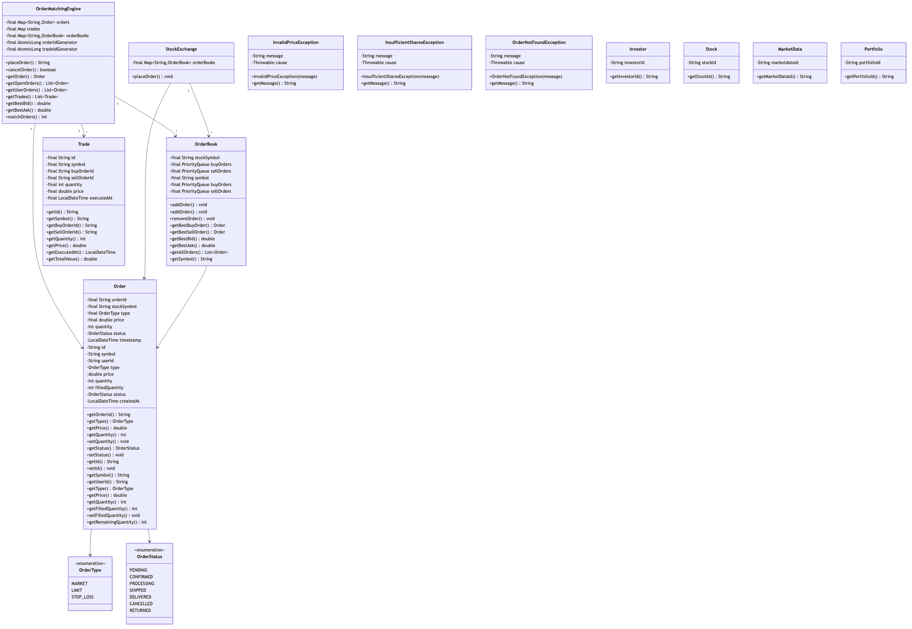

# Stock Exchange Trading System

## Overview
A high-performance stock exchange matching engine for executing buy/sell orders with multiple order types (market, limit, stop-loss), order matching algorithms (FIFO, Pro-Rata), order book management, and real-time trade execution. Implements price-time priority, partial fills, and atomic order matching.

**Difficulty:** Hard  
**Domain:** Financial Systems, Trading  
**Interview Frequency:** Very High (Trading firms, NASDAQ, NYSE, fintech companies)

## Requirements

### Functional Requirements
1. **Order Management**
   - Place orders (buy/sell)
   - Cancel orders
   - Modify orders
   - Order validation
   - Order book

2. **Order Types**
   - **Market Order:** Execute immediately at best price
   - **Limit Order:** Execute at specified price or better
   - **Stop-Loss Order:** Trigger when price reaches threshold
   - **Stop-Limit Order:** Combination of stop and limit
   - **Fill-or-Kill (FOK):** Execute entirely or cancel
   - **Immediate-or-Cancel (IOC):** Execute partial, cancel rest

3. **Matching Engine**
   - Match buy and sell orders
   - Price-time priority (FIFO)
   - Pro-rata matching (optional)
   - Partial fills
   - Atomic execution

4. **Trade Execution**
   - Generate trades
   - Update order book
   - Notify participants
   - Settlement
   - Trade history

5. **Market Data**
   - Real-time order book
   - Last traded price
   - Bid-ask spread
   - Trading volume
   - Historical data

6. **Risk Management**
   - Position limits
   - Exposure limits
   - Circuit breakers (halt trading)
   - Order validation

### Non-Functional Requirements
1. **Performance**
   - Order matching: < 1ms
   - Throughput: 100K+ orders/second
   - Sub-microsecond latency for matching

2. **Fairness**
   - Price-time priority
   - No front-running
   - Deterministic matching

3. **Availability**
   - 99.99% uptime
   - No trade loss
   - Disaster recovery

4. **Consistency**
   - ACID transactions
   - No double-fills
   - Atomic order matching


## Class Diagram



## System Architecture

```
┌────────────────────────────────────────────────┐
│          Trading Clients                        │
│   (Brokers, Algo Traders, Retail)             │
└────────────────┬───────────────────────────────┘
                 │
     ┌───────────▼────────────┐
     │   Order Gateway        │
     │  (Validate, Rate Limit)│
     └────────────┬───────────┘
                  │
     ┌────────────▼────────────┐
     │   Matching Engine       │
     │                         │
     │  - Match orders         │
     │  - Generate trades      │
     │  - Update order book    │
     └────────────┬────────────┘
                  │
     ┌────────────┼────────────┐
     │            │            │
┌────▼─────┐ ┌───▼──────┐ ┌──▼────────┐
│  Order   │ │  Trade   │ │  Market   │
│  Book    │ │  Engine  │ │   Data    │
│          │ │          │ │           │
│ Buy Side │ │ -Execute │ │ -Publish  │
│Sell Side │ │ -Settle  │ │ -Stream   │
└──────────┘ └──────────┘ └───────────┘
```

## Core Data Model

### 1. Order
```java
public class Order {
    private OrderId id;
    private UserId userId;
    private String symbol; // Stock symbol (e.g., "AAPL")
    private OrderSide side; // BUY or SELL
    private OrderType type;
    private BigDecimal price; // Null for market orders
    private long quantity;
    private long filledQuantity;
    private BigDecimal avgFillPrice;
    private OrderStatus status;
    private TimeInForce timeInForce;
    private LocalDateTime createdAt;
    private LocalDateTime updatedAt;
    
    public long getRemainingQuantity() {
        return quantity - filledQuantity;
    }
    
    public boolean isFilled() {
        return filledQuantity >= quantity;
    }
    
    public boolean isPartiallyFilled() {
        return filledQuantity > 0 && filledQuantity < quantity;
    }
    
    public void fill(long quantity, BigDecimal price) {
        this.filledQuantity += quantity;
        
        // Update average fill price
        BigDecimal totalValue = avgFillPrice.multiply(BigDecimal.valueOf(filledQuantity - quantity))
            .add(price.multiply(BigDecimal.valueOf(quantity)));
        this.avgFillPrice = totalValue.divide(BigDecimal.valueOf(filledQuantity), 
            2, RoundingMode.HALF_UP);
        
        if (isFilled()) {
            this.status = OrderStatus.FILLED;
        } else {
            this.status = OrderStatus.PARTIALLY_FILLED;
        }
        
        this.updatedAt = LocalDateTime.now();
    }
}

enum OrderSide {
    BUY,
    SELL
}

enum OrderType {
    MARKET,      // Execute at current market price
    LIMIT,       // Execute at specified price or better
    STOP_LOSS,   // Market order triggered at stop price
    STOP_LIMIT   // Limit order triggered at stop price
}

enum OrderStatus {
    PENDING,             // Order received, not yet processed
    OPEN,               // Active in order book
    PARTIALLY_FILLED,   // Partially executed
    FILLED,             // Fully executed
    CANCELLED,          // Cancelled by user
    REJECTED,           // Rejected by system
    EXPIRED             // Expired (e.g., day order at market close)
}

enum TimeInForce {
    GTC,  // Good Till Cancelled
    DAY,  // Day order (expires at market close)
    IOC,  // Immediate or Cancel
    FOK   // Fill or Kill
}
```

### 2. Order Book
```java
public class OrderBook {
    private String symbol;
    private TreeMap<BigDecimal, PriceLevel> buyOrders;  // Descending price
    private TreeMap<BigDecimal, PriceLevel> sellOrders; // Ascending price
    
    public OrderBook(String symbol) {
        this.symbol = symbol;
        this.buyOrders = new TreeMap<>(Comparator.reverseOrder());
        this.sellOrders = new TreeMap<>();
    }
    
    public void addOrder(Order order) {
        TreeMap<BigDecimal, PriceLevel> book = order.getSide() == OrderSide.BUY 
            ? buyOrders : sellOrders;
        
        PriceLevel level = book.computeIfAbsent(
            order.getPrice(), 
            price -> new PriceLevel(price)
        );
        
        level.addOrder(order);
    }
    
    public void removeOrder(Order order) {
        TreeMap<BigDecimal, PriceLevel> book = order.getSide() == OrderSide.BUY 
            ? buyOrders : sellOrders;
        
        PriceLevel level = book.get(order.getPrice());
        if (level != null) {
            level.removeOrder(order);
            
            if (level.isEmpty()) {
                book.remove(order.getPrice());
            }
        }
    }
    
    public BigDecimal getBestBid() {
        return buyOrders.isEmpty() ? null : buyOrders.firstKey();
    }
    
    public BigDecimal getBestAsk() {
        return sellOrders.isEmpty() ? null : sellOrders.firstKey();
    }
    
    public BigDecimal getSpread() {
        BigDecimal bid = getBestBid();
        BigDecimal ask = getBestAsk();
        
        if (bid == null || ask == null) {
            return null;
        }
        
        return ask.subtract(bid);
    }
    
    public int getDepth(OrderSide side, int levels) {
        TreeMap<BigDecimal, PriceLevel> book = side == OrderSide.BUY 
            ? buyOrders : sellOrders;
        
        return (int) book.values().stream()
            .limit(levels)
            .mapToLong(PriceLevel::getTotalQuantity)
            .sum();
    }
}
```

### 3. Price Level
```java
public class PriceLevel {
    private BigDecimal price;
    private Queue<Order> orders; // FIFO queue for price-time priority
    private long totalQuantity;
    
    public PriceLevel(BigDecimal price) {
        this.price = price;
        this.orders = new LinkedList<>();
        this.totalQuantity = 0;
    }
    
    public void addOrder(Order order) {
        orders.offer(order);
        totalQuantity += order.getRemainingQuantity();
    }
    
    public void removeOrder(Order order) {
        orders.remove(order);
        totalQuantity -= order.getRemainingQuantity();
    }
    
    public Order peekFirstOrder() {
        return orders.peek();
    }
    
    public boolean isEmpty() {
        return orders.isEmpty();
    }
}
```

### 4. Trade
```java
public class Trade {
    private TradeId id;
    private String symbol;
    private OrderId buyOrderId;
    private OrderId sellOrderId;
    private BigDecimal price;
    private long quantity;
    private UserId buyer;
    private UserId seller;
    private LocalDateTime executedAt;
    
    public BigDecimal getTotalValue() {
        return price.multiply(BigDecimal.valueOf(quantity));
    }
}
```

## Key Algorithms

### 1. Order Matching (Price-Time Priority / FIFO)
```java
public class MatchingEngine {
    private final Map<String, OrderBook> orderBooks;
    
    public List<Trade> matchOrder(Order incomingOrder) {
        OrderBook book = orderBooks.get(incomingOrder.getSymbol());
        List<Trade> trades = new ArrayList<>();
        
        if (incomingOrder.getType() == OrderType.MARKET) {
            trades.addAll(matchMarketOrder(incomingOrder, book));
        } else {
            trades.addAll(matchLimitOrder(incomingOrder, book));
        }
        
        // Add remaining quantity to order book if not fully filled
        if (incomingOrder.getRemainingQuantity() > 0 && 
            incomingOrder.getType() == OrderType.LIMIT) {
            book.addOrder(incomingOrder);
            incomingOrder.setStatus(OrderStatus.OPEN);
        }
        
        return trades;
    }
    
    private List<Trade> matchMarketOrder(Order order, OrderBook book) {
        List<Trade> trades = new ArrayList<>();
        
        // Get opposite side of order book
        TreeMap<BigDecimal, PriceLevel> oppositeBook = order.getSide() == OrderSide.BUY
            ? book.getSellOrders()
            : book.getBuyOrders();
        
        // Match with best prices first
        while (order.getRemainingQuantity() > 0 && !oppositeBook.isEmpty()) {
            Map.Entry<BigDecimal, PriceLevel> entry = oppositeBook.firstEntry();
            BigDecimal price = entry.getKey();
            PriceLevel level = entry.getValue();
            
            trades.addAll(matchAtPriceLevel(order, level, price));
            
            if (level.isEmpty()) {
                oppositeBook.remove(price);
            }
        }
        
        return trades;
    }
    
    private List<Trade> matchLimitOrder(Order order, OrderBook book) {
        List<Trade> trades = new ArrayList<>();
        
        // Get opposite side
        TreeMap<BigDecimal, PriceLevel> oppositeBook = order.getSide() == OrderSide.BUY
            ? book.getSellOrders()
            : book.getBuyOrders();
        
        // Match while order can be filled at acceptable price
        while (order.getRemainingQuantity() > 0 && !oppositeBook.isEmpty()) {
            Map.Entry<BigDecimal, PriceLevel> entry = oppositeBook.firstEntry();
            BigDecimal bestPrice = entry.getKey();
            
            // Check if price is acceptable
            boolean canMatch = order.getSide() == OrderSide.BUY
                ? bestPrice.compareTo(order.getPrice()) <= 0  // Buy: market price <= limit price
                : bestPrice.compareTo(order.getPrice()) >= 0; // Sell: market price >= limit price
            
            if (!canMatch) {
                break; // No more matches possible
            }
            
            PriceLevel level = entry.getValue();
            trades.addAll(matchAtPriceLevel(order, level, bestPrice));
            
            if (level.isEmpty()) {
                oppositeBook.remove(bestPrice);
            }
        }
        
        return trades;
    }
    
    private List<Trade> matchAtPriceLevel(Order incomingOrder, PriceLevel level, BigDecimal price) {
        List<Trade> trades = new ArrayList<>();
        
        // Match with orders in FIFO order (price-time priority)
        while (incomingOrder.getRemainingQuantity() > 0 && !level.isEmpty()) {
            Order restingOrder = level.peekFirstOrder();
            
            // Calculate trade quantity
            long tradeQuantity = Math.min(
                incomingOrder.getRemainingQuantity(),
                restingOrder.getRemainingQuantity()
            );
            
            // Create trade
            Trade trade = new Trade(
                generateTradeId(),
                incomingOrder.getSymbol(),
                incomingOrder.getSide() == OrderSide.BUY ? incomingOrder.getId() : restingOrder.getId(),
                incomingOrder.getSide() == OrderSide.SELL ? incomingOrder.getId() : restingOrder.getId(),
                price,
                tradeQuantity,
                incomingOrder.getSide() == OrderSide.BUY ? incomingOrder.getUserId() : restingOrder.getUserId(),
                incomingOrder.getSide() == OrderSide.SELL ? incomingOrder.getUserId() : restingOrder.getUserId(),
                LocalDateTime.now()
            );
            
            trades.add(trade);
            
            // Update orders
            incomingOrder.fill(tradeQuantity, price);
            restingOrder.fill(tradeQuantity, price);
            
            // Remove fully filled resting order
            if (restingOrder.isFilled()) {
                level.removeOrder(restingOrder);
            }
        }
        
        return trades;
    }
}
```

**Matching Logic:**
```
Buy Order: $100, Qty: 10
Sell Orders in book:
  $99: Qty 5
  $100: Qty 3
  $101: Qty 10

Matching:
1. Match 5 @ $99 (best price)
2. Match 3 @ $100
3. Match 2 @ $101
Total: 10 shares matched

Average Fill Price: (5*99 + 3*100 + 2*101) / 10 = $99.70
```

### 2. Order Validation
```java
public class OrderValidator {
    
    public void validate(Order order) throws OrderValidationException {
        // 1. Basic validation
        if (order.getQuantity() <= 0) {
            throw new OrderValidationException("Invalid quantity");
        }
        
        // 2. Price validation for limit orders
        if (order.getType() == OrderType.LIMIT && order.getPrice() == null) {
            throw new OrderValidationException("Limit order must have price");
        }
        
        if (order.getPrice() != null && order.getPrice().compareTo(BigDecimal.ZERO) <= 0) {
            throw new OrderValidationException("Invalid price");
        }
        
        // 3. Market validation (e.g., trading hours)
        if (!isMarketOpen()) {
            throw new OrderValidationException("Market is closed");
        }
        
        // 4. Symbol validation
        if (!isValidSymbol(order.getSymbol())) {
            throw new OrderValidationException("Invalid symbol");
        }
        
        // 5. Risk checks
        validateRiskLimits(order);
    }
    
    private void validateRiskLimits(Order order) throws OrderValidationException {
        // Check position limits
        long currentPosition = getPosition(order.getUserId(), order.getSymbol());
        long newPosition = order.getSide() == OrderSide.BUY
            ? currentPosition + order.getQuantity()
            : currentPosition - order.getQuantity();
        
        if (Math.abs(newPosition) > MAX_POSITION) {
            throw new OrderValidationException("Position limit exceeded");
        }
        
        // Check exposure limits
        BigDecimal exposure = calculateExposure(order.getUserId());
        BigDecimal newExposure = exposure.add(
            order.getPrice().multiply(BigDecimal.valueOf(order.getQuantity()))
        );
        
        if (newExposure.compareTo(MAX_EXPOSURE) > 0) {
            throw new OrderValidationException("Exposure limit exceeded");
        }
    }
}
```

### 3. Circuit Breaker (Trading Halt)
```java
public class CircuitBreaker {
    private static final BigDecimal THRESHOLD = new BigDecimal("0.10"); // 10%
    private BigDecimal referencePrice;
    private boolean isHalted;
    
    public void checkCircuitBreaker(String symbol, BigDecimal currentPrice) {
        if (referencePrice == null) {
            referencePrice = currentPrice;
            return;
        }
        
        BigDecimal change = currentPrice.subtract(referencePrice)
            .abs()
            .divide(referencePrice, 4, RoundingMode.HALF_UP);
        
        if (change.compareTo(THRESHOLD) > 0) {
            // Price moved more than 10%, halt trading
            isHalted = true;
            haltTrading(symbol);
            
            logger.warn("Circuit breaker triggered for {}: {}% change", symbol, 
                change.multiply(BigDecimal.valueOf(100)));
        }
    }
    
    public void resumeTrading(String symbol) {
        isHalted = false;
        referencePrice = getCurrentPrice(symbol);
        logger.info("Trading resumed for {}", symbol);
    }
}
```

### 4. Market Data Generation
```java
public class MarketDataService {
    
    public MarketData getMarketData(String symbol) {
        OrderBook book = getOrderBook(symbol);
        
        return MarketData.builder()
            .symbol(symbol)
            .lastPrice(getLastTradePrice(symbol))
            .bestBid(book.getBestBid())
            .bestAsk(book.getBestAsk())
            .bidSize(book.getDepth(OrderSide.BUY, 1))
            .askSize(book.getDepth(OrderSide.SELL, 1))
            .spread(book.getSpread())
            .volume(getTodayVolume(symbol))
            .high(getTodayHigh(symbol))
            .low(getTodayLow(symbol))
            .open(getTodayOpen(symbol))
            .timestamp(LocalDateTime.now())
            .build();
    }
    
    public List<OrderBookLevel> getOrderBookDepth(String symbol, int levels) {
        OrderBook book = getOrderBook(symbol);
        List<OrderBookLevel> depth = new ArrayList<>();
        
        // Add buy side
        int count = 0;
        for (Map.Entry<BigDecimal, PriceLevel> entry : book.getBuyOrders().entrySet()) {
            if (count >= levels) break;
            depth.add(new OrderBookLevel(
                OrderSide.BUY,
                entry.getKey(),
                entry.getValue().getTotalQuantity()
            ));
            count++;
        }
        
        // Add sell side
        count = 0;
        for (Map.Entry<BigDecimal, PriceLevel> entry : book.getSellOrders().entrySet()) {
            if (count >= levels) break;
            depth.add(new OrderBookLevel(
                OrderSide.SELL,
                entry.getKey(),
                entry.getValue().getTotalQuantity()
            ));
            count++;
        }
        
        return depth;
    }
}
```

## Design Patterns

### 1. Strategy Pattern (Order Types)
```java
interface OrderMatchingStrategy {
    List<Trade> match(Order order, OrderBook book);
}

class MarketOrderStrategy implements OrderMatchingStrategy {
    public List<Trade> match(Order order, OrderBook book) {
        // Match at any price
    }
}

class LimitOrderStrategy implements OrderMatchingStrategy {
    public List<Trade> match(Order order, OrderBook book) {
        // Match at limit price or better
    }
}
```

### 2. Observer Pattern (Trade Notifications)
```java
interface TradeObserver {
    void onTrade(Trade trade);
}

class MarketDataObserver implements TradeObserver {
    public void onTrade(Trade trade) {
        marketDataService.updateLastPrice(trade.getSymbol(), trade.getPrice());
    }
}

class UserNotificationObserver implements TradeObserver {
    public void onTrade(Trade trade) {
        notificationService.notifyUser(trade.getBuyer(), "Order filled");
        notificationService.notifyUser(trade.getSeller(), "Order filled");
    }
}
```

### 3. Command Pattern (Order Operations)
```java
interface OrderCommand {
    void execute();
    void undo();
}

class PlaceOrderCommand implements OrderCommand {
    private Order order;
    
    public void execute() {
        orderBook.addOrder(order);
    }
    
    public void undo() {
        orderBook.removeOrder(order);
    }
}
```

## Source Code

📄 **[View Complete Source Code](/problems/stockexchange/CODE)**

**Key Files:**
- [`MatchingEngine.java`](/problems/stockexchange/CODE#matchingenginejava) - Order matching
- [`OrderBook.java`](/problems/stockexchange/CODE#orderbookjava) - Order book management
- [`OrderValidator.java`](/problems/stockexchange/CODE#ordervalidatorjava) - Order validation
- [`MarketDataService.java`](/problems/stockexchange/CODE#marketdataservicejava) - Market data

**Total Lines of Code:** ~1000 lines

## Usage Example

```java
// Initialize exchange
StockExchange exchange = new StockExchange();

// Place limit buy order
Order buyOrder = Order.builder()
    .userId(userId)
    .symbol("AAPL")
    .side(OrderSide.BUY)
    .type(OrderType.LIMIT)
    .price(new BigDecimal("150.00"))
    .quantity(100)
    .timeInForce(TimeInForce.GTC)
    .build();

List<Trade> trades = exchange.placeOrder(buyOrder);

// Place market sell order
Order sellOrder = Order.builder()
    .userId(userId)
    .symbol("AAPL")
    .side(OrderSide.SELL)
    .type(OrderType.MARKET)
    .quantity(50)
    .build();

trades = exchange.placeOrder(sellOrder);

// Get market data
MarketData data = exchange.getMarketData("AAPL");
System.out.println("Bid: " + data.getBestBid());
System.out.println("Ask: " + data.getBestAsk());
System.out.println("Spread: " + data.getSpread());

// Cancel order
exchange.cancelOrder(buyOrder.getId());
```

## Common Interview Questions

### System Design Questions

1. **How do you ensure price-time priority?**
   - TreeMap for price levels (sorted)
   - FIFO queue per price level
   - Timestamp-based tie-breaking
   - Deterministic matching

2. **How do you handle high-frequency trading (HFT)?**
   - In-memory order book
   - Lock-free data structures
   - Co-location (proximity to exchange)
   - FPGA/hardware acceleration

3. **How do you scale to millions of orders?**
   - Partition by symbol
   - Separate matching engines per symbol
   - Horizontal scaling
   - Event sourcing

4. **How do you prevent front-running?**
   - Fair queuing (FIFO)
   - No order book peeking
   - Encrypted orders (dark pools)
   - Audit trails

### Coding Questions

1. **Match orders at price level**
   ```java
   List<Trade> matchAtLevel(Order incoming, PriceLevel level, BigDecimal price) {
       List<Trade> trades = new ArrayList<>();
       while (incoming.getRemainingQuantity() > 0 && !level.isEmpty()) {
           Order resting = level.peekFirstOrder();
           long qty = Math.min(incoming.getRemainingQuantity(), 
                               resting.getRemainingQuantity());
           trades.add(new Trade(incoming, resting, price, qty));
           incoming.fill(qty, price);
           resting.fill(qty, price);
           if (resting.isFilled()) level.removeOrder(resting);
       }
       return trades;
   }
   ```

2. **Calculate average fill price**
   ```java
   BigDecimal calculateAvgFillPrice(List<Trade> trades) {
       BigDecimal totalValue = BigDecimal.ZERO;
       long totalQty = 0;
       for (Trade trade : trades) {
           totalValue = totalValue.add(trade.getPrice().multiply(
               BigDecimal.valueOf(trade.getQuantity())));
           totalQty += trade.getQuantity();
       }
       return totalValue.divide(BigDecimal.valueOf(totalQty), 
           2, RoundingMode.HALF_UP);
   }
   ```

### Algorithm Questions
1. **Time complexity of order matching?** → O(log N + K) where N=price levels, K=matched orders
2. **Data structure for order book?** → TreeMap + Queue (price-time priority)
3. **How to calculate VWAP?** → Weighted average of prices by volume

## Trade-offs & Design Decisions

### 1. FIFO vs Pro-Rata Matching
**FIFO:** Fair, rewards early orders  
**Pro-Rata:** Rewards size, more liquidity

**Decision:** FIFO (more common in equities)

### 2. Continuous vs Batch Matching
**Continuous:** Real-time, complex  
**Batch:** Periodic auctions, simpler

**Decision:** Continuous (modern exchanges)

### 3. Centralized vs Distributed Matching
**Centralized:** Simple, single point of failure  
**Distributed:** Complex, scalable

**Decision:** Centralized with hot standby

### 4. In-Memory vs Persistent Order Book
**In-Memory:** Fast (< 1ms), volatile  
**Persistent:** Durable, slower

**Decision:** In-memory with event sourcing

## Key Takeaways

### What Interviewers Look For
1. ✅ **Price-time priority** implementation
2. ✅ **Order matching** algorithm
3. ✅ **Order book** data structures
4. ✅ **Performance** optimization
5. ✅ **Risk management** (circuit breakers)
6. ✅ **Fairness** guarantees

### Common Mistakes to Avoid
1. ❌ Not using proper data structures (TreeMap)
2. ❌ Breaking price-time priority
3. ❌ No partial fills
4. ❌ Missing order validation
5. ❌ No circuit breakers
6. ❌ Allowing front-running

### Production-Ready Checklist
- [x] Order matching
- [x] Price-time priority
- [x] Multiple order types
- [x] Order validation
- [x] Circuit breakers
- [ ] Settlement
- [ ] Clearing
- [ ] Dark pools
- [ ] Auction mechanism
- [ ] Historical data

---

## Related Problems
- 💱 **Currency Exchange** - Similar matching
- 📊 **Market Making** - Liquidity provision
- 🎮 **Game Marketplace** - Item trading
- 🏦 **Banking** - Transaction processing

## References
- NASDAQ Matching Engine: Order matching at scale
- Price-Time Priority: Fair order execution
- FIX Protocol: Financial trading protocol
- FPGA Trading: Hardware acceleration

---

*Production-ready stock exchange with order matching, price-time priority, and circuit breakers. Essential for trading and fintech interviews.*
