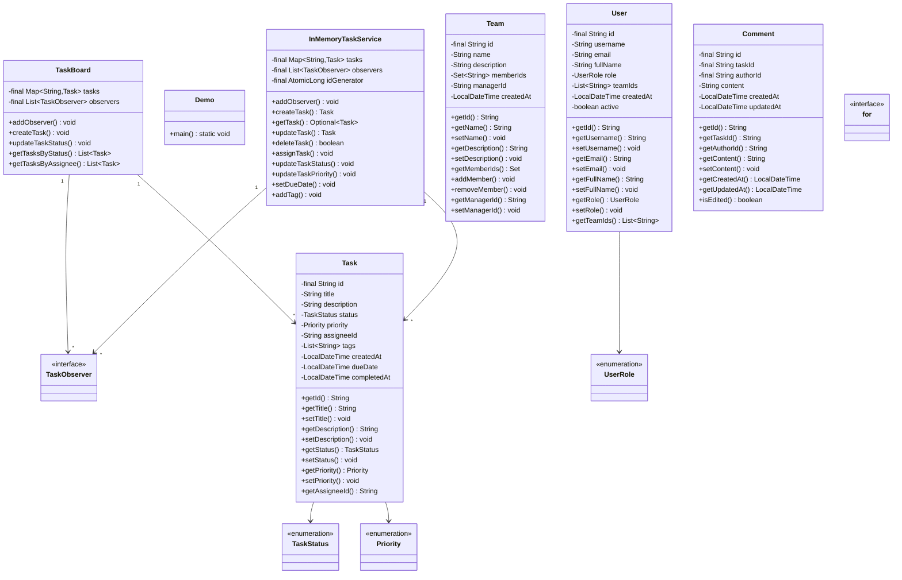
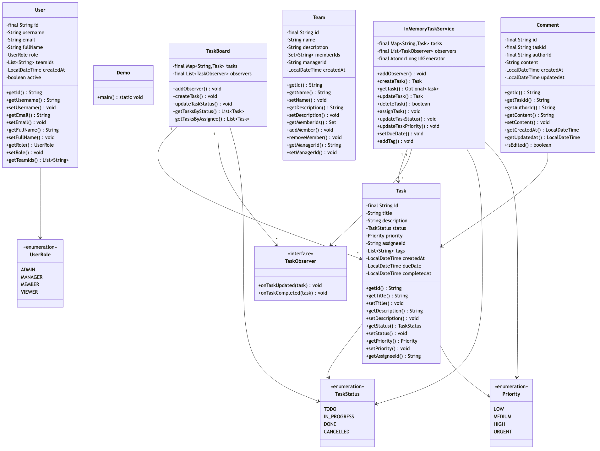

# Task Management System (Project Tracking)

## Overview
A comprehensive task and project management system supporting task creation, assignment, prioritization, progress tracking, dependencies, sprints, and team collaboration. Implements Kanban boards, Gantt charts, workload balancing, and notification systems for agile project management like Jira, Asana, or Trello.

**Difficulty:** Medium  
**Domain:** Project Management, Collaboration  
**Interview Frequency:** High (Atlassian, Asana, Monday.com, enterprise software companies)

## Requirements

### Functional Requirements
1. **Task Management**
   - Create/update/delete tasks
   - Task properties (title, description, priority, due date)
   - Task status (To Do, In Progress, Done)
   - Subtasks and checklists
   - Task estimates (time, story points)

2. **Assignment & Ownership**
   - Assign tasks to users
   - Multiple assignees
   - Task ownership
   - Watchers/followers
   - Workload distribution

3. **Project/Board Management**
   - Multiple projects/boards
   - Board types (Kanban, Scrum)
   - Columns/swim lanes
   - Board permissions
   - Project templates

4. **Task Dependencies**
   - Blocked by relationships
   - Subtasks
   - Parent-child hierarchy
   - Dependency validation

5. **Sprint Management**
   - Create sprints
   - Sprint planning
   - Sprint backlog
   - Velocity tracking
   - Burndown charts

6. **Filtering & Search**
   - Filter by status, assignee, priority
   - Search by keywords
   - Custom filters
   - Saved views

7. **Comments & Activity**
   - Task comments
   - Activity log
   - @mentions
   - File attachments

8. **Notifications**
   - Task assigned
   - Status changed
   - Comments added
   - Due date reminders

### Non-Functional Requirements
1. **Performance**
   - Task creation: < 100ms
   - Board load: < 1 second
   - Support 10K+ tasks per board

2. **Scalability**
   - Support 100K+ users
   - Real-time updates
   - Horizontal scaling

3. **Availability**
   - 99.9% uptime
   - Real-time collaboration
   - Offline mode support


## Class Diagram

<details>
<summary>View Mermaid Source</summary>



</details>



## System Architecture

```
┌────────────────────────────────────────────────┐
│         User Interface                          │
│   (Web App, Mobile App, Desktop)               │
└────────────────┬───────────────────────────────┘
                 │
     ┌───────────▼────────────┐
     │     API Gateway        │
     │  (Auth, Rate Limit)    │
     └────────────┬───────────┘
                  │
     ┌────────────┼────────────┐
     │            │            │
┌────▼─────┐ ┌───▼──────┐ ┌──▼────────┐
│  Task    │ │ Project  │ │Notification│
│ Service  │ │ Service  │ │  Service   │
│          │ │          │ │            │
│ -Create  │ │ -Boards  │ │ -Send      │
│ -Assign  │ │ -Sprints │ │ -Subscribe │
│ -Update  │ │ -Report  │ │ -Real-time │
└────┬─────┘ └───┬──────┘ └──┬─────────┘
     │           │            │
┌────▼───────────▼────────────▼─────┐
│          Database                  │
│  - Tasks                           │
│  - Projects                        │
│  - Users                           │
│  - Comments                        │
│  - Activity Log                    │
└────────────────────────────────────┘
```

## Core Data Model

### 1. Task
```java
public class Task {
    private TaskId id;
    private String title;
    private String description;
    private TaskType type;
    private TaskStatus status;
    private TaskPriority priority;
    private ProjectId projectId;
    private SprintId sprintId;
    private UserId assigneeId;
    private UserId reporterId;
    private List<UserId> watchers;
    private LocalDate dueDate;
    private int estimateHours;
    private int storyPoints;
    private List<TaskId> dependencies; // Blocked by
    private TaskId parentTaskId;
    private List<TaskId> subtasks;
    private List<String> tags;
    private LocalDateTime createdAt;
    private LocalDateTime updatedAt;
    
    public boolean canTransitionTo(TaskStatus newStatus) {
        return status.canTransitionTo(newStatus);
    }
    
    public boolean isOverdue() {
        return dueDate != null && 
               LocalDate.now().isAfter(dueDate) && 
               status != TaskStatus.DONE;
    }
    
    public boolean isBlocked() {
        return !dependencies.isEmpty() && 
               dependencies.stream()
                   .map(taskService::getTask)
                   .anyMatch(t -> t.getStatus() != TaskStatus.DONE);
    }
}

enum TaskType {
    STORY,      // User story
    TASK,       // Regular task
    BUG,        // Bug fix
    EPIC,       // Large feature (contains stories)
    SUBTASK     // Part of another task
}

enum TaskStatus {
    BACKLOG,
    TO_DO,
    IN_PROGRESS,
    IN_REVIEW,
    DONE,
    CLOSED,
    CANCELLED;
    
    public boolean canTransitionTo(TaskStatus newStatus) {
        // Define valid state transitions
        switch (this) {
            case BACKLOG:
                return newStatus == TO_DO || newStatus == CANCELLED;
            case TO_DO:
                return newStatus == IN_PROGRESS || newStatus == CANCELLED;
            case IN_PROGRESS:
                return newStatus == IN_REVIEW || newStatus == TO_DO || newStatus == CANCELLED;
            case IN_REVIEW:
                return newStatus == DONE || newStatus == IN_PROGRESS;
            case DONE:
                return newStatus == CLOSED || newStatus == IN_PROGRESS;
            case CLOSED:
                return false; // Terminal state
            case CANCELLED:
                return false; // Terminal state
            default:
                return false;
        }
    }
}

enum TaskPriority {
    CRITICAL(4),
    HIGH(3),
    MEDIUM(2),
    LOW(1);
    
    private int value;
    
    TaskPriority(int value) {
        this.value = value;
    }
    
    public int getValue() {
        return value;
    }
}
```

### 2. Project/Board
```java
public class Project {
    private ProjectId id;
    private String name;
    private String key; // e.g., "PROJ"
    private String description;
    private ProjectType type;
    private UserId ownerId;
    private List<UserId> members;
    private List<Column> columns;
    private ProjectStatus status;
    private LocalDateTime createdAt;
    
    public String generateTaskKey(int taskNumber) {
        return key + "-" + taskNumber;
    }
    
    public boolean isMember(UserId userId) {
        return members.contains(userId) || ownerId.equals(userId);
    }
}

enum ProjectType {
    KANBAN,     // Continuous flow
    SCRUM,      // Sprint-based
    CUSTOM      // Custom workflow
}

class Column {
    private String name;
    private int position;
    private TaskStatus mappedStatus;
    private int wip limit; // Work In Progress limit
    
    public boolean canAddTask() {
        return wipLimit == 0 || getCurrentTaskCount() < wipLimit;
    }
}
```

### 3. Sprint
```java
public class Sprint {
    private SprintId id;
    private String name;
    private ProjectId projectId;
    private LocalDate startDate;
    private LocalDate endDate;
    private SprintStatus status;
    private int capacity; // Team capacity in hours
    private int commitment; // Story points committed
    private LocalDateTime createdAt;
    
    public boolean isActive() {
        return status == SprintStatus.ACTIVE && 
               LocalDate.now().isBefore(endDate) &&
               LocalDate.now().isAfter(startDate);
    }
    
    public int getDurationDays() {
        return (int) ChronoUnit.DAYS.between(startDate, endDate);
    }
    
    public double getCompletionPercentage() {
        List<Task> sprintTasks = taskService.getTasksBySprintId(id);
        long completedPoints = sprintTasks.stream()
            .filter(t -> t.getStatus() == TaskStatus.DONE)
            .mapToInt(Task::getStoryPoints)
            .sum();
        
        return (double) completedPoints / commitment * 100;
    }
}

enum SprintStatus {
    PLANNED,    // Sprint created but not started
    ACTIVE,     // Sprint in progress
    COMPLETED,  // Sprint finished
    CANCELLED   // Sprint cancelled
}
```

### 4. Comment
```java
public class Comment {
    private CommentId id;
    private TaskId taskId;
    private UserId authorId;
    private String content;
    private CommentId parentCommentId; // For threaded replies
    private List<UserId> mentions;
    private LocalDateTime createdAt;
    private LocalDateTime updatedAt;
    private boolean isEdited;
    
    public void extractMentions() {
        // Extract @username mentions from content
        Pattern pattern = Pattern.compile("@\\w+");
        Matcher matcher = pattern.matcher(content);
        
        mentions = new ArrayList<>();
        while (matcher.find()) {
            String username = matcher.group().substring(1);
            UserId userId = userService.getUserIdByUsername(username);
            if (userId != null) {
                mentions.add(userId);
            }
        }
    }
}
```

### 5. Activity Log
```java
public class ActivityLog {
    private ActivityId id;
    private TaskId taskId;
    private UserId userId;
    private ActivityType type;
    private String field; // Field that changed (e.g., "status")
    private String oldValue;
    private String newValue;
    private LocalDateTime timestamp;
    
    public String getDescription() {
        User user = userService.getUser(userId);
        
        switch (type) {
            case CREATED:
                return user.getName() + " created the task";
            case UPDATED:
                return user.getName() + " changed " + field + 
                       " from \"" + oldValue + "\" to \"" + newValue + "\"";
            case COMMENTED:
                return user.getName() + " added a comment";
            case ASSIGNED:
                return user.getName() + " assigned the task to " + newValue;
            default:
                return user.getName() + " performed an action";
        }
    }
}

enum ActivityType {
    CREATED,
    UPDATED,
    COMMENTED,
    ASSIGNED,
    DELETED,
    STATUS_CHANGED,
    PRIORITY_CHANGED
}
```

## Key Algorithms

### 1. Task Assignment with Workload Balancing
```java
public class TaskAssignmentService {
    
    public UserId assignTaskAutomatically(TaskId taskId, ProjectId projectId) {
        Task task = taskService.getTask(taskId);
        Project project = projectService.getProject(projectId);
        
        // Get all project members
        List<UserId> members = project.getMembers();
        
        // Calculate current workload for each member
        Map<UserId, Integer> workload = new HashMap<>();
        
        for (UserId memberId : members) {
            List<Task> assignedTasks = taskService.getTasksByAssignee(memberId);
            
            int totalPoints = assignedTasks.stream()
                .filter(t -> t.getStatus() != TaskStatus.DONE)
                .filter(t -> t.getStatus() != TaskStatus.CANCELLED)
                .mapToInt(Task::getStoryPoints)
                .sum();
            
            workload.put(memberId, totalPoints);
        }
        
        // Find member with lowest workload
        UserId selectedMember = workload.entrySet().stream()
            .min(Map.Entry.comparingByValue())
            .map(Map.Entry::getKey)
            .orElse(members.get(0));
        
        // Assign task
        task.setAssigneeId(selectedMember);
        taskService.updateTask(task);
        
        // Log activity
        activityService.logAssignment(taskId, selectedMember);
        
        // Send notification
        notificationService.notifyTaskAssigned(task, selectedMember);
        
        return selectedMember;
    }
}
```

### 2. Dependency Validation (Cycle Detection)
```java
public class DependencyService {
    
    public void addDependency(TaskId taskId, TaskId dependsOnTaskId) {
        // Validate that adding this dependency won't create a cycle
        if (wouldCreateCycle(taskId, dependsOnTaskId)) {
            throw new CircularDependencyException(
                "Adding this dependency would create a cycle");
        }
        
        Task task = taskService.getTask(taskId);
        task.getDependencies().add(dependsOnTaskId);
        taskService.updateTask(task);
        
        // Update status if now blocked
        if (task.isBlocked()) {
            activityService.logTaskBlocked(taskId, dependsOnTaskId);
        }
    }
    
    private boolean wouldCreateCycle(TaskId taskId, TaskId dependsOnTaskId) {
        // Use DFS to detect cycle
        Set<TaskId> visited = new HashSet<>();
        Set<TaskId> recursionStack = new HashSet<>();
        
        return hasCycleDFS(dependsOnTaskId, taskId, visited, recursionStack);
    }
    
    private boolean hasCycleDFS(TaskId current, TaskId target, 
                                Set<TaskId> visited, Set<TaskId> recursionStack) {
        
        if (current.equals(target)) {
            return true; // Found cycle
        }
        
        if (visited.contains(current)) {
            return false;
        }
        
        visited.add(current);
        recursionStack.add(current);
        
        Task task = taskService.getTask(current);
        for (TaskId dependency : task.getDependencies()) {
            if (hasCycleDFS(dependency, target, visited, recursionStack)) {
                return true;
            }
        }
        
        recursionStack.remove(current);
        return false;
    }
    
    public List<TaskId> getTopologicalOrder(List<TaskId> taskIds) {
        // Topological sort for task execution order
        Map<TaskId, Integer> inDegree = new HashMap<>();
        Map<TaskId, List<TaskId>> graph = new HashMap<>();
        
        // Build graph and calculate in-degrees
        for (TaskId taskId : taskIds) {
            Task task = taskService.getTask(taskId);
            inDegree.put(taskId, task.getDependencies().size());
            
            for (TaskId dependency : task.getDependencies()) {
                graph.computeIfAbsent(dependency, k -> new ArrayList<>()).add(taskId);
            }
        }
        
        // BFS for topological sort
        Queue<TaskId> queue = new LinkedList<>();
        for (TaskId taskId : taskIds) {
            if (inDegree.get(taskId) == 0) {
                queue.offer(taskId);
            }
        }
        
        List<TaskId> result = new ArrayList<>();
        
        while (!queue.isEmpty()) {
            TaskId current = queue.poll();
            result.add(current);
            
            List<TaskId> dependents = graph.get(current);
            if (dependents != null) {
                for (TaskId dependent : dependents) {
                    inDegree.put(dependent, inDegree.get(dependent) - 1);
                    if (inDegree.get(dependent) == 0) {
                        queue.offer(dependent);
                    }
                }
            }
        }
        
        return result;
    }
}
```

### 3. Sprint Burndown Chart Data
```java
public class SprintAnalytics {
    
    public BurndownData calculateBurndown(SprintId sprintId) {
        Sprint sprint = sprintService.getSprint(sprintId);
        List<Task> sprintTasks = taskService.getTasksBySprintId(sprintId);
        
        int totalPoints = sprintTasks.stream()
            .mapToInt(Task::getStoryPoints)
            .sum();
        
        // Calculate ideal burndown line
        int sprintDays = sprint.getDurationDays();
        List<BurndownPoint> idealLine = new ArrayList<>();
        
        for (int day = 0; day <= sprintDays; day++) {
            int remainingPoints = totalPoints - (totalPoints * day / sprintDays);
            idealLine.add(new BurndownPoint(
                sprint.getStartDate().plusDays(day),
                remainingPoints
            ));
        }
        
        // Calculate actual burndown
        List<BurndownPoint> actualLine = new ArrayList<>();
        
        for (int day = 0; day <= ChronoUnit.DAYS.between(
                sprint.getStartDate(), LocalDate.now()); day++) {
            
            LocalDate date = sprint.getStartDate().plusDays(day);
            
            int remainingPoints = sprintTasks.stream()
                .filter(t -> !isCompletedByDate(t, date))
                .mapToInt(Task::getStoryPoints)
                .sum();
            
            actualLine.add(new BurndownPoint(date, remainingPoints));
        }
        
        return new BurndownData(idealLine, actualLine, totalPoints);
    }
    
    private boolean isCompletedByDate(Task task, LocalDate date) {
        List<ActivityLog> statusChanges = activityService.getActivityLogs(
            task.getId(),
            ActivityType.STATUS_CHANGED
        );
        
        return statusChanges.stream()
            .filter(log -> log.getNewValue().equals("DONE"))
            .anyMatch(log -> log.getTimestamp().toLocalDate().isBefore(date) ||
                            log.getTimestamp().toLocalDate().isEqual(date));
    }
}

class BurndownPoint {
    private LocalDate date;
    private int remainingPoints;
    
    public BurndownPoint(LocalDate date, int remainingPoints) {
        this.date = date;
        this.remainingPoints = remainingPoints;
    }
}
```

### 4. Task Prioritization Algorithm
```java
public class TaskPrioritizationService {
    
    public List<Task> prioritizeTasks(List<Task> tasks) {
        // Multi-factor prioritization
        return tasks.stream()
            .map(task -> new ScoredTask(task, calculatePriorityScore(task)))
            .sorted(Comparator.comparingDouble(ScoredTask::getScore).reversed())
            .map(ScoredTask::getTask)
            .collect(Collectors.toList());
    }
    
    private double calculatePriorityScore(Task task) {
        double score = 0.0;
        
        // 1. Base priority (40%)
        score += task.getPriority().getValue() * 10.0;
        
        // 2. Due date urgency (30%)
        if (task.getDueDate() != null) {
            long daysUntilDue = ChronoUnit.DAYS.between(
                LocalDate.now(), task.getDueDate());
            
            if (daysUntilDue < 0) {
                score += 15.0; // Overdue
            } else if (daysUntilDue <= 3) {
                score += 12.0; // Due very soon
            } else if (daysUntilDue <= 7) {
                score += 8.0;  // Due soon
            } else {
                score += 4.0;  // Future
            }
        }
        
        // 3. Dependencies (20%)
        int dependentTaskCount = getDependentTaskCount(task.getId());
        score += Math.min(dependentTaskCount * 2.0, 8.0);
        
        // 4. Age (10%)
        long daysOld = ChronoUnit.DAYS.between(
            task.getCreatedAt().toLocalDate(), LocalDate.now());
        score += Math.min(daysOld * 0.1, 4.0);
        
        return score;
    }
}
```

## Design Patterns

### 1. State Pattern (Task Status)
```java
interface TaskState {
    void moveToNextState(Task task);
    void moveToPreviousState(Task task);
    boolean canTransitionTo(TaskStatus status);
}

class TodoState implements TaskState {
    public void moveToNextState(Task task) {
        task.setStatus(TaskStatus.IN_PROGRESS);
    }
    
    public boolean canTransitionTo(TaskStatus status) {
        return status == TaskStatus.IN_PROGRESS || 
               status == TaskStatus.CANCELLED;
    }
}
```

### 2. Observer Pattern (Task Updates)
```java
interface TaskObserver {
    void onTaskCreated(Task task);
    void onTaskUpdated(Task task, String field, Object oldValue, Object newValue);
    void onTaskDeleted(Task task);
}

class NotificationObserver implements TaskObserver {
    public void onTaskUpdated(Task task, String field, Object oldValue, Object newValue) {
        if ("assigneeId".equals(field)) {
            notificationService.notifyAssignmentChange(task, (UserId) newValue);
        }
    }
}

class ActivityLogObserver implements TaskObserver {
    public void onTaskUpdated(Task task, String field, Object oldValue, Object newValue) {
        activityService.logChange(task.getId(), field, 
            oldValue.toString(), newValue.toString());
    }
}
```

### 3. Strategy Pattern (Sprint Planning)
```java
interface SprintPlanningStrategy {
    List<Task> selectTasksForSprint(Sprint sprint, List<Task> backlog);
}

class VelocityBasedPlanning implements SprintPlanningStrategy {
    public List<Task> selectTasksForSprint(Sprint sprint, List<Task> backlog) {
        int velocity = calculateTeamVelocity();
        List<Task> selected = new ArrayList<>();
        int totalPoints = 0;
        
        for (Task task : backlog) {
            if (totalPoints + task.getStoryPoints() <= velocity) {
                selected.add(task);
                totalPoints += task.getStoryPoints();
            }
        }
        
        return selected;
    }
}
```

## Source Code

📄 **[View Complete Source Code](/problems/taskmanagement/CODE)**

**Key Files:**
- [`TaskService.java`](/problems/taskmanagement/CODE#taskservicejava) - Task management
- [`ProjectService.java`](/problems/taskmanagement/CODE#projectservicejava) - Project/board operations
- [`SprintService.java`](/problems/taskmanagement/CODE#sprintservicejava) - Sprint management
- [`DependencyService.java`](/problems/taskmanagement/CODE#dependencyservicejava) - Task dependencies

**Total Lines of Code:** ~1300 lines

## Usage Example

```java
// Create project
Project project = new Project("My Project", "MYPROJ", ProjectType.SCRUM);
projectService.createProject(project);

// Create sprint
Sprint sprint = new Sprint("Sprint 1", project.getId(), 
    LocalDate.now(), LocalDate.now().plusWeeks(2), 40);
sprintService.createSprint(sprint);

// Create task
Task task = Task.builder()
    .title("Implement user authentication")
    .description("Add login and signup functionality")
    .type(TaskType.STORY)
    .priority(TaskPriority.HIGH)
    .projectId(project.getId())
    .sprintId(sprint.getId())
    .storyPoints(5)
    .build();

taskService.createTask(task);

// Assign task
taskService.assignTask(task.getId(), userId);

// Update task status
taskService.updateTaskStatus(task.getId(), TaskStatus.IN_PROGRESS);

// Add comment
commentService.addComment(task.getId(), userId, 
    "Started working on this task");

// Get burndown data
BurndownData burndown = sprintAnalytics.calculateBurndown(sprint.getId());
```

## Common Interview Questions

### System Design Questions

1. **How do you prevent circular dependencies?**
   - DFS cycle detection
   - Validate before adding dependency
   - Topological sort for task ordering

2. **How do you handle real-time collaboration?**
   - WebSocket for live updates
   - Optimistic UI updates
   - Conflict resolution (last-write-wins)
   - Version vectors

3. **How do you scale to millions of tasks?**
   - Database sharding by project ID
   - Separate hot projects
   - Archive old tasks
   - Read replicas for queries

4. **How do you calculate sprint velocity?**
   - Average story points completed in last N sprints
   - Exclude outliers
   - Adjust for team size changes

### Coding Questions

1. **Detect circular dependency**
   ```java
   boolean hasCycle(TaskId start, TaskId target) {
       Set<TaskId> visited = new HashSet<>();
       return dfs(start, target, visited);
   }
   
   boolean dfs(TaskId curr, TaskId target, Set<TaskId> visited) {
       if (curr.equals(target)) return true;
       if (visited.contains(curr)) return false;
       visited.add(curr);
       for (TaskId dep : getTask(curr).getDependencies()) {
           if (dfs(dep, target, visited)) return true;
       }
       return false;
   }
   ```

2. **Calculate workload**
   ```java
   int calculateWorkload(UserId userId) {
       return getTasks(userId).stream()
           .filter(t -> t.getStatus() != TaskStatus.DONE)
           .mapToInt(Task::getStoryPoints)
           .sum();
   }
   ```

### Algorithm Questions
1. **Time complexity of cycle detection?** → O(V + E) using DFS
2. **How to find critical path?** → Longest path in DAG
3. **Topological sort for tasks?** → Kahn's algorithm: O(V + E)

## Trade-offs & Design Decisions

### 1. Kanban vs Scrum
**Kanban:** Continuous flow, flexible  
**Scrum:** Sprint-based, structured

**Decision:** Support both (configurable)

### 2. Real-time vs Polling
**Real-time (WebSocket):** Instant updates, complex  
**Polling:** Simple, delayed updates

**Decision:** WebSocket for active boards

### 3. Optimistic vs Pessimistic Locking
**Optimistic:** Fast, conflicts possible  
**Pessimistic:** Slow, no conflicts

**Decision:** Optimistic (rare conflicts)

### 4. Rich vs Simple Task Model
**Rich:** Feature-heavy, complex  
**Simple:** Easy to use, limited

**Decision:** Rich with progressive disclosure

## Key Takeaways

### What Interviewers Look For
1. ✅ **Task dependencies** (graph algorithms)
2. ✅ **State management** (valid transitions)
3. ✅ **Workload balancing** algorithms
4. ✅ **Sprint analytics** (burndown)
5. ✅ **Real-time updates** architecture
6. ✅ **Scalability** considerations

### Common Mistakes to Avoid
1. ❌ Allowing circular dependencies
2. ❌ No state validation
3. ❌ Poor workload distribution
4. ❌ Missing activity logging
5. ❌ No real-time updates
6. ❌ Inefficient dependency checks

### Production-Ready Checklist
- [x] Task CRUD
- [x] Assignment
- [x] Dependencies
- [x] Sprints
- [x] Comments
- [x] Activity log
- [ ] Time tracking
- [ ] File attachments
- [ ] Integrations (GitHub, Slack)
- [ ] Custom fields
- [ ] Reports/dashboards

---

## Related Problems
- 📊 **Project Management** - Resource allocation
- 📅 **Calendar** - Scheduling
- 👥 **Team Collaboration** - Communication
- 📈 **Analytics** - Reporting

## References
- Jira: Industry-leading task management
- Agile/Scrum: Project methodology
- Graph Algorithms: Dependency management
- WebSocket: Real-time updates

---

*Production-ready task management with dependencies, sprints, and workload balancing. Essential for project management and collaboration tool interviews.*
